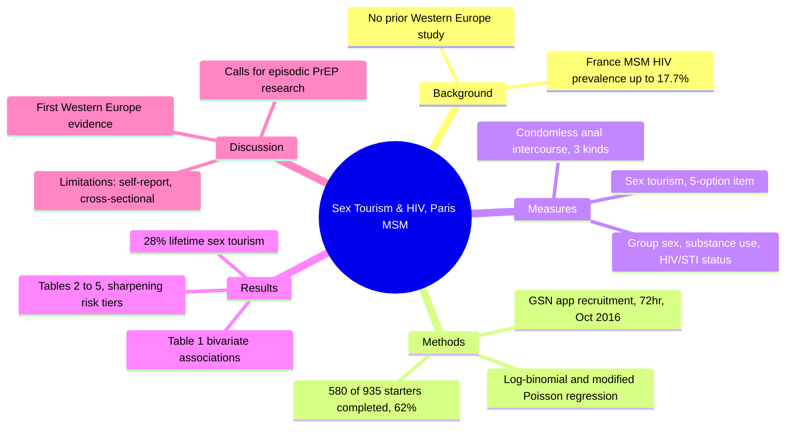
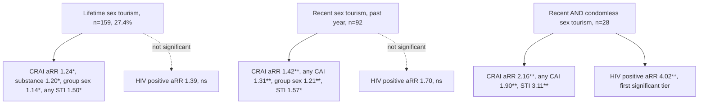
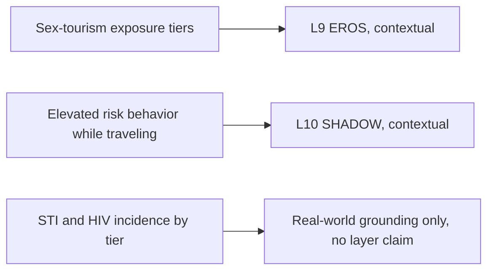

# BVX.1129 — Sex Tourism, Condomless Anal Intercourse, and HIV Risk Among Men Who Have Sex With Men — Harry-Hernández et al. (2019)
### Knowledge Entry — Distill

A cross-sectional survey of 580 dating-app-using MSM in Paris, the first study of sex tourism and sexual health in Western European MSM, finding that sex tourism history predicts elevated STI and risk-behavior rates but only predicts HIV-positive status at the highest exposure tier.

## TABLE OF CONTENTS
- [Core Thesis](#1-core-thesis)
- [Mind Models](#2-mind-models)
- [Framework](#3-framework--structure)
- [Key Concepts](#4-key-concepts)
- [Heuristics](#5-heuristics--decision-rules)
- [Invariants](#6-invariants)
- [Pitfalls](#7-pitfalls--myths)
- [Application](#8-application)
- [Cross-References](#9-cross-references)
- [Provenance](#10-provenance--confidence)

---

## 1 · CORE THESIS

Among 580 Paris-based MSM surveyed on a geosocial networking app, 28% reported lifetime sex tourism, and it independently predicted condomless receptive anal intercourse, substance use during sex, group sex, and any STI diagnosis. HIV-positive status was not significantly elevated at the lifetime-sex-tourism level; it only became significant in the smallest, highest-risk subgroup, men reporting both recent and condomless sex tourism (aRR 4.02).

---

## 2 · MIND MODELS

*Required. Minimum two diagrams, maximum five. See template §C for the rules.*

**Diagram 1 — the whole argument.**
Caption: *one study, four parts, a background gap, a five-tier sex-tourism measure, a bivariate table, then four regression tables that sharpen from "any sex tourism" to "recent and condomless."*

**Diagram 2 — the central mechanism (the risk-tier gradient).**
Caption: *the same outcomes get asked three times, at lifetime, recent, and recent-plus-condomless tiers, and the risk ratios climb each time; HIV positivity is the outcome that only clears significance at the narrowest, riskiest tier.*

**Diagram 3 — mapped onto the Command's systems.**
Caption: *the study supplies real-world statistical texture, not a character mechanism, so its terms land as contextual grounding for two layers rather than a primary claim on any one.*

---

## 3 · FRAMEWORK / STRUCTURE

Standard IMRaD research-article shape, four movements.

| Section | Pages | What it does |
|---|---|---|
| **Introduction** | 405–406 | Reviews sex-tourism/MSM literature (US, Chinese, Caribbean, African samples), notes zero prior Western European studies despite high regional HIV prevalence, states the study's purpose |
| **Methods** | 406–407 | Sample recruitment (GSN app banner ad, Paris, Oct 2016), five operational measures, statistical plan (log-binomial, fallback modified Poisson) |
| **Results** | 407–412 | Table 1 bivariate chi-square associations, Tables 2–5 adjusted regression across three sex-tourism definitions (lifetime, recent, recent-and-condomless) |
| **Discussion** | 412–414 | Compares findings to prior literature, sets a future-research agenda (episodic PrEP, partner-type detail, local-vs-international nuance), states limitations, closes with Key Considerations and Conclusion |

---

## 4 · KEY CONCEPTS

| Concept | What it is | Why it matters |
|---|---|---|
| **Sex tourism (operational definition)** | "Have you ever gone on a vacation or selected a vacation site with the main goal of having anal intercourse with or without a condom with one or more partners?" — 5 response options (p. 407) | A generic travel-motive item, not a paid-sex or commercial-sex-worker item; the study cannot distinguish partner type |
| **Three measurement tiers** | Lifetime (any yes), recent (yes in the past year, condom status either), recent-and-condomless (yes without a condom in the past year, n=28) | The paper's central design move — same outcomes re-tested at each tier, producing the dose-response gradient in Diagram 2 |
| **GSN recruitment** | Banner ad on a popular MSM dating app, EN/French, run 72 consecutive hours in October 2016; forward-translated/backtranslated via Harkness et al.'s (2003) cross-cultural survey method | 5,206 clicked through, 935 began, 580 completed (62% completion), all app-users in Paris — shapes the generalizability limits |
| **Condomless anal intercourse (CAI)** | Insertive and receptive counted separately, past 3 months, dichotomized 0 vs. 1+ partners; "any CAI" combines both | CRAI (receptive) is the outcome most consistently tied to sex tourism across all three tiers; insertive CAI never reaches significance |
| **Group sex** | "Sex with 3 or more people during a single sexual encounter," dichotomized yes/no | 65.2% of the full sample reported ever engaging in group sex; significantly elevated among sex tourists at every tier |
| **Substance use during sex** | Any self-or-partner alcohol/drug use before or during sex, past 3 months | Called "crude" by the authors themselves (p. 413); still significant across tiers |
| **HIV/STI status** | Self-reported HIV status (negative/positive/unknown, 12.4% unknown recoded negative); 6 named STIs (gonorrhea, chlamydia, syphilis, HSV, HPV, hepatitis C) plus a composite any-STI variable | Only 10% of the sample reported HIV-positive status; 22.2% reported any STI in the past year |
| **Log-binomial / modified Poisson regression** | Primary model log-binomial; switched to modified Poisson with robust variance (Zou, 2004) when the log-binomial model failed to converge | Standard epidemiological handling for binary outcomes with adjusted risk ratios (aRR) rather than odds ratios |
| **Adjustment set** | Every aRR is adjusted for age, sexual orientation, born-in-France status, employment, and relationship status | Controls for the demographic confounds the bivariate Table 1 already flagged (age p=.006, relationship status p=.046) |

---

## 5 · HEURISTICS & DECISION RULES

| Situation | Do this | Not this |
|---|---|---|
| Grounding a sex-tourist MSM character's HIV-risk plausibility | Tie elevated HIV likelihood to the recent-and-condomless tier specifically (aRR 4.02, n=28) | Attach HIV risk to "has a sex tourism history" generically (lifetime tier shows no significant HIV association, aRR 1.39 ns) |
| Writing risk behavior around a sex-tourism plot beat | Pair it with companion behaviors the data shows travel together, group sex (65% overall) and substance use (50%+) | Write sex tourism as an isolated behavior with no accompanying risk-taking |
| Deciding who a sex-tourist character has sex with | Leave partner type (commercial sex worker vs. fellow traveler vs. local) as an open narrative choice | Claim the study specifies partner type — it explicitly does not (limitation, p. 413) |
| Citing a specific STI risk for texture | Use gonorrhea (aRR 2.18) or chlamydia (aRR 2.03) as the strongest single-STI findings | Cite HSV or syphilis as significant findings — both were non-significant here (p. 410) |
| Setting the story's geography | Use this only for a Paris/GSN-app-recruited-MSM population; do not extend its numbers to other cities or countries | Generalize this sample's 28%/62%/etc. figures as universal MSM statistics |

---

## 6 · INVARIANTS

1. Sex tourism history correlates with several elevated risk behaviors (condomless receptive anal intercourse, substance use, group sex) and any-STI diagnosis, at every measurement tier.
2. HIV-positive status is not significantly elevated by sex tourism alone; it only reaches significance in the narrowest, highest-exposure subgroup (recent and condomless, n=28, aRR 4.02).
3. Condomless *receptive* anal intercourse is the behavior most consistently tied to sex tourism; condomless *insertive* anal intercourse never reaches significance at any tier.
4. The study is correlational, cross-sectional, self-reported survey data; the authors themselves state it cannot support causal inference.
5. The sample is a single GSN dating app's users in Paris over a 72-hour window; generalizability to all MSM, or all Western European MSM, is explicitly limited.
6. The sex-tourism measure does not identify partner type, location, or number of condomless events — only whether the respondent ever/recently/condomlessly traveled with that intent.

---

## 7 · PITFALLS / MYTHS

- Conflating "sex tourism" as measured here with paid/commercial sex tourism — the item is about travel motive, not payment.
- Assuming any history of sex tourism raises HIV risk — only the recent-and-condomless subgroup shows a significant HIV association; the broader lifetime measure does not.
- Treating this as a study of "risk-taking on vacation" in general — it measures MSM who traveled *specifically intending* anal intercourse, not incidental vacation sex.
- Assuming the sample speaks for all MSM or all Western Europe — single app, single city, single 72-hour recruitment window, volunteer bias explicitly noted by the authors (p. 413).
- Reading the STI panel as uniformly elevated — syphilis and HSV showed elevated point estimates but were not statistically significant; only gonorrhea, chlamydia, HPV, and the "any 3/4 STIs" composites cleared significance.

---

## 8 · APPLICATION

- **Spine level:** TEXTURE — this is real-world statistical grounding, not a story-structural source; it supplies verisimilitude for scenes or backstory involving gay male sex tourism, condomless sex, or HIV/STI risk, not plot architecture.
- **12-layer character stack:** contextual only, on **L9 EROS** (a risk-pattern shape for a sexually active MSM character's intimacy mode, scaled to recency/condom use) and **L10 SHADOW** (travel as a documented disinhibition context). Neither is the source's own claim — the paper makes no psychological argument, it reports correlational epidemiology. Nothing here rises to primary or supporting strength.
- **plot_systems:** not applicable; no mechanism or conflict-engine claim in the source.
- **Setting:** no confirmed tie to an active Command story or setting as of this distill; flagged honestly rather than forced. If the Command later writes a gay-nightlife/travel milieu (Paris, resort, circuit-party adjacent), this entry's numbers (28% lifetime engagement, the behavior-cluster pattern, the specific aRRs) are the citable grounding.

This entry sits alongside [[PSY.03]] (Dean, *Unlimited Intimacy*) at the ORANGE/MSX shelf: Dean supplies the subcultural meaning-making around condomless sex among gay men (barebacking as chosen kinship practice, not just risk); this article supplies the population-level statistics for a related but distinct behavior (sex tourism) in a different population (Paris GSN-app users, not specifically the bareback subculture). Read together they give both the numbers and the meaning, for two different corners of the same real-world territory.

---

## 9 · CROSS-REFERENCES

| Related entry | Relation |
|---|---|
| [[PSY.03]] | Dean's *Unlimited Intimacy* gives the subcultural/meaning-making frame for condomless sex among gay men; this article gives population-level statistics for a related but distinct behavior (sex tourism) in a different sample |
| [[MSX.12]] | *The Faggot Bible* is general gay-male life/culture guidance from inside the community; this article is outside-in public-health survey research on a narrower behavior |

---

## 10 · PROVENANCE & CONFIDENCE

Sourced from a full `pdftotext -layout` extraction of all 10 pages (pp. 405–414, plus references), read in full including all five data tables. The text layer is clean and complete; the only degradation is cosmetic, non-ASCII characters (accented letters in author names, interpunct separators, en-dashes in number ranges) render as a replacement glyph (`�`) rather than dropping content, and all numeric values, p-values, aRRs, and confidence intervals were cross-checked directly against the table text as extracted. No numeric claim in this distill is original; all are the article's own reported statistics. Zotero was not checked for a matching record (not run this pass); `zotero_key` is left blank rather than guessed.

## META
- Template: BVX-LEARN-v4.0
- Source classification: full-text pdftotext extraction, complete read (all 10 pages, all 5 tables)
- Created / Updated: 2026-09-24
