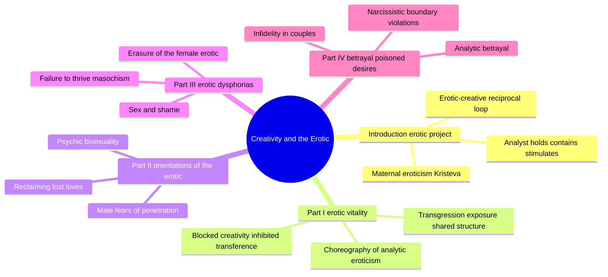
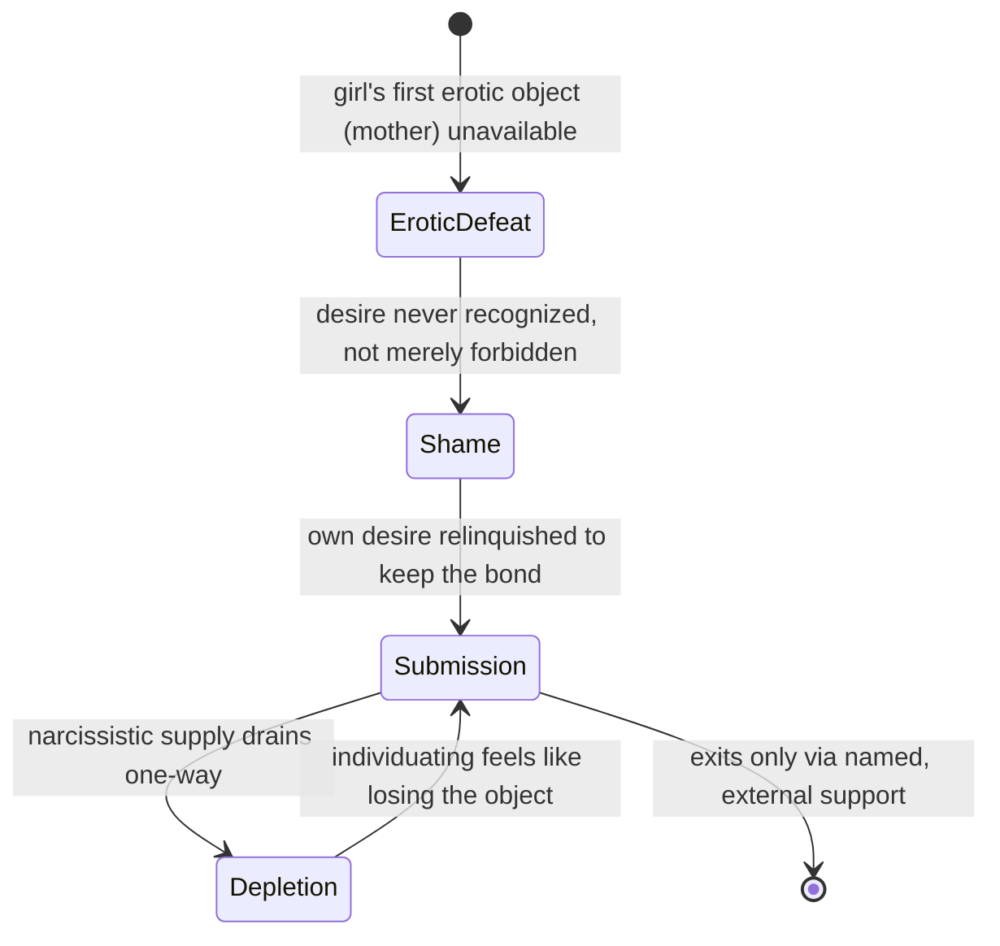
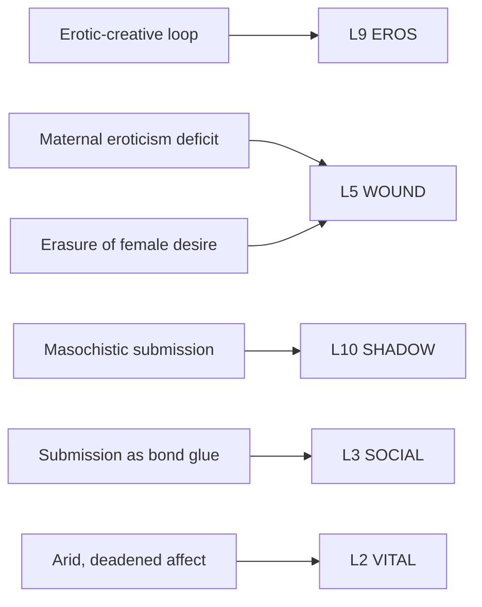

# BVX.1130 — Creativity and the Erotic Dimensions of the Analytic Field — Dianne Elise (2019)
### Knowledge Entry — Distill

A psychoanalyst collects 25 years of papers arguing that erotic vitality and creative capacity are one engine, not two, both traceable to a mother's own libidinal aliveness toward her infant — and that when that eroticism is missing or later erased, especially in female development, desire and creativity block together.

## TABLE OF CONTENTS
- [Core Thesis](#1-core-thesis)
- [Mind Models](#2-mind-models)
- [Framework](#3-framework--structure)
- [Key Concepts](#4-key-concepts)
- [Heuristics](#5-heuristics--decision-rules)
- [Invariants](#6-invariants)
- [Pitfalls](#7-pitfalls--myths)
- [Application](#8-application)
- [Cross-References](#9-cross-references)
- [Provenance](#10-provenance--confidence)

---

## 1 · CORE THESIS

Erotic vitality and creative capacity reinforce each other in what Elise calls the erotic-creativity-personality-expansion loop, rooted in a mother's own libidinal aliveness toward her infant. When that maternal eroticism is deficient or later defensively erased — as when a girl's oedipal desire for her mother goes unrecognized rather than forbidden — creativity, desire, and self-assertion block together, not as three separate problems.

---

## 2 · MIND MODELS

*Required. Minimum two diagrams, maximum five. See template §C for the rules.*

**Diagram 1 — the whole argument.**
Caption: *twelve papers regrouped into four parts, moving from the erotic engine itself, to its gendered orientations, to its specifically female erasure, to what happens when it goes wrong.*

**Diagram 2 — the central mechanism.**
Caption: *the three terms drive each other in both directions — starve one and the other two stall, not just the starved term itself.*

**Diagram 3 — the masochistic submission trap (Ch.9).**
Caption: *this is a two-generation-deep loop, not a single bad choice: an unrecognized childhood erotic defeat becomes an adult strategy that only deepens itself, and it exits only with outside help.*

**Diagram 4 — mapped onto the Command's 12-layer character stack.**
Caption: *the book's terms cluster on the erotic-vitality and wound-defense axis, with SOCIAL picking up submission's function as a bond strategy rather than a private symptom.*

---

## 3 · FRAMEWORK / STRUCTURE

Four parts, each building on the erotic-creative engine the introduction sets up.

| Cluster | Chapters | Governing question |
|---|---|---|
| **Introduction** | Might we think of psychoanalysis as an erotic project? | What is "the erotic," and why has psychoanalysis fled from it since Freud? |
| **Part I: erotic vitality in analytic process** | 1 Moving from within the maternal · 2 Desire and disruption · 3 Blocked creativity and inhibited erotic transference | How does the analyst's own erotic aliveness (not just the patient's) function as a clinical instrument, and what happens when it, or its counterpart in the patient, is defended against? |
| **Part II: potential space and orientations of the erotic** | 4 Psychic bisexuality and creativity · 5 Male fears of psychic penetration · 6 Reclaiming lost loves | How do gendered defenses (phallic inflation, feared penetration) shape the erotic-creative repertoire available to a person? |
| **Part III: women and desire, erotic dysphorias** | 7 Sex and shame · 8 Erasure of the female erotic · 9 Failure to thrive: masochistic submission | Why does female desire specifically go missing — theorized as absence rather than asked about — and what does the resulting shame produce behaviorally? |
| **Part IV: erotic betrayal and poisoned desires** | 10 Infidelity and the betrayal of truth · 11 Betrayal and the loss of goodness in the analytic relationship · 12 Narcissistic seductions and the collapse of the creative | What happens, in a couple or in the clinic, when erotic energy is misdirected rather than held? |

The book's own spine: establish the erotic engine and its clinical use (Part I), differentiate it by gender-specific orientation (Part II), diagnose its specifically female erasure and the masochism that follows (Part III), then survey its corruption into betrayal and boundary violation (Part IV).

---

## 4 · KEY CONCEPTS

| Concept | What it is | Why it matters |
|---|---|---|
| **Maternal eroticism** (Kristeva, 2014) | The libidinal, embodied vitality a mother brings to infant care — not an idealized, conflict-free bond; it includes frustration, limits, and "feistiness" | The book's developmental origin point for all downstream erotic and creative capacity; its deficit, not its presence, is theorized as pathological |
| **Analytic eroticism** | The analyst's own erotic vitality, used aesthetically (not acted out) as a third clinical function alongside Winnicott's holding and Bion's containing | Reframes "the analyst holds, contains, and stimulates" — stimulation via eroticism is proposed as an under-named clinical capacity |
| **Choreography metaphor** | A patterned, symbolic narrative that retains embodied affect — dance (spontaneous) becomes choreography (structured, recallable) | Names how session-shaping and treatment-arc-shaping combine improvisation with retained pattern, illustrated in the "still and arid landscape" case (Sue, a deadened patient with "no receptor sites" for the analyst's libidinal energy) |
| **Erotic transference resistance** | Treatment can defend against erotic transference as much as express it; absence of overt erotic material is not automatically a null finding | Clinical case (Jan): an inhibited, barely-visible erotic transference tracked in lockstep with her blocked career as a writer |
| **Primary maternal oedipal situation** | A girl's oedipal desire for her mother — unlike a boy's desire, which is acknowledged and then forbidden — is typically erased, made invisible, never recognized as desire at all | The theoretical hinge connecting Chapters 2, 3, 7, 8, and 9; explains why female-female erotic transference is so often missed by both parties |
| **Couch relations** | Physical positioning (lying down vs. sitting, who is "on top") carries gendered erotic valence that shifts by dyad — it can suppress erotic transference for some pairings and amplify it for others | Names an unexamined structural variable in technique, illustrated with contrasting male-patient and female-patient couch reactions |
| **The shared structure of erotic desire and creativity** | Both involve (1) intense affect with fear of "dropping," (2) exposure of the true self, undefended, (3) a transgressive element that risks retaliation | A block in one domain predicts a block in the other; used clinically to work Jan's writing block via her erotic transference, and vice versa |
| **Erasure of the female erotic** | Historical psychoanalytic literature's arc from an open question ("what does a woman want," Freud 1925) to silence to a negative, lack-based description of female sexuality | Girls "deflate" genital and desire representation defensively, the mirror of the male "inflation" pattern named in Ch.7 |
| **The sleeping vagina / vaginal repression** | Early vaginal awareness is defensively repressed and displaced onto penis envy; the resulting self-representation is a "void" or "hole to be filled," rooted in object loss (mother, then father), not anatomy | Reframes penis envy as a secondary, defensive formation covering primary erotic object hunger, not a primary anatomical grievance |
| **Masochistic submission / "failure to thrive"** | A shame-driven relinquishment of one's own desire, undertaken to secure the relational bond, traced to the girl's unrecognized (not merely unrequited) oedipal "defeat" with her mother | Distinguished from sado-masochism proper; framed as a "maso-narcissistic union" pairing pattern (illustrated by the "trophy husband"/Dracula case, Kate) |

---

## 5 · HEURISTICS & DECISION RULES

| Situation | Do this | Not this |
|---|---|---|
| A character's creative work is chronically blocked | Check for a parallel block in their erotic/romantic risk-taking — the book predicts they move together | Treat the creative block as a standalone craft or confidence problem |
| Writing a female character's desire as absent or unclear | Write the absence as actively produced (erasure, deflection, unrecognized wanting) with a traceable origin | Write "she doesn't really know what she wants" as a native trait needing no backstory |
| A relationship reads as one partner endlessly self-diminishing for a "superior" partner | Model it as a maso-narcissistic pairing: each partner's dynamic actively sustains the other's, not one villain and one victim | Write the submissive partner as simply weak-willed or the dominant partner as simply cruel |
| A caregiver or mentor character is meant to revive a "deadened," affectless character | Give the reviving figure their own active, embodied vitality to contribute (not just patience or technique) | Have the reviving figure succeed through neutral, technical support alone |
| Building a girl-to-woman backstory involving an emotionally distant or depressed mother | Consider an early, unrecognized (not merely unrequited) desire for the mother as the wound's shape | Default to father-loss or father-conflict as the sole oedipal-level wound for a female character |
| A scene needs erotic tension between two characters of unequal power (mentor/student, healer/patient) | Track the physical staging (who is positioned how) as doing real relational work, per "couch relations" | Treat physical blocking as neutral set-dressing around the dialogue |

---

## 6 · INVARIANTS

1. Erotic vitality and creative capacity are one engine (the erotic-creativity-personality-expansion loop), not two independent systems that happen to correlate.
2. Maternal eroticism is theorized as normally including frustration, limits, and aggression — its absence, not its presence, is the pathology.
3. A girl's oedipal desire for her mother is erased/unrecognized, structurally different from a boy's desire, which is acknowledged and then forbidden.
4. Absence of erotic transference in a treatment is not a null result; it can itself be a defended, meaningful configuration.
5. Erotic desire and creative expression share a common risk structure: affective intensity, transgression, and exposure of the true self.
6. Masochistic submission is a strategy to secure a bond against fear of object loss, not evidence of an inherently masochistic female nature.
7. "Feminine masochism" (Freud's term, reclaimed by the book) names a passivity-based defensive position available to any gender, not an essence of femaleness.
8. Physical and structural features of a clinical (or any dyadic) setting — who is positioned how — are not neutral; they carry gendered erotic weight.

---

## 7 · PITFALLS / MYTHS

- Treating "no erotic transference here" as evidence there is nothing to analyze, rather than as a possible defensive configuration in its own right.
- Reading female sexual ambivalence or low libido as an inherent trait rather than as a traceable, often defensive, erasure with a developmental history.
- Assuming penis envy is a primary anatomical grievance rather than (per this book) a secondary, defensive displacement covering deeper vaginal/object-hunger repression.
- Writing a submissive partner in a couple as simply weak, or a narcissistic partner as simply cruel, rather than as a stable, mutually-reinforcing pairing.
- Assuming holding and containing (Winnicott, Bion) exhaust what a caregiver figure contributes — the book argues a third, erotic-vitalizing function is also needed and is routinely under-theorized.
- Conflating "feminine masochism" with an essential claim about female nature; the book is explicit this is a defensive position, not an identity.

---

## 8 · APPLICATION

- **Spine level:** L5 (Character/Wound territory), the same altitude as BVX.1127 (Attached) — this book operates entirely inside a character's erotic-developmental psychology, not at plot-structure levels.
- **12-layer character stack:** primary on **L9 EROS** (the erotic-creative fusion as the vitality engine itself) and **L5 WOUND** (erotic object loss, specifically the unrecognized-not-forbidden shape of a girl's oedipal desire for her mother); supporting on **L10 SHADOW** (masochistic submission as self-erasure defense) and **L3 SOCIAL** (submission functioning as bond-glue in a maso-narcissistic pairing); contextual on **L2 VITAL** (the deadened, "still and arid" baseline state) and **L4 WILL** (transgression tolerance as a shared gate on both creative and erotic risk) — see Diagram 4.
- **plot_systems:** the masochistic submission trap (Diagram 3) is a ready two-character engine — pair a submission-strategy character with a narcissistic-supply character and the "maso-narcissistic union" self-sustains without external plot pressure, structurally parallel to but distinct from Attached's (BVX.1127) anxious-avoidant trap: that trap runs on distance/pursuit; this one runs on one-way narcissistic drain, and formally exits only through outside intervention, not through either partner's own insight.
- **Setting:** untouched. The book stays entirely inside individual and dyadic psychology; no environment, culture-beyond-patriarchal-structuring, or class chapter.

This book sits adjacent to BVX.1127 (Attached) on the character stack but covers different ground: Attached models the generic mechanics of proximity-seeking (protest vs. deactivation) under any attachment threat; this book models the specifically erotic component — what happens when desire itself, not just closeness, is the thing lost, denied, or erased — and adds a gendered developmental account (the primary maternal oedipal situation) that Attached does not attempt.

**For the character system:**
- Proposed L9 field: `erotic_creative_fusion` as a boolean/scalar flag on whether a character's creative capacity and erotic capacity are coupled (per the book's thesis) or have been decoupled by trauma/defense — useful for diagnosing why a "blocked artist" character type so often also reads as erotically frozen, and vice versa.
- Proposed L5 field: `erotic_object_loss` distinct from a generic `wound_origin` — specifically for female characters (or any character in the primary-maternal-oedipal configuration) whose founding deficit is an unrecognized rather than forbidden desire.
- Proposed L10 field: `masochistic_submission` as a named self-erasure strategy, siblings to Attached's `deactivating_strategies` (BVX.1127) but moving toward rather than away from the object.
- What this book cannot supply: quantitative or empirical grounding (it is entirely clinical-case and theory-literature based, no sample, no measurement instrument), a male-parallel account of comparable depth (male dynamics are covered in Chapters 5 and elsewhere but with less elaboration than the female material), and any treatment of non-heterosexual pairing dynamics beyond the lesbian-patient case in Chapter 3.
- OPEN candidate: a `bond_glue_cost` field for L3 SOCIAL — the book's maso-narcissistic union describes a relational strategy that is costly but stabilizing, a distinct category from either healthy buffering (BVX.1127's `secure_base_buffering_effect`) or simple conflict avoidance; no current field captures "this interface keeps the bond by depleting the self."
- OPEN candidate: an `analytic_eroticism`-style field for a caregiver/mentor archetype — a vitality the mentor figure actively contributes (beyond patience, wisdom, or technical skill) that either revives or fails to revive a deadened protagonist; currently no L-layer names this contribution explicitly.

---

## 9 · CROSS-REFERENCES

| Related entry | Relation |
|---|---|
| [[BVX.1127]] | Levine & Heller's attachment-style mechanics (protest/deactivate) and this book's erotic-object-loss mechanics both sit at L5/L9, but model different failure modes: generic proximity-threat response vs. specifically erotic desire being unrecognized/erased; the maso-narcissistic union here is a distinct two-character engine from the anxious-avoidant trap there |

---

## 10 · PROVENANCE & CONFIDENCE

Sourced from a clean `pdftotext -layout` extraction (331 pages, born-digital Adobe InDesign PDF, no OCR artifacts) at Q:\_PDF_DROP\Creativity and the Erotic Dimensions of the Analytic Field (Dianne Elise) (z-library.sk, 1lib.sk, z-lib.sk).pdf, with no matching Zotero record. The text layer is fully legible; the one recurring defect is that en-dashes in compound terms ("mother–infant," "erotic–creativity") render as a mojibake "�" character throughout — cosmetic only, never affecting legibility of surrounding prose, and avoided in this entry's direct quotations.

Read in full: the front matter (praise, Foreword by Adrienne Harris, book description), the Introduction (book pp. 1–22), Chapter 1 "Moving from within the maternal: the choreography of analytic eroticism" (pp. 25–51), Chapter 3 "Blocked creativity and inhibited erotic transference" (pp. 75–100), Chapter 8 "Erasure of the female erotic" (pp. 190–211), and Chapter 9 "Failure to thrive: masochistic submission in women" (pp. 213–233) — roughly 130 of 331 pages, chosen as the chapters carrying the book's central thesis (Ch.1), its clearest working-through of the creativity/eroticism parallel (Ch.3), and its most fully worked female-erotic-dysphoria material (Ch.8–9), per the book's own Table of Contents.

Chapters 2, 4, 5, 6, 7, 10, 11, and 12 were not independently extracted or read line by line. Their content in this entry (Framework table, mindmap Diagram 1) is drawn from the author's own chapter-by-chapter synopsis given in the Introduction ("Sex and sexuality in psychoanalysis" section, pp. 14–17) and from the book's Table of Contents and chapter titles — author's stated content, not this distiller's inference, but not independently verified against the chapters themselves. No numeric or empirical claims appear in this distill; the book itself is theory-and-case, not quantitative.

## META
- Template: BVX-LEARN-v4.0
- Source classification: full-text pdftotext extraction (clean, born-digital), close read of Introduction + Chapters 1, 3, 8, 9; chapter-title/author-synopsis level for the remaining eight chapters
- Created / Updated: 2026-09-24
