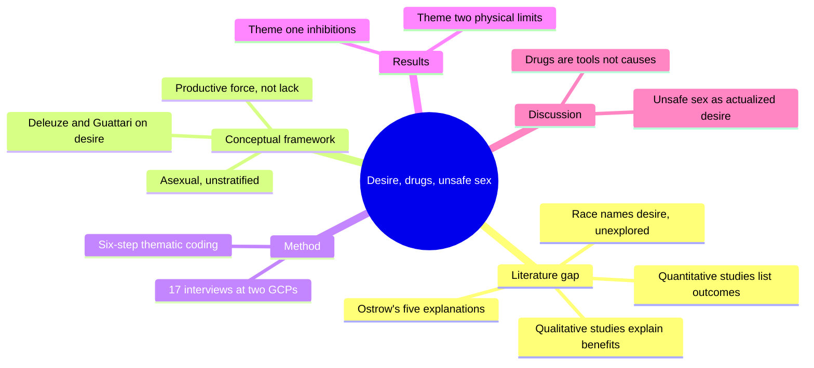
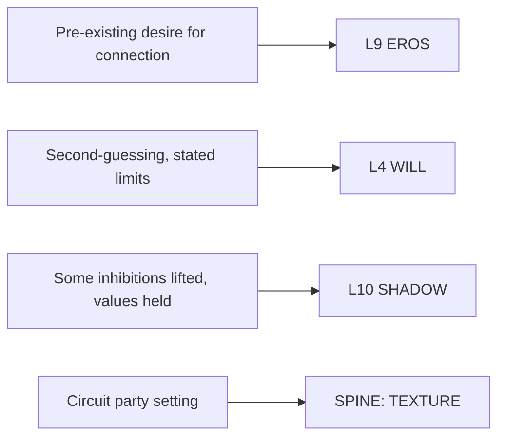

# BVX.1131 — Desire, drug use and unsafe sex: a qualitative examination of gay men who attend gay circuit parties — O'Byrne & Holmes (2011)
### Knowledge Entry — Distill

A nursing-school ethnographic study of 17 gay men at two gay circuit parties (GCPs), reframing drug/alcohol use before unsafe sex as a chosen tool for a pre-existing desire, using Deleuze and Guattari's theory of desire as a productive force rather than a lack.

## TABLE OF CONTENTS
- [Core Thesis](#1-core-thesis)
- [Mind Models](#2-mind-models)
- [Framework](#3-framework--structure)
- [Key Concepts](#4-key-concepts)
- [Heuristics](#5-heuristics--decision-rules)
- [Invariants](#6-invariants)
- [Pitfalls](#7-pitfalls--myths)
- [Application](#8-application)
- [Cross-References](#9-cross-references)
- [Provenance](#10-provenance--confidence)

---

## 1 · CORE THESIS

Gay men who attend gay circuit parties (GCPs) use drugs and alcohol as tools, not causes, for a desire that predates the substance. Drawing on Deleuze and Guattari, desire is a productive force, not a lack; disinhibition lifts some limits while values stay intact. Unsafe sex is the actualization of that desire, not an accident of it.

---

## 2 · MIND MODELS

*Required. Minimum two diagrams, maximum five. See template §C for the rules.*

**Diagram 1 — the whole argument.**
Caption: *the paper builds one claim in five moves — name the gap, borrow a theory of desire, go interview men at parties, find two overcoming-themes, then read unsafe sex as that desire's actualization.*

**Diagram 2 — the central mechanism.**
Caption: *desire comes first and stays in charge; the substance is a tool picked up mid-sequence to reach a goal the person already had, not the trigger that creates the goal.*

**Diagram 3 — mapped onto the Command's 12-layer character stack.**
Caption: *the paper's own sequence slots onto EROS first, with WILL and SHADOW picking up its two qualifiers, kept-values and bounded disinhibition.*

---

## 3 · FRAMEWORK / STRUCTURE

A standard empirical-article spine: gap, theory, method, results, discussion.

| Section | Content | Governing move |
|---|---|---|
| **Introduction + literature review** | Ten prior GCP papers (six quantitative, four qualitative); Ostrow's (2000) five-category review; Race's (2009) desire critique | Establish that desire, though gestured at by Race, has never been the direct object of study |
| **Conceptual framework: desire** | Deleuze and Guattari's *A Thousand Plateaus* (1987), via Bignall (2008) | Desire is asexual, unstratified, pre-exists constraint, and is not organized around lack (contra Freud 1920) |
| **Methods** | Participant recruitment (on-site surveys + posters at two GCPs, 17 screened and interviewed off-site) · Interview questions (semi-structured, open-ended) · Data analysis (six-step thematic coding) | Build a homogenous, targeted sample rather than a random one |
| **Results** | Theme one: substance use and inhibitions (p.5-8) · Theme two: substance use to overcome physical limitations (p.7-9) | Every quoted participant frames drugs/alcohol as a means, never a cause |
| **Discussion + final remarks** | Compares findings to Ostrow (2000) and Race (2009); names the sequence's limits | Drugs/alcohol explain *how* unsafe sex becomes more likely, not *why* the desire for it exists |

---

## 4 · KEY CONCEPTS

| Concept | What it is | Why it matters |
|---|---|---|
| **Deleuzo-Guattarian desire** | A "positive force" and "pre-eminent" drive toward connection, asexual and unstratified, that "does not come into existence after an object is forbidden, but pre-exists constraint and limitation" (p.4) | The paper's whole theoretical spine; replaces Freud's lack-based desire with a productive one |
| **Gay circuit parties (GCPs)** | "Thematic, techno-music, dance parties" (p.2) attended by many gay/bisexual men who use drugs and have unsafe sex | The recruitment site, chosen because prior research already located drug use and unsafe sex there |
| **Ostrow's (2000) five categories** | Drugs cause unsafe sex; sensation seeking; disinhibition; social context; multi-factorial (p.3) | The prior explanatory menu this paper's single-category finding compresses four of the five into |
| **Race's (2009) desire critique** | Desire for the effects of drug use, disinhibition especially, "often precedes drug and alcohol use" (p.3) | The direct predecessor claim; this paper agrees desire precedes use but disputes that disinhibition is desire's goal |
| **Theme one: substance use and inhibitions** | Drugs/alcohol remove "some" self-imposed limitations (guilt, STI/HIV knowledge) so an already-wished-for act "can be more easily done" (Seamus, p.5-6) | Values are reported as unchanged; only some inhibitions lift, per Michael: "I don't think that it actually changes your values" (p.6) |
| **Theme two: substance use to overcome physical limitations** | Drugs/alcohol used to counter fatigue, sore legs, the pain of receptive anal sex, or to extend a sexual encounter or add partners (Dan, Dave, John, Mark, p.7-9) | Shows the tool-not-cause logic applies to bodily as well as psychological limits |
| **The A-B-C sequence** | Substance use (A) induces cognitive distortion/escape/disinhibition (B), which precedes unsafe behaviour (C), "what J.S. Mill (1865) would call antecedents" (p.11) | Explains *how* unsafe sex becomes more likely after substance use, but not *why* the person engaged in it at all |
| **Unsafe sex as actualized desire** | Forming sexual connections, especially condomless ones, lets participants "produce identities" as gay men, drug users, and in some cases self-declared barebackers (p.11-12) | Reframes unsafe sex from accident/failure to a deliberate expression of a pre-existing desire |

---

## 5 · HEURISTICS & DECISION RULES

| Situation | Do this | Not this |
|---|---|---|
| Explaining a character's substance use before a risky scene | Establish the desire/goal before the substance appears on the page | Let the substance be the unexplained origin of the urge |
| Writing a disinhibited scene | Keep one value-line intact even at the edge (a "would" the character still won't cross) | Write total, undifferentiated loss of judgment |
| Building GCP or party-scene texture | Give characters specific, goal-directed reasons for using (stay awake, dull pain, extend a session, take on more partners) | Write a vague "everyone's just on drugs" atmosphere with no individual logic |
| A character cites "knowing my limits" | Give them a concrete, stated boundary (a dose, a time, a frequency) | Leave the limit unstated or arbitrary |
| Framing unsafe sex on the page | Treat it as one of several ways a character actualizes an identity they already hold | Treat it only as a moral lapse or a mistake made under the influence |

---

## 6 · INVARIANTS

1. Desire, in the Deleuzo-Guattarian sense used here, is a positive and productive force, not a reaction to lack; it pre-exists constraint (p.4).
2. In this sample, substance use facilitates a pre-existing desire; it does not create the desire (Results, throughout).
3. Disinhibition is bounded: participants report losing "some" inhibitions while their underlying values hold steady (Michael, p.6).
4. The same class of substance can serve opposite bodily goals within the sample: John uses drugs to blunt the pain of penetration, Mark uses alcohol/poppers to prolong sensation and add partners (p.8-9).
5. Cognitive distortion/escape and disinhibition explain the *how* of the sequence after substance use begins; they do not explain the *why* of the desire that precedes it (p.11).
6. Findings are drawn from a small, targeted convenience sample (17 men, two GCPs) and are explicitly flagged for cautious interpretation (p.10).
7. The accounts given are retrospective, cerebral reconstructions produced during a research interview, not a real-time report of how the sequence felt in the moment (p.11-12).

---

## 7 · PITFALLS / MYTHS

- Treating drug/alcohol use as the *cause* of unsafe sex, rather than a chosen means to a pre-existing end — the paper's central correction to Ostrow's (2000) causal category.
- Equating "disinhibition" with total loss of judgment; participants describe active self-monitoring ("second question myself," knowing "when enough's enough") even while using.
- Assuming GCP-related drug use is driven by loneliness, hardship, or low self-worth, as prior qualitative work found (Kurtz 2005; Lewis and Ross 1995; Westhaver 2005) — this sample explicitly did not report that pattern (p.9-10).
- Reading Race's (2009) "desire for disinhibition" as identical to this study's desire; here disinhibition is one route among several to connection, not the aim of desire itself (p.9-10).
- Reading the study's tidy A-B-C sequence as how participants experienced events in real time; the authors flag it as an ex post facto reconstruction (p.11-12).

---

## 8 · APPLICATION

- **Spine level:** TEXTURE. The paper is not story-structural; it supplies ethnographic, quote-level texture for gay nightlife/party scenes and a specific desire-then-tool causal logic, not a plot beat.
- **12-layer character stack:** primary on **L9 EROS** (desire as the pre-existing driver of connection-seeking, substance use as its downstream tool); supporting on **L4 WILL** (deliberate, values-bounded tool use — a counter-model to fear or impulse overriding judgment); contextual on **L10 SHADOW** (a contrast case: disinhibition here is scoped and self-permitted, not a self-protective distortion of another's worth).
- **plot_systems:** not applicable; no ready-made engine, but the desire-precedes-tool sequence (Diagram 2) is a usable internal-logic template for any scene where a character reaches for a substance en route to something they already wanted.
- **Setting:** the gay circuit party itself — "thematic, techno-music, dance parties" (p.2) — is concrete subculture texture: on-site survey recruitment, toilet-posted flyers, the mechanics of staying up and dancing through the night, poppers as a specific, named enhancer.

**For the character system:**
- The variable this paper argues hardest for is sequencing, not a new enum: whatever field records why a character reaches for a substance should be checked for desire-precedes-use logic before defaulting to a cause-and-effect or coping-mechanism read.
- What this paper cannot supply: any account of a character whose desire *is* disinhibition itself (Race's 2009 framing, which this paper explicitly distinguishes itself from) or of substance use as coping with negative affect (Kurtz 2005; Lewis and Ross 1995; Westhaver 2005) — those remain separate, valid character logics this study's sample simply didn't instantiate.
- OPEN candidate: no existing L9/L4/L10 field currently distinguishes "substance as tool for a pre-existing want" from "substance as a coping mechanism for negative affect" or "substance as disinhibition-seeking in itself" — three distinct real-world motive structures this paper and its cited comparators (Ostrow 2000; Race 2009; Kurtz 2005) each document separately.

---

## 9 · CROSS-REFERENCES

| Related entry | Relation |
|---|---|
| [[PSY.03]] | Dean's *Unlimited Intimacy* covers the barebacking subculture this paper's participants describe from the inside; both treat condomless sex as identity-actualizing rather than accidental, from different theoretical angles (Dean via psychoanalysis and kinship, this paper via Deleuze and Guattari) |
| [[BVX.1127]] | Levine and Heller's dependency paradox (L9, "effective dependency produces independence") and this paper's desire-precedes-tool sequence both argue a need or drive is prior and legitimate, not a defect to be minimized; neither reduces to the other |

---

## 10 · PROVENANCE & CONFIDENCE

Sourced from a clean pdftotext extraction of the published Taylor & Francis PDF (15 pages total: 2 cover/rights pages, 13 journal-paginated content pages, *Culture, Health & Sexuality* 13:1, 1-13, 2011). The text layer is intact English with no OCR degradation; the article was read in full, introduction through final remarks, references, and the French and Spanish abstracts. All quotations in this distill are copied verbatim from the extraction, including the named-pseudonym attributions and ages the authors provide. No numeric claims are original to this distill; the sample size (17 men), study sites (two GCPs), and all cited comparator studies are the authors' own reporting.

## META
- Template: BVX-LEARN-v4.0
- Source classification: full-text pdftotext extraction, clean text layer, read in full
- Created / Updated: 2026-09-24
