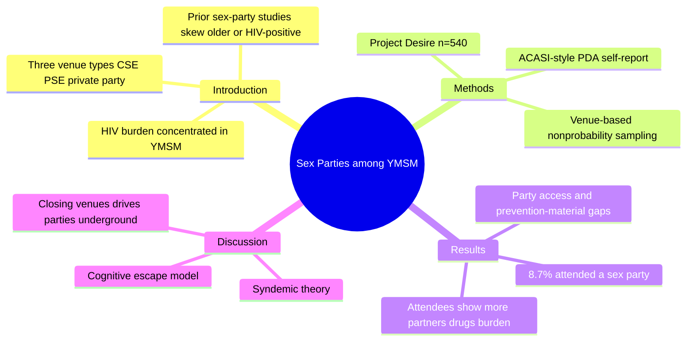
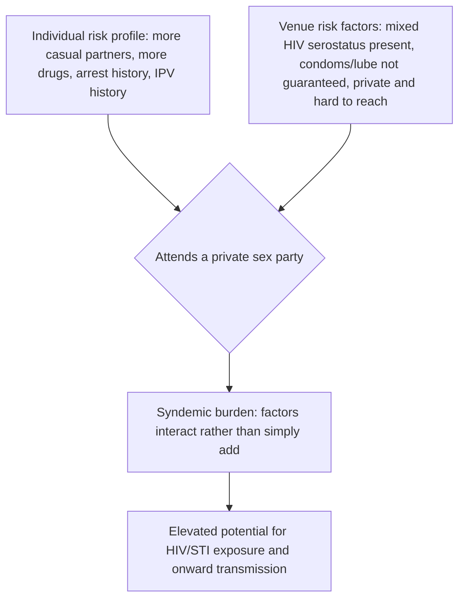
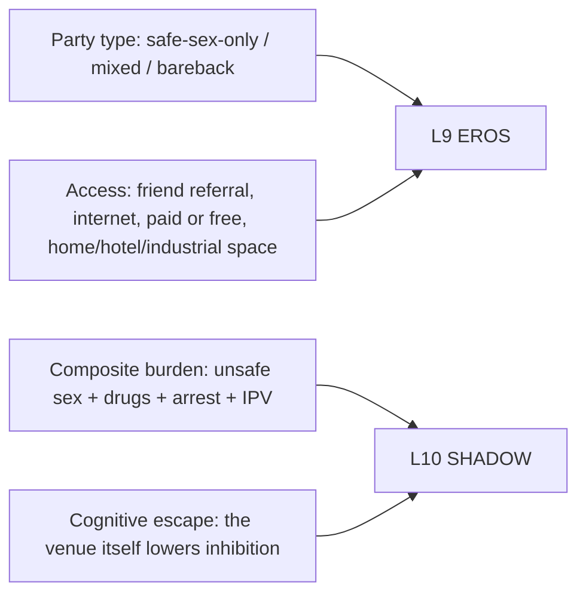

# BVX.1132 — Sex Parties among Young Gay, Bisexual, and Other Men Who Have Sex with Men in New York City: Attendance and Behavior — Solomon, Halkitis, Moeller, Siconolfi, Kiang & Barton (2011)
### Knowledge Entry — Distill

A cross-sectional public-health study of 540 young men who have sex with men (YMSM) in New York City finds that the 8.7% who attend private sex parties carry a measurably heavier, clustered risk load than those who don't, acquired from Chief's PDF drop as MSX-shelf research on sex-venue culture with a secondary read for BOLO 78's venue/travel research and for character-level risk-behavior realism.

## TABLE OF CONTENTS
- [Core Thesis](#1-core-thesis)
- [Mind Models](#2-mind-models)
- [Framework](#3-framework--structure)
- [Key Concepts](#4-key-concepts)
- [Heuristics](#5-heuristics--decision-rules)
- [Invariants](#6-invariants)
- [Pitfalls](#7-pitfalls--myths)
- [Application](#8-application)
- [Cross-References](#9-cross-references)
- [Provenance](#10-provenance--confidence)

---

## 1 · CORE THESIS

Among 540 YMSM (ages 18-29) surveyed in NYC in 2008, the 8.7% who attended a private sex party in the prior three months reported significantly more lifetime and recent casual partners, more drug use, and more psychosocial burden (arrests, partner violence) than non-attendees. The venue itself compounds this: mixed HIV serostatus and inconsistent condom/lubricant access at parties intersect with attendees' already-elevated individual risk, producing syndemic risk greater than either factor alone.

---

## 2 · MIND MODELS

*Required. Minimum two diagrams, maximum five. See template §C for the rules.*

**Diagram 1 — the whole argument.**
Caption: *a standard empirical-article shape, name the gap, survey a sample, measure two risk baskets against attendance, then argue the two baskets compound each other.*

**Diagram 2 — the central mechanism.**
Caption: *risk isn't additive, the person's own risk profile and the party's own gaps in serostatus disclosure and prevention supplies feed the same outcome from two directions at once.*

**Diagram 3 — mapped onto the Command's systems.**
Caption: *the paper's own venue taxonomy and burden score slot as concrete, numbered material for a character's venue-seeking behavior and disinhibited-risk cluster, not as psychology the source itself claims to explain.*

---

## 3 · FRAMEWORK / STRUCTURE

A standard empirical public-health article, six sections in sequence.

| Section | Content | Governing question |
|---|---|---|
| **Introduction** | HIV burden in MSM and YMSM, prior CSE/PSE/private-party literature, the gap this study fills | What's already known about risky sex venues, and what's missing for young, racially diverse MSM specifically? |
| **Methods** | Project Desire: 540 YMSM, NYC, summer 2008, venue-based sampling stratified by race and age, PDA self-report survey | How was the sample built and the data collected honestly? |
| **Measures** | Sociodemographics, sex-party behavior, sexual behavior, drug use, arrest history, IPV, a composite total-burden score | What exactly was scored, and how was "burden" operationalized? |
| **Results** | Attendance rate, party characteristics (type, serostatus mix, access, prevention materials), attendee-vs-nonattendee comparisons on sex, drugs, and burden | What differs, and by how much, between attendees and nonattendees? |
| **Discussion / Limitations / Conclusions** | Syndemic theory, the cognitive escape model, the policy tension around closing commercial venues | Why does this pattern matter, and what should public health do about a venue it can't easily reach? |

---

## 4 · KEY CONCEPTS

| Concept | What it is | Why it matters |
|---|---|---|
| **Private sex party** | A group-sex gathering in a private space (home, hotel, industrial/commercial space), distinct from commercial sex environments (CSEs, e.g., bathhouses) and public sex environments (PSEs, e.g., cruising parks) | Inaccessible to outreach by design; found via friend (38.3%) or internet (31.9%), not walk-in |
| **Project Desire** | The study's own cross-sectional survey, 540 YMSM ages 18-29, NYC, venue-based nonprobability sample stratified so Black and Latino men were ≥67% and age bands (18-20, 21-25, 26-29) were roughly even | The sampling frame this distill's every statistic is drawn from |
| **Composite total burden score** | A 0-4 count of: recent unprotected anal intercourse with a casual partner, recent drug/alcohol-to-intoxication use, ever arrested, ever physically harmed by a boyfriend | The study's single number for "how many risk domains stack on this person at once" |
| **Sex party attendance rate** | 8.7% (n=47) of the sample attended a sex party in the 3 months prior; 90.7% (n=490) did not; 3 missing data | The headline prevalence figure; small in isolation, the paper's whole argument is that the attendee subgroup is disproportionately risky |
| **Party type mix** | 63.3% safe-sex-only, 32.7% mixed (protected and unprotected), 4.1% bareback-only, by attendee self-report | Most parties nominally require condoms; the mixed category is where risk concentrates |
| **Serostatus mix at parties** | 60.4% HIV-negative-only, 6.2% HIV-positive-only, 33% mixed-status | A third of attendees report parties open to both statuses, without necessarily knowing who is who |
| **Prevention-material access at parties** | 58% had both condoms and lube; 14.6% condoms only; 16.7% lube only; 10.4% neither | Roughly 4 in 10 attendees were at a party missing at least one basic prevention supply |
| **Syndemic theory** | Stall et al.'s framework: co-occurring epidemics (drug use, psychosocial burden, sexual risk) interact synergistically, producing more risk than the sum of each alone | The paper's explicit theoretical frame for why it measures burden as a composite, not separate tallies |
| **Cognitive escape model** | McKirnan, Ostrow, and Hope's (1996) claim that certain environments facilitate disinhibited behavior leading to risk | Locates part of the risk in the venue itself, not only in who attends it |
| **The venue-closure paradox** | Closing commercial sex venues (bathhouses, sex clubs) is documented policy in NYC and San Francisco, but a cited Gay Men's Health Crisis researcher argues it "just drives this activity underground" into private, harder-to-reach parties | 100% of this study's surveyed parties were in private spaces; closure policy may be manufacturing the exact venue type it can't reach |

---

## 5 · HEURISTICS & DECISION RULES

| Situation | Do this | Not this |
|---|---|---|
| Sizing how risky "8.7% attend sex parties" sounds | Read it against the burden comparison (mean 1.7 vs. 1.2 of 4), the small subgroup carries a real, measured gap | Dismiss the finding because the attendance percentage itself looks small |
| Explaining why attendees don't differ on unprotected-sex rates but do on everything else | Note the paper's own limitation: more partners and more drugs, not more unprotected acts per encounter, drive the risk difference | Assume "sex party" implies "more bareback sex"; the data does not support that specific claim |
| Writing a character who frequents group-sex venues | Give them a plausible access path (a friend, a forum/site) and a venue type (home/hotel/space), matching how these parties are actually found and run | Write attendance as anonymous or random; 100% of this sample's parties were private and word-of-mouth or internet-found |
| Researching real-world sex-positive venues (BOLO 78 territory) | Treat "private party," "commercial sex environment," and "public sex environment" as three distinct legal/access categories with different visibility and risk profiles | Collapse all group-sex venues into one undifferentiated category |
| Citing this study's numbers | Attach the sample (n=540, NYC, 2008) and note self-report/cross-sectional limits | Present findings as causal ("sex parties cause HIV") or generalizable beyond young, urban, self-selected MSM |

---

## 6 · INVARIANTS

1. Sex-party attendees in this sample report more lifetime partners (median 18 vs. 11), more recent casual partners (median 5 vs. 1), and more total recent partners (median 8 vs. 2) than non-attendees.
2. Attendance does not, by itself, predict a higher rate of unprotected anal intercourse per encounter (UIAI 12.8% vs. 7.8%; URAI 12.8% vs. 11.9%; any UA 23.4% vs. 15.4%; none reach significance).
3. Attendees show significantly higher use of powder cocaine, crack, poppers, GHB, methamphetamine, nonprescribed PDE-5 inhibitors, nonprescribed benzodiazepines, and nonprescribed HIV medication, and a higher total count of distinct drugs used (median 2 vs. 1).
4. Attendees report significantly more arrests (34% vs. 20%); no significant difference was found for intimate partner violence.
5. The composite total burden score is significantly higher for attendees (mean 1.7, SD 1.1) than non-attendees (mean 1.2, SD 1.0), t(436)=3.00, p<.01.
6. No demographic variable (race, sexual orientation, HIV status, perceived family SES) significantly predicts sex-party attendance in this sample.
7. 100% of surveyed parties took place in private spaces or residences; parties were found chiefly via a friend (38.3%) or the internet (31.9%), not by chance encounter.
8. The data are self-report, cross-sectional, and drawn from one self-selected NYC sample; the authors themselves state no causal link between attendance and HIV transmission can be inferred.

---

## 7 · PITFALLS / MYTHS

- Reading "sex party attendees have more risk" as "sex parties cause more unprotected sex"; the per-encounter unprotected-intercourse rates did not differ significantly, the gap is in partner counts, drug use, and psychosocial burden, not condom use per se.
- Treating the 8.7% attendance figure as a low-priority population; the paper's own argument is that a small subgroup can still matter epidemiologically when its individual risk factors and its venue's risk factors compound.
- Assuming closing commercial venues reduces risk; the paper and its cited sources argue closure displaces activity into private parties, which are harder for public health outreach to reach at all.
- Assuming sex parties are anonymous, walk-in venues; access in this sample was overwhelmingly social (friend referral) or internet-based, and over half paid to attend.
- Generalizing findings beyond the sample; this is one racially stratified NYC cohort surveyed in 2008, not a national or contemporary estimate.

---

## 8 · APPLICATION

- **Spine level:** none (`[]`). This is empirical public-health research, not a story-craft or worldbuilding source; it supplies factual material rather than a narrative framework.
- **12-layer character stack:** contextual/supporting only, via `feeds:` — L10 SHADOW (the composite risk-burden cluster and the cognitive escape model, a venue-triggered disinhibition mechanism) and L9 EROS (the venue taxonomy and access pattern, useful for naming how a character seeks casual partners).
- **plot_systems:** none identified; the study offers no narrative mechanism, only demographic and behavioral correlation data.
- **Setting:** thin but real, if a story or scene needs a private-sex-party location, this paper's access pattern (friend or internet referral, paid roughly 60% of the time, hosted in a home/hotel/industrial space, condoms and lube not guaranteed) is citable, sourced texture rather than invention.

This entry's stronger use is outside the 12-layer stack: it is MSX-shelf research on a real venue category (private sex parties, distinct from commercial and public sex environments) that speaks directly to BOLO 78's sex-positive-venue research (saunas, cruising, naked parties, sex clubs as travel/venue categories) by giving that research an evidence-backed taxonomy and risk framing rather than a purely descriptive one. It also gives a writer building a high-risk or disinhibited character a sourced, numbered burden profile (unprotected sex, drug use, arrest, partner violence, scored 0-4) instead of an invented one.

---

## 9 · CROSS-REFERENCES

| Related entry | Relation |
|---|---|
| [[PSY.03]] | Dean's *Unlimited Intimacy* studies the barebacking subculture from inside; this paper's 4.1% "bareback-type" party finding and its mixed-serostatus data give Dean's qualitative subculture account a small quantitative anchor in a different (younger, more general) MSM population |
| [[PSY.07]] | Parry & Johnson's *Sex and Leisure* frames group and public sex as leisure practice; this paper supplies the epidemiological counterweight, measured risk correlates for one specific leisure-adjacent venue type |
| [[BVX.1127]] | Levine & Heller's attachment-style research (L8/L9) explains relational bonding mechanisms; this paper's cognitive-escape and venue-disinhibition material names a separate, situational (not attachment-style-driven) route to risk-taking behavior, worth distinguishing rather than conflating in a character's L9/L10 wiring |

---

## 10 · PROVENANCE & CONFIDENCE

Sourced from a clean `pdftotext -layout` extraction of the full 13-page article (Journal of Urban Health, Vol. 88, No. 6, 2011, doi:10.1007/s11524-011-9590-5), read in full front to back: abstract, introduction, methods, measures, results (including both data tables), discussion, limitations, conclusions, and the reference list. The text layer was clean and complete apart from a small number of stray encoding artifacts in punctuation (en-dashes and a chi-square symbol render as `�` or a stray digit in a few spots, e.g., "18-29" and "χ²"); no numeric finding was affected, all statistics above were read directly off the table cells and body text. No Zotero record matched this file; it arrived as a bare PDF in the drop folder with no companion metadata. No private individuals are named; all subjects are anonymized survey respondents and the six named authors are the paper's credited researchers.

## META
- Template: BVX-LEARN-v4.0
- Source classification: full-text pdftotext extraction, complete article read front to back, no partial-read caveats
- Created / Updated: 2026-09-24
