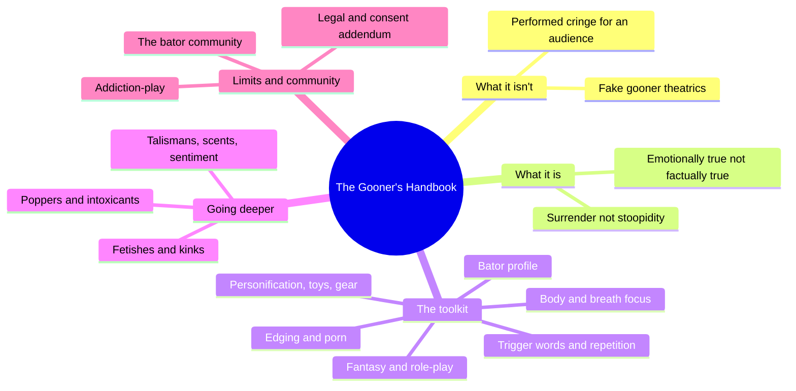
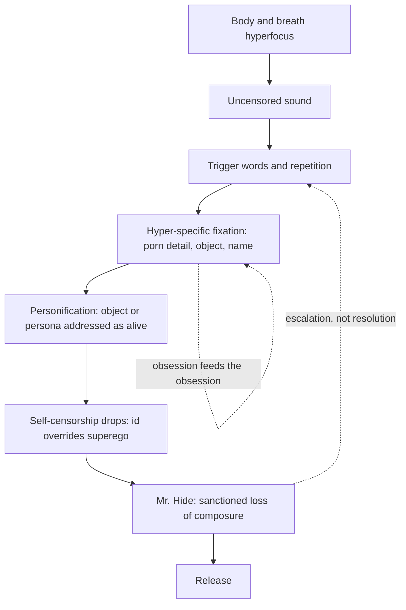
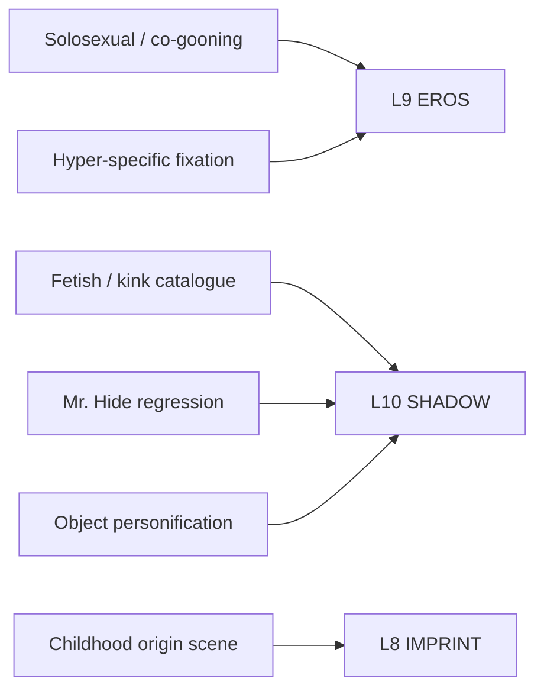

# BVX.1133 — The Gooner's Handbook: Intensify and Elevate Your Bate — Wynward H. Oliver (2024)
### Knowledge Entry — Distill

A retired college teacher and gay memoirist, writing under a pen name, argues that "gooning" — an intensified, self-surrendering masturbatory state — is a genuine altered state produced by hyperfocus and honesty, not the performed drooling and eye-rolling that has come to signify it online; the book is a first-person technique manual for reaching the real thing.

## TABLE OF CONTENTS
- [Core Thesis](#1-core-thesis)
- [Mind Models](#2-mind-models)
- [Framework](#3-framework--structure)
- [Key Concepts](#4-key-concepts)
- [Heuristics](#5-heuristics--decision-rules)
- [Invariants](#6-invariants)
- [Pitfalls](#7-pitfalls--myths)
- [Application](#8-application)
- [Cross-References](#9-cross-references)
- [Provenance](#10-provenance--confidence)

---

## 1 · CORE THESIS

Gooning is a state, not a set of facial expressions: sustained hyperfocus on the body, breath, and one hyper-specific fixation lets the impulsive self override the self-censoring one. Its tools, personification, trigger-word repetition, fantasy persona, and ritual objects, work only when the practitioner treats what he says and does as emotionally true, whether or not it is factually true.

---

## 2 · MIND MODELS

*Required. Minimum two diagrams, maximum five. See template §C for the rules.*

**Diagram 1 — the whole argument.**
Caption: *an opening polemic against the performed "gooner," then a graduated toolkit, then the deeper and riskier material, then the limits.*

**Diagram 2 — the central mechanism.**
Caption: *hyperfocus opens a gap where self-censorship drops away, and each tool feeds the next until the loop closes on release, not on orgasm specifically.*

**Diagram 3 — mapped onto the Command's 12-layer character stack.**
Caption: *the book's own mechanisms slot mainly into two layers, L9 for what the desire targets and how it's run solo, L10 for the shadow material and how it surfaces, with L8 offering one contextual origin story.*

---

## 3 · FRAMEWORK / STRUCTURE

Thirteen chapters plus a preface and epilogue, structured as a graduated toolkit that gets riskier as it goes.

| Cluster | Chapters | Governing question |
|---|---|---|
| **Polemic** | Precum Preface · 1 Got Goon? · 2 Gooning Is... | What is "gooning" actually, once the performed version is stripped away? |
| **Foundation** | 3 Creating a Bator Profile · 4 Body and Breath Focus | Who are you as a masturbator, and how do you drop into the state at all? |
| **Fuel** | 5 Edging and Porn · 6 Personification, Toys, and Gear · 7 Trigger Words and Repetition · 8 The Power of Fantasy and Role-Play | What sustains and intensifies the state once you're in it? |
| **Depth** | 9 Fetishes and Kinks · 10 Talismans, Scents, and Sentiment · 11 Poppers and Other Intoxicants | How far can the fixation and the altered state be taken? |
| **Limits** | 12 The Bator Community · 13 Addiction-Play (+ Addendum) | What does this cost, who else is involved, and where are the lines? |

The book's own spine is escalatory, not diagnostic-then-prescriptive: each chapter adds one more lever (fixation object, words, fantasy, ritual object, intoxicant) onto the same base mechanism established in Chapter 4, then Chapters 12-13 pull back to address community risk, addiction framing, and consent.

---

## 4 · KEY CONCEPTS

| Concept | What it is | Why it matters |
|---|---|---|
| **Gooning** | A hyperfocused, self-surrendering masturbatory state, contrasted with its own online caricature (rolled eyes, drool, contorted "gooner face") | The book's whole argument is that the caricature is optional theater, not the state itself |
| **Bator profile** | A short self-written declaration of turn-ons, limits, and self-description (worked example on p.26: "Obsessed, addicted, helpless...popperbator and extremely verbal gooner and edger...") | A concrete artifact for stating sexual identity plainly, used as the foundation the later chapters build on |
| **Id / superego / ego framing** | The author explicitly borrows Freud's tripartite model: "the id is the impulsive part of your personality...the superego is the judgmental side...and the enemy of the gooner" (p.32) | Names the mechanism directly: hyperfocus is framed as a technique for quieting the superego so the id can run |
| **Trigger words and the goon cascade/spiral** | Repeating a word, name, or short phrase (the author claims up to 600 repetitions of one word) until it becomes hypnotic; "the obsession feeds the obsession, which feeds the goon" (p.38) | A concrete escalation mechanic: verbalizing desire out loud is described as more powerful than thought alone |
| **Personification** | Addressing inanimate objects (popper bottles, an Albolene jar) or one's own penis as an autonomous, demanding "he" | Displaces agency onto an object, letting the practitioner frame surrender as something done *to* him |
| **Fantasy vs. reality** | "What you say and do while gooning must always be emotionally true" even when factually invented (p.55); a bator persona ("Carlos," p.52) can want things the author does not want in reality | The book's load-bearing distinction: taboo content is bounded by this line, not by content restriction |
| **Fetish vs. kink** | Fetish = a fixation on a tangible thing; kink = a broader umbrella covering behaviors too; the author treats the terms as functionally interchangeable in practice (p.58) | Establishes vocabulary before the fetish catalogue in Chapter 9 |
| **Talismans** | Physical objects taken from a desired person (worn clothing, in the author's case) used as a scent/touch anchor for fantasy | Turns an abstract fantasy object into a handled, physical one |
| **Poppers (amyl-nitrite class inhalants)** | A short-acting recreational inhalant the author treats as his primary but optional intoxicant; he is explicit that the liquid itself should never touch skin or mucous membranes and that a physician should be consulted before any new "sexercise routine" | The book frames intoxicant use as one optional lever among several, not a requirement for gooning |
| **Surface gooning vs. deep gooning** | A partner who has every individual element (profile, edging, poppers, trigger words) right but still reads as shallow to the author (p.70) | The pieces are necessary but not sufficient; the book locates the difference in commitment/depth rather than technique |
| **Addiction-play** | Chapter 13's reframe of self-described "addiction" as a chosen, performed loss-of-control (pp.77-83) rather than a literal clinical claim, alongside an explicit referral to professional help for anyone for whom compulsion is genuinely harmful | Separates a performed intensity-frame from real compulsive harm; the author is careful to keep the two distinct |

---

## 5 · HEURISTICS & DECISION RULES

| Situation | Do this | Not this |
|---|---|---|
| Writing a character mid-escalation in a solo or fantasy scene | Fix the desire on one hyper-specific, almost incidental detail | Write generic escalating "moaning and thrusting" with no fixed object |
| Giving a character a fetish backstory | Plant one formative image as a retrospective origin story the character tells about himself | Claim the childhood image mechanically *caused* the adult fixation |
| Staging taboo fantasy content (CNC, power-exchange, taboo role-play) on the page | Bracket it clearly as the character's bounded, self-aware fantasy space | Present it as the character's literal, unbounded real-world desire |
| Writing a character's self-described "addiction" to a habit or person | Consider whether it's a chosen performance of surrender vs. a literal compulsion damaging their life, and let the character know the difference | Flatten every "I'm addicted" line into clinical pathology |
| Two characters bonding over a shared kink or obsession | Let their specific content differ; bond them over the intensity of obsession itself | Require identical specific content before they can connect |
| A character with strong, judgmental opinions about how others should desire | Show them explicitly declining the gatekeeper role even while holding the opinion | Let their strong opinion read as a universal rule the narrative endorses |

---

## 6 · INVARIANTS

1. Gooning is defined as a state (hyperfocus plus surrender), never as a set of physical signs; the signs described (drool, slack jaw, tremor) are possible byproducts, not the goal or the proof.
2. Content said or enacted during the state must be emotionally true even when it is factually invented; this fantasy/reality line, not content restriction, is what keeps taboo material bounded.
3. Fixation escalates through specificity: obsessing on one exact detail intensifies the state more than dwelling on a generalized scene.
4. Verbalizing desire aloud is treated throughout as more powerful than the same desire held silently in thought.
5. Trust, exposure, and blackmail risk are treated as real and separate from arousal itself — the book repeatedly warns against sharing anything on cam one wouldn't want a boss or family member to see.
6. The book brackets consent, legality, and age explicitly and repeatedly; "addiction" language is offered as the author's own chosen frame, with an explicit referral to professional help for anyone it actually harms.

---

## 7 · PITFALLS / MYTHS

- Treating the performed "gooner face" (rolled/crossed eyes, drooling, tongue out) as proof of genuine arousal rather than possible theater staged for an audience.
- Reading a character's taboo fantasy content as a literal statement of real-world desire or endorsement rather than bounded, self-aware fantasy.
- Assuming self-described "addiction" is always meant and should always be written as clinical compulsion; the author explicitly distinguishes a chosen intensity-frame from a genuinely harmful compulsion and refers the latter to professional help.
- Assuming two people (or characters) need matching specific fetish content to bond; the book argues the shared *intensity of obsession* is what actually bonds them.
- Mistaking "surface" competence (every listed element present and correct) for depth; the book insists these are necessary, not sufficient.

---

## 8 · APPLICATION

- **Spine level:** L5 (Character territory); the book operates entirely inside one character's self-constructed erotic psychology and its performed vs. authentic registers, not at plot-structure levels.
- **12-layer character stack:** primary on **L9 EROS** (intimacy_mode as solosexual/co-gooning; desire_vector as hyper-specific fixation); primary on **L10 SHADOW** (shadow_content as the bounded fantasy/taboo catalogue); supporting on **L10** (regression_pattern via the "Mr. Hide" alter-state); contextual on **L10** (projection_tendency via object personification) and **L8 IMPRINT** (primary_attachment_object via the author's own retrospective origin scene) — see Diagram 3.
- **plot_systems:** the escalation loop in Diagram 2 (hyperfocus → fixation → personification → loss of self-censorship → release, feeding back on itself) is a ready-made engine for any scene built around a character's private ritual or compulsion, sexual or otherwise; the "surface vs. deep" distinction (Key Concepts) is a usable test for whether a supporting character's stated obsession reads as decoration or as genuinely structural to them.
- **Setting:** untouched by this book directly, though Chapter 12's material on the online "bator community" (trust economics, exposure/blackmail risk, coaching and switching dynamics) offers texture for any scene set inside a similar community or subculture.

This book sits alongside the library's other ORANGE-trunk MSX voice-and-technique sources rather than filling a gap one of them named. Where [[BVX.1127]] (Levine & Heller, *Attached*) supplies the architecture of how a character bonds with a *partner*, this book supplies the architecture of how a character bonds with *himself*, a distinct and under-covered intimacy_mode for L9. Its explicit fantasy/reality bracketing rule (§4, "Fantasy vs. reality") is a cleaner, more citable version of the same bounded-taboo-content problem that any writer staging a character's shadow material on the page has to solve.

**For the character system:**
- Proposed L9 field note: `intimacy_mode` should have a distinct enumerated value for solosexual/parallel intimacy (this book's "co-gooning," where two characters synchronize separate arousal rather than merging into a shared act), separate from partnered or penetrative modes.
- Proposed L10 field note: `regression_pattern` could take a `sanctioned` vs. `performed` flag, distinguishing an authentic loss-of-composure threshold (this book's "Mr. Hide") from a costume version staged for an audience — the exact distinction the author spends Chapter 1 arguing for.
- What this book cannot supply: any research base, clinical framing, or claim to generalizability — it is a single first-person practitioner's technique manual and memoir-adjacent essay, not a study. Numeric claims (e.g., "600 times," "fifty-one years") are the author's own unverified self-report.
- OPEN candidate: a `fantasy_persona` field distinct from `attachment_style` or `erotic_blueprint_type` — this book's "Carlos" is a named alter-ego with its own wants, explicitly split from the author's real-world preferences, that current L8/L9 fields don't have a clean home for.

---

## 9 · CROSS-REFERENCES

| Related entry | Relation |
|---|---|
| [[BVX.1127]] | Levine & Heller's attachment architecture covers how a character bonds with a partner; this book covers the parallel, under-covered case of how a character bonds with himself, both feeding distinct L9 EROS values |
| [[MSX.11]] | Same ORANGE-trunk register of explicit, mindset-first technique writing (oral sex rather than masturbation); comparable id/ego-dissolution framing of "presence" as the real mechanism behind the physical technique |
| [[MSX.14]] | Easton & Hardy's D/s framework gives structured vocabulary for the power-exchange and submission material this book raises informally in its fetish/kink and addiction-play chapters |
| [[PHI.01]] | Anand's sacred-sexuality framing parallels this book's own explicit "touching penis, you may just touch God" language (Chapter 1) for eroticism as a spiritual register, not only a physical one |

---

## 10 · PROVENANCE & CONFIDENCE

Sourced from a clean `pdftotext -layout` extraction of the full 92-page PDF (a Kindle Direct Publishing release, ISBN 979-8-3277-2721-2), with no diacritic or OCR corruption. The entire book was read in full: front matter and praise blurbs, the table of contents, the Precum Preface, all thirteen numbered chapters, the Addiction Addendum, An Edger's Epilogue, the closing "Cumpilation of 'Gooning Is...'" litany, and the About the Author page. The book carries no internal page-number folios; page citations in this distill refer to the PDF's own page sequence as extracted (page 1 = front-matter praise page), not to printed folios. "Wynward H. Oliver" is stated on the book's own About the Author page to be a pen name; no other real private individuals are named or identified in this distill beyond the book's stated (public, self-published) author and the named authors of its cover-blurb quotes, who are themselves published writers credited on the book's own praise page. Anecdotal first names the author uses for private individuals in his own life story are omitted here. All numeric and biographical claims (years of practice, repetition counts, etc.) are the author's own first-person self-report, not externally verified data, and are presented as such throughout this distill.

## META
- Template: BVX-LEARN-v4.0
- Source classification: full-text pdftotext extraction, clean text layer, complete read (front matter through About the Author)
- Created / Updated: 2026-09-24
