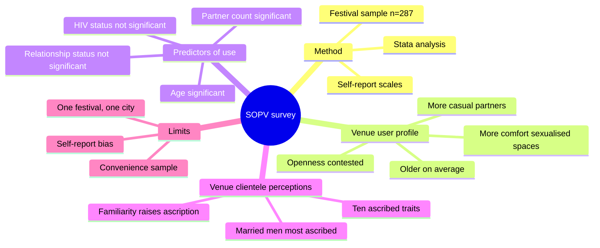
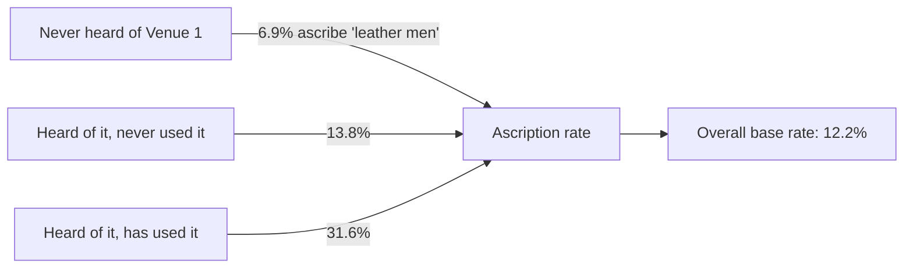
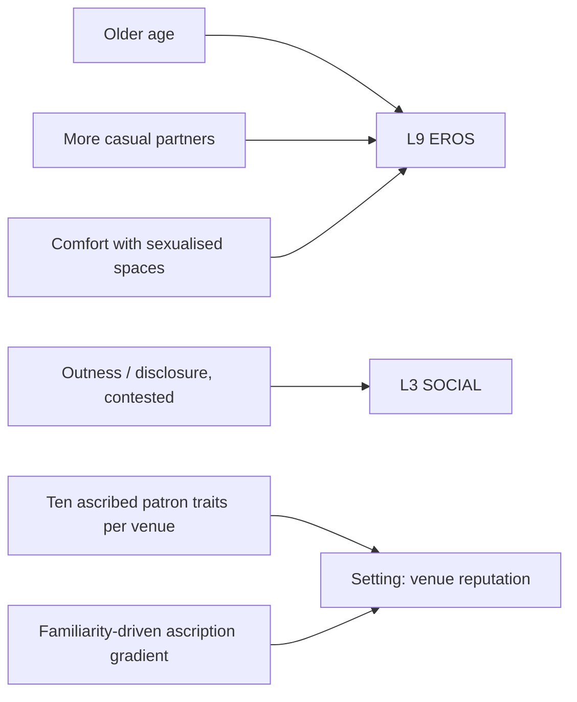

# BVX.1134 — Gay men's sex venues, the men who use them, and gay community perceptions — Smith, Grierson & von Doussa (2010)
### Knowledge Entry — Distill

A five-page peer-reviewed research paper (Sexual Health, 2010) surveying 287 gay men at a Melbourne community festival on sex-on-premises-venue (SOPV) use and on what characteristics they ascribe to eleven named local venues' clienteles; pulled into the library as demographic and setting-texture data for gay sex-venue depiction, not as craft or story-structure material.

## TABLE OF CONTENTS
- [Core Thesis](#1-core-thesis)
- [Mind Models](#2-mind-models)
- [Framework](#3-framework--structure)
- [Key Concepts](#4-key-concepts)
- [Heuristics](#5-heuristics--decision-rules)
- [Invariants](#6-invariants)
- [Pitfalls](#7-pitfalls--myths)
- [Application](#8-application)
- [Cross-References](#9-cross-references)
- [Provenance](#10-provenance--confidence)

---

## 1 · CORE THESIS

Men who use gay sex-on-premises venues differ from non-users in age, casual-partner count, sexual openness, and comfort with sexualised spaces (p.177, p.180). Different venues carry recognisably different reputations among community members rather than one undifferentiated "sex venue" stereotype (p.179). A man's confidence in ascribing a stereotype to a venue's patrons rises with his own familiarity with that venue (p.180).

---

## 2 · MIND MODELS

*Required. Minimum two diagrams, maximum five. See template §C for the rules.*

**Diagram 1 — the whole argument.**
Caption: *one survey, two datasets — who uses SOPVs, and what the community believes about the patrons of eleven named venues.*

**Diagram 2 — the central mechanism.**
Caption: *the more firsthand contact a man has with a venue, the more confidently he assigns its patrons a stereotype — ascription rate roughly quadruples from never-heard to used, in the paper's own worked example.*

**Diagram 3 (optional) — mapped onto the Command's systems.**
Caption: *the user-profile variables feed L9 EROS cleanly and L3 SOCIAL only with a caveat attached; the eleven-venue clientele data is pure Setting texture, not a character variable at all.*

---

## 3 · FRAMEWORK / STRUCTURE

A standard four-part empirical research-article spine.

| Section | Page(s) | Governing question |
|---|---|---|
| **Introduction** | 177 | Why do we know so little about how the gay community itself views sex venues and their users, and what predicts venue use? |
| **Methods** | 177–178 | How was the sample recruited, and what scales and analyses measured venue use, user characteristics, and ascribed venue-clientele traits? |
| **Results** | 178–180 | Who used SOPVs in the previous year, what distinguishes users from non-users, and what traits did participants ascribe to eleven named venues' patrons? |
| **Discussion** | 180 | What do the two findings (user profile + clientele perception) mean together, and what are the study's limits? |

---

## 4 · KEY CONCEPTS

| Concept | What it is | Why it matters |
|---|---|---|
| **SOPV (sex-on-premises venue)** | The paper's term for saunas, sex clubs, and similar venues designed for on-site sexual activity | The object class the whole study measures; "sex venue" in casual usage maps onto this |
| **The convenience sample** | 287 self-administered surveys collected at a 2007 Melbourne gay/lesbian community festival with no sexual-activity focus, not a venue-recruited or clinic-recruited sample | Recruitment independent of SOPV use is the paper's basis for calling users and non-users comparable groups (p.177–178) |
| **The venue-user profile** | 152 of 287 (53%) had used a venue in the previous year; users were roughly four years older than non-users on average, less likely to identify as gay (vs bisexual/other) or be in a regular relationship, scored higher on comfort with sexualised spaces and on breadth of alcohol/drug engagement, and scored lower (more approving) on the SOPV-attitude scale (p.178–180) | The empirical shape of "who uses these venues," usable as a real-world correlate set for a character who does |
| **The outness contradiction** | The paper states there was "no relationship between how out men were and whether or not they were SOPV users" (p.180) in one passage, then reports outness as a significant independent predictor in the multivariate logistic-regression model on the very same page, and the Abstract lists openness as a differentiator | A genuine internal inconsistency in the source, not a distillation error — flag it, don't resolve it silently |
| **The ten ascribed patron characteristics** | Leather men, married men, HIV-positive men, HIV-negative men, party boys, young men, Asian men, sex pigs, men very much part of the gay community, men not much part of the gay community — rated per venue on an 11-venue list (p.178) | The instrument that produces Table 2's per-venue clientele "reputation profile"; married men (25.0% overall) was the most commonly ascribed trait, "not much part of the gay community" (10.0%) the least (p.180) |
| **The familiarity-ascription gradient** | Attribution of any trait to a venue's patrons rises with the rater's own familiarity: never heard of the venue < heard but never used < heard and used, worked in detail for "leather men" at Venue 1 (6.9% → 13.8% → 31.6% against a 12.2% base rate) (p.180) | The paper's one clean, quantified mechanism; frames ascribed venue reputations as partly a function of exposure, not pure fact about the venue |
| **The predictor set (multivariate)** | Logistic regression on Table 1's variables found age, casual-partner count (2–5, 6–10, 11+ vs. none), outness, and comfort-with-sexualised-spaces independently predictive of SOPV use; sexual identity, HIV status, relationship status, AOD engagement, and SOPV attitudes dropped out once the model adjusted for the other variables (p.180) | Distinguishes "differs on" (univariate, Table 1) from "independently predicts" (multivariate) — several Table-1 differences are explained away by co-varying with the significant predictors |
| **Generalisability claim** | The authors argue their sample's age, HIV-testing, and SOPV-use profile matches other Melbourne and Sydney convenience samples (festival, venue, and clinic-recruited), so results should generalise to gay men attending such events in major Australian cities (p.180) | The paper's own answer to the convenience-sample limitation; a claim, not an independent replication |

---

## 5 · HEURISTICS & DECISION RULES

| Situation | Do this | Not this |
|---|---|---|
| Writing a character who uses SOPVs | Skew them older, give them a higher casual-partner count, and give them ease with sexualised spaces as the load-bearing traits | Make venue use a simple proxy for "very out" — the paper's own data contradicts itself on that link |
| Writing a venue's in-world reputation | Give each named venue type (leather bar, sauna, sex club, cruise spot) its own distinct clientele stereotype, not one generic "sex venue" | Treat all SOPVs as interchangeable settings with interchangeable crowds |
| A character describing a venue they've never been to | Have them hedge, generalise, or under-specify the clientele | Have an outsider character confidently profile a venue's regulars in specific detail — that confidence belongs to insiders and frequent users |
| Citing "openness/outness" as a venue-use driver | Cite it with the contradiction flagged (univariate null vs. multivariate significant) | Cite it as a clean, single-direction finding |
| Using Table 2's clientele percentages | Treat them as community *perception* data, ascribed stereotype, not verified ground truth about who actually attends | Present ascribed-trait percentages as measured demographic facts about a venue's real patrons |

---

## 6 · INVARIANTS

1. Recruitment for this study was independent of SOPV use (a general community festival), which is the paper's stated basis for treating users and non-users as comparable groups.
2. SOPV users differ from non-users on multiple measured variables (age, partner count, comfort with sexualised spaces at minimum); the direction is consistent across the paper even where the outness finding contradicts itself.
3. Not all venues are perceived alike — clientele-trait ascription varies sharply by named venue (from 4.9% to 42.2% for the same trait, "leather men," across different venues, p.180).
4. Ascription confidence tracks familiarity with the specific venue, not general community membership.
5. The authors treat this as a single-city, single-event convenience sample and argue for generalisability by comparison to other convenience samples, not by claiming random sampling.

---

## 7 · PITFALLS / MYTHS

- Reading the paper's outness finding as settled — it states both "no relationship" and "significant independent predictor" for the same variable on the same page (p.180).
- Treating Table 2's ascribed-clientele percentages as facts about who actually attends a venue, rather than as community members' (often venue-naive) perceptions.
- Assuming SOPV use signals low relationship investment; the sample's SOPV users were less likely to be in a regular relationship, but the study does not measure relationship quality or fidelity norms, only relationship-status counts.
- Generalising Table 1's raw differences (univariate) as if each were an independent cause of venue use — several drop out once the multivariate model adjusts for co-varying predictors.
- Treating this Melbourne-2007 convenience sample as a general population estimate of gay men's SOPV use; the authors' own generalisability claim is scoped to "gay men attending such events in major cities in Australia," not gay men broadly.

---

## 8 · APPLICATION

- **Spine level:** SETTING — the paper is not story-structure material; its value is as real-world texture for a gay-sex-venue setting (venue variety, clientele reputation, the familiarity-ascription mechanism), the same shelf as [[BVX.1122]]'s sourcebook data.
- **12-layer character stack:** supporting on **L9 EROS** (desire_vector / erotic_safety_precondition — the venue-user profile's partner-count and sexualised-space-comfort correlates); contextual on **L3 SOCIAL** (a proposed `disclosure_index` field, flagged for the source's own internal contradiction on outness).
- **plot_systems:** none directly; the familiarity-ascription gradient (Diagram 2) is a usable social-mechanism beat if a scene needs to show a character's confidence about a venue's reputation calibrated to how well they actually know it.
- **Setting:** primary contribution. Table 2's ten-trait ascription set (leather men, married men, HIV status, party boys, young men, Asian men, sex pigs, community-belonging) is a ready-made vocabulary for differentiating multiple SOPV-type settings by reputation rather than writing them as one generic space; the familiarity gradient supplies a rule for how confidently any given character (insider vs. outsider to that venue) should be allowed to describe it.

This is empirical demographic and reputation data, not a craft or theory source; it has no direct counterpart yet in the library's SETTING system beyond [[BVX.1122]]'s single sourcebook instance. It sits adjacent to [[PSY.03]] (Dean, *Unlimited Intimacy*), which covers the barebacking subculture's own stranger-ethics and anonymous-contact norms — a theoretical/ethnographic companion to this paper's quantitative venue-use data, both describing gay sexual-subculture spaces from outside a craft-book frame.

**Open candidates:**
- `disclosure_index` as an L3 SOCIAL field has no canonical home yet (see feeds note); this source alone should not settle its direction given the internal contradiction.
- No SETTING-system field currently exists for "ascribed-vs-actual clientele gap" (a venue's community reputation diverging from its real patron mix) — this paper is evidence such a gap is measurable and venue-specific, worth a field if the SETTING system's venue layer gets built out.

---

## 9 · CROSS-REFERENCES

| Related entry | Relation |
|---|---|
| [[BVX.1122]] | GURPS *Renaissance Venice*, the library's other real-world (non-craft) source filed to the SETTING spine as raw venue/place texture rather than story theory |
| [[PSY.03]] | Dean's *Unlimited Intimacy* covers the barebacking subculture's stranger-ethics and anonymous-contact norms — a qualitative/theoretical companion to this paper's quantitative venue-use and clientele-perception data, same subject territory (gay sexual-subculture spaces) from a different method |
| [[PSY.07]] | Parry & Johnson's *Sex and Leisure* frames sexual activity as a leisure category with its own research methodology; this paper is a worked instance of exactly that kind of study (self-report survey, scale construction, convenience sample) applied to one leisure venue type |

---

## 10 · PROVENANCE & CONFIDENCE

Sourced from a clean `pdftotext -layout` extraction of the full 5-page article (journal pagination pp. 177–181, verified page-by-page against the PDF's own page breaks: PDF p.1 = journal p.177, p.2 = p.178, p.3 = p.179, p.4 = p.180, p.5 = p.181). The whole article was read start to finish — Abstract, Introduction, Methods, Results, Discussion, Conflicts of Interest, Acknowledgements, References — no sampling was needed given its length. Body prose extracted cleanly with high confidence.

One caveat: **Table 1** ("Comparison of SOPV users and non-users," p.178) extracted with its columns visibly misaligned by `-layout` — variable-name rows, percentage rows, and odds-ratio/CI rows do not reliably line up after extraction. Rather than guess at the correct row-to-label mapping, this distill uses only the specific numbers stated in the article's own prose (e.g. "approximately 4 years older," "53% had used a venue," the casual-partner-count percentages, the HIV-status percentages) and treats Table 1's precise per-variable adjusted odds ratios as unverified. **Table 2** (patron-characteristic ascription, p.179) extracted with the same layout risk, but its summary "Mean" row was cross-checked against two numbers stated independently in the Discussion prose (4.9% and 42.2% for "leather men," the min and max across venues) and matched exactly, so Table 2's overall pattern is used with higher confidence than Table 1's.

## META
- Template: BVX-LEARN-v4.0
- Source classification: full-text pdftotext extraction, clean prose (Table 1 column alignment unreliable, flagged above; Table 2 cross-verified against prose)
- Created / Updated: 2026-09-24
