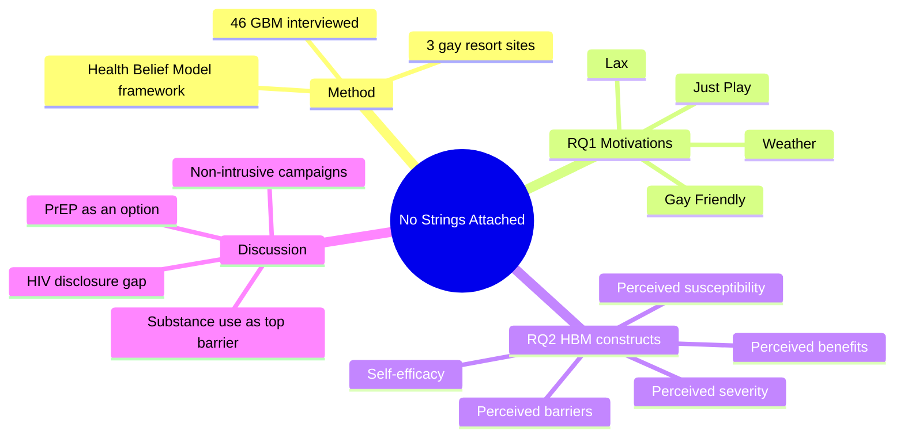
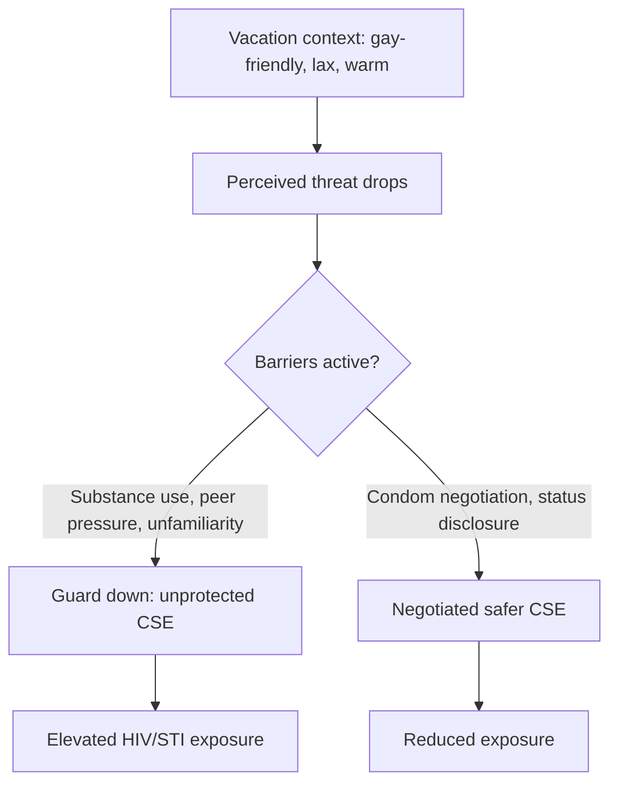
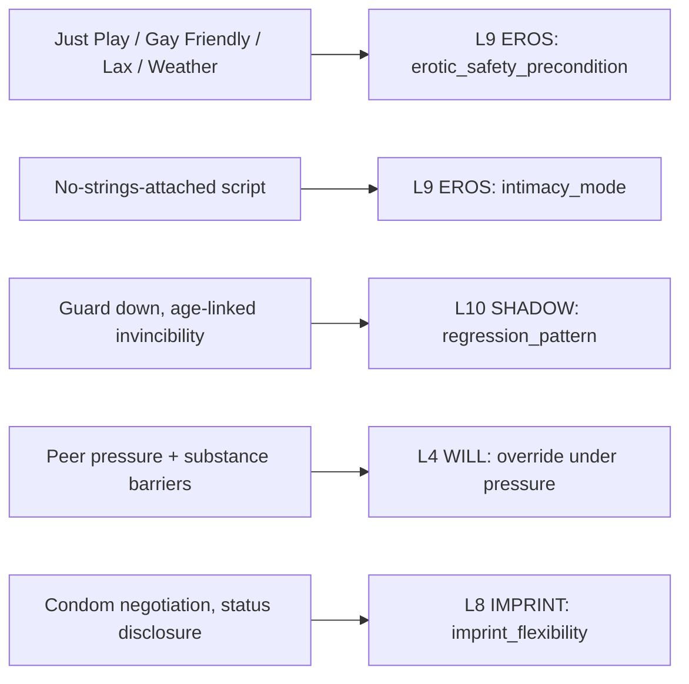
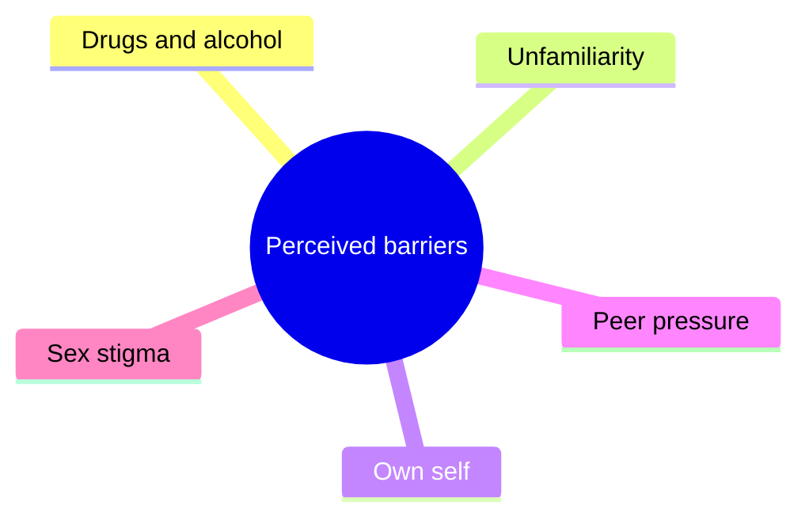

# BVX.1135 — "No Strings Attached": A Qualitative Exploration of Gay and Bisexual Men's Motivations for and Attitudes toward Engaging in Casual Sex while on Vacation — Parrish et al. (2019)
### Knowledge Entry — Distill

A qualitative study of 46 gay and bisexual men (GBM) interviewed at three U.S. gay-resort towns, run through the Health Belief Model, on why vacation loosens sexual risk behavior and what specifically stops safer-sex habits from traveling with the person.

## TABLE OF CONTENTS
- [Core Thesis](#1-core-thesis)
- [Mind Models](#2-mind-models)
- [Framework](#3-framework--structure)
- [Key Concepts](#4-key-concepts)
- [Heuristics](#5-heuristics--decision-rules)
- [Invariants](#6-invariants)
- [Pitfalls](#7-pitfalls--myths)
- [Application](#8-application)
- [Cross-References](#9-cross-references)
- [Provenance](#10-provenance--confidence)

---

## 1 · CORE THESIS

Vacation at a gay-friendly, relaxed, warm-climate destination lowers perceived sexual-health threat by context, not by changing what a person knows. Substance use, peer pressure, and unfamiliarity then erode the barriers, benefits, and self-efficacy the Health Belief Model tracks, so risk goes up while stated knowledge stays the same.

---

## 2 · MIND MODELS

*Required. Minimum two diagrams, maximum five. See template §C for the rules.*

**Diagram 1 — the whole argument.**
Caption: *two research questions, one method, four motivation themes feeding five HBM buckets — the book on one screen.*

**Diagram 2 — the central mechanism.**
Caption: *the same atmosphere that enables casual sex also strips the barriers that would normally slow it down, unless self-efficacy specifically compensates.*

**Diagram 3 — mapped onto the Command's 12-layer character stack.**
Caption: *the study's own five HBM buckets sort into two layers doing most of the work, EROS's safety precondition and SHADOW's regression pattern, with WILL and IMPRINT picking up the two self-efficacy findings.*

**Diagram 4 — the perceived-barriers subcategory (a taxonomy).**
Caption: *barriers is the only HBM construct the study splits five ways — drugs/alcohol was named most, stigma least.*

---

## 3 · FRAMEWORK / STRUCTURE

Two research questions, run through one theoretical lens.

| Section | Content | Governing question |
|---|---|---|
| **Introduction** | Prior quantitative literature on GBM travel risk; the gap (no theory-guided qualitative work) | Why do gay-tourism destinations correlate with more sexual risk, and what explains it beyond correlation? |
| **Method** | 46 GBM, 3 sites, semi-structured interviews, grounded theory coding | Who was interviewed, and how were themes derived without imposing them in advance? |
| **RQ1: Motivations** | Four themes: Just Play, Gay Friendly, Lax, Weather | What motivates GBM to engage in casual sexual experiences (CSE) while traveling? |
| **RQ2: HBM constructs** | Five subcategories: susceptibility, severity, barriers, benefits, self-efficacy | How does HIV/STI threat perception actually factor into on-vacation sexual decisions? |
| **Discussion** | Intervention implications: PrEP, peer messaging, non-intrusive campaigns, pre-travel online outreach | What should health communicators do with these findings? |
| **Limitations** | Non-representative sites, self-report bias, HBM-only lens | What does the study not cover? |

The Health Belief Model (HBM) supplies the paper's whole second half: perceived susceptibility, perceived severity (together "perceived threat"), perceived barriers, perceived benefits (together "perceived threat reduction"), and self-efficacy (p. 4).

---

## 4 · KEY CONCEPTS

| Concept | What it is | Why it matters |
|---|---|---|
| **Health Belief Model (HBM)** | Five-construct model of health-prevention behavior: susceptibility, severity, barriers, benefits, self-efficacy | The paper's entire analytic frame for RQ2; first qualitative, theory-guided study of this population (p. 4) |
| **Just Play** | Living in the moment; the trip is long enough for a spontaneous hookup, too short for a relationship | Most-referenced motivation theme; the time-bounded window is itself the permission structure (p. 6–7) |
| **Gay Friendly** | The destination's welcoming, non-judgmental atmosphere ("everyone... treat[s] people like people") | Second-most-referenced theme; removes the fear of harassment that constrains behavior at home (p. 7) |
| **Lax** | A relaxation of normal behavioral rules, paired closely with Gay Friendly in interviews | The direct bridge from "comfortable" to "guard down"; participants named "values change" on vacation (p. 8) |
| **Weather** | Warm climate, exposed bodies, outdoor sexualized visibility (bathhouses, beaches) | The most concrete, least abstract trigger; ties environment directly to noticing and pursuing partners (p. 8) |
| **Perceived susceptibility** | Whether a participant believes he personally could contract HIV/STIs | Includes named misconceptions, e.g., HIV framed as an age-linked, not behavior-linked, risk (p. 9) |
| **Perceived severity** | Whether HIV/STIs are seen as a serious outcome | Includes the belief that infections "can be cured with a shot" (p. 10) |
| **Perceived barriers (5 subthemes)** | Drugs and alcohol, unfamiliarity, own self, peer pressure, sex stigma | Drugs/alcohol was the most-mentioned barrier overall; peer pressure outweighed "own self" in mentions (p. 10–12) |
| **Perceived benefits** | Anonymity, and the freedom to "act differently from home" | The one construct framed positively; some men reported vacation as *easier* to be safe in because nothing is pre-planned (p. 12–13) |
| **Self-efficacy (3 subthemes)** | Condom negotiation (verbal or nonverbal), HIV status disclosure, peer influence | Condom negotiation ranged from an explicit "no condom, no sex" rule to a silent, physically-presented condom (p. 13) |
| **Grounded theory / axial coding** | Line-by-line open coding by two independent coders, then collaborative axial coding to saturation (Corbin & Strauss, 2008) | Themes emerged from the data rather than being coded to a predetermined list (p. 6) |

---

## 5 · HEURISTICS & DECISION RULES

| Situation | Do this | Not this |
|---|---|---|
| Writing a character's vacation-context risk spike | Anchor it to one specific atmosphere theme (time-bounded window, non-judgment, relaxed rules, or climate/visibility) | Rewrite the character's baseline EROS/SHADOW settings to explain a single scene |
| Character rationalizes skipping protection | Use a named, specific misconception (age-linked invincibility, "cured with a shot") as the mechanism | Have the character state accurate risk knowledge and then ignore it with no in-scene cause |
| Two characters negotiate condom use on the page | Pick one of the two documented styles, an explicit rule stated up front, or a silent, physically-presented condom | Skip the negotiation beat; the study treats it as a named, variable behavior, not a given |
| A peer pushes a character toward risk | Route it through direct peer talk normalizing unprotected sex ("how great it is to get barebacked") | Leave peer pressure as unstated ambient influence |
| Building a resort-town scene that needs safer-sex set dressing | Use bowls of condoms as available, low-key detail; keep any messaging light | Saturate the scene with visible anti-sex messaging; the study's own discussion flags intrusive campaigns as ineffective with this population |
| Deciding whether a character's habits travel with them | Check whether the habit is a fixed personal policy (some participants kept the same rule at home and away) or context-dependent (others changed) | Assume every safety habit either always holds or never does |

---

## 6 · INVARIANTS

1. Sample: 46 GBM, ages 22–63 (M = 37.1, SD = 10.7), recruited at Key West FL, New Orleans LA, and Rehoboth Beach DE (p. 4).
2. Demographics: 76.3% White/non-Latino, 18.4% Latino, 5.3% African-American; travelers came from 14 U.S. states, Washington DC, and one European country, every U.S. Census region represented, South region 44% (p. 4).
3. Data collected 2008–2009 via 60–90 minute, semi-structured, audio-recorded interviews in a private setting near the recruitment venue; $50 compensation (p. 5).
4. Coding: two independent coders, line-by-line open coding, then collaborative axial coding, continued to data saturation (p. 5–6).
5. Four motivation themes for CSE, in descending order of how often participants referenced them: Just Play, Gay Friendly, Lax, Weather (p. 6–8).
6. Five HBM constructs organize the risk-cognition findings; perceived barriers is the only construct split into subthemes (five: drugs/alcohol, unfamiliarity, own self, peer pressure, stigma), and drugs/alcohol was the most-mentioned barrier (p. 9–12).
7. Self-efficacy carries three subthemes: condom negotiation, HIV status disclosure, peer influence (p. 12–13).
8. Funded by NIMH grant R21-MH078790 (Eric G. Benotsch, Principal Investigator) (p. 16).

---

## 7 · PITFALLS / MYTHS

- Believing HIV/AIDS is "an old person's disease," tied to a partner's age rather than to behavior: *"It's older people who have AIDS; it doesn't have anything to do with us. We're young and I only stick with younger guys!"* (Key West #12, age 55, White, p. 9).
- Believing STIs "can be cured with a shot" (Rehoboth Beach #12, age 43, White, p. 10).
- Reading unfamiliarity with a partner as purely a risk factor; several participants named it as protective instead ("just don't jump into sex... know what that person's like before having sex," Key West #6, age 30, Latino, p. 11).
- Assuming visible, heavy safer-sex messaging is the effective intervention; the paper's own discussion argues intrusive or "pronounced anti-sex" campaigns are "unlikely to be effective" with a population traveling specifically to relax (p. 14).
- Treating "peer pressure" and "own self" as the same barrier; participants referenced peer pressure more, making it the stronger of the two named barriers, not interchangeable with personal restraint (p. 11–12).

---

## 8 · APPLICATION

- **Spine level:** SETTING. The source operates at situational/psychological altitude, not story-plot structure (L0–L7); its real payload is atmosphere data for three named gay-resort settings.
- **12-layer character stack:** primary on **L9 EROS** (`erotic_safety_precondition`, `intimacy_mode`); supporting on **L10 SHADOW** (`regression_pattern`); contextual on **L4 WILL** and **L8 IMPRINT** (peer/substance override, imprint_flexibility) — see Diagram 3.
- **plot_systems:** a context-change disinhibition device — a character's established EROS/SHADOW baseline gets stress-tested by a venue change (travel, a party, an unfamiliar city), producing risk behavior inconsistent with their at-home pattern without requiring a personality rewrite. The four motivation themes (time-boxed window, non-judgment, relaxed rules, climate/visibility) are ready-made, separable triggers for that device.
- **Setting:** Key West FL, New Orleans LA, and Rehoboth Beach DE, all real gay-resort towns, documented with concrete atmosphere detail (a "party" reputation, elevated local HIV prevalence, visible condom bowls at venues) usable if the Command sets a scene in one of these towns or a close analog.

This source sits beside [[BVX.1127]] (Levine & Heller, *Attached*) on the same two layers, L9 and L8, but from the opposite mechanism: Levine and Heller model a stable, trait-like attachment style; Parrish et al. model a situational override of whatever baseline a character already has, useful when a scene needs risk behavior that does not imply the character's underlying style changed. It also parallels [[BVX.0209]]'s fear-overrides-resolve shape at L4, run here by peer pressure and substance use rather than a dated wound.

**For the character system:**
- No new formal field is proposed for L9 or L8; both `erotic_safety_precondition` and `imprint_flexibility` already exist and this source is direct scoring evidence for them.
- Candidate: `peer_and_substance_override` as a named modifier under L4 WILL, distinct from WOUND-triggered overrides, for scenes where social or chemical pressure (not a personal trigger) is what bends a character's stated intent.
- What this source cannot supply: any quantitative prevalence data of its own (all numbers are demographic, not behavioral-frequency counts), a non-U.S. or non-English-speaking sample, or coverage of lesbian/bisexual women or trans travelers.

---

## 9 · CROSS-REFERENCES

| Related entry | Relation |
|---|---|
| [[BVX.1127]] | Levine & Heller's stable attachment-style model (L8/L9) is the trait-side counterpart to this paper's situational-override model on the same two layers |
| [[BVX.0209]] | Puglisi and Ackerman's fear-overrides-resolve mechanic at L4 is the same shape this paper documents for peer pressure and substance use, a different trigger for the same override pattern |
| [[BVX.0614]] | Todorov's structural account of desire/taboo at L9 (`desire_vector`, `erotic_safety_precondition`) approaches the same field from literary theory rather than empirical interview data |

---

## 10 · PROVENANCE & CONFIDENCE

Sourced from a clean `pdftotext -layout` extraction of the 20-page PDF (a journal cover/offprint page plus the 19-page typeset article from *Journal of Gay & Lesbian Social Services*, DOI 10.1080/10538720.2019.1615590). The text layer was intact throughout, no OCR artifacts, no garbling, running headers ("C. PARRISH ET AL." plus printed page number) present on every page and used for the page citations above. The article was read in full end to end, per distill instructions for an article-length source: Abstract, Introduction, Method (Participant recruitment, Interviewers, Data collection, Data analysis), Results (both research questions and all nine named themes), Discussion, Limitations and future research, Conclusion, and the Funding note. All quotes above are copied verbatim from the extraction. The reference list (pp. 16–19) was read to confirm cited-study claims (e.g., the HBM's five-construct definition, the grounded-theory method citations) but individual references were not separately pulled or distilled.

## META
- Template: BVX-LEARN-v4.0
- Source classification: full-text pdftotext extraction, clean text layer, read whole (article-length source)
- Created / Updated: 2026-09-24
