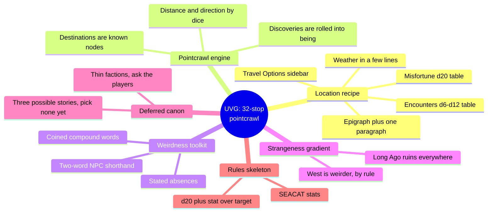
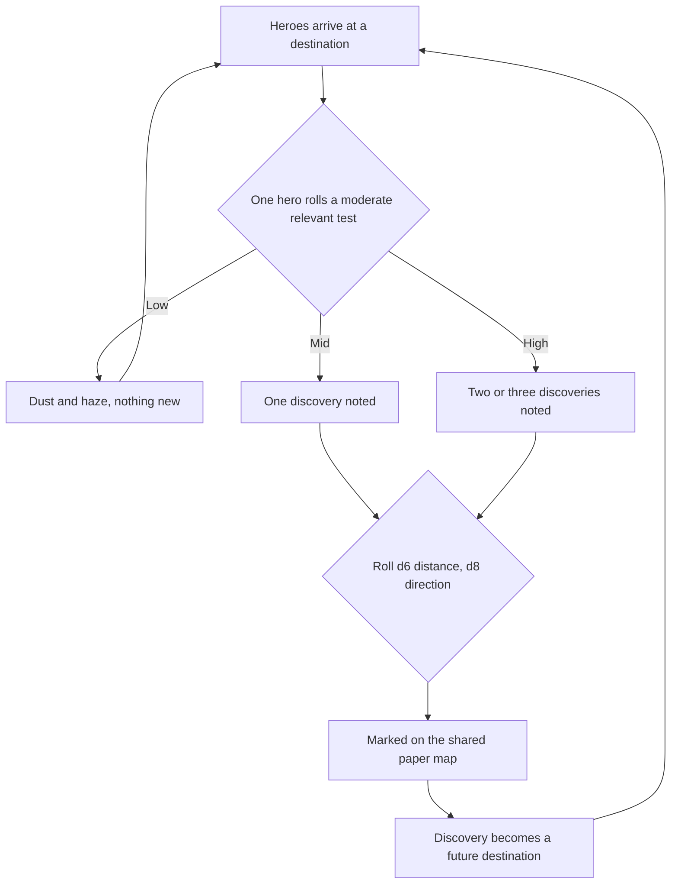
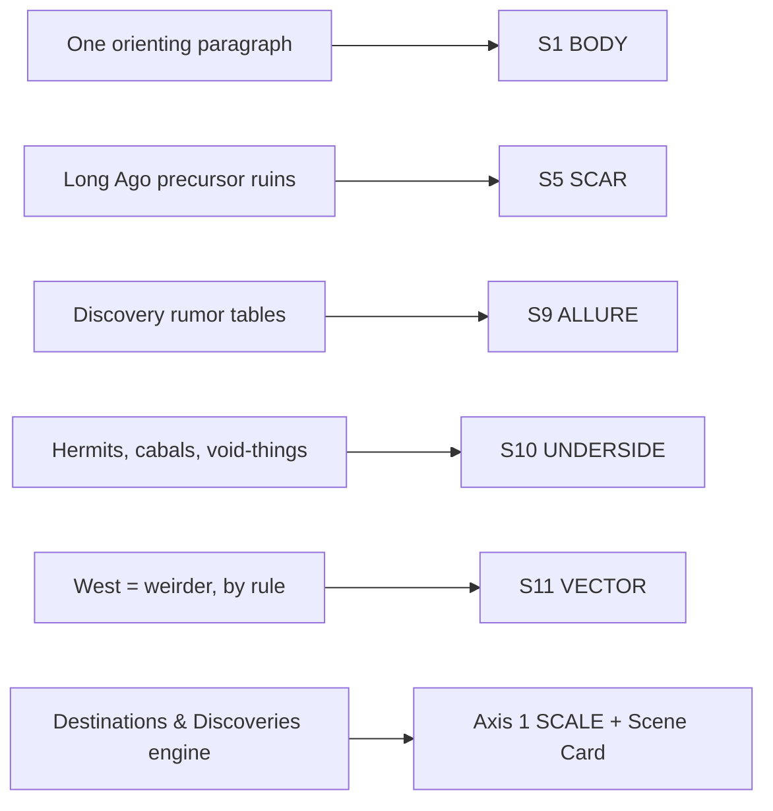

# BVX.1137 — Ultraviolet Grasslands and the Black City (2nd ed.) — Luka Rejec (2020)
### Knowledge Entry — Distill

A psychedelic-heavy-metal hexcrawl-that-calls-itself-a-pointcrawl: thirty-two hand-built waypoints from the Violet City to the Black City, read here for the engineering trick that makes a very strange world feel fully realized in almost no prose per place.

## TABLE OF CONTENTS
- [Core Thesis](#1-core-thesis)
- [Mind Models](#2-mind-models)
- [Framework](#3-framework--structure)
- [Key Concepts](#4-key-concepts)
- [Heuristics](#5-heuristics--decision-rules)
- [Invariants](#6-invariants)
- [Pitfalls](#7-pitfalls--myths)
- [Application](#8-application)
- [Cross-References](#9-cross-references)
- [Provenance](#10-provenance--confidence)

---

## 1 · CORE THESIS

The UVG proves a strange world needs only one tight sensory paragraph per place, then a few dice tables that generate everything else in play. All thirty-two pointcrawl destinations run one recipe — orient, weather, misfortune, encounters, travel options — so the referee writes once and improvises forever. Strangeness is a dial: it climbs by rule as the road runs west.

---

## 2 · MIND MODELS

*Required. Minimum two diagrams, maximum five.*

**Diagram 1 — the whole argument.**
Caption: *one book, six repeating devices — the pointcrawl is the spine, everything else is the same recipe run thirty-two times with the weirdness dial turned up a notch each stop.*

**Diagram 2 — the central mechanism (the Destinations-and-Discoveries engine).**
Caption: *the map grows at the table by a roll, not on the author's desk before play — this loop is why thirty-two written stops can feel like an endless world.*

**Diagram 3 — mapped onto the Command's SETTING SLICE.**
Caption: *five S-layers and the SCALE axis absorb this book cleanly; the pointcrawl engine itself is the find worth stealing outright, not just reading for flavor.*

---

## 3 · FRAMEWORK / STRUCTURE

Three unequal thirds, by the author's own preface: two-thirds of the book (pp.6–132) is the thirty-two destinations in strict east-to-west order; the center (pp.133–155) is the SEACAT rules skeleton, presented as adaptable scaffolding rather than a locked system; the last third (pp.156–193) is reference matter — maps, caravans, factions, equipment, trade goods, spells, glossary.

Every destination chapter runs the same six beats, regardless of how far into the strangeness gradient it sits:

| Beat | What it does |
|---|---|
| **Epigraph** | A song lyric (Hendrix, Blue Öyster Cult, others) sets tone before a word of setting text |
| **Orienting paragraph** | One dense paragraph fixes geography, faction, and mood in declarative sentences |
| **Weather** | Two or three lines of climate and light, no more |
| **Misfortune** | A d20 Charisma table for what goes wrong just arriving |
| **Encounters** | A d6–d12 table of who or what is nearby, each entry a fragment not a scene |
| **Travel Options** | A sidebar naming every route out, its time-cost, and a one-line teaser for where it leads |

Named sub-locations within a chapter (a citadel's wards, a serai's sectors) repeat a shrunk version of the same recipe: a short paragraph, then a table. Margin boxes titled "Making the Ultraviolet Grasslands Yours" interrupt the main text at a real example to teach a general technique in place, rather than collecting craft advice into a separate theory chapter.

---

## 4 · KEY CONCEPTS

| Concept | What it is | Why it matters |
|---|---|---|
| **Pointcrawl** | A network of known destinations linked by labeled routes (time-cost, not distance-in-hexes) | Frees the referee from mapping exact terrain between stops; only the nodes and the travel-time labels need to exist |
| **Destinations vs. Discoveries** | Destinations are the 32 pre-written waypoints; Discoveries are new locations a dice table invents near a destination, during play | The author only ever writes the skeleton; the table generates the flesh the campaign actually needed |
| **The location recipe** | The fixed six-beat structure (epigraph, paragraph, weather, misfortune, encounters, travel options) | A referee can build a 33rd stop from the same mold without re-deriving the book's format |
| **(L#, adjective) shorthand** | Every NPC or monster gets a level number plus one or two adjectives instead of a stat block or biography | Characterization in two words, mechanical weight in one number — the book's core weirdness-per-word economy |
| **West = weirder gradient** | A stated authoring rule: strangeness increases the farther a location sits toward the Black City | Turns tone management from a feel the referee has to hold in their head into a checkable position on a line |
| **The Long Ago** | A single named precursor civilization whose fall explains every ruin in the setting | One reusable label replaces inventing a fresh backstory for every dungeon or wreck |
| **Sack economy** | Supplies, cargo, and treasure are abstracted to a count of "sacks," never itemized | Keeps travel bookkeeping light enough to run session to session without a spreadsheet |
| **"Making it Yours" sidebars** | Margin boxes that address the referee directly, next to the example they explain | Teaches technique in the moment it's needed, not in a chapter the reader may skip |
| **Deferred canon (factions, histories)** | Factions get a paragraph of hooks and open questions; a location gets two or three "Possible Stories," none yet true | Nothing is decided before a player asks, so table talk becomes worldbuilding instead of lookup |
| **Coined compound words** | Invented adjectives ("electromagnificent," "carnibotanic," "abmortal") do sensory and worldbuilding work at once | One coinage, reused everywhere it fits, reads as a whole culture's vocabulary rather than one-off flavor text |

---

## 5 · HEURISTICS & DECISION RULES

| Situation | Do this | Not this |
|---|---|---|
| Writing a new pointcrawl stop | One paragraph of concrete sense-detail, then hand off to tables for weather, misfortune, encounters | Write pages of lore before a single table exists to generate play |
| Populating an NPC or monster on the fly | Give it a level number and one or two adjectives | Write a paragraph biography for a creature that appears once |
| Deciding how weird a location should feel | Check its position on the east-to-west gradient and dial tone to match | Improvise strangeness inconsistently from scene to scene |
| A faction gets mentioned in play | Write its hooks and open questions, then ask a player to answer one | Fully specify leadership, headquarters, and goals before anyone asks |
| A location needs a backstory | List two or three plausible pasts; decide which is true only when it matters | Lock one canonical history before the players ever go looking |
| Players want to know what's over the horizon | Roll the discovery table, then the d6/d8 distance-and-direction dice | Pre-map every possible location before the campaign starts |
| Naming a strange creature, place, or substance | Coin one compound word and reuse it everywhere it fits | Invent a fresh one-off term for every new appearance |
| Handling travel logistics between stops | Abstract to one Travel Options sidebar: route name, time-cost, one-line teaser | Track exact mileage, terrain, and day-by-day weather per hex |

---

## 6 · INVARIANTS

1. **Every destination follows the same six-beat recipe.** The referee never has to remember a different format for a different chapter.
2. **Discoveries are generated at the table, never pre-written beyond the 32 destinations.** The book's map is deliberately incomplete by design, not by oversight.
3. **Stated strangeness never decreases going west.** The gradient only escalates toward the Black City; it is a one-way dial.
4. **Every NPC or monster carries a level number even when it carries nothing else.** Combat math survives no matter how thin the flavor text.
5. **No canon is spent on a fact players have not yet touched.** Factions, histories, and discoveries stay underspecified until asked about.
6. **A "sack" is the smallest unit of resource bookkeeping.** Nothing in the travel rules forces itemization below that grain.

---

## 7 · PITFALLS / MYTHS

- Mistaking the pointcrawl for a hexcrawl and grid-mapping exact distances the format deliberately declines to fix.
- Writing full lore for a Discovery before a table has generated it — discoveries exist because a die said so, not because the author pre-wrote them.
- Giving every monster a paragraph description; the two-word (L#, adjective) shorthand is the intended form, not a placeholder for a fuller write-up later.
- Front-loading exposition instead of trusting one paragraph plus tables to carry the location — the orienting paragraph is the whole prose budget, not an opening act.
- Treating "west is weirder" as a vibe the referee holds in their head instead of an explicit, checkable authoring instruction repeated in the text.
- Fully resolving a faction's leadership or a location's true history before players ask, closing the doors the underspecified design meant to leave open.

---

## 8 · APPLICATION

- **Spine level:** SETTING (non-story-structural; a worked pointcrawl and its writing toolkit, not a story-spine source)
- **12-layer character stack:** none directly — this is a setting-side source; the (L#, adjective) NPC shorthand is a compressed-characterization trick worth stealing for quick-hit background characters, but it is not itself a character-layer feed
- **plot_systems:** primary candidate once `04_PLOT_SYSTEMS/` opens — the Destinations-and-Discoveries engine (Diagram 2) is a ready-made procedure for growing a sandbox map live at the table, and "Three Possible Stories" is a ready-made deferred-canon device for any location still awaiting a decision
- **Setting:** primary — feeds six SETTING SLICE variables (S1, S5, S9, S10, S11, plus an `instance_uvg` SCALE-axis reference and a `pointcrawl_engine` candidate mechanism), detailed in frontmatter `feeds:`

For a science-fiction setting system built on TTRPG craft, this book's steal is less "planets are strange" and more "here is the exact word-budget per place, and here is the machine that keeps generating strangeness after the author stops writing." The location recipe (one paragraph, then tables) is directly portable to any sector-crawl or star-hop structure: write the fixed six beats per system or station, then let a discovery table — not more authored prose — supply whatever the players go looking for beyond the map's edge. The west-is-weirder gradient generalizes to any axis a setting wants to escalate along (deeper into a derelict fleet, farther from a colonized core, later into a collapse) — the lesson is to *name the gradient explicitly*, the way UVG does, so tone stays consistent under improvisation instead of drifting by feel. The (L#, adjective) shorthand is worth lifting wholesale for any NPC who exists for one scene: a threat number and two words beat a paragraph nobody will read aloud. And the "Making It Yours" sidebar device — teaching technique in the margin next to the worked example, not in a separate theory chapter — is itself a documentation pattern the Command's own SSOT write-ups already lean on.

---

## 9 · CROSS-REFERENCES

| Related entry | Relation |
|---|---|
| [[BVX.0546]] | Duplicate catalog entry for the same book (same Zotero source, indexed twice) — collapse on next index pass, this distill is canonical |
| [[BVX.0458]] | Kobold Guide to Worldbuilding — the theory sibling; its "present-tense history" rule and post-apocalyptic default are the same claims UVG's "Long Ago" and Travel Options make concrete, table-driven, and repeatable |
| [[BVX.1122]] | GURPS Hot Spots: Renaissance Venice — the other worked-instance sibling; where Venice is one richly-researched settlement, UVG is thirty-two thin, table-generated stops — the two bracket how much prose a SETTING SLICE fill actually needs |
| [[BVX.0349]] | Against Worldbuilding, and Other Provocations — UVG's deferred-canon devices (thin factions, unresolved histories) are a worked answer to Kennedy's kitchen-sink warning: build the hooks, not the encyclopedia |
| [[BVX.0067]] | Collaborative Worldbuilding for Writers and Gamers — undistilled sibling; UVG's "ask the players to answer one question about any faction they touch" is a direct instance of that book's collaborative-authorship claim |

---

## 10 · PROVENANCE & CONFIDENCE

Full text available (pdftotext extraction, 198 pages), read selectively per the brief's scope and token ceiling rather than end to end. Read in full: front matter, dedication, and acknowledgments; "Using the Ultraviolet Grasslands" (the author's own reading guide, pp.2–3); the complete Table of Contents; "Reading the Ultraviolet" (the rules-primer sidebar explaining tests, dice, and tone, pp.7–8); Chapter 1, Violet City — epigraph, orienting paragraph, Weather, Misfortune, Encounters, and Travel Options in full (pp.8–9); "Destinations and Discoveries," the pointcrawl-mechanics section, in full (pp.151–152), plus the adjacent Starvation/Thirst/Death-and-Hakaba sections sampled for tone; Chapter 32, Black City — opening description, Weather, Misfortune, Encounters, and the Last Camp sub-location, in full (pp.120–122); the "Making the Ultraviolet Grasslands Yours" sidebar and "Three Possible Stories" device at Cerulean Five Oasis (pp.49–50).

Sampled by targeted search across the remaining thirty chapters (Porcelain Citadel, Potsherd Crater, Steppe of the Lime Nomads, Last Serai, Way Stone Graveyard, Grass Colossus, Long Ridge, Moon-Facing Ford, the Near Moon, Glass Bridge, Three Sticks Lake, the Gall Grass, and others) to confirm the six-beat recipe, the Travel Options sidebar, and the (L#, adjective) shorthand hold across the full arc, and that the strangeness gradient is a real, checkable escalation rather than a claim only true near the Black City.

Not read: the SEACAT rules chapter proper (Heroes and the Cat, pp.133–155, mechanics-heavy character build and combat), Caravans, the Big Map appendix, Factions write-ups (pp.164–168), Equipment and Trade Goods (pp.170–179), the spells and history-generator back matter (pp.191–193), and the indices — none carry the pointcrawl-writing or weirdness-toolkit method this distill targets, and the brief scoped the read to the setting-building chapters rather than the mechanical middle and reference tail.

## META
- Template: BVX-LEARN-v4.0
- Source classification: full-text book, targeted deep extraction on the framing and two bracketing chapters (Violet City, Black City) plus the pointcrawl-rules section, sampled across the remaining thirty chapters for pattern confirmation
- Created / Updated: 2026-09-29
