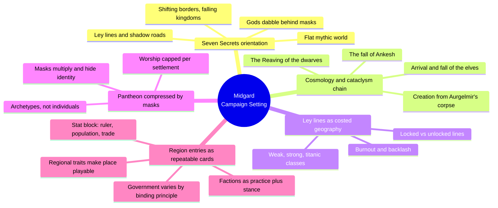
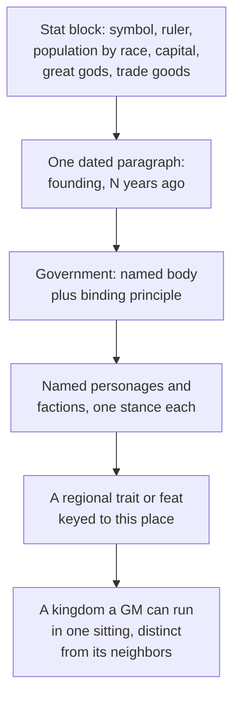
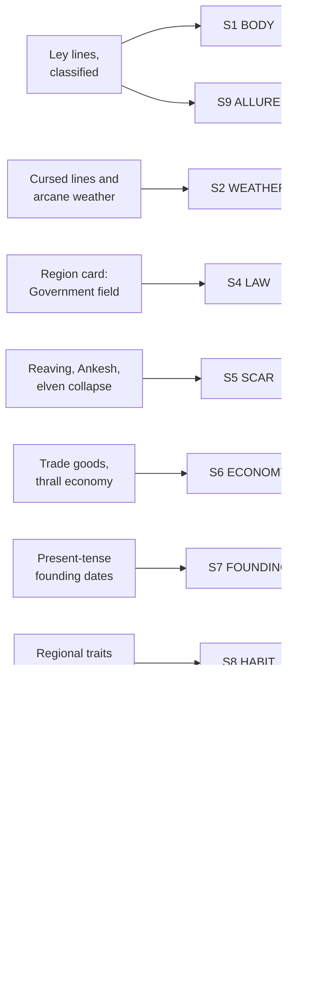

# BVX.1138 — Midgard Campaign Setting — Wolfgang Baur et al. (2012)
### Knowledge Entry — Distill

A 320-page worked campaign setting (Kobold Press) covering 50+ kingdom write-ups, a classified ley-line magic system, and a masked pantheon; the first world-scale SETTING-shelf instance, sibling to BVX.0458's theory and BVX.1122's single-city worked example.

## TABLE OF CONTENTS
- [Core Thesis](#1-core-thesis)
- [Mind Models](#2-mind-models)
- [Framework](#3-framework--structure)
- [Key Concepts](#4-key-concepts)
- [Heuristics](#5-heuristics--decision-rules)
- [Invariants](#6-invariants)
- [Pitfalls](#7-pitfalls--myths)
- [Application](#8-application)
- [Cross-References](#9-cross-references)
- [Provenance](#10-provenance--confidence)

---

## 1 · CORE THESIS

Midgard coheres through repetition, not reconciliation: a numbered secrets list orients every reader up front, ley lines classify and cost magic by place, masks compress an overgrown pantheon into regional identity, and every region is built from one repeatable stat-block-plus-government card. Fifty-plus kingdoms read as one world because a handful of devices recur everywhere.

---

## 2 · MIND MODELS

*Required. Minimum two diagrams, maximum five.*

**Diagram 1 — the whole argument.**
Caption: *five recurring devices, not fifty independent kingdoms, are the actual content of the book.*

**Diagram 2 — the central mechanism (a build process, run identically on every region).**
Caption: *the same five-step card turns a blank kingdom into a playable one, in the same order, every time.*

**Diagram 3 — mapped onto the Command's SETTING SLICE (S1–S12).**
Caption: *eleven of Midgard's own devices land cleanly on eleven of twelve slice layers; the book is a worked instance, not just a theory match.*

---

## 3 · FRAMEWORK / STRUCTURE

Ten chapters plus three appendices, bookended by design: Chapter 1 states the setting's twists before any gazetteer detail, and Chapter 10 closes by explaining the mechanism keeping 30-plus gods legible. Everything between is regional detail built on the same card.

| Chapter | Scale | Governing content |
|---|---|---|
| 1. Welcome to Midgard | World | Seven Secrets, Creation myth, cataclysm history, ley lines classified |
| 2. Heroes of Midgard | Race | Playable races: human, dwarf, elf, gearforged, kobold, minotaur, more |
| 3. The Crossroads | Region | Free City of Zobeck, the model region entry, in full |
| 4. The Rothenian Plain | Region | Steppe kingdoms, the windrunner elves' Eight Great Clans |
| 5. The Dragon Empire | Region | Elemental dragon-rulers, the Mharoti court |
| 6. Nuria Natal | Region | Southern desert kingdom, city-states of the Ruby Sea |
| 7. The Wasted West | Region | Post-catastrophe wasteland, cursed ley lines |
| 8. Domains of the Princes | Region | Feudal Grand Duchy of Dornig, minor houses |
| 9. The Northlands | Region | Norse-flavored kingdoms, honor and feud customs |
| 10. The Pantheon | World | Masks doctrine, regional god-lists, new domains |
| Appendices 1-3 | Mechanics/reference | AGE conversion, 26 place-keyed backgrounds, encounter tables, further reading |

Back-cover claim, confirmed in the text: "more than 50 kingdom write-ups, with new feats and traits for each region." The book is a gallery of that one card, run 50-plus times.

---

## 4 · KEY CONCEPTS

| Concept | What it is | Why it matters |
|---|---|---|
| **Seven Secrets of Midgard** | A one-page numbered list (flat world, ley lines and shadow roads, elemental dragon-rulers, hidden races, optional Status/Time rules, gods that dabble and wear masks, shifting borders) opening Chapter 1 | Compresses the whole setting's distinguishing twists into a single orientation page, before 300 pages of gazetteer detail arrive |
| **Ley line classification** | Three tiers (weak, strong, titanic) keyed to specific terrain (crossroads, hilltops, river confluences, mountain peaks, elven ruins), each with a power ceiling, a locked/unlocked state, and a burnout-backlash table | Magic is infrastructure with a location and a price, not an ambient "high magic" descriptor |
| **The masks doctrine** | Gods are archetypal wellsprings, not fixed individuals; they wear regional names and avatars, hide their true relationships from their own priests, and cap out around five or six active per city, fewer per town, one per village | Solves pantheon bloat and manufactures political mystery in one move; a god's mask set is also its worship footprint |
| **Regional pantheons** | Worship is organized by political geography (City Gods, Crossroads Gods, Dragon Gods, Northern Gods, Southern Gods), not a single setting-wide god list | A settlement's active gods characterize it as directly as its geography or ruler does |
| **The region-entry stat block** | A fixed field set (Symbol, Ruler, Important Personages, Population by race, Capital, Castles, Great Gods, Trade Goods) opening every write-up, then prose (founding flavor, Government, factions, districts) | The repeatable card that keeps 50-plus kingdoms consistent without becoming a reference-book slog |
| **Government varies by binding principle** | Zobeck: elected Free City Consul. The Free Cantons: dwarves who choose their own leaders. Dornig: hereditary Grand Duchy. Windrunner clans: single chieftain per bloodline | A per-region design choice, not a copy-pasted default; the fastest way to make one kingdom feel unlike its neighbor |
| **Regional traits as mechanized habit** | Background traits keyed to one place or culture (Waste-Scarred, Ley-Liner of Allain, Goblin Slayer of Bourgund) | Turns belonging into a character-sheet choice; a trait declares which region shaped a player |
| **Faction-by-practice** | Each named faction (the Eight Great Clans, the Crossroads Trading Houses, the Order of the Undying Sun) gets one distinguishing practice and one stated relationship to a rival or neighbor | A faction with a practice and a stance is usable at the table; one defined only by lore is not |
| **The cataclysm chain** | The Reaving, the fall of Ankesh (3,000 years ago), and the rise and fall of the 1,300-year elven empire overlap in time and geography | Connective scar tissue shared across regions, not an isolated backstory per kingdom |
| **Present-tense dating** | Founding events stated as a distance from now ("900 years ago"), each attached to a present political fact | History earns its length only by explaining something live today; the format itself enforces the discipline |

---

## 5 · HEURISTICS & DECISION RULES

| Situation | Do this | Not this |
|---|---|---|
| Introducing a new setting | Open with a short numbered list of what makes it not-generic | Bury the twist somewhere past chapter 1 |
| Placing magic in the world | Tie its power to classified terrain and a cost table | Use an ambient "high magic" descriptor with no mechanical footing |
| Writing a region's founding history | State it as "N years ago" with one present political consequence attached | Write a multi-page dynastic chronicle nobody at the table will use |
| Designing a large pantheon | Give every god a mask/alias set and cap active worship per settlement scale | Give each god one fixed name and domain with no ceiling on gods per town |
| Writing a kingdom entry | Lead with the stat block (ruler, population, capital, great gods, trade goods), then Government, then named factions | Bury facts a GM needs mid-table inside unbroken prose |
| Rewarding regional identity | Write one background trait per notable region or culture, keyed to its defining hazard or practice | Leave regional flavor as read-only description |
| Designing a faction or clan | Give it one named distinguishing practice and one explicit stance toward a neighbor or rival | Write a lore paragraph with no actionable stance |
| Linking regions into one world | Run at least one cataclysm or empire-fall whose ruins and grudges touch multiple current regions | Isolate each kingdom's history to itself |
| Varying government across a setting | Choose a distinct binding principle per region | Default every kingdom to the same monarchy template |

---

## 6 · INVARIANTS

1. **Every region entry states who rules, who else matters, how many of what live there, and what they trade before any prose description.** The stat block is load-bearing, not decorative.
2. **Magic tied to geography also carries a cost and a rarity ladder.** Ley lines without a burnout table or a weak/strong/titanic ceiling would be an ambient power dial, not a setting feature.
3. **A pantheon this large stays legible only with a compression rule.** Masks and a per-settlement worship cap are what keep 30-plus gods from becoming unmanageable bookkeeping.
4. **History earns its length only when it explains a present border, grudge, or ruin.** The present-tense-history rule, executed at the scale of 50-plus regions.
5. **A faction is defined by one distinguishing practice plus one relationship to a neighbor, not by a paragraph of description.**
6. **Regional identity becomes playable the moment it is written as a mechanical option** (a trait, a feat, a background) tied to a place, not merely described about it.
7. **The whole world's coherence runs on shared cataclysms**, not isolated per-kingdom backstories; ruins, bloodlines, and grudges cross regional boundaries.

---

## 7 · PITFALLS / MYTHS

- Treating a magic-geography feature like ley lines as flavor text, with no classification, location rule, or cost.
- Writing a pantheon where every god is a fixed, single-named vending machine; this kills the masks doctrine's reason for existing (mystery plus worship-capping).
- Front-loading a region write-up with prose before establishing who rules it and who lives there, burying facts a GM needs mid-session.
- Writing deep dynastic history that never touches a currently playable border, feud, or ruin.
- Giving every kingdom the same government type, when Zobeck's elected consulate, the cantons' self-chosen leaders, Dornig's hereditary duchy, and the clans' single chieftains are deliberately different principles.
- Naming a faction without a stance toward at least one neighbor; a faction with no friction is inert at the table.

---

## 8 · APPLICATION

- **Spine level:** SETTING (non-story-spine source, per ssot_03's binding rule that setting is a Domain embodied, never an L0–L7 level)
- **12-layer character stack:** none directly; the regional-trait mechanism (S8 HABIT made a character-sheet choice) is structurally the same move as keying an L8 IMPRINT field to a place, but this source stays setting-side
- **plot_systems:** contextual candidate once `04_PLOT_SYSTEMS/` opens; the region-entry card's factions-with-a-stance field is a ready-made conflict-hook generator, run any drafted region through "who does this faction stand against" before trusting it playable
- **Setting:** primary; this is the first world-scale worked SETTING instance in the library, landing on eleven of twelve SETTING SLICE layers at primary or supporting strength, plus L7 genre-contract contextually

The two devices most worth stealing for a science-fiction setting system: the region-entry stat block and the masks doctrine. The stat block generalizes directly: any setting with more than a handful of polities needs one fixed field set (who's in charge, who else matters, population makeup, what it trades, its defining institution) ahead of prose, or the gazetteer becomes unusable past the first dozen entries. The masks doctrine generalizes less obviously but as usefully: any system risking proliferating named entities (gods, factions, AI cores, corporate boards) can cap how many are locally active and let the rest exist as aliases of the same small underlying set. Tested against the DCUS starter instance in `ssot_03`, the cataclysm-chain device matches DCUS's own S5 SCAR rename lattice (Red Stick Creek to Red Hills to DCUS) at institutional rather than civilizational scale, confirming Grubb's Apocalypso rule (BVX.0458) generalizes down in size as well as up.

---

## 9 · CROSS-REFERENCES

| Related entry | Relation |
|---|---|
| [[BVX.0458]] | The Kobold Guide to Worldbuilding — theory/toolkit sibling; this entry is Grubb's Apocalypso rule, Baur's present-tense-history rule, and Baur's tribe/city-state/nation binding-principle claim, all run as a single 50-plus-region worked instance |
| [[BVX.1122]] | GURPS Hot Spots: Renaissance Venice — the other worked SETTING instance in the library, at single-city scale; this entry is the same method scaled to a whole world of regions |
| [[BVX.1137]] | Ultraviolet Grasslands and the Black City — undistilled sibling from the same intake batch, another SETTING-shelf sourcebook awaiting its own pass |

---

## 10 · PROVENANCE & CONFIDENCE

Full text, pdftotext extraction from a ~320-page PDF (two-column layout, machine-readable TOC). Read in full: Chapter 1 (Seven Secrets, Creation myth, the Reaving/Ankesh/elven-empire cataclysm chain, and the Ley Lines section including classification, locking, and the burnout-backlash table); Chapter 10's "Power Granted, Power Stolen," "How Gods Use Masks," and both Design Note sidebars; the Free City of Zobeck region entry in Chapter 3 (the model card, stat block through Government); the Eight Great Clans faction write-up in Chapter 4. Sampled: individual god entries (Thor, Freyr and Freyja, read for format); the New Backgrounds appendix (several traits read in full, remainder skimmed for pattern); chapter openings for Chapters 5 through 9 (stat blocks scanned to confirm the card recurs). Not read: full racial write-ups in Chapter 2, spell and magic-item lists, the AGE System appendix, and Appendix 2's encounter tables.

The `bvx_provisional: true` flag reflects a first-pass id assignment; the library previously listed this book as NEW with no Zotero key. The S-layer keying in `feeds:` and Diagram 3 is this distill's synthesis against `ssot_03_setting_system.md` (PART A), following the mapping method BVX.0458 and BVX.1122 already set for this shelf.

## META
- Template: BVX-LEARN-v4.0
- Source classification: full-text sourcebook, deep extraction on the setting-architecture chapters (1, 10, the Zobeck model entry, the Eight Great Clans), sampled on regional and mechanical chapters
- Created / Updated: 2026-09-29
