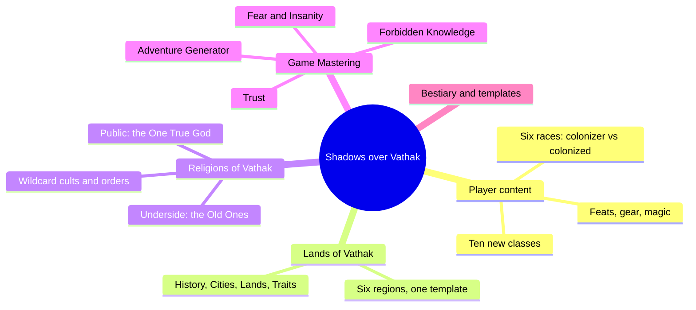
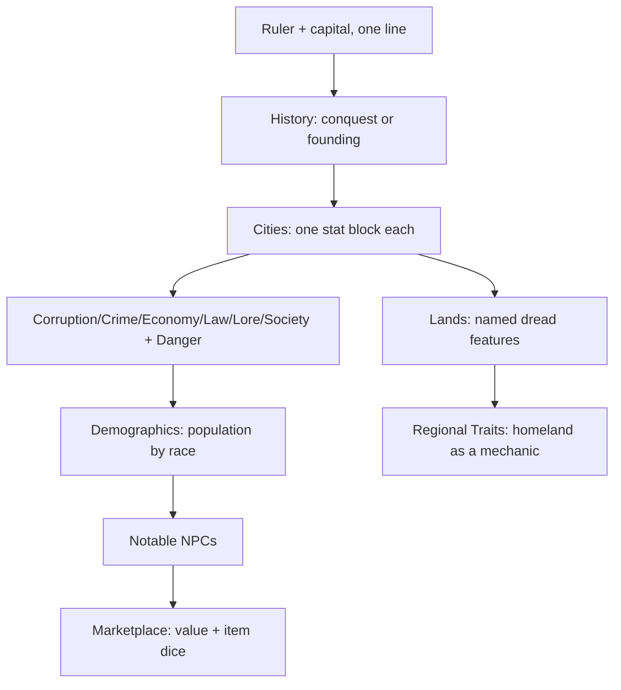
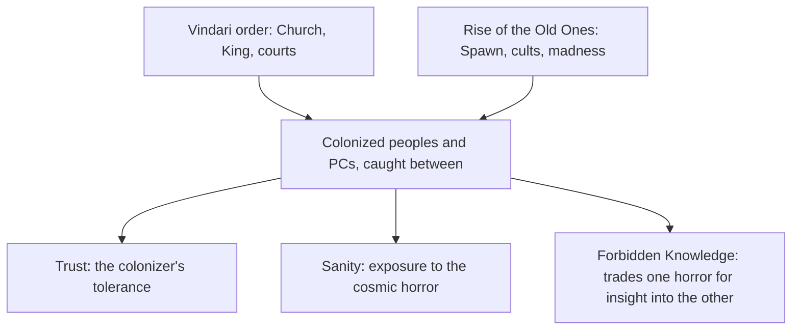
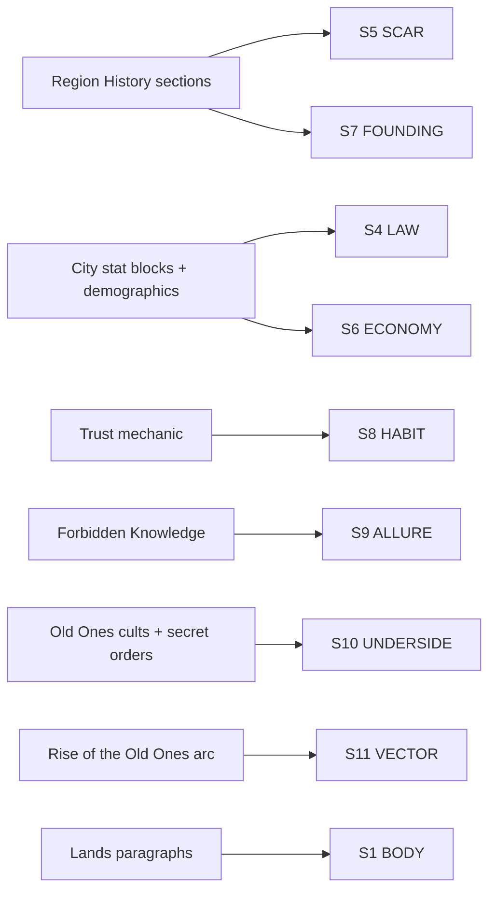

# BVX.1139 — Shadows over Vathak Campaign Setting — Jason Stoffa and Rick Hershey (2014)
### Knowledge Entry — Distill

A Pathfinder-compatible campaign setting book of Lovecraftian survival horror: read here not for its rules crunch but for its engineering, a colonizer-versus-colonized world with a cosmic horror rising underneath it, and the gazetteer template that gets reused six times to build it.

## TABLE OF CONTENTS
- [Core Thesis](#1-core-thesis)
- [Mind Models](#2-mind-models)
- [Framework](#3-framework--structure)
- [Key Concepts](#4-key-concepts)
- [Heuristics](#5-heuristics--decision-rules)
- [Invariants](#6-invariants)
- [Pitfalls](#7-pitfalls--myths)
- [Application](#8-application)
- [Cross-References](#9-cross-references)
- [Provenance](#10-provenance--confidence)

---

## 1 · CORE THESIS

Shadows over Vathak layers two horrors onto one map: a finished colonial genocide (the Great Cleansing, S5 SCAR) and an unfinished cosmic invasion (the Rise of the Old Ones, S11 VECTOR). Every region, religion, and player race sits between them, and three linked mechanics, Trust, Sanity, and Forbidden Knowledge, quantify exactly how close a character stands to each.

---

## 2 · MIND MODELS

*Required. Minimum two diagrams, maximum five.*

**Diagram 1 — the whole book.**
Caption: *player content, world, religion, and the GM's horror toolkit are four separate stacks, and the colonizer/colonized split runs through all four, not just the world chapter.*

**Diagram 2 — the central mechanism (a process: the region template).**
Caption: *one template runs six times without changing shape — History sets the wound, the settlement block quantifies who rules whom, and Regional Traits turn homeland itself into a character option.*

**Diagram 3 — the setting's double-horror engine.**
Caption: *two horrors bracket every character, an old human one and a new alien one, and the three signature mechanics each gauge distance from one or the other — closing ground on one often opens it on the other.*

**Diagram 4 — mapped onto the Command's SETTING SLICE.**
Caption: *nine of twelve layers fill from a named mechanic or section, not inference; S12 FUNCTION stays empty because a GM sourcebook commits to no single argument, exactly as GURPS Venice does.*

---

## 3 · FRAMEWORK / STRUCTURE

The book commits in a fixed order, and the order argues something: character options come before the world does, because the races themselves already encode the colonizer/colonized frame.

| Block | Governs | What it hands forward |
|---|---|---|
| **Races of Vathak** | Who a PC can be: vindari (colonizer), bhriota/romni/svirfneblin (colonized), cambion/dhampir (products of the violence) | The frame every later chapter assumes without re-explaining it |
| **Classes, Feats, Equipment, Magic** | New crunch (Apostle, Rifleer, Eldritch Conjuror; firearms; Forbidden Knowledge as a class feature) | Mechanical texture consistent with a gunpowder-and-eldritch-magic world |
| **Lands of Vathak** | Six regions, one template applied six times (Diagram 2) | The gazetteer's worked instances |
| **Religions of Vathak** | A public colonizer faith and a hidden colonized-and-cultist counter-religion | The underside layer that every region's cities gesture at but do not fully name |
| **Game Mastering** | The horror engine as usable subsystems: Adventure Generator, Trust, Fear and Insanity, Forbidden Knowledge, Weather, disease, settlement creation | The tools that turn "a dark setting" into a played one |
| **Monsters, Templates, Bestiary** | Creature stats plus a note on reflavoring familiar monsters for dread | The last mile: even an ordinary rat should not read as safe |

The introduction states the design origin directly: a 24-hour game-jam vote tied between "Lovecraftian/Eldritch horror" and "Survival horror," so the designers fused both rather than picking one. That fusion is the book's one unifying idea, expanded once per subsystem exactly as Kobold's "dynamite not encyclopedia" filter runs once per essay (BVX.0458).

---

## 4 · KEY CONCEPTS

| Concept | What it is | Why it matters |
|---|---|---|
| **Colonizer/colonized racial frame** | Vindari conquerors versus bhriota, romni, and svirfneblin natives; cambion and dhampir as literal products of the violence | Built into character creation, not stated once and forgotten; every PC race carries a side in the war |
| **The Great Cleansing** | A named, stated genocide: vindari armies exterminating native races under divine sanction | The setting's founding wound (S5 SCAR); local history repeats the act at smaller scale |
| **Rise of the Old Ones** | A second, ongoing apocalypse: cosmic Spawn erupting from underground, indifferent to the colonial war already underway | Proves a setting can carry two unresolved catastrophes at once, one closed, one open |
| **Trust score** | A 0-36+ gauge per settlement, rising from good deeds, falling from crime or deaths, with cumulative rewards and a floor state (Angry Mob) | Converts "are we insiders here" into a tracked, playable number instead of GM fiat |
| **Sanity Points and Fear Events** | Level plus Wisdom as a Sanity pool; DC 15 Will saves against a tiered table of horrific events (1d2 for a corpse, 1d10 for CR 16+ combat) | Makes horror mechanically costly even when a fight is easily won; nerve is its own resource |
| **Forbidden Knowledge tomes** | A lookup table: examination period, Knowledge (arcana) DC, spells granted, Sanity lost, per book | Literalizes allure (S9) as a printed exchange rate between power and mind |
| **The region template** | Ruler and capital, then History, then one settlement block per city, then named Lands features, then Regional Traits | The reusable gazetteer architecture, run six times without altering shape (Diagram 2) |
| **Settlement block as demographic instrument** | Corruption/Crime/Economy/Law/Lore/Society scores plus population by race | A city's numbers quietly report who rules whom; "14,000 Vindari; 2,000 Romni" is the conquest, in a table |
| **Two-tier religion** | A public, doctrinal Church (One True God) against scattered, doctrine-less Old One cults, plus wildcard secret societies | Doubles BVX.0458's public/mystery-cult split into two full religions of equal weight |
| **The village-quirk table** | Roughly fifty one-paragraph settlement oddities (silent villagers, a feared well, displaced language) | A reusable, setting-agnostic dread-injection device for any settlement regardless of history |
| **"Horror is more than gore"** | A design note in the Monsters chapter: reflavor even familiar, low-CR creatures for dread | Dread is a presentation discipline, not a stat-block property |

---

## 5 · HEURISTICS & DECISION RULES

| Situation | Do this | Not this |
|---|---|---|
| Building a conquered setting | Write the conquest into a playable race choice, not a history footnote | State the war happened once, then let players ignore it |
| Deciding whether a setting can hold two big threats | Stack a closed catastrophe (finished history) under an open one (active trajectory) | Pick one apocalypse and resolve or ignore the other |
| Modeling belonging | Track it as a number with floor and ceiling states and rewards at each rung | Leave "are they trusted here" to GM improvisation every time |
| Modeling dread from horror exposure | Cost it against a resource independent of hit points (Sanity, Will saves) | Let horror be purely descriptive, with no mechanical bite |
| Tempting players with forbidden power | Put a price on the same table as the reward (DC, spells, Sanity loss together) | Hand out power for free and describe consequences only in prose |
| Filling a settlement quickly at the table | Pull one quirk from a reusable list independent of that place's history | Improvise from nothing under time pressure, or leave the place generic |
| Writing a settlement's numbers | Let population-by-race and law/economy scores imply the power structure | State the power structure in prose and leave the numbers generic |
| Reusing a stock monster in a horror setting | Reflavor its presentation for dread regardless of its CR | Assume danger and dread are the same thing |
| Committing to a horror sub-genre | Name the fusion up front (here: Lovecraftian and survival horror combined) and let every later chapter inherit it | Let tone drift setting-piece to setting-piece |

---

## 6 · INVARIANTS

1. **A colonizer/colonized frame belongs in character creation, not just history.** The war is played, not read about, from the first race choice.
2. **A scar repeats at every scale it touches.** The Great Cleansing is a continental wound; each region's History section restates it locally.
3. **Two unresolved catastrophes can coexist if one is closed and one is open.** A finished genocide and a rising cosmic threat do not cancel each other; they compound.
4. **Belonging, sanity, and forbidden power are more useful as tracked numbers than as GM fiat.** Each gets its own gauge (Trust, Sanity, the tome table) rather than sharing one vague "horror meter."
5. **A gazetteer template earns its keep by repeating unchanged.** The region template runs six times with the same shape; variation lives in content, not structure.
6. **A settlement's numbers can carry political information the prose never states outright.** Demographics-by-race is a compressed history lesson.
7. **Dread is a presentation choice, separable from mechanical challenge.** A CR 1 rat and a CR 20 Old One can both be staged for horror; the stat block does not decide this.

---

## 7 · PITFALLS / MYTHS

- Treating the colonizer race as simply "the human option" rather than the setting's stated aggressor — the frame collapses if the vindari read as neutral.
- Writing a genocide as one-time backstory instead of something every region's local history re-derives at smaller scale.
- Letting a second apocalypse (the Old Ones) read as redundant with the first (the colonial war) rather than layering on top of it as a separate, ongoing arc.
- Treating "trust," "sanity," and "temptation" as one vague horror-vibe instead of three separable, trackable gauges with their own trigger conditions.
- Assuming a lookup table (Forbidden Knowledge) removes the need to narrate consequence — the table sets the price, the GM still stages the cost.
- Mistaking a settlement's stat-block scores for flavor rather than reading them as the political structure of the place.
- Assuming horror requires high-CR monsters — the book explicitly warns against this, insisting that presentation, not power level, produces dread.

---

## 8 · APPLICATION

- **Spine level:** SETTING (non-story-structural; a place-grade reference source, not a story-spine source)
- **12-layer character stack:** none directly — the colonizer/colonized racial frame is architecturally the same move as auditing an L5 WOUND against an L8 IMPRINT (a group identity built from a shared injury), but this source supplies the setting-side pattern, not a character-layer feed
- **plot_systems:** the region template (Diagram 2) and the village-quirk table are both directly reusable generators once `plot_systems` opens — the quirk table especially, as a setting-agnostic dread-injection device usable on any place regardless of its written history
- **Setting:** primary — a worked-setting instance for the SETTING shelf, filling nine of twelve S-layers richly (frontmatter `feeds:`) and supplying a genre-contract data point (L7) alongside BVX.0458's five-lineage taxonomy

For BOLO 87's sci-fi setting shelf, the transferable move is not "add Lovecraft," it is **the double-wound structure**: pick one closed catastrophe (a conquest, a war, an extinction already finished) and one open catastrophe (a threat still rising), and place every faction, region, and player-facing choice between them rather than inside either alone. A science-fiction analogue swaps the vindari empire and the Old Ones for a colonizing polity and an awakening non-human intelligence; the shape holds because it is structural, not genre-bound. Equally transferable: the three-gauge instinct (a social-standing number, a cost-of-exposure number, a temptation-with-a-printed-price mechanic) turns "this place is scary and political" into something trackable session to session, instead of leaving it to tone alone. And the region template itself, Ruler/Capital, History, one settlement block per locale, named dread features, homeland-as-character-option, is a genre-agnostic gazetteer skeleton: swap the settlement stat block for a station or colony readout and the architecture copies over unchanged, exactly as GURPS Venice's chapter skeleton (BVX.1122) proved portable from historical Venice to any worked place.

---

## 9 · CROSS-REFERENCES

| Related entry | Relation |
|---|---|
| [[BVX.0458]] | Kobold Guide to Worldbuilding — the craft-book counterpart; this entry is Baur's "post-apocalyptic default" and "public/mystery-cult" ideas run as a full worked instance rather than stated as a principle |
| [[BVX.1122]] | GURPS Hot Spots: Renaissance Venice — the closest sibling worked-setting instance; both prove the same region/city/gazetteer template family, though Venice fills S1/S4/S6/S7/S8/S11 richly with no S12, and Vathak adds a live S9/S10 horror-mechanic layer Venice never attempts |
| [[BVX.0349]] | Kennedy, *Against Worldbuilding* — the kitchen-sink counter-argument; Vathak's tight two-catastrophe structure is a worked counterexample to sprawl, everything present serves the double-wound, nothing reads as inventory for its own sake |
| [[BVX.0067]] | Collaborative Worldbuilding for Writers and Gamers — undistilled sibling, same SETTING shelf, same craft-not-theory register |

---

## 10 · PROVENANCE & CONFIDENCE

Full text, pdftotext extraction, ~250 pages. Read in full or near-full: the introduction and "Vathak, A Stricken World" framing; the Races chapter opening and the Bhriota entry (the clearest colonizer/colonized worked example); the Lands of Vathak landscape overview and the full Sileasia and Colonies region write-ups (History, city stat blocks, Lands, Regional Traits), plus the Ina'oth and Moorhaven History openings; the entire Religions of Vathak chapter (One True God, The Church and its orders, Holy Texts, Holidays, all four Old Ones, the wildcard factions); the Adventure Generator, Trust, Fear and Insanity, and Forbidden Knowledge sections; the Crime and Punishment table and roughly the first fifty entries of the Villages of Vathak quirk table; the Monsters chapter's framing essay ("Horror is more than just gore and guts").

Sampled at heading level only, not deep-extracted: the Classes, Feats, Equipment, and Magic chapters (crunch, out of scope for a setting-architecture distill); the Weather, Diseases, and Creating a Settlement sections (present per the TOC but not read, so `s2_weather` is omitted from `feeds:` rather than asserted thin); the Khrota and Grigoria write-ups; the full Bestiary, Templates, and Encounter Tables.

The S-layer keying in `feeds:` and Diagram 4 is this distill's synthesis against `ssot_03_setting_system.md`'s twelve-layer schema, following BVX.0458 and BVX.1122's method. `confidence: medium` reflects that roughly a third of the book (crunch chapters, the weather/disease/settlement-math appendix) was not read past its table of contents; the architecture claims here (the region template, the two-tier religion, the three horror gauges) are each grounded in a fully read section.

## META
- Template: BVX-LEARN-v4.0
- Source classification: full-text sourcebook, deep extraction on the setting/religion/GM-horror chapters, sampled on the crunch chapters and bestiary
- Created / Updated: 2026-09-29
