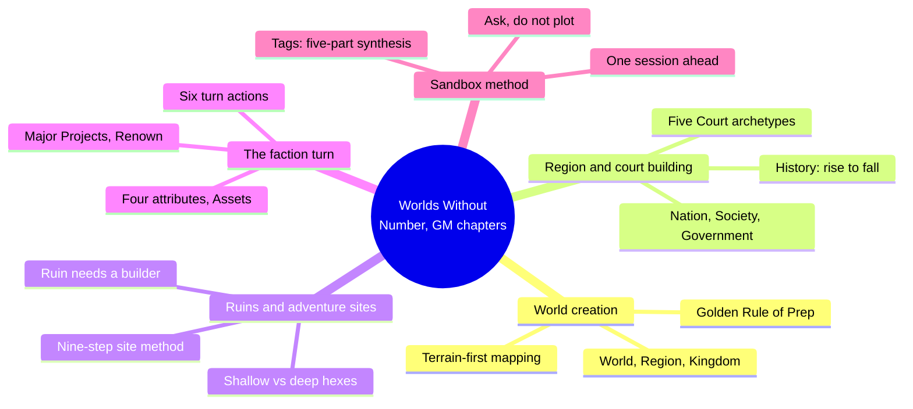
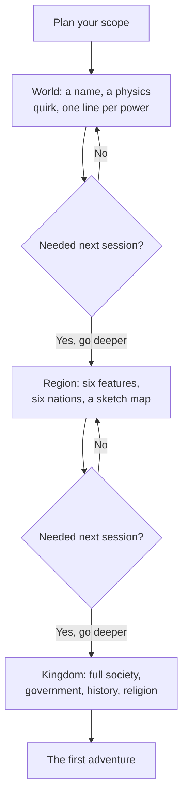
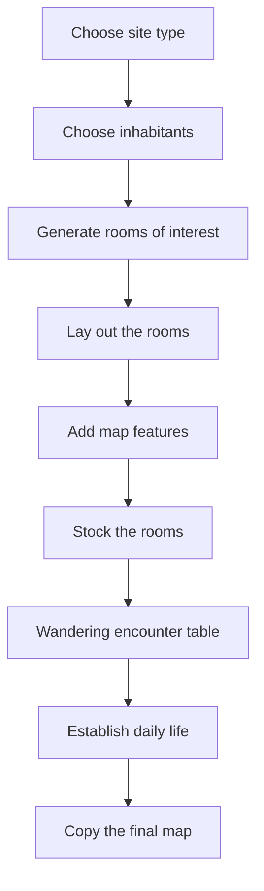
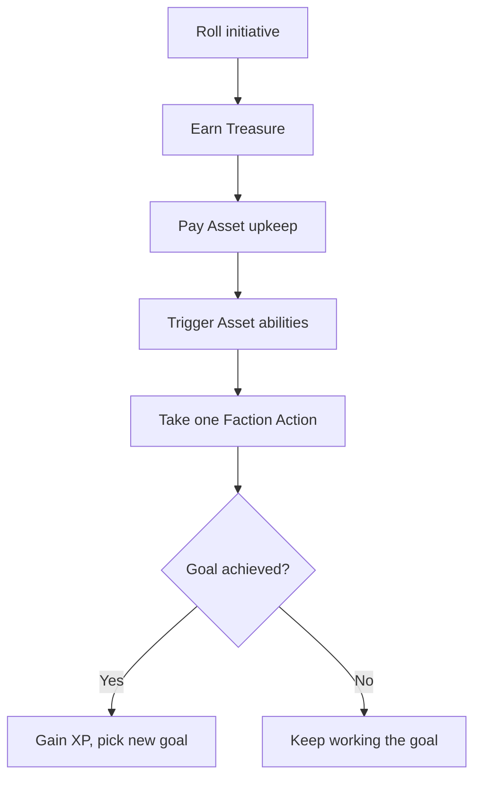
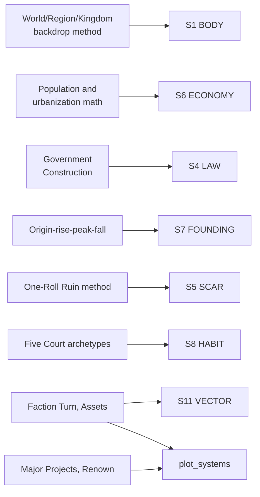

# BVX.1140 — Worlds Without Number (Free Edition) — Kevin Crawford (2021)
### Knowledge Entry — Distill

A fantasy OSR core rulebook whose middle third is a system-neutral GM toolbox for building a sandbox campaign top-down, generating ruins and dungeons with a repeatable method, and keeping the world moving between sessions with a faction-turn engine; read for the world/region/kingdom, adventure-creation, and faction chapters, not character or combat rules.

## TABLE OF CONTENTS
- [Core Thesis](#1-core-thesis)
- [Mind Models](#2-mind-models)
- [Framework](#3-framework--structure)
- [Key Concepts](#4-key-concepts)
- [Heuristics](#5-heuristics--decision-rules)
- [Invariants](#6-invariants)
- [Pitfalls](#7-pitfalls--myths)
- [Application](#8-application)
- [Cross-References](#9-cross-references)
- [Provenance](#10-provenance--confidence)

---

## 1 · CORE THESIS

A sandbox campaign is built top-down through a shrinking backdrop, world, region, kingdom, with detail budgeted by proximity to actual play, never by completeness. Ruins, governments, and history all follow one rule: they exist to manufacture adventure hooks and playable consequences, not verisimilitude. A faction turn keeps the world moving between sessions without the GM inventing motion from scratch.

---

## 2 · MIND MODELS

*Required. Minimum two diagrams, maximum five.*

**Diagram 1 — the whole argument.**
Caption: *five GM disciplines share one root habit, spend only as much creative effort as the next session actually needs.*

**Diagram 2 — the central mechanism (a build process, narrowing at each level).**
Caption: *each level only gets built once the GM confirms the next session actually needs it; refusal to descend is a valid, expected outcome.*

**Diagram 3 — the exploration-site method (a process, run once per ruin or hexcrawl).**
Caption: *the same nine-step pipeline builds a dungeon and a wilderness hexcrawl; only the last three steps change shape between them.*

**Diagram 4 — the faction turn (a recurring engine, run once per faction per turn).**
Caption: *a faction always resolves in this order, and a missed goal costs its next action instead of simply failing quietly.*

**Diagram 5 — mapped onto the Command's SETTING SLICE (S1–S12).**
Caption: *six of twelve layers land on a named procedure, not an inference; the faction turn is the one piece that reaches past SETTING into plot_systems.*

---

## 3 · FRAMEWORK / STRUCTURE

The free edition's GM-facing content sits in four chapters, one of them a worked example and three of them method:

| Chapter | Scale | Governing content |
|---|---|---|
| The World of the Latter Earth | World (worked instance) | A single worked setting, the Gyre: nations, epochs, and peoples proving the backdrop method holds up at full scale; sampled for structure, not deep-extracted for lore |
| Creating Your Campaign | World → Region → Kingdom | The three-level top-down backdrop; geography, nation, society, government, history, and religion construction; Location Tags (Community, Court, Ruin, Wilderness); ruin placement |
| Creating Adventures | Session | Sandbox vs. story arc; the four challenge types (combat, exploration, investigation, social); the nine-step exploration-site method; hex points of interest; just-in-time prep |
| Factions and Major Projects | Between-session | Faction attributes (Cunning, Force, Wealth, Magic) and Assets; the faction-turn sequence and its six actions; Background Actors; Major Projects and Renown for PC-scale ambitions |

The chapter order mirrors the play order: backdrop before the first session, one adventure at a time as players choose, faction turn in the gaps to keep everything else moving.

---

## 4 · KEY CONCEPTS

| Concept | What it is | Why it matters |
|---|---|---|
| **The three-level backdrop** | World, Region, Kingdom, built top-down with sharply decreasing effort as each level gets farther from actual play | The structuring device for the whole toolbox: a world needs a name and a sentence per superpower, a kingdom needs full society/government/history |
| **The Golden Rule of Preparation** | Two questions before building anything: "am I having fun?" and, if not, "will I need this for the very next session?" | The actual anti-burnout gate; it converts "could be useful someday" into "no" by default |
| **Terrain-first, ruin-in-the-gaps mapping** | Draw ocean sides and major features before nations; place ruins and wastelands in the empty spaces between trade routes, not on top of them | Geography constrains culture before culture is invented, and travel-route gaps are the only places a ruin's neglect stays plausible |
| **Governmental density** | A single low/medium/high dial for how many officials, soldiers, and clerks a polity can field | Tells the GM exactly what force responds to a PC-caused crisis, without building a full bureaucratic org chart |
| **The ruling-authority stack** | Number of rulers, ruling class, source of legitimacy, and enforcement institution, each rolled or picked independently | A government becomes a set of separable levers instead of a single label like "monarchy" |
| **Four-stage history** | Origin, rise, peak, fall, each with its own table, fractally rescalable from an empire to a single family | Produces a usable past in minutes and stays adventure-relevant instead of becoming an unread timeline |
| **The ruin-context method** | Four facts replace an invented civilization: what it was, how it fell, who has used it since, and why it isn't already picked clean | "The key to building interesting ruins is context"; without these four facts a dungeon is an unmotivated hole full of monsters |
| **Tags: five-part synthesis** | Every Community, Court, Ruin, or Wilderness tag carries an Enemy, a Friend, a Complication, a Thing, and a Place; two tags are picked and blended | Two synthesized tropes generate a specific hook that neither trope produces alone, on demand, at the table |
| **The five Court archetypes** | Aristocratic, Business, Criminal, Familial, and Religious courts, each with a Main Theme, three Major Figures tied to a named power source, and internal/external Problems | A reusable intrigue-web shape; killing a Major Figure never fully resolves a Court because a new figure inherits the same power source |
| **The nine-step exploration-site method** | Site type, inhabitants, rooms, layout, map features, stocking, wandering encounters, daily life, final map | One replicable procedure builds both a structure-based dungeon and a wilderness hexcrawl; only the last three steps differ in shape |
| **Shallow vs. deep sites, just-in-time prep** | Hex or dungeon sites are sketched in a sentence until the PCs commit to exploring one; only then does it get full development | Spares the GM from fleshing out every ruin in a region on the chance a party might visit it |
| **The faction turn** | A monthly-scale cycle in which every tracked faction earns Treasure, pays upkeep, and takes one of six actions (Attack, Move, Repair, Expand Influence, Create Asset, Sell Asset) | Converts "the world should feel alive" into an actual number the GM runs, not an improvisation |
| **Major Projects and Renown** | PC-scale ambitions get a difficulty score: a base value for plausible/improbable/impossible, multiplied by scope (village to known world) and by the strength of the greatest opposition | Turns a vague ambition like "abolish slavery in this kingdom" into a trackable number that adventures, money, and diplomacy can all reduce |

---

## 5 · HEURISTICS & DECISION RULES

| Situation | Do this | Not this |
|---|---|---|
| Starting a new setting from scratch | Build world → region → kingdom, spending effort only as you descend | Draw a finished continental map before the first session exists |
| Deciding whether to build something | Ask "will I need this for the very next session?" | Ask "could this be useful someday?" |
| Placing ruins or wastelands on a map | Put them in the empty spaces between trade routes, with a sentence of context each | Scatter them anywhere and invent a full civilization for each one |
| Fleshing out a ruin | Fix what it was, how it fell, who has used it since, and why it isn't picked clean | Roll a monster table and call the result a finished dungeon |
| Building a government | Pick one governmental density so you know what force a ruler can muster | Design a full org chart of ministries no one will ever consult |
| Writing a nation's or a family's history | Run origin → rise → peak → fall, a sentence or two per stage | Draft a decade-by-decade chronicle nobody at the table will read |
| Characterizing a site fast | Roll or pick two Tags and synthesize their Enemies, Friends, and Things | Invent every NPC and hook from a blank page each time |
| Running an exploration or hexcrawl | Use the abstract room/hex map; exact distances and corridors are optional | Hand-draw a full graph-paper dungeon before session one |
| Keeping the world moving between sessions | Run a rough faction turn on roughly a monthly clock | Leave every NPC power frozen in place until the PCs happen by |

---

## 6 · INVARIANTS

1. **Detail is budgeted by distance from actual play.** The level closest to next session's table gets full development; everything farther out gets a name and a sentence.
2. **A ruin needs a builder and a fall, or it is inert.** Context, not monster density, is what makes a dungeon usable.
3. **Geography and history exist to generate adventure hooks, not to document a world.** A fact with no play consequence is recreation, not preparation.
4. **A sandbox campaign only ever needs to be one session ahead of the players.** Deeper prep is optional indulgence, not a requirement.
5. **A government, court, or faction is defined by what someone in it wants**, never by simply existing as a label.
6. **A tracked faction or background actor keeps moving on its own clock**, whether or not the PCs are present to see it.
7. **Two synthesized Tags beat one invented trope.** The combination, not either half alone, produces a specific, non-generic hook.

---

## 7 · PITFALLS / MYTHS

- Building a fully detailed world or continent before running the first session, recreational worldbuilding mistaken for preparation.
- Placing a dungeon or magic hole in the ground with no builder, no fall, and no current inhabitant, exactly the failure the ruin-context method exists to prevent.
- Packing every dungeon room with a monster or a treasure, leaving no calm rooms to set the danger in relief.
- Forcing a combat, social, or exploration challenge toward a predetermined outcome instead of letting the PCs' choices decide it.
- Fully developing every wilderness hex or every ruin in a region before the players ever reach it, instead of just-in-time prep on commitment.
- Treating a government as a single label like "monarchy" instead of the separable dials (density, ruling class, legitimacy, enforcer) that actually predict its behavior.
- Letting factions and background actors sit static between sessions, then improvising a motive on the spot when a player asks what they have been doing.

---

## 8 · APPLICATION

- **Spine level:** SETTING (non-story-spine source, per ssot_03's binding rule that setting is a Domain embodied, never an L0–L7 level)
- **12-layer character stack:** none directly; the Tags' five-part synthesis (Enemy/Friend/Complication/Thing/Place) is structurally the same combinatorial move as pairing two character layers to produce one specific scene beat, but this source stays setting-side
- **plot_systems:** primary candidate once `04_PLOT_SYSTEMS/` opens; the faction turn (four attributes, Assets, a six-action monthly cycle) and Major Projects/Renown (difficulty = probability × scope × opposition) are both numeric, GM-run engines for off-screen world motion, a direct sibling to the Scheme mechanism already flagged from BVX.1142 for the same slot
- **Setting:** primary; lands on six of twelve S-layers at primary or supporting strength (S1, S4, S5, S6, S7, S8, S11), the SETTING shelf's clearest source yet for the LAW and SCAR layers specifically

Tested against DCUS in `ssot_03_setting_system.md`: the ruin-context method is the same shape as DCUS's S5 SCAR rename lattice (Skeeter Creek to Red Hills to DCUS) run at institutional scale, and argues for stating that history in exactly four beats rather than a longer chronicle. Governmental density gives the Administration's S4 LAW record a concrete dial: DCUS reads high-density (a bureaucratic OS, the Star-Rating, enforced legibility), which predicts how fast and how bureaucratically it should respond to PC-scale disruption. The origin-rise-peak-fall pattern reinforces Baur's present-tense-history rule from BVX.0458: DCUS's century of prestige only needs the beats that bite the active Movement. The single most exportable idea, though, is the **Tags five-part synthesis**: any two named tropes, blended across Enemy, Friend, Complication, Thing, and Place, generate a specific, non-generic hook on demand, a direct answer to Kennedy's kitchen-sink challenge (BVX.0349) that neither Cities Without Number's Schemes (BVX.1142) nor Midgard's region template (BVX.1138) offer in this combinatorial a form.

---

## 9 · CROSS-REFERENCES

| Related entry | Relation |
|---|---|
| [[BVX.0458]] | Kobold Guide to Worldbuilding — the craft-book counterpart; this book's present-tense four-stage history and governmental-density dial are Baur's rules turned into runnable procedures |
| [[BVX.1142]] | Cities Without Number (Free Edition) — closest sibling, same author, same free-edition GM-toolbox structure; its Schemes and this book's Faction Turn are the same progress-tracking move in different skins, and both propose the same `plot_systems` slot |
| [[BVX.1138]] | Midgard Campaign Setting — a finished worked instance rather than a generator; where Midgard proves one region template run many times, this book supplies the generator Midgard's template could have been built from |
| [[BVX.1139]] | Shadows over Vathak Campaign Setting — its Trust score and this book's faction Assets/Treasure are the same move, a trackable number standing in for GM fiat about standing or motion |
| [[BVX.0349]] | Kennedy, *Against Worldbuilding* — the kitchen-sink counter-argument; the Golden Rule of Preparation and just-in-time site prep are this book's own worked answer to Kennedy's warning |

---

## 10 · PROVENANCE & CONFIDENCE

Full text, pdftotext extraction, 346-page free edition. Read in full or near-full: the opening fiction; Creating Your Campaign through An Overview of Creation, Planning Your Work, the Golden Rule of Preparation, Building Your Backdrop (World/Region/Kingdom), Geography Construction, Nation Construction (borders, population, urbanization, city placement, marking wastelands), Society Construction's framing, Government Construction in full, History Construction in full, the opening of Religion Construction, Placing/Establishing Ruins in full, the Tags framing section, the Courts framing section, One-Roll Ruin Generation in full, and the Wilderness framing sections. Creating Adventures read through Planning and Running Adventures, Creating Exploration Challenges in full (all nine steps plus Hex Points of Interest), and the opening of Combat Challenges for contrast. Factions and Major Projects read through the Faction Turn, Faction Tags, Faction Turn Actions, Creating Factions, Background Actors, and Major Projects and Party Goals.

Sampled at heading level only: The World of the Latter Earth (the Gyre's write-ups, read as a worked instance, not method); the bulk of the Tag catalogs past their framing; Character Creation, Rules of the Game, Magic; Combat/Investigation/Social Challenges past their opening; treasure and magic-item tables; Creatures of a Far Age (out of scope for a setting distill); the faction Asset catalogs past their framing; Using This Game in Other Settings.

The S-layer keying in `feeds:` and Diagram 5 is this distill's synthesis against `ssot_03_setting_system.md`'s twelve-layer schema, following the method BVX.0458, BVX.1138, BVX.1139, and BVX.1142 already set for this shelf. `bvx_provisional: true` reflects a first-pass id assignment with no Zotero key yet on file.

## META
- Template: BVX-LEARN-v4.0
- Source classification: full-text rulebook, deep extraction on the world/region/kingdom, adventure-creation, and faction chapters, sampled on the worked-instance setting chapter, the tag catalogs, and the crunch chapters
- Created / Updated: 2026-09-29
