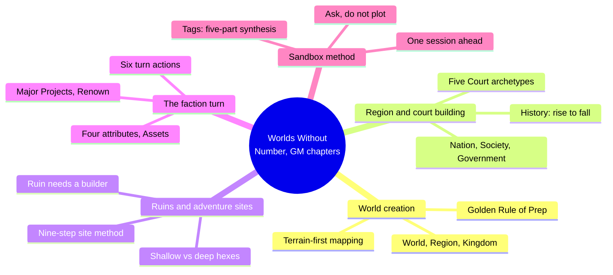
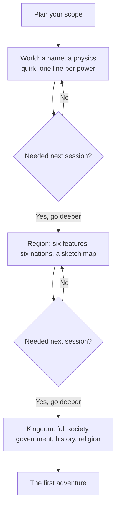
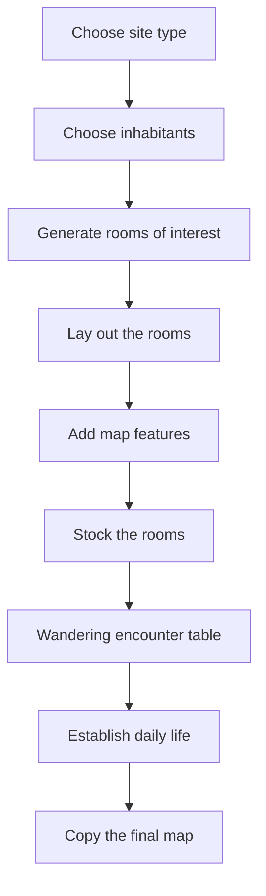
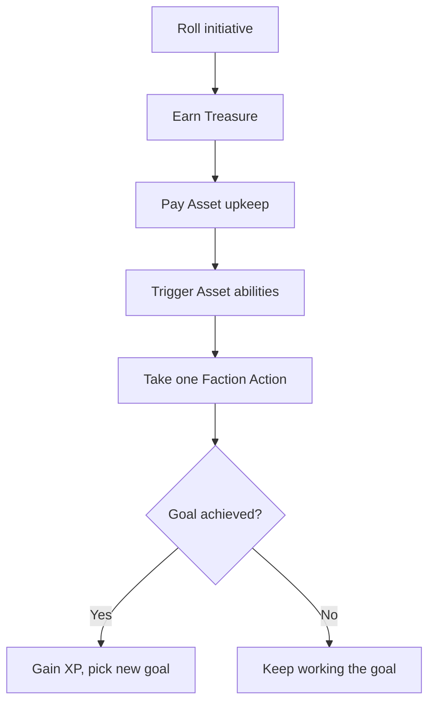
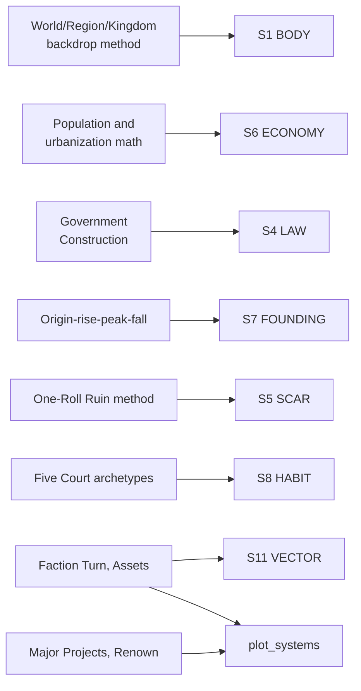

# BVX.1140 — Worlds Without Number (Free Edition) — Kevin Crawford (2021)
### Knowledge Entry — Distill

A fantasy OSR core rulebook whose middle third is a system-neutral GM toolbox for building a sandbox campaign top-down and keeping the world moving with a faction-turn engine; read for the world/region/kingdom, adventure-creation, and faction chapters, not character or combat rules.

## TABLE OF CONTENTS
- [Core Thesis](#1-core-thesis)
- [Mind Models](#2-mind-models)
- [Framework](#3-framework--structure)
- [Key Concepts](#4-key-concepts)
- [Heuristics](#5-heuristics--decision-rules)
- [Invariants](#6-invariants)
- [Pitfalls](#7-pitfalls--myths)
- [Application](#8-application)
- [Cross-References](#9-cross-references)
- [Provenance](#10-provenance--confidence)

---

## 1 · CORE THESIS

A sandbox campaign is built top-down through a shrinking backdrop, world, region, kingdom, with detail budgeted by proximity to actual play, never by completeness. Ruins, governments, and history all follow one rule: they exist to manufacture adventure hooks and playable consequences, not verisimilitude. A faction turn keeps the world moving between sessions without the GM inventing motion from scratch.

---

## 2 · MIND MODELS

*Required. Minimum two diagrams, maximum five.*

**Diagram 1 — the whole argument.**
Caption: *five GM disciplines share one root habit, spend only as much creative effort as the next session actually needs.*

**Diagram 2 — the central mechanism (a build process, narrowing at each level).**
Caption: *each level only gets built once the GM confirms the next session actually needs it; refusal to descend is a valid, expected outcome.*

**Diagram 3 — the exploration-site method (a process, run once per ruin or hexcrawl).**
Caption: *the same nine-step pipeline builds a dungeon and a wilderness hexcrawl; only the last three steps change shape between them.*

**Diagram 4 — the faction turn (a recurring engine, run once per faction per turn).**
Caption: *a faction always resolves in this order, and a missed goal costs its next action instead of simply failing quietly.*

**Diagram 5 — mapped onto the Command's SETTING SLICE (S1–S12).**
Caption: *seven of twelve layers land on a named procedure, not an inference; the faction turn is the one piece that reaches past SETTING into plot_systems.*

---

## 3 · FRAMEWORK / STRUCTURE

The free edition's GM-facing content sits in four chapters, one of them a worked example and three of them method:

| Chapter | Scale | Governing content |
|---|---|---|
| The World of the Latter Earth | World (worked instance) | The Gyre: nations, epochs, peoples, proving the backdrop method at full scale; sampled for structure, not lore |
| Creating Your Campaign | World → Region → Kingdom | The three-level backdrop; geography, nation, society, government, history, religion; Location Tags; ruin placement |
| Creating Adventures | Session | Sandbox vs. story arc; four challenge types; the nine-step exploration-site method; hex points of interest; just-in-time prep |
| Factions and Major Projects | Between-session | Faction attributes and Assets; the turn sequence and its six actions; Background Actors; Major Projects and Renown |

The chapter order mirrors the play order: backdrop before the first session, one adventure at a time as players choose, faction turn in the gaps to keep everything else moving.

---

## 4 · KEY CONCEPTS

| Concept | What it is | Why it matters |
|---|---|---|
| **The three-level backdrop** | World, Region, Kingdom, built top-down with sharply decreasing effort as each level gets farther from play | A world needs a name and a sentence per superpower; only the kingdom gets full society/government/history |
| **The Golden Rule of Preparation** | Two questions before building anything: "am I having fun?", and if not, "will I need this next session?" | The anti-burnout gate; it converts "could be useful someday" into "no" by default |
| **Terrain-first, ruin-in-the-gaps mapping** | Draw ocean sides and major features before nations; place ruins in the empty spaces between trade routes | Geography constrains culture before invention, and travel-route gaps are where a ruin's neglect stays plausible |
| **Governmental density** | A single low/medium/high dial for how many officials, soldiers, and clerks a polity can field | Tells the GM what force responds to a PC-caused crisis, without a full bureaucratic org chart |
| **The ruling-authority stack** | Number of rulers, ruling class, source of legitimacy, enforcement institution, each picked independently | A government becomes separable levers instead of one label like "monarchy" |
| **Four-stage history** | Origin, rise, peak, fall, each with its own table, fractally rescalable from an empire to one family | Produces a usable past in minutes that stays adventure-relevant, not an unread timeline |
| **The ruin-context method** | Four facts replace an invented civilization: what it was, how it fell, who's used it since, why it isn't picked clean | "The key to building interesting ruins is context"; without these facts a dungeon is an unmotivated hole |
| **Tags: five-part synthesis** | Every tag carries an Enemy, a Friend, a Complication, a Thing, a Place; two tags are picked and blended | Two synthesized tropes generate a specific hook neither trope produces alone, on demand |
| **The five Court archetypes** | Aristocratic, Business, Criminal, Familial, Religious courts, each with a Theme, Major Figures tied to a named power source, and Problems | A reusable intrigue-web shape; killing one figure never resolves a Court, a new one inherits the power source |
| **The nine-step exploration-site method** | Site type, inhabitants, rooms, layout, map features, stocking, wandering encounters, daily life, final map | One procedure builds a dungeon or a hexcrawl; only the last three steps differ in shape |
| **Shallow vs. deep sites, just-in-time prep** | Sites are sketched in a sentence until PCs commit to exploring one; only then do they get full development | Spares the GM from fleshing out every ruin on the chance a party might visit it |
| **The faction turn** | A monthly cycle where every tracked faction earns Treasure, pays upkeep, and takes one of six actions | Converts "the world should feel alive" into a number the GM runs, not an improvisation |
| **Major Projects and Renown** | A PC ambition gets a difficulty score: base value (plausible/improbable/impossible) × scope × greatest opposition | Turns a vague ambition into a trackable number that adventures, money, and diplomacy can all reduce |

---

## 5 · HEURISTICS & DECISION RULES

| Situation | Do this | Not this |
|---|---|---|
| Starting a new setting from scratch | Build world → region → kingdom, effort only as you descend | Draw a finished continental map first |
| Deciding whether to build something | Ask "will I need this next session?" | Ask "could this be useful someday?" |
| Placing ruins or wastelands on a map | Put them in the gaps between trade routes, one sentence of context each | Scatter them anywhere with a full invented civilization |
| Fleshing out a ruin | Fix what it was, how it fell, who's used it since, why it isn't picked clean | Roll a monster table and call it done |
| Building a government | Pick one governmental density so you know what force a ruler can muster | Design a full org chart no one consults |
| Writing a history | Run origin → rise → peak → fall, a sentence or two per stage | Draft a decade-by-decade chronicle nobody reads |
| Characterizing a site fast | Pick two Tags and synthesize their Enemies, Friends, and Things | Invent every NPC and hook from a blank page |
| Running an exploration or hexcrawl | Use the abstract room/hex map; distances are optional | Hand-draw a full graph-paper dungeon first |
| Keeping the world moving between sessions | Run a rough faction turn on a monthly clock | Leave every NPC power frozen until the PCs arrive |

---

## 6 · INVARIANTS

1. **Detail is budgeted by distance from actual play.** The level closest to next session gets full development; everything farther out gets a name and a sentence.
2. **A ruin needs a builder and a fall, or it is inert.** Context, not monster density, makes a dungeon usable.
3. **Geography and history exist to generate adventure hooks, not to document a world.** A fact with no play consequence is recreation, not preparation.
4. **A sandbox campaign only ever needs to be one session ahead of the players.** Deeper prep is optional indulgence.
5. **A government, court, or faction is defined by what someone in it wants**, never by simply existing as a label.
6. **A tracked faction or background actor keeps moving on its own clock**, whether or not the PCs are watching.
7. **Two synthesized Tags beat one invented trope.** The combination, not either half alone, produces a specific hook.

---

## 7 · PITFALLS / MYTHS

- Building a fully detailed world or continent before running the first session, recreational worldbuilding mistaken for preparation.
- Placing a dungeon with no builder, no fall, and no current inhabitant, exactly the failure the ruin-context method prevents.
- Packing every dungeon room with a monster or treasure, leaving no calm rooms to set the danger in relief.
- Forcing a challenge toward a predetermined outcome instead of letting the PCs' choices decide it.
- Fully developing every hex or ruin before the players reach it, instead of just-in-time prep on commitment.
- Treating a government as one label like "monarchy" instead of separable dials that actually predict its behavior.
- Letting factions sit static between sessions, then improvising a motive on the spot when a player asks what they've been doing.

---

## 8 · APPLICATION

- **Spine level:** SETTING (a Domain embodied, per ssot_03's binding rule, never an L0–L7 level)
- **12-layer character stack:** none directly; the Tags' five-part synthesis is the same combinatorial move as pairing two character layers, but this source stays setting-side
- **plot_systems:** primary candidate once `04_PLOT_SYSTEMS/` opens; the faction turn and Major Projects/Renown are numeric, GM-run engines for off-screen world motion, a sibling to BVX.1142's Scheme mechanism for the same slot
- **Setting:** primary; lands on seven of twelve S-layers (S1, S4, S5, S6, S7, S8, S11), the shelf's clearest source yet for LAW and SCAR

Tested against DCUS in `ssot_03_setting_system.md`: the ruin-context method is the same shape as DCUS's S5 SCAR rename lattice (Skeeter Creek to Red Hills to DCUS) run at institutional scale, and argues for stating that history in four beats, not a longer chronicle. Governmental density gives S4 LAW a concrete dial: DCUS reads high-density (a bureaucratic OS, the Star-Rating, enforced legibility), predicting how fast it should respond to PC-scale disruption. The origin-rise-peak-fall pattern reinforces Baur's present-tense-history rule (BVX.0458): DCUS's century of prestige only needs the beats that bite the active Movement. The single most exportable idea, though, is the **Tags five-part synthesis**: any two named tropes, blended across Enemy, Friend, Complication, Thing, and Place, generate a specific hook on demand, a direct answer to Kennedy's kitchen-sink challenge (BVX.0349) that neither BVX.1142's Schemes nor BVX.1138's region template offer in this combinatorial a form.

---

## 9 · CROSS-REFERENCES

| Related entry | Relation |
|---|---|
| [[BVX.0458]] | Kobold Guide to Worldbuilding — the craft-book counterpart; this book's four-stage history and governmental-density dial are Baur's rules turned into runnable procedures |
| [[BVX.1142]] | Cities Without Number (Free Edition) — closest sibling, same author and structure; its Schemes and this book's Faction Turn are the same progress-tracking move, and both propose the same `plot_systems` slot |
| [[BVX.1138]] | Midgard Campaign Setting — a finished instance, not a generator; Midgard proves one region template run many times, this book supplies a generator like the one it could have been built from |
| [[BVX.1139]] | Shadows over Vathak Campaign Setting — its Trust score and this book's faction Assets/Treasure are the same move, a trackable number standing in for GM fiat |
| [[BVX.0349]] | Kennedy, *Against Worldbuilding* — the kitchen-sink counter-argument; the Golden Rule of Preparation and just-in-time prep are this book's worked answer |

---

## 10 · PROVENANCE & CONFIDENCE

Full text, pdftotext extraction, 346-page free edition. Read in full or near-full: the opening fiction; Creating Your Campaign through Planning Your Work, the Golden Rule of Preparation, Building Your Backdrop (World/Region/Kingdom), Geography Construction, Nation Construction, Government Construction in full, History Construction in full, Placing/Establishing Ruins in full, the Tags and Courts framing sections, One-Roll Ruin Generation in full, and the Wilderness framing. Creating Adventures read through Planning and Running Adventures and Creating Exploration Challenges in full (all nine steps plus Hex Points of Interest). Factions and Major Projects read through the Faction Turn, Faction Tags, Faction Turn Actions, Creating Factions, Background Actors, and Major Projects and Party Goals.

Sampled at heading level only: The World of the Latter Earth (a worked instance, not method); the bulk of the Tag catalogs past their framing; Character Creation, Rules of the Game, Magic; Combat/Investigation/Social Challenges; treasure tables; Creatures of a Far Age (out of scope for a setting distill); faction Asset catalogs past their framing; Using This Game in Other Settings.

The S-layer keying in `feeds:` and Diagram 5 is this distill's synthesis against `ssot_03_setting_system.md`'s twelve-layer schema, following the method BVX.0458, BVX.1138, BVX.1139, and BVX.1142 already set for this shelf. `bvx_provisional: true` reflects a first-pass id assignment with no Zotero key yet on file.

## META
- Template: BVX-LEARN-v4.0
- Source classification: full-text rulebook, deep extraction on the world/region/kingdom, adventure-creation, and faction chapters, sampled on the worked-instance setting chapter, the tag catalogs, and the crunch chapters
- Created / Updated: 2026-09-29
