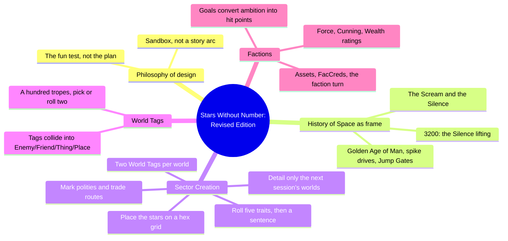
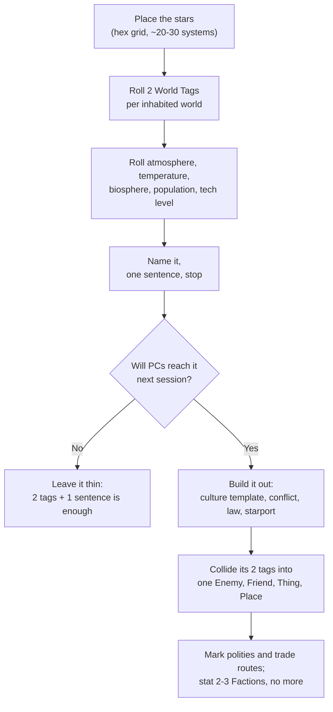
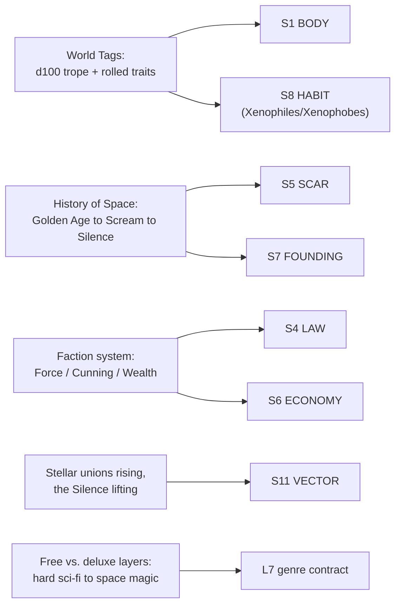

# BVX.1141 — Stars Without Number: Revised Edition (Free Edition) — Kevin Crawford (2017)
### Knowledge Entry — Distill

A science-fiction OSR tabletop RPG built explicitly as a sandbox generator; its Sector Creation, World Tags, Factions, and History of Space chapters are a working procedure for building a setting fast, tagging it for conflict, and rationing detail to what a session actually needs.

## TABLE OF CONTENTS
- [Core Thesis](#1-core-thesis)
- [Mind Models](#2-mind-models)
- [Framework](#3-framework--structure)
- [Key Concepts](#4-key-concepts)
- [Heuristics](#5-heuristics--decision-rules)
- [Invariants](#6-invariants)
- [Pitfalls](#7-pitfalls--myths)
- [Application](#8-application)
- [Cross-References](#9-cross-references)
- [Provenance](#10-provenance--confidence)

---

## 1 · CORE THESIS

Build a setting lazily and in a fixed order: place the stars, tag every world with exactly two tropes, and detail only what next session needs. One galaxy-wide collapse supplies all the history any world requires; factions turn standing organizations into rollable, surprising conflict.

---

## 2 · MIND MODELS

*Required. Minimum two diagrams, maximum five.*

**Diagram 1 — the whole argument.**
Caption: *four chapters, one procedure: history supplies the one wound every world points back to, sector creation places and rations the worlds, world tags flavor them fast, and factions keep them moving after the GM stops looking.*

**Diagram 2 — the central mechanism (a process, run once per world).**
Caption: *depth is a gate, not a default — only the worlds that will actually see play next session cross from "tagged" to "built," and even then the tags do most of the work.*

**Diagram 3 — mapped onto the Command's SETTING SLICE (S1–S12).**
Caption: *the book's four working chapters key cleanly to six of twelve S-layers; it is silent on S2 WEATHER, S3 SENSORIUM, S9 ALLURE, S10 UNDERSIDE, and S12 FUNCTION — exactly the layers a procedural sandbox generator leaves for the GM to invent.*

---

## 3 · FRAMEWORK / STRUCTURE

Four chapters carry the setting-building method, in an order that is itself the argument: history first (so every later choice inherits a frame), then the procedure for filling a sector, then the trope table that makes filling fast, then the faction rules that keep the sector moving without the GM's constant attention.

| Chapter | Governing question |
|---|---|
| The History of Space | What single event explains why the galaxy looks broken, uneven, and rediscoverable? |
| Sector Creation | In what order do I build a sector without exhausting myself before session one? |
| World Tags | How do I give a world a distinct flavor in thirty seconds, not thirty minutes? |
| Factions | How do I keep organizations acting and reacting between sessions without simulating them by hand? |

The chapters are read in that order once, then used out of order forever after: History of Space is written once and never touched again; Sector Creation and World Tags run every time a new world is needed; Factions run every turn a faction is active.

---

## 4 · KEY CONCEPTS

| Concept | What it is | Why it matters |
|---|---|---|
| **The Scream and the Silence** | A single galaxy-wide catastrophe (2665): a psychic wave kills every trained psychic, collapses the Jump Gate network, and starves the interconnected core worlds | The setting's one mandatory history event; every world's tech level, government, and "lost world" status is a local answer to this one shared question |
| **Metadimensional proximity** | Sectors are drawn by travel cost through folded "metaspace," not physical distance; two physically close stars can be untravelable, two far ones adjacent | Frees a builder from real astronomy; lets a map be an abstraction of who can reach whom, not where things literally sit |
| **World Tags** | A hundred one- or two-word tropes (Feral World, Theocracy, Regional Hegemon, Xenophobes); each carries pre-built Enemies, Friends, Complications, Things, Places | The core speed tool: rolling or picking two tags and combining their example content produces a usable NPC or hook in under a minute |
| **Two-tag collision** | Never use one tag (flat) or three-plus (muddy); exactly two, merged into single concrete details, e.g. "Feral World" + "Heavy Industry" → a cannibal oligarch who lives off his slave laborers | The tag count is itself a craft rule: friction between exactly two tropes is what generates specificity, not the tags themselves |
| **The fun test** | Before building anything: "Am I having fun?" then "Will I need this for the next session?" If neither, stop | A concrete, repeatable check against over-building; replaces vague discipline with two yes/no questions |
| **Faction attributes: Force, Cunning, Wealth** | Three ratings, 1–8, for physical coercion, espionage/infiltration, and commercial/industrial resources | Any organization, from a eugenics cult to a planetary government, reduces to the same three numbers, making cross-faction conflict rollable without hand-simulation |
| **FacCreds and the faction turn** | Each turn a faction earns FacCreds (half Wealth, plus a quarter of Force and Cunning) and spends them on assets, maintenance, and actions (Expand, Attack, Consolidate) | A lightweight economic engine that runs a faction's background life on a timer the GM checks once per session, not continuously |
| **Faction goals and XP** | Named goals (Planetary Seizure, Blood the Enemy, Destroy the Foe) with a stated Difficulty; completing one earns XP spendable on raising a rating | Gives factions a direction beyond "exist," so their turn-by-turn actions read as a campaign, not noise |
| **Reserve faction status** | Only organizations that will do things important to the PCs or the background world get full faction stats; everything else stays prose | An explicit anti-completionism rule: five or six factions is a normal ceiling for an entire campaign |
| **The surprise argument for systems** | A GM who simply decides outcomes gets predictable results and never has to think about unlikely faction interactions; a rolled system produces genuine surprises and forces novel combinations | The book's defense of using dice for background simulation at all: surprise is a designed feature, not noise to be tolerated |

---

## 5 · HEURISTICS & DECISION RULES

| Situation | Do this | Not this |
|---|---|---|
| Starting a new sector | Place the stars, then roll two World Tags per inhabited world, in that order | Write deep lore for one world before the sector's shape exists |
| Tagging a world | Pick or roll exactly two tags and merge their example content | Use one tag (flat) or three-plus tags (muddy, incoherent) |
| Deciding what to detail | Ask "will the PCs reach this next session?" — detail only those worlds | Try to flesh out every world in the sector before play begins |
| Writing setting history | Keep one shared catastrophe (the Scream) that every world can point back to | Invent a separate, unrelated deep history for each world |
| Building a faction | Reserve faction status for organizations that matter to the PCs or the plot right now | Stat every business, religion, and club as a formal faction |
| Running background conflict | Roll it with Force/Cunning/Wealth and let the dice produce the outcome | Simply narrate whichever outcome feels most "reasonable" every time |
| Drawing a sector map | Base adjacency on travel-cost ("metadimensional" proximity), not literal astronomical distance | Insist two physically close stars must be easy to travel between |
| Choosing how many factions | Run two or three active factions at the start, more only as the campaign demands | Build a full roster of a dozen factions before the first session |
| Picking a setting's tone | Decide the genre contract (hard-recovery sci-fi vs. added space-magic/transhuman/True-AI layers) before writing | Let tone drift between sessions because it was never named |

---

## 6 · INVARIANTS

1. **Depth is rationed to what the next session needs.** An unbuilt world stays legitimately unbuilt — two tags and a sentence is a complete, playable state, not an unfinished one.
2. **Exactly two tags per world.** One tag under-specifies; three or more muddy the trope into incoherence. The collision of two, not the tags themselves, produces specificity.
3. **A sector is bounded by travel-cost topology, not physical geometry.** Adjacency on the map means "reachable," never "nearby" in any literal astronomical sense.
4. **Faction status is earned, not assumed.** An organization becomes a full faction only when the PCs or the background plot will act on it; most groups in the sector never need stats.
5. **One shared catastrophe can carry the whole setting's deep history.** Every world's present condition is a local answer to the same event; history does not need to be reinvented world by world.
6. **A faction's numbers exist to produce output, not to model reality.** Force, Cunning, and Wealth are not balanced or realistic; they are tuned to generate rollable, surprising conflict.
7. **Systems earn their place by producing surprise the GM couldn't have dictated alone.** A random or semi-random generator is justified exactly where hand-authored decisions would default to the obvious choice.

---

## 7 · PITFALLS / MYTHS

- Building an entire sector, world by world, before the first session — the classic GM-exhaustion trap this book is explicitly written to prevent.
- Treating three or more World Tags as "more interesting" than two; the book states directly that this muddies rather than enriches a world.
- Statting every organization in the sector as a full faction instead of reserving the mechanic for groups that matter right now.
- Assuming physical star distance equals travel distance; the metadimensional-proximity model breaks if a builder reaches for a real star map without converting it.
- Writing a separate deep backstory for every world instead of letting one shared catastrophe (the Scream) carry the historical weight for all of them.
- Mistaking the faction system for a standalone, GM-optional simulation that needs no referee judgment; the book states plainly that it still requires GM adjudication throughout.

---

## 8 · APPLICATION

- **Spine level:** SETTING (non-story-spine source; keys to the entity beside the L0–L7 spine, per the setting-slice binding rule that setting is a Domain embodied, never a level)
- **12-layer character stack:** none directly — this is a setting-side procedural source; its "detail only what's needed" discipline is structurally the same move as gating an L6 DRIVE want against its immediate story cost, but it is not itself a character-layer feed
- **plot_systems:** strong candidate once `04_PLOT_SYSTEMS/` opens — the faction turn (Expand, Attack, Consolidate, goals with Difficulty and XP) is a ready-made background-conflict engine: any antagonist organization in the reader's universe can run on this exact loop without modification
- **Setting:** primary — a working procedural counterpart to BVX.0458's essay-based toolkit, feeding S1, S4, S5, S6, S7, S8, and S11 at varying strength, plus L7 genre-contract contextually

This is the sci-fi sandbox model closest to the reader's own universe: a scattered, recovering interstellar diaspora with one shared historical wound (here, the Scream) and locally uneven technology. The two-tag World Tag method is directly stealable for any sector, faction, or world in the reader's setting — pick or roll two tropes, merge their example content, stop. The faction system's Force/Cunning/Wealth triad is a portable stat block for any organization (a corporation, a cult, a splinter government) that needs to act between chapters without being hand-simulated in full. Tested against the library's existing SETTING-shelf entries: where BVX.0458 (Kobold) argues for a present-tense-history discipline in prose, this book enforces the same discipline mechanically — the Scream is the one history event every world's stat block is built to reference, and nothing deeper is ever required. Where BVX.1139 (Shadows over Vathak) shows a single hand-authored setting executing a gazetteer template six times, this book shows the generator that produces an arbitrary number of such worlds on demand, at the cost of depth in exactly the layers (S2 WEATHER, S3 SENSORIUM, S9 ALLURE, S10 UNDERSIDE) that a random-tag generator cannot supply and a writer must add by hand.

---

## 9 · CROSS-REFERENCES

| Related entry | Relation |
|---|---|
| [[BVX.0458]] | Kobold Guide to Worldbuilding — theory/toolkit counterpart; its present-tense-history rule is this book's Scream enforced mechanically rather than argued in prose |
| [[BVX.1122]] | GURPS Hot Spots: Renaissance Venice — a worked historical-instance sibling; this entry is the generator, that one a single hand-built output |
| [[BVX.1139]] | Shadows over Vathak Campaign Setting — a single setting executing a repeatable gazetteer template; this book is the template's generative, randomizable ancestor |
| [[BVX.0349]] | Against Worldbuilding, and Other Provocations — counter-argument sibling; this book's "detail only what's needed" rule is its own answer to the kitchen-sink failure mode Kennedy names |

---

## 10 · PROVENANCE & CONFIDENCE

Full text, pdftotext extraction of the free edition (~260pp), clean text layer with a machine-readable table of contents. Read in full: the table of contents; the introduction ("Into the Waiting Night") and its sandbox-design framing; "The History of Space" (complete, including "A Timeline of the Future"); "Sector Creation" through "Assigning World Tags" and its opening trope-collision method (the d100 tag list itself sampled by category, not read tag-by-tag); "Factions" (complete through "Using Factions in Your Game," "Factions, Assets, and Turns," Faction Assets, Attack resolution, Faction Goals, hit points, and the worked Typhon/Rathskeller Combine example). Not read: Character Creation mechanics, Psionics, Systems, Equipment and Vehicles, Starships, Adventure Creation, and Xenobestiary beyond the "Aliens in the Sector" placement guidance — these carry player-facing rules or bestiary content outside this distill's setting-construction focus, per the brief's scope.

The S-layer keying in frontmatter `feeds:` and Diagram 3 is this distill's synthesis against the setting slice (S1–S12) already established by BVX.0458 and BVX.1139; no gap here is a failure of the source; S2 WEATHER, S3 SENSORIUM, S9 ALLURE, S10 UNDERSIDE, and S12 FUNCTION are silent by design in a procedural random-generation book aimed at play speed rather than atmosphere or theme.

## META
- Template: BVX-LEARN-v4.0
- Source classification: full-text core rulebook, deep extraction on the four setting-relevant chapters, sampled on the rest
- Created / Updated: 2026-09-29
