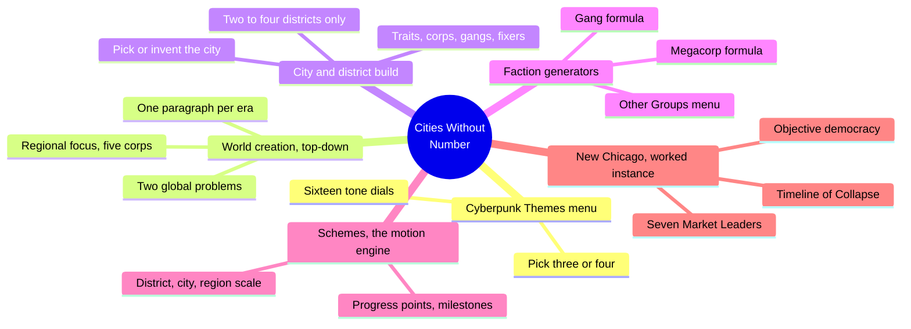
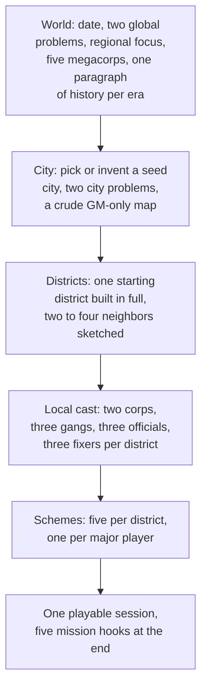
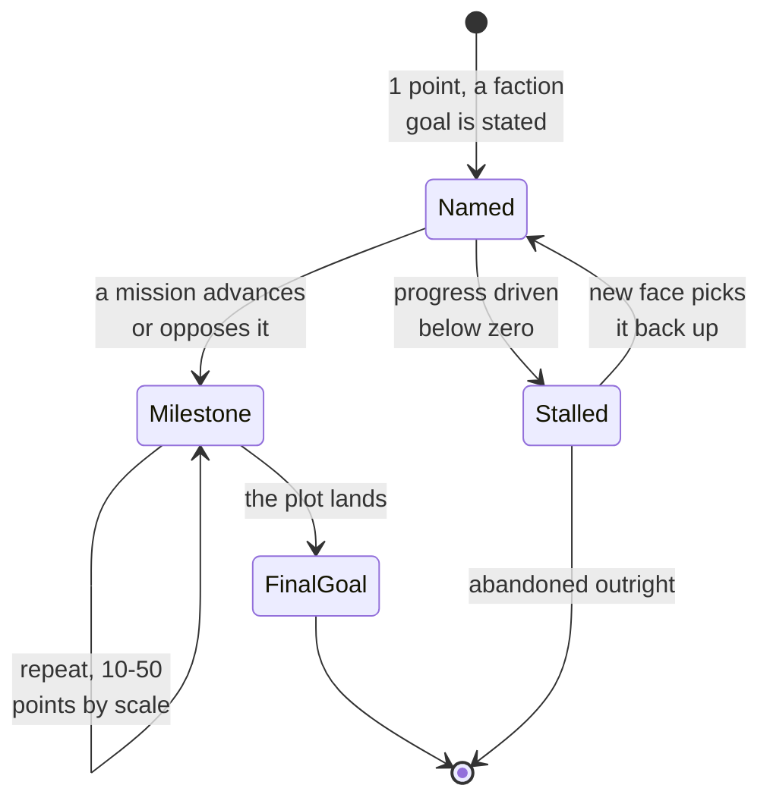
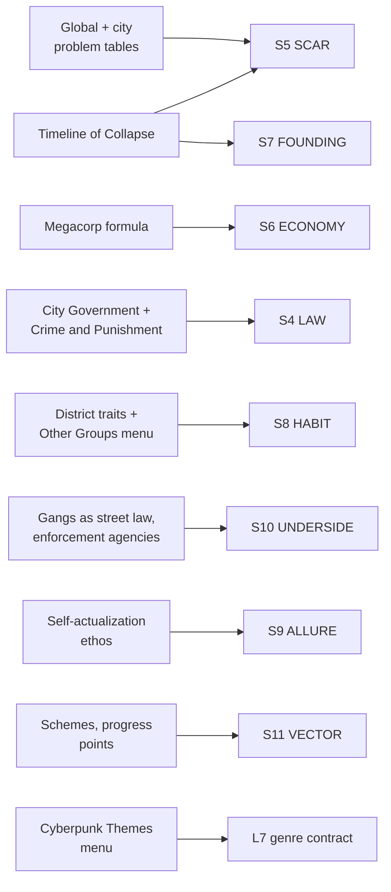

# BVX.1142 — Cities Without Number (Free Edition) — Kevin Crawford (2023)
### Knowledge Entry — Distill

A cyberpunk OSR rulebook whose second half is a system-neutral GM toolbox for building a sandbox dystopia top-down, from a world down to a table-ready district, plus a fully worked instance (New Chicago) proving the method; read for the city-generation and campaign-motion chapters, not the character or combat rules.

## TABLE OF CONTENTS
- [Core Thesis](#1-core-thesis)
- [Mind Models](#2-mind-models)
- [Framework](#3-framework--structure)
- [Key Concepts](#4-key-concepts)
- [Heuristics](#5-heuristics--decision-rules)
- [Invariants](#6-invariants)
- [Pitfalls](#7-pitfalls--myths)
- [Application](#8-application)
- [Cross-References](#9-cross-references)
- [Provenance](#10-provenance--confidence)

---

## 1 · CORE THESIS

Build a cyberpunk setting top-down and just far enough: pick two problems at world scale, two at city scale, name the factions those problems produced, then stop at whatever a first session needs. A Scheme, a named faction plot measured in progress points, keeps the whole thing moving after the GM stops building it.

---

## 2 · MIND MODELS

*Required. Minimum two diagrams, maximum five.*

**Diagram 1 — the whole argument.**
Caption: *a generator, a worked instance, and a motion engine are the book's real content; the character and combat rules are the other half of the same cover.*

**Diagram 2 — the central mechanism (a build process, run once, top to bottom).**
Caption: *the build order only moves one direction, world to table, and it is designed to stop the moment a first session is playable.*

**Diagram 3 — the recurring engine (Schemes, a state machine every faction runs).**
Caption: *a Scheme survives losing its leader; only discrediting the idea, or running it into negative points, actually kills it.*

**Diagram 4 — mapped onto the Command's SETTING SLICE (S1–S12).**
Caption: *eight of twelve layers land on a named generator table, not an inference; the two thin layers, WEATHER and SENSORIUM, are exactly the ones this book leaves to the GM's own city map.*

---

## 3 · FRAMEWORK / STRUCTURE

The book is two halves under one cover: a full OSR game system (character creation through hacking and vehicle combat), then a system-neutral setting-and-campaign toolbox usable with any cyberpunk ruleset. The distill covers only the second half plus its worked proof.

| Chapter | Scale | Governing content |
|---|---|---|
| Cyberpunk Themes | Tone | Sixteen recurring genre elements, a menu to lean into, not a checklist to exhaust |
| Creating the World | World | Date, two Global Problems, regional focus, superpowers, five megacorps, one-paragraph history per era |
| Creating the City | City | Pick or invent a seed city, two City Problems, a crude GM map, districts marked, major corps picked |
| Building Your Districts | District | Two to four districts built; traits, government NPCs, gangs, corps, fixers, a district map, a name |
| Creating Megacorps | Faction | Focus, style, strength, recent event, current goal, name; a repeatable six-field card |
| Creating Gangs | Faction | Income, style, strengths, recent event, goal, name; the same six-field card, criminal-flavored |
| Creating NPCs | Cast | Name, strength, want, reaction; the disposable-face generator behind every corp rep and gang boss |
| Creating and Running Missions (Schemes) | Campaign motion | Progress-point plots per faction, at district, city, and region scale, advanced or damaged by missions |
| The City | Worked instance | New Chicago: a full Timeline of Collapse, seven named Market Leader megacorps, city government, crime and punishment, a corp-authored ethos and glossary |

The chapter order is the build order (Diagram 2): each step's output is the next step's raw material, and the book repeatedly tells the GM to stop once a first session is covered rather than complete every table.

---

## 4 · KEY CONCEPTS

| Concept | What it is | Why it matters |
|---|---|---|
| **Cyberpunk Themes menu** | Sixteen named tendencies (Alienation, Commoditization, Dehumanization, Despair, Meat, Urbanization, Violence...) offered as dials, not a checklist | Committing to three or four up front is the setting's genre contract, decided before any place exists |
| **Global and City Problems tables** | A 20-entry world-scale table (Balkanization, Plague, Warfare) and a 50-entry city-scale table (Anarchy, Civil War, Corp War), each rolled or picked twice and synthesized | The dystopia's cause comes from a table, not from invention; synthesizing two entries is the whole design act |
| **Present-tense history writing** | Seven guided questions (what caused it, how did power react, who profited, why can't it last) answered in a paragraph each, expressly not a lengthy timeline | History is built backward from the current dystopia's shape, never forward from invented lore |
| **The one-direction build order** | World, then city, then two to four districts, then that district's cast, in that order, never reversed | A GM who starts with district-level detail before the world exists has nothing for the district to be a consequence of |
| **The six-field faction card** | Focus/income, style, strength, recent event, current goal, name — run identically for megacorps and gangs | One repeatable card generates an unlimited faction roster without the GM inventing structure each time |
| **Schemes** | A named faction plot with progress points (1 to 10/20/30+ depending on scale) and milestones; missions push the count up or down | Converts "the world should feel alive" into an actual tracked number a GM can move at the table |
| **Stay one session ahead** | The GM is told explicitly to prep only as far as the next game night, not the whole campaign | The book's own discipline against its own kitchen-sink temptation; depth is added only when play reaches it |
| **The Market Leaders** | New Chicago's worked instance: seven named megacorps (Acheron, Kamigawa, Legau-Durach, Lianghe, Nova Vida, Obelisk, Taotie), each with a founding event, a value, and named Megacorp Traits | Proves the generator by running it seven times to a single coherent cartel, not seven disconnected NPCs |
| **Objective democracy** | New Chicago's elections are decided by a data model, not by counted votes; voting in person is treated as tampering | One invented civic mechanism does more world-characterizing work than a page of description would |
| **The corp-authored glossary** | An in-world dictionary (Charity, Evil, Freedom, Truth) redefined around "self-actualization" as the only human good | Shows a setting's ideology by handing the reader its own propaganda rather than describing the ideology from outside |
| **Gangs as street government** | Stated outright: unpoliced districts are ruled by whichever gang can hold the turf, "the law" in practice | Removes the need to invent a separate civic-order layer for the underclass; the informal power already is the order |

---

## 5 · HEURISTICS & DECISION RULES

| Situation | Do this | Not this |
|---|---|---|
| Starting a new cyberpunk setting | Pick three or four themes from the menu to lean into hard | Try to hit all sixteen at once |
| Deciding what's wrong with the world | Roll or pick two Global Problems and synthesize them into one cause | Invent a bespoke apocalypse from scratch with no table to anchor it |
| Choosing a build order | World, then city, then two to four districts, then that district's cast | Detail a district before the world or city that produced it exists |
| Writing setting history | Answer the seven guided questions in a paragraph each | Draft a multi-page timeline before the campaign needs any of it |
| Populating a city | Generate five megacorps at world scale, pick two to four as locally dominant | Invent a new corp for every scene with no registry connecting them |
| Making a faction feel distinct | Run the six-field card (focus, style, strength, event, goal, name) once per faction | Describe a faction only in prose with no reusable structure |
| Keeping a campaign in motion | Give each major district player a Scheme with progress points and milestones | Let factions sit static until the GM improvises a reason for them to act |
| Deciding how much to build before session one | Build only the starting district in full; sketch its two to four neighbors | Fully detail every district and every corp before the first game night |
| Showing a corp's ideology | Write it a glossary entry or a recruiting pitch in its own voice | Explain the ideology in GM narration from outside the world |

---

## 6 · INVARIANTS

1. **A setting builds top-down: world, then city, then district, then cast.** Reversing the order leaves the smaller unit with nothing to be a consequence of.
2. **Every dystopian feature traces to a picked or rolled Problem, at world or city scale.** The cause is a named table entry, not ambient bad vibes.
3. **History earns detail only through the questions that connect it to the present dystopia.** A timeline with no bearing on current factions is decoration.
4. **A faction is built from the same six fields regardless of type.** Focus/income, style, strength, event, goal, name — megacorp and gang share one card.
5. **Motion in a sandbox campaign requires a tracked mechanism, not GM improvisation.** Schemes with progress points are that mechanism; without one, "the world feels alive" is an unfulfilled promise.
6. **Build depth stops at what the next session needs.** The explicit anti-kitchen-sink discipline: unbuilt districts, unnamed corps, and unresolved history are correct, not incomplete.
7. **The underclass's real government is whichever informal power holds the turf.** Gangs, enforcement agencies, and corp patronage networks are the functioning law; civic government is a formality layered on top.

---

## 7 · PITFALLS / MYTHS

- Trying to use every one of the sixteen cyberpunk themes at once, producing a setting with no particular flavor instead of a sharp one.
- Fully detailing every district, corp, and NPC before running a single session, instead of stopping at what the next game night requires.
- Writing a lengthy invented history with no present-day consequence, rather than the guided seven-question paragraph method the book insists on.
- Treating a megacorp or gang as a one-off description instead of running the repeatable six-field card, which produces an inconsistent faction roster over time.
- Leaving factions static between sessions with no Scheme, then improvising motive on the fly when players ask "what have they been doing?"
- Describing a corp's ideology in GM narration instead of writing it the in-world glossary or pitch that actually characterizes the culture from inside.
- Assuming civic government is the real law in an unpoliced district when the book states plainly that gangs and enforcement agencies hold that role instead.

---

## 8 · APPLICATION

- **Spine level:** SETTING (non-story-spine source, per ssot_03's binding rule that setting is a Domain embodied, never an L0–L7 level)
- **12-layer character stack:** none directly; the six-field faction card (focus, style, strength, event, goal, name) is structurally the same move as an L6 DRIVE want-plus-cost audit, but this source stays setting-side
- **plot_systems:** primary candidate once `04_PLOT_SYSTEMS/` opens; Schemes are a ready-made progress-tracking mechanism for any faction-driven subplot, and the "stay one session ahead" discipline is a direct prep-pacing rule for whatever GM- or writer-facing build tool the Command runs
- **Setting:** primary; a generator-plus-worked-instance pair for the SETTING shelf's first cyberpunk source, landing on eight of twelve S-layers at primary or supporting strength plus L7 genre-contract contextually

The single most useful idea for a science-fiction setting system is the **top-down build order with an explicit stopping rule**: world (two problems, five corps, one paragraph per era) before city (two problems, a crude map) before district (traits, cast, one Scheme each) before table, and the GM is told outright to stop building the instant a first session is covered. That discipline answers Kennedy's kitchen-sink challenge (BVX.0349) more concretely than any of the SETTING shelf's fantasy sources: not "thin by default," but "thin until play asks for more, and the order in which play is allowed to ask." Schemes generalize just as cleanly as Midgard's region template (BVX.1138) or Vathak's Trust score (BVX.1139): any setting needs at least one number per active faction that a scene can move, or "the world feels alive" stays an unkept promise. And the worked New Chicago instance proves the six-field faction card at scale exactly as Midgard proved the region-entry stat block: seven megacorps, one cartel, one shared history, each faction distinct because the card forced a different answer in each of six fields rather than because someone wrote seven different paragraphs from a blank page.

---

## 9 · CROSS-REFERENCES

| Related entry | Relation |
|---|---|
| [[BVX.0458]] | Kobold Guide to Worldbuilding — the craft-book counterpart; this entry's Cyberpunk Themes menu is a direct genre-flavored instance of Baur's five-lineage genre-contract taxonomy, and its present-tense history questions are Baur's rule turned into a worksheet |
| [[BVX.1138]] | Midgard Campaign Setting — the closest sibling worked instance; both prove a repeatable card (region entry / faction card) run many times over one coherent world, though Midgard is a finished fantasy gazetteer and this book is a generator plus one worked proof |
| [[BVX.1139]] | Shadows over Vathak — the closest sibling in mechanism; Vathak's Trust score and this book's Scheme progress points are the same move, a trackable number standing in for GM fiat about faction standing or motion |
| [[BVX.0349]] | Kennedy, *Against Worldbuilding* — the kitchen-sink counter-argument; this book's "stay one session ahead" rule and its two-to-four-district ceiling are a worked answer to the sprawl Kennedy warns against |

---

## 10 · PROVENANCE & CONFIDENCE

Full text, pdftotext extraction, ~224-page free edition. Read in full: the opening fiction and "What This Game Is About"; the Cyberpunk Themes chapter; Creating the World (date, Global Problems table and all twenty entries, regional focus, megacorps, write-history questions); Creating the City (pick-a-city methods, map methods, district marking, City Problems table); Building Your Districts, including the full fifty-entry District Traits table; the opening of Creating Megacorps (focus and style tables) and the opening of Creating Gangs (income, style, strength, goal, event, and name tables, all read in full); the opening of Creating NPCs; the Creating Schemes section in full (mechanism, three scales, missions-and-schemes interaction); and, in "The City" worked-instance chapter, the Timeline of Collapse in full, all seven Market Leader megacorp write-ups, Other Groups and Organizations, The Ethos of the City with its glossary, The City Government, and the opening of Crime and Punishment through the enforcement-agency cost table.

Sampled at heading level only, not deep-extracted: Character Creation, The Rules of the Game, The Tools of the Trade, and Hacking (the crunch half of the book, out of scope for a setting-architecture distill); the remaining Megacorp and Gang tables past the point cited above (strength, event, goal, name — dice tables, not conceptual content); Creating and Running Missions' mission-tag and mission-type tables; Social Relationships in the City, Gender and Identity, and The Districts of the City's six named New Chicago districts (Citadel, Flats, Fogtown, Gannett, Portside, Rachowski); Faces on the Street's NPC-by-role tables; Mixing Sine Nomine Games Together.

The S-layer keying in `feeds:` and Diagram 4 is this distill's synthesis against `ssot_03_setting_system.md`'s twelve-layer schema, following the method BVX.0458, BVX.1138, and BVX.1139 already set for this shelf. `bvx_provisional: true` reflects a first-pass id assignment with no Zotero key yet on file.

## META
- Template: BVX-LEARN-v4.0
- Source classification: full-text rulebook, deep extraction on the setting-and-campaign-toolbox chapters plus the full worked New Chicago instance, sampled on the crunch chapters and the remaining dice tables
- Created / Updated: 2026-09-29
