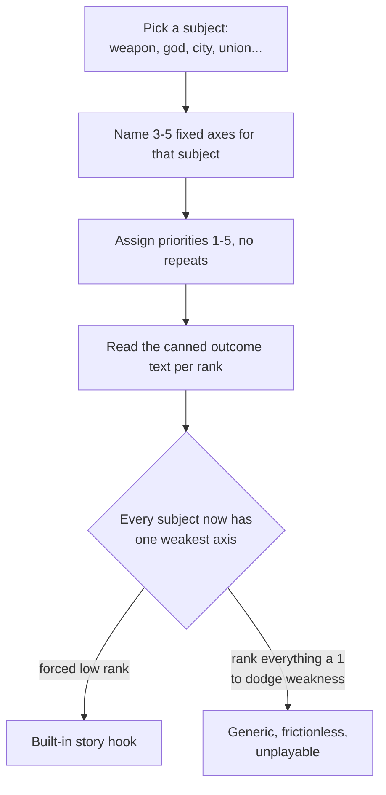
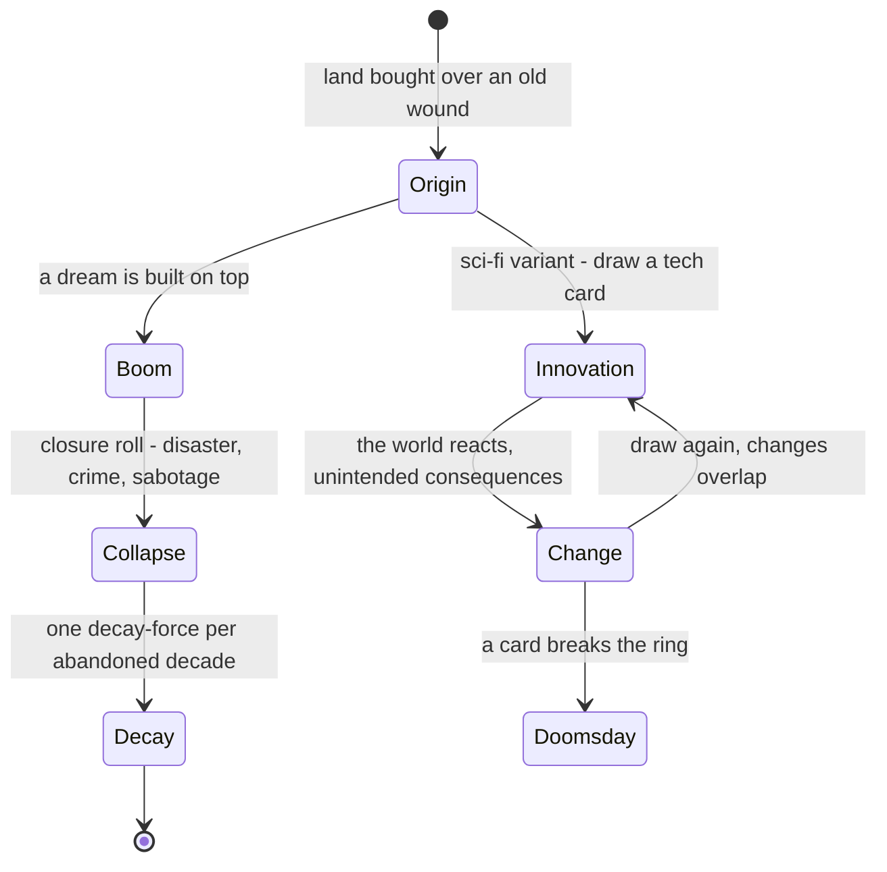
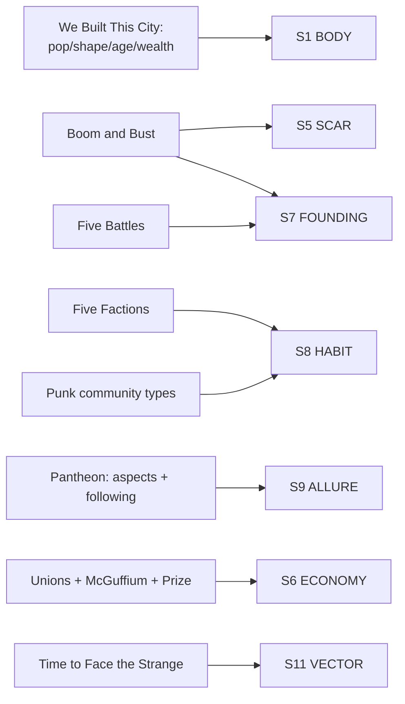

# BVX.1143 — The Ultimate RPG Game Master's Worldbuilding Guide — James D'Amato (2020)
### Knowledge Entry — Distill

A GM-facing exercise workbook (30+ games and thought exercises across Fantasy, Sci-Fi, Horror, X-Punk, and Neutral chapters) that runs one reusable generation mechanism — axis decomposition plus forced ranking — against geography, culture, religion, economy, and history in turn; the SETTING shelf's second toolkit entry, companion and counterweight to Kobold (BVX.0458).

## TABLE OF CONTENTS
- [Core Thesis](#1-core-thesis)
- [Mind Models](#2-mind-models)
- [Framework](#3-framework--structure)
- [Key Concepts](#4-key-concepts)
- [Heuristics](#5-heuristics--decision-rules)
- [Invariants](#6-invariants)
- [Pitfalls](#7-pitfalls--myths)
- [Application](#8-application)
- [Cross-References](#9-cross-references)
- [Provenance](#10-provenance--confidence)

---

## 1 · CORE THESIS

Worldbuilding is conflict engineering, not documentation: one mechanism — decompose a subject into fixed axes, force-rank them 1 to 5 with no ties, read the canned consequence — builds weapons, gods, cities, and unions alike. History runs the same way: a chain of stages, each leaving a scar, not a timeline.

---

## 2 · MIND MODELS

*Required. Minimum two diagrams, maximum five.*

**Diagram 1 — the whole argument.**
Caption: *five genre chapters and one shared toolkit sort into the same five domains every time — geography, culture, religion, economy, history — regardless of which genre is asking.*

```mermaid
mindmap
  root((Ultimate RPG GM's<br/>Worldbuilding Guide))
    Shared toolkit
      d20 Questions
      Priority System
      Dice and card tables
    Geography
      Interstellar travel priorities
      City population, shape, age, wealth
    Culture
      Five Factions binding types
      Punk community and attitude
    Religion
      Six paths of magic
      Pantheon aspects and following
    Economy
      Unions and industry
      McGuffium the plot resource
      The Prize
    History
      Time to Face the Strange
      Boom and Bust
      Five Battles
```

**Diagram 2 — the central mechanism (the Priority System, a repeatable process).**
Caption: *the same five-step pipeline runs whether the subject is a sword or a labor union — the forced-low axis is the point of the exercise, not a flaw to fix.*

**Diagram 3 — the other central mechanism (history as a residue-leaving state chain).**
Caption: *history isn't authored as a timeline, it's rolled as a chain of stages, and every stage leaves a residue — a scar, a complication, a change card — that the next stage has to build on top of.*

**Diagram 4 — mapped onto the Command's SETTING SLICE (S1–S12).**
Caption: *eight exercises land cleanly on six of twelve SETTING SLICE layers, exactly where the book's chapter split promised — geography, culture, religion, economy, history — and stay silent on S2 WEATHER, S3 SENSORIUM, and S12 FUNCTION for the same reasons Kobold did.*

---

## 3 · FRAMEWORK / STRUCTURE

Five chapters, four genre-bound and one cross-genre, each a bin of standalone exercises rather than a linear argument:

| Chapter | Register | Sample exercises |
|---|---|---|
| **Fantasy** | myth, magic, faction | Making Magic (six paths), Designing a Pantheon, One Thing to Rule Them All, Five Factions, Questover Country |
| **Sci-Fi** | invention, economy, travel | Time to Face the Strange, How Far How Fast, It's McGuffium, Unions |
| **Horror** | decay, forensics, lair | Boom and Bust, 52 Ways to Find a Body, I Wouldn't Want to Live There |
| **X-Punk** | oppression, identity, resistance | tool/weapon design, self-modification, Attitude (outsiders, initiation) |
| **Neutral** | villainy, place, city | Impregnable Except..., The Prize, Five Battles, The Bar, We Built This City |

Every chapter opens with **d20 Questions** (roll once per player, answer the matching prompt — a scattershot orientation pass, not a system) and leans on three repeated tools: the **Priority System** (rank 1–5, no ties, read the text), **prompts** (open questions to answer in your own words), and **dice/card tables** (random or chosen results keyed to a suit, value, or roll). The book never states a philosophy the way Kobold's Baur does; the philosophy is implicit in which five domains keep reappearing under different genre skins — geography, culture, religion, economy, history — chapter after chapter.

---

## 4 · KEY CONCEPTS

| Concept | What it is | Why it matters |
|---|---|---|
| **Priority System** | Decompose a subject into 3–5 named axes, assign priorities 1–5 without repeating, read the canned text for each rank | The book's one mechanism, reused for weapons, gods, cities, travel, prizes, bars: a forced weakness every time |
| **d20 Questions** | Roll once per player, answer the matching numbered prompt from a genre-specific list of twenty | Cheap, parallel genre orientation before any heavier exercise runs |
| **Five Factions** | Roll a culture's binding type (state, family, clan, school, company, order) plus a loved treasure, then pick what it loves about one core value | Culture built from two anchors: why people belong, what they collectively love, not a trait list |
| **Six Paths of Magic** | Scientific, artisan, arcane, natural, legendary, forbidden, each defined by source, cost, potency, accessibility, and pillars of mastery | Treats magic as an institution with economics and a career ladder, not a spell list |
| **Designing a Pantheon** | Five aspects (power, interest, passion, form, thought), each 1–5, constrained by one shared similarity, one narrow similarity, one hard limit across the pantheon; a summed faith pool converts into a Following | Pantheon coherence engineered by constraining values, not flavor text; allure (Following) is computed, not asserted |
| **Time to Face the Strange** | Draw an Innovation card (suit sets field, value sets prompt), then a Change card; repeat; a card that breaks the ring starts a Doomsday Clock | History as a card-driven chain of innovation and unintended consequence, with a mechanical endgame |
| **Boom and Bust** | A place built over a buried wound (mine, battlefield, burial ground); a dream built on top partly succeeds, then collapses; one decay-force rolls per abandoned decade | The book's clearest SCAR-and-VECTOR engine: origin, rise, fall, and ongoing decay in one chained sequence |
| **Five Battles** | A place's history read through five conflict registers at once: ancient, recent, recurring, simmering, petty | History as simultaneous depths, not a single chronological spine |
| **Unions / It's McGuffium / The Prize** | Labor (industry, composition, status), a plot resource (benefit, danger, curiosity), a valuable object (rarity, utility, tradeability, mobility, notoriety) | Three angles on one claim: an economy is legible once you name who works it, what fuels it, what people will risk stealing |
| **We Built This City** | Roll population, shape, age, wealth; each contributes an Asset, Eccentricity, or Corruption trait; add one landmark, resident, event | Geography, economy, and history fused into one generator ending in three hooks, not a gazetteer entry |
| **Punk Community & Attitude** | Identity keyed to a stance toward an oppressor: marginalized (forced outsider), underground (opted-in), radical (open rebellion), expressed through language, greeting, taboo, music | Belonging built from a power relation, not a shared institution: a second, non-Kobold culture model |

---

## 5 · HEURISTICS & DECISION RULES

| Situation | Do this | Not this |
|---|---|---|
| Building any world element cold | Decompose it into 3–5 fixed axes and force-rank 1–5, no ties | Invent every detail freely with no constraint |
| Placing a strange building or ruin | Give it a scar: name what stood there before, then let a dream fail on top of it | Just describe its current appearance |
| Writing setting history | Generate it as a chain of stages, each leaving one residue behind | Draft a continuous chronological timeline |
| Building a faction or culture | Pick one binding principle and one shared treasure they love | List generic traits with no organizing logic |
| Making a religion or magic system load-bearing | Trace its cost, accessibility, and its following's loyalty/influence/size | Publish a god or spell list with no consequence attached |
| Grounding a setting's economy | Key it to a labor tier (Unions) and a scarce plot-resource (McGuffium) | Say "the economy runs on X" and move on |
| Assigning priority ranks | Deliberately put a real weakness at the worst rank | Rank everything high to avoid giving anything a flaw |
| Building a culture defined by oppression | Choose its stance toward the oppressor (marginalized, underground, radical) | Design it as costume: leather and slang with no power relation |

---

## 6 · INVARIANTS

1. Every subject the book builds decomposes into 3–5 fixed axes; more turns the exercise into a spreadsheet instead of a scene generator.
2. A forced ranking without ties always produces a weakest axis, and that weakest axis is the conflict hook, never a flaw to patch out.
3. History is produced as a chain of residue-leaving stages (build, collapse, decay; innovation, change, doomsday), never as a continuous authored chronicle.
4. A culture needs exactly two anchors to read as real: a reason people belong (a binding principle, or a stance toward power) and one object or practice they collectively love.
5. Desirability (allure, a following, notoriety) is rankable using the identical axis-and-scale method as danger or cost; building both at once manufactures instant conflict.
6. Genre changes the vocabulary (gods, McGuffium, oppressors) but never the underlying decompose-rank-read mechanism.

---

## 7 · PITFALLS / MYTHS

- Ranking everything a best-case 1 to avoid giving anything a weakness defeats the exercise's entire purpose.
- Writing history as decorative backstory instead of running the stage-chain live and letting each roll constrain the next.
- Building a pantheon or magic system as a static list with no cost, accessibility, or following math attached.
- Treating punk or oppressed-culture design as a look (leather, slang, tattoos) instead of a stance toward an oppressor.
- Skipping the binding-principle-plus-treasure pairing when inventing a faction, producing a "generic guild."
- Extending a history chain past the point it still generates conflict: the same kitchen-sink failure Kobold names for breadth, here committed against time depth instead.

---

## 8 · APPLICATION

- **Spine level:** SETTING (non-story-spine source; keys to the entity beside the L0–L7 spine, per ssot_03's binding rule)
- **12-layer character stack:** none directly — setting-side source; Five Factions' binding-principle-plus-treasure pairing is structurally the same move as keying an L8 IMPRINT belonging-architecture, but this is not itself a character-layer feed
- **plot_systems:** contextual candidate once `04_PLOT_SYSTEMS/` opens — the Priority System's forced ranking is a ready scene-hook generator: rank any drafted faction, item, or location now, and the forced-low axis is the scene's built-in obstacle
- **Setting:** primary — feeds S1, S5, S6, S7, S8, S9, S10, S11 of the SETTING SLICE

Tested against the DCUS starter instance in `ssot_03`: Boom and Bust's origin-wound, dream, collapse, decay chain is the same shape as DCUS's own rename lattice (Skeeter Creek to Red Hills to DCUS), run at architectural rather than institutional grain, and is a usable model for writing DCUS's S5 SCAR record with more mechanical detail than prose alone gives. Five Factions' binding-principle axis (state, family, clan, school, company, order) sits beside Kobold's tribe/city-state/nation axis, adding school and company as binding types, both applicable to how DCUS's alumni-legacy bloc and Sync-era students split along different loyalties (S8 HABIT). The punk Attitude framework, keyed to a stance toward an oppressor, is a second, non-institutional culture model worth holding in reserve for a setting built around a power asymmetry rather than shared residence or blood. As with Kobold, the book is silent on S2 WEATHER, S3 SENSORIUM, and S12 FUNCTION: the first two are craft-of-description territory this workbook never enters, and the third sits outside a TTRPG exercise book's vocabulary.

---

## 9 · CROSS-REFERENCES

| Related entry | Relation |
|---|---|
| [[BVX.0458]] | Sibling SETTING-shelf toolkit; Kobold supplies the theory register (why a setting works), this book supplies the exercise-at-the-table register (how to generate one) — read together |
| [[BVX.1122]] | GURPS Hot Spots: Renaissance Venice — a worked instance; this book is closer to the generator that could produce something like it |
| [[BVX.1137]] | Ultraviolet Grasslands and the Black City — shares this book's dice/table-driven generation instinct, but at pointcrawl/region scale rather than per-subject axis-ranking |
| [[BVX.1138]] | Midgard Campaign Setting — a shipped setting; candidate check for whether Five Factions- or Boom and Bust-shaped patterns already appear there informally |
| [[BVX.0349]] | *Against Worldbuilding, and Other Provocations* — counter-argument sibling; the Priority System's forced weakness is this book's built-in answer to the charge that worldbuilding kills narrative pressure |

---

## 10 · PROVENANCE & CONFIDENCE

Full text, pdftotext extraction, ~264pp (print pagination per the index), clean text layer with a legible table of contents and running index. Read in full: the introduction and "How to Use This Book"; the Fantasy chapter's Six Paths of Magic (scientific, artisan, and arcane paths in full, natural sampled, legendary and forbidden lightly sampled), One Thing to Rule Them All, Five Factions, Questover Country, and Designing a Pantheon (aspects, domain, relationships, and Following in full, including the worked Gods of the Glas Isles sample); the Sci-Fi chapter's Time to Face the Strange, How Far How Fast, It's McGuffium, and Unions; the Horror chapter's Boom and Bust in full, plus 52 Ways to Find a Body and I Wouldn't Want to Live There; the Neutral chapter's Impregnable Except..., The Prize, Five Battles, The Bar, and We Built This City in full. Sampled only (opening pages): the X-Punk chapter's tool design, self-modification, and Attitude sections, plus back matter.

The S-layer keying in `feeds:` and Diagram 4 is this distill's synthesis against `ssot_03_setting_system.md`, reading this book as a second, exercise-driven data point beside Kobold's essay-driven one. `spine: [SETTING]` and the empty character-stack line follow the v4 template's binding rule. This is a new entry (`bvx_provisional: true`), not yet in the Zotero library (a `_PDF_DROP` item, `zotero_key` left blank). Its copyright page reads 2021 (Adams Media, first printing May 2021) against the 2020 year supplied with this tasking; flagged here, not silently corrected.

## META
- Template: BVX-LEARN-v4.0
- Source classification: full-text book, deep extraction on the majority of exercises, sampled on the X-Punk chapter and back matter
- Created / Updated: 2026-09-29
