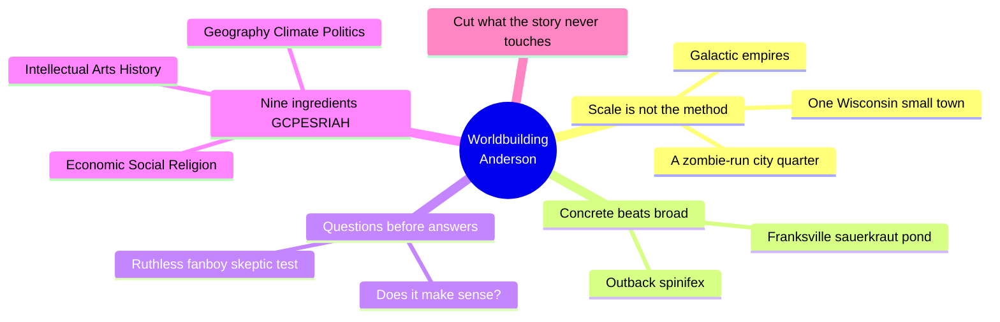
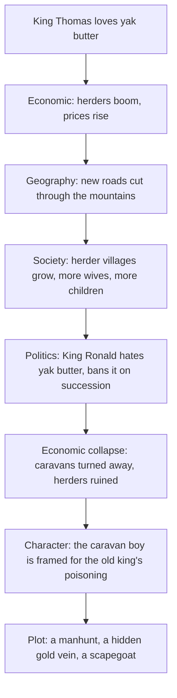
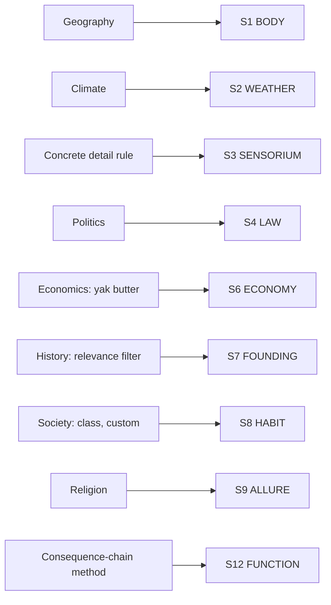

# BVX.1144 — Worldbuilding: From Small Towns to Entire Universes — Kevin J. Anderson (2015)
### Knowledge Entry — Distill

A single working novelist (130 novels, from galaxy-spanning space opera to a Wisconsin childhood) lays out one scale-agnostic method for building any setting; short, plain, and full of worked examples rather than theory, it is the setting shelf's only entry written from inside a working SF author's process rather than a GM's.

## TABLE OF CONTENTS
- [Core Thesis](#1-core-thesis)
- [Mind Models](#2-mind-models)
- [Framework](#3-framework--structure)
- [Key Concepts](#4-key-concepts)
- [Heuristics](#5-heuristics--decision-rules)
- [Invariants](#6-invariants)
- [Pitfalls](#7-pitfalls--myths)
- [Application](#8-application)
- [Cross-References](#9-cross-references)
- [Provenance](#10-provenance--confidence)

---

## 1 · CORE THESIS

A world is built by asking questions across nine ingredients (geography, climate, politics, economics, society, religion, science, arts, history), never by supplying answers up front. Each answer must be concrete enough to be believed and must chain forward until it produces a consequence a character feels. Never include what the story doesn't touch.

---

## 2 · MIND MODELS

*Required. Minimum two diagrams, maximum five.*

**Diagram 1 — the whole argument.**
Caption: *four short chapters, one method run at every scale from a single street to a galaxy: ask, get concrete, chain the answer forward, then cut what the story never touches.*

**Diagram 2 — the central mechanism (a consequence chain, run on one economic preference).**
Caption: *one royal taste in yak butter propagates through five other ingredients before it reaches a character's neck on the executioner's block; this chaining, not the ingredient list itself, is the book's real tool.*

**Diagram 3 — mapped onto the Command's SETTING SLICE (S1-S12).**
Caption: *nine chapter-ingredients land on seven slice layers, but the book's sharpest single contribution is S3 SENSORIUM, the layer BVX.0458 flagged canon-thin, and S12 FUNCTION, which the Kobold Guide only gestured at through its conflict-first filter.*

---

## 3 · FRAMEWORK / STRUCTURE

Four short chapters plus a one-page conclusion, no essays, one continuous authorial voice:

| Chapter | Governing move |
|---|---|
| One: Creating Universes, Big and Small | Runs the same method across five wildly different Anderson properties (Saga of Seven Suns, Dan Shamble Zombie P.I., Terra Incognita, licensed universes like Star Wars and Superman, Clockwork Angels) to prove scale doesn't change the method |
| Two: Everyday Worldbuilding | Proves the method on the smallest possible case, his own childhood town, to isolate the one rule that survives scale changes: concrete detail sells belief, broad strokes don't |
| Three: Questions Are Your Best Building Blocks | States the operating rule directly: ask, don't answer; test every answer with "does it make sense"; let answers spawn more questions |
| Four: A Worldbuilding Ingredients List | Delivers the tool, GCPESRIAH, walks all nine letters in turn with worked examples (Terra Incognita for geography, the yak-butter parable for economics), then runs the whole checklist back onto Franksville as a closing demonstration |
| Conclusion: Is Your World Finished? | Restates the two guardrails against opposite failures: ask enough questions, but never include every answer |

The book is bookended the same way BVX.0458 is: chapter one states the premise (method beats scale), the conclusion states the failure mode (over-inclusion), and everything between is the same move demonstrated at increasing scale.

---

## 4 · KEY CONCEPTS

| Concept | What it is | Why it matters |
|---|---|---|
| **GCPESRIAH** | Nine-part checklist: Geography, Climate, Politics, Economic, Social, Religion, Intellectual/science, Arts, History | Anderson's own expansion of his stepson's grade-school PERSIA mnemonic (Political, Economic, Religion, Society, Intellectual, Arts); a session-zero questionnaire a writer or GM can run per culture |
| **Scale invariance** | The claim, demonstrated across five of his own book series plus one childhood town, that worldbuilding technique doesn't change between a street and a galaxy | Frees a sci-fi universe-builder from treating "big" and "small" worldbuilding as different skills; the same nine questions apply to a starport bar and a stellar empire |
| **Concrete-detail rule** | One lived, specific, slightly uncomfortable sensory detail (a frozen sauerkraut-juice skating pond, spinifex thorns working through fabric) convinces a reader faster than any amount of general description | The book's sharpest craft point; belief comes from specificity a reader could not have invented, not from scope |
| **Questions-before-answers method** | Ask a question, get an answer, test it against "does it make sense," then ask the next question the answer implies | Reverses the instinct to draft a setting bible of answers first; keeps worldbuilding generative rather than encyclopedic |
| **Wistful vs. inspirational geography** | Wistful: a map drawn for dramatic effect with no logic (rivers draining to a landlocked center, a fortress city with no road, water, or food supply). Inspirational: geography that explains why anyone settled, traded, or fought there | Names, from the novelist's side, exactly the failure GM worldbuilding guides also warn against; a portable map sanity-check |
| **Consequence-chain economics** | The yak-butter parable: one ruler's taste for a commodity cascades through herding, roads, trade, succession politics, and finally a frame-up plot, then reverses completely on a change of ruler | A reusable template: take any single resource or preference in a faction and run it forward through the other eight ingredients until it produces a character-level conflict |
| **History relevance filter** | A character only knows the history that touches her: a toppled dynasty, a family grudge, the current and maybe one previous ruler, never a full timeline | Prevents the "we researched 10,000 years of history so we're using all of it" trap; matches Baur's present-tense-history rule in BVX.0458, arrived at independently |
| **Internal consistency over realism** | A writer may invent anything (a magic system, an alien biology, a steampunk energy source) provided the rules are followed consistently once set | The permission structure under which invented physics or magic in a sci-fi universe stays load-bearing instead of becoming a grab-bag of plot convenience |

---

## 5 · HEURISTICS & DECISION RULES

| Situation | Do this | Not this |
|---|---|---|
| Describing a new setting to the reader | Anchor it with one concrete, specific, lived-in sensory detail | Rely on broad adjectives ("ancient," "mysterious," "lush") and hope scope substitutes for texture |
| Drawing a world or system map | Place settlements, ports, and mines where geography gives a reason (rivers, harbors, resources, choke points) | Scatter cities and fortresses wherever the plot wants a hazard, with no supply line or road |
| Building a faction's economy | Pick one commodity or resource, then trace what changes in demand for it does to labor, trade routes, and politics | Treat economics as static flavor text separate from the plot |
| Drafting backstory | Write only the history a given character would actually know or care about | Draft the full timeline and then insert all of it because the work already exists |
| Designing a magic system, alien biology, or invented tech | Fix the rules and costs once, then follow them every time they matter to the plot | Let the rules bend for "spell of plot convenience" or its sci-fi equivalent, a conveniently rewritten physics |
| Deciding how much worldbuilding to do | Ask a lot of questions, keep the ones that touch the story, and stop | Try to answer every question the setting could theoretically raise |
| Transplanting a real-world political system | Check whether the culture has the underpinnings that system requires before installing it | Assume any society will run a democracy, a market economy, or a parliament just because the author wants one |

---

## 6 · INVARIANTS

1. **Method does not scale with world size.** The same nine-ingredient question set applies to a childhood town and a galactic empire alike.
2. **Concrete, specific detail is what makes a reader believe a place; general description does not**, regardless of how large or exotic the setting is.
3. **An answer is only useful once it is tested and chained.** "Does it make sense" is the filter; a good answer produces the next question, not a stopping point.
4. **Geography must justify settlement, trade, and conflict**, or it is set dressing wearing a map's clothes.
5. **Any invented rule (magic, tech, alien biology, an economic quirk) must be followed consistently once fixed**, or it collapses into plot convenience.
6. **A character only knows the history that touches her.** Depth of authorial research is not itself a license to include it.
7. **Completeness is a trap in both directions**, too few questions leaves a thin setting, too many answers delivered on the page overwhelms the story that setting is supposed to serve.

---

## 7 · PITFALLS / MYTHS

- **Wistful fictional geography**: a fantasy or sci-fi map drawn for symmetry and drama (mountains ringing all four sides, rivers flowing toward the landlocked center, swamp bordering desert with no transition) rather than for a working world.
- **The unsupplied fortress**: a large population center placed in a wasteland with no road, no water source, and no food supply, excused by "the villain used magic" (or, in SF, "advanced tech") as Spontaneous Construction.
- **History as trophy case**: dumping an author's full researched timeline into the story because it exists, rather than filtering it to what a character would know.
- **Assuming political systems transplant freely**: the Iraq anecdote, handing a population "democracy" (or, for SF, any imported system) without the cultural underpinning it presumes.
- **Treating an invented power system as a grab bag**: a wizard, or an SF equivalent like a device or an AI, pulling out a conveniently-timed solution with no established cost or rule.
- **Broad-stroke description mistaken for worldbuilding**: naming a culture's traits in the abstract instead of anchoring it with one specific, sense-level detail.

---

## 8 · APPLICATION

- **Spine level:** SETTING (non-story-spine source; keys to the entity beside the L0-L7 spine, same binding rule BVX.0458 applies)
- **12-layer character stack:** none directly; the consequence-chain method (Diagram 2) models the same forward-audit move as checking an L6 DRIVE want against its costs, but this source stays setting-side
- **plot_systems:** primary candidate once `04_PLOT_SYSTEMS/` opens. The yak-butter chain is a ready-made faction-conflict generator: take any single resource, policy, or preference belonging to a sci-fi universe's faction and run it forward through geography, society, and politics until it lands on a character. Run this on the DCUS starter instance the same way Grubb's Apocalypso was run on it in BVX.0458.
- **Setting:** primary. Feeds S1, S2, S3, S4, S6, S7, S8, S9, and S12 of the SETTING SLICE at varying strength.

This is the setting shelf's only entry written by a working SF novelist describing his own process rather than a TTRPG designer's, and it is worth stealing for exactly that reason: a writer's tool that reads as a TTRPG tool without being written as one. GCPESRIAH is a session-zero questionnaire indistinguishable in shape from a GM's culture-design worksheet; "does it make sense" is the same reflex a GM runs on a player's improvised backstory. Most usable for a sci-fi universe specifically: the consequence-chain method (Diagram 2) generalizes past fantasy props (yak butter, mountain roads) to any resource a spacefaring faction depends on, fuel, a habitable world, a trade lane, an AI's substrate, and produces a testable, GM-runnable output (who benefits, who is ruined, what a change of leadership breaks) that the Kobold Guide's conflict-first filter (BVX.0458 Diagram 2) only names as a goal.

---

## 9 · CROSS-REFERENCES

| Related entry | Relation |
|---|---|
| [[BVX.0458]] | The Kobold Guide to Worldbuilding, sibling SETTING-shelf source; that book is eleven TTRPG designers per subsystem, this one is a single SF novelist per scale, and their independent arrivals at the same present-tense-history rule cross-confirm it |
| [[BVX.0067]] | Collaborative Worldbuilding for Writers and Gamers, undistilled sibling, same craft-not-theory register |
| [[BVX.0349]] | Against Worldbuilding, and Other Provocations, undistilled counter-argument sibling; its root claim (worldbuilding should serve pressure, not inventory) is this book's own closing warning, "don't include everything," stated as a thesis rather than a coda |
| [[BVX.1122]] | GURPS Hot Spots: Renaissance Venice, a worked SETTING-SLICE instance; this entry's consequence-chain method is a ready filter to run against that instance's economy layer |

---

## 10 · PROVENANCE & CONFIDENCE

Full text read in full: the entire book (four chapters plus conclusion, front and back matter), extracted from an EPUB, approximately 10,700 words of body text (a short Kindle single in WordFire's Million Dollar Writing series). No section was sampled or skipped. The catalog record supplied for this distill described Anderson as an editor of an essay collection; the text is a single continuous authorial voice throughout, no other contributor or essay boundary anywhere. This entry corrects that: author is Kevin J. Anderson, sole author, and the record carries `bvx_provisional: true` pending a catalog fix. `zotero_key` and `pdf_pages` are left blank; no Zotero record was available at distill time.

The S-layer keying in `feeds:` and Diagram 3 is this distill's synthesis, built against the same SETTING SLICE (S1-S12) BVX.0458 keys to, reusing that entry's S-numbers as the shared frame. Where a chapter maps cleanly onto a slice layer the strength is primary or supporting; where the book only gestures at one (S9 ALLURE, religion as plot guardrails with no consequence checklist) the strength is contextual.

## META
- Template: BVX-LEARN-v4.0
- Source classification: full-text, single-author short book, complete read, no sampling
- Created / Updated: 2026-09-29
