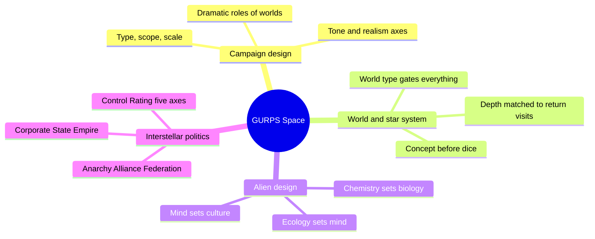
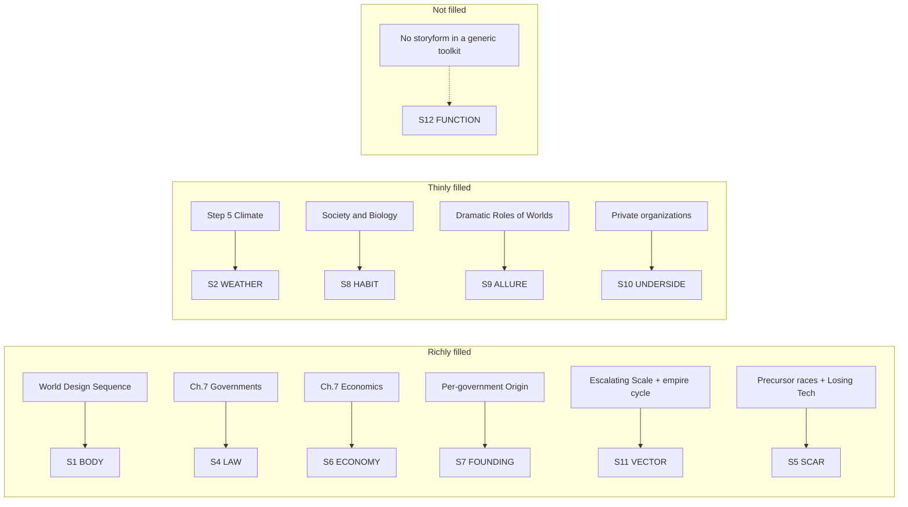

# BVX.1146 — GURPS Space (4th ed.) — Jon F. Zeigler & James L. Cambias (2006)
### Knowledge Entry — Distill

A professional TTRPG toolkit for building a science-fiction campaign universe from the top down: read here for its method, not its dice. Seven chapters of design decisions on campaign type, worlds, aliens, and interstellar politics, each a reusable heuristic for a SETTING system.

## TABLE OF CONTENTS
- [Core Thesis](#1-core-thesis)
- [Mind Models](#2-mind-models)
- [Framework](#3-framework--structure)
- [Key Concepts](#4-key-concepts)
- [Heuristics](#5-heuristics--decision-rules)
- [Invariants](#6-invariants)
- [Pitfalls](#7-pitfalls--myths)
- [Application](#8-application)
- [Cross-References](#9-cross-references)
- [Provenance](#10-provenance--confidence)

---

## 1 · CORE THESIS

A space campaign is a stack of named decisions: type, scope, scale, tone, then world, then alien, then government, made in order, each constraining the next. Decide what the result should look like before rolling a single die. Randomness fills gaps; it never chooses the shape.

---

## 2 · MIND MODELS

*Required. Minimum two diagrams, maximum five.*

**Diagram 1 — the whole argument.**
Caption: *four decision domains, each answered top-down instead of rolled up from parts: the book's real spine is the order of decisions, not its chapter numbers.*

**Diagram 2 — the central mechanism (concept-first design, run against a random-roll alternative).**
Caption: *the book rejects rolling first and discovering the setting later: every step is written so a GM with a specific result in mind can hit it on purpose.*

**Diagram 3 — the alien design chain (biology upstream of politics).**
Caption: *personality and culture are derived, step by step, from ecology and reproduction: a species earns its temperament from its niche, it isn't handed one.*

**Diagram 4 — mapped onto the Command's SETTING SLICE (S1-S12).**
Caption: *dense on the political, economic, and historical layers, thin on texture, and structurally silent on S12: the same shape as GURPS Venice, since both are general-purpose toolkits rather than one bound story.*

---

## 3 · FRAMEWORK / STRUCTURE

Seven design chapters, each answering a governing question the GM must decide before running the campaign:

| Chapter | Governing question | What it hands downstream |
|---|---|---|
| 1. Space | What kind of campaign, at what scope and scale? | The type/scope/scale/tone decisions everything else must fit |
| 2. Space Travel | How does FTL (or its absence) shape the map? | Travel time, which sets how big the setting can feel |
| 3. Technology | What miracles beyond space flight exist? | The tech ceiling every world and society is built against |
| 4. Basic Worldbuilding | What role does a world play, and how deep does it need to go? | The World Design Sequence, Steps 1-14 |
| 5. Advanced Worldbuilding | What does the star system around that world look like? | Astronomical context for worlds that need it |
| 6. Alien Life and Alien Minds | What is this species, biologically and psychologically? | The chemistry-to-culture design chain |
| 7. Future and Alien Civilizations | What government, economy, and law does a world or empire run under? | The political taxonomy and its Control Rating math |

The book's spine is sequential dependency, not narrative: Chapter 1's decisions gate Chapters 2-3's technology assumptions, which gate Chapters 4-5's world facts, which independently feed Chapter 6's aliens and Chapter 7's governments. Nothing downstream should contradict something decided upstream.

---

## 4 · KEY CONCEPTS

| Concept | What it is | Why it matters |
|---|---|---|
| **Taxonomy of miracles** | Classify a setting by how many tech "miracles" (FTL, AI, nanotech) it allows beyond the real world | Fewer miracles keeps more of the setting familiar for free; each added one is a deliberate cost |
| **Scale vs. scope** | Scope is how much territory a campaign covers; scale is how much power characters have over it | Choose both together: a huge scope with low-scale characters plays very differently than the reverse |
| **Concept-first world design** | Write a world's dramatic role and plot hooks before rolling any dice | Guarantees the result serves the story, instead of retrofitting a plot to whatever the dice gave |
| **World type** | A world's category (Tiny/Small/Standard/Large, crossed with a temperature band), set by available volatiles | The one choice that constrains atmosphere, hydrographics, climate, and habitability; get it right first |
| **Settlement type** | Homeworld, colony, or outpost: a population-history classification, independent of government | Shows how deep a world's roots run and how much offworld support it needs, before politics is assigned |
| **Society type is orthogonal to government type** | Dictatorship, democracy, theocracy, technocracy, etc. can each sit under any of the five interstellar shapes | The polity's formal shape and a world's regime character are two separate dials, not one |
| **Control Rating's five sub-axes** | Civil rights, economic freedom, legal restrictions, punishment severity, social control; CR is their average | A "CR 4" world can be lawless but conformist, or heavily taxed but unsupervised; the single number hides which |
| **Dramatic roles of worlds** | A named catalog: Paradise, Hostile, Hell, Crossroads, Exotic, Forbidden, Historical, Puzzle, Unique Resource, and more | Each role carries its own built-in conflict, so picking one picks most of a world's hooks in one move |
| **The alien design chain** | Chemistry sets biology; ecology (niche, mating, group size) sets personality; traits set culture | Personality is derived, not asserted: a race "feels" consistent because its temperament traces to how it survives |
| **Five interstellar government types** | Anarchy, Alliance, Federation, Corporate State, Empire, each with its own Origin, Military, and Law and Order | A menu of political feel set before any world's details exist: how free PCs are, how war and trade work |
| **Unobtainium** | A named-resource discipline: antimatter, artifacts, exotic biologicals, exotic matter, stable transuranics | Each carries a stated rarity logic, against the common trap of a MacGuffin with no scarcity behind it |
| **Losing Technology** | A population-linked TL ceiling (TL8 needs 100M+ people, TL1 a village) plus single-point dependencies | Gives "the empire fell" a mechanical backbone instead of a hand-waved Dark Age |

---

## 5 · HEURISTICS & DECISION RULES

| Situation | Do this | Not this |
|---|---|---|
| Starting a space campaign | Decide type, scope, scale, and tone together, in writing, first | Start rolling worlds or aliens and hope a campaign shape emerges |
| Designing a world for a plot | Write the concept and dramatic role first, then run the design sequence | Roll world type at random and retrofit a plot to what comes up |
| Choosing world detail level | Match depth to how often PCs return (grand stage / repeated visit / sound stage) | Fully detail every world the party visits exactly once |
| Building an alien for a role | Work backward: pick the wanted traits, then the ecology/mating modifiers that produce them | Assign a temperament directly and bolt on biology as decoration |
| Picking an interstellar government | Choose the type for the campaign feel it produces | Pick a government name for flavor without checking its Law and Military sections |
| Describing an oppressive society | Break Control Rating into its five sub-axes and let them disagree | Report one CR number and assume it explains the culture |
| Inventing a valuable resource | Give it a stated reason to be useful and scarce | Multiply unique resources with no scarcity logic behind any |
| Explaining a fallen civilization | Use a population-linked TL ceiling or single-resource dependency | Hand-wave "they lost the knowledge" with no cause |
| Writing a regime that has lasted | Give citizens in-world reasons to support it: fear, habit, loyalty to an idea | Assume the population is one spark from revolt |

---

## 6 · INVARIANTS

1. **Decisions made early constrain everything made later.** Type, scope, and scale (Ch.1) bound the technology (Ch.2-3), which bounds what a world or government can plausibly be (Ch.4-7).
2. **A world's type governs its whole physical stack.** Atmosphere, hydrographics, climate, and size must stay consistent with the volatiles and temperature band the world type sets.
3. **Government type and society type are separate axes.** Any interstellar government shape can host any internal political system; conflating "empire" with "dictatorship" throws away half the design space.
4. **Control Rating is a composite, not a scalar.** Its five sub-axes can each sit at a different level within the same nominal CR.
5. **Alien personality is derived from ecology, not assigned to it.** Chauvinism, Empathy, Gregariousness, and the rest trace back to niche, mating pattern, and group size.
6. **Ruins and technology loss need a mechanism.** A fallen civilization or Dark Age has a cause (population collapse, single-resource dependency, information loss), not an unexplained given.
7. **Scale and scope must match travel speed.** A setting feels only as big as the time it takes to cross it; distance without travel time is decoration.
8. **Depth of detail should track narrative weight.** A world visited once needs a sketch; a home base needs full development.
9. **A regime needs in-world reasons for its own survival.** Fear, habit, and loyalty to an idea are structural supports for a lasting tyranny, not laziness to skip past.

---

## 7 · PITFALLS / MYTHS

- Rolling a whole star system before deciding what story it needs to serve; dice fill gaps, they don't choose a shape you never specified.
- Treating Control Rating as one honest number instead of an average hiding contradictions between its five sub-axes.
- Giving an alien species a temperament first and inventing biology to match, rather than deriving personality from ecology.
- Assuming "empire" always means dictatorship or "federation" always means free; the government/society split exists to prevent this.
- Inventing a MacGuffin resource with no scarcity logic, or several at once until none feels special.
- Explaining a fallen civilization with pure hand-waving instead of a mechanism a player could reconstruct.
- Assuming tyrannies persist through force alone, missing the fear, habit, and loyalty that make citizens complicit.
- Fully detailing every world a party sees once at the same depth as the home base.

---

## 8 · APPLICATION

- **Spine level:** SETTING (non-story-spine source; a general-purpose campaign-design toolkit, not bound to a story)
- **12-layer character stack:** none directly. The alien design chain (chemistry to ecology to trait tables to culture) is the same move as deriving an L-layer trait from L1 CORE outward, but stays SETTING-side until a non-human character layer opens
- **plot_systems:** contextual candidate once `04_PLOT_SYSTEMS/` opens. The Dramatic Roles of Worlds catalog is a ready-made location-hook generator, and "Society as Backdrop / Obstacle / Puzzle" (Ch.7) is a reusable lens for what a setting element is *for* in a scene
- **Setting:** primary. This is the SETTING shelf's science-fiction-toolkit counterpart to BVX.0458 (Kobold, fantasy) and BVX.1122 (Venice, a worked instance); it sits between them as a general-purpose toolkit pitched at hard-SF campaign design

Tested against `ssot_03_setting_system.md`: the book is dense on the layers a political setting needs (S4, S6, S7, S11, and S5 via Precursor/Losing-Technology), thin on the sensory and habitual layers, and structurally silent on S12, for the same reason GURPS Venice is: a commercial sourcebook serves any GM's storyform, not one. Its most exportable idea for a science-fiction SETTING system is the alien design chain (Diagram 3): treat a non-human inhabitant's culture as the last link in a chain starting at biochemistry, not a costume on a human mind.

---

## 9 · CROSS-REFERENCES

| Related entry | Relation |
|---|---|
| [[BVX.0458]] | Kobold Guide to Worldbuilding: the SETTING shelf's fantasy-toolkit sibling; both run a conflict-first design philosophy, but Kobold's five-lineage taxonomy is this book's two-axis Realism/Tone system for fantasy instead of SF |
| [[BVX.1122]] | GURPS Hot Spots: Renaissance Venice: a single worked SETTING SLICE instance from the same line; where Venice fills S1/S4/S6/S7/S8/S11 from one city's history, this book supplies the generative rules that could produce a thousand Venices |
| [[BVX.0349]] | Against Worldbuilding: the counter-argument sibling; a check against reading the 14-step World Design Sequence as license to over-build every world instead of matching Depth of Detail to narrative weight |

---

## 10 · PROVENANCE & CONFIDENCE

Full text, pdftotext extraction, about 240 pages. Read in full or near-full: the Introduction; Chapter 1 (Campaign Types, Aliens, Societies, Interstellar Organizations, Planets and Places); the opening of Chapter 2 (Taxonomy of Miracles); Chapter 4 (Dramatic Roles, Depth of Detail, Mapping the Galaxy, the World Design Sequence overview plus Steps 1-2 and 8-14); Chapter 6 (Aliens in the Campaign, alternate chemistries, Alien Minds and its nine personality-trait tables); Chapter 7 in full (Story Concerns, Control and Intrusiveness, Society and Biology, Society and Technology, Economics, Law and Justice, Interstellar and Planetary Governments, History and Government).

Sampled or not read: the dice-roll tables for atmosphere, hydrographics, climate, and world-size (Steps 3-7); Chapter 2's drive mechanics; Chapter 3 (Technology) in full; Chapter 5's star-system tables beyond overview; Chapter 6's anatomy tables; Chapters 8-9 (Adventures, Characters); the Bibliography and Index. These are rule mechanics or character material outside this distill's brief.

The S-layer keying in `feeds:` and Diagram 4 is this distill's synthesis against `ssot_03_setting_system.md`, following the method BVX.1122 used for Venice: inference against the Command's schema, not a source mapping. `bvx_provisional: true` is set per brief, since BVX.1146 is a newly assigned id pending its formal index pass.

## META
- Template: BVX-LEARN-v4.0
- Source classification: full-text sourcebook, deep extraction on the campaign/setting/alien/politics chapters, sampled on rule-mechanics chapters
- Created / Updated: 2026-09-29
