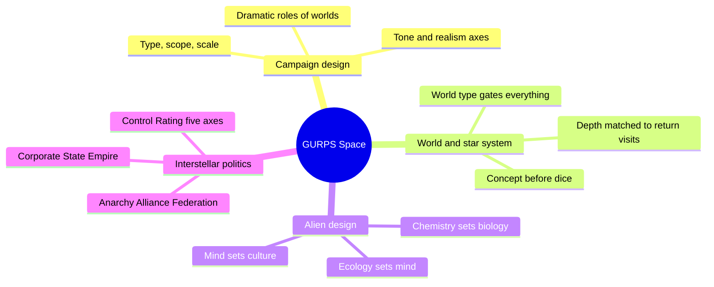
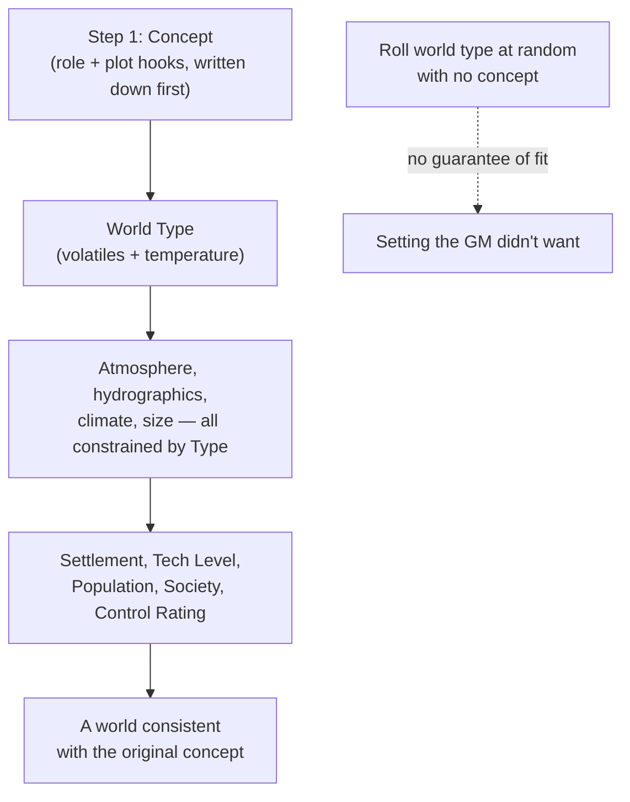
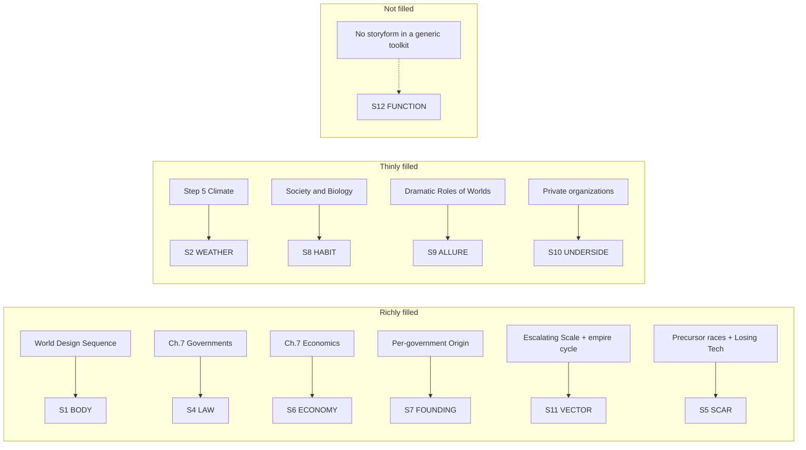

# BVX.1146 — GURPS Space (4th ed.) — Jon F. Zeigler & James L. Cambias (2006)
### Knowledge Entry — Distill

A professional TTRPG toolkit for building an entire science-fiction campaign universe from the top down — read here for its method, not its dice: seven chapters of design decisions on campaign type, worlds, aliens, and interstellar politics, each one a reusable heuristic for a SETTING system.

## TABLE OF CONTENTS
- [Core Thesis](#1-core-thesis)
- [Mind Models](#2-mind-models)
- [Framework](#3-framework--structure)
- [Key Concepts](#4-key-concepts)
- [Heuristics](#5-heuristics--decision-rules)
- [Invariants](#6-invariants)
- [Pitfalls](#7-pitfalls--myths)
- [Application](#8-application)
- [Cross-References](#9-cross-references)
- [Provenance](#10-provenance--confidence)

---

## 1 · CORE THESIS

A space campaign is a stack of named decisions — type, scope, scale, tone, then world, then alien, then government — made in order, each one constraining the next. Decide what you want the result to look like before you roll a single die; randomness fills gaps, it never chooses the shape.

---

## 2 · MIND MODELS

*Required. Minimum two diagrams, maximum five.*

**Diagram 1 — the whole argument.**
Caption: *four decision domains, each answered top-down instead of rolled up from parts — the book's real spine is the order of decisions, not its chapter numbers.*

**Diagram 2 — the central mechanism (concept-first design, run against a random-roll alternative).**
Caption: *the book explicitly rejects rolling first and discovering the setting later — every step is written so a GM with a specific result in mind can hit it on purpose.*

**Diagram 3 — the alien design chain (biology upstream of politics).**
Caption: *personality and culture are derived, step by step, from ecology and reproduction — a species isn't given a temperament, it earns one from its niche.*

**Diagram 4 — mapped onto the Command's SETTING SLICE (S1-S12).**
Caption: *dense on the political/economic/historical layers, thin on texture, and structurally silent on S12 — the same shape as GURPS Venice, because both are general-purpose toolkits rather than one bound story.*

---

## 3 · FRAMEWORK / STRUCTURE

Seven design chapters, each answering a governing question the GM must decide before running the campaign:

| Chapter | Governing question | What it hands downstream |
|---|---|---|
| 1. Space | What kind of campaign, at what scope and scale? | The type/scope/scale/tone decisions everything else must fit |
| 2. Space Travel | How does FTL (or its absence) shape the map? | Travel time, which sets how big the setting can feel |
| 3. Technology | What miracles beyond space flight exist? | The tech ceiling every world and society is built against |
| 4. Basic Worldbuilding | What role does a given world play, and how deep does it need to go? | The World Design Sequence, Steps 1-14 |
| 5. Advanced Worldbuilding | What does the star system around that world look like? | Astronomical context for worlds that need it |
| 6. Alien Life and Alien Minds | What is this species, biologically and psychologically? | The chemistry-to-culture design chain |
| 7. Future and Alien Civilizations | What government, economy, and law does a world or empire run under? | The political taxonomy and its Control Rating math |

The book's spine is not narrative but sequential dependency: Chapter 1's decisions gate Chapters 2-3's technology assumptions, which gate Chapter 4-5's world facts, which (independently) feed Chapter 6's aliens and Chapter 7's governments. Nothing downstream can contradict something decided upstream without the GM noticing.

---

## 4 · KEY CONCEPTS

| Concept | What it is | Why it matters |
|---|---|---|
| **Taxonomy of miracles** | Classify a setting by how many technological "miracles" (FTL, AI, nanotech...) it allows beyond the real world | Fewer miracles means more of the setting stays familiar for free; each added miracle is a deliberate cost the GM must think through |
| **Scale vs. scope** | Scope is how much territory the campaign covers; scale is how much power characters have over it | The two must be chosen together — a huge scope with low-scale characters (a tramp freighter crew in a galaxy) plays very differently from the reverse |
| **Concept-first world design** | Write the world's dramatic role and plot hooks down *before* rolling any dice | Guarantees the result serves the story instead of the GM discovering, after the fact, that the dice gave him the wrong planet |
| **World type** | A world's category (Tiny/Small/Standard/Large, cross a temperature band) determined by available volatiles | The single choice that constrains atmosphere, hydrographics, climate, and habitability — get it right first and the rest falls into line |
| **Settlement type** | Homeworld, colony, or outpost — a population-history classification, independent of government type | Tells the GM how deep the world's roots are and how much offworld support it depends on, before any politics is assigned |
| **Society type is orthogonal to government type** | Dictatorship, democracy, theocracy, technocracy etc. can each appear under an Anarchy, Alliance, Federation, Corporate State, or Empire | The formal shape of the interstellar polity (how power is federated) and the character of any one world's regime are two separate dials, not one |
| **Control Rating's five sub-axes** | Civil rights, economic freedom, legal restrictions, punishment severity, social control — CR is their average, not a single fact | A "CR 4" world can be free of laws but crushingly conformist, or heavily taxed but personally unsupervised; the single number hides which |
| **Dramatic roles of worlds** | A named catalog (Paradise, Hostile, Hell, Crossroads, Exotic, Exploited, Forbidden, Historical, Home-Base, Invisible, Primitive, Puzzle, Synthetic, Unique Resource, Doomed, Changing, Breeding Ground) | Each role comes with its own built-in conflict, so picking a role picks most of a world's plot hooks in one move |
| **The alien design chain** | Chemistry (from world type) sets biology; ecology (niche, mating, group size) sets personality traits; traits set culture | Personality is derived, not asserted — an alien race "feels" consistent because its temperament traces back to how it survives and mates |
| **Working backward (alien design)** | Start from the wanted role ("evil mastermind race") and choose the ecology/mating modifiers that produce those traits, then dress the biology around it | Lets a GM hit a specific narrative target through the same chain that would otherwise run forward from random biology |
| **The five interstellar government types** | Anarchy, Alliance, Federation, Corporate State, Empire — each with its own Origin, Military, Law and Order, and "Effects on the Campaign" | A complete menu of political feel: how much freedom PCs have, how the law reaches them, how war and trade work, before any single world's details exist |
| **Unobtainium** | A named-resource discipline: antimatter, artifacts, exotic biologicals, exotic matter, stable transuranics — each with a stated rarity logic | Prevents the common SF trap of inventing a MacGuffin resource with no scarcity or plausibility behind it |
| **Losing Technology** | A population-linked TL ceiling (roughly: TL8 needs 100M+ people, TL5 needs 10M+, TL1 needs a village) plus single-point-of-failure dependencies | Gives "the empire fell and tech regressed" a mechanical backbone instead of hand-waving a Dark Age |
| **Why people support rotten empires** | Fear of the unknown, habituated law-obedience, loyalty to the idea rather than the reality, fear of chaos | A political-realism checklist against writing tyranny as propped up by force alone |

---

## 5 · HEURISTICS & DECISION RULES

| Situation | Do this | Not this |
|---|---|---|
| Starting any space campaign | Decide type, scope, scale, and tone together, in writing, before anything else | Start rolling worlds or aliens and hope a campaign shape emerges |
| Designing a world that must fit a plot | Write the concept and dramatic role first, then run the design sequence to match it | Roll world type at random and retrofit a plot to whatever comes up |
| Choosing how detailed a world should be | Match depth of detail to how often the PCs will return (grand stage / repeated visit / sound stage) | Fully detail every world the party will visit exactly once |
| Building an alien race for a specific narrative role | Work backward: pick the personality traits wanted, then choose the ecology/mating modifiers that produce them | Assign a temperament directly and bolt on biology as decoration afterward |
| Picking an interstellar government | Choose the type (Anarchy/Alliance/Federation/Corporate/Empire) for the campaign *feel* it produces, not just its flavor text | Pick a government name for aesthetics without checking its Law and Order and Military sections against the intended tone |
| Describing how oppressive a society is | Break Control Rating into its five sub-axes and let them disagree | Report a single CR number and assume it explains the culture |
| Inventing a valuable resource | Give it a stated reason to be both useful and scarce (Unobtainium's own naming logic) | Multiply unique resources with no scarcity logic behind any of them |
| Explaining a technology gap or ruined civilization | Use a population-linked TL ceiling or single-resource dependency to make the regression mechanical | Hand-wave "they lost the knowledge" with no cause |
| Writing a villainous regime that has lasted | Give citizens in-world reasons to support it (fear, habit, loyalty to the idea) | Assume the population is uniformly oppressed and one spark from revolt |
| Scaling up a campaign over time | Start small and widen scope as the players get comfortable (Escalating Scale) | Open at galaxy-spanning stakes with no smaller stage to build from |

---

## 6 · INVARIANTS

1. **Decisions made early constrain everything made later.** Type, scope, and scale (Ch.1) bound the technology (Ch.2-3), which bounds what a world or a government can plausibly be (Ch.4-7).
2. **A world's type governs its whole physical stack.** Atmosphere, hydrographics, climate, and size are not independent facts; they must stay consistent with the volatiles and temperature band the world type sets.
3. **Government type and society type are separate axes.** Any of the five interstellar government shapes can host any internal political system; conflating "empire" with "dictatorship" throws away half the design space.
4. **Control Rating is a composite, not a scalar.** Civil rights, economic freedom, legal restrictions, punishment severity, and social control can each sit at a different level within the same nominal CR.
5. **Alien personality is derived from ecology, not assigned to it.** Chauvinism, Empathy, Gregariousness, and the rest trace back to niche, mating pattern, and group size — biology is upstream of temperament.
6. **Ruins and technology loss need a mechanism.** A fallen civilization or a Dark Age is a design choice with a cause (population collapse, single-resource dependency, information loss), not an unexplained given.
7. **Scale and scope must be matched to travel speed.** A setting only feels as big as the time it takes to cross it; distance without travel time is decoration.
8. **Depth of detail should track narrative weight, not completism.** A world visited once needs a sound-stage sketch; a home base needs full development; nothing in between needs equal treatment by default.
9. **A political regime needs in-world reasons for its own survival.** Fear, habit, and loyalty to an idea are structural supports for a "rotten empire," not narrative laziness to skip past.

---

## 7 · PITFALLS / MYTHS

- Rolling a whole star system randomly before deciding what story it needs to serve — the dice can fill gaps, they cannot choose a shape you never specified.
- Treating a Control Rating as one honest number instead of an average that can hide real contradictions between its five sub-axes.
- Giving an alien species a temperament first and inventing biology to match afterward, rather than deriving personality from ecology and reproduction.
- Assuming "empire" always means dictatorship, or "federation" always means free — the government-type/society-type split exists precisely to prevent this.
- Inventing a MacGuffin resource with no stated scarcity logic, or inventing several at once until none of them feels special (the Unobtainium sidebar's own warning).
- Explaining a fallen civilization or Dark Age with pure hand-waving instead of a population, resource, or information mechanism that a player could reconstruct.
- Assuming tyrannies persist only through force, and missing the fear, habit, and loyalty that make citizens complicit in their own oppression.
- Fully detailing every world a party will see only once, at the same depth as the campaign's home base.

---

## 8 · APPLICATION

- **Spine level:** SETTING (non-story-spine source; a general-purpose campaign-design toolkit, not bound to a story)
- **12-layer character stack:** none directly — the alien design chain (chemistry → ecology → personality trait tables → culture) is structurally the same move as deriving an L-layer trait from L1 CORE outward, but it stays a SETTING-side method until a non-human-species character layer opens
- **plot_systems:** contextual candidate once `04_PLOT_SYSTEMS/` opens — the Dramatic Roles of Worlds catalog is a ready-made location-hook generator, and the "Society as Backdrop / Obstacle / Puzzle" filter (Ch.7) is a reusable lens for what any given setting element is *for* in a scene
- **Setting:** primary — this is the SETTING shelf's science-fiction-toolkit counterpart to BVX.0458 (Kobold, fantasy) and BVX.1122 (Venice, a single worked instance); GURPS Space sits between them as a general-purpose toolkit like Kobold but pitched at hard-SF campaign design rather than fantasy worldbuilding craft

Tested against the shape already ruled in `ssot_03_setting_system.md`: the book is dense on exactly the layers a *political* setting needs (S4 LAW, S6 ECONOMY, S7 FOUNDING, S11 VECTOR, and S5 SCAR through its Precursor/Losing-Technology toolkit), thin on the sensory and habitual layers (S2, S3 absent entirely, S8 only reached indirectly through biology), and structurally silent on S12 FUNCTION for the same reason GURPS Venice is: a commercial sourcebook is written to serve any GM's storyform, not one. Its most exportable single idea for a science-fiction SETTING system is the alien design chain (Diagram 3): treat any non-human inhabitant's culture as the last link in a chain that starts at biochemistry, not as a costume applied to a human mind.

---

## 9 · CROSS-REFERENCES

| Related entry | Relation |
|---|---|
| [[BVX.0458]] | Kobold Guide to Worldbuilding — the SETTING shelf's fantasy-toolkit sibling; both books run a conflict-first, concept-first design philosophy, but Kobold's five-lineage genre taxonomy is this book's two-axis Realism/Tone system rendered for fantasy instead of SF |
| [[BVX.1122]] | GURPS Hot Spots: Renaissance Venice — a single worked SETTING SLICE instance from the same game line; where Venice fills S1/S4/S6/S7/S8/S11 richly from one city's history, this book supplies the *generative* rules that could produce a thousand different Venices |
| [[BVX.0349]] | Against Worldbuilding — the counter-argument sibling; a useful check against reading this book's exhaustive 14-step World Design Sequence as license to over-build every world instead of matching Depth of Detail to narrative weight, exactly as its own §4 warns |

---

## 10 · PROVENANCE & CONFIDENCE

Full text, pdftotext extraction, ~240 pages. Read in full or near-full: the Introduction and Publication History; Chapter 1 (Space) — Space and Space Fiction, Campaign Types, Aliens, Societies, Interstellar Organizations, Planets and Places; the opening of Chapter 2 (A Taxonomy of Miracles, Space Flight and Story Requirements); Chapter 4 (Basic Worldbuilding) — Using Worlds/Dramatic Roles/Depth of Detail, Mapping the Galaxy, Choosing a Preferred Scale, the World Design Sequence overview and Steps 1-2 in detail, Steps 8-14 (Social Parameters) in detail; Chapter 6 (Alien Life and Alien Minds) — Aliens in the Campaign, Life and its alternate chemistries, Alien Minds (Nature/Ecology, Nurture/Society, the nine personality-trait tables); Chapter 7 (Future and Alien Civilizations) in full — Story Concerns, Control and Intrusiveness, Avenues to Power, Society and Biology, Society and Technology (including Controlling and Losing Technology), Economics, Law and Justice, Interstellar Governments (Anarchy, Alliance, Federation, Corporate State, Empire, Alien Governments, Planetary Governments, History and Government).

Sampled or not read: the detailed dice-roll tables for atmosphere, hydrographics, climate, and world-size generation (Steps 3-7); Chapter 2's drive-mechanics detail (rocket equation, sail and ramjet engineering) beyond the design-philosophy framing; Chapter 3 (Technology) in full; Chapter 5's star-system generation tables beyond the overview; Chapter 6's alien anatomy/body-plan tables; Chapter 8 (Adventures) and Chapter 9 (Characters); the Bibliography and Index. These sections are rule mechanics or character-building material outside this distill's brief (campaign/setting design decisions, world and star-system design, alien design, interstellar societies and politics) and were skipped per that scope.

The S-layer keying in frontmatter `feeds:` and Diagram 4 is this distill's synthesis against `ssot_03_setting_system.md`'s twelve-layer SETTING SLICE, following the same method BVX.1122 used for GURPS Venice — inference from the source's content against the Command's schema, not a mapping the source itself makes. `bvx_provisional: true` is set per this entry's brief: BVX.1146 is a newly assigned id pending its formal index pass.

## META
- Template: BVX-LEARN-v4.0
- Source classification: full-text sourcebook, deep extraction on the campaign/setting/alien/politics chapters, sampled on rule-mechanics chapters
- Created / Updated: 2026-09-29
