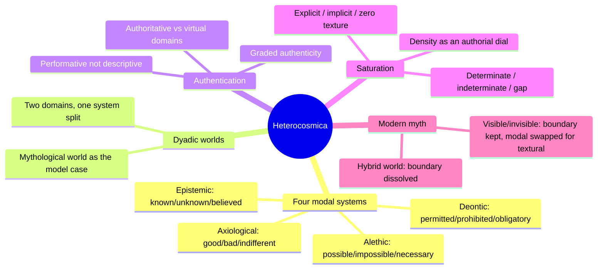
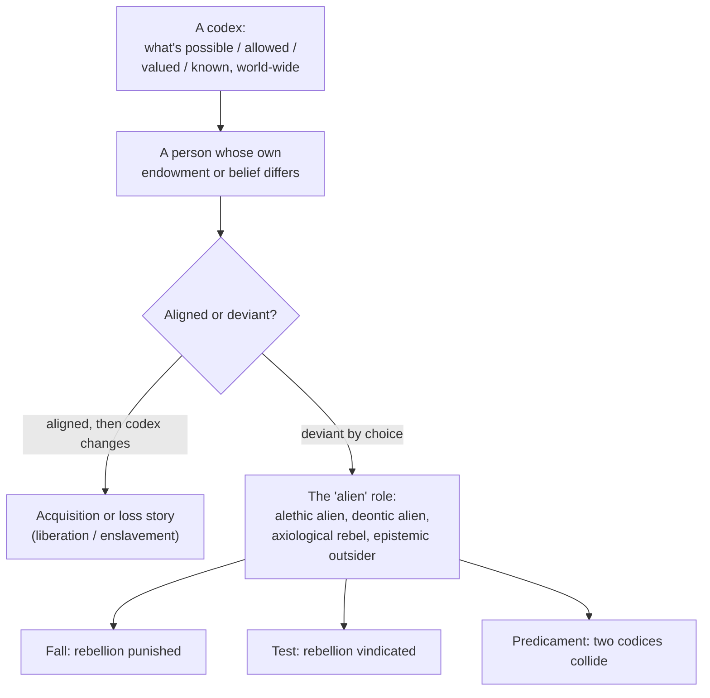
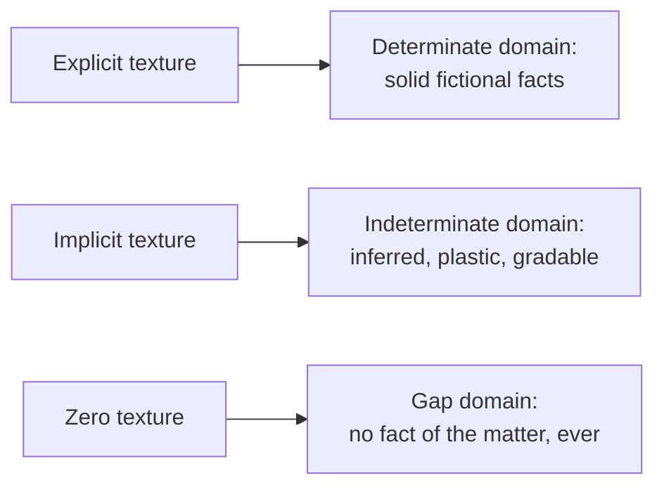
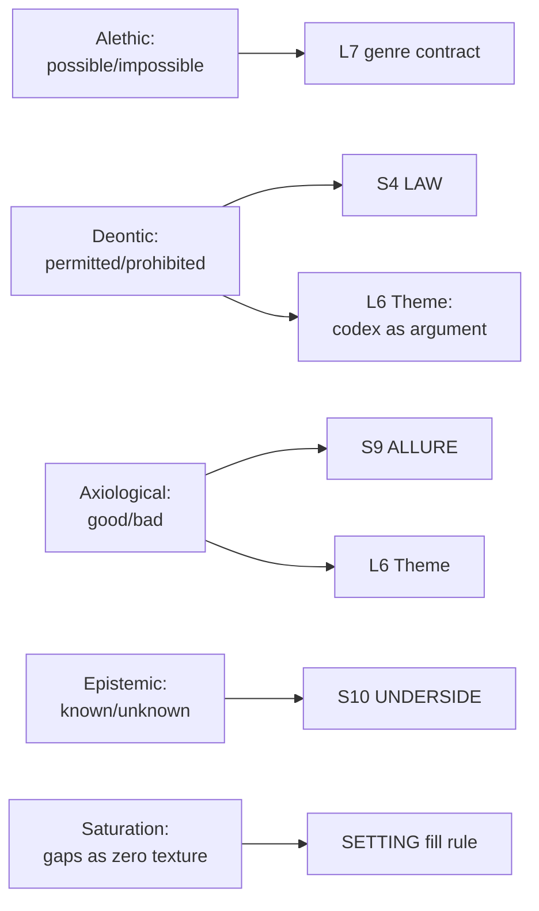

# BVX.1147 — Heterocosmica: Fiction and Possible Worlds — Lubomír Doležel (1998)
### Knowledge Entry — Distill

A logician's grammar for what makes a fictional world hold together: four independent constraint systems that sort every entity and action into possible/impossible, permitted/forbidden, good/bad, known/unknown, plus a formal account of why every world stays unfinished on purpose. The mechanism behind "world law" and "how much do I have to fill in."

## TABLE OF CONTENTS
- [Core Thesis](#1-core-thesis)
- [Mind Models](#2-mind-models)
- [Framework](#3-framework--structure)
- [Key Concepts](#4-key-concepts)
- [Heuristics](#5-heuristics--decision-rules)
- [Invariants](#6-invariants)
- [Pitfalls](#7-pitfalls--myths)
- [Application](#8-application)
- [Cross-References](#9-cross-references)
- [Provenance](#10-provenance--confidence)

---

## 1 · CORE THESIS

A fictional world is built from four independent constraint systems: alethic (what can happen), deontic (what is allowed), axiological (what is valued), epistemic (what is known). Each generates its own family of stories. A world's completeness is never physical; it is a function of how the text's wording, its texture, distributes fact, hint, and silence.

---

## 2 · MIND MODELS

*Required. Minimum two diagrams, maximum five.*

**Diagram 1 — the whole argument.**
Caption: *four modal systems generate story on their own, and a second, independent mechanism (texture, running to saturation) decides how much of any of it the reader actually gets.*

**Diagram 2 — the central mechanism (a taxonomy: how one modal system produces a story family).**
Caption: *every modal system runs the same three moves — a codex, a person who deviates from it, one of three fixed plot shapes — alethic, deontic, axiological, and epistemic are the same machine loaded with different values.*

**Diagram 3 — the saturation function (a state change: texture to world structure).**
Caption: *the same page can be doing three different jobs at once — writing a fact, implying one, or leaving a hole — and the ratio between them, not the page count, is what "thin" or "thick" actually measures.*

**Diagram 4 — mapped onto the Command's SETTING SLICE and story spine.**
Caption: *the four modal systems land on four S-layers almost one-to-one, and the same systems, read at L6 instead of S-altitude, are theme stated as world law rather than setting stated as world law.*

---

## 3 · FRAMEWORK / STRUCTURE

Doležel builds in two matched movements, each opening with a "Starter Terms" primer before its analytical chapters, so theory and worked reading alternate rather than sitting in separate halves of the book.

| Part | Chapters | Governing question |
|---|---|---|
| Prologue | From Nonexistent Entities to Fictional Worlds | Why does treating fiction as reference to nothing fail, and what does a possible-worlds account replace it with? |
| One — Narrative Worlds | One-Person Worlds; Action and Motivation; Multiperson Worlds; Interaction and Power; **Narrative Modalities** | What is the smallest unit of a narrative world, and what global systems constrain everyone acting inside it? |
| Two — Intensional Functions | **Authentication**; **Saturation** | What makes a possible entity into a fictional fact, and how much of the world actually gets built? |
| Eight — Modern Myth | The Hybrid World; The Visible/Invisible World | What happens to the classical two-domain (natural/supernatural) world once modernist fiction dissolves or re-tools its boundary? |
| Epilogue | Fictional Worlds in Transduction | How do postmodern rewrites travel between, and destabilize, already-built fictional worlds? |

This distill concentrates on Narrative Modalities, Authentication, and Saturation: the three chapters carrying the book's method for what a world's law is and how thin a world is allowed to be.

---

## 4 · KEY CONCEPTS

| Concept | What it is | Why it matters |
|---|---|---|
| **The four modal systems** | Alethic (possible/impossible/necessary), deontic (permitted/prohibited/obligatory), axiological (good/bad/indifferent), epistemic (known/unknown/believed): four independent operator triplets, each shaped like a quantifier | A world's "law" decomposes into exactly these four kinds; conflating them blurs which story engine is running |
| **Codexal vs. subjective operators** | A codex is a world-wide setting of a modal system; subjective operators are one person's endowment, norms, values, or beliefs, which can diverge from it | The gap between codex and person is where every story in this book comes from |
| **The "alien" role** | A person who deviates from the world's codex on purpose: the alethic alien, the deontic alien, the axiological alien (nihilist or rebel), the epistemic alien | One template, four modalities; naming the alien's kind names which codex the story is testing |
| **The fixed plot triad** | Fall (violation, then punishment), test (obligation met, then reward), predicament (two valid codices collide) | These three shapes recur across all four systems; a codex is not fully designed until its violation-shape is known |
| **Dyadic worlds** | One fictional world split into two domains by a single modality's redistribution: natural/supernatural, permitted/forbidden zones, rival value orders, known/hidden | The formal shape of "two versions of this place," built by running one modality twice with opposite settings |
| **Authentication (performative, not descriptive)** | A fictional text performs facts into existence rather than reporting them; an entity becomes a "fictional fact" only when the wording carries the authority to make it so | Explains why the narrator's plain statement outranks a character's claim in the same scene; authority, not truth-value, decides what exists |
| **Authoritative vs. virtual domain** | The authoritative domain is what the narrating voice states outright; the virtual domain is what only a character believes or claims | A world's official record and its rumor mill are structurally different domains, not the same one at different confidence |
| **Graded authentication** | Fictional existence is not binary; subjective narration assigns entities a rank from fully authentic to non-authentic | A world can hold facts, near-facts, beliefs, and lies at once without contradiction, each at its own grade |
| **Texture (explicit / implicit / zero)** | The wording of the text sorted by function: explicit states a fact, implicit implies one to be inferred, zero states nothing | The hinge concept: a world's completeness traces back to which of these three modes produced each detail |
| **Saturation (determinate / indeterminate / gap)** | The three-part structure texture projects onto a world: explicit builds the determinate domain, implicit the indeterminate domain, zero the gap domain | Gives Pavel's "thin by default" instinct (BVX.0100) a named, three-part mechanism |
| **Gaps as structural, not accidental** | A gap is what zero texture necessarily produces, and it is permanent; no later inference recovers it | License for "no answer, and never will be," instead of treating every silence as an oversight |

---

## 5 · HEURISTICS & DECISION RULES

| Situation | Do this | Not this |
|---|---|---|
| Writing a setting's laws | Ask whether the constraint is alethic, deontic, axiological, or epistemic before writing it | Write one undifferentiated pile of "world rules" mixing physics, law, virtue, and secrecy |
| Introducing a rule-breaking character | Decide up front which shape the break produces: punished (fall), rewarded (test), or unresolvable (predicament) | Let the character break a rule and improvise the consequence scene by scene |
| Deciding how much backstory or geography to write | Sort each detail into explicit (state it), implicit (imply it), or zero (leave it a gap on purpose) | Write everything explicitly, or leave everything vague by default with no per-detail choice |
| A reader or player asks about something never covered | Confirm it as a genuine gap if it was never even implied | Invent an answer on the spot just because the silence feels uncomfortable |
| Building a secret society or hidden history | Model it as an epistemic split (known domain, unknown domain) with deception as the connective tissue | Write the secret layer as explicitly as the public one, then just withhold it from the reader |
| Wanting a place or institution to carry theme | Write its deontic and axiological codex explicitly; the theme is what happens when someone deviates from either | State the theme directly through a character's speech, bypassing the world's own law |

---

## 6 · INVARIANTS

1. **Four modal systems are independent of one another.** A rule about what's possible, what's allowed, what's valued, and what's known are four separate axes; a violation on one axis does not automatically imply a violation on another.
2. **Every modal system produces the same three story shapes.** Fall, test, and predicament are not genre conventions, they are what a codex-versus-person structure mathematically produces, in any of the four systems.
3. **A fictional fact exists because the text performs it, not because it reports something already true.** Authority, not accuracy, is the test.
4. **Fictional existence comes in degrees.** Full authentication, collective (consensus) authentication, and pure belief or error can all coexist in one world without contradiction.
5. **A world's completeness is a property of its texture, not of its physical scope.** A short text can build a densely determinate world; a long one can leave it mostly a gap.
6. **A gap is permanent and structural, not a placeholder.** Some questions about a world have no answer and are not meant to acquire one.
7. **A dyadic world is one modal system run twice, with opposite settings, inside a single frame.** The two-domain structure (light/shadow, known/hidden, permitted/forbidden) is one mechanism wearing many costumes.

---

## 7 · PITFALLS / MYTHS

- Treating "world rules" as one undifferentiated category instead of four separable constraint systems; this is the same failure Wolf's "eight undifferentiated infrastructures" pitfall names from the craft side (BVX.0562).
- Confusing a value clash (axiological) with a rule violation (deontic): a character who disagrees with what a society prizes has not necessarily broken any of its laws.
- Assuming an unanswered question is an oversight rather than a deliberate, permanent gap; chasing it down can flatten what the silence was doing.
- Judging what "really" happened by which character sounds most confident, rather than by which discourse carries authenticating authority.
- Reading "texture" here as sensory description (soundscape, palette): Doležel's texture is the wording's factual mode, a different concept from a setting's sensory presentation despite the shared word.
- Letting physical possibility drift scene to scene for plot convenience instead of committing to one redistribution and holding it.

---

## 8 · APPLICATION

- **Spine level:** SETTING, L6 — the four modal systems are a setting-side toolkit (S4, S9, S10, L7) whose deontic and axiological halves are also, read at story-spine altitude, exactly what L6 Theme means by "the argument the world makes in matter"
- **12-layer character stack:** none directly; the codex-versus-person mechanism (the "alien" role) is formally the same shape as any character's relationship to L4/L8-level social codes, but this source stays world-side
- **plot_systems:** contextual candidate once `04_PLOT_SYSTEMS/` opens — the fixed plot triad (fall/test/predicament) is a ready-made scene-outcome menu the instant a character deviates from any S4/S9/S10 codex; run the deviation through the triad before deciding how the scene resolves
- **Setting:** primary — feeds S4 LAW and S9 ALLURE and S10 UNDERSIDE directly (each gets the formal grammar for what it already asserts by ruling), L7 genre-contract primary (the alethic redistribution behind Baur's and Wolf's taxonomies), and the SETTING fill rule supporting (the saturation function names Pavel's three domains precisely)

Read against the DCUS starter instance, the mapping holds concretely. S4 LAW's Star-Rating and Sync Cult mechanics are a deontic codex in this book's exact sense: every student action sorts into permitted, prohibited, or obligatory once the Feed is watching, and the predicament shape is the untapped scene-generator: a legacy student's loyalty to "Red Hills" and their obligation to the current name cannot both be honored in one sentence. S9 ALLURE, the meritocratic promise Tori must stop believing, is the axiological codex a rebel abandons; her arc is that shape run once. S10 UNDERSIDE, the name buried under the rebrand, is a textbook epistemic split: the public face is the known domain, and any legacy student still saying the old name is running a small act of epistemic rebellion. The saturation function also resolves a live `ssot_03` question: S2 WEATHER is flagged canon-thin, and this book says that is not automatically a problem. The test is whether the thinness is zero texture, a deliberate gap the story never needs, or an accidental hole its own inferences already require filled.

---

## 9 · CROSS-REFERENCES

| Related entry | Relation |
|---|---|
| [[BVX.0100]] | Pavel, *Fictional Worlds*, the direct predecessor Doležel names as a friend and interlocutor in his own preface. Pavel supplies the correspondence/salience argument for why a world has a lit center and dark periphery; this book supplies the four-system law governing the lit part and names the periphery's three parts formally |
| [[BVX.0562]] | Wolf, *Building Imaginary Worlds*, the craft-side counterpart. Wolf's Four Realms of Invention is the same move as this book's alethic redistribution, arrived at independently and named for builders rather than logicians |
| [[BVX.0458]] | *The Kobold Guide to Worldbuilding*: Baur's five-lineage genre taxonomy is this book's alethic system read as a menu instead of a formalism; picking a lineage picks how far the M-operator gets redistributed |
| `ssot_03_setting_system.md` | The house SETTING SSOT this distill feeds directly: S4 LAW, S9 ALLURE, S10 UNDERSIDE gain formal grammar, L7 gains the logic behind its genre-contract menu, and the S2 WEATHER canon-thin flag gets a concrete test |
| **BOLO 80 theme hook** | Tagged `invariants` on the merged reading list: the theme-as-world-law reading of this book. A setting's deontic and axiological codex are not backdrop to theme, they ARE the world's law stated in matter. Read at L6 altitude, the "alien who deviates from the codex" is what a protagonist testing a Touchstone looks like from the world's side |

---

## 10 · PROVENANCE & CONFIDENCE

Full text, pdftotext extraction (~339pp, OCR quality uneven throughout: running heads, page numbers, and occasional letters garbled but the prose recoverable by context). Read in full, per the brief's focus: the Preface; Chapter V, "Narrative Modalities," in its entirety (Modal Systems, Alethic, Deontic, Axiological, and Epistemic Constraints, Dyadic Worlds including the mythological-world case); Chapter VI, "Authentication," through World Construction as Performative Force, Dyadic Authentication, and the opening of Graded Authentication; Chapter VII, "Saturation," in full (Facts and Gaps, the fictional encyclopedia, the Saturation Function). Sampled only (chapter openings and the Contents/Subject Index, not deep-extracted): the Prologue; Chapters I–IV (One-Person Worlds, Action and Motivation, Multiperson Worlds, Interaction and Power); Chapter VIII, "Modern Myth" (the hybrid and visible/invisible case studies, read for the dyadic-world payoff only); the Epilogue on transduction, not read.

The S-layer keying in `feeds:` and Diagram 4 is this distill's own synthesis against `ssot_03_setting_system.md` and against the DCUS starter instance already on record; asserted here, not separately ruled by Chief. `bvx_provisional: true` is set per the task brief — this is a new id minted for this distill, not yet reconciled against the Zotero library's own record.

## META
- Template: BVX-LEARN-v4.0
- Source classification: full-text book, deep extraction on Chapters V–VII (Narrative Modalities, Authentication, Saturation), sampled on the Prologue, Chapters I–IV, VIII, and the Epilogue
- Created / Updated: 2026-09-29
