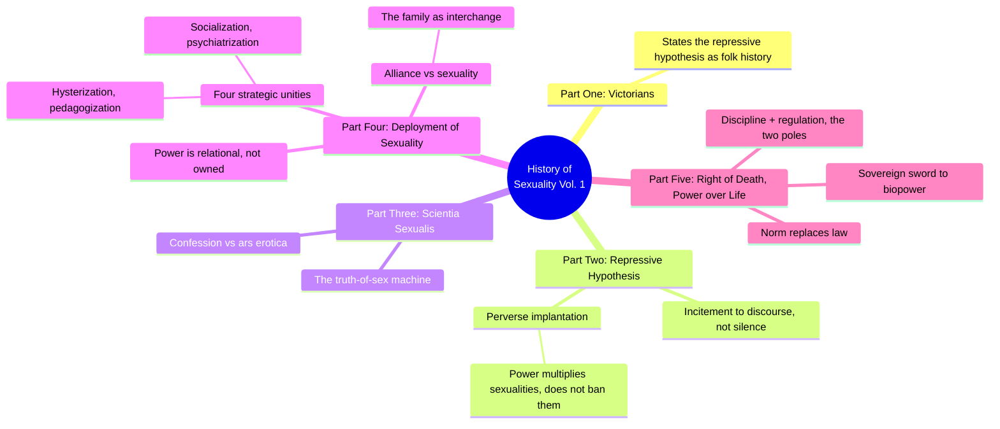
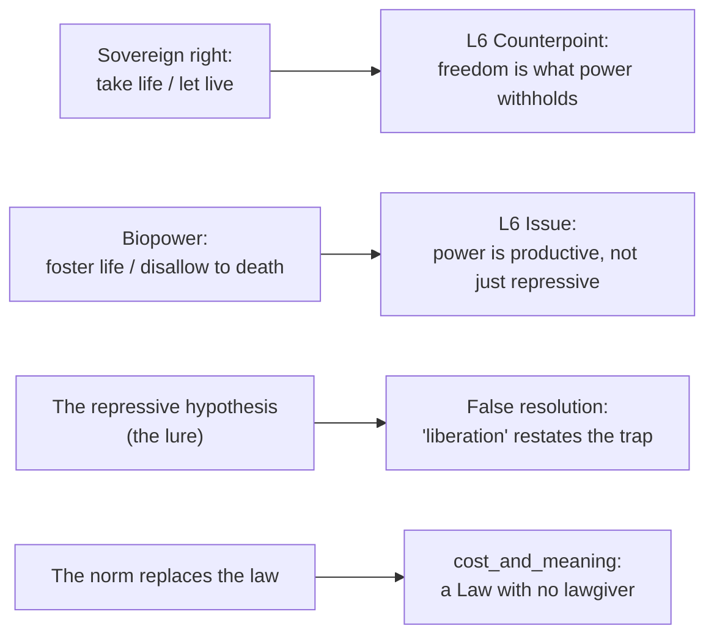

# BVX.1148 — The History of Sexuality, Vol. 1: An Introduction — Michel Foucault (1978)

### Knowledge Entry — Distill

Foucault's short, dense argument that the West never repressed sex — it built an enormous machine for producing discourse about it, and that machine is the same one, "biopower," that replaced the sovereign's right to kill with a power that manages life itself; the founding text for a story universe whose controlling idea is biopower.

## TABLE OF CONTENTS
- [Core Thesis](#1-core-thesis)
- [Mind Models](#2-mind-models)
- [Framework](#3-framework--structure)
- [Key Concepts](#4-key-concepts)
- [Heuristics](#5-heuristics--decision-rules)
- [Invariants](#6-invariants)
- [Pitfalls](#7-pitfalls--myths)
- [Application](#8-application)
- [Cross-References](#9-cross-references)
- [Provenance](#10-provenance--confidence)

---

## 1 · CORE THESIS

Modern power does not mainly forbid life; it manages it. The sovereign's right to "take life or let live" flips into a power to "foster life or disallow it to the point of death" — discipline on bodies, regulation on populations, the norm replacing the law. The repressive hypothesis (that sex was silenced and now needs liberating) is the story that power tells to hide this machine.

---

## 2 · MIND MODELS

*Required. Minimum two diagrams, maximum five.*

**Diagram 1 — the whole argument.**
Caption: *five parts build one move — from "we all know sex was repressed" to "no, power produces sex," to "and that productive power is the same power that took over life itself."*

**Diagram 2 — the central mechanism (a state change, with the condition that flips it).**
Caption: *this is the whole book's hinge — biopower is not sovereign power grown gentler, it is a different machine, and sex sits at the exact point where its two poles meet.*

```mermaid
stateDiagram-v2
    [*] --> SovereignPower
    SovereignPower: Right to take life or let live
    SovereignPower: symbol is the sword; deduction/subtraction
    SovereignPower --> Biopower: 17th-18th c. transformation
    Biopower: Right to foster life or disallow to death
    Biopower --> Discipline
    Biopower --> Regulation
    Discipline: anatomo-politics of the body
    Discipline: schools, barracks, workshops
    Regulation: biopolitics of the population
    Regulation: birthrate, health, longevity
    Discipline --> Norm
    Regulation --> Norm
    Norm: the norm replaces the law
    Norm --> [*]
    note right of Biopower
        Sex is the pivot: disciplines
        the body, regulates the species
    end note
```

**Diagram 3 — mapped onto the Command's L6 theme system.**
Caption: *Foucault's own vocabulary drops straight onto the Issue/Counterpoint pair a biopower story has to argue through events, not state in a speech.*

---

## 3 · FRAMEWORK / STRUCTURE

Five parts, one continuous argument, read here in the order the brief set (Five, then Two, then Four; One and Three held at TOC/context level only):

| Part | Governing move | Read depth |
|---|---|---|
| One · We "Other Victorians" | States the repressive hypothesis as the received account: sex silenced since the seventeenth century | Context only (TOC, cross-references from Parts Two/Four) |
| Two · The Repressive Hypothesis | Two chapters: the "incitement to discourse" (confession, pedagogy, demography all *produced* talk about sex) and the "perverse implantation" (four operations: pursuit into childhood, specification of the pervert as a species, the pleasure-power spiral, saturation of whole social spaces) | Full |
| Three · Scientia Sexualis | Confession versus *ars erotica*; how the West built a "science" of sex out of a ritual of truth-telling | Context only |
| Four · The Deployment of Sexuality | Rejects the "juridico-discursive" model of power (law, prohibition, the sovereign); gives an analytics of power instead (four methodological rules); names four strategic unities and the alliance/sexuality distinction; periodizes the technology of sex | Full |
| Five · Right of Death and Power over Life | The sovereign's right to kill becomes biopower: discipline of bodies + regulation of populations; the norm displaces the law; sex is the hinge between the two poles | Full |

The book's shape is bookended by method: Part Four opens with four propositions for analyzing power (immanence, continual variation, double conditioning, tactical polyvalence of discourse) and Part Five is the payoff — the concrete history that those propositions make visible once you stop assuming power only says no.

---

## 4 · KEY CONCEPTS

| Concept | What it is | Why it matters |
|---|---|---|
| **Repressive hypothesis** | The claim that the seventeenth century began an age of silence, censorship, and denial around sex, from which we are still "liberating" ourselves | The thing Foucault spends the whole book dismantling; a story's antagonist-idea, not a fact to dramatize as true |
| **Incitement to discourse** | Confession, pedagogy, medicine, demography, and criminal justice did not silence sex — they built machinery that compelled it to be talked about, in ever more detail | Power's first move is not "don't speak" but "speak, to me, in detail, on my terms" — a scene about surveillance should show compelled confession, not gagging |
| **Perverse implantation** | Four operations by which nineteenth-century power did not exclude "deviant" sexualities but produced, named, and fixed them as species (the homosexual, the onanist, the hysteric) | Power classifies and multiplies rather than simply forbidding; a villain who "bans" the different is doing the easy, less accurate version of this |
| **Juridico-discursive power** | The model Foucault rejects: power as a king who forbids, a law that says no, a taboo with one direction | The model most stories default to by instinct (a tyrant issuing edicts); Foucault's whole method is built to replace it |
| **Analytics of power** | Foucault's alternative: power as a name for a complex strategic situation, exercised from innumerable points, intentional but not centrally authored, always meeting resistance from inside itself | Explains why no single villain "runs" biopower — it is a field of relations, which is a harder, better story problem than a single controller |
| **Deployment of alliance vs. deployment of sexuality** | Alliance = kinship, marriage, transmission of names and property, governed by law. Sexuality = a newer apparatus keyed to bodily sensation and pleasure, governed by norm and technique, that grew up alongside and inside the family | Two different power-systems can occupy the same institution (the family) at once, pulling in different directions — a rich source of internal story conflict |
| **The four strategic unities** | Hysterization of women's bodies, pedagogization of children's sex, socialization of procreative behavior, psychiatrization of perverse pleasure | Four concrete, filmable mechanisms of biopower in action, each centered on a "privileged figure" (the nervous woman, the masturbating child, the Malthusian couple, the pervert) |
| **Bio-power (the two poles)** | Anatomo-politics of the body (discipline: drill, schedule, examination) plus biopolitics of the population (regulation: birthrate, health, statistics) | The two machines a biopower setting needs both of — one working on individuals, one working on the aggregate — to feel structurally real rather than merely oppressive |
| **The norm replaces the law** | Where sovereign law worked by the sword and the binary licit/illicit, biopower works by measuring, appraising, and distributing bodies around a statistical norm | The single most useful mechanism for a setting: normal/abnormal, not legal/illegal, is biopower's real border, and it has no fixed line — it moves with the data |
| **State racism** | The point where the older thematics of blood is called back in to justify biopower: "protecting the race," a caesura drawn within the population itself, between those who must live and those who may be let die | The load-bearing mechanism for any story that wants biopower to turn openly lethal without reverting to a sovereign-style tyrant; it is biopower's own logic taken to its worst conclusion, not a betrayal of it |
| **Sex as pivot** | Sex sits at the exact junction of the two poles — disciplined at the level of the individual body, regulated at the level of the population — which is why it became the West's obsessive object of knowledge | Explains why a biopower story keeps returning to bodies, reproduction, and intimacy even when its real subject is institutional power |

---

## 5 · HEURISTICS & DECISION RULES

| Situation | Do this | Not this |
|---|---|---|
| Writing the antagonist power | Make it a system of normalizing, data-driven relations with no single author who could be dethroned | Write a tyrant-king whose death would end the oppression |
| Showing power controlling a character | Show it compelling them to speak, confess, be measured, be classified | Show it only gagging them or banning their desire outright |
| Building the "liberation" beat | Make the character's proclaimed freedom double back into the same system (new confession, new norm, new expert) | Let "we broke free of the repression" be the actual resolution — that is the repressive hypothesis restated as a happy ending |
| Designing an institution (school, clinic, ministry) | Give it both a discipline function (bodies, schedules, exams) and a regulation function (population statistics, targets, rates) | Give it only rules and punishments; that is sovereignty's model, not biopower's |
| Writing a "deviant" character the system targets | Show the system naming, studying, and producing them as a type — a file, a diagnosis, a case history | Show the system simply hiding or forbidding them and stopping there |
| Escalating the antagonist power to its worst point | Reach for a racism/eugenics logic: a line drawn inside the population between who must live and who may be let die | Reach for an old-style massacre-by-decree; that is sovereign violence, a different (and less biopower-specific) argument |
| Testing whether a scene argues the Issue (biopower) | Ask whether the scene shows power producing, inciting, measuring, or normalizing something | Ask only whether a character is punished or forbidden something — that tests the Counterpoint (the repressive-hypothesis model) instead |
| Writing resistance | Root it inside the same network of relations it opposes — a point of friction, not an outside sanctuary | Give the resistance a pure "outside" (an untouched wilderness, an uncorrupted rebel base) where power's logic simply does not reach |

---

## 6 · INVARIANTS

1. **Power that only prohibits is the weaker, less accurate story.** The stronger, more Foucauldian move is power that produces, incites, and classifies.
2. **There is no single seat of power.** It is a field of relations; the strategic-looking unity of "the system" is an effect assembled from many local, tactical points, not a command center.
3. **The norm has no fixed line.** Because normalization runs on measurement and comparison rather than a fixed code, the border of the acceptable can always move — which is what makes it harder to fight than a law.
4. **Sex, the body, and reproduction are never incidental in a biopower story.** They are the literal pivot where the discipline of the individual and the regulation of the population meet.
5. **Resistance is inscribed inside the power it resists, never fully outside it.** A rebellion that believes itself to be outside the system is dramatizing the repressive hypothesis, not escaping it.
6. **Knowledge and power are not opposites.** Every technique for knowing a population (census, diagnosis, confession, data) is simultaneously a technique for governing it.
7. **When biopower turns lethal, it does so through a drawn caesura inside the population (a racism), not through a sovereign's decree.** The "who must live, who may be let die" line is the mechanism, not a mere symptom.

---

## 7 · PITFALLS / MYTHS

- Writing "the age of repression, then liberation" as literal history rather than as the trap the story exists to expose — Foucault's whole point is that this narrative is itself a product of the power it claims to oppose.
- Assuming power and knowledge are enemies: a school, clinic, or ministry that "just wants to help" via data collection is already exercising power, not standing apart from it.
- Collapsing biopower into an evil individual's plan; the analytics-of-power model explicitly denies that anyone "presides over its rationality."
- Confusing tolerance with absence of power: Foucault's account of Victorian-era sodomy shows severe law and widespread practice coexisting — silence is a tactic inside the discourse network, not evidence of its absence.
- Treating "the pervert," "the deviant," or any classified figure as pre-existing and merely persecuted, rather than as a category the power/knowledge apparatus manufactured.
- Writing the family, school, or clinic as a pure instrument of repression, missing that (per the deployment of alliance vs. sexuality) it can carry two different power-systems in tension at once.
- Mistaking population-level regulation (birthrate policy, health statistics, eugenics logic) for mere background — in a biopower story it is a main engine of plot, not scenery.

---

## 8 · APPLICATION

- **Spine level:** L6 — the controlling idea and its Issue/Counterpoint pair. This text supplies the Issue side directly: power is productive, not merely prohibitive, and the story must demonstrate that through events (a scene showing an institution measure, name, and normalize a body) rather than assert it in dialogue.
- **12-layer character stack:** L4 WILL (contextual) — Part Four's "resistance is never outside power" rule is a constraint on any character's rebellion arc: the win condition cannot be "escape the system," only "shift where you sit inside it," which is a harder and more Foucauldian victory condition to write.
- **plot_systems:** primary candidate for BOLO 77's Issue/Counterpoint argumentation — a scene-level test: does this beat show power *producing* (a confession extracted, a body measured, a population counted) or only power *forbidding*? The former argues the biopower Issue; the latter argues the Counterpoint (the repressive hypothesis) and should be reserved for the moments the story wants the audience to catch the trap, not the moments it wants them to believe it.
- **Setting:** contextual — any biopower institution (a clinic, a school, a census bureau, a fertility ministry) needs both an S4/S8-style discipline layer (bodies, schedules, exams, belonging) and a population-level regulation layer (rates, targets, statistics) to read as biopower rather than as an ordinary tyranny; Part Five's two-pole model is a ready checklist for building one.

Read against BOLO 80's own theme-system record (`_tools/bolostatus/work/80/DISTILL.md`): the shelf already names McKee's controlling idea, Dramatica's Issue/Counterpoint, and the house's `cost_and_meaning` invariant as theme's working parts, but had no primary text arguing biopower itself as a controlling idea. This entry is that primary text. Its clearest handoff to the open theme/invariants handshake (BOLO 80 call 3) is the norm-replaces-law argument in Part Five: a norm is a Law with no lawgiver, which is exactly the shape `cost_and_meaning` needs if the story's judgment is meant to fall on a system rather than a dethronable villain.

---

## 9 · CROSS-REFERENCES

| Related entry | Relation |
|---|---|
| [[BVX.0054]] | Lyons, *Anatomy of a Premise Line* — L6 sibling; Lyons's "moral blind spot" (a false belief the protagonist cannot see) is the individual-scale version of what this book argues at the civilizational scale: a belief (freedom from power) that is itself produced by the thing it claims to oppose |
| [[BVX.0100]] | Pavel, *Fictional Worlds* — L6/SETTING sibling; Pavel's "argue in matter" (a place embodies a Domain by correspondence) is the setting-side tool for making a biopower institution argue the Issue without a speech |
| [[BVX.1131]] | O'Byrne & Holmes on gay circuit parties — uses Deleuze and Guattari's desire-as-production model, the same anti-repressive move Foucault makes about power; a live example of the analytic already at work one layer down, on desire rather than power |
| — | **Not yet in the library** (named per the BOLO 87 theme brief; held in the Zotero inventory, undistilled). Agamben, *Homo Sacer*: bare life and the sovereign exception, the direct heir to Part Five. Mbembe, *Necropolitics*: biopower extended to making die, sharpening §4/§6's state-racism mechanism. Byung-Chul Han, *Psychopolitics* / *The Burnout Society*: biopower gone internal, the self policing its own norm. Arendt, *Eichmann in Jerusalem*: a normalizing bureaucracy carrying out the caesura. Bauman, *Modernity and the Holocaust*: administrative rationality, not sovereign cruelty, as the mechanism of mass death. Goffman, *Asylums*: the disciplinary institution at ground level. Zuboff, *Surveillance Capitalism*: the regulation pole rebuilt on data. All six are acquisition candidates before the theme system can cite living counter-cases against Foucault's own account. |

---

## 10 · PROVENANCE & CONFIDENCE

Full text, extracted from a drop-folder PDF (`Q:/_PDF_DROP/The History of Sexuality, Volume 1 - An Introduction (Michel Foucault)...pdf`), Robert Hurley's 1978 translation of the 1976 French original (*La Volonté de savoir*). Read in full, per the BOLO 87 brief's order: Part Five, "Right of Death and Power over Life" (pp. 135-159); Part Two, "The Repressive Hypothesis," both chapters (pp. 17-49); Part Four, "The Deployment of Sexuality," all four chapters (pp. 77-131). Parts One and Three were not separately read; their content here comes only from the book's table of contents and from the cross-references Parts Two, Four, and Five make back to them. The index, read directly, confirmed key-term locations (bio-power, bio-history, dégénérescence, racism) and cross-checked the Part Five reading.

This entry is provisional (`bvx_provisional: true`): the id is newly minted, the book has no Zotero key (a drop-folder item, subject already ruled `MSX`), and `spine: [L6]` / `subjects: [PHI, MSX]` are this distill's own call under the BOLO 87 brief. The biopower-as-controlling-idea framing is this distill's synthesis against BOLO 80's theme-system record, not a claim in Foucault's own text; his argument is historical-philosophical, and the L6 mapping in Diagram 3 and §8 is the Command's overlay on it.

## META
- Template: BVX-LEARN-v4.0
- Source classification: full-text extraction, deep read on 3 of 5 parts (Two, Four, Five) per brief order; Parts One and Three at TOC/cross-reference level only
- Created / Updated: 2026-09-29
