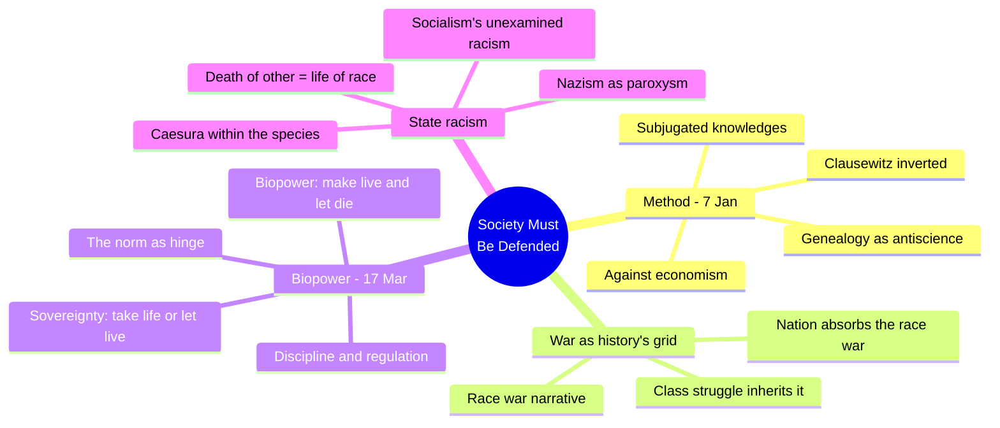
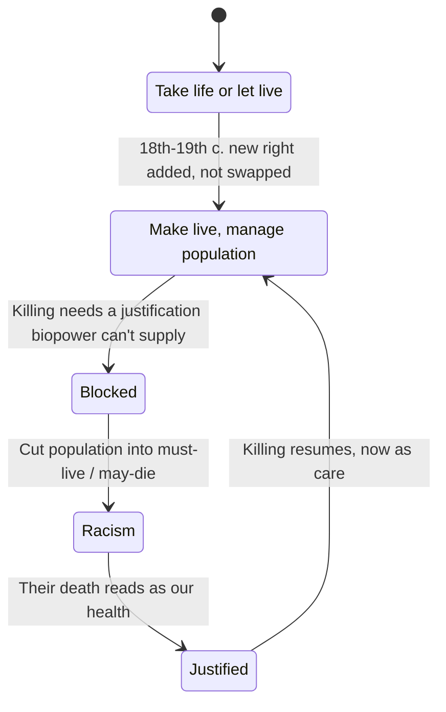
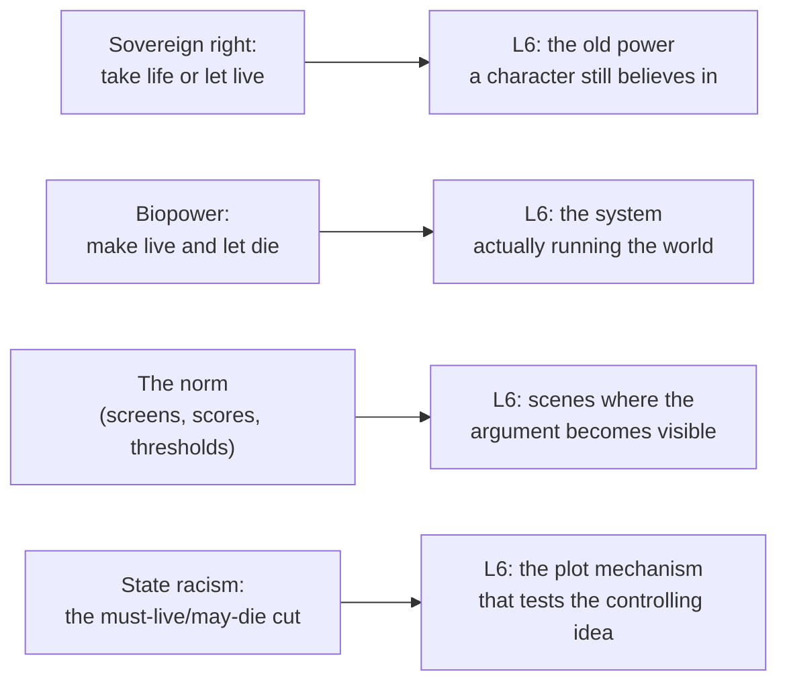

# BVX.1149 — Society Must Be Defended — Michel Foucault (2003 English ed.)

### Knowledge Entry — Distill

Foucault's 1975-76 Collège de France course, the lecture series where "biopower" and "state racism" are coined; read for BOLO 80, the theme system, as the founding text behind the story universe's controlling idea, biopower — power that manages life itself.

## TABLE OF CONTENTS
- [Core Thesis](#1-core-thesis)
- [Mind Models](#2-mind-models)
- [Framework](#3-framework--structure)
- [Key Concepts](#4-key-concepts)
- [Heuristics](#5-heuristics--decision-rules)
- [Invariants](#6-invariants)
- [Pitfalls](#7-pitfalls--myths)
- [Application](#8-application)
- [Cross-References](#9-cross-references)
- [Provenance](#10-provenance--confidence)

---

## 1 · CORE THESIS

Sovereign power took life or let live; from the nineteenth century on, a new power learned to make live and let die, managing birth, health, and population rather than commanding death. Racism is the mechanism that lets this life-making power still kill: it cuts a population into a part that must live and a part that may die, then frames the second death as the first part's health.

---

## 2 · MIND MODELS

*Required. Minimum two diagrams, maximum five.*

**Diagram 1 — the whole argument.**
Caption: *the course runs one investigation (is power war?) through two lectures worth keeping — the method lecture that licenses "history from below," and the biopower lecture that is its final payoff.*

**Diagram 2 — the central mechanism (a state change: how a life-making power still kills).**
Caption: *racism is not an attitude here, it is the load-bearing joint — remove it and a biopower state has no way to justify a single death.*

**Diagram 3 — mapped onto the Command's L6 controlling-idea layer.**
Caption: *the course hands the story universe a ready-built argument engine — plug a cast's protected/exposed line into the mechanism and the theme is already load-bearing, not decorative.*

---

## 3 · FRAMEWORK / STRUCTURE

The course runs eleven lectures (7 January to 17 March 1976) as one continuous argument, not a set of separate topics:

| Stage | Lectures | Move |
|---|---|---|
| Method | 7 January | States the whole year's method: genealogy as "insurrection of subjugated knowledges," and the two off-the-cuff hypotheses about power (Reich's repression, Nietzsche's war) that the course will test against each other. |
| War-as-history's-grid | 14 January – 4 February | Builds and interrogates a "race war" discourse (Boulainvilliers, Coke) that reads all of history as one people's war against another, prior to and beneath the law. |
| Absorption | 11 February – 3 March | Traces how the race-war discourse gets absorbed and inverted by nation-state history on one side, and by class struggle on the other — the war frame survives, its "races" don't. |
| Payoff | 10-17 March | Delivers the course's destination: state racism as the mechanism that lets a life-administering power still kill, worked through Nazism and then socialism. |

The 7 January method lecture and the 17 March payoff lecture are the two load-bearing pillars; the middle lectures are the historical scaffolding the argument is built on, useful for provenance but not required to use the payoff.

---

## 4 · KEY CONCEPTS

| Concept | What it is | Why it matters |
|---|---|---|
| **Subjugated knowledges** | Buried erudite history plus "disqualified" local knowledge (the patient's, the delinquent's), both masked by official theory | Model for building a theme from concrete instances, not a stated moral |
| **Genealogy as antiscience** | An insurrection against the *power-effects* of any discourse that claims scientific status, not a rival science | A controlling idea should be demonstrated through struggle, never pronounced |
| **Clausewitz inverted** | "Politics is the continuation of war by other means" — peace and law read as war continuing, not war's opposite | Civil order is a frozen battle; every institution can be reread as a position in an ongoing struggle |
| **Sovereign right (take life or let live)** | Sovereignty's asymmetric right: power over life shows itself only in the right to kill | The baseline the new power modifies, not replaces — old-style killing keeps operating inside biopower |
| **Biopower (make live and let die)** | A power targeting "man-as-species": birth, mortality, longevity, health, environment | The population-scale technology that manages statistically rather than commanding bodies |
| **Discipline vs. regulation** | Discipline individualizes (drilled bodies, institutions); regulation is "massifying" (statistics, homeostasis) | Two technologies that interlock — one site (housing, sexuality) can be worked by both at once |
| **The norm** | The single measure running through both discipline and regulation | Wherever a story stages measurement or classification, discipline and regulation meet at the norm |
| **State racism** | The mechanism that (1) cuts the population into must-live and may-die, then (2) converts the other's death into "my" vitality | *How* a life-administering power kills without contradicting its own logic |
| **Death privatized** | Once power's business is to make live, death exits its reach and becomes shameful and private | A sovereign-style killer inside a biopower regime can die without the regime registering it (the Franco anecdote) |
| **Nazism as paroxysm** | The one State where total biopower and total sovereign killing coincide — "a racist, murderous, suicidal State" | The extreme case that makes the mechanism visible; a limit-case check, not a template |
| **Socialism's unexamined racism** | Socialism never critiqued the biopower mechanism, only who should run it, so it reproduces racism when forced to fight physically | Warns against any faction opposing the regime's victims while keeping its administrative logic intact |

---

## 5 · HEURISTICS & DECISION RULES

| Situation | Do this | Not this |
|---|---|---|
| Building a biopower antagonist or system | Give it a stated, sincere mission to make live (health, growth, optimization) that requires a justified class of exceptions | Write a system that just wants to kill or dominate — that is sovereignty, not biopower |
| Staging the theme | Let a concrete mechanism (a screening, a quota, a classification) carry the argument, and let events test it | Have a character announce the theme as dialogue |
| Writing the "villain" of a biopower plot | Show them believing they are curating health or fitness for the whole, not indulging cruelty | Write generic malice; the mechanism only works if the killing reads as care to the killer |
| Designing who gets protected vs. exposed | Root the cut in a measurable norm (a score, a status, a diagnosis) applied uniformly, then reveal its violence | Make the cut arbitrary or purely personal — it needs to look procedural |
| Writing an opposition faction | Ask whether it rejected the administrative logic of "manage life" or only wants to run the machine itself | Assume any resistance is automatically outside the regime's logic |
| Placing a sovereign-style character inside a biopower world | Let their old life-and-death authority go unrecognized by the new system | Resolve them with a classic duel that restores sovereignty as the story's real logic |
| Deciding how much lecture-history to import | Use only the mechanism (biopower + racism's two functions) as a portable engine | Import the race-war-to-class-struggle history as setting lore |

---

## 6 · INVARIANTS

1. **The new right does not replace the old one; it penetrates it.** Sovereignty's "take life or let live" keeps operating beneath and inside biopower's "make live and let die" — a biopower story still has room for an old-style sovereign killer.
2. **Biopower's object is the population, not the individual.** Its tools are forecasts, statistics, and equilibrium, not verdicts on one person.
3. **The norm is the one term that works on both scales at once.** Any single measurement standard can discipline a body and regularize a population simultaneously.
4. **A life-administering power cannot kill without a justification that does not look like conquest.** Racism (in Foucault's technical sense: a caesura plus a life-for-death exchange) is the mechanism that supplies that justification.
5. **The caesura works through two linked functions, not one.** First, fragment the population into subspecies; second, convert the death of one subspecies into the vitality of another. Both functions must be present for the mechanism to run.
6. **Once power's business is to make live, death exits the field of power and becomes private.** A political system centered on managing life has no ritual vocabulary left for death as event.
7. **Opposing a biopower regime's goals is not the same as rejecting its mechanism.** A faction can fight the regime's chosen victims while leaving its administrative logic of managing-life-by-exclusion completely intact.

---

## 7 · PITFALLS / MYTHS

- Treating biopower as simply "more surveillance" or "more control" — its distinguishing feature is the *aim* (make live) and the *scale* (population), not the intensity of oversight.
- Writing a biopower antagonist as a cartoon tyrant who enjoys killing — the mechanism only argues something if the killing is sincerely framed, by the killer, as health or care.
- Confusing state racism with interpersonal racial hatred; Foucault is explicit that this is "something much deeper than an old tradition, much deeper than a new ideology" — a technique of power, not a psychology.
- Assuming resistance movements are automatically exempt from the mechanism; the course's most uncomfortable claim is that socialism reproduced state racism whenever it had to physically fight rather than argue economics.
- Reaching for Nazism as the only usable instance — it is named as the *paroxysm*, the extreme case, not the baseline; a story's biopower system should be legible well before it reaches that limit.
- Forgetting the first half of the course: "power is war continued by other means" is the premise that makes the second half's "make live and let die" land as a *continuation* of struggle, not a benevolent correction of it.

---

## 8 · APPLICATION

- **Spine level:** L6 (the controlling idea / argument's value layer)
- **12-layer character stack:** none directly by layer number; the mechanism (state racism's must-live/may-die cut) is the plot-and-cast-level device that makes an L6 controlling idea visible in action — any character sorted by the cut, or doing the sorting, is running this concept
- **plot_systems:** primary candidate once a plot-systems layer opens — the two-function racism mechanism (fragment the population; convert the other's death into the group's vitality) is a ready-made engine for a subplot's stakes, not just background theme
- **Setting:** contextual — a biopower-run society needs visible administrative apparatus (screenings, registries, health/purity metrics) as environment, but this entry's primary use is thematic, not world-building

This is the founding text behind BOLO 80's leading controlling idea. Used correctly, biopower is not an "evil empire" theme, it is a *structure*: a system that sincerely wants to make its population live, and therefore needs a justified exception to kill anyone at all. The argument gets tested, not stated, when the plot forces a character who believes in the system's care to confront the cut it depends on — the moment "make live" and "let die" meet in one scene is where the theme becomes load-bearing. The norm (a score, a screening, a status) is the most portable device: wherever the argument needs to become visible, put a measurement in the scene.

---

## 9 · CROSS-REFERENCES

| Related entry | Relation |
|---|---|
| Agamben, *Homo Sacer* (not yet in the library) | Direct descendant: fuses sovereignty's kill-right and biopower's population-management into "bare life," a figure killable without it counting as murder — a single-character version of the must-live/may-die cut |
| Mbembe, "Necropolitics" (not yet in the library) | Direct extension: argues "let die" undersells regimes that actively "make die" — useful if the story's system needs an explicitly lethal edge |
| Byung-Chul Han, *Psychopolitics* (not yet in the library) | Update: relocates the norm from institutions to self-optimization and data — "make live" as engineered self-exploitation, a softer biopower model |
| Zuboff, *The Age of Surveillance Capitalism* (not yet in the library) | Update: relocates population-level forecasting from State demography to corporate data extraction — a non-State biopower actor |
| Arendt (not yet in the library) | Adjacent: totalitarianism and the banality of administrative killing, parallel to the Nazism case but by political theory, not genealogy |
| Bauman (not yet in the library) | Adjacent: bureaucratic rationality itself as the enabling condition for mass killing, a cousin to "the norm, not hatred, is racism's mechanism" |
| Goffman (not yet in the library) | Scene-scale cousin: *Stigma*'s "spoiled identity" management is an interpersonal version of the same must-live/may-die sorting |
| [[BVX.0054]] | Lyons, *Anatomy of a Premise Line* — the L6 moral-blind-spot mechanism this entry keys to `moral_blind_spot`; a biopower character's blind spot is precisely the belief that the cut is care rather than killing |
| [[BVX.0100]] | Pavel, *Fictional Worlds* — the `argue_mode` feed (a fictional place "makes the argument in matter") is the setting-side tool for staging the norm's visible apparatus (screenings, registries) that this entry's Application section calls for |

---

## 10 · PROVENANCE & CONFIDENCE

Full text (pdftotext extraction from the 2003 Picador English edition, ~306pp). Read in full, per the brief: the lecture of 17 March 1976 ("From the power of sovereignty to power over life," the biopolitics/state-racism lecture) including its editorial footnotes, and the "Course Summary" appended after it; the lecture of 7 January 1976 (the method lecture) in full, including footnotes. The intervening nine lectures (14 January through 10 March) were read only via the table of contents and their one-line chapter descriptions to establish the course's overall arc (Framework section above); their content on the race-war discourse, its English and French variants, and its absorption into nation and class-struggle narratives is therefore reported at TOC-description depth, not full-text depth, and any finer claims about those middle lectures should be checked against the source directly.

The `feeds:` keying to L6 is this distill's synthesis for BOLO 80: Foucault's own text has no character-system vocabulary, so the mapping (controlling idea, theme-as-structure, the racism mechanism, the norm, death-privatized) is this entry's translation of the lecture's argument into the Command's story-spine terms, not a claim Foucault makes himself.

## META
- Template: BVX-LEARN-v4.0
- Source classification: full-text, deep extraction on 2 of 11 lectures (7 January, 17 March) plus the Course Summary; TOC/description-depth on the remaining 9
- Created / Updated: 2026-09-29
