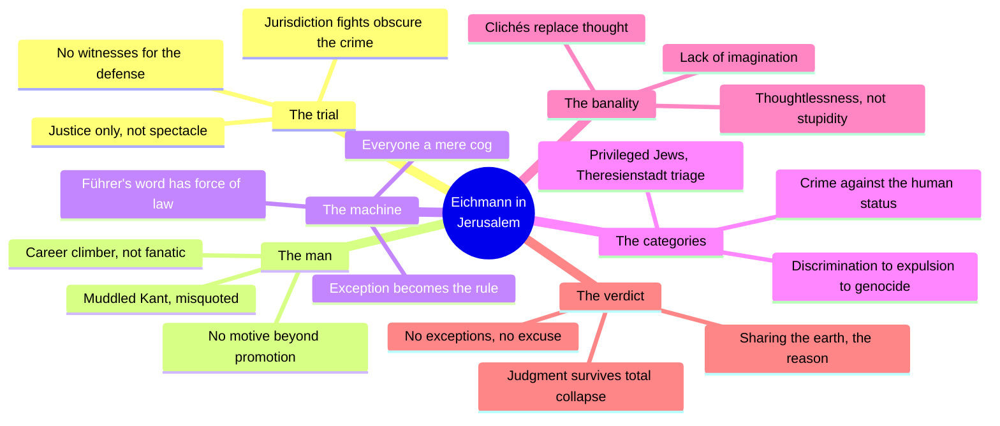
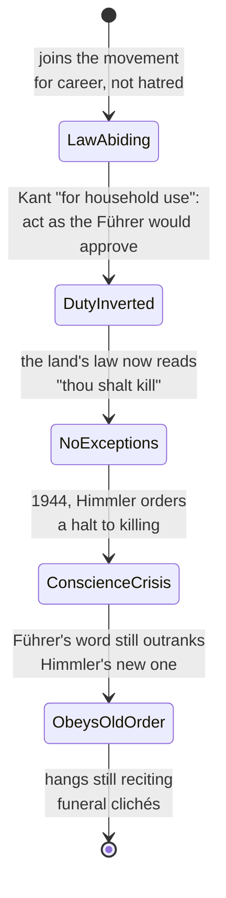
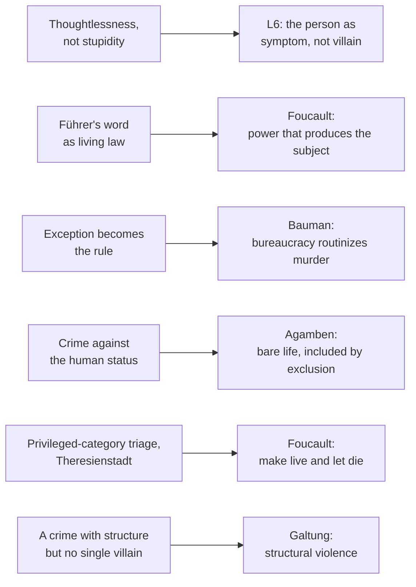

# BVX.1150 — Eichmann in Jerusalem: A Report on the Banality of Evil — Hannah Arendt (1963)
### Knowledge Entry — Distill

A trial report on Adolf Eichmann's 1961 Jerusalem prosecution that became the founding text of "the banality of evil"; read for BOLO 80's biopower controlling idea as the moral-claim counterpart to Foucault's mechanism, this entry covers Chapter VIII ("Duties of a Law-Abiding Citizen"), the Epilogue, and the Postscript, the three sections that carry the book's argument past reportage into theory.

## TABLE OF CONTENTS
- [Core Thesis](#1-core-thesis)
- [Mind Models](#2-mind-models)
- [Framework](#3-framework--structure)
- [Key Concepts](#4-key-concepts)
- [Heuristics](#5-heuristics--decision-rules)
- [Invariants](#6-invariants)
- [Pitfalls](#7-pitfalls--myths)
- [Application](#8-application)
- [Cross-References](#9-cross-references)
- [Provenance](#10-provenance--confidence)

---

## 1 · CORE THESIS

Eichmann committed history's worst crime not from hatred but from thoughtlessness: a law-abiding citizen who made the Führer's will his own moral law, then stopped noticing what he was doing. The banality of evil is not that evil is ordinary: it's that an administrative system can manufacture atrocity out of ordinary compliance, at any scale.

---

## 2 · MIND MODELS

*Required. Minimum two diagrams, maximum five.*

**Diagram 1 — the whole argument.**
Caption: *six threads (trial, man, machine, categories, banality, verdict) that the book keeps braided together; pull any one out and the argument collapses into either a courtroom drama or a monster story, neither of which Arendt is writing.*

**Diagram 2 — the central mechanism (a citizen's conscience, inverted by degrees).**
Caption: *duty does not disappear under a criminal state, it changes owners; the same capacity that once enforced "thou shalt not kill" gets repointed at enforcing its opposite, which is why Eichmann could describe himself as scrupulous.*

**Diagram 3 — mapped onto the Command's L6 biopower reading.**
Caption: *the trial supplies the human case study for terms the theorists built later; Arendt's own vocabulary and the biopower reading list name the same mechanisms from opposite ends.*

---

## 3 · FRAMEWORK / STRUCTURE

The book is a fifteen-chapter trial report (House of Justice through Judgment, Appeal, and Execution) that stays inside courtroom fact until its final pages, then opens into two sections that carry the theory: the Epilogue, where Arendt sets the trial report aside to argue the case's unresolved legal and moral questions in her own voice, and the Postscript, added for the revised edition to explain her method, answer the controversy the book provoked, and state directly what "the banality of evil" does and does not mean. Read in the brief's order, the three pieces build one throughline: Chapter VIII shows the mechanism inside one man (how law-abiding duty gets inverted), the Epilogue scales it up to the level of jurisprudence (why existing legal categories cannot hold this crime), and the Postscript scales it up again to the level of method and reception (why the phrase was misread on both sides and what it actually claims).

| Section | Register | Governing question |
|---|---|---|
| Ch. VIII, "Duties of a Law-Abiding Citizen" | Trial narrative, close on Eichmann's own testimony | How does a citizen convert an atrocity into a duty he owes the state? |
| Epilogue | Legal-philosophical argument, Arendt's own voice | Why did existing legal categories (acts of state, superior orders, universal jurisdiction) fail to hold this crime, and what would? |
| Postscript | Methodological note and reply to critics | What does "the banality of evil" actually mean, and what does the book refuse to claim? |

---

## 4 · KEY CONCEPTS

| Concept | What it is | Why it matters |
|---|---|---|
| **Banality of evil** | Evil produced by "sheer thoughtlessness," an inability to think from another's standpoint, in someone with no criminal motive at all | Stated against both misreadings the controversy produced ("we are all Eichmanns," "this insults the victims"); a lesson from one trial, not a general theory |
| **The household use of Kant** | Eichmann's distorted categorical imperative: act as if the Führer, knowing your action, would approve it, replacing Kant's demand that a man be his own legislator through reason | A totalitarian order recruits the vocabulary of duty and conscience against itself, rather than simply suspending morality |
| **Kadavergehorsam** ("obedience of corpses") | Eichmann's own term for the blind obedience the S.S. oath demanded, sworn to Hitler personally, not to Germany | An oath binding a person to a man's will instead of a law removes the ordinary check a constitutional oath provides |
| **Exception and rule, reversed** | In a normal order, crime is the exception the "manifestly unlawful" test catches; in a criminal state, crime is the rule, so the same test cannot function | The Postscript's central indictment: Israeli courts convicted Eichmann while relying on a test built for the opposite situation |
| **Administrative massacre** | Arendt's preferred term over "genocide," borrowed from British imperial usage: a killing organized by a state bureaucracy against a category of people, not a spontaneous or war-driven act | Separates this crime from "war crimes"; the selection principle can fall on any group, not only a historically hated one |
| **Crime against the human status** | Genocide is not an intensified crime against a nation but an attack on human diversity, the fact of distinct peoples | Explains why Arendt wants two courts at once: a Jewish court for the crime against the Jewish people, an international one for the crime against mankind |
| **Privileged-category triage** | Theresienstadt and the "prominent Jews" exemptions: mercy administered by category, not individuals, requiring a constant "thinning-out" to make room | Biopower's sorting work runs through categories before killing becomes visible; even exemption reinforces the rule it exempts from |
| **The cog theory, rejected** | Eichmann's defense that he was a replaceable functionary in a machine; Arendt's reply that a criminal court converts every cog back into a person the moment it tries him | Guilt cannot be averaged across a machine, only assigned to the humans running it |
| **Judgment without rules** | The few who resisted total complicity did so by their own judgment alone, since "no rules existed for the unprecedented," and were not distinguished by piety or old values | The invariant a resisting character needs: no manual, no external validation, only judgment itself |

---

## 5 · HEURISTICS & DECISION RULES

| Situation | Do this | Not this |
|---|---|---|
| Writing a system's perpetrator | Give them career motive, duty-language, and a genuine confusion about their own culpability | Write a sadist, a fanatic, or a monster who enjoys the harm |
| Dramatizing the system's law | Invert one ordinary moral rule into the system's positive law, and show characters obeying it as duty | Show the system as lawless chaos where anything goes |
| Showing who the system lets die | Build a visible triage of categories (privileged, exempted, anonymous) doing the sorting | Stage one villain personally choosing each victim |
| Naming the harm | Distinguish discrimination, expulsion, and extermination as escalating, separately nameable orders | Use "oppression" or "genocide" interchangeably for any harm the system does |
| Writing the perpetrator's inner life | Let their own words reveal an absence of imagination: clichés, career grievances, self-pity | Give them a monologue that explains and justifies the ideology coherently |
| Writing a character who resists the system | Let them judge by their own lights, explicitly without a rule or precedent to cite | Give them a manual, a mentor's rule, or an easy alternative already proven safe |
| Closing a story about mass complicity | Refuse both "we are all equally guilty" and "one monster explains it"; hold individual acts and system pressure as separate facts | Resolve it with a single explanatory villain or a diffuse, blameless collective |

---

## 6 · INVARIANTS

1. **An administrative system converts individual conscience into duty by making its own criminal order the rule, not the exception**, which is exactly what breaks the ordinary legal test for recognizing an unlawful command.
2. **Thoughtlessness, the inability to think from another's standpoint, can do more damage than malice**, and is not the same failure as stupidity.
3. **A crime against a people is, at the same moment, a crime against the human status**, the fact of human diversity itself, and the two require different courts to be fully judged.
4. **Bureaucratic distance is manufactured**, through language rules, chains of partial responsibility, and the cog theory, precisely so no single actor has to see the whole act.
5. **Categorization is where a biopower system does its sorting work** before violence becomes visible: privileged and ordinary, prominent and anonymous, exempted and expendable.
6. **Judgment does not require a rule to invoke.** It is most necessary exactly when the whole of a society has abandoned its own rules, and it does not correlate with prior piety or education.
7. **What has once become actual remains possible.** A crime's unprecedented nature at its first appearance does not prevent its return, especially wherever population scale and administrative or technical capacity combine.

---

## 7 · PITFALLS / MYTHS

- Believing the perpetrator must be a sadist, fanatic, or literary villain ("Iago," "Macbeth") for the crime to be evil; Eichmann was, in Arendt's own account, neither.
- Reading "the banality of evil" as "evil is commonplace or minor"; the Postscript refuses this explicitly, evil here means thoughtless, not ordinary or frequent.
- Collapsing into either "the whole nation is guilty" or "no one is guilty because everyone would have done the same"; Arendt rejects collective guilt directly, using Sodom and Gomorrah as the counter-case where guilt was in fact universal and still individual.
- Treating "superior orders" as a clean defense; the "manifestly unlawful" test that should catch it only functions where legality is the norm, which fails precisely in the cases that most need judging.
- Using genocide, crime against humanity, war crime, and crime against peace as interchangeable labels; the book insists on a taxonomy because each carries different legal consequences and a different moral claim.
- Assuming a trial (or a story) must answer "why did it have to be these people, this nation"; Arendt holds that question outside the proper business of judging one defendant's acts.

---

## 8 · APPLICATION

- **Spine level:** L6, theme as structure. Arendt never states "the banality of evil" as a thesis and then illustrates it; she assembles Eichmann's testimony, the trial's legal failures, and her own commentary until the phrase is forced out of the reader by accumulated fact, the same theme-as-structure method BVX.1154 (Le Guin, *Omelas*) uses in miniature.
- **12-layer character stack:** none assigned directly; this is a theme-shelf source, not a character-craft one. Its case study (a person becomes an instrument of atrocity through career motive and absent imagination, not conviction) is the load-bearing precedent for L6's "person as symptom, not villain" reading, keyed above under `thoughtlessness_as_mechanism`.
- **plot_systems:** contextual. The discrimination-to-expulsion-to-genocide ladder is a ready escalation structure for staging a biopower institution's violence in graduated, individually nameable steps rather than one undifferentiated horror.
- **Setting:** none directly, though the competing-office chaos around Eichmann in Hungary (three S.S. men, three chains of command, none coordinated) is a worked model of how an administrative institution actually distributes and blurs responsibility.

BOLO 80's research verdict pairs this book against Foucault directly: the mechanism (how a system produces the subjects who act) is Foucault's territory, and the moral claim (the perpetrator can be ordinary, even shallow, without the crime being any less total) is Arendt's, Bauman's, and Milgram's. This entry is the founding case for that second half, and it holds up better than most: unlike Milgram's lab or Zimbardo's now-discredited prison experiment, Arendt's account rests on trial testimony and cross-examination, closer in evidentiary weight to Browning's *Ordinary Men*. The needed counterweight, on record in the Command's biopower research, is Bettina Stangneth's later challenge that Eichmann performed thoughtlessness for the court while privately remaining a convinced ideologue; a story gains more from keeping both types available, true believer and banal clerk, than from picking one exclusively. Where the story needs the sorting mechanism itself rather than perpetrator psychology, the privileged-category triage (Theresienstadt, the "prominent Jews" exemptions) is the more direct case: administered mercy requiring a constant thinning-out to make room, Foucault's "make live and let die" running as bureaucratic procedure rather than battlefield choice.

---

## 9 · CROSS-REFERENCES

| Related entry | Relation |
|---|---|
| [[BVX.1149]] | Foucault, *Society Must Be Defended* — supplies the mechanism (biopower, the norm, state racism's two functions) this book supplies the human case study for; BOLO 80's own research verdict pairs the two directly, Foucault as the machine, Arendt as the person-as-symptom claim |
| [[BVX.1154]] | Le Guin, *The Ones Who Walk Away from Omelas* — the same theme-as-structure method in miniature (build the fact, withhold the verdict); that entry's Diagram 3 already pre-loads Agamben's bare life and Galtung's structural violence, both of which this book supplies the historical, non-fictional case for |

*Agamben (Homo Sacer, 1995), Bauman (Modernity and the Holocaust, 1989), Mbembe (Necropolitics, 2003/2019), Byung-Chul Han (Psychopolitics, 2014), and Zuboff (The Age of Surveillance Capitalism, 2019) are named in the Application section above for their conceptual bearing on this text but are not yet separately distilled in the library; Goffman (stigma, total institutions) bears on the privileged-category triage material but is likewise unheld. This entry's mappings are drawn against `_tools/bolostatus/work/80/RESEARCH-BIOPOWER.md`, pending each theorist's own BVX entry.*

---

## 10 · PROVENANCE & CONFIDENCE

Full text read for the three sections the brief named, in order: Chapter VIII, "Duties of a Law-Abiding Citizen" (complete), the Epilogue (complete), and the Postscript (complete). Also read for orientation, not distilled as Arendt's own argument: her 1964 "Note to the Reader," and two framing essays in this edition, an unsigned introduction and Bernard J. Bergen's "The Banality of Evil: Hannah Arendt and 'The Final Solution,'" used only to confirm the reading order and reception, never cited as her claims. The book's other twelve trial chapters were not separately read; their content appears above only where Chapter VIII, the Epilogue, or the Postscript cross-reference it (Theresienstadt, Hungary, the execution scene). `pdf_pages` is estimated from the plain-text source's word count, since the working file carries no page markers; no Zotero record was matched at distill time.

The L6 biopower keying in frontmatter `feeds:` and Diagram 3 is this distill's own synthesis against `_tools/bolostatus/work/80/RESEARCH-BIOPOWER.md` and `BIOPOWER-PLAIN.md`, which already name Arendt as the primary source for the "person as symptom" half of BOLO 80's controlling idea. The `id` is new and flagged `bvx_provisional: true` per this task's instruction; `spine: [L6]` is asserted per the same brief and is not yet separately ruled by Chief.

## META
- Template: BVX-LEARN-v4.0
- Source classification: full-text book excerpt, three sections (Ch. VIII, Epilogue, Postscript) read in full per the assigned reading order; remaining twelve chapters not separately read
- Created / Updated: 2026-09-29
