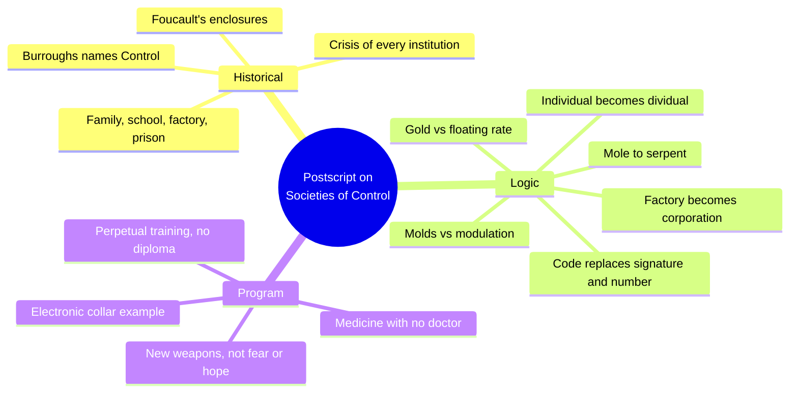
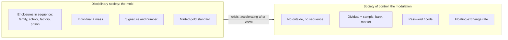
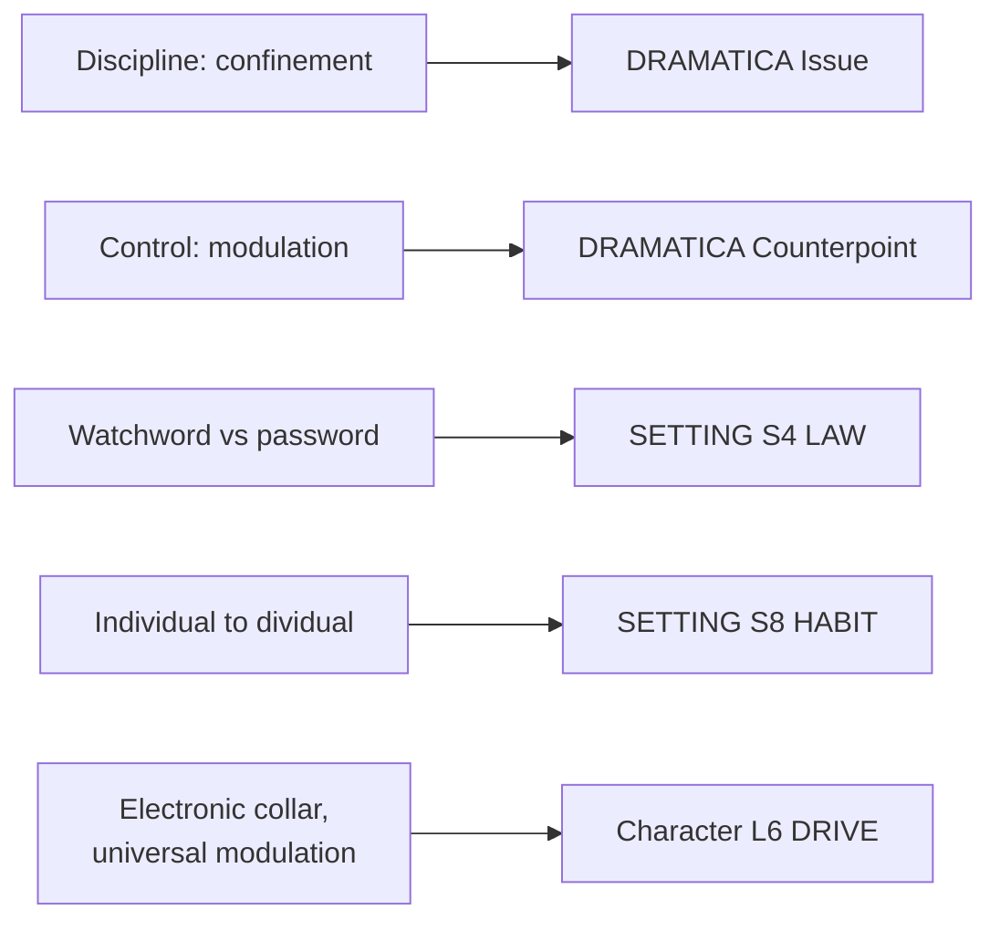

# BVX.1151 — Postscript on the Societies of Control — Gilles Deleuze (1992)
### Knowledge Entry — Distill

A five-page coda to Foucault, read for BOLO 80's theme system: the essay every biopower reading list treats as the closest one-line statement of a controlling idea about power over life, and the theme wave's leading candidate for an L6 Issue/Counterpoint pair.

## TABLE OF CONTENTS
- [Core Thesis](#1-core-thesis)
- [Mind Models](#2-mind-models)
- [Framework](#3-framework--structure)
- [Key Concepts](#4-key-concepts)
- [Heuristics](#5-heuristics--decision-rules)
- [Invariants](#6-invariants)
- [Pitfalls](#7-pitfalls--myths)
- [Application](#8-application)
- [Cross-References](#9-cross-references)
- [Provenance](#10-provenance--confidence)

---

## 1 · CORE THESIS

Disciplinary societies mold individuals through sequential enclosures (family, school, factory, prison), each a discrete mold with its own law. Societies of control instead modulate continuously and everywhere, through codes and numbers, with no outside and no finish line. The disciplined subject graduates from one institution to the next; the controlled "dividual" is never finished, only endlessly recalibrated.

---

## 2 · MIND MODELS

*Required. Minimum two diagrams, maximum five.*

**Diagram 1 — the whole argument.**
Caption: *the essay's own three-part contents (Historical, Logic, Program) run from naming the shift, to its governing logic, to what a socio-technical study of it would have to look like.*

**Diagram 2 — the central mechanism (discipline's mold set against control's modulation).**
Caption: *every paired term in the essay sorts into one of these two columns — the essay's real content is this table, run four times over (space, subject, money, machine), not a chronology.*

**Diagram 3 — mapped onto the Command's systems.**
Caption: *the essay's own pair (confinement vs modulation) drops straight into a DRAMATICA Issue/Counterpoint slot, and its two sharpest devices key SETTING's law and habit layers directly.*

---

## 3 · FRAMEWORK / STRUCTURE

Three short sections, exactly as the essay's own table of contents states them:

| Section | Governing move |
|---|---|
| **1. Historical** | Places disciplinary societies (Foucault) in the 18th–19th centuries, peaking early in the 20th, and names their present crisis: every enclosed institution — family, school, hospital, factory, prison — is being administered its "last rites." |
| **2. Logic** | States the mechanism twice over: once as image (mold vs modulation, mole vs serpent), once as a set of paired terms run across space, the subject, money, and machines. |
| **3. Program** | Refuses to be science fiction: sketches a real, already-starting substitution — electronic collars, doctorless medicine, corporate schooling — and ends on the one open question, whether resistance can find "new weapons." |

The essay is bookended by refusal of an easy read: it opens declining to say which regime is "toughest or most tolerable" (§1) and closes declining to say resistance is coming or not (§3) — the argument stays a diagnosis, not a verdict, until the reader supplies one.

---

## 4 · KEY CONCEPTS

| Concept | What it is | Why it matters |
|---|---|---|
| **Disciplinary society (Foucault)** | Power organized as enclosed spaces, each with its own law, passed through sequentially: family, school, barracks, factory, sometimes hospital, at the limit the prison | The default shape most "oppressive system" antagonists already take: one building, one rule, an outside that exists |
| **Society of control** | Power organized as continuous, unbounded modulation: no sequence to finish, no outside to reach | A second, less visible antagonist shape; arguably no less total for having no walls |
| **Mold vs. modulation** | Discipline casts a fixed shape once (a mold); control is a self-deforming cast, changing "from one moment to the other," or a sieve whose mesh itself keeps changing | The essay's central image; a control-society plot must dramatize continuous adjustment, not a single confinement to escape |
| **Individual / mass vs. dividual / sample** | Discipline counts whole, named persons and masses them together; control fragments each person into divisible, tradable data and sorts them into samples, markets, banks | Names how a control-society character's identity gets built and manipulated: in pieces, not as one bounded self |
| **Signature and number vs. code** | Discipline's two poles are a name (the signature) and a rank (the number); control uses one thing, a code, that grants or refuses | A compact device for staging authority: a scene can turn on a code accepted or denied, needing no further explanation |
| **Watchword vs. password** | A watchword is an instruction, to be understood, obeyed, or resisted; a password just works or doesn't | Distinguishes rule-following drama (discipline) from access drama (control) |
| **Mole vs. serpent** | Discipline's subject is "a discontinuous producer of energy," burrowing from one enclosure to the next; control's subject is "undulatory, in orbit, in a continuous network" | An embodied image for how a control-society character moves: never arriving, always in transit ("surfing has already replaced the older sports") |
| **Minted gold vs. floating exchange rate** | Discipline's money locks to a fixed numerical standard; control's money floats, "modulated according to a rate established by a set of standard currencies" | Names why a reward or wage system in a control-society story should read as unstable by design, not as corruption of a fair one |
| **Factory vs. corporation** | The factory concentrates workers under one boss's surveilling eye, as a single body; the corporation is "a spirit, a gas," pitting individuals against each other as "healthy... emulation" | A located-vs-diffuse contrast for where a story can physically stage its antagonist — and a warning that control has no office to storm |
| **Man enclosed vs. man in debt** | Discipline's subject is confined, for a term; control's subject owes, without a stated term | Reframes what a control-society character is trying to get free of: not a wall to walk through, but a balance that never closes |

---

## 5 · HEURISTICS & DECISION RULES

| Situation | Do this | Not this |
|---|---|---|
| Writing an oppressive institution as antagonist | Decide whether it operates by enclosure (one place, one rule, an outside exists) or by modulation (everywhere, continuous, no outside) | Default to one Big Building and call it "the System" without deciding which kind it is |
| Staging a character's "win" against the system | For a control-society antagonist, end on a code accepted, a rate that moves, or a recalibration granted — not a gate walked through | Give a control-society plot a disciplinary-society ending: the doors open, and it's called freedom |
| Building the antagonist's reward or punishment mechanism | Make it continuous and shifting (scores, rankings, contests) if the theme is control | Use one fixed grade or sentence the character passes or serves, once |
| A character reads as highly self-motivated and cooperative | Consider writing that enthusiasm itself as control's most effective form, not as proof the character is free | Treat "motivated" as automatically healthy or as evidence of agency |
| Designing an access or surveillance device for a scene | Write it as a password/code: it works or it doesn't, no explanation owed | Write institutional gatekeeping as a rule a character must interpret, argue with, or defy |
| Showing how the antagonist divides people | Show it setting peers against each other and each person against their own past and future self (constant re-ranking) | Show the antagonist dividing people only into a clean in-group and out-group |
| Deciding what a controlled character owes the system | Write a debt: open-ended, revisable, never quite closed | Give the character a countdown to a stated release date |

---

## 6 · INVARIANTS

1. Disciplinary power concentrates people in enclosed spaces, each governed by its own law, and moves them sequentially through those spaces; control power has no outside and no sequence to complete, only continuous variation.
2. A mold fixes a shape once; a modulation self-deforms from one instant to the next. Discipline is a casting; control is a sieve whose mesh keeps changing.
3. Discipline pairs a signature (naming the individual) with a number (placing them in a mass); control replaces both with a code — a password that grants or refuses access, never a watchword to be understood.
4. The individual under discipline becomes a "dividual" under control: divisible, sample-able, and tradable in pieces, no longer counted as one whole unit.
5. Each social form matches a machine type: simple machines for sovereignty, energy machines (entropy, sabotage) for discipline, computers (jamming, piracy) for control — the machines express the social form, they do not cause it.
6. The social-form shift rests on a shift in capitalism itself, from concentrated production and ownership (the factory) to selling the product and buying stock (marketing as the corporation's "soul").
7. Resistance calibrated to discipline — mass mobilization against one factory, one boss — does not automatically transfer to control; the essay explicitly calls for "new weapons," not a reapplication of the old ones.
8. Control does not make oppression milder by removing enclosure. Both liberating and enslaving forces run through every regime; the essay refuses to rank them.

---

## 7 · PITFALLS / MYTHS

- Reading "society of control" as simply "discipline, but gentler" — the essay states control can be "equal to the harshest of confinements," only organized differently.
- Assuming a character freed from a discipline-style institution (out of school, off parole) has thereby escaped control — modulation has no exit gate to walk through.
- Writing institutional enthusiasm and cooperation as evidence of freedom, rather than as control's most effective form (the essay's own example: young people who "boast of being motivated").
- Staging the antagonist as a location (an office, a building) when the essay's whole point is that control disperses without a center: "the corporation is a spirit, a gas."
- Porting factory-era resistance tactics (the strike, the picket line, one union against one boss) unmodified into a control-society plot and expecting them to work the same way.
- Treating a "code" as a puzzle a clever character solves once, rather than as a continuous, automatic grant-or-refuse that gets reissued.

---

## 8 · APPLICATION

- **Spine level:** L6 — the essay is a controlling-idea candidate in the strict Egri/McKee sense: one compressed claim (confinement gives way to modulation; power over life is never finished) that a whole story could be built to argue, not a background fact about a setting.
- **12-layer character stack:** supporting on **L6 DRIVE** (a want that is perpetually recalibrated rather than banked toward completion — `perpetual_recalibration`, proposed above) and contextual on **L10 SHADOW** (the system dividing a person from their own past/future self via constant re-ranking — `dividual_self_division`).
- **plot_systems:** a strong candidate antagonist-system shape once `04_PLOT_SYSTEMS/` reopens for theme work: an antagonist with no address, whose pressure is continuous modulation rather than a located obstacle, cannot be beaten by removing one boss or opening one door; a story built on this Issue needs an ending shaped like a code granted, not a gate opened.
- **Setting:** primary on **S4 LAW** (watchword vs. password as two authorable textures for a setting's rule-system) and **S8 HABIT** (belonging by coded data-position, "dividual," rather than by admission to one enclosing institution).

Read against BOLO 80's own working claim on the Command's story universe, the essay sharpens rather than replaces Foucault as the controlling-idea candidate. The system that "forecasts" a character and continuously readjusts around her is closer to Deleuze's modulation than to Foucault's enclosure: an antagonist that never has to lock a door, because it can recalibrate faster than she can act, is a control-society antagonist, not a disciplinary one. That reframes the Judgment side of a `cost_and_meaning` invariant too: if the antagonist has no outside to be released from, "winning the argument" cannot be dramatized as escape. It has to be dramatized as the one thing modulation cannot fully absorb — a meaning that survives being endlessly recalculated around. The essay does not supply that meaning; it only proves the antagonist shape that makes escape the wrong ending to write.

---

## 9 · CROSS-REFERENCES

| Related entry | Relation |
|---|---|
| [[BVX.0089]] | Dramatica — supplies the Issue/Counterpoint machinery this essay's confinement/modulation pair is proposed to fill; the storyform this feeds must exist before the pair can be tested at Problem/Solution and Outcome/Judgment resolution |
| [[BVX.1123]] | Egri, *The Art of Dramatic Writing* — the premise/controlling-idea lineage this essay's own one-line claim (discipline gives way to control) is written in the same compressed form as |
| [[BVX.0175]] | McKee, *Story* — the Gap mechanism (a character's action provokes a disproportionate world-reaction) is a scene-level engine; this essay's "corporation runs through each, dividing each within" is a candidate source of that reaction at the antagonist-system level |

None of this essay's direct interlocutors are yet held or distilled in the library (BOLO 80's held-check found 0 of 20 biopower texts on shelf, 2026-09-24). For the record, since the theme brief calls for naming them: Foucault (*Discipline and Punish*, *The History of Sexuality* Vol. 1, *Society Must Be Defended*) is the disciplinary/biopower baseline this essay explicitly extends; Agamben (*Homo Sacer*) pushes further into who gets excluded from protection entirely; Mbembe (*Necropolitics*) pushes further still, to who a system treats as already dead; Han (*Psychopolitics*) is the direct heir of this essay's "perpetual training" and "motivated" subject, arguing the neoliberal subject exploits itself without an external enforcer; Arendt, Bauman, Goffman, and Zuboff (*The Age of Surveillance Capitalism*) all sit adjacent — Zuboff's "dividual"-adjacent data-subject is the clearest contemporary echo of this essay's code-and-dividual logic, three decades on. All are acquisition candidates, not yet cross-referenceable by id.

---

## 10 · PROVENANCE & CONFIDENCE

Full text, read whole (the essay is five pages; nothing was sampled or skipped). Text supplied as a plain-text file for this distill, not sourced from a Zotero-held PDF — BOLO 80's 2026-09-24 held-check found no legal free copy of this essay anywhere (every mirror checked, including the Anarchist Library copy this text file itself carries a colophon from, is unauthorized); the library does not yet hold a canonical copy under a `zotero_key`.

Citation given for this entry (`October`, vol. 59, Winter 1992, pp. 3–7, trans. Martin Joughin) is the standard English-language citation for Deleuze's essay; the text file read carries the French original's own date (May 1990, first published in *L'Autre journal*, no. 1) in its title block, consistent with the essay being written in 1990 and appearing in this English translation in 1992. Both dates describe the same essay; `year: 1992` here follows the citation given for this distill.

No numeric or empirical claims appear in this distill; the source is itself a short theoretical essay, not a study. The frontmatter's DRAMATICA and SETTING keying is this distiller's synthesis, proposed against BOLO 80's open theme-system work and the existing SETTING SLICE (`ssot_03_setting_system.md`), not a claim the essay itself makes in those terms.

## META
- Template: BVX-LEARN-v4.0
- Source classification: full-text short essay, complete read
- Created / Updated: 2026-09-29
