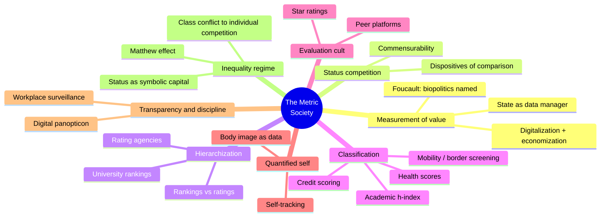
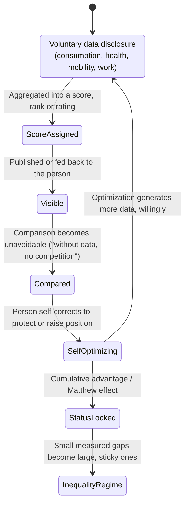
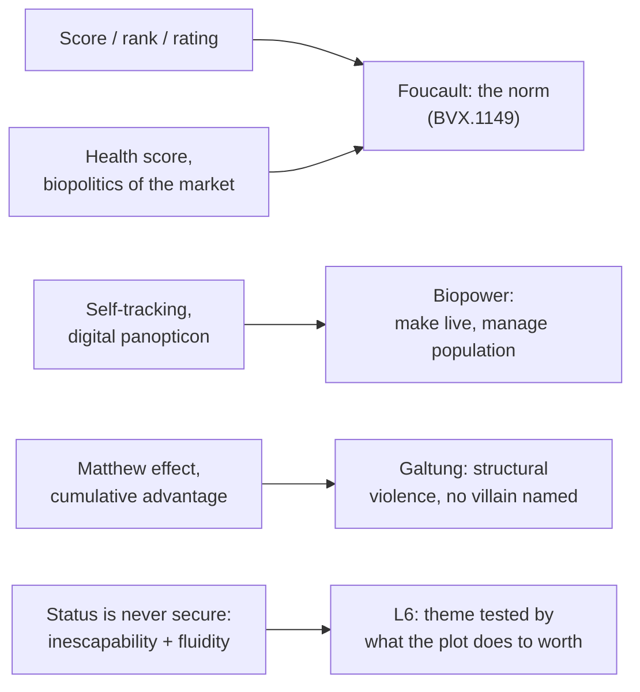

# BVX.1152 — The Metric Society: On the Quantification of the Social — Steffen Mau (2019)

### Knowledge Entry — Distill

A sociologist's empirical survey of how scores, rankings, ratings and self-tracking became the ordinary machinery of social worth; read for BOLO 80, the theme system, as the mechanism-level companion to Foucault's biopower — the concrete institutions and devices through which "power that manages life" actually operates today.

## TABLE OF CONTENTS
- [Core Thesis](#1-core-thesis)
- [Mind Models](#2-mind-models)
- [Framework](#3-framework--structure)
- [Key Concepts](#4-key-concepts)
- [Heuristics](#5-heuristics--decision-rules)
- [Invariants](#6-invariants)
- [Pitfalls](#7-pitfalls--myths)
- [Application](#8-application)
- [Cross-References](#9-cross-references)
- [Provenance](#10-provenance--confidence)

---

## 1 · CORE THESIS

Quantification manufactures social worth: turning quality into number converts comparison into competition, and competition into a self-administered hierarchy. Scores, ratings and screens recruit each person into measuring, ranking and disciplining themselves — Mau's own phrase, a "biopolitics of the market" — so the metric society governs life with no visible sovereign.

---

## 2 · MIND MODELS

*Required. Minimum two diagrams, maximum five.*

**Diagram 1 — the whole argument.**
Caption: *ten chapters sort into one escalating argument — comparison creates competition, competition demands data, and data-driven status becomes a new inequality regime with no single hand on the lever.*

**Diagram 2 — the central mechanism (a state change: data becomes self-rule).**
Caption: *the loop never needs a warden — once status data exist and are visible, the measured person supplies the discipline the system used to have to impose.*

**Diagram 3 — mapped onto BOLO 80's biopower reading and the Command's L6.**
Caption: *Mau supplies the machinery the theory only names — where Foucault gives the argument and Le Guin gives the story shape, this book gives the actual devices a Sync-style system would run.*

---

## 3 · FRAMEWORK / STRUCTURE

Ten chapters run one accumulating argument: number re-creates social worth, and worth re-creates itself as competition.

| Chapter | Device family | Governing move |
|---|---|---|
| 1. The Measurement of Social Value | Statehood, markets, digitalization | Names quantification's engines (state statistics, market bookkeeping, now datafication); cites Foucault's biopolitics as the surveillance reading of the same history |
| 2. Status Competition and the Power of Numbers | The "dispositive of comparison" | Comparison is anthropological; data-driven comparison universalizes and globalizes who can be compared to whom |
| 3. Hierarchization: Rankings and Ratings | University rankings, rating agencies | Ranking (exclusive places) versus rating (unlimited scores); both are "objectivity generators" that create the hierarchy they claim only to expose |
| 4. Classification: Scoring and Screening | Credit, health, mobility, academic scores | Individual-level worth assignment; names "biopolitics of the market," recruits body, health and border-crossing into data-based sorting |
| 5. The Evaluation Cult: Stars and Points | Satisfaction surveys, peer ratings | Feedback turns every customer, patient or guest into an unpaid supervisor of the person being rated |
| 6. The Quantified Self: Charts and Graphs | Wearables, self-tracking | Voluntary self-measurement produces the "entrepreneurial self," data as markers of an optimization culture |
| 9. Transparency and Discipline | Workplace surveillance, sousveillance | Total transparency and total control point the same direction; quotes Han's "digital panopticon" directly |
| 10. The Inequality Regime of Quantification | Symbolic capital, cumulative advantage | Closing argument: data-driven status is a new inequality regime, switching class conflict into individual competition |

(Chapters 7-8, "The Power of Nomination" and "Risks and Side-Effects," were read at table-of-contents depth only, per the read order; they cover algorithmic authority and reactive gaming of indicators, noted here for completeness.)

---

## 4 · KEY CONCEPTS

| Concept | What it is | Why it matters |
|---|---|---|
| **The dispositive of comparison** | The apparatus (data, indicators, monitoring infrastructure) that makes comparison universal rather than local and occasional | "Without data, in a word, there is no competition" — the single sentence the whole book is built to prove |
| **Ranking vs. rating** | Ranking assigns exclusive ordinal places (only one can be first); rating assigns unlimited graded scores (everyone can be an "A") | Different technical shapes produce different social pressures — ranking guarantees losers, rating only guarantees a ceiling |
| **Screening vs. scoring** | Screening sorts a pool into included/excluded (binary selection); scoring arranges people along a fine-grained continuum of worth | The same worth-assignment logic at two resolutions; screening excludes, scoring grades everyone who remains |
| **Biopolitics of the market** | Health scores, wearables and insurance tariffs turn a body into continuously monitored, commercially priced data | Mau's direct naming of a market-run biopower: "less and less a private matter," health becomes an economic precondition, managed by discount and incentive rather than by decree |
| **The digital panopticon (Han, quoted)** | "The digitalized, networked subject is a panopticon of itself... there is no difference between guard and inmate" | Self-tracking is simultaneously self-improvement and third-party surveillance data; the watched person volunteers to be the guard |
| **The regime of averages / the norm** | Nearly every evaluative statement is read against a real or notional average; "below-average" and "above-average" carry built-in moral charge | Averages are not neutral midpoints — they are targets that convert an ordinary result into a felt failure |
| **Status as symbolic capital / "übercapital"** | Status data (scores, ratings, rankings) function like Bourdieu's symbolic capital: convertible into economic, social and political advantage | Explains why people chase scores that have no direct payoff (h-index, friend counts) — the number itself is currency |
| **The Matthew effect / cumulative advantage** | "For whosoever hath, to him shall be given" — early measured success compounds into disproportionate future reputational gain | Decouples performance from reward; the inequality regime is self-reinforcing without any single actor deciding it should be |
| **Inescapability and status fluidity** | Data permanence locks a person to their past (a "data biography"), while constant re-evaluation means no position is ever secure | The double bind Mau names as the book's real inequality mechanism: shackled to your past, yet never allowed to rest on it |
| **From class conflict to individual competition** | The metric society's inequality regime pits data-defined individuals against each other rather than organizing them into classes with shared interests | The political payoff: universal competitive comparison structurally prevents the "class for itself" that collective resistance requires |

---

## 5 · HEURISTICS & DECISION RULES

| Situation | Do this | Not this |
|---|---|---|
| Building a biopower system's day-to-day texture | Give it visible, mundane devices — a health score, a star rating, a credit-style number, an h-index analog — that people check obsessively | Write an abstract, unnamed "control" with no concrete artifact anyone can point to |
| Staging why characters comply without being forced | Show status data functioning as symbolic capital they want, not just a threat they fear | Make compliance purely coerced; Mau's whole point is that most participation is voluntary and even eager |
| Writing the system's enforcers | Let them administer scores sincerely, believing they are measuring real merit or real health, not villainy | Write scoring officials as cartoonishly punitive; the mechanism argues something only if it reads as objective and fair to the people running it |
| Showing inequality without a villain | Use cumulative advantage: let one early, small, plausible measured difference compound over the story into a large gap | Trace the gap to one character's deliberate sabotage — that turns structure into a whodunit |
| Giving a character a way to resist | Let them refuse to disclose data (self-exclusion) and show the real cost of opting out (lost access, lost standing) | Let opting out be free or without consequence; the book insists withholding data always has a price |
| Writing a self-tracking or "optimization" subplot | Frame it as the character's own ambition and self-authored discipline, not an order from above | Have a supervisor command the tracking; the digital-panopticon point is that no one has to order it |
| Ending a status arc | Show status as never fully secure — even a "win" invites the next comparison | Let a character reach a final, stable rank and stop there; the book's whole argument is that the game never ends |

---

## 6 · INVARIANTS

1. **Without data, there is no competition.** Comparison is universal to human life, but data-based comparison is what converts occasional comparison into constant, unavoidable competition.
2. **A ranking or rating does not merely reveal a hierarchy; it manufactures one.** Quantitative representations "do not create the social world, they re-create it" — the measuring act is generative, not passive.
3. **Screening and scoring are the same worth-logic at different resolutions.** One sorts by inclusion/exclusion, the other grades by degree; both convert a person into a number that stands in for them.
4. **Self-tracking collapses the distance between guard and inmate.** Once a norm is internalized as a personal optimization goal, external enforcement becomes unnecessary.
5. **Status secured by data is never secure.** Permanence (a data biography that cannot be erased) and fluidity (constant re-evaluation) operate together, not as opposites — both keep the person working at their status indefinitely.
6. **Small measured differences compound into large ones automatically.** The Matthew effect means an inequality regime can deepen without any single actor intending it to.
7. **Biopower is not only a state technology; it is also a market one.** Health scores, insurance tariffs and wellness programs manage bodies and populations through discount and consent, not through decree.

---

## 7 · PITFALLS / MYTHS

- Treating a score or rating as neutral description — the book's central warning is that numbers carry "inherent preconceptions as to what is relevant, valuable or authoritative," never a view from nowhere.
- Assuming resistance means simply refusing to participate; self-exclusion from a ranking or a data system carries real costs (lost credit, lost visibility, lost mobility), so refusal is rarely free.
- Writing surveillance as always external and hostile — most of the book's evidence is about *voluntary*, even eager, self-disclosure and self-tracking, not coerced monitoring.
- Confusing a system that measures with a system that lies — Mau is explicit that the danger is not inaccurate data but the unquestioned authority granted to accurate-seeming data ("data never lie" is the trap, not the fact).
- Assuming a data-driven meritocracy is fairer than the hierarchies it replaces — cumulative advantage shows measured "merit" and actual reward decouple over time, entrenching rather than flattening inequality.
- Reaching only for a state actor (a ministry, a police force) as the biopower antagonist — insurers, credit bureaus, universities and dating platforms run the same mechanism as private, market-based institutions.

---

## 8 · APPLICATION

- **Spine level:** L6 — the controlling idea's argument gets its concrete devices here: a Sync-style system is not an abstraction once it has a named score, a visible rank, and a self-tracking ritual attached to it
- **12-layer character stack:** none directly by layer number; the book's mechanism (measure -> assign value -> hierarchize -> self-administer) is the plot-and-institution-level device that makes an L6 controlling idea visible in the world, the same relationship BVX.1149 draws between the racism mechanism and the character stack
- **plot_systems:** primary candidate once a plot-systems layer opens for BOLO 77/81 — the state-diagram loop in Diagram 2 (data generated -> scored -> compared -> self-optimized -> locked in) is a ready-made engine for any subplot where a character's status rises or falls without anyone forcing them
- **Setting:** contextual — the four device families (rankings/ratings, scoring/screening, the evaluation cult, self-tracking) are a stocked menu for building the visible apparatus (a school's Sync board, a health index, a peer-review star system) that BVX.1149's Application section calls the most portable device from the theory

Read against BOLO 80's controlling idea, this book is the empirical floor under Foucault's theory and Le Guin's structural demonstration. Where BVX.1149 supplies the argument (a life-administering power needs a justified exception to kill) and BVX.1154 supplies the narrative shape (state a bargain, hold it constant, decline to resolve it), Mau supplies the actual furniture: a credit score, a health index, an h-index, a star rating, a step count. The book's single most useful sentence for a Sync-style system is its account of self-tracking: the measured person becomes their own supervisor, so no scene needs a warden standing over a screen for the biopower argument to be visibly running. Its second most useful idea is the Matthew effect — a way to let inequality deepen across the story's timeline through ordinary compounding, not through any character's malice, which is the exact "structural, not personal" quality BOLO 80's controlling idea needs its antagonist system to have.

---

## 9 · CROSS-REFERENCES

| Related entry | Relation |
|---|---|
| [[BVX.1149]] | Foucault, *Society Must Be Defended* — the theoretical parent; Mau's "norm," self-tracking and market-run health scoring are the empirical instances of the norm-as-hinge and biopower mechanisms BVX.1149 names at the lecture level |
| [[BVX.1154]] | Le Guin, *The Ones Who Walk Away from Omelas* — the narrative-structure sibling; Mau's inescapability/status-fluidity double bind is a real-world version of Omelas's bargain, a cost that is total and a status that is never resolved, restated as sociology instead of parable |
| [[BVX.0054]] | Lyons, *Anatomy of a Premise Line* — the L6 want/need split this entry keys to; the metric society's status seeker (want: a higher score) versus the unmeasurable self (need: worth outside the number) is a direct instance of Lyons's moral-component engine |
| Byung-Chul Han, *Psychopolitics* / *The Transparency Society* (not yet in the library) | Directly quoted twice in this text (digital panopticon, p.153; psychopolitics adjacent framing, p.19) — the next natural acquisition, since Mau's self-tracking chapter is effectively a field report on Han's thesis |
| Shoshana Zuboff, *The Age of Surveillance Capitalism* (not yet in the library) | Cited implicitly through the book's account of data brokers (Acxiom) and prediction-driven credit/insurance markets; extends Mau's market-side biopower into an explicitly corporate, prediction-and-behavior-shaping register |
| Pierre Bourdieu (not yet in the library) | Symbolic capital and "distinction" are load-bearing, repeatedly cited concepts throughout; Fourcade and Healy's "übercapital" (ch.10) is an explicit extension of Bourdieu's own categories into data-based worth |
| Robert K. Merton (not yet in the library) | Source of the Matthew effect (ch.10), the book's mechanism for inequality that compounds without a villain — a sociological parallel to Galtung's structural violence named in `_tools/bolostatus/work/80/BIOPOWER-PLAIN.md` |

---

## 10 · PROVENANCE & CONFIDENCE

Full text, pdftotext extraction (~196pp including bibliography and index). Read in full per the brief's order: the Introduction; Chapter 1, "The Measurement of Social Value" (through its Foucault-biopolitics passage and the digitalization/economization section); Chapter 2, "Status Competition and the Power of Numbers," in full; Chapter 3, "Hierarchization: Rankings and Ratings," in full; Chapter 4, "Classification: Scoring and Screening," in full (credit scoring, quantified health status, mobility value, academic status markers, social worth investigations); Chapter 9, "Transparency and Discipline," in full (normative pressure, the power of feedback, workplace surveillance, the new tariff systems, self- and external surveillance, the regime of averages); and Chapter 10, "The Inequality Regime of Quantification," the closing chapter, in full. Chapters 5 ("The Evaluation Cult"), 6 ("The Quantified Self," partially covered via chapter 9's overlap on body image and self-tracking), 7 ("The Power of Nomination") and 8 ("Risks and Side-Effects") were read only via the table of contents and the Introduction's own chapter-by-chapter summary; their content (peer-to-peer ratings, wearables, algorithmic authority, reactive gaming of indicators) is reported at that shallower depth in the Framework section and should be checked against the source directly for finer claims.

The `feeds:` keying to L6 and the contextual SETTING feed are this distill's synthesis for BOLO 80: Mau's text has no character-system or story-spine vocabulary, so the mapping (valorization as a theme engine, the self-administered panopticon, biopolitics of the market, cumulative advantage) is this entry's translation of the book's sociology into the Command's terms, following the same synthesis method BVX.1149 and BVX.1154 use for the same reading list. The `id` is new and flagged `bvx_provisional: true` per this task's instruction.

## META
- Template: BVX-LEARN-v4.0
- Source classification: full-text, deep extraction on 6 of 10 chapters (Introduction, 1, 2, 3, 4, 9, 10 — seven sections at full depth); TOC/description-depth on chapters 5, 6, 7, 8
- Created / Updated: 2026-09-29
