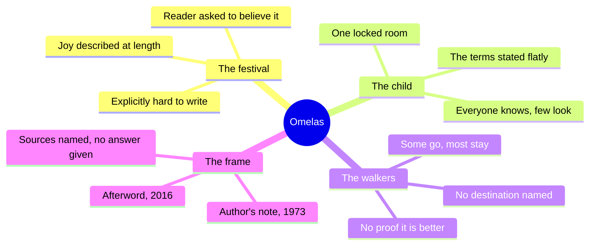
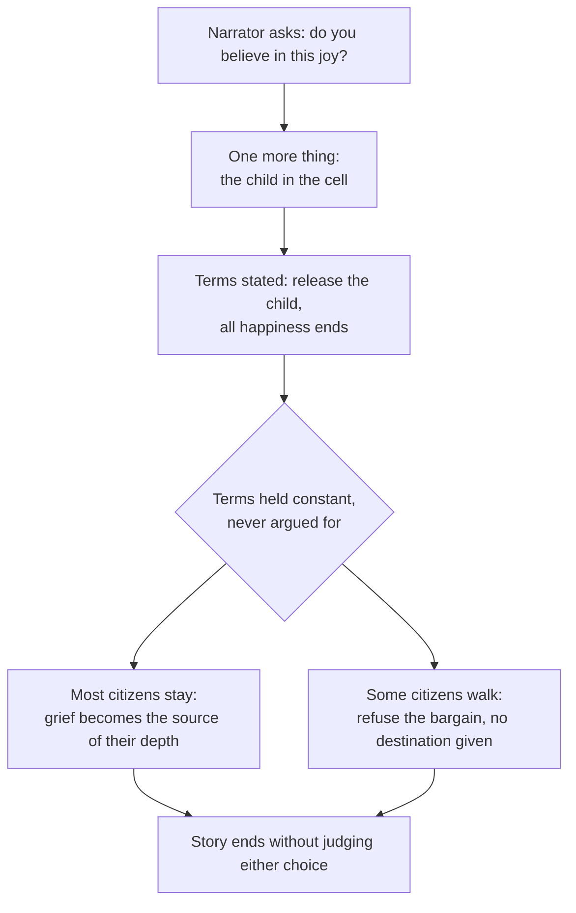
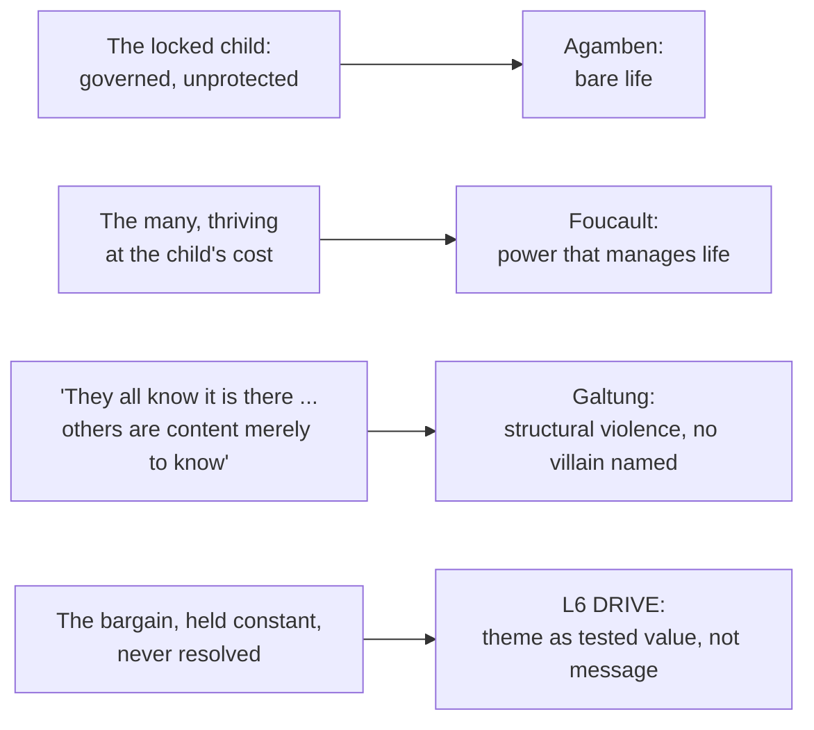

# BVX.1154 — The Ones Who Walk Away from Omelas — Ursula K. Le Guin (1973)

### Knowledge Entry — Distill

An eight-page short story built as a single argument in three structural moves (the festival, the child, the walkers); read with Le Guin's 2016 afterword and her original 1973 author's note, both explaining the story's one deliberate choice: state the bargain, refuse to answer it.

## TABLE OF CONTENTS
- [Core Thesis](#1-core-thesis)
- [Mind Models](#2-mind-models)
- [Framework](#3-framework--structure)
- [Key Concepts](#4-key-concepts)
- [Heuristics](#5-heuristics--decision-rules)
- [Invariants](#6-invariants)
- [Pitfalls](#7-pitfalls--myths)
- [Application](#8-application)
- [Cross-References](#9-cross-references)
- [Provenance](#10-provenance--confidence)

---

## 1 · CORE THESIS

A story can argue a theme by building one bargain (a city's total happiness, purchased with one child's total suffering) and then refusing to resolve it. The structure is the argument: description proves the price is real, the child's cell proves the cost is total, and the walkers prove refusal is possible but answers nothing.

---

## 2 · MIND MODELS

*Required. Minimum two diagrams, maximum five.*

**Diagram 1 — the whole argument.**
Caption: *three structural blocks, not three plot beats, each one doing a different argumentative job; the story is an essay wearing a narrator's voice.*

**Diagram 2 — the central mechanism (a bargain, stated then held constant).**
Caption: *the story never varies the bargain's terms; every reader response (belief, horror, walking) happens on one side of a fixed trade that the text itself will not move.*

**Diagram 3 — mapped onto BOLO 80's biopower reading and the Command's L6.**
Caption: *Omelas pre-loads three of the biopower reading list's own terms into one image, decades before the theorists named them.*

---

## 3 · FRAMEWORK / STRUCTURE

The story has no chapters or scenes in the conventional sense; it is built as an argument in four moves, bookended by two authorial notes written decades apart:

| Move | Content | Argumentative job |
|---|---|---|
| The direct address | Narrator repeatedly asks "Do you believe?", offers optional details (technology, drugs, orgies, "as you like it") | Forces the reader to co-author the joy, so the later cost lands on a happiness the reader built, not one merely described to them |
| The festival | Bells, horses, the flute-player, a city with no king, no slaves, no police, no army | Establishes the good is real and specific, not vague utopian filler, so the trade to come has genuine weight on both sides |
| The child | One locked room, described in exact physical detail, the terms stated flatly ("this is the rule of this game") | The single load-bearing fact; withholding it until here (never explaining or excusing it) is the story's whole structural device |
| The walkers | A minority leave, alone, toward an undescribed destination, "it is possible that it does not exist" | Denies the reader a satisfying resolution on either side; refusal is offered as a response, not as an answer |
| Le Guin's 1973 note | Names William James's "lost soul" passage as the direct source, calls the story "variations on a theme" | Frames the story as a philosophical thought experiment first, fiction second |
| Le Guin's 2016 afterword | Adds the Dostoevsky source (Ivan Karamazov's tortured child, in Brothers Karamazov), states "it isn't an answer, it's a question," quotes a reader's letter reframing Omelas as the world we already live in | Explicitly forecloses a "correct interpretation," and models how a controlling idea can stay open for over forty years of readings |

---

## 4 · KEY CONCEPTS

| Concept | What it is | Why it matters |
|---|---|---|
| **The bargain** | A city's total happiness is purchased at the fixed price of one child's total, permanent suffering; release the child and everyone's happiness ends | The whole plot is this one trade, stated once, never renegotiated; there is no subplot, no counter-offer, no rescue attempt that changes the terms |
| **Structural withholding** | The child is introduced only after roughly two-thirds of the text has built the festival's joy in loving, optional-detail prose | Sequencing is the argument: joy first, at length, so the cost is measured against something the reader has already agreed to believe in |
| **The "as you like it" method** | The narrator repeatedly declines to specify details (technology, religion, drugs) that don't bear on the argument, explicitly inviting the reader to fill them in | A demonstration that a setting only needs to be as built-out as its thesis requires; overspecifying would dilute, not strengthen, the point |
| **Present-tense justification, withheld** | The text states the terms ("this is the rule of this game," per Le Guin's own 2016 gloss) but never supplies a mechanism, a history, or a moral defense for why suffering converts to happiness | Refusing explanation keeps the bargain a pure structural fact rather than a solvable puzzle; solving it would be a different, weaker story |
| **The walkers' unresolved exit** | Citizens who see the child sometimes leave the city permanently, alone, toward mountains that may lead nowhere | Models a theme response with no payoff attached; walking away is neither vindicated nor punished, which is itself the point being argued |
| **The double sourcing (James / Dostoevsky)** | Le Guin credits William James's "lost soul" passage in 1973, then in 2016 adds Ivan Karamazov's tortured child from *The Brothers Karamazov*, admitting she'd forgotten the earlier source | Shows a controlling idea can be inherited across a century of writers restating the same trade in different registers (philosophical, religious, fictional) without claiming originality |
| **The reader-letter reframe (2016)** | A reader tells Le Guin Omelas isn't a fictional choice at all, it's a description of the world as it already is, and "we are all in the closet" when made to face real cruelty (waterboarding, cited) | Le Guin accepts this as "a painful, profoundly responsible way" to read it without calling it "the correct" one, modeling how a controlling idea legitimately absorbs readings its author never intended |

---

## 5 · HEURISTICS & DECISION RULES

| Situation | Do this | Not this |
|---|---|---|
| Arguing a theme through structure | Build one fixed, concrete bargain and hold its terms constant for the whole piece | State the theme as a line of dialogue or narrator commentary |
| Introducing the story's central cost | Withhold it until the reader has already bought into what's at stake | Front-load the horror before the reader has anything invested to lose |
| Building a setting to argue a thesis | Specify only what the argument needs (the festival's joy, the cell's detail); leave the rest "as you like it" | Fully worldbuild every civic, technological, and religious detail regardless of relevance |
| Writing a character's refusal of a corrupt system | Let them leave with no destination and no proof the alternative is better | Give them a rescue plan, a better world waiting, or narrative vindication |
| Closing an argument-driven story | End on the unresolved fact (some stay, some walk) without judging either | Resolve it: reward the walkers, punish the stayers, or explain the trade away |
| Deciding how much of the bargain's mechanism to explain | State the terms as a flat rule ("this is how it works") and stop | Supply a causal or moral justification for why the suffering produces the happiness |
| Wanting a controlling idea to outlive one reading | Let readers supply their own frame (political, religious, literal) without correcting them | Insist on a single "correct" interpretation, even decades later |

---

## 6 · INVARIANTS

1. **A structural argument needs the cost to be concrete, not abstract.** "Some suffering somewhere" would not work; one named, located, physically described child does the argumentative work that a statistic cannot.
2. **Sequence is argument.** The joy must be established before the cost is revealed, or the trade being tested has no weight on either side.
3. **A bargain used to test a theme must be stated once and held constant.** Renegotiating, explaining, or softening the terms mid-story converts a structural argument into a plot problem to be solved.
4. **An unresolved ending is not an incomplete one.** A theme tested through structure can end without adjudicating which response (stay or walk) was correct, and that refusal to adjudicate can itself be the thesis.
5. **A setting built to argue a point needs only the specificity the argument requires.** Every optional detail left open ("as you like it") is a deliberate economy, not a gap.
6. **A controlling idea can be inherited and restated across sources (James, Dostoevsky, Le Guin) without losing force**, provided each restatement finds its own concrete image for the same underlying trade.

---

## 7 · PITFALLS / MYTHS

- Reading the story as a "trolley problem" with a correct answer; Le Guin states directly in the 2016 afterword that most letters asking her "what the story means" are based on a false assumption, it is a question, not an answer.
- Assuming the walkers are the story's moral heroes; the text gives them no vindication, destination, or proof of a better world, "it is possible that it does not exist."
- Treating the missing worldbuilding (no stated laws, optional technology) as a weakness rather than the same discipline BVX.0458 names as depth over completeness, pointed at argument instead of play.
- Explaining away the child's suffering as necessary or deserved; the text explicitly refuses this, stating only that the terms are "strict and absolute," never that they are just.
- Missing that the festival's joy is itself doing argumentative work; skimming past the "boring" happy opening loses the weight the child's reveal depends on.

---

## 8 · APPLICATION

- **Spine level:** L6 — the story is a worked case of theme-as-structure: a value (a good life for the many) is tested against a fixed cost (one person's total suffering), dramatized entirely through a bargain's terms and two unresolved responses to it, never through stated argument or narrator judgment
- **12-layer character stack:** none directly assigned; the bargain's shape (a want purchased at a hidden, total cost to someone else) is the same shape as an L6 DRIVE want/need test run at civilizational rather than individual scale, useful as a structural model when building a character whose comfort is knowingly paid for by someone else's harm
- **plot_systems:** a portable structural template for BOLO 77/81, state the terms once, hold them constant, and end on an unresolved split response, rather than a resolvable plot problem
- **Setting:** contextual — the "as you like it" method of specifying only load-bearing detail is a usable discipline for SETTING work, the inverse economy of BVX.0458's kitchen-sink warning, aimed at argument rather than play

This is the clearest worked example of theme-as-structure on the reading list because it removes every device a longer text has available (subplot, dialogue debate, narrator argument) and is left with exactly three moves: build the good, reveal its price, show two responses. For BOLO 80's controlling idea, biopower as a story argument, Omelas demonstrates the method directly: it does not state that power-over-life is wrong, it builds a bargain and prices it, then declines to hand down a verdict. Mapped against the reading list, Omelas pre-figures three later theorists in one image. Agamben's bare life (the child is governed by the city's rules enough to be kept alive, but protected by none of them); Foucault's biopower (the city manages and grows the many at the cost of the one, exactly the shift from "power that kills" to "power that fosters life" Foucault names); and Galtung's structural violence (the line "they all know it is there... others are content merely to know" describes harm with no single willing villain, built into how the city is arranged). Where Foucault, Agamben, and Galtung argue the mechanism as theory, Le Guin's structural choice, the withheld reveal, the flat statement of terms, the refusal to resolve, is the same mechanism argued as story, which is the exact translation BOLO 80 needs from theory into scene.

---

## 9 · CROSS-REFERENCES

| Related entry | Relation |
|---|---|
| [[BVX.0054]] | Lyons, *Anatomy of a Premise Line* — Lyons's moral component (blind spot, immoral effect, dynamic moral tension) names the mechanism Omelas dramatizes without ever using Lyons's vocabulary; Omelas is a case where the "immoral effect" (the child's suffering) is fully visible to everyone and unresolved by design, the opposite of a hidden blind spot |
| [[BVX.0100]] | Pavel / possible-worlds theory (BOLO 80 hook) — Omelas is a minimal-departure world (no king, no army, deliberately underspecified) built purely to host one moral rule; a direct worked instance of possible-worlds economy in service of argument |

*Foucault (Discipline and Punish, 1975; History of Sexuality Vol. 1, 1976), Agamben (Homo Sacer, 1995), and Galtung ("Violence, Peace, and Peace Research," 1969) are not yet separately distilled in the library; this entry's Application section and Diagram 3 draw the mapping directly against `_tools/bolostatus/work/80/BIOPOWER-PLAIN.md`, pending their own BVX entries.*

---

## 10 · PROVENANCE & CONFIDENCE

Full text read whole: the story itself (~2,500 words), Le Guin's 2016 afterword (added to the HarperCollins e-book edition, citing Dostoevsky's Ivan Karamazov passage from *The Brothers Karamazov* and a reader's 2014-era letter), and her original 1973 author's note ("Variations on a theme by William James," naming the source passage from James's "The Moral Philosopher and the Moral Life" and the Salem-backwards origin of the name Omelas). Front matter, back-cover copy, "also by" list, and publisher boilerplate were skipped as non-substantive. The source file carries no page numbers; length given as an estimate (8pp print equivalent) per the reading list's own estimate.

Cross-referencing against the biopower theorists (Foucault, Agamben, Galtung) is this distill's own synthesis, built directly from `_tools/bolostatus/work/80/BIOPOWER-PLAIN.md`'s plain-language definitions, since none of those three sources are yet separately keyed as BVX entries in the library at time of writing. The `id` is new and flagged `bvx_provisional: true` per this task's instruction; `spine: [L6]` and the `feeds:` keying are this distill's synthesis against BOLO 80's controlling idea (biopower) and the v4 template's L6 DRIVE binding, not separately ruled by Chief.

## META
- Template: BVX-LEARN-v4.0
- Source classification: full-text short story plus two authorial notes (1973, 2016), deep extraction, no sampling needed given the source's length
- Created / Updated: 2026-09-29
