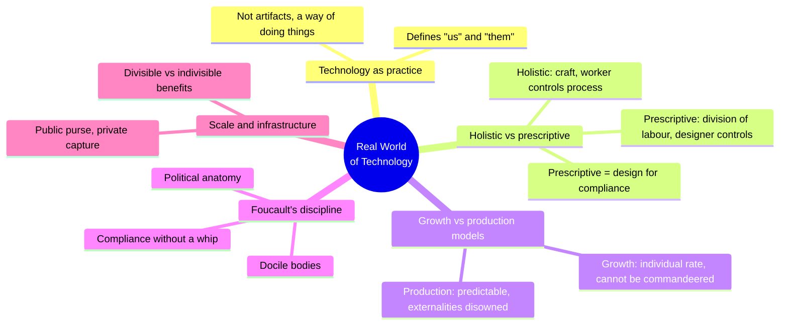
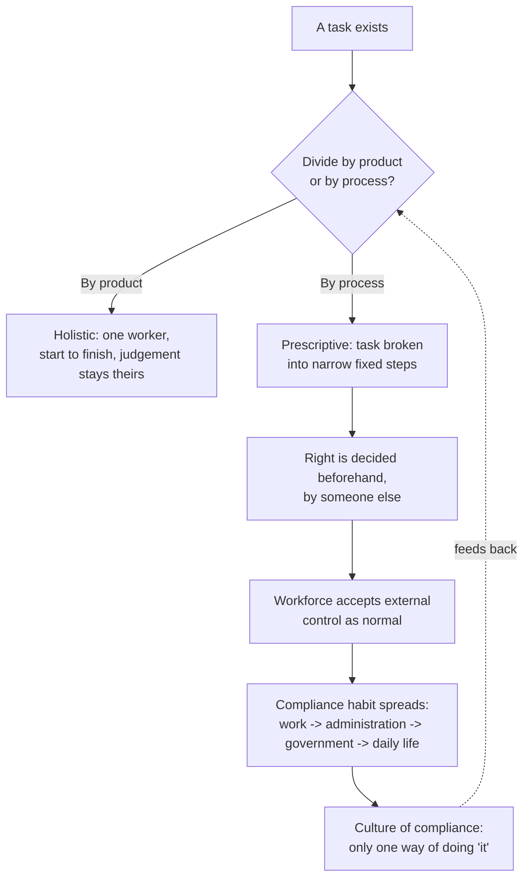
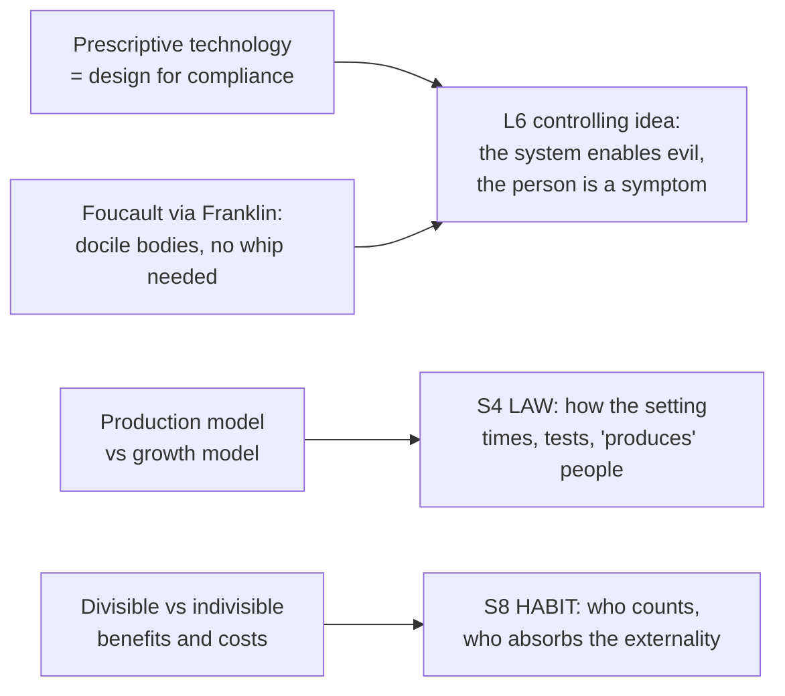

# BVX.1155 — The Real World of Technology — Ursula M. Franklin (1990/1999)
### Knowledge Entry — Distill

A metallurgist's 1989 Massey Lectures (four chapters added for the 1999 revised edition) arguing that technology is not tools but *practice* — a way of doing things that reorganizes power, work, and compliance long before any machine shows up; read for BOLO 80's controlling idea (biopower) and BOLO 87's setting shelf (a tech layer that argues, not just gadgets).

## TABLE OF CONTENTS
- [Core Thesis](#1-core-thesis)
- [Mind Models](#2-mind-models)
- [Framework](#3-framework--structure)
- [Key Concepts](#4-key-concepts)
- [Heuristics](#5-heuristics--decision-rules)
- [Invariants](#6-invariants)
- [Pitfalls](#7-pitfalls--myths)
- [Application](#8-application)
- [Cross-References](#9-cross-references)
- [Provenance](#10-provenance--confidence)

---

## 1 · CORE THESIS

Technology is practice, not artifact: "the way things are done around here." How a task is divided into steps, not what the task is, decides whether workers stay in control (holistic) or hand control to a designer (prescriptive). Prescriptive technologies are designs for compliance; their spread across work, then administration, then daily life is how a culture is acculturated to obedience without anyone ordering it.

---

## 2 · MIND MODELS

*Required. Minimum two diagrams, maximum five.*

**Diagram 1 — the whole argument.**
Caption: *technology-as-practice runs one mechanism (division of labour) through four widening rings — work, scale, reality, and governance — and the same compliance effect shows up in every ring.*

**Diagram 2 — the central mechanism (a state change: how a workforce is acculturated into compliance).**
Caption: *the loop never needs a villain — each turn just narrows the step, and the compliance habit generalizes on its own into administration and daily life.*

**Diagram 3 — mapped onto the Command's controlling idea and setting layers.**
Caption: *Franklin supplies the mechanism (how compliance is manufactured without a decision-maker to blame) that BOLO 80's biopower thesis needs, and hands the setting shelf a concrete institutional design for it.*

---

## 3 · FRAMEWORK / STRUCTURE

Ten chapters plus a Coda, delivered as six 1989 lectures with four added for the 1999 edition. The book has no single spine argument stated up front; it runs one lens (technology as practice, not artifact) across widening rings of application:

| Chapter(s) | Governing move |
|---|---|
| I | Defines technology as practice; introduces work-related vs. control-related, then holistic vs. prescriptive technologies |
| I (cont.) | Growth model vs. production model, and where each has been wrongly swapped for the other |
| II | Levels of reality (vernacular, extended, constructed, projected) and how science/technology has reshaped each |
| III | Technology as an agent of control and planning; Foucault's discipline and docile bodies; scale, infrastructure, divisible/indivisible benefits |
| IV–VI (1989 core) | Communications technologies, growth-vs-production applied to education and reproduction, closing arguments on accountability and reciprocity |
| VII–X (1999 additions) | Communications technologies old and new; time; space; the impact of the "bitsphere" on work, community, and governance |
| Coda | Retrospective: what has and hasn't changed a decade on |

The read for this distill concentrated on chapters I–III, where the holistic/prescriptive distinction and the compliance mechanism are built and named; later chapters extend the same mechanism into communications, time, space, and governance without changing its shape.

---

## 4 · KEY CONCEPTS

| Concept | What it is | Why it matters |
|---|---|---|
| **Technology as practice** | "The way things are done around here" — technology is organization, procedure, symbol, and mindset, not the sum of its artifacts | Moves the whole inquiry from objects to *how* work is organized, which is where compliance gets built in or left out |
| **Work-related vs. control-related technology** | A tool that eases the task (an electric typewriter) vs. one that adds monitoring on top of the same task (a networked workstation) | Most modern technological change is control-related, not work-related — the "improvement" is often surveillance wearing an efficiency costume |
| **Holistic technology** | Specialization by *product*: one worker (or tight team) carries a piece from start to finish, making situational judgement calls throughout | The worker keeps control of the process; the product is "one of a kind" even when superficially uniform |
| **Prescriptive technology** | Specialization by *process*: the task is broken into fixed, narrow steps, each done by someone who need know only that step | Control moves to the designer/organizer; Franklin's illustration is Shang-dynasty bronze casting, prescriptive millennia before factories existed |
| **"Prescriptive technologies are designs for compliance"** | Franklin's most load-bearing line (ch.1): the *political* meaning of a process broken into steps decided beforehand by someone else | Compliance is manufactured as a side effect of production efficiency, not imposed afterward as a separate rule |
| **Culture of compliance** | The acculturation that begins on a factory floor and migrates outward until "external control and internal compliance are seen as normal and necessary" everywhere | Explains why citizens accept ever-tighter management as "just how things work" rather than as a choice made somewhere |
| **Growth model vs. production model** | Growth: individual rate, cannot be commandeered, only nurtured, embedded in context. Production: predictable, controllable in principle, externalities disowned as "someone else's problem" | Franklin's test case is education and reproductive medicine, both grown-model processes now run on a production model — the mismatch is the diagnosis for institutions that feel dehumanizing without anyone intending harm |
| **Docile bodies (via Foucault, quoted directly)** | Discipline "produces subjected and practised bodies... 'docile' bodies" through drill, timing, ranking, and record-keeping, first in monasteries, then schools, armies, hospitals, prisons, and finally factories | Franklin's own bridge from prescriptive-technology-as-labour-process to prescriptive-technology-as-social-control: the factory did not invent these disciplinary designs, it inherited them |
| **Divisible vs. indivisible benefits/costs** | Divisible: a benefit (or cost) that can be parcelled out to specific people (your tomato crop). Indivisible: shared regardless of contribution (clean air, a stopped pollution source) | Franklin's diagnosis of infrastructure politics: the public purse increasingly funds divisible private benefit while indivisible public benefit (environment, justice) goes unprotected |
| **The "house" technology has built** | Franklin's opening image: technology has built the house we all live in, still being extended and demolished, and few people today live outside it | A compliance culture does not feel like compliance from inside the house — it feels like the only available floor plan |

---

## 5 · HEURISTICS & DECISION RULES

| Situation | Do this | Not this |
|---|---|---|
| Judging a new tool or system | Ask *how* the task will be divided (by product or by process) | Ask only *what* the tool does |
| A task involves caring, judgement, or immediate feedback (teaching, healing, parenting) | Design it as a growth process: individual rate, context, nurture | Force it onto a production schedule and call the mismatch a discipline problem |
| Explaining why people comply without a visible enforcer | Point to the accumulated habit of narrow, prescribed steps, not to any single order-giver | Look for a villain who is "making" everyone comply |
| Weighing a new infrastructure or policy | Ask who gets the divisible benefit and who absorbs the indivisible cost | Evaluate it only on efficiency or output |
| Building an institution's controlling mechanism (a rating system, a rubric, a checkpoint) | Break it into steps narrow enough that no single actor's step feels like the whole harm | Assign the harm to one identifiable decision-maker |
| Critiquing "bigger is better" or "more efficient" claims | Ask for whom, and note that scale shifted historically from a size-comparison term to a merit-comparison term | Accept scale/efficiency claims as self-evidently good |

---

## 6 · INVARIANTS

1. **How a task is divided decides who holds control**, regardless of the task's content — process division moves control to the designer; product division keeps it with the doer.
2. **A prescriptive process does not need a coercive order to produce compliance** — the acculturation is a side effect of the division of labour itself.
3. **Compliance habits generalize outward**: a workforce trained into prescriptive-process obedience carries that same acceptance into administration, government, and daily life without a fresh act of persuasion.
4. **A growth process forced onto a production model produces a mismatch that reads as failure**, even though nothing was done wrong by the model's own logic.
5. **Externalities are not oversights; they are structural to the production model**, which is built to disregard context by design, not by neglect.
6. **The disciplinary architecture (timing, ranking, record-keeping, drill) predates the machines that later automated it** — the factory inherited, rather than invented, its control design from monasteries, schools, and armies.

---

## 7 · PITFALLS / MYTHS

- Treating "technology" as hardware — Franklin's whole argument collapses if technology is read as artifacts rather than practice.
- Assuming compliance requires a visible enforcer or an evil designer; Franklin's (and Foucault's) point is that the *architecture* produces it without anyone needing to intend it.
- Praising prescriptive efficiency without naming its "enormous social mortgage": the compliance culture it leaves behind.
- Treating scale increases and efficiency gains as inherently good — Franklin traces "bigger is better" to a category error, mistaking a size-comparison term for a merit-comparison one.
- Running a growth-shaped task (teaching, healing, judgement work) on a production model and then blaming the people inside it when it feels dehumanizing.
- Calling an externality "someone else's problem" — that framing is not neutral, it is the production model working exactly as designed.

---

## 8 · APPLICATION

- **Spine level:** L6 (controlling idea / theme) and SETTING (technology layer)
- **12-layer character stack:** L6 DRIVE — the controlling-idea engine for a biopower argument; no individual-character feed beyond that
- **plot_systems:** contextual — the compliance-acculturation loop (Diagram 2) is a ready template for how an Administration-style antagonist system escalates without a human villain issuing new orders each scene
- **Setting:** primary — feeds S4 LAW (production-model institutions: schools, hospitals run on a schedule that fits neither) and S8 HABIT (divisible/indivisible benefit as a belonging-and-citizenship question)

For BOLO 80 (the theme system, controlling idea = biopower): Franklin gets to the exact Foucauldian mechanism BOLO 80's research already flagged — she quotes *Discipline and Punish*'s "docile bodies" passage directly in chapter III and traces the same disciplinary lineage (monastery to school to army to hospital to factory) that the BIOPOWER-PLAIN research register uses to explain governmentality. Her distinct contribution is naming the *labour-process* version of the mechanism before the social-control version: prescriptive technology is designs for compliance at the level of how a task is cut into steps, which is one register more concrete and buildable than Foucault's own vocabulary. For a story whose controlling idea is "the system enables evil; the person is a symptom," Franklin supplies the missing middle step — *why* no single person inside the system has to feel responsible: because their step was designed narrow enough not to look like harm.

For BOLO 87 (the setting shelf, TTRPG-first): the holistic/prescriptive split and the growth/production split are both directly usable world-building tools, not just theme material. A sci-fi setting's technology layer gets more argumentative texture by asking, region by region or institution by institution: is this a holistic-technology culture (craft, judgement, one-of-a-kind) or a prescriptive one (division of labour, designed-for-compliance)? Is this domain (school, hospital, court, market) run on a growth model or has a production model been imposed on it? Those two questions generate setting friction (a holistic-tech guild inside a prescriptive-tech empire; a growth-model temple inside a production-model bureaucracy) for free, and they double as the story's thematic argument once one faction's technology is legibly a "design for compliance" and the plot tests whether anyone inside it can see that.

---

## 9 · CROSS-REFERENCES

| Related entry | Relation |
|---|---|
| [[BVX.0458]] | Kobold Guide to Worldbuilding — SETTING-shelf sibling; where that book supplies S1/S4/S5 method (map, governance, ruins), Franklin supplies the *argument* layer underneath a setting's institutions: what a technology's division of labour says about who holds power |
| [[BVX.0054]] | Lyons, Anatomy of a Premise Line — L6 sibling; Lyons's moral blind spot (a false belief the protagonist can't see) and Franklin's culture of compliance (a habit no one inside it can see as a choice) are the same shape at two scales, personal and institutional |

Not yet in the library, but named directly by Franklin's own argument and by the BOLO 80 biopower register as the texts this entry talks to: Foucault, *Discipline and Punish* (quoted directly, ch.3 — Franklin's "docile bodies" passage is lifted from it); Foucault, *The History of Sexuality, Vol. 1* (the biopower term itself, not cited in this book but the direct extension of its argument); Arendt, *Eichmann in Jerusalem* (the banality-of-evil register that answers "why does no one inside the compliance culture feel responsible"); Bauman, *Modernity and the Holocaust* (division of labour spreading blame thin — Bauman's assembly line is Franklin's prescriptive technology read as atrocity mechanism). Franklin sits upstream of Zuboff and Han in this reading list: her "control-related technology" (a networked workstation that turns work into monitored, timed data) is the direct ancestor of Zuboff's surveillance capitalism and Han's psychopolitics, neither of which had happened yet when she lectured in 1989.

---

## 10 · PROVENANCE & CONFIDENCE

Full text available (Q:/_PDF_DROP, 231pp per the drop inventory), pdftotext extraction. Read in full for this distill: the Preface to the New Edition and the Preface to the 1990 Edition; Chapter I entire (technology as practice, work-related vs. control-related, holistic vs. prescriptive technologies, the Chinese bronze-casting illustration, growth model vs. production model); Chapter II opening (levels of reality) through its close; Chapter III entire (technology as an agent of control, Foucault's discipline and docile bodies, scale and infrastructure, divisible/indivisible benefits and costs). Not deep-read for this pass: chapters IV–X and the Coda (communications, time, space, governance, the 1999 additions) — grepped for continuity (compliance, governance, citizenship, population, discipline all recur through the index and later chapters without changing the mechanism established in I–III) but not extracted in full; a second pass would be needed to distill those chapters' communications-technology and time/space material on their own terms.

The L6/biopower keying in frontmatter `feeds:` is this distill's synthesis against `_tools/bolostatus/work/80/BIOPOWER-PLAIN.md` (the BOLO 80 controlling-idea research register), which independently names Foucault's *Discipline and Punish* and *History of Sexuality* as the anchor texts; this entry confirms Franklin quotes the former directly and extends its mechanism into a labour-process vocabulary the research register does not yet cover. `bvx_provisional: true` is set because this is a new id with no Zotero record (the book sits in the drop folder, not the Zotero library); `zotero_key` is left blank pending an import pass.

## META
- Template: BVX-LEARN-v4.0
- Source classification: full-text book, deep extraction on chapters I-III (the read the brief scoped), sampled continuity check on IV-X and Coda via grep
- Created / Updated: 2026-09-29
