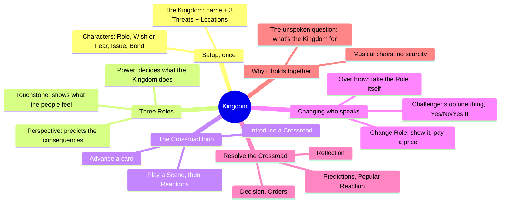
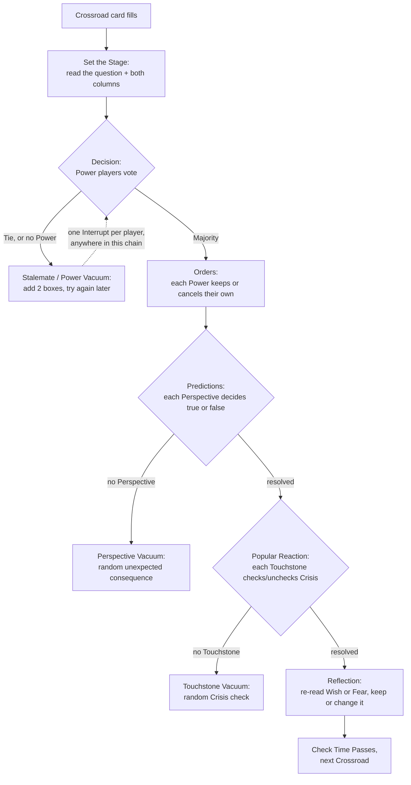
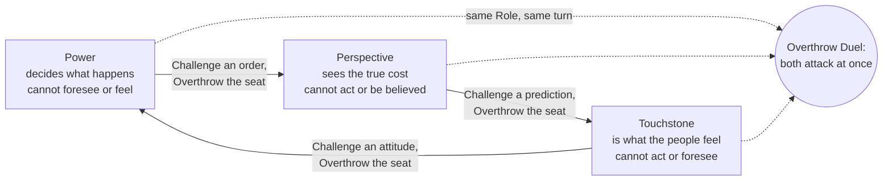
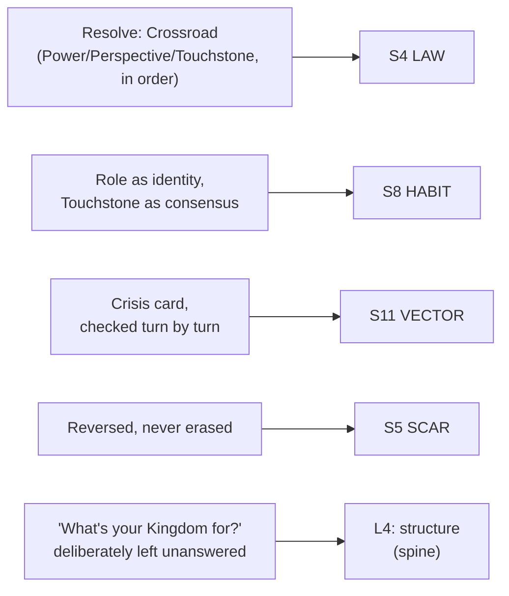

# BVX.1156 — Kingdom: A Role-Playing Game About Communities (2nd ed.) — Ben Robbins (2019)
### Knowledge Entry — Distill

A GM-less tabletop game where three to five players run one community through a chain of binding decisions, each holding exactly one of three checks-and-balances Roles at a time; the setting shelf's cleanest model of a faction actually deciding something.

## TABLE OF CONTENTS
- [Core Thesis](#1-core-thesis)
- [Mind Models](#2-mind-models)
- [Framework](#3-framework--structure)
- [Key Concepts](#4-key-concepts)
- [Heuristics](#5-heuristics--decision-rules)
- [Invariants](#6-invariants)
- [Pitfalls](#7-pitfalls--myths)
- [Application](#8-application)
- [Cross-References](#9-cross-references)
- [Provenance](#10-provenance--confidence)

---

## 1 · CORE THESIS

A community is never run by one authority: deciding, foreseeing the cost, and embodying what the people already feel are three separate jobs, held by three separate players who can each be publicly out-argued or overthrown. Change happens by a player staking a Role and paying a price, not by a document declaring it in advance.

---

## 2 · MIND MODELS

*Required. Minimum two diagrams, maximum five.*

**Diagram 1 — the whole argument.**
Caption: *setup happens once and fixes the board; every turn after is one loop of scene, Role, and card, until a Crossroad's boxes fill and the Kingdom must answer for real.*

**Diagram 2 — the central mechanism (a governance procedure, run once per Crossroad).**
Caption: *the Kingdom's decision is not one roll or one vote, it is a fixed sequence of three different authorities, and any seat left empty degrades gracefully into a named, playable failure state instead of breaking the game.*

**Diagram 3 — the Role triangle (checks and balances, entities in tension).**
Caption: *each Role is strong exactly where the other two are blind, so no single player can ever run the whole decision alone; Challenge tests one thing a Role did, Overthrow takes the seat.*

**Diagram 4 — mapped onto the Command's SETTING slice.**
Caption: *the Crossroad procedure and Touchstone are the book's two primary feeds; Crisis and the can't-erase invariant ride along as a live trajectory and a permanent mark, both generated by play instead of pre-authored.*

---

## 3 · FRAMEWORK / STRUCTURE

Setup runs once, as a group, in fixed steps:

1. **Make the Kingdom** — name it, brainstorm three Threats (external and internal pressures, not yet active), have each player add two Locations.
2. **Make Your Characters** — each player picks a starting Role (never all the same), a fitting concept, two Locations, a Wish or Fear, a personal Issue, and a Bond with the player to their left.
3. Three blank index cards go on the table: **Crossroad**, **Crisis**, **Time Passes** — each a line of checkboxes, a countdown to an event, not the event itself.

Play then loops with no fixed end, one player at a time:

1. **Introduce a Crossroad** if none is in play (a Yes/No question the Kingdom must decide, checked for interest, then painted with backstory but never with consequences).
2. **Play a Scene** — the current player's character thinks or does something about the Crossroad; any character present can use their Role.
3. **Reactions** — every other player may add one brief reaction.
4. **Advance a card** — check Crossroad (default), Crisis, or Time Passes.
5. **Resolve** any card that just filled, in the fixed order Crossroad, then Crisis, then Time Passes.
6. Pass the turn left.

There is always exactly one Crossroad live. Resolving it runs a separate eight-step procedure (Diagram 2) that replaces normal scene play with brief narrated moments and a strict one-Role, one-Interrupt limit per player.

---

## 4 · KEY CONCEPTS

| Concept | What it is | Why it matters |
|---|---|---|
| **The three Roles** | Power (decides), Perspective (predicts consequences), Touchstone (shows popular feeling) — exactly one per character, switchable, never doubled up by rule | Each Role can do what the other two structurally cannot |
| **Crossroad** | A Yes/No question the Kingdom itself must decide, introduced with a question, an interest check, and backstory only — never pre-set consequences | "The Kingdom is invaded" is not a valid Crossroad; "does the Kingdom bribe the invaders" is — the question must be a choice, not a thing done to the Kingdom |
| **Change Your Role** | Declare the change, show it in play, then pay a price unrelated to the Role itself; requires a full scene already held in the old Role | The only voluntary way to get a new voice; the price is mandatory, which keeps switching from being free |
| **Challenge** | Contest one specific thing a character did or established with their Role; the defender alone decides Yes, No, or Yes If | A cheaper first line of resistance, resolvable without taking anyone's Role away |
| **Overthrow** | Take a character's Role by proving they don't really have it; switch to their Role first, then a defender-judged bid, then a choice to cancel what they already did | The only way to remove a Role against its holder's will; it relocates a voice, never removes a player |
| **When Roles Disagree** | Power vs. Power risks stalemate; Perspective vs. Perspective means one is provably wrong by a fixed tie-break order; Touchstone vs. Touchstone adds Crisis for every character involved | Each Role's failure mode differs in kind: division among the people is structurally more dangerous than a disagreement among leaders |
| **Vacuum rules** | An empty Role seat is not skipped, it triggers a named random sub-procedure (Power: automatic stalemate; Perspective/Touchstone: a coin-flip-style unexpected consequence or Crisis hit) | An absent authority is still a fact about the Kingdom, not a rules gap |
| **Musical chairs, no scarcity** | Losing a Role never removes a player from play; there is always another seat | Distinguishes what happens to the character (stripped of everything) from what happens to the player (never sidelined) |
| **"What's your Kingdom for?"** | The one question the game deliberately never asks players to answer on a sheet; it stays as pure friction between all three Roles | Writing the answer down in advance would end the argument the entire game exists to have |

---

## 5 · HEURISTICS & DECISION RULES

| Situation | Do this | Not this |
|---|---|---|
| Wording a Crossroad | Ask what the Kingdom decides ("does it bribe the raiders?") | Ask what happens to the Kingdom ("is it invaded?") |
| A player has Power but hesitates to use it | Let a weak, indecisive leader stand — it functions exactly like a Power vacuum | Force the player to act "in character," against their own read of the Role |
| Writing a Touchstone reaction | State only what your own character feels ("I'm furious") | Report on the crowd ("people are saying they're furious") |
| You dislike what a character did with their Role | Challenge the specific thing first | Jump straight to Overthrow before testing a cheaper fix |
| A Challenge you set the bar too high on fails against you | Expect escalation to Overthrow — the failed Challenger can go straight for your seat | Treat "no" as the end of the exchange |
| No one holds a needed Role when a Crossroad resolves | Run the named vacuum sub-procedure (stalemate / random consequence / random Crisis) | Skip that step, or let another Role fill in for it |
| Deciding how big to make the Kingdom | Twenty to thirty people minimum, no upper limit, enough that it outscales the played characters | A Kingdom sized to exactly the cast, with no unplayed populace behind it |
| Wanting a wise, compassionate ruler | Have the Power player simply agree with what Perspective and Touchstone already established | Give the Power character private insight or empathy the rules didn't grant them |

---

## 6 · INVARIANTS

1. **Exactly one Role per character, always.** Gaining a new Role always means losing the old one; there is no stacking.
2. **A Crossroad is a choice the Kingdom makes, never a thing merely done to it.** Outside pressure can motivate the question, but the question itself must be a decision.
3. **Nothing already decided can be un-happened, only reversed going forward.** A later Crossroad can free people the Kingdom enslaved; it cannot make them never have been enslaved.
4. **Changing a Role voluntarily always costs something beyond the Role itself.** No price, no change.
5. **Losing a Role by force (Overthrow) never removes a player's ability to act.** They immediately hold a different Role with full rights.
6. **An empty Role seat is not silence, it is a defined outcome** (stalemate, an unexpected consequence, or public anger), resolved by a fixed sub-procedure rather than left to table judgment.
7. **During Crossroad resolution, each player affects the outcome with exactly one Role and may Interrupt exactly once.** Sequence and scarcity apply even to the moment of greatest stakes.

---

## 7 · PITFALLS / MYTHS

- Writing a Crossroad's consequences into its own introduction, instead of leaving them to Perspective and Power to discover in play.
- Playing Touchstone as a pollster reporting the crowd's opinion, rather than as an ordinary person whose own feeling simply is the crowd's, unknowingly.
- Treating "no Power wants to act" as a stalled game rather than the built-in Power Vacuum state it already is.
- Believing Overthrow removes a player from meaningful participation — it relocates their voice, never revokes it.
- Skipping the price when voluntarily changing Role, which turns an identity-defining moment into a costless reshuffle.
- Writing "what's my Kingdom for" onto a character sheet in advance, which quietly closes the argument the entire game is built to keep open.

---

## 8 · APPLICATION

- **Spine level:** L4 (structure, primary) — the Crossroad turn loop and the eight-step Resolve procedure are a self-contained decision-generation engine, the same shelf as Microscope's fractal zoom, just aimed at a single standing community instead of an entire history
- **12-layer character stack:** none directly; the Role-switching discipline (show it, then pay a price) is a portable technique for staging a character's change of allegiance, but not itself a character-layer feed
- **plot_systems:** contextual candidate once `04_PLOT_SYSTEMS/` opens — a Crossroad is a ready-made faction-decision scene generator: state the yes/no question, paint the situation, withhold consequences until it plays out
- **Setting:** primary — feeds S4 LAW and S8 HABIT directly, S11 VECTOR and S5 SCAR as generated byproducts of play rather than authored up front

Kingdom's real export for a written setting is the Crossroad: a device for staging a faction's decision without pre-deciding it. State a governing body's choice as a bare yes/no question plus the provoking situation, then work out who in the cast supplies the foresight, who supplies the public mood, and who holds the authority to answer — and let the outcome emerge from that tension instead of being scripted first. Power deciding only after hearing the other two is a compact model for how any institution moves: authority is real but not the whole story, and a faction that only shows its decider will read as thin. The invariant that a reversed decision still leaves a mark (S5 SCAR) is the same shape as the Kobold Guide's post-apocalyptic default ([[BVX.0458]]) and Microscope's Legacies ([[BVX.0465]]): change in a community is additive, never a clean overwrite. "What's your Kingdom for?" is the cleanest export outside the game itself: leave a faction's founding purpose implicit and contested rather than declared, since a written answer forecloses the tension a setting needs to stay alive.

---

## 9 · CROSS-REFERENCES

| Related entry | Relation |
|---|---|
| [[BVX.0465]] | Microscope — same designer (Ben Robbins); its own "Mixing with Microscope" chapter treats Kingdom as the zoom-in engine for one turning point inside a Microscope history, and Microscope as the zoom-out engine for what a Crossroad leads to or came from |
| [[BVX.0458]] | The Kobold Guide to Worldbuilding — sibling SETTING source; Baur's tribe/city-state/nation essay is the static structure Kingdom's Crossroad sets in motion, LAW actually running a decision |
| [[BVX.1146]] | GURPS Space (4th ed.) — sibling S4 LAW source; GURPS catalogs government types as static traits, where Kingdom generates one decision inside whatever government the table has |
| [[BVX.0349]] | Against Worldbuilding — counter-argument sibling; refusing to let players write "what's your Kingdom for" on a sheet answers the same over-planning failure mode this source warns against |

---

## 10 · PROVENANCE & CONFIDENCE

Full text, pdftotext extraction, 174pp, clean text layer, legible TOC and chapter breaks (scattered ligature artifacts, e.g. "office" as "o ce," did not affect content). Read in full: front matter; the "What is a Kingdom?" and "Kingdom in a Nutshell" read-aloud pages; the entire "Starting a New Game" chapter (Make the Kingdom, Make Your Characters); "Overview of Play"; "Crossroad" (introducing, worked Roman Legion example); "Roles" and its Perspective/Touchstone/Power sub-sections with worked examples; "Change Your Role"; "When Roles Disagree"; "Hey! That's not your Role!?!"; "Scenes & Reactions" through "Playing a Scene"; "Challenge" and "Challenge Details" with all four examples; "Overthrow Their Role" and "Overthrow Duel" with the Rigel IV example; "Advance & Resolve Cards" and the full eight-step "Resolve: Crossroad" procedure with every disagreement and vacuum sub-rule; "Interrupt: Take a Stand"; the start of "What Happens Now?"; and the full Discussion chapter (advanced Role notes, An Enlightened Despot, Musical Chairs Sans Scarcity, What's Your Kingdom For?, Two-Player Kingdom, Pawns Not Kings, Mixing with Microscope).

Not read, or sampled only by heading: Supporting Characters, A Beginner's Guide to Making Scenes, the rest of the Eshbal example, Death & Dying, Switching Characters, Resolve: Time Passes/Crisis, Ending the Game, Multiple Sessions, the Play Advice teaching-tips section, the twenty pre-built Kingdom Seeds, the Afterword/credits, and the sheet materials. None of it changes how a Kingdom is built or a faction decides — ancillary procedure and ready-made settings, not the core method.

S-layer keying in `feeds:` and Diagram 4 is this distill's synthesis against `ssot_03_setting_system.md`, following the method BVX.0458, BVX.0465, and BVX.1146 already set on this shelf. `spine: [SETTING, L4]` mirrors BVX.0465's keying, since both books are structure-generation engines rather than pure setting-content sources. `bvx_provisional: true` reflects a first-pass id with no Zotero key yet on file.

## META
- Template: BVX-LEARN-v4.0
- Source classification: full-text, complete short game manual, deep extraction on every rules and craft chapter through the core Crossroad/Role/Challenge/Overthrow/Resolve system and the Discussion essays; skim/omit only on ancillary procedures, pre-built seeds, and teaching aids
- Created / Updated: 2026-09-29
