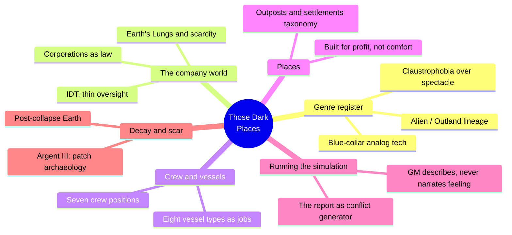
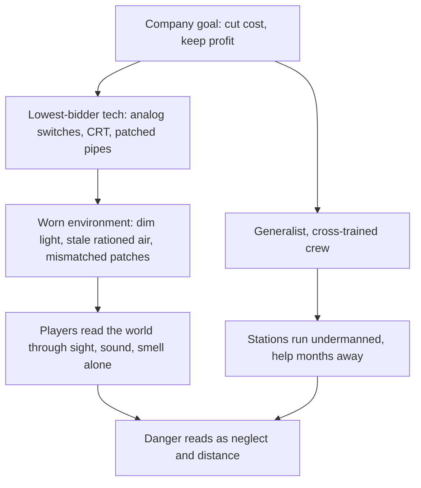
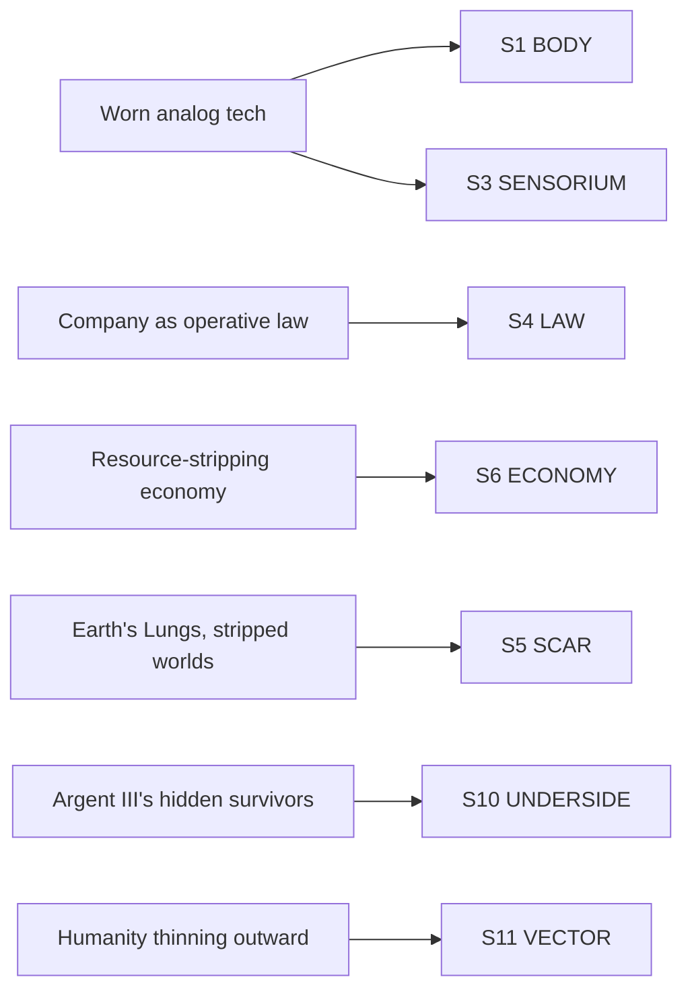
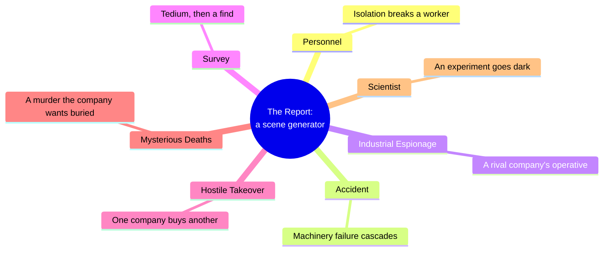

# BVX.1157 — Those Dark Places: Industrial Science Fiction Roleplaying — Jonathan Hicks (2016)
### Knowledge Entry — Distill

A tabletop roleplaying rulebook in the Alien / Outland industrial-sci-fi lineage: a d6 engine wrapped around one worldbuilding method, showing a setting entirely through cheap, worn, analog machinery and the labor that maintains it.

## TABLE OF CONTENTS
- [Core Thesis](#1-core-thesis)
- [Mind Models](#2-mind-models)
- [Framework](#3-framework--structure)
- [Key Concepts](#4-key-concepts)
- [Heuristics](#5-heuristics--decision-rules)
- [Invariants](#6-invariants)
- [Pitfalls](#7-pitfalls--myths)
- [Application](#8-application)
- [Cross-References](#9-cross-references)
- [Provenance](#10-provenance--confidence)

---

## 1 · CORE THESIS

Those Dark Places builds a setting entirely from the register of labor: cheap, analog, easily-repaired machinery is the company's economics made visible, and the GM's only tool is sensory description of that machinery, never lore. A place feels real when it has a job, a cost, and a patch history; danger reads as neglect and distance, not spectacle.

---

## 2 · MIND MODELS

*Required. Minimum two diagrams, maximum five.*

**Diagram 1 — the whole argument.**
Caption: *six moving parts, one register — everything in the book traces back to work, cost, and distance from help.*

**Diagram 2 — the central mechanism (a process: cost decision to felt danger).**
Caption: *every dial and pipe traces back to a cost decision, and that decision, not a monster, is where the horror actually lives.*

**Diagram 3 — mapped onto the Command's SETTING SLICE (S1–S12).**
Caption: *seven concrete book details land cleanly on six of twelve SETTING SLICE layers, with S3 SENSORIUM the layer this source fills best of any source on the shelf so far.*

**Diagram 4 — the report as a taxonomy of conflict generators.**
Caption: *each report type is a labor condition turned into a mystery, not a monster dropped into a corridor — this is the book's own version of Kobold's "dynamite," run through the register of work instead of myth.*

---

## 3 · FRAMEWORK / STRUCTURE

The book has three parts, and only the middle one is a worldbuilding manual in disguise:

1. **Introduction** — names the genre by naming its films (Alien, Outland, Silent Running, Moon; the video games Alien: Isolation and Dead Space) and states the register directly: blue-collar, analog, down-and-dirty, claustrophobic.
2. **Players' Section** — character creation, written in-fiction as a company orientation interview. Thin on setting method but establishes voice: the company talks to you like a Human Resources form with a gun to your head.
3. **General Monitors' (GM) Section** — the actual setting toolkit: Running a Simulation (how a GM builds a scene out of sensory description alone), Crew Types and Transport (eight vessel roles as economic functions), Outposts and Settlements (a five-category taxonomy of place-by-job), Simulation Ideas (seven report types as scenario generators), The Setting (the one chapter of explicit background: Earth's Lungs, the companies, the IDT), Friends and Enemies, Synthetic Automatons, and Creatures.
4. **The Argent III Report** — a full worked example adventure, demonstrating every rule above in practice: a derelict ship revealed entirely through sensor rolls, smells, and patched machinery, never through narration.

The book explicitly declines to build a fixed setting bible: "Those Dark Places does not have a defined central setting... there is just enough information to give the story depth, but the history and setting remain vague." What replaces a setting bible is a *method* — cost-cutting logic applied consistently to every layer — and a worked example proving the method produces a coherent world without a gazetteer.

---

## 4 · KEY CONCEPTS

| Concept | What it is | Why it matters |
|---|---|---|
| **Industrial sci-fi register** | Blue-collar, analog, "down-and-dirty" science fiction: switches and CRT screens instead of touchscreens, hardy machinery instead of elegant tech | The genre definition doubles as the setting-design rule; naming the register up front locks every later choice to it |
| **The cost-cutting logic** | Every technological and architectural choice traces back to the company trying to save money | The single load-bearing worldbuilding rule in the book — ask "why did the company choose the cheap version" before describing anything |
| **The Lungs** | City-sized atmosphere circulators on Earth; breathable air quality and city wealth both fall off with distance from one | A single concrete image that encodes scarcity, class, and post-ecological-collapse history without a paragraph of exposition |
| **The company as government** | Corporations, not the Interstellar Department of Trading (IDT), are the operative law once a ship clears the solar system | Setting reads as "corporate," not "government-run," which is the genre's core power structure (Outland, Alien) |
| **Deep Space Support Teams (Dusters)** | The default PC frame: generalist crews sent to fix whatever problem a station can't solve itself | Motivates travel and danger through a work contract, not a calling — the crew is disposable labor, and the fiction knows it |
| **Vessel types as jobs** | Cargo transporters, tugboats, passenger ships, service vessels, science vessels, arbiter ships, tactical vessels, multi-role vessels | Each vessel type is worldbuilding by occupation: naming the ship's job tells the reader what the setting values and who's expendable |
| **Outposts and settlements taxonomy** | Research facilities, Resource Management Stations (RMSs), survey outposts, military bases, and general stations/platforms | A place is legible once it has a functional slot in this list; the taxonomy is a shortcut past inventing purpose from scratch |
| **The Report** | The book's term for a scenario/adventure, sorted into named types (personnel, accident, espionage, survey, hostile takeover, mysterious deaths, scientist) | A ready taxonomy of conflict generators, each keyed to a specific labor condition rather than an imported monster |
| **GM as description engine** | The GM's stated job is to describe what characters see, hear, and smell, and never to tell them what to think or feel | This is the mechanism that turns "cheap machinery" into a felt setting — atmosphere is built through sensory reportage, not adjectives about mood |
| **Patch archaeology (the Argent III)** | The derelict ship's recycling units are visibly from different decades and different vessels, including a recently added one | Ruin design as visible layers of repeated, increasingly desperate patching, not a single frozen disaster moment |
| **Synthetic Automatons (SAMs)** | Human-passing androids that never sleep, never feel stress, and "act for the benefit of the bigger picture, i.e. the company" | Company logic literalized as a person: the automaton is what the corporation wishes every worker could be |

---

## 5 · HEURISTICS & DECISION RULES

| Situation | Do this | Not this |
|---|---|---|
| Want a location to feel real | Ground every detail in who paid for it and how cheaply | Invent a lived-in aesthetic disconnected from economics |
| Introducing a corporation | Give it a name, a rival, and a known cost-cutting habit | Write a faceless "the Corp" with no specific business logic |
| Building a derelict or ruin | Layer visible repairs from different eras, patch over patch | Present it as untouched since the original disaster |
| Describing atmosphere | Use only sight, sound, and smell of machinery and rationing | Narrate how the characters feel about the room |
| Motivating a crew to travel | Give them a contract, a bonus, and a company that half-trusts them | Give them a noble, unpaid calling |
| Designing a scenario | Pull the conflict from a labor condition (overwork, understaffing, a buyout) | Import a monster with no economic cause behind it |
| Naming a non-Earth place | Derive its scale and purpose from a functional taxonomy first | Invent a bespoke location with no job to do |
| Writing station culture | Make long-tenured workers territorial and unpredictable as texture | Treat every NPC as freshly arrived and neutral |
| Handling vehicles and hardware | Keep them a means to an end unless the story needs otherwise | Build elaborate stat blocks the genre doesn't ask for |

---

## 6 · INVARIANTS

1. **Every piece of technology in the setting traces back to a cost decision.** Cheap, analog, and repairable is the company's balance sheet made visible.
2. **Comfort is rationed, not default.** Open space, real food, and full light are wealth markers, and their absence is the baseline.
3. **Help is always far away.** The setting's fear engine is distance from response, measured in weeks, not the presence of a monster.
4. **The corporation is the operative law past a certain distance.** Government oversight (the IDT) exists but is thin, slow, and easily ignored once a ship clears the solar system.
5. **A place needs a job to be legible.** Research, mining, survey, or military purpose makes a station real; a place with no functional slot reads as scenery.
6. **Ruin implies a repeated history of patching, not a single disaster.** Decay accumulates in layers across different repair eras.
7. **The GM's only tool is sensory description.** Players are told what they see, hear, and smell; they are never told what to feel.

---

## 7 · PITFALLS / MYTHS

- Making the technology shiny, voice-activated, or high-touch — it kills the genre's blue-collar register on contact.
- Explaining danger through narration ("this feels ominous") instead of physical, sensory detail (smell, patched wiring, stale water).
- Presenting a corporation as a monolith with no name, no rival, and no specific cost-cutting habit of its own.
- Treating a derelict or ruin as a static crime scene instead of a palimpsest of repeated, increasingly desperate repairs.
- Letting a monster or alien be the sole source of horror instead of the neglect, distance, and economics that produced the conditions for it — the book itself was "not explicitly designed with aliens... in mind."
- Overbuilding vehicle or starship combat rules the genre doesn't need; the book deliberately refuses ship-to-ship stats because the tension lives in corridors and stations, not dogfights.

---

## 8 · APPLICATION

- **Spine level:** SETTING (non-story-spine source; keys to the entity beside the L0–L7 spine, per ssot_03's binding rule that setting is a Domain embodied, never a level)
- **12-layer character stack:** none directly — this is a setting-side source; the Synthetic Automaton's "act for the company, not the humane thing" logic is structurally the same shape as an L4 WILL vs. L6 DRIVE conflict, but it is not itself a character-layer feed
- **plot_systems:** strong candidate once `04_PLOT_SYSTEMS/` opens — the seven report types (Diagram 4) are a ready scene/conflict generator keyed to labor conditions rather than genre tropes; run any drafted station or ship through "which report does this location generate" before trusting it playable
- **Setting:** primary — feeds six of twelve SETTING SLICE layers at meaningful strength (S1, S3, S4, S5, S6, S8, S10, S11 primary or supporting; S2, S7, S9 contextual), and is the first source on the shelf to fill S3 SENSORIUM as its load-bearing layer rather than an afterthought

This book earns its place beside BVX.0458 (Kobold) as a genre-narrow worked counterpart: where Kobold gives the general philosophy (design toward conflict, not coverage), Those Dark Places shows what that philosophy looks like when the entire setting is built from one register, work and its machinery, applied without exception. Its S3 SENSORIUM contribution is the strongest of any SETTING-shelf source read so far: the "GM describes only what is seen, heard, and smelled" rule (§3, Running a Simulation) is a directly portable drafting discipline for any SETTING SLICE entry, not just an industrial-sci-fi one — write the S3 record as a sensory script, not an adjective list, and test it by reading it aloud the way this book's own worked example does. The book is also a live confirmation of Axis 3's FUNCTION modes from `ssot_03`: its worked Argent III example runs Anchor (where/when), Characterize (a room built from patched recyclers tells you who's desperate), Pressure (thin air, dim light, Pressure-roll triggers), and Mood (mould, silence, a "cathedral-like" ruined bridge) in the same three pages, one or two modes at a time, exactly as the taxonomy prescribes. It is conspicuously thin on S2 WEATHER, S7 FOUNDING, and S9 ALLURE-as-glamour, all consistent with a genre that keeps its people indoors, its history present-tense, and its incentives purely economic rather than seductive; none of these are failures of the source, they are its register speaking honestly.

---

## 9 · CROSS-REFERENCES

| Related entry | Relation |
|---|---|
| [[BVX.0458]] | Kobold Guide to Worldbuilding — theory/toolkit sibling on the same SETTING shelf; this book is the genre-narrow worked counterpart to Kobold's general philosophy |
| [[BVX.1122]] | GURPS Hot Spots: Renaissance Venice — sibling worked instance (a sourcebook distilled as a concrete SETTING-SLICE example); that one is a gazetteer of a real place, this one is a genre-specific method for an invented one |
| [[BVX.0349]] | Kennedy, Against Worldbuilding — this book is a practical demonstration of Kennedy's counter-thesis in action: it explicitly declines a fixed setting bible and still produces a coherent, playable world through register alone |

---

## 10 · PROVENANCE & CONFIDENCE

Full text, pdftotext extraction, 127pp, clean text layer with a machine-readable table of contents and legible section breaks (encoding artifacts limited to stray substitution characters for em dashes and apostrophes, not a content loss). Read in full: Introduction (What the Game Is About, For the Gamemaster, For the Player, The Rulebook); the GM-facing setting chapters in full — Running a Simulation (including all three worked scene-setting/NPC/combat examples), A Game of Those Dark Places, The Role of Players in the Simulation, Crew Types, Transport, Outposts and Settlements, Simulation Ideas (all seven report types), The Setting, Friends and Enemies, Synthetic Automatons, Playing a Synthetic Automaton, Creatures, and the Conclusion; The Argent III Report, read through Section Five (Inside the Argent III), which contains the adventure's full worldbuilding payload (the derelict's patch-archaeology, the recycling room, the medical bay, and the discovery of the surviving crew). Sampled, not deep-extracted: the Players' Section's Attributes, Conflict and Damage, Pressure, and Equipment chapters (mechanics with limited SETTING content), and the tail-end quick-reference character sheets.

Bibliographic note: the extracted text carries a 2020 Osprey Games electronic-edition imprint; this entry uses the 2016 Modiphius edition and authorship given at tasking, with `bvx_provisional: true` set because the id and Zotero record are new and not yet reconciled against the library's existing catalog.

The S-layer keying in frontmatter `feeds:` and Diagram 3 is this distill's synthesis against `ssot_03_setting_system.md` (PART A, the twelve-layer SETTING SLICE); the S3 SENSORIUM strength call is a direct read of the book's own stated GM discipline (describe sight, sound, smell only), not an inference. The `spine: [SETTING]` and empty character-stack application follow the v4 template's binding rule and `ssot_03`'s root claim that setting is a Domain embodied, not a story-spine rung.

## META
- Template: BVX-LEARN-v4.0
- Source classification: full-text book, deep extraction on the GM-facing setting chapters and the worked adventure, sampled on player-facing mechanics chapters
- Created / Updated: 2026-09-29
