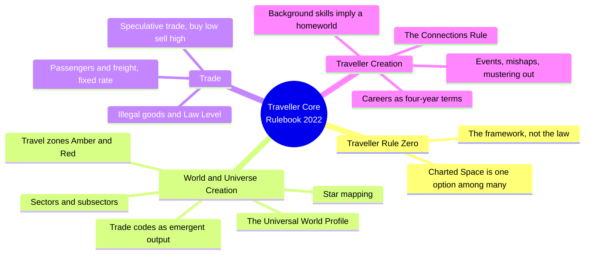
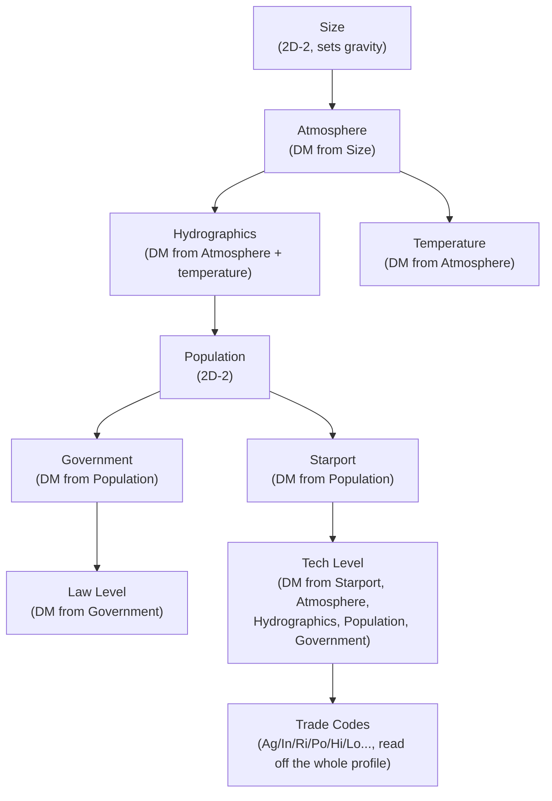
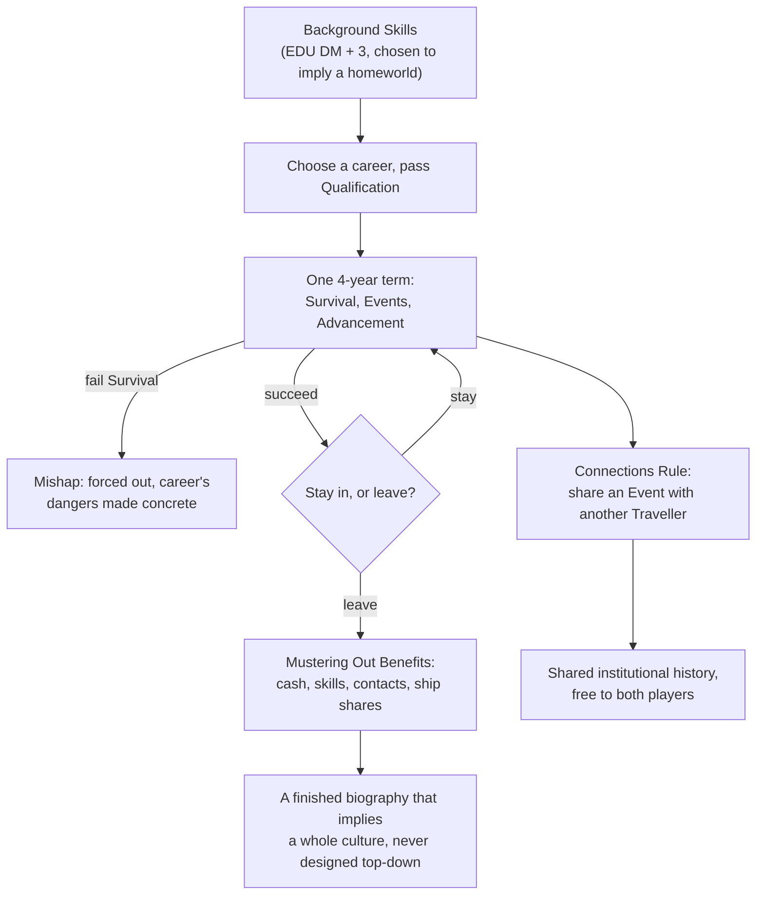
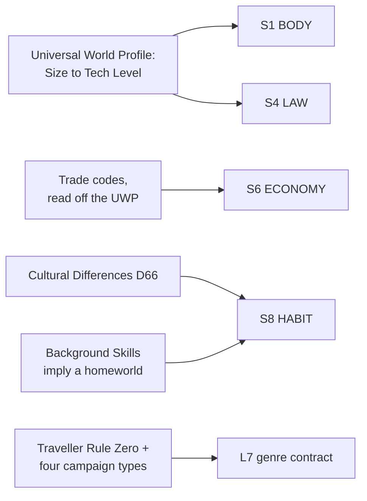

# BVX.1158 — Traveller Core Rulebook (Update 2022) — Marc Miller & Matthew Sprange (2022)
### Knowledge Entry — Distill

The oldest continuously published science-fiction TTRPG's core rulebook; its Universal World Profile, Trade, and Traveller Creation chapters are a fixed-order world-and-culture generator, read here for setting method only, combat and hardware skipped per brief.

## TABLE OF CONTENTS
- [Core Thesis](#1-core-thesis)
- [Mind Models](#2-mind-models)
- [Framework](#3-framework--structure)
- [Key Concepts](#4-key-concepts)
- [Heuristics](#5-heuristics--decision-rules)
- [Invariants](#6-invariants)
- [Pitfalls](#7-pitfalls--myths)
- [Application](#8-application)
- [Cross-References](#9-cross-references)
- [Provenance](#10-provenance--confidence)

---

## 1 · CORE THESIS

A Traveller setting is generated bottom-up and just-in-time: the Universal World Profile fixes a world's physical and political shape in one cascading roll order, trade codes turn that shape into an economy automatically, and a Traveller's own career terms seed culture and connections before a referee writes a line of lore.

---

## 2 · MIND MODELS

*Required. Minimum two diagrams, maximum five.*

**Diagram 1 — the whole argument (setting scope only; combat, equipment, spacecraft and psionics chapters excluded per brief).**
Caption: *three generators, one discipline: a world is rolled, its economy falls out of the roll, and a character's own biography rolls a second, human-scale world alongside it.*

**Diagram 2 — the central mechanism (a chained process, run once per world).**
Caption: *nothing on the profile is rolled in isolation; every later digit inherits a die modifier from an earlier one, so a Traveller world is internally consistent by construction, not by the referee's afterthought.*

**Diagram 3 — the career-path mechanism (world-seeding through one character, run once per Traveller).**
Caption: *the referee never designs the homeworld or the employer directly; four-year terms, forced departures and the Connections Rule build both from the outside in, through the people who lived there.*

**Diagram 4 — mapped onto the Command's SETTING SLICE (S1-S12).**
Caption: *S1, S4 and S6 chain into each other on a single dice sequence; S8 is fed twice, once from the world and once from the character; S7 FOUNDING and S11 VECTOR are structurally thin, left to Charted Space's own published history rather than the core generator.*

---

## 3 · FRAMEWORK / STRUCTURE

Three chapters carry the setting-building method, read in this order once and then used in a different order forever after, since character creation is what most tables actually run first:

| Chapter | Governing question | What it hands downstream |
|---|---|---|
| Traveller Creation | Who is this person, and what does their career imply about the world that produced them? | Background skills, a career history, contacts, and a finished biography before session one |
| World and Universe Creation | What does a subsector look like, hex by hex, and what is each world made of? | The Universal World Profile, one hex-coded line per world |
| Trade | What does a world's profile mean for the economy that runs through it? | Trade codes, freight rates, and the buy-low-sell-high speculative trade loop |

The three chapters are not sequential in play; a referee may build worlds first and let Travellers arrive from them, or let Travellers arrive fully formed and build homeworlds retroactively to match. Either works because all three generators share one habit: roll a small set of fixed values, then read government, economy, and culture off values already rolled.

---

## 4 · KEY CONCEPTS

| Concept | What it is | Why it matters |
|---|---|---|
| **Universal World Profile (UWP)** | One hex line (e.g. `C6A643-9`): Starport, Size, Atmosphere, Hydrographics, Population, Government, Law Level, Tech Level | A world's whole physical and political shape compresses to a line a referee reads at the table without notes |
| **Cascading dice modifiers** | Each later digit rolls with a DM drawn from an earlier one: Atmosphere from Size, Hydrographics from Atmosphere, Government from Population, Law Level from Government, Tech Level from nearly all of it | Consistency is a side effect of roll order, not a rule the referee has to remember to enforce |
| **Trade codes** | A fixed checklist (Agricultural, Industrial, Rich, Poor, High/Low Population, High/Low Tech, Garden, Vacuum, Waterworld...) a world qualifies for once its UWP is set | Converts physical and political fact directly into what a world sells, buys, and smuggles, with zero extra authorship |
| **Starport as extraterritorial zone** | Nominally Imperial territory, running Imperial law regardless of the planetary government beneath it | Lets a Traveller carry locally illegal goods so long as they stay inside the port, and explains why criminals cluster there |
| **Speculative trade's percentage tables** | Purchase and Sale price both read off one 2D+DM roll against a single Modified Price table (15% to 400% of base) | One roll, one table, two readings; buying and selling share an identical mechanic read from opposite columns |
| **Law Level's banned-goods ladder** | Nine levels, each adding a further banned category on top of the last (poison gas and WMDs at Law 1, all weapons at Law 9+) | A Law Level is a lookup table for what a Traveller cannot carry, not a vague descriptor like "strict" |
| **Background Skills as homeworld proxy** | Before any career, EDU-DM-plus-3 skills chosen from a fixed menu (Animals, Vacc Suit, Seafarer, Electronics...) meant to imply where the Traveller grew up | The character generator doubles as a homeworld generator: the skill picks already answer "what kind of world is this?" |
| **Career terms** | Four-year blocks with Qualification, Survival, an Events roll, and an Advancement roll, repeated until the Traveller leaves | A whole institutional culture gets implied through the shape of its risks and rewards, never described directly |
| **Mustering Out Benefits** | A table rolled once per term served, paying cash, skills, contacts, or ship shares by career and rank | What an organization pays a veteran on the way out is itself worldbuilding about what it values |
| **The Connections Rule** | Two players may agree one Traveller's rolled Event also happened to the other, and both gain a free skill | Shared setting texture is generated collaboratively at the table, at zero authorial cost |
| **Cultural Differences (D66)** | A one-roll table of cultural quirks (Xenophobic, Ritualised, Honourable, Taboo, Fusion...) for any world | A fast culture-flavor generator meant to be rolled alongside reasoned extrapolation, not instead of it |
| **Traveller Rule Zero** | Every generator in the book is a framework the referee may override, even against the published Charted Space setting | Removes any obligation to defend a die roll; tables save time, they never bind the referee's vision |

---

## 5 · HEURISTICS & DECISION RULES

| Situation | Do this | Not this |
|---|---|---|
| Building a new world | Roll Size, then Atmosphere, then Hydrographics and Temperature, then Population, then Government, then Law Level, in that order | Decide Government or Tech Level first and retrofit the physical stack to match |
| Deciding what a world trades | Read its Trade codes off the finished UWP | Invent an economy from scratch that ignores the world's own physical and political profile |
| Writing a government | Roll or pick from the 16-entry table and use its Common Contraband column to seed what it restricts | Invent a government's stance on weapons or drugs independently of its type |
| Fleshing out a Traveller's origin | Choose Background Skills that imply a specific kind of homeworld (agricultural, belter, urban) | Pick skills at random with no thought to what kind of world would produce them |
| Running a career the referee never designed | Let its Survival risk, Events table and Mustering Out Benefits imply its institutional culture | Insist on writing the organization's full history before any character can serve in it |
| Linking two player characters' backstories | Use the Connections Rule to share one rolled Event between them | Default to "you all meet in the starport bar" with no shared history |
| Setting a world's Law Level | Treat it as a lookup table for exactly what a Traveller cannot carry, from poison gas at Law 1 to all weapons at Law 9+ | Describe a world as "strict" without pricing out what that strictness actually bans |
| Choosing a campaign's tone | Pick one of the named campaign types (Trader, Military, Explorer, or the everything-at-once Traveller campaign) before play | Let tone drift session to session with no named contract |

---

## 6 · INVARIANTS

1. **A world's physical stack is one cascading roll, not eight independent facts.** Size sets Atmosphere's modifier; Atmosphere sets Hydrographics' and Temperature's.
2. **Economy is read off physics and politics, never authored separately.** Trade codes are a mechanical consequence of the UWP already rolled.
3. **A starport's law is not the planet's law.** Extraterritorial status explains smuggling, sanctuary, and Tech Level mismatches in one rule.
4. **Law Level is a banned-goods ladder, not an adjective.** Every level adds a specific category on top of the one before it.
5. **A career's culture is implied by its risk and payoff structure, not described directly.** Survival odds, Events, and Mustering Out do the characterization work.
6. **Character generation and world generation are the same discipline at two scales.** Background Skills, terms, and Connections answer "what must have been true for this biography," exactly as the UWP answers "what must be true for this world."
7. **Every generator yields to the referee's vision, including the published setting.** Traveller Rule Zero is an explicit override, not an implied one.

---

## 7 · PITFALLS / MYTHS

- Rolling Government or Tech Level before Size and Atmosphere are settled, breaking the chain of modifiers the book relies on for consistency.
- Hand-authoring a world's economy from taste instead of reading its Trade codes off the UWP already rolled.
- Treating a starport as subject to the planetary government's law, missing why it functions as a sanctuary and a Tech Level outlier.
- Describing a world's Law Level in prose only ("strict," "lawless") instead of pricing exactly what that means for a visiting Traveller.
- Designing a career's parent organization in full before a character serves in it, when term-by-term risk and reward was built to imply that culture alone.
- Starting a campaign with strangers meeting in a bar instead of using the Connections Rule to build shared history at zero cost.
- Picking Background Skills at random, wasting the character generator's quieter job of implying a homeworld.

---

## 8 · APPLICATION

- **Spine level:** SETTING (non-story-spine source; a procedural generator, not bound to one story)
- **12-layer character stack:** none directly. Career terms and the Connections Rule build the world through the character, not the character's psychology, so they stay SETTING-side until a formal bridge opens
- **plot_systems:** contextual candidate once `04_PLOT_SYSTEMS/` opens; the Speculative Trade checklist and the Factions-on-a-government mechanic are ready-made background-conflict engines, close cousins to BVX.1141's faction-turn loop
- **Setting:** primary. This is the SETTING shelf's third generative sci-fi toolkit, alongside BVX.1141 (Stars Without Number) and BVX.1146 (GURPS Space): feeding S1, S4, and S6 at primary strength, S8 at supporting strength from two directions, and L7 contextually

Traveller's most exportable idea for the reader's own universe is not the UWP table, it is Diagram 3: character generation as a second, human-scale world generator. A writer building a setting from career backstories instead of a gazetteer gets S8 HABIT and S6 ECONOMY texture for free every time a job history is worked out in detail, exactly as a Traveller's four-year terms imply a homeworld and employer the referee never described. Tested against the shelf: where BVX.1141 (SWN) rations depth by "will the PCs reach this world next session," Traveller rations it by "what does this Traveller's own life already require to be true," a finer-grained, character-first version of the same just-in-time discipline. Where BVX.1146 (GURPS Space) writes concept before dice for its worlds, Traveller inverts that for its UWP, then converges with GURPS Space's concept-first method for careers, since a player has usually decided who this person is before the dice run.

---

## 9 · CROSS-REFERENCES

| Related entry | Relation |
|---|---|
| [[BVX.1141]] | Stars Without Number: sibling generative sci-fi sandbox; SWN rations depth by "will the PCs reach it," Traveller by "what does this character's life already require" — the same just-in-time discipline at two different entry points, world versus character |
| [[BVX.1146]] | GURPS Space: sibling sci-fi campaign-design toolkit; GURPS insists on concept before dice for its worlds, Traveller inverts that for its UWP but converges with GURPS on concept-first for career-driven characters |
| [[BVX.0458]] | Kobold Guide to Worldbuilding: fantasy-toolkit theory counterpart; its present-tense-history rule is answered here not by argument but by the book simply not building deep history into the core UWP generator at all |

---

## 10 · PROVENANCE & CONFIDENCE

Full text, extracted from the 2022 Update Core Rulebook (~264pp), clean text layer with a machine-readable table of contents and index. Read in full: the Introduction (Charted Space, campaign types, Traveller Rule Zero); Traveller Creation's Creation Summary, Characteristics, Background Skills, Pre-Career Education, Career Descriptions' shared mechanics (Qualification, Survival, Events, Advancement, Commission, Benefits), the Connections Rule, and Drifters and the Draft; World and Universe Creation in full (Sectors and Subsectors, Star Mapping, the whole UWP sequence, Cultural Differences, Law Level, Starport, Tech Level, Bases, Travel Codes, Trade Codes); Trade in full (Passengers, Freight, Mail, Speculative Trade and Smuggling, Illegal Goods, Price tables, the Trade Goods table).

Not read, per the brief's scope: Skills and Tasks, Combat, Encounters and Dangers, Equipment, Vehicles, Spacecraft Operations, Space Combat, Spacecraft Construction, Common Spacecraft, and Psionics beyond its border with Trade. These carry player-facing mechanics and hardware outside this distill's setting-and-economy focus.

The S-layer keying in `feeds:` and Diagram 4 is this distill's synthesis against the setting slice (S1-S12) established by BVX.0458 and applied to the shelf's other generative sci-fi toolkits (BVX.1141, BVX.1146); `bvx_provisional: true` is set per brief. The `career_worldseeding` variable follows the precedent BVX.1146 set with `alien_design_chain`: a cross-cutting method that does not reduce to one S-layer.

## META
- Template: BVX-LEARN-v4.0
- Source classification: full-text core rulebook, deep extraction on the three setting-and-economy chapters, combat/hardware/psionics-mechanics chapters excluded per brief
- Created / Updated: 2026-09-29
