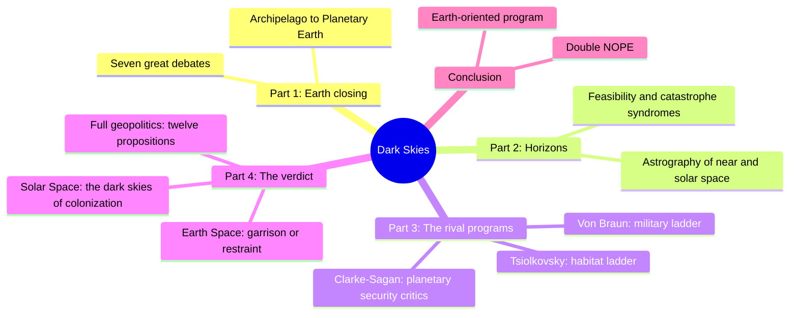
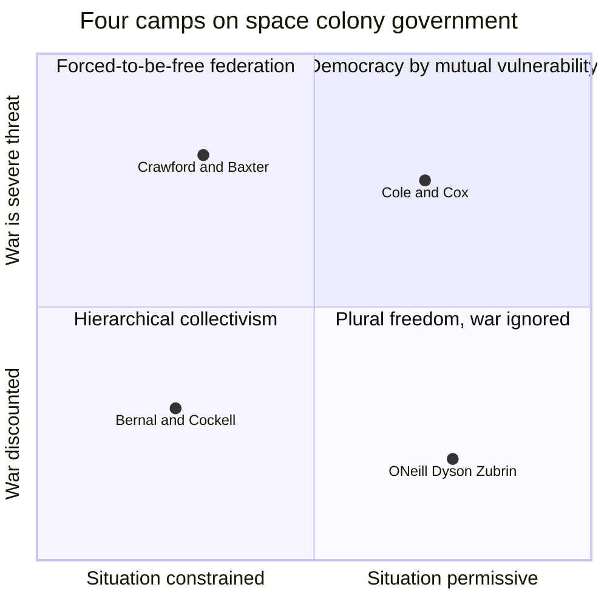
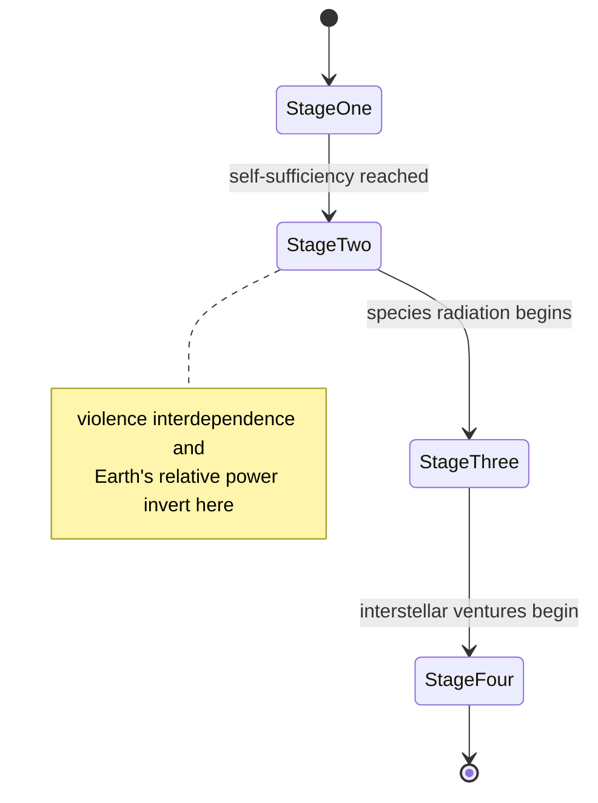
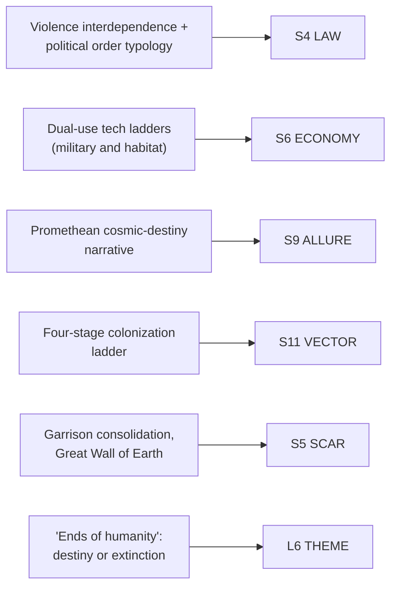

# BVX.1159 — Dark Skies: Space Expansionism, Planetary Geopolitics, and the Ends of Humanity — Daniel Deudney (2020)
### Knowledge Entry — Distill

A political scientist's argument that space expansion is not automatically progress. Applying "full geopolitical theory" to actual and proposed military and habitat space programs, Deudney concludes both tend toward war or garrison hierarchy: a citable machine for building a space setting's politics rather than decorating one.

## TABLE OF CONTENTS
- [Core Thesis](#1-core-thesis)
- [Mind Models](#2-mind-models)
- [Framework](#3-framework--structure)
- [Key Concepts](#4-key-concepts)
- [Heuristics](#5-heuristics--decision-rules)
- [Invariants](#6-invariants)
- [Pitfalls](#7-pitfalls--myths)
- [Application](#8-application)
- [Cross-References](#9-cross-references)
- [Provenance](#10-provenance--confidence)

---

## 1 · CORE THESIS

Space expansionists treat technological ascent off Earth as destiny and salvation. Full geopolitical theory says political order is set by material context, not intention: violence interdependence, distance, and open frontiers decide whether a place lands in anarchy, hierarchy, or restrained freedom. Every rung of the space ladder trends toward war or garrison rule, rarely toward freedom.

---

## 2 · MIND MODELS

*Required. Minimum two diagrams, maximum five.*

**Diagram 1 — the whole argument.**
Caption: *the book runs one argument four times: Earth's political debates, the space environment, the two live rival programs (military and habitat), and geopolitical theory's verdict on both.*

**Diagram 2 — the central mechanism.**
Caption: *both roads up the gravity well feed the same variable, violence interdependence. Past a threshold, anarchy stops being survivable, and hierarchy wins that opening far more often than restrained union does.*

**Diagram 3 — the colony-government decision tool.**
Caption: *plot any faction's colony charter by two questions, how tight are survival constraints and how real is interworld war, and Deudney's four historical camps predict its government type.*

**Diagram 4 — the setting arc.**
Caption: *read as a campaign-arc ladder: each stage adds population and political reach while shrinking the mother world's relative power. Past a point, "the colony rebels" stops being a plot choice and starts being physics.*

**Diagram 5 — mapped onto the Command's SETTING SLICE.**
Caption: *five load-bearing claims sorted onto the SETTING SLICE and the story-spine's Theme level — a setting-politics starter kit, not a footnote.*

---

## 3 · FRAMEWORK / STRUCTURE

Ten chapters in four parts, each answering one question in the chain. Part One surveys what has actually happened in space and names seven live debates on "Planetary Earth": anarchy vs. world government, closure vs. frontier, freedom vs. technocracy. Part Two maps the astrography of near and solar space and audits which expansionist technologies are actually feasible. Part Three profiles the two live rival programs: military (Von Braun) and habitat (Tsiolkovsky), plus the underrecognized "planetary security" critics. Part Four builds "full geopolitical theory," twelve propositions relating material context to political order, and fires it at Earth orbital space, then solar space, then states a counter-program.

---

## 4 · KEY CONCEPTS

| Concept | What it is | Why it matters |
|---|---|---|
| **Space expansionism** | The dominant body of thought (Tsiolkovsky, von Braun, O'Neill, Musk, Bezos) holding that large-scale human movement off Earth is desirable, necessary, and near-inevitable | The setting's default in-universe ideology for any expansionist faction, named, sourced, and ready to be dramatized rather than invented from scratch |
| **Full geopolitics** | Arguments about how material context (geography plus technology) shapes which political arrangements are viable, especially around violence and freedom; broader than "great-power politics" | The book's actual method: a checklist for deriving a faction's plausible government from its situation instead of asserting one |
| **Violence interdependence (VI)** | The capacity of actors in a space to damage one another, independent of who has more weapons; runs absent, weak, strong, then intense | The single variable that decides whether anarchy is livable; VI rising past "intense" makes some exit from anarchy necessary for security |
| **Anarchy / hierarchy / negarchy** | A triangular typology of political order: no government; concentrated top-down rule (empire, despotism); and "negarchy," Deudney's term for republics and their unions, where power is distributed but mutually restrained | Most fictional space governments are drawn from only two of these three poles; negarchy is the hard, rare, deliberately engineered case |
| **The Von Braun ladder** | Five-step military space program, read bottom-up: ballistic missiles, then force-multiplying satellites, orbital fighting, space control, and finally planetary hegemony via an "Earth Net" | A concrete tech-tier list for a setting's military-space arc, and a warning that "defensive" orbital infrastructure is also a hegemony tool |
| **The Tsiolkovsky ladder** | Seven-step habitat program: Fuller Earth, then Ehricke-Glaser-Lewis orbital rings, Bernal-O'Neill orbital cities, Mars (Zubrin), asteroid diaspora (Cole), outer-system colonization (Dyson), and interstellar migration (Goddard) | The setting's habitat-expansion tech tree, each rung with a named real-world visionary and stated rationale, ready to reskin |
| **Ships vs. cities** | Ships are governed as hierarchical technocracies (a captain, obedience, no democracy) because catastrophic failure is instant; cities can sustain republics because proximity enables organizing | The load-bearing design question for any enclosed space habitat: will the astropolis be a ship or a city? The answer sets its whole politics |
| **Species radiation / posthuman drift** | Habitat expansionism's endpoint: divergence produces non-interbreeding "spacekind," and the ideology's beneficiary shifts from humanity to "life itself" | A faction-generator for post-human political blocs, plus a theme hook: the program that starts to save humanity ends by discarding it |
| **Island Earth in the Solar Archipelago** | Once colonies are large and independent, Earth becomes one polity among many, shrinking in relative power, likely to respond with a hierarchical "garrison state" | A late-campaign reversal: the cradle world stops being the center and starts playing catch-up or defense |
| **Catastrophic threat taxonomy** | Six named ways large-scale space expansion itself manufactures new existential risk: malefic geopolitics, natural-threat amplification, restraint reversal, hierarchy enablement, alien generation, monster multiplication | A menu of setting-level dangers that are consequences of success, not sabotage, useful for antagonist design that doesn't need a villain |
| **Double NOPE** | Deudney's counter-program: "Not On Planet Earth" (no more planet-wrecking tech) plus "Not Off Planet Earth" (no ambitious colonization) | The dissenting faction's platform: an Earth-centered, restraint-first politics to set against every expansionist power bloc |

---

## 5 · HEURISTICS & DECISION RULES

| Situation | Do this | Not this |
|---|---|---|
| Deciding a space faction's government | Run it through Diagram 3: how constrained is survival, how real is interworld war | Assign "democracy" or "empire" because it fits the faction's vibe |
| Designing a resource-extraction technology (asteroid movers, mass drivers, orbital energy) | Build in its weapon use from the start: dual-use is the default, not the exception | Write a peaceful economic technology with no military shadow |
| Writing a colony's founding charter | Show it drift under the environment's real pressure (isolation, fragility, technocratic necessity) | Assume a well-written constitution holds regardless of circumstance (the "Good Seed" fallacy) |
| Placing a frontier zone (asteroid belt, unclaimed orbit, new colony) | Make it violent, weakly propertied, prone to core/periphery conflict by default | Write frontiers as empty opportunity nobody is fighting over yet |
| Building an interstellar or interplanetary federation | Weight it against distance, travel-time lag, and member divergence | Assume shared origin guarantees union (the American-founding analogy oversells) |
| Escalating danger across a campaign | Raise violence interdependence stepwise (Diagram 4's four stages) | Keep threat flat and just add bigger ships |
| Writing an expansionist faction's ideology | Give it the Promethean register: cosmic destiny, species vocation | Write "we need resources" as the whole motive; the real sell is salvation |
| Placing a strategic chokepoint (orbital ring, wormhole, one habitable moon) | Make control of it decide the region's political order, unless neutralized | Let a chokepoint sit uncontested and unweaponized |
| Writing a "peaceful" orbital megastructure | Ask who it would let dominate the planet below if seized, before deciding it is benign | Treat size and utility as automatically good for everyone |

---

## 6 · INVARIANTS

1. **Political order is a function of material context, not intention.** Violence interdependence, power distribution, and frontier status set what government is *possible*, before virtue or vice enters in.
2. **An uncontrolled axial region (chokepoint, orbital ring, single habitable world) tends toward domination unless deliberately neutralized.** Control is never neutral by default.
3. **Frontiers generate conflict by structure, not by author choice.** Weak property claims plus core/periphery power asymmetry produces violence in any open system.
4. **Enclosed, fragile habitats default to technocratic hierarchy.** The tighter the coupling between political dissent and catastrophic failure, the harder political freedom becomes to sustain.
5. **Dissimilar polities, by species, technology, or circumstance, conflict more and cooperate less.** Divergence (biological, cybernetic, or merely cultural) is itself a geopolitical fact, not set dressing.
6. **Every "solution from space" presupposes a prior definition of the Earth problem it solves.** A faction's stated space policy always reveals its politics about the home world first.
7. **Success enlarges danger faster than institutions can restrain it.** The gravest outcomes come from expansion working, not failing.

---

## 7 · PITFALLS / MYTHS

- Treating "more space, more freedom" as automatic: the geopolitical evidence runs the other way more often than not.
- Writing a resource-moving or defensive technology with no weapon application in mind; almost none exist.
- Building a federation without pricing in effective distance. Travel-time lag, not shared ancestry, breaks unions (the failed British Imperial Federation is the closer analog than the American founding).
- Confusing absolute distance with *effective* distance: what technology traverses quickly is "close," regardless of light-years.
- The "Benign Parent Model": assuming a homeworld or corporation nurtures a colony toward independence rather than keeping it small and dependent.
- Giving an expansionist ideology only material motives and skipping its self-description as salvation or destiny. The seduction is the point.
- Letting a "peaceful" megastructure exist without asking who it would let dominate everyone else if captured.

---

## 8 · APPLICATION

- **Spine level:** SETTING, primary; L6 (Theme) secondary, a setting-side source whose central claim ("success breeds domination, not freedom") is also a ready-made controlling idea for a space-set story's theme.
- **12-layer character stack:** none directly load-bearing, though Table 2.1's five-position technopolitical spectrum (Promethean, Techno-Optimist, Soterian, Friend of the Earth, Luddite) is a fast way to season a faction's stated worldview.
- **plot_systems:** contextual candidate once `04_PLOT_SYSTEMS/` opens. The axial-region-capture mechanic (Diagram 2) and the four-stage colonization ladder (Diagram 4) are ready scene- and arc-generators: "who controls the chokepoint" and "which stage is this Movement."
- **Setting:** primary, keyed to S4 LAW, S5 SCAR, S6 ECONOMY, S9 ALLURE, and S11 VECTOR (see `feeds:` above); the first library source with a systematic *method* for deriving a space faction's politics from its material situation rather than by fiat.

This book's real export is Diagram 2's mechanism: violence interdependence, not narrative convenience, should decide whether a space setting's polities land in anarchy, hierarchy, or the rare negarchic union. Every other tool here (the two ladders, the colony-government typology, the colonization arc, the threat taxonomy) is that same mechanism applied to one setting layer. Where the Kobold Guide ([[BVX.0458]]) supplies terrain-first method for a world's geography, Dark Skies supplies the matching method for a *space* setting's politics: the missing chapter on "what government does my orbital colony have," answered with a checklist instead of a guess.

---

## 9 · CROSS-REFERENCES

| Related entry | Relation |
|---|---|
| [[BVX.0458]] | Kobold Guide to Worldbuilding: the master SETTING-shelf toolkit this entry plugs into; Kobold gives terrain-first method generally, Dark Skies gives the political-order method for space settings specifically |
| [[BVX.1122]] | GURPS Hot Spots: Renaissance Venice: direct textual convergence. Deudney names Venice as the strongest historical analog for a free "city-ship" colony, against the default expectation of shipboard hierarchy |
| [[BVX.1141]] | Stars Without Number: sci-fi TTRPG core rulebook; this entry's colony-government typology and dual-use tech ladders are a ready political layer to run underneath that system's sector generation |
| [[BVX.1142]] | Cities Without Number: sibling sci-fi TTRPG core rulebook; the ships-vs-cities distinction and garrison-state trajectory apply directly to its urban settings once they go orbital |
| [[BVX.0349]] | Against Worldbuilding, and Other Provocations: counter-argument sibling. Dark Skies independently arrives at the same warning (systems built for their own sake, divorced from pressure, mislead) but from political science, not craft criticism |

---

## 10 · PROVENANCE & CONFIDENCE

Full text, plain-text extraction from PDF (a recurring ligature-stripping quirk drops "Th" at the start of words, e.g. "e Promise of Space Revisited," cosmetic only). Read in full or substantially: the Prologue; Ch. 1 (The Promise of Space Revisited); Ch. 2 (the seven Planetary Earth debates, the Technopolitical Alternatives spectrum at Table 2.1); Ch. 5 (the Von Braun ladder, ballistic missiles as space weapons, through Table 5.2); Ch. 6 (the Tsiolkovsky ladder, ships-vs-cities politics, colony-government typology at Figure 6.4, species radiation); Ch. 8 (full geopolitical theory, the violence-interdependence and political-order typology at Table 8.2 and Figure 8.2, twelve propositions at Table 8.3, the three-Earths test); the Earth Net section of Ch. 9; most of Ch. 10 (the four-stage colonization ladder at Table 10.1, the seven "Solar Geopolitics" sections, the catastrophic-threat taxonomy at Table 10.3); and the Conclusion. Not deep-extracted: Ch. 3's astrography, Ch. 4's feasibility survey, Ch. 7's arms-control critique, and the rest of Ch. 9. These carry the book's technical feasibility argument rather than its setting-political method, and were sampled via Ch. 2's own chapter map, per the brief's focus on political consequences over engineering feasibility.

The SETTING and L6 keying in `feeds:` and Diagrams 3 through 5 is this distill's own synthesis against `ssot_03_setting_system.md` (the SETTING SLICE) and `ssot_01_story_spine_comparative_tree.md`'s definition of L6 as Theme; no prior distill anticipated this mapping. `bvx_provisional: true` and the new `id` are set per this task's instruction; the book carries no Zotero key at time of writing.

## META
- Template: BVX-LEARN-v4.0
- Source classification: full-text PDF extraction, deep extraction on 6 of 10 chapters plus Prologue and Conclusion, sampled via chapter map on the remainder
- Created / Updated: 2026-09-29
