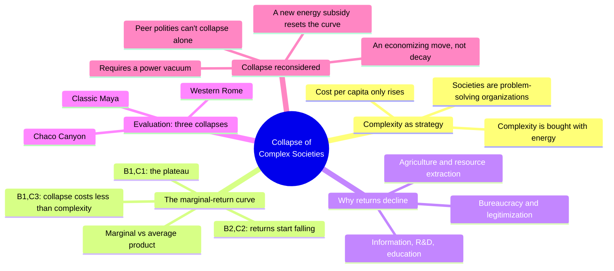
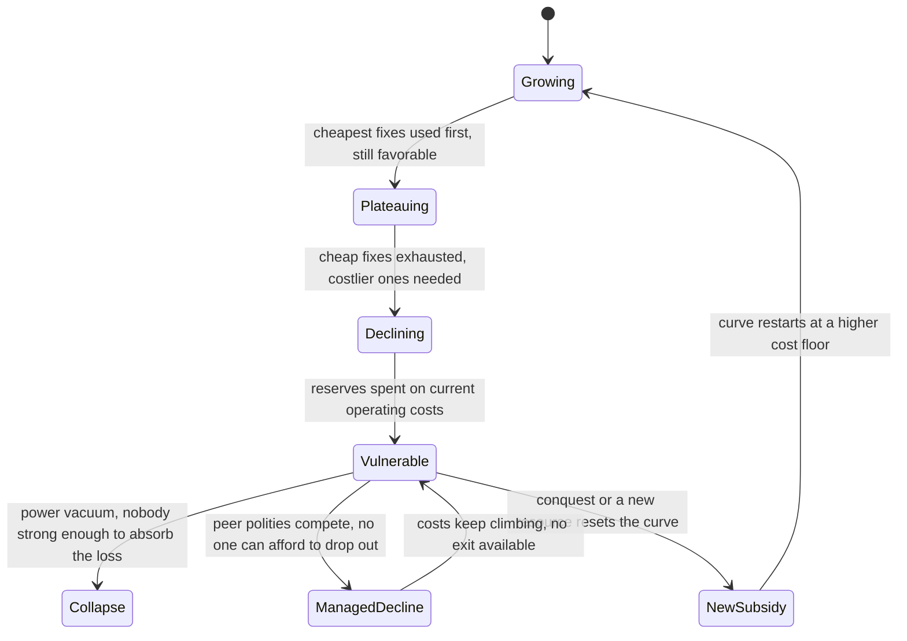
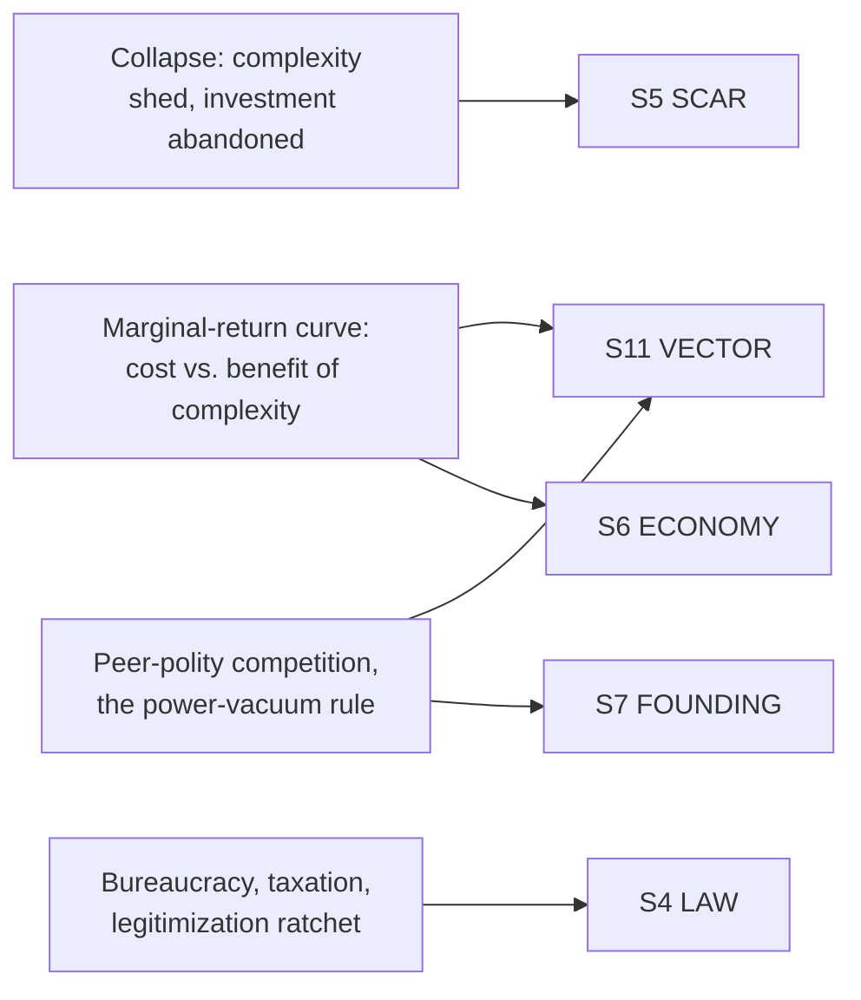

# BVX.1160 — The Collapse of Complex Societies — Joseph A. Tainter (1988)
### Knowledge Entry — Distill

An archaeologist's general theory of why civilizations fall: complexity is a problem-solving strategy bought with energy, its marginal return declines the way any investment's does, and collapse is what happens when that decline meets an open power vacuum — read here for the setting-side mechanism behind every ruin, fallen empire, and post-apocalyptic backstory a GM or writer might build.

## TABLE OF CONTENTS
- [Core Thesis](#1-core-thesis)
- [Mind Models](#2-mind-models)
- [Framework](#3-framework--structure)
- [Key Concepts](#4-key-concepts)
- [Heuristics](#5-heuristics--decision-rules)
- [Invariants](#6-invariants)
- [Pitfalls](#7-pitfalls--myths)
- [Application](#8-application)
- [Cross-References](#9-cross-references)
- [Provenance](#10-provenance--confidence)

---

## 1 · CORE THESIS

A society is an energy-fed, problem-solving organization: it buys relief from stress with added complexity, and complexity is never free. Each fix costs more and returns less than the last, until the marginal return on further complexity turns negative. Collapse is then a rational economizing move, not decay — ruins are what a canceled investment looks like.

---

## 2 · MIND MODELS

*Required. Minimum two diagrams, maximum five.*

**Diagram 1 — the whole argument.**
Caption: *five moves, one curve — complexity is purchased, purchases yield diminishing returns everywhere Tainter measured them, three real collapses fit the curve, and the ending (collapse vs. slow absorption) depends on who's standing next door.*

**Diagram 2 — the central mechanism (a state change, same curve, three different endings).**
Caption: *the curve produces three different histories depending only on what's next door — a power vacuum lets a society shed complexity fast, a ring of rivals forces it to keep paying anyway, and a new subsidy just moves the same problem to a higher cost floor.*

**Diagram 3 — mapped onto the Command's SETTING SLICE (S1–S12).**
Caption: *one mechanism, four S-layers — the marginal-return curve is the load-bearing variable behind ECONOMY and VECTOR, and it is also what SCAR and LAW are downstream consequences of.*

---

## 3 · FRAMEWORK / STRUCTURE

Six chapters, each answering one question in a chain that only completes at the end:

| Chapter | Governing question |
|---|---|
| 1 · Introduction to collapse | What does "collapse" actually mean, and which historical cases qualify? |
| 2 · The nature of complex societies | What is complexity, and why do societies acquire it at all? |
| 3 · The study of collapse | Why do the existing theories (resource depletion, catastrophe, mystical, economic, conflict, "failure to adapt") each fail as a general explanation? |
| 4 · Understanding collapse: the marginal productivity of sociopolitical change | Why does investment in complexity eventually yield less than it costs? |
| 5 · Evaluation: complexity and marginal returns in collapsing societies | Does the marginal-returns model actually explain Rome, the Maya, and Chaco Canyon? |
| 6 · Summary and implications | What follows for ruins, for peasant revolt, for empires that never get to collapse, and for the present? |

Chapters 1–3 clear the ground (define the phenomenon, survey and reject the competing theories); Chapter 4 builds the one theory Tainter thinks survives; Chapter 5 stress-tests it against three real, well-documented collapses; Chapter 6 draws out what the theory means once accepted — including that "collapse" itself needed a fourth, corrected definition by the end.

---

## 4 · KEY CONCEPTS

| Concept | What it is | Why it matters |
|---|---|---|
| **Complexity as a problem-solving strategy** | Societies add hierarchy, specialists, information channels, and control not for their own sake but to solve a perceived stress (a shortage, a threat, a rival) | Reframes every institution in a setting as a *purchase* made against a specific problem, not scenery |
| **Marginal return / marginal product** | Borrowed from economics: the *increase* in benefit from one more unit of investment, as distinct from the average benefit per unit already spent | The whole book runs on this one number; average returns can still look fine while marginal returns have already turned negative |
| **The four-point curve (B1,C1 → B2,C2 → B1,C3)** | Growing (cheap fixes still work) → plateauing (marginal return peaks) → declining (fixes cost more, return less) → a point where the benefit of complexity is no higher than at some earlier, cheaper level | A society can be *objectively worse off* for continuing to invest — this is the mathematical shape of "too far gone to fix, cheap to just let go" |
| **Declining returns in every subsystem** | Documented separately for agriculture (Boserup), information processing/R&D, bureaucratic administration, and overall economic growth | Not a metaphor — Tainter shows the same curve in data ranging from Indian farm labor to U.S. patent filings; collapse isn't caused by one broken system, it's what happens when they all bend at once |
| **Energy subsidy** | A new resource, technology, or conquered territory that temporarily raises the ceiling on the curve | Explains empire-building (Rome, the Ch'in) as a *reset*, not a cure — the same decline resumes at a higher cost floor once the subsidy is absorbed |
| **Legitimization ratchet** | Benefits a hierarchy grants to keep a population compliant (bread and circuses, military bounties, public works) become the expected minimum, never a one-time gift | Costs of rule only climb; withdrawing an established benefit produces more unrest than the benefit ever bought in loyalty |
| **Peer-polity competition** | Societies of comparable strength (Mycenaean states, Warring States China, post-Carolingian Europe, the Classic Maya) locked in mutual, continuous rivalry | Explains why some clusters of states never individually collapse — falling behind means being absorbed by a neighbor, so *all* must keep paying regardless of marginal return |
| **The power-vacuum rule** | Tainter's completed definition: collapse can occur *only* where no competitor is both close enough and strong enough to expand into the resulting vacuum | The single cleanest mechanical rule in the book — it is why Rome's fall in the West produced a dark age and the Byzantine East's chronic weakness never did |
| **Collapse as economizing, not catastrophe** | For a population no longer receiving benefit from an institution's cost, its loss is often a rational relief, not a tragedy — the "catastrophe" framing is mostly an elite (and archaeologist's) bias toward monumental centers | Directly reframes what a ruin "means" for the people who lived in and after it, not just for the empire that fell |

---

## 5 · HEURISTICS & DECISION RULES

| Situation | Do this | Not this |
|---|---|---|
| Designing why a ruin exists | Name the specific problem the vanished institution was built to solve, and what it cost per year to keep solving it | Invent a moral reason (hubris, a curse, "they angered the gods") with no cost structure behind it |
| Placing a fallen empire next to a living one | Decide whether a peer polity stood ready to absorb it; if yes, it declined slowly and was swallowed — it did not collapse | Have every fallen empire vanish overnight into a clean, empty ruin regardless of who its neighbors were |
| Writing a civilization on the rise | Show early complexity buying big, cheap wins (irrigation, a first wall, a trade route) before any strain appears | Start a young civilization already groaning under bureaucracy it hasn't earned yet |
| Writing a civilization in crisis | Show one specific costly fix (a tax hike, a new legion, a new office) buying visibly less than the last fix did | Wave at "corruption" or "decadence" as the entire explanation |
| A society facing sudden disaster | Check whether its reserves are already spent; a thin-margin society falls to a stress an earlier, wealthier version would have shrugged off | Assume every society meets the same disaster with the same outcome |
| Judging whether a people wants their empire to survive | Let commoners prefer disintegration once an empire's marginal cost of membership exceeds its marginal benefit to them | Assume commoners always mourn a falling regime as much as its administrators and monument-builders do |
| Building a faction-turn system (SWN-style) | Let a faction move from stable, to overextended, to collapsed-or-absorbed based on rising cost vs. falling benefit, checked each turn | Let faction strength decline only through combat losses, never through the cost of holding what it already has |

---

## 6 · INVARIANTS

1. **Complexity is never free.** It is bought with energy and resources, and its price per capita only rises as it grows.
2. **Every problem-solving investment eventually returns less than it costs.** The curve bends, sooner or later, in agriculture, information, administration, and growth alike.
3. **A society cannot simply rest on a good cost/benefit ratio.** Stress is constant, so complexity must keep being purchased even as each purchase returns less.
4. **A new energy subsidy resets the curve, but only temporarily.** Conquest, a new resource, or a technology raises the ceiling once; the same decline resumes afterward at a higher cost floor.
5. **Collapse requires a power vacuum.** Where a peer competitor stands ready to expand into the space, a failing society is absorbed or reformed instead of allowed to collapse.
6. **Collapse is an economizing response, not a moral or mystical failure.** For much of a population, shedding a complexity they no longer benefit from is rational relief, not tragedy.
7. **Legitimizing benefits ratchet upward.** Once granted, a benefit becomes the expected floor; failing to keep raising it costs more in unrest than it ever bought in compliance.

---

## 7 · PITFALLS / MYTHS

- Treating a fallen civilization's ruins as proof of one dramatic cause (a curse, an invasion, a moral failing) — Tainter's three test cases show accumulated cost/benefit rot instead, no single villain required.
- Assuming collapse always meant devastation for everyone: it is often a relief to the peasant and producer classes, a catastrophe mainly for elites, administrators, and — Tainter notes pointedly — archaeologists whose richest data comes from the monumental centers that stop being built.
- Writing every abandoned empire as vanishing cleanly, when a ring of rival states nearby means it should decline and get absorbed piecemeal instead.
- Confusing "failure to adapt" with collapse: under declining marginal returns, collapsing can be the correct adaptation, made at exactly the moment complexity stops being worth its price.
- Treating a rescued civilization (new energy subsidy, conquest, new technology) as cured — the reprieve is a new run-up on the same curve, not an exit from it.
- Writing bureaucracy and taxation as villainy rather than as an initially rational response to real stress that simply outlived its usefulness.

---

## 8 · APPLICATION

- **Spine level:** SETTING (non-story-spine source; keys to the entity beside the L0–L7 spine, per the setting-slice binding rule that setting is a Domain embodied, never a level)
- **12-layer character stack:** none directly — this is a setting-side economic theory; its cost/benefit gate on further complexity is structurally the same move as auditing an L6 DRIVE want against its story cost, but it is not itself a character-layer feed
- **plot_systems:** strong candidate once `04_PLOT_SYSTEMS/` opens — placing any civilization, faction, or institution on the B1,C1 → B2,C2 → B1,C3 curve is a ready-made generator for its current politics, its factions' incentives, and how close it sits to breaking
- **Setting:** primary — feeds S5, S6, and S11 at primary strength, S4 and S7 at supporting strength

This book answers the brief's two questions directly. **Why civilizations fall:** not because they are wicked, foolish, or unlucky, but because every fix costs more than the last and eventually costs more than living without it — and collapse happens, specifically, only where nobody nearby is both close enough and strong enough to fill the vacuum. Two neighboring, equally overstretched civilizations can end very differently: one vanishes into a dark age, the other never gets to collapse cleanly because a rival keeps absorbing its failures piece by piece. **What ruins mean:** a ruin is not evidence of malice, magic, or a single catastrophe. It is the shed skin of a solution — a fortress, a temple, a canal, an office of scribes — built when its upkeep was still worth the benefit, and abandoned once it wasn't. Every ruin in a setting should have a nameable, costed reason someone once paid for it, and a nameable reason they stopped.

Tested directly against [[BVX.1141]] (Stars Without Number): the Scream is SWN's single shared catastrophe, but the book itself is silent on the mechanism of *why* some worlds recovered into stable stellar unions while others are still Feral Worlds generations later. Tainter supplies exactly that missing gear: a post-Scream world with no peer competitor nearby had the option to collapse and took it (its ruins are real, its institutions genuinely gone); a post-Scream world boxed in among rival successor states never got to collapse — it had to keep paying for a Force/Cunning/Wealth-scale bureaucracy it could no longer afford, which is a different, more brittle kind of "still standing" than a world that simply rebuilt smaller. A GM rolling up a sector can use the curve, not just the tag list, to decide which.

---

## 9 · CROSS-REFERENCES

| Related entry | Relation |
|---|---|
| [[BVX.1141]] | Stars Without Number — the Scream is SWN's single shared catastrophe; this entry supplies the missing economic mechanism for why some post-Scream worlds recovered and others didn't, keyed by peer-polity pressure and the power-vacuum rule |
| [[BVX.0458]] | Kobold Guide to Worldbuilding — Grubb's "Apocalypso" essay argues ruins imply a fallen precursor civilization; this book is the economic engine underneath that claim, explaining why the precursor fell rather than just asserting that it must have |
| [[BVX.1122]] | GURPS Hot Spots: Renaissance Venice — a single worked historical setting at the opposite end of Tainter's curve: a peer-polity city-state that never collapsed precisely because rivals (other Italian states) stood ready to absorb any weakness |

---

## 10 · PROVENANCE & CONFIDENCE

Full text, pdftotext extraction, clean text layer with a machine-readable table of contents (~250pp, index to p. 243). Read in full: front matter and Acknowledgements; Chapter 1 (Introduction to collapse — definition, the historical roster of collapses, "What is collapse?"); the conflict/integration theory discussion and "Summary and implications" closing section of Chapter 2; the whole of Chapter 4 (Understanding collapse — the marginal-productivity thesis, agriculture and resource production, information processing, sociopolitical control, overall economic productivity, "Explaining collapse," "Alternatives to collapse," energy subsidies and empire growth curves); the opening framing paragraphs of Chapter 5; and the bulk of Chapter 6 (Summary, "Collapse and the declining productivity of complexity," "Further implications of declining marginal returns" — peer polities and the power-vacuum rule, "Suggestions for further applications" case list).

Sampled via targeted grep, not deep-read: Chapter 3's full survey of competing collapse theories (resource depletion, catastrophe, mystical, etc. — used only in summary form, since Chapter 6 restates their verdicts); the detailed narrative case studies in Chapter 5 (the Roman collapse pp. 128–151, the Maya collapse pp. 152–177, the Chacoan collapse pp. 178–187 — their conclusions are captured via Chapter 6's recap of all three, not the primary narrative); and Chapter 6's "Declining marginal returns and other theories of collapse" and "Contemporary conditions" sections, which extend the argument to modern industrial society and were out of scope for a setting-construction distill. No figures, tables, or the References/Index were transcribed.

The S-layer keying in frontmatter `feeds:` and Diagram 3 is this distill's synthesis against the setting slice (S1–S12) already established by BVX.0458 and BVX.1141 — Tainter supplies the economic mechanism (S6, S11) that those two sources gestured at (present-tense history, the Scream) without formalizing. `bvx_provisional: true` per brief instruction; `zotero_key` unresolved (set to "unknown" pending library indexing).

## META
- Template: BVX-LEARN-v4.0
- Source classification: full-text academic monograph, deep extraction on Chapters 1, 2 (partial), 4, and 6; sampled on Chapters 3 and 5
- Created / Updated: 2026-09-29
