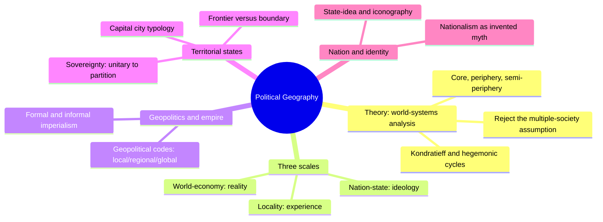
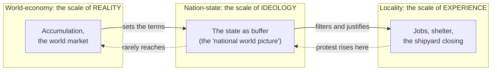
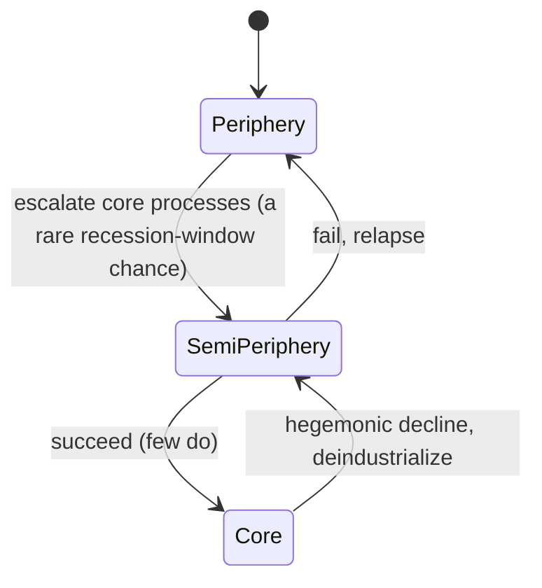
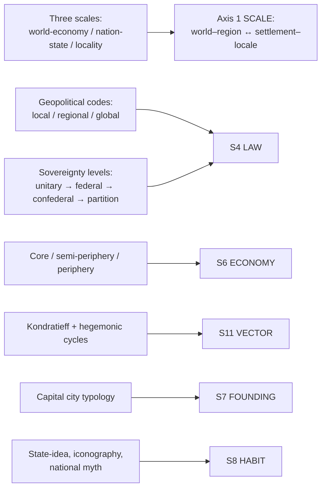

# BVX.1161 — Political Geography: World-Economy, Nation-State and Locality (5th ed.) — Colin Flint and Peter J. Taylor (2007)
### Knowledge Entry — Distill

A world-systems textbook that reads, essay for essay, as a real-world governance-and-economy toolkit for the SETTING shelf: it supplies the mechanism (core/periphery/semi-periphery, hegemonic cycles) and the artifacts (boundaries, capitals, sovereignty types, geopolitical codes) a writer needs to make a setting's political map behave like a system instead of a picture.

## TABLE OF CONTENTS
- [Core Thesis](#1-core-thesis)
- [Mind Models](#2-mind-models)
- [Framework](#3-framework--structure)
- [Key Concepts](#4-key-concepts)
- [Heuristics](#5-heuristics--decision-rules)
- [Invariants](#6-invariants)
- [Pitfalls](#7-pitfalls--myths)
- [Application](#8-application)
- [Cross-References](#9-cross-references)
- [Provenance](#10-provenance--confidence)

---

## 1 · CORE THESIS

A political map is built, not found: every border, capital and nation-state manages one underlying system, the capitalist world-economy sorted into core, periphery and semi-periphery. The nation-state is not above local and global politics; it is the ideological buffer between the locality where politics is felt and the world-scale where it is actually decided.

---

## 2 · MIND MODELS

*Required. Minimum two diagrams, maximum five.*

**Diagram 1 — the whole argument.**
Caption: *the book cascades down one scale ladder — theory first, then geopolitics and empire at the top, states and nations in the middle, locality and identity at the bottom.*

**Diagram 2 — the central mechanism (a process: the three-scale filter).**
Caption: *a problem caused at the world scale gets felt at the local scale, but the nation-state absorbs the protest before it travels back up — that is why nationalizing a shipyard never fixes falling global demand for ships.*

**Diagram 3 — a state change: rising and sinking through the semi-periphery.**
Caption: *core and periphery are the stable extremes; the semi-periphery is the only zone with real traffic — a state's rise or fall arc belongs there, not at the poles.*

**Diagram 4 — mapped onto the Command's SETTING SLICE.**
Caption: *the book's own subtitle already names Axis 1 SCALE; its governance and economy chapters land on S4 and S6 almost without translation.*

---

## 3 · FRAMEWORK / STRUCTURE

The book is organized by the same scale ladder its subtitle names, cascading top to bottom: Chapter 1 builds the theory (world-systems analysis, core/periphery/semi-periphery, the three scales); Chapters 2–3 work the global scale (geopolitics, geopolitical world orders, formal and informal imperialism); Chapters 4–6 work the nation-state scale (territorial states, boundaries and sovereignty, nation and nationalism, electoral geography); Chapters 7–8 work the local scale (locality politics, world cities, place and identity politics). No chapter treats its scale in isolation — each explicitly threads back to the world-economy that the opening chapter establishes as the one underlying system.

---

## 4 · KEY CONCEPTS

| Concept | What it is | Why it matters |
|---|---|---|
| **World-systems analysis** | Rejects the "multiple-society assumption" (treating Britain, Brazil, China as independent societies); there is one modern world-system, the capitalist world-economy | The single theoretical spine the whole book runs on; every later chapter is this idea applied to one topic |
| **Core / periphery / semi-periphery** | Not places but *processes* — core processes mean high wages, advanced technology, diversified production; peripheral processes mean low wages, simple production; the same raw material (cotton vs. wool, hardwood vs. softwood) can be produced by either process | Explains why "rich" and "poor" regions shift (Japan's rise, Western deindustrialization) instead of being fixed labels |
| **The semi-periphery** | The dynamic middle category — neither core nor peripheral processes dominate; states rise and sink through it, mostly during recessions | The load-bearing concept for any political map that needs states to change rank over the story's timeline |
| **Kondratieff cycles** | ~50-year A-phase (growth, new technology bundle) / B-phase (stagnation, relocation of industry) waves in the world-economy | Gives a setting's economy a rhythm instead of a static snapshot; political behavior tracks these waves |
| **Hegemonic cycles** | Rare (three times: Dutch, British, American), built through primacy in production → commerce → finance, always followed by decline | A slower, ~100-year arc layered over Kondratieff waves; explains why a dominant power's fall is structural, not accidental |
| **Three scales as reality/ideology/experience** | World-economy = reality (where accumulation actually happens); nation-state = ideology (the buffer, the "national world picture"); locality = experience (where it's felt, jobs and shelter) | The book's central mechanism: one process manifest at three scales, not three separate processes |
| **Geopolitical codes** | A state's operational foreign-policy assumptions: its interests, external threats, and planned response, running at local/regional/global levels depending on its reach | Small states get only a local code; regional powers add a regional code; only a few states ever hold a global code |
| **Frontier vs. boundary** | Frontier = an outward-facing zone of contact ("the spearhead of civilization"); boundary = an inward-facing definite line of separation | A frontier converts into a boundary as expansion closes; the distinction dates and characterizes a border on sight |
| **Five boundary types** | Natural (rivers, mountains), national (ethnic/linguistic), contractual (geometric treaty lines, e.g. the 49th parallel), and buffer states (Afghanistan, Thailand) between rival powers | Core boundaries tend natural/national; competitive peripheral boundaries (colonial Africa) tend contractual and arbitrary — the type telegraphs the history |
| **Centripetal / centrifugal forces and the state-idea** | Centrifugal forces (uneven development, ethnic division) pull a state apart; centripetal forces (a strong "state-idea" or iconography — flag, founding myth, constitution) hold it together | A state's cohesion is an ongoing contest, not a given once borders are drawn |
| **Capital city typology** | Three types by world-economy process: core/organic (London, Paris — grew with the region), peripheral/primate (Buenos Aires — disproportionately large, extractive), semi-peripheral/relocated (Moscow→St Petersburg→Moscow, Istanbul→Ankara, Rio→Brasília — moved inland as a deliberate break from core-linked coastal capitals) | A capital's location and history is a political choice with a legible typology, never just "the biggest city" |
| **Levels of sovereignty** | Unitary (undivided, e.g. Britain), federal (split between two governments, e.g. the US), confederal (looser, states retain exit rights, e.g. the EU), partition (sovereignty fails outright, e.g. the USSR's breakup) | Sovereignty is a spectrum of degrees, not a single yes/no property a state either has or lacks |
| **Scope of conflict / scale of democracy** | Whoever sets the boundary of *who votes* effectively decides the outcome before ballots are cast; parties in a losing position try to change the scale (local → national → international) of a dispute | Democracy is not scale-neutral; redrawing the electorate is itself the most consequential political act available |

---

## 5 · HEURISTICS & DECISION RULES

| Situation | Do this | Not this |
|---|---|---|
| Drawing a border on the setting's map | Pick a type deliberately — natural (river/mountain), national (ethnic/cultural), or contractual (a straight treaty line) — and let that choice signal the border's history | Draw an arbitrary line with no logic and no story behind it |
| Placing a capital city | Decide its type: core/organic (grew with the country), peripheral/primate (built oversized to extract), or semi-peripheral/relocated (moved inland to break an old core tie) | Default every capital to "the biggest city" with no history behind the choice |
| Giving a nation cohesion | Give it a state-idea or iconography (founding myth, flag, constitution) strong enough to outweigh its centrifugal pulls (regional inequality, ethnic division) | Assume drawn borders alone hold a nation together |
| Writing a faction's foreign policy | Write a geopolitical code: every faction gets a local-threat assessment; only regional and global powers get regional/global codes on top | Give every faction, regardless of size, a global-scale worldview |
| Placing a faction on the political map | Decide if it runs core processes (high-tech, diversified, high-wage), peripheral processes (single-resource, low-autonomy), or a mixed semi-peripheral position (exploits one side, is exploited by the other) | Treat "rich" and "poor" factions as fixed regional labels instead of relations that can shift |
| Arcing a faction's power over the plot | Move it through the semi-periphery — that is where rise and fall structurally happen, mostly during a system-wide downturn | Keep every faction's power ranking static across the whole timeline |
| Resolving who gets to vote or secede | Remember that the boundary of the electorate decides the result before a single vote is cast | Treat a referendum as a neutral, scale-free solution to a territorial dispute |
| Writing local grievance scenes | Show the grievance as the felt *experience* of a cause set at the world scale, filtered through the nation-state's *ideology* | Write local politics as self-contained, disconnected from any wider system |

---

## 6 · INVARIANTS

1. **No place's politics is explained by its own scale alone.** Local, national, and global processes are one system, read from three altitudes.
2. **Core, periphery, and semi-periphery are relations produced by processes, not fixed labels stuck on regions.** The same zone can flip category over time.
3. **Boundaries and capitals are artifacts of specific historical struggles between centripetal and centrifugal forces, never neutral lines or default choices.**
4. **Sovereignty is a spectrum (unitary → federal → confederal → partition), not a binary a state either has or has not.**
5. **Systems cycle.** Economic booms (Kondratieff A-phases) and hegemonic dominance are structurally followed by stagnation and decline, not derailed by accident.
6. **Whoever sets the scale or scope of a political question — an election's boundary, a conflict's declared "sides" — has already largely decided its outcome.**

---

## 7 · PITFALLS / MYTHS

- Treating "rich core, poor periphery" as a map of permanently fixed places rather than of processes that migrate (Japan's twentieth-century rise; Western deindustrialization).
- Assuming a capital city is simply "the biggest city" — capitals are deliberate political choices with a legible typology (core, primate, relocated).
- Writing a colonial-style boundary (a straight contractual line cutting through ethnic groups and river basins) as if it behaves the same on the ground as an organically grown national boundary.
- Believing an election or referendum is a neutral, scale-free way to resolve a territorial dispute — the boundary of the electorate predetermines the winner.
- Giving a nation a single, uniform, uncontested identity when real nationalism is assembled from competing myths, golden ages, and chosen-history claims.
- Explaining a state's power shift by looking only at that state, missing the world-system-wide cycle (Kondratieff, hegemonic) it is riding.

---

## 8 · APPLICATION

- **Spine level:** SETTING (non-story-spine source; keys to the entity beside the L0–L7 spine, per the setting-as-Domain-embodied binding rule)
- **12-layer character stack:** none directly — this is a setting-side source; a faction's geopolitical code (its named threats, its planned response) is structurally the same move as auditing an L4 WILL commitment, just run at state scale instead of person scale
- **plot_systems:** strong candidate once `04_PLOT_SYSTEMS/` opens — the core/semi-periphery/periphery engine and the Kondratieff/hegemonic cycle stack are ready-made generators of interstate pressure and timed conflict; a faction's semi-periphery transit (rising or sinking) is a natural act-length arc
- **Setting:** primary — feeds s4_law, s6_economy, s7_founding, s8_habit, and s11_vector at primary strength, plus a cross-cutting `scale_ladder` variable that keys the book's world-economy/nation-state/locality trilogy directly onto Axis 1 SCALE

The book's real value for the setting shelf is that it never treats "the political map" as static geography — every artifact (a boundary, a capital, a constitution) is read as the current settled state of an ongoing contest between processes operating at different scales. That is directly stealable as a TTRPG/worldbuilding method: instead of drawing borders and then inventing governments to fill them, decide first which world-economy process (core, periphery, semi-periphery) each region runs, and let borders, capitals, and sovereignty type fall out as the visible residue of that decision. Tested against the sibling GURPS Space distill (BVX.1146): its Ch.7 "Interstellar Governments" ladder (Anarchy → Alliance → Federation → Corporate State → Empire) is a science-fiction-flavored compression of exactly this book's sovereignty spectrum and hegemonic-cycle logic, confirming the mapping runs cleanly from real-world theory to genre toolkit.

---

## 9 · CROSS-REFERENCES

| Related entry | Relation |
|---|---|
| [[BVX.1146]] | GURPS Space (4th ed.) — sibling SETTING-shelf source; its Interstellar Governments chapter is the SF-toolkit compression of this book's sovereignty spectrum and hegemonic-cycle logic, same S4/S6/S7/S11 feed profile |
| [[BVX.0458]] | The Kobold Guide to Worldbuilding — sibling SETTING-shelf source; Baur's tribe/city-state/nation binding-principle essay is the TTRPG-craft cousin of this book's academic sovereignty-levels and geopolitical-code framework |
| [[BVX.1122]] | GURPS Hot Spots: Renaissance Venice — a worked S4_law instance (the Apparatus of Power chapter, Council of Ten, sumptuary law) that this book's governance theory abstracts from |
| [[BVX.0349]] | Against Worldbuilding, and Other Provocations — counter-argument sibling; a caution against mapping every boundary type and sovereignty level onto a setting instead of only the ones that carry present pressure |

---

## 10 · PROVENANCE & CONFIDENCE

Plain-text extraction supplied for this task (not yet a Zotero-held PDF; `zotero_key` left empty, `bvx_provisional: true` per brief, pending the library's formal index pass). Read in full or near-full: the front matter and preface; Chapter 1, "A world-systems approach to political geography" (world-systems analysis, core/periphery/semi-periphery, Kondratieff cycles, the three-scales model, the Wallsend shipbuilding example); the geopolitical-codes and world-orders section of Chapter 2; and the territorial-states material of Chapter 4 (frontier vs. boundary, the five boundary types, capital-city typology, dividing up the state, federalism and partition, sovereignty levels). Sampled via targeted search rather than read end to end: Chapter 3 (imperialism), the remainder of Chapter 2 (hegemonic cycles, the War on Terrorism material), Chapter 5 (nation and nationalism — state-idea, iconography, national myth confirmed via targeted passages), and Chapters 6–8 (electoral geography, locality politics, place and identity — the "neighbourhood effect" and "world cities" material sampled, not deep-extracted). The extraction has no reliable PDF pagination; `pdf_pages: 360` is an estimate from the highest index page numbers visible in the text (index entries running past p.345), not a verified page count.

The `spine: [SETTING]` and empty character-stack application are asserted per the v4 template's binding rule (setting is an entity beside the spine, never an L0–L7 rung). The S-layer keying in `feeds:` and Diagram 4 is this distill's own synthesis against `ssot_03_setting_system.md`'s twelve-layer SETTING SLICE and Axis 1 SCALE, following the same inference method BVX.1122 and BVX.1146 used: mapping a source's own vocabulary onto the Command's schema, not a source-stated correspondence.

## META
- Template: BVX-LEARN-v4.0
- Source classification: academic textbook, plain-text extraction, deep read on Ch.1 and Ch.4, targeted sampling elsewhere
- Created / Updated: 2026-09-29
