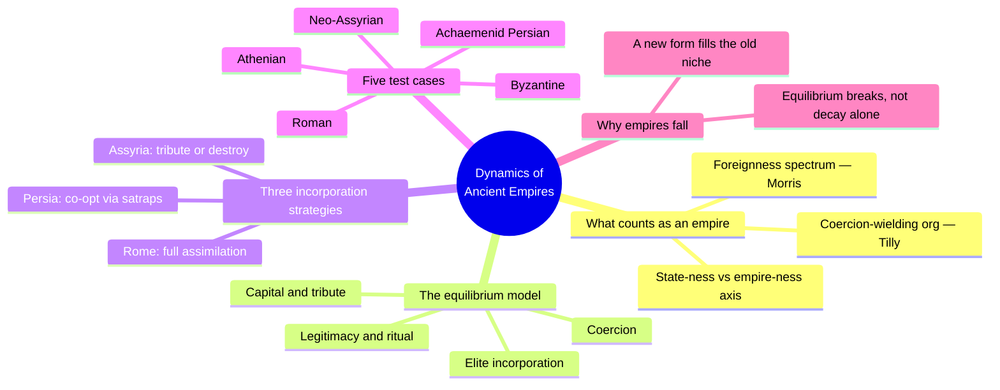
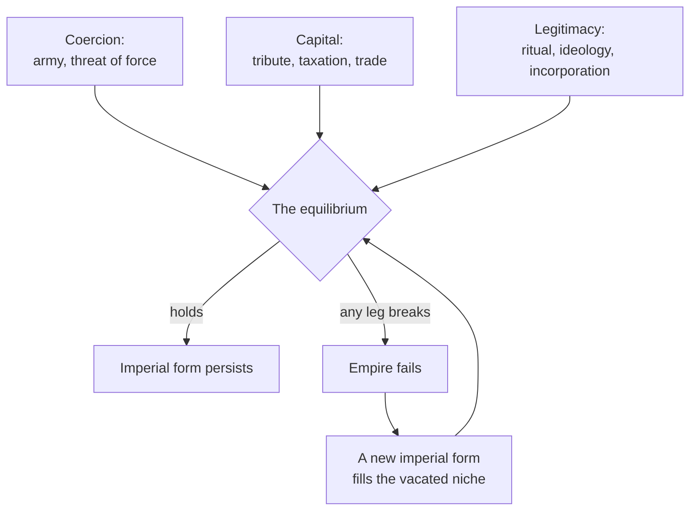
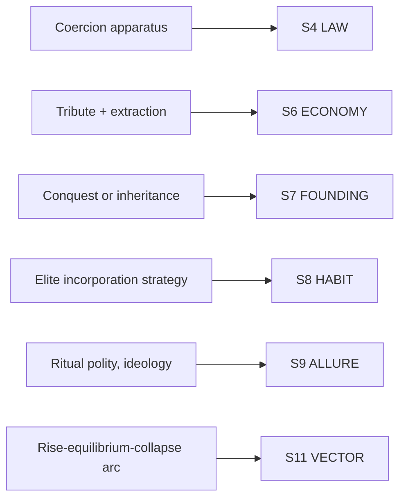

# BVX.1162 — The Dynamics of Ancient Empires: State Power from Assyria to Byzantium — ed. Ian Morris & Walter Scheidel (2009)
### Knowledge Entry — Distill

A Stanford-conference volume of comparative ancient history. Its introduction (Goldstone & Haldon) supplies a working model of what an empire *is* and how it survives; five case-study chapters (Neo-Assyrian, Achaemenid, Athenian, Roman, Byzantine) then test that model against real states. A toolkit for building an empire in a setting, not just reading about five of them.

## TABLE OF CONTENTS
- [Core Thesis](#1-core-thesis)
- [Mind Models](#2-mind-models)
- [Framework](#3-framework--structure)
- [Key Concepts](#4-key-concepts)
- [Heuristics](#5-heuristics--decision-rules)
- [Invariants](#6-invariants)
- [Pitfalls](#7-pitfalls--myths)
- [Application](#8-application)
- [Cross-References](#9-cross-references)
- [Provenance](#10-provenance--confidence)

---

## 1 · CORE THESIS

An empire is a dynamic equilibrium, not a bigger state: coercion, capital extraction, and legitimacy must stay in balance against elite loyalty and popular consent, or it collapses. Successive empires are different solutions to one design problem — how to bind conquered peoples — tried three ways: destroy-or-tribute, co-opt local elites, or fully assimilate them.

---

## 2 · MIND MODELS

*Required. Minimum two diagrams, maximum five.*

**Diagram 1 — the whole argument.**
Caption: *the book sorts into a definitional layer (what counts as an empire), an equilibrium model (how one survives), and five test cases run against both.*

**Diagram 2 — the central mechanism (a state change: the equilibrium holding or breaking).**
Caption: *coercion, capital, and legitimacy are three separate inputs into one balance — losing any one is enough to break it, and a broken empire is replaced, not repaired.*

**Diagram 3 — mapped onto the Command's SETTING SLICE.**
Caption: *the book's own vocabulary lands cleanly on six of the twelve slice layers — an empire is a fully-worked S-layer instance, not a separate schema.*

---

## 3 · FRAMEWORK / STRUCTURE

Seven chapters, two registers. Chapter 1 (Goldstone & Haldon) is the theory: it asks what a state is, what makes an empire different from a state, and what keeps either one alive. Chapters 2 through 6 are five case studies, each written by a specialist in that empire, each implicitly testing the introduction's model against one historical run:

| Chapter | Author | Empire | What it tests |
|---|---|---|---|
| 1 — Ancient States, Empires, and Exploitation | Goldstone & Haldon | (theory) | Defines state, empire, and the coercion/capital/legitimacy equilibrium |
| 2 — The Neo-Assyrian Empire | Bedford | Assyria | The cheapest incorporation strategy: tribute or annihilation |
| 3 — The Achaemenid Empire | Wiesehöfer | Persia | Co-optation of local elites through satraps and marriage |
| 4 — The Greater Athenian State | Morris | Athens | Whether a capital-intensive state that stays low-foreignness is an empire at all |
| 5 — The Political Economy of the Roman Empire | Hopkins | Rome | Full assimilation, and how capital (wheat dole, army pay) buys political order |
| 6 — The Byzantine Empire | Haldon | Byzantium | A mature, embedded imperial form under long-term fiscal and territorial strain |
| 7 — Sex and Empire | Scheidel | (comparative) | Imperial power converted into reproductive privilege across many empires |

The editors did not impose a template; each contributor emphasizes whatever the surviving evidence supports. The introduction, not the case studies, is where the comparative through-line lives. The five empires are proof-of-concept runs of one model, not five unrelated portraits.

---

## 4 · KEY CONCEPTS

| Concept | What it is | Why it matters |
|---|---|---|
| **Coercion-wielding organization (Tilly)** | A state is an organization, distinct from households or kin groups, that holds clear priority over other organizations in a territory. Covers city-states, empires, and theocracies alike | A single, size-independent definition; makes empires a *subtype* of state, not a different category |
| **Foreignness spectrum** | Empire-ness is measured by the sense of ethnic, linguistic, religious, and cultural distance between rulers and ruled, not by territorial extent | Fifth-century Athens ruled a large, wealthy, militarily dominant "arché" but stayed low on this axis, so the book argues it was never really an empire |
| **State-ness / empire-ness × power** | A two-axis space (Morris, after Tilly). One axis runs state-ness to empire-ness (foreignness); the other is raw power (military, fiscal, organizational) | Lets a writer place any polity on the grid before deciding what kind of thing it is. Power and empire-ness vary independently |
| **The equilibrium model** | Imperial stability is an ongoing dynamic balance among coercion, capital extraction, and legitimacy, plus center-elite relations, not a fixed institutional structure | Reframes decline and fall as equilibrium breakdown, not simple decay. Any one leg failing is enough |
| **Three incorporation strategies** | Assyria: recognize suzerainty and pay tribute, or be destroyed, with no path into the elite. Persia: co-opt local rulers into an alliance, often through marriage, via satraps who straddle both worlds. Rome: full ideological and institutional remaking, so local elites become Roman and local gods enter the Roman pantheon | The three empires solved the *same* problem, what to do with a newly conquered population, three structurally different ways. The book's most reusable comparative finding |
| **Ritual polity, legitimacy as ongoing cost** | Rulers actively invest surplus resources in ritual, temple economies, and cult incorporation to keep legitimating their rule. Legitimacy is manufactured continuously, not declared once | Explains why states that lose coercive or fiscal capacity can still survive for generations on ideological integration alone (the late Byzantine and Holy Roman examples) |
| **Mature vs. young states** | Newly formed conquest states are parasitic consumers of extracted wealth with no embedding in local society. Mature states have generations of institutional and ideological interweaving with the social fabric | A conquest empire and a centuries-old empire face structurally different survival problems even with similar coercive and fiscal numbers |
| **Segmentary, multicentered states** | Some early polities function as confederated, ritual-bound networks (South Indian temple states, some Mesoamerican "segmentary" states) where consensus and ideology do as much work as central coercion | Not every large polity centralizes the same way. A setting can have empires that rule mainly through ritual/tribute networks rather than administrative bureaucracy |
| **Macro, meso, micro causal levels** | Macro: long-run ecological/geographic constraints (Diamond-style). Meso: specific cultural-political systems in a geographic zone. Micro: local, contingent variation in kinship, resources, and power | A three-scale checklist for explaining why an empire arose here and not there, without collapsing everything into one cause |
| **Unofficial infrastructure** | Household administrations, kin-based inheritance networks, and record-keeping and accounting systems exist before and beneath any official state apparatus, and outlast individual rulers' reforms | An empire's bureaucracy is not authored by one lawgiver. It is a many-headed accretion of pre-existing local systems the center partially captures |
| **Capital-intensive state formation (Athens)** | Fifth-century Athens's silver strike funded a fleet, producing a quantum leap in state capacity and administrative sophistication with no corresponding rise in foreignness | Growing military and fiscal power and becoming an empire are independent variables. A state can militarize hugely and still not "go imperial" |
| **Capital bought as legitimacy (Rome)** | Rome subsidized a free wheat dole to roughly 200,000 to 250,000 citizens, and depoliticized its army through long frontier service, short officer tenures, and large retirement bonuses | A concrete mechanism for converting extracted wealth directly into political quiescence. Bread and circuses as an engineered control system, not a cliché |

---

## 5 · HEURISTICS & DECISION RULES

| Situation | Do this | Not this |
|---|---|---|
| Standing up a new empire in the setting | Pick one of the three incorporation strategies (destroy-or-tribute, co-opt elites, full assimilation) before writing any provincial detail | Invent province-by-province flavor with no consistent policy toward conquered peoples |
| Deciding if a polity counts as an "empire" | Measure the foreignness between its rulers and its ruled (ethnicity, language, religion, culture) | Measure only its map size or army size |
| Writing an empire's decline | Identify which leg of the equilibrium failed first — coercion, capital, or legitimacy | Default to vague "internal decay" or "corruption" as the whole explanation |
| Giving an empire staying power | Give it a continuous legitimacy expense — cult incorporation, ritual, redistribution, a citizen dole | Assume legitimacy, once declared by a founding myth, is permanent |
| Building the empire's administration | Assume it grew from pre-existing household, kin, and record-keeping networks the center co-opted | Invent a single founding lawgiver who designed the whole bureaucracy at once |
| Populating a setting with several empires | Give each a different answer to "what happens to a newly conquered elite" | Reuse one imperial house-style for every empire in the setting |
| Explaining why State A militarized without going imperial | Separate capacity growth (fiscal, military, administrative) from foreignness growth — they move independently | Assume any state that gets powerful enough automatically becomes an empire |
| Plotting a rebellion or succession crisis | Target the equilibrium leg already under the most strain in that empire | Write a generic uprising with no structural cause tied to coercion, capital, or legitimacy |
| Comparing "mature" and "young" empires in one setting | Give the young one parasitic, extraction-first behavior and the old one deep social embedding | Treat every empire's relationship to its own population as equally settled |

---

## 6 · INVARIANTS

1. An empire is a state marked by strong foreignness between ruler and ruled, not simply a big or multi-region state. Scale and empire-ness are independent variables.
2. Imperial stability is a dynamic equilibrium among coercion, capital extraction, and legitimacy, continuously maintained, never a structure built once and left standing.
3. Every incorporation strategy trades reach against depth: destroy-or-tribute is cheap and shallow, co-optation is moderate in both, full assimilation is deep, slow, and expensive.
4. Legitimacy must be purchased on an ongoing basis, through ritual, ideology, incorporation of local cults, or material redistribution, not established once and banked.
5. Records, household administration, and kin-based networks are the substrate beneath any official imperial government, and they precede and outlast any single ruler's reforms.
6. Imperial forms are historically contingent solutions to a specific power-extension problem. When underlying conditions shift, the old form fails and a new one, better fitted, fills its niche.
7. A state's coercive, fiscal, and administrative capacity can grow substantially without increasing its empire-ness, if the foreignness between rulers and ruled stays low.

---

## 7 · PITFALLS / MYTHS

- Equating "empire" with "big state," ignoring the foreignness axis the book treats as the actual defining test.
- Assuming imperial collapse is always internal decay or corruption. The book insists collapse is an equilibrium breakdown that can start in coercion, capital, or legitimacy alone.
- Giving every empire in a setting the same incorporation style. The book's whole comparative point is that Assyria, Persia, and Rome chose three genuinely different answers to the same problem.
- Treating legitimacy as free once a founding myth is declared, rather than as a resource that must be continually reinvested.
- Writing an empire's bureaucracy as the invention of one lawgiver, ignoring the pre-existing household, kin, and record-keeping networks any real administration is built from.
- Mistaking a proto-state or tribal confederacy under a strong warlord for an empire. The book separates "Big-man" confederacies, rarely durable, from states from empires.
- Assuming rising military or fiscal power automatically means a state is becoming an empire. Athens is the book's own counter-case: it militarized hugely and stayed low-foreignness throughout.

---

## 8 · APPLICATION

- **Spine level:** SETTING (non-story-spine source; keys to the entity beside the L0–L7 spine, per the SETTING SSOT's binding rule that setting is a Domain embodied, never a level)
- **12-layer character stack:** none directly — this is a setting-side source, though the three incorporation strategies (destroy-or-tribute, co-opt, assimilate) are structurally the same choice a character makes toward an outsider at L8 IMPRINT, just run at institutional scale
- **plot_systems:** contextual candidate once `04_PLOT_SYSTEMS/` opens — Diagram 2's equilibrium-break mechanism is a ready-made generator for rebellion, succession-crisis, or slow-collapse arcs: pick the leg (coercion, capital, legitimacy) under the most strain and build the plot from its failure
- **Setting:** primary — feeds S4 LAW and S6 ECONOMY at full strength (coercion apparatus and tribute/taxation are the book's two central mechanisms), S8 HABIT at full strength (the three-strategy incorporation menu), S7 FOUNDING and S9 ALLURE as supporting, S11 VECTOR primary for the rise/equilibrium/collapse arc, plus L7's state-ness/empire-ness measuring tool

This book earns its place on the setting shelf precisely because it is not a worldbuilding book: it is a working comparative model built by historians asking "how did these five things actually function," which makes it a harder, more load-bearing toolkit than a TTRPG-authored equivalent would be. The steal for a writer building an empire from scratch is the sequence itself: first decide the foreignness level (is this really an empire, or a large low-foreignness state like fifth-century Athens), then pick an incorporation strategy for conquered populations, then decide what the empire spends on legitimacy and what it extracts as tribute, and only then write provincial detail — because in the book's own case studies, administration and culture are downstream of that sequence, never upstream of it. The equilibrium model doubles as a diagnostic for any already-built empire in a setting: naming which leg (coercion, capital, legitimacy) is currently weakest tells a writer exactly where the empire's live plot pressure is.

---

## 9 · CROSS-REFERENCES

| Related entry | Relation |
|---|---|
| [[BVX.0458]] | Kobold Guide to Worldbuilding — TTRPG-craft sibling on the SETTING shelf; that book's S4 LAW essay (tribe/city-state/nation, keyed to binding principle) is the game-design-register cousin of this book's coercion/capital/legitimacy model, worked from the other direction |
| [[BVX.1122]] | GURPS Hot Spots: Renaissance Venice — a worked instance of a non-empire polity (a city-state under distant imperial suzerainty); useful contrast case for where a setting's polity sits on this book's state-ness/empire-ness axis |
| [[BVX.0349]] | Against Worldbuilding, and Other Provocations — shares this book's structural instinct that a setting element (here, an empire) is a solution to a pressure/design problem, not an inventory to complete |

---

## 10 · PROVENANCE & CONFIDENCE

Full text, pdftotext extraction (~155,000 words across 384pp). Read in full: front matter (preface, contents, contributor bios) and Chapter 1, "Ancient States, Empires, and Exploitation: Problems and Perspectives" (Goldstone & Haldon, pp. 3–29 including endnotes) — the introduction the brief names as the primary target, and the source of the coercion/capital/legitimacy/tribute model, the three-strategy comparative through-line (Assyria/Persia/Rome), the dynamic-equilibrium model, and the macro/meso/micro framework.

Sampled at depth: Chapter 4, "The Greater Athenian State" (Morris) — section 5, "Key Concepts" (Arché/empire/foreignness/state, the Doyle/Mann/Tilly definitions, the state-ness-versus-empire-ness-by-power model), read in full; the chapter's narrative sections (evidence, basic narrative, secondary state formation) were not read. Chapter 5, "The Political Economy of the Roman Empire" (Hopkins) — section 6, "Configurations of Power" (emperors and aristocrats, the city of Rome and the wheat dole, the army's depoliticization), read in full; the fiscal-system and economic-growth sections were sampled only at their openings.

Sampled at headers/table-of-contents level only, not deep-extracted: Chapter 2 (Neo-Assyrian Empire, Bedford), Chapter 3 (Achaemenid Empire, Wiesehöfer), and Chapter 6 (Byzantine Empire, Haldon) — their section structure was reviewed to confirm each case study parallels the introduction's model, but their case-specific detail is not represented in this distill. Chapter 7, "Sex and Empire" (Scheidel), was sampled in its opening argument and its "Despotic Empires" and "Mediterranean Empires" sections; it is comparative but addresses reproductive privilege rather than the coercion/capital/legitimacy/tribute model this distill is scoped to, and its content is not drawn on above.

The S-layer keying in frontmatter `feeds:` is this distill's synthesis against `ssot_03_setting_system.md` (the twelve-layer SETTING SLICE); no `zotero_key` was available for this new-catalog entry, and `bvx_provisional: true` is set per the tasking brief pending catalog confirmation.

## META
- Template: BVX-LEARN-v4.0
- Source classification: full-text extraction, deep read on the introduction and two of five case studies, header-level sampling on the remaining three plus the comparative closer
- Created / Updated: 2026-09-29
