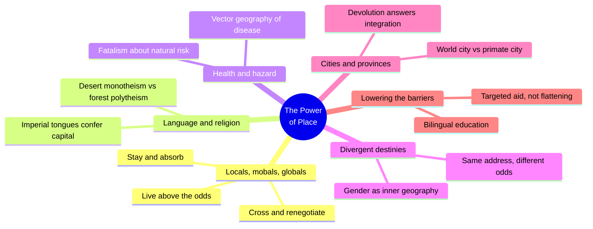
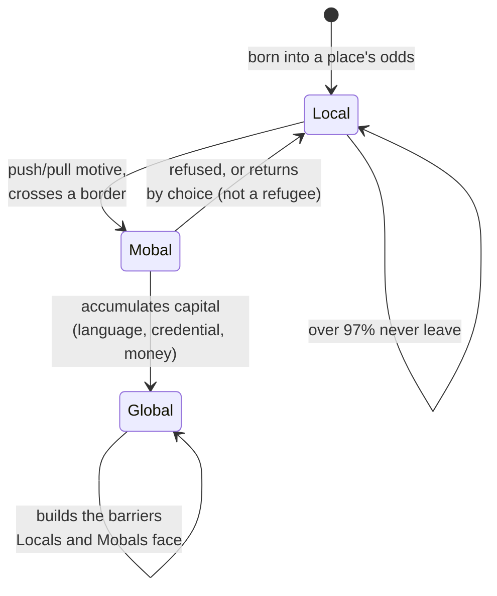
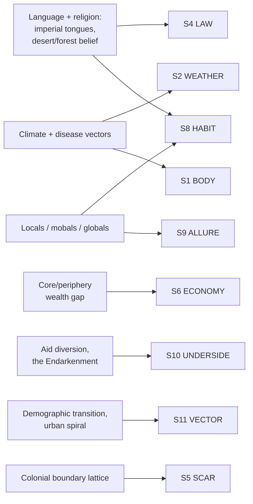

# BVX.1163 — The Power of Place: Geography, Destiny, and Globalization's Rough Landscape — Harm de Blij (2009)
### Knowledge Entry — Distill

A geographer's rebuttal to "the world is flat": place of birth still assigns language, religion, health, and hazard odds to billions before any choice enters the picture; the first SETTING-shelf source built from real-world data rather than TTRPG or fiction craft, read here as a generator for what a place of birth does to the people born there.

## TABLE OF CONTENTS
- [Core Thesis](#1-core-thesis)
- [Mind Models](#2-mind-models)
- [Framework](#3-framework--structure)
- [Key Concepts](#4-key-concepts)
- [Heuristics](#5-heuristics--decision-rules)
- [Invariants](#6-invariants)
- [Pitfalls](#7-pitfalls--myths)
- [Application](#8-application)
- [Cross-References](#9-cross-references)
- [Provenance](#10-provenance--confidence)

---

## 1 · CORE THESIS

Place of birth assigns a bundle of default odds before any choice is made: which language carries economic power, which religion's temperament you inherit, which diseases and hazards you are exposed to. That bundle sorts every life into one of three classes: local (absorbs the full odds), mobal (crosses a border to renegotiate them), or global (already lives above them).

---

## 2 · MIND MODELS

*Required. Minimum two diagrams, maximum five.*

**Diagram 1 — the whole argument.**
Caption: *ten chapters run the same odds-bundle through six different lenses — language, religion, health, hazard, gender, and scale — and the closing chapter tests what, if anything, actually narrows it.*

**Diagram 2 — the central mechanism (a state change, not a spectrum).**
Caption: *local is the default state everyone starts in; the two exits — becoming a mobal, becoming a global — take different fuel, and globals are the ones who then build the barriers the other two states have to cross.*

**Diagram 3 — mapped onto the Command's SETTING SLICE (S1–S12).**
Caption: *the book lands on six of twelve S-layers hard, with locals/mobals/globals itself reading as a ready-made S8 HABIT and S9 ALLURE generator — who belongs, and what pulls people across the line.*

---

## 3 · FRAMEWORK / STRUCTURE

Ten chapters, each running the same odds-bundle through a different lens, book-ended by the diagnosis (ch. 1) and the prescription (ch. 10):

| Chapter | Governing question |
|---|---|
| 1. Globals, Locals, and Mobals | What three mobility-classes does place of birth sort everyone into? |
| 2. The Imperial Legacy of Language | Which mother tongues carry capital, and which trap their speakers? |
| 3. The Fateful Geography of Religion | How does climate shape a religion's temperament and reach? |
| 4. The Rough Topography of Human Health | Why does disease geography track poverty, not just latitude? |
| 5. Geography of Jeopardy | Who lives on the fault lines and storm tracks, and why do they stay? |
| 6. Places Open and Shut | How do borders and landlockedness lock a population's odds in or out? |
| 7. Same Place, Divergent Destinies | What changes when the variable is gender, not location? |
| 8. Power and the City | What separates a networked "world city" from a "primate city"? |
| 9. Promise and Peril in the Provinces | Why does globalization provoke local reassertion instead of dissolving it? |
| 10. Lowering the Barriers | What actually narrows the gap, and what only looks like it does? |

---

## 4 · KEY CONCEPTS

| Concept | What it is | Why it matters |
|---|---|---|
| **Locals** | The large majority (well over 97%) who live and die near their birthplace, absorbing its full bundle of odds | The baseline population for any place; write them as the default, not "everyone else" around a mobile protagonist |
| **Mobals** | Voluntary risk-takers who cross a border, internal or international, chasing a specific opportunity | Distinct from refugees, driven out by conflict and wanting to return; collapsing the two flattens a real difference in motive |
| **Globals** | The mobile minority who set policy, control capital, build barriers, and genuinely experience a flattening world | The only class with agency over the setting's rules, not just its inhabitants |
| **Core-periphery** | ~15% of world population holds ~75% of income (the core); the pattern re-nests at every scale, nation inside world, block inside city | A fractal obstacle generator: the same rich/poor divide reappears at whatever scale you zoom into |
| **Species-richness gradient** | Low-latitude, wet zones harbor many small, non-dominant languages and religions; high-latitude/arid zones produce fewer, more hierarchical, expansionist ones | A rule for where a setting's "empire tongue" or "one true faith" should originate, and why lush regions rarely produce one |
| **Imperial legacy of language** | Being born speaking a globally dispersed tongue (English, Spanish, French) is inherited capital; a minority tongue is an inherited cost | A ready income/opportunity stat to assign a culture or character at creation |
| **The Endarkenment** | A cross-faith fundamentalist revival (Christian, Islamic, Hindu, Orthodox, Buddhist-nationalist) that hardens in reaction to globalization | A generator for reactionary factions on any religion, not just the designated "evil empire's" |
| **Vector geography** | Disease risk (malaria, cholera, dengue, schistosomiasis) tracks climate, standing water, and poverty together, not race or culture | A researchable way to make "the rough side of the world" costly instead of just described as rough |
| **Fatalism about hazard** | People knowingly settle floodplains, fault-line cities, and volcano slopes because a site's advantages outweigh its known risk | A motive for why a culture stays somewhere dangerous, instead of "they didn't know better" |
| **World city vs. primate city** | A world city (London, Miami) networks more to other world cities than to its own hinterland; a primate city (Rome, Rio) dominates only its own territory | Two different template answers to "what is your setting's capital actually for" |
| **Devolution paradox** | Supranational integration (the EU) provokes, rather than dissolves, provincial and ethnic reassertion (Flanders, Scotland) | A conflict generator: the more a setting's top integrates, the more its provinces separate underneath |
| **Gender as inner geography** | Within the same household, birthplace assigns different literacy, mortality, and longevity odds to a boy and a girl | A second, independent axis to run through any place, alongside class or ethnicity |

---

## 5 · HEURISTICS & DECISION RULES

| Situation | Do this | Not this |
|---|---|---|
| Assigning an NPC or culture's home region | Roll language-capital, religion-temperament, disease-exposure, and hazard-exposure together, from one climate band | Pick each one separately as unrelated flavor text |
| Writing a character who leaves home | Give them a specific push/pull motive and call them a mobal | Default them to a refugee, or wave away the motive as "wanderlust" |
| Wanting a "the world is flat" feel for a character | Make them a global: mobile, capital-holding, insulated from the barriers others face | Give every character equal freedom of movement by default |
| Designing a setting's dominant religion | Key its temperament (punitive/hierarchical vs. plural/ancestor-linked) to the climate it arose in | Copy real-world theology wholesale as unexamined flavor |
| Building tension between locals and outsiders | Root it in a language, religion, or habit gap the way the book documents | Default to "they just don't like foreigners" |
| Placing a capital or prestige city | Decide whether it is a world city (networked outward) or a primate city (dominates only its own territory) | Assume every capital works the same way |
| Writing a poor, remote character's arc | Treat their starting odds as pre-assigned, and earn any escape on the page | Let them access global-tier options with no cost shown for it |
| Showing a rich/poor contrast in one scene | Juxtapose core and periphery structurally in the same frame (the favela ringing the tower) | Segregate them into separate scenes that never touch |
| Depicting globalization spreading through a setting | Show it thinning the middle while thickening the edges at the same time | Show it as one uniform, one-directional flattening force |

---

## 6 · INVARIANTS

1. **Place of birth assigns a bundle of odds** (language capital, religion, health exposure, hazard exposure) before agency enters the story.
2. **The overwhelming majority of any population dies near where it was born.** The local is the baseline character, not the exception around a mobile protagonist.
3. **Mobals and refugees are not the same category.** Mobals move on an opportunity motive and can succeed by staying gone; refugees are driven out and want to return.
4. **Latitude and aridity correlate with a belief or language system's shape.** Warm, wet zones produce many small, non-dominant systems; dry, high-latitude zones produce fewer, more hierarchical, more exportable ones.
5. **Every scale of place reproduces a core-periphery split**, from the globe down to a single city block.
6. **Globalization integrates and provokes reassertion at the same time.** It thins some barriers while hardening others, never just one direction.
7. **Gender is a second, internal geography.** Within one household, birthplace confers different odds on a boy and a girl.

---

## 7 · PITFALLS / MYTHS

- Treating "the world is flat" as a setting's literal truth rather than an elite's-eye illusion locals do not share.
- Writing migration as uniformly aspirational or desperate, collapsing the mobal/refugee distinction into one flat type.
- Environmental determinism dressed as "this culture is just built different" — the book names and rejects this move (Huntington's racist climate theory) while still using climate as a real variable.
- Homogenizing a "developing" region into one monolith, when it has its own internal core-periphery structure (China's coast vs. interior; India's cities vs. its villages).
- Portraying a language's or religion's spread as free cultural choice, divorced from the imperial mechanism that actually carried it.
- Assuming urbanization means rising equality; cities often show the sharpest core-periphery contrast of all (favela ringing skyline).

---

## 8 · APPLICATION

- **Spine level:** SETTING (non-story-spine source; keys to the entity beside the L0–L7 spine, per the SETTING SSOT's rule that setting is a Domain embodied, never a level)
- **12-layer character stack:** none directly — this is a setting-side source, but the locals/mobals/globals typology functions as a pre-L1 seed: rolling a character's birthplace odds before any layer work starts, feeding forward into L6 DRIVE (what they want out from under) and L9 EROS (what a "flatter" life elsewhere promises)
- **plot_systems:** contextual candidate — a mobal's journey (a named push/pull motive, a specific border to cross, a specific cost of crossing) is a ready scene-and-arc generator; core-periphery walls are ready-made antagonist-vessel material with a real-world mechanism behind them
- **Setting:** primary — feeds eight of the twelve SETTING SLICE layers (S1, S2, S4, S6, S8, S9, S10, S11 at varying strength, S5 and S7 contextual)

Tested against the DCUS starter instance already in the SETTING SSOT: de Blij's Gulf-South climate-and-hazard material fills DCUS's flagged S2 WEATHER gap directly. More strikingly, locals/mobals/globals maps onto DCUS's own S8 HABIT record: the alumni-legacy bloc reads as locals (absorbing the campus's odds, resisting the rebrand), the Bishop acquisition capital reads as the global tier (holding capital, building the Star-Rating barrier), and Sync-era transfers read as mobals (crossing in on a named opportunity motive, at a named cost). The book's present-tense discipline for history also confirms the SSOT's own S7 fill rule. Its silence on S3 SENSORIUM (data, not prose) and S12 FUNCTION (no storyform vocabulary) matches gaps the Kobold Guide distill already flagged as expected.

---

## 9 · CROSS-REFERENCES

| Related entry | Relation |
|---|---|
| [[BVX.0458]] | Kobold Guide to Worldbuilding — the SETTING shelf's founding TTRPG-craft distill; that entry is the toolkit for building a place, this one is the real-world data generator for what a place of birth does to the people already in it |
| [[BVX.1122]] | GURPS Hot Spots: Renaissance Venice — a worked single-place instance; this book supplies the global comparative frame (core/periphery, language/religion/health odds) that a single-city gazetteer like Venice can be checked against |
| [[BVX.0349]] | Against Worldbuilding, and Other Provocations — the counter-argument that worldbuilding should serve pressure, not inventory; de Blij's own chapter-by-chapter discipline (cite history, health, or hazard only where it still sets present odds) is the nonfiction mirror of that same warning |

---

## 10 · PROVENANCE & CONFIDENCE

Full text, pdftotext extraction, 267pp, clean text layer, machine-readable table of contents. Read in full: Preface; Acknowledgments; Chapter 1, "Globals, Locals, and Mobals"; Chapter 2, "The Imperial Legacy of Language"; Chapter 3, "The Fateful Geography of Religion"; Chapter 4, "The Rough Topography of Human Health." Sampled with targeted ranged reads across openings, core arguments, and closes: Chapter 5, "Geography of Jeopardy" (hazard fatalism, tectonic risk); Chapter 6, "Places Open and Shut" (landlocked-state trap); Chapter 7, "Same Place, Divergent Destinies" (gender-gap data); Chapter 8, "Power and the City" (world city vs. primate city); Chapter 9, "Promise and Peril in the Provinces" (devolution paradox); Chapter 10, "Lowering the Barriers" (aid, migration policy, convergence). Works Cited and Index not extracted.

The S-layer keying in `feeds:` and Diagram 3 is this distill's own synthesis against the SETTING SSOT schema; the DCUS cross-check in §8 is a candidate reading pending Chief's ruling. `zotero_key` is blank because the source sits as a PDF drop with no Zotero item yet; `id` and `bvx_provisional: true` are assigned per the tasking brief, ahead of the library's next indexing pass.

## META
- Template: BVX-LEARN-v4.0
- Source classification: full-text book, deep extraction on chapters 1–4, sampled on chapters 5–10
- Created / Updated: 2026-09-29
