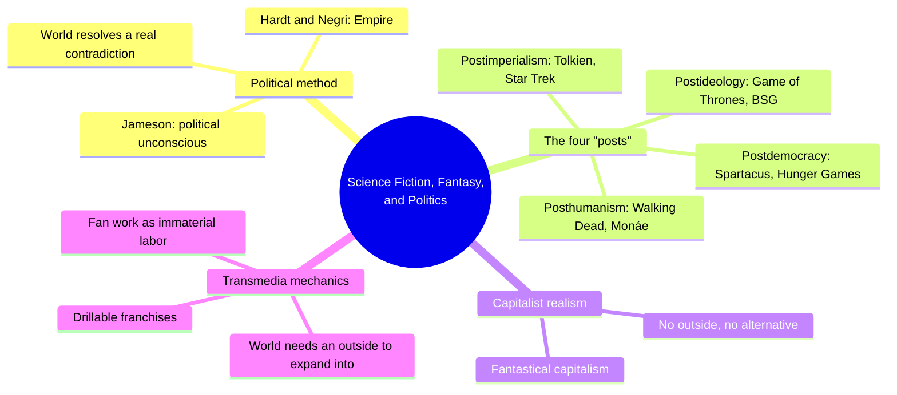
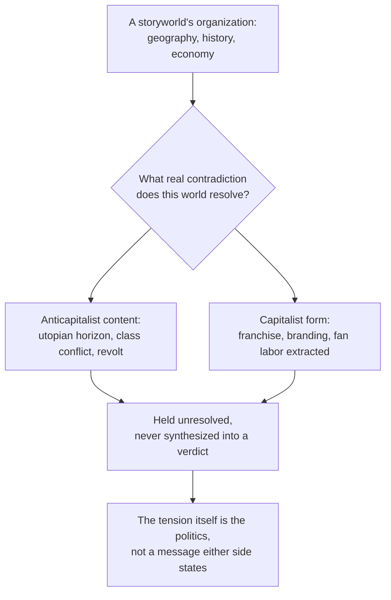
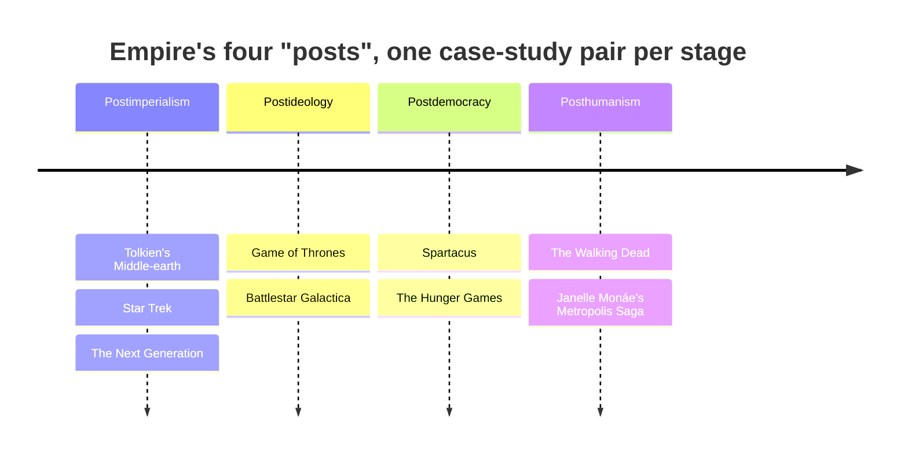
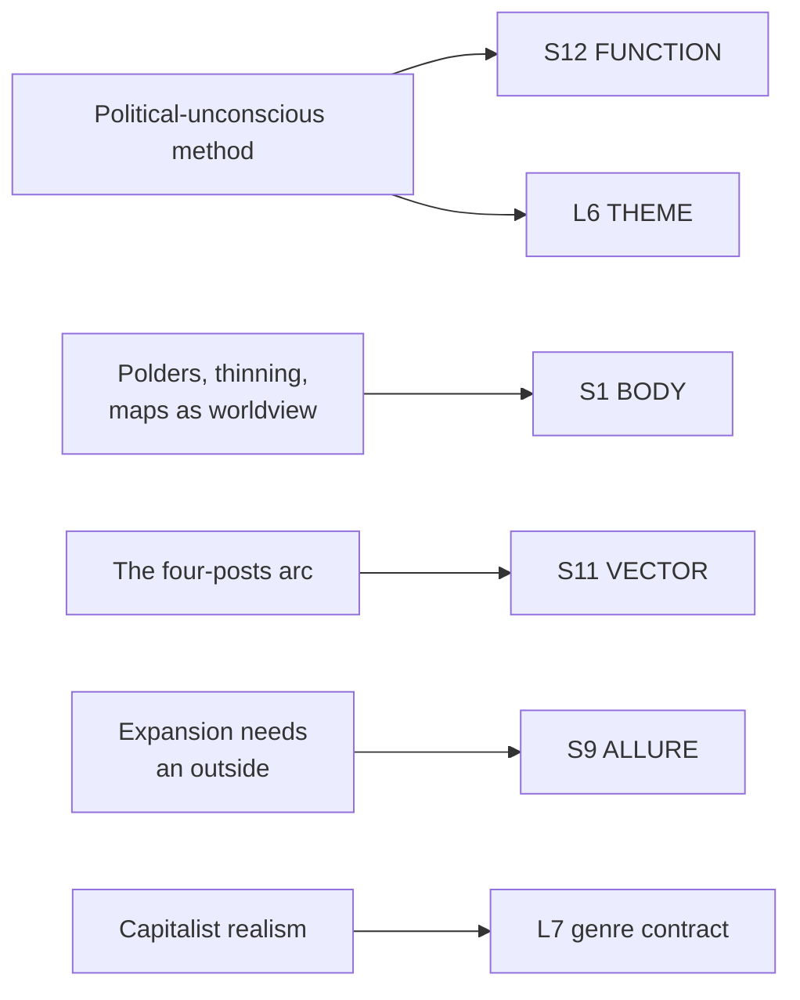

# BVX.1164 — Science Fiction, Fantasy, and Politics: Transmedia World-Building Beyond Capitalism — Dan Hassler-Forest (2016)
### Knowledge Entry — Distill

A media-studies argument that every science fiction and fantasy storyworld is a political machine before it is a story: its geography, history, and economy quietly resolve a real contradiction in the world its audience actually lives in, and transmedia franchises intensify this by needing endless expansion the same way capitalism does.

## TABLE OF CONTENTS
- [Core Thesis](#1-core-thesis)
- [Mind Models](#2-mind-models)
- [Framework](#3-framework--structure)
- [Key Concepts](#4-key-concepts)
- [Heuristics](#5-heuristics--decision-rules)
- [Invariants](#6-invariants)
- [Pitfalls](#7-pitfalls--myths)
- [Application](#8-application)
- [Cross-References](#9-cross-references)
- [Provenance](#10-provenance--confidence)

---

## 1 · CORE THESIS

A storyworld's geography, history, and economy are never neutral backdrop; they are the imaginary resolution of a real material contradiction, arguing a politics the same way its plot does. Transmedia franchises intensify this: expanding indefinitely, they enact capitalism's own demand for an endless outside to colonize while selling that colonization as fan participation.

---

## 2 · MIND MODELS

*Required. Minimum two diagrams, maximum five.*

**Diagram 1 — the whole argument.**
Caption: *one political method (Jameson plus Hardt and Negri) is run against four historical stages of capitalism, each stage illustrated by two commercial storyworlds.*

**Diagram 2 — the central mechanism (the same test run against every case study).**
Caption: *the book never delivers a verdict; the contradiction between a world's anticapitalist content and its capitalist form is the finding, held open rather than resolved.*

**Diagram 3 — the four "posts" run in a fixed sequence.**
Caption: *each "post" is a later stage of the same capitalism, so a setting's political arc can be built as a trajectory instead of a snapshot.*

**Diagram 4 — mapped onto the Command's SETTING SLICE (S1–S12) plus L6.**
Caption: *the book's real contribution lands on S12 FUNCTION and L6 THEME at once, because its whole method is that a world's structure IS its argument.*

---

## 3 · FRAMEWORK / STRUCTURE

Six chapters, one political method applied four times, each application illustrated with a matched pair of commercial franchises:

| Chapter | Political stage | Case-study pair | Governing question |
|---|---|---|---|
| 1. Imaginary Empires | Method | (none — sets up Jameson + Hardt/Negri via *The LEGO Movie*) | What makes a storyworld's organization political, not just its plot? |
| 2. World-Building and Convergence Culture | Postimperialism | Tolkien's Middle-earth · Star Trek (TNG) | How do the two founding paradigms of fantasy and sf negotiate the handoff from imperialism to global capitalism? |
| 3. Fantastical Capitalism and Postideological World-Building | Postideology | Game of Thrones · Battlestar Galactica | What does a storyworld look like once "there is no alternative" becomes the world's own premise? |
| 4. Revolutionary Storyworlds and Postdemocratic Capitalism | Postdemocracy | Spartacus · The Hunger Games | Can commercial franchises still stage class conflict once democracy itself is technocratic theater? |
| 5. Beyond Capitalism: Posthuman Storyworlds | Posthumanism | The Walking Dead · Janelle Monáe's "Metropolis Saga" | Does moving past the human subject open a real path beyond capitalism, or just restage the same trap? |
| 6. "Post"script | Synthesis | all eight, reviewed | What do the four "posts," read together, say about fantastic fiction's actual political ceiling? |

Every chapter runs the identical operation from Diagram 2 on two franchises at once: name the world's anticapitalist content, name the capitalist machinery that produces and monetizes it, then refuse to resolve the tension. The book's own late-chapter admission is the cleanest statement of its method: the correspondence between Hardt and Negri's Empire and fantastic world-building "breaks down into a short list of 'posts'" — postimperialism, postideology, postdemocracy, posthumanism — each a later stage of the same capitalism the previous stage could not fully see.

---

## 4 · KEY CONCEPTS

| Concept | What it is | Why it matters |
|---|---|---|
| **Political unconscious** (Jameson, via Hassler-Forest) | Read any text by asking "of what real contradiction is this an imaginary or symbolic resolution?" | The book's actual analytical tool, applicable to any invented world, not just the eight it covers: it turns "what's this world about" into a testable question |
| **Capitalist realism** (Mark Fisher) | The felt sense that there is no alternative to capitalism, not argued but simply assumed as a "business ontology" | Explains why so much contemporary sf/fantasy reads as grim and cynical rather than utopian or dystopian: the genre has absorbed a mood, not a message |
| **Fantastical capitalism** | Storyworlds that are neither utopian (no better future is imaginable) nor dystopian (their darkness isn't a warning); they just restate "there is no alternative" in costume | Names the actual tone of Game of Thrones- and BSG-style "grimdark" reboots as a specific ideological position, not a neutral aesthetic choice |
| **Empire** (Hardt and Negri) | A decentered, deterritorialized, global form of capitalist power with no outside left to conquer, replacing the bounded nation-states of imperialism | The frame every chapter's "post" is a stage of; a setting's whole political history can be told as movement from bounded, hierarchical power toward this kind of borderless one |
| **Biopower vs. biopolitical production** | Biopower is top-down, transcendent authority; biopolitical production is bottom-up, immanent, created through collaborative labor itself | The two are easy to conflate but produce different setting textures: a world ruled by decree reads differently from one ruled by everyone's daily cooperative labor being quietly harvested |
| **Polders and thinning** (Clute, applied to Tolkien) | A polder is a geographically bounded zone running its own time (Lothlórien); thinning is the process by which such zones lose their boundaries and get absorbed into ordinary time | A concrete, stealable mapping technique: draw the zones where "the old rules" still hold, then draw the process erasing them, and the map itself narrates the setting's politics |
| **Hyperdiegesis / worldness** (Hills, Klastrup) | A storyworld deliberately built larger than any single story can show, so the audience senses more world than they're given | The formal reason "unmapped" and "unexplained" territory increases a setting's felt scale; completeness is never the goal |
| **Drillable franchise** (Mittell) | A franchise built to be broadly accessible on a casual pass but layered with rewards for audiences willing to dig | A concrete production strategy: design a setting in strata, so a browsing reader and an obsessive one both leave satisfied but not identically informed |
| **Transmedia world-building needs an outside** | A franchise's core operation is mapping and expanding into new territory; it cannot survive having "finished" its world | The same drive as capitalism's need for continuous growth; a setting bible that closes every gap kills the exact quality that makes a world worth returning to |
| **The four "posts"** | Postimperialism, postideology, postdemocracy, posthumanism: four successive conditions of capitalism, each less visible as ideology than the last | A ready-made ladder for dating a setting's political "moment" and for building a setting's history as a sequence of these conditions rather than a flat timeline of events |

---

## 5 · HEURISTICS & DECISION RULES

| Situation | Do this | Not this |
|---|---|---|
| Deciding what a world's geography, economy, or history "means" | Ask what real-world contradiction this arrangement lets an audience stop worrying about | Treat setting detail as scenery with no ideological weight |
| Building a "grim and realistic" setting | Name explicitly whether it's grim because it argues an alternative is impossible (fantastical capitalism) or because it's warning against a specific future (dystopia) | Default to "gritty" as a tone knob with no political content |
| Drawing a map with magical or "old-world" zones | Give each zone its own internal time and rule-set, then decide what process is eroding those boundaries and at what rate | Scatter magic geographically with no account of why some places keep it and others lose it |
| Writing a setting's deep history | Tell it as a sequence of political conditions the world is moving through (imperial to networked, ideological to "realist," democratic to technocratic) | Tell it as a list of wars and dynasties with no account of what kind of power replaced what kind |
| Designing a franchise or shared setting meant to grow | Build in deliberate unmapped territory and reward layers for deeper audiences (drillability) | Try to make the setting bible complete; a "finished" world stops inviting expansion |
| Choosing a franchise's ideological "message" | Let the contradiction between the world's anticapitalist content and its commercial form stay visible and unresolved | Force a tidy political resolution that erases the tension a good storyworld runs on |
| Testing whether a "neutral" setting choice is actually political | Run Jameson's question directly: what real contradiction does this choice quietly settle? | Assume worldbuilding choices are apolitical because no character states an opinion about them |

---

## 6 · INVARIANTS

1. **A storyworld's organization is never ideologically neutral.** Geography, economy, and history each resolve a real contradiction whether or not the author intends it to.
2. **A political reading of a world does not require an explicit theme.** The world's structure argues on its own, independent of anything a character says.
3. **Franchises require an unfinished outside to keep expanding into.** A world that is fully mapped and fully explained has removed the condition that makes it worth returning to.
4. **Audience participation in a shared world is a form of labor.** It has real value to whoever owns the franchise, whether or not it is compensated.
5. **Capitalist realism is a mood, not an argument, and it can be present in a text with no stated politics at all.** Absence of an alternative onscreen is itself an ideological position.
6. **A setting's political "stage" (its post-) determines its available tone.** A postideological setting cannot credibly offer straightforward utopian hope without changing what stage it is depicting.
7. **The tension between a world's radical content and its commercial form does not need to be resolved to be useful.** Held contradictions are often the more honest and more durable design choice.

---

## 7 · PITFALLS / MYTHS

- Treating a "gritty" or "realistic" tone as a neutral aesthetic upgrade rather than a specific ideological stance (capitalist realism dressed as maturity).
- Assuming a storyworld's anticapitalist content (a rebellion, a critique of empire) makes the work itself anticapitalist, ignoring the commercial machinery monetizing that content.
- Building a "complete" setting bible as a goal, when unfinished, unmapped territory is what sustains a franchise's expansion and engagement.
- Flattening a setting's history into a list of events instead of a sequence of political conditions, losing what kind of power a given era ran on.
- Mistaking the absence of an explicit villain-ideology for the absence of ideology; the postideological condition is ideology at its most invisible, not its weakest.
- Forcing a tidy resolution onto a world's internal contradictions, erasing the exact tension that made the world feel alive.

---

## 8 · APPLICATION

- **Spine level:** SETTING and L6 — this is a dual-keyed source (per the v4 template's dual-spine rule): a setting-craft toolkit whose central claim is also, independently, L6 Theme's own binding rule (a world's structure argues without narration)
- **12-layer character stack:** none directly; the immaterial-labor argument about fan participation is adjacent to any layer dealing with belonging or investment, but this source stays world-side throughout
- **plot_systems:** contextual candidate once `04_PLOT_SYSTEMS/` opens — the "hold the contradiction open" mechanism (Diagram 2) and the four-posts ladder (Diagram 3) are both ready-made scaffolds for a setting's central conflict and for dating any given scene's political "moment"
- **Setting:** primary — the strongest single contribution is S12 FUNCTION (the political-unconscious audit), with concrete, stealable technique for S1 BODY (polders and thinning as a mapmaking method) and S11 VECTOR (the four-posts trajectory), plus a supporting S9 ALLURE feed on transmedia expansion as labor extraction

For a science-fiction world-builder, this book's real gift is a diagnostic question, not a checklist: for any setting element that looks like scenery (a currency, a border wall, a founding myth), ask what real contradiction it quietly resolves for the audience. Tolkien's polders and thinning turn a map into a chronicle of capitalism without one line of exposition; Game of Thrones's "you win or you die" turns a succession plot into competitive individualism as folk wisdom. Neither required conscious encoding. Tested against BVX.0562 (Wolf), which this book cites directly for "Secondary World" and "worldness": Wolf supplies the craft vocabulary for how a world holds together; Hassler-Forest supplies the missing question of what a coherent world is *for*, politically, once it does.

---

## 9 · CROSS-REFERENCES

| Related entry | Relation |
|---|---|
| [[BVX.0562]] | Wolf, *Building Imaginary Worlds* — directly cited source: Hassler-Forest borrows "Secondary World," subcreation, and "worldness" from Wolf, then adds the political-economic question Wolf's craft-focused theory doesn't ask |
| [[BVX.0458]] | Kobold Guide to Worldbuilding — SETTING-shelf sibling; where Kobold gives per-layer fill technique and this book gives a politics-audit for any filled layer, "is this element secretly arguing something" |
| [[BVX.1147]] | Doležel, *Heterocosmica* — SETTING/L6 dual-spine sibling; Doležel's deontic and axiological modal systems are the formal grammar underneath the "world as argument" claim this book makes informally |
| [[BVX.0349]] | *Against Worldbuilding* (Kennedy) — counter-argument sibling; both books distrust worldbuilding-as-completeness, but this one locates the danger in political mystification rather than craft self-indulgence |

---

## 10 · PROVENANCE & CONFIDENCE

Full text, pdftotext extraction, 234pp, clean text layer with a machine-readable table of contents and index. Read in full: front matter and table of contents; the acknowledgments; Chapter 1 ("Imaginary Empires: Transmedia World-Building and Global Capitalism") in full, including its chapter-by-chapter preview of the whole book's argument and structure; the opening and Tolkien section of Chapter 2 (world-building, convergence culture, "polders" and thinning in Middle-earth); the opening of Chapter 3 through its "From Capitalist Realism to Fantastical Capitalism" section (postideological world-building, Game of Thrones and Battlestar Galactica as case studies); Chapter 6 ("'Post'script") in full, the book's own synthesis of all four "posts." Sampled via targeted search: the Wall/outside discussion late in Chapter 3, Chapter 4's Spartacus and Hunger Games framing (via Chapter 1's preview and index cross-checks), and Chapter 5's Walking Dead and Monáe material (via Chapter 1's preview and the Postscript's posthumanism section, both read in full). Not deep-read: the full case-study chapters 3 through 5 body text, and the bibliography and index beyond spot-checks for page ranges and pull quotes.

The S-layer and L6 keying in `feeds:` is this distill's synthesis against `ssot_03_setting_system.md` and the L6 theme shelf; no S-layer or L6 vocabulary exists in the source itself, though the source's own "world's structure IS the argument" claim (Chapter 1, "The Politics of World-Building") independently states the L6 binding rule in its own terms. `bvx_provisional: true` because this is a newly assigned id, not yet checked against the Zotero record for a canonical key.

## META
- Template: BVX-LEARN-v4.0
- Source classification: full-text book, deep extraction on Chapters 1 and 6 and Chapter 3's opening argument, targeted search and index cross-check for Chapters 2 through 5's case-study bodies
- Created / Updated: 2026-09-29
