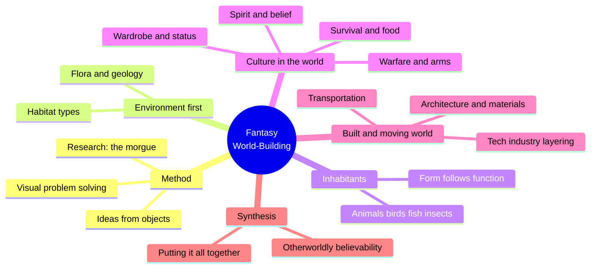
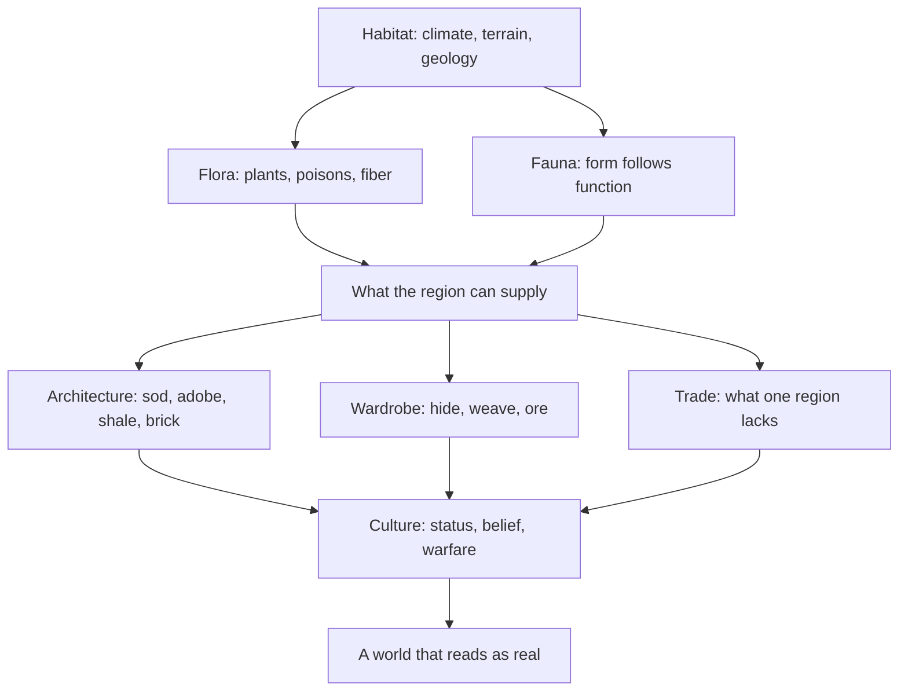
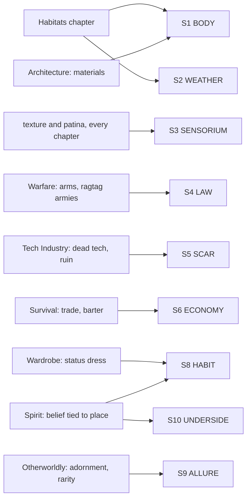

# BVX.1165 — Fantasy World-Building: A Guide to Developing Mythic Worlds and Legendary Creatures — Mark A. Nelson (2019)
### Knowledge Entry — Distill

A veteran TSR/game-industry illustrator's sketchbook-and-essay hybrid: sixteen short chapters, each a visual-design walkthrough (habitats, animals, culture, architecture, technology) built around one repeated move, tracing a creature or building back to the environment and function that would actually produce it.

## TABLE OF CONTENTS
- [Core Thesis](#1-core-thesis)
- [Mind Models](#2-mind-models)
- [Framework](#3-framework--structure)
- [Key Concepts](#4-key-concepts)
- [Heuristics](#5-heuristics--decision-rules)
- [Invariants](#6-invariants)
- [Pitfalls](#7-pitfalls--myths)
- [Application](#8-application)
- [Cross-References](#9-cross-references)
- [Provenance](#10-provenance--confidence)

---

## 1 · CORE THESIS

A creature, culture, or building becomes believable only when its form is traced back through habitat, materials, and function to a concrete answer: what it eats, what it is made of, why it exists. Nelson's method is a checklist of generative questions, not a taxonomy of finished designs; asking the questions is the worldbuilding.

---

## 2 · MIND MODELS

*Required. Minimum two diagrams, maximum five.*

**Diagram 1 — the whole argument.**
Caption: sixteen chapters sort into five working groups; the book is a checklist run once per subject, not a linear theory.

**Diagram 2 — the central mechanism (a process, run on every subject in the book).**
Caption: everything downstream, buildings, clothes, trade, traces back to habitat; invent the environment before the culture or the culture reads as arbitrary.

**Diagram 3 — mapped onto the Command's SETTING SLICE (S1-S12).**
Caption: nine of sixteen chapters land on six slice layers; S3 SENSORIUM is hit hardest and most often, exactly the layer this shelf keeps flagging thin.

---

## 3 · FRAMEWORK / STRUCTURE

Sixteen chapters, no argued thesis, each a demonstration chapter built from Nelson's own sketchbook and finished art, with a governing question the images answer:

| Chapter | Governing question |
|---|---|
| Visual Problem Solver | How do you turn one prop (a sword) into a hundred design decisions? |
| Ideas | How does one object (a bone) generate three unrelated world concepts? |
| Habitats | What does this environment supply, and what does that supply constrain? |
| Animals | What does an eye, a jaw, a claw reveal about how a creature lives? |
| Birds | How do you make three of the same species visually distinct? |
| Fish | What six questions (who, where, what, when, why, how) build a creature's backstory? |
| Insects | How far can you push a design and still keep it believable? |
| Survival | How does what a culture eats, and how it gets food, shape its economy? |
| Warfare | What do a culture's weapons and army composition reveal about its social order? |
| Spirit | How does a culture's belief system grow out of its relationship to its environment? |
| Wardrobe | How does dress encode wealth, role, and status without a word of exposition? |
| Architecture | What can this culture build, given its materials and its reasons for building? |
| Tech Industry | How do old and new technology coexist, and what does dead tech look like? |
| Transportation | How does a means of travel reveal the relationship between two characters or cultures? |
| Otherworldly | What is the minimum detail set that sells a stranger as a real inhabitant of this world? |
| Putting It All Together | How do you stage everything above into one sequence, one page, one story? |

The book has no closing argument the way Baur's Kobold Guide essays do. Its unity is procedural: the same five-part move (habitat, function, material, culture, believability check) runs once per chapter, illustrated rather than stated.

---

## 4 · KEY CONCEPTS

| Concept | What it is | Why it matters |
|---|---|---|
| **The six questions** | Who, where, what, when, why, how, applied to any creature or object (demonstrated on fish, generalizable to anything) | A portable generative checklist; answering all six turns a design into a world citizen with a backstory instead of a prop |
| **Form follows function** | A creature's anatomy (claws, jaws, eyes) or a building's structure exists because of what it must do, not for decoration | The single sentence that disciplines every design choice in the book; a spike, a wall thickness, or a fin shape needs a reason |
| **Habitat as raw material** | Terrain, geology, and flora supply the building materials, food sources, and trade goods a culture will have access to | Setting a habitat first constrains everything invented afterward, the same terrain-first discipline Kobold's Roberts essay argues for maps |
| **The research morgue** | A illustrator's organized reference collection (once paper files, now digital), gathered before design work begins | Research discipline as a prerequisite skill, not an afterthought; a world feels invented rather than observed when this step is skipped |
| **The believability checklist** | Drink, dress, jewelry, body language: the minimum detail set the Otherworldly chapter uses to sell a stranger as a real inhabitant | A compact standard for how much detail a background character or culture actually needs to read as real |
| **Material-constrained architecture** | Building method follows local material: sod on the treeless prairie, adobe over a wood lattice, shale that splits in stackable layers, brick once technology allows the arch | Nelson's version of Kobold's terrain-first rule applied specifically to construction, not settlement placement |
| **Status-coded wardrobe** | Clothing and body modification (Viking portable wealth: pins, tattoos, metalwork) signal class, role, and wealth before any dialogue | Dress is a free worldbuilding channel; a costume tells the viewer who someone is without narration |
| **Belief grows from environment** | A culture's spirit and belief system is presented as downstream of its relationship to its environment, not an arbitrary invention | Ties the Spirit chapter back to the habitat-first causality chain; religion is one more thing that follows from where people live |
| **Technology layering** | New technology keeps running on old infrastructure (blast furnaces smelting steel for modern cars); dead tech and machine graveyards are their own aesthetic category | A world with only one tech tier reads as thin; layering eras against each other is a free source of texture and conflict |
| **The three-layer stage** | Foreground, middle ground, background as a fixed compositional device for placing detail and directing attention | A practical tool for deciding where world detail belongs in a scene: the focal point gets the highest detail and contrast, not everything at once |
| **Give it a stage** | Rather than just drawing a character, put it into a built space with a prop and ask what it would do there | A scene-generation method: setting plus prop plus character produces action and story, faster than describing a character alone |

---

## 5 · HEURISTICS & DECISION RULES

| Situation | Do this | Not this |
|---|---|---|
| Designing a creature or object | Trace its form back to habitat and function; run the six questions (who, where, what, when, why, how) | Design a striking silhouette first and invent a justification afterward |
| Deciding what a culture builds with | Check what the local habitat actually supplies (stone, sod, timber, clay) | Default to generic fantasy stone castles regardless of terrain |
| Introducing a stranger's culture | Hit the believability checklist: what they drink, wear, carry, and how they hold themselves | Explain the culture in narration before showing a single concrete detail |
| Showing wealth or rank | Encode it in dress, adornment, or body modification | State a character's social rank directly in the text |
| Designing a magic or tech system's world-presence | Show its ruins, its worn edges, its old-tech scaffolding still running underneath | Show only the newest, shiniest version with no history or wear |
| Building an army or war-band | Base its composition (professional order versus ragtag scavengers) on the culture that raised it | Give every faction an identical, interchangeable soldier |
| Placing ruins, temples, or old sites | Give them visible damage, age, and an unanswered mystery for the viewer to interpret | Explain a ruin's whole history in a caption; let some of it stay unresolved |
| Starting any design session | Gather references first (the morgue: images, photos, real-world analogues) | Design purely from memory or habit without fresh reference |

---

## 6 · INVARIANTS

1. **Form follows function.** A creature's anatomy or a building's structure needs a reason grounded in what it must do; decoration without function reads as arbitrary.
2. **Habitat constrains what a culture can build, eat, wear, and trade.** Materials, food, and goods all trace back to the local environment before culture gets to invent freely.
3. **Believability survives simplification but not inconsistency.** A creature can be pushed far from realism (extra legs, an all-mouth design) and still work if its internal logic holds together.
4. **A small, concrete detail set outperforms an explained backstory.** Drink, dress, jewelry, and body language sell a stranger faster and more durably than exposition.
5. **Everything built will eventually show wear or fail.** Ruins, dead tech, and decay are not exceptions to design; they are the expected end-state of anything built.
6. **Research precedes invention.** A world reads as observed rather than generic in direct proportion to the reference work done before designing it.

---

## 7 · PITFALLS / MYTHS

- Designing a creature's look first and inventing its ecology or function afterward, rather than the reverse.
- Giving every culture the same building material regardless of terrain (stone castles on a treeless plain, for instance).
- Explaining a culture's history, beliefs, or status system through narration instead of visible, concrete detail (dress, adornment, possessions).
- Treating technology as a single uniform tier: assuming a world is either "primitive" or "advanced" with nothing old still running underneath the new.
- Skipping reference and research, which produces designs that feel generic rather than specific to their world.
- Explaining every mystery (a ruin, a totem, an artifact) completely, leaving nothing for the audience to wonder about.
- Mistaking pushing a design further and further from realism for creativity, without checking whether it still has a coherent form and function.

---

## 8 · APPLICATION

- **Spine level:** SETTING (non-story-spine source; keys to the entity beside the L0-L7 spine, per ssot_03's binding rule that setting is a Domain embodied, never a level)
- **12-layer character stack:** none directly; the believability checklist (drink, dress, jewelry, body language) is structurally the same move as sketching an L1 CORE physical read on a character, but this source stays setting-side
- **plot_systems:** contextual candidate once `04_PLOT_SYSTEMS/` opens; the six-questions checklist (who, where, what, when, why, how) is a ready-made prompt for fleshing out any world element a scene needs on short notice
- **Setting:** primary; this is a SENSORIUM-heavy SETTING-shelf source, feeding S1, S3, S8 at primary strength and S2, S5, S6, S9, S10 at supporting or contextual strength

For a science-fiction setting built on tabletop-RPG craft, Nelson's export is not a theory of worldbuilding but a discipline for making one piece of it (a creature, a building, a stranger) read as real fast: trace it to habitat and function, then hit a small checklist of concrete, visible details instead of explaining it. The six-questions method (who, where, what, when, why, how) is directly reusable as a fill-in-the-blank prompt for any SETTING SLICE record that feels thin, especially S3 SENSORIUM, where this book is stronger than any other source on this shelf so far, because rendering texture and surface convincingly is Nelson's actual profession. The habitat-first causality chain (environment supplies materials, materials constrain architecture and wardrobe, both feed culture) is the same terrain-first move Baur and Roberts make in the Kobold Guide (BVX.0458), applied here at object and costume scale rather than a continent. Warfare and Spirit gesture at social structure and belief without Baur's tribe/city-state/nation or Cook's public/mystery religion frameworks, so this book complements those sources rather than replacing them.

---

## 9 · CROSS-REFERENCES

| Related entry | Relation |
|---|---|
| [[BVX.0458]] | Kobold Guide to Worldbuilding; shares the terrain-first, materials-constrain-culture causality chain, but at continent scale rather than this book's object and costume scale |
| [[BVX.1157]] | Those Dark Places; the other SETTING-shelf source keying S3 SENSORIUM at primary strength, there through GM-facing prose description, here through an illustrator's texture-and-surface discipline |
| [[BVX.1122]] | GURPS Hot Spots: Renaissance Venice; a worked concrete instance against which this book's generative checklist (habitat, materials, believability) can be tested |
| [[BVX.1146]] | Sibling SETTING-shelf sci-fi toolkit; both sources build worldbuilding checklists rather than finished setting content |

---

## 10 · PROVENANCE & CONFIDENCE

Full text read (2,089 lines, roughly 15,000 words of running prose across the extracted text; the remainder is picture captions and section headers, since the source is an image-heavy art book, epub-extracted with no page markers, converted to plain text for this distill). Every chapter was read in full, 1 through 16, plus the foreword and acknowledgments; nothing was sampled or skipped, since the book's total prose volume is small enough (well under the 120k-token reading budget) to read whole rather than selectively.

This is an outlier source for the SETTING shelf: an illustrator's process memoir, not a systematic treatise like the Kobold Guide or a rules-driven toolkit like the shelf's sci-fi sourcebooks. Its prose is sparse (captions framing artwork the text file cannot render), so extraction here synthesizes a repeated method across many short examples rather than quoting a stated framework. `pdf_pages: 144` is the publisher's listed print count; the file in hand is an epub extraction with no page markers, so the figure is approximate. `confidence: medium` reflects that approximation, not a gap in reading coverage.

The S-layer keying in frontmatter `feeds:` and Diagram 3 is this distill's own synthesis against `ssot_03_setting_system.md`'s twelve-layer schema, following the method BVX.0458 and BVX.1157 already set for this shelf; the S3 SENSORIUM call is a direct read of the book's actual craft (texture, patina, and surface rendering are its constant subject), not an inference. `spine: [SETTING]` and the empty character-stack line follow the v4 template's binding rule that setting is a Domain embodied, not a story-spine rung. `bvx_provisional: true` and `zotero_key: "pending"` are set per brief: this is a newly assigned id for a book indexed only as an unkeyed drop, with no Zotero record reconciled yet.

## META
- Template: BVX-LEARN-v4.0
- Source classification: full-text art-book memoir, complete read, epub extraction (no PDF page markers)
- Created / Updated: 2026-09-29
