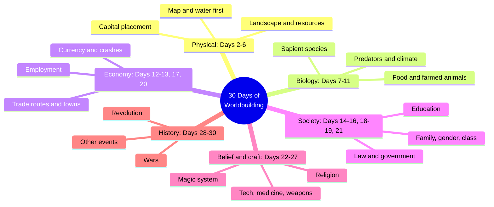
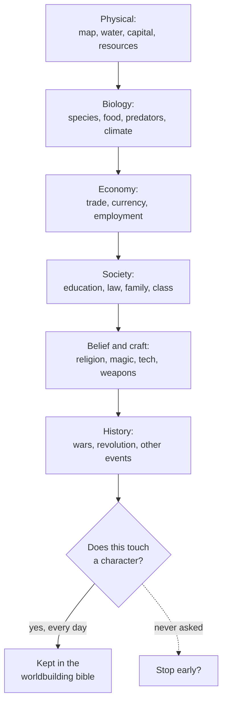
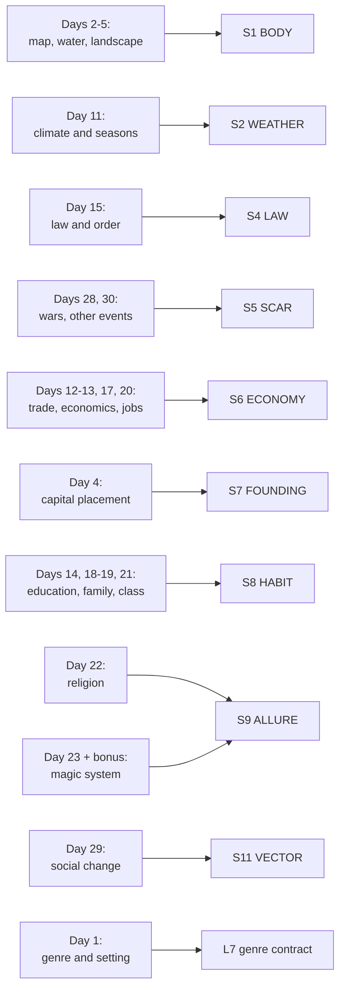
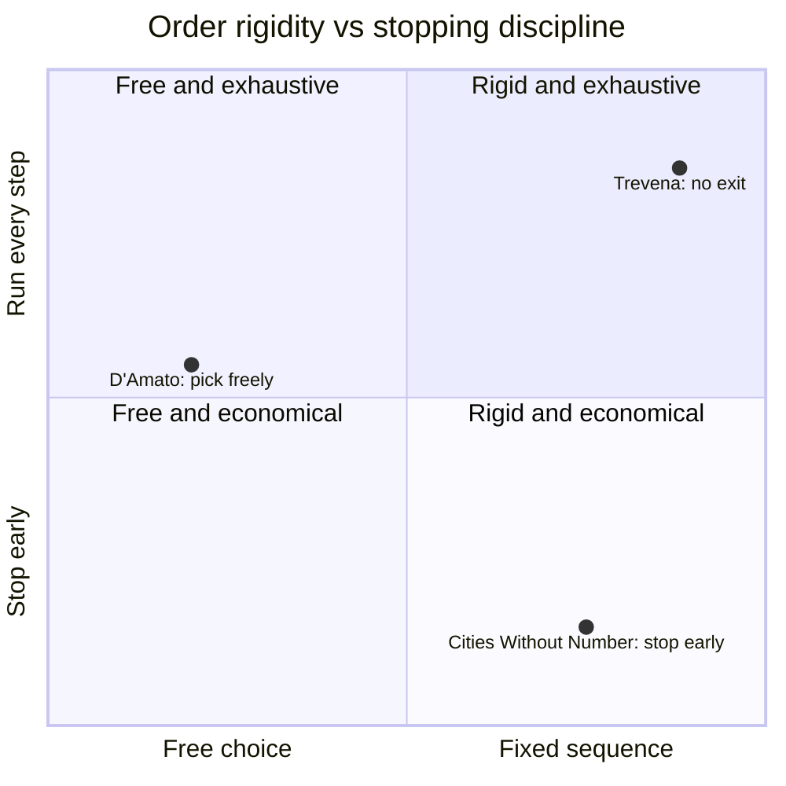

# BVX.1166 — 30 Days of Worldbuilding: An Author's Step-by-Step Guide to Building Fictional Worlds — Angeline Trevena (2019)
### Knowledge Entry — Distill

A fiction writer's workbook that turns worldbuilding into thirty fixed daily prompts, one topic each, moving in a single mandatory order from geography to history; the SETTING shelf's first prose-fiction source, and its most rigid build order.

## TABLE OF CONTENTS
- [Core Thesis](#1-core-thesis)
- [Mind Models](#2-mind-models)
- [Framework](#3-framework--structure)
- [Key Concepts](#4-key-concepts)
- [Heuristics](#5-heuristics--decision-rules)
- [Invariants](#6-invariants)
- [Pitfalls](#7-pitfalls--myths)
- [Application](#8-application)
- [Cross-References](#9-cross-references)
- [Provenance](#10-provenance--confidence)

---

## 1 · CORE THESIS

A fictional world builds in one fixed order, one topic a day for thirty days: geography, then biology, then economy, then society, then belief, then history. Every prompt closes on the same tether: how does this touch a character? But the sequence itself never pauses to ask whether a day is needed before running the next one.

---

## 2 · MIND MODELS

*Required. Minimum two diagrams, maximum five.*

**Diagram 1 — the whole argument.**
Caption: *thirty days sort into six mandatory blocks, run once each in this order; the book is a checklist worked top to bottom, not a toolkit to dip into.*

**Diagram 2 — the central mechanism (a fixed process, one direction, no exit).**
Caption: *the arrow only runs forward and the character-check fires after every block, but "should I stop here" is a question the book never asks.*

**Diagram 3 — mapped onto the Command's SETTING SLICE (S1-S12).**
Caption: *nine of thirty days land on eight of twelve SETTING SLICE layers, and the four-day society cluster is this book's single densest feed, matching S8's primary strength in both sibling sources but built from four consecutive days instead of one essay or exercise.*

**Diagram 4 — stopping-rule posture across the shelf's three build-order sources.**
Caption: *Trevena is the only one of the three with no built-in exit: the same fixed-order instinct that drives Cities Without Number's top-down build runs here with the stopping rule removed, thirty days, no early out.*

---

## 3 · FRAMEWORK / STRUCTURE

Thirty numbered days, plus a bonus eight-part magic-system chapter, sorted into six blocks the book itself never names as such but marks with explicit transition lines (quoted below):

| Block | Days | Governing question |
|---|---|---|
| **Physical** | 1 (genre and setting scope), 2 (map), 3 (water), 4 (capital), 5 (landscape), 6 (resources) | Where does this world sit, and what does its ground look like? |
| **Biology and subsistence** | 7 (species), 8 (food), 9 (farmed animals), 10 (predators), 11 (climate) | What lives here, and what does it take to survive? |
| **Economy and movement** | 12 (trade routes), 13 (trade towns), 17 (economics), 20 (employment) | How do goods, money, and people move? |
| **Society** | 14 (education), 15 (law), 16 (government), 18 (family), 19 (gender), 21 (class) | Who has access, who has authority, and who can change their station? |
| **Belief and craft** | 22 (religion), 23 (magic), 24 (festivals), 25 (technology), 26 (medicine), 27 (weaponry) | What do people believe, and what tools give those beliefs teeth? |
| **History** | 28 (wars), 29 (revolution), 30 (other events) | What already happened, and what scar or momentum does it leave? |

The book marks its own block joints in the text rather than leaving them implicit: Day 14 opens with "Let's move away from the physical world, and start looking at the lives of your characters," and Day 16 opens "Let's look to the people in charge." No such line ever authorizes skipping a day or stopping the sequence early; the "Using this Guidebook" front matter only softens this once, noting "some of these prompts may not be relevant to you," a single sentence set against thirty mandatory headings.

---

## 4 · KEY CONCEPTS

| Concept | What it is | Why it matters |
|---|---|---|
| **The fixed daily sequence** | One topic, one day, thirty days, always in this order | The book's structural spine: a checklist, not a menu, distinguishing it from every other SETTING-shelf source, which lets the writer choose what to build next |
| **Water-first siting** | A settlement needs fresh water, varied food, resources, farmland, security, a trade route, and manageable predators, checked in that priority order | Prevents towns "randomly scattered" across a map; ties Day 3 through Day 10 into one settlement-siting logic |
| **Reverse engineering** | Place a capital or name a place first, then invent the reason afterward | An explicit, sanctioned shortcut around forward-engineered causality; used twice, for capitals and for place names |
| **The character tether** | Nearly every day closes by asking how this element hits a character's life | Repeated so often it functions as an invariant; the mechanism keeping worldbuilding from becoming an end in itself |
| **Pebble-in-a-pond causality** | Every change ripples outward for minutes or centuries, across four scales (international, national, local, individual); a wedding's wine order can crash an economy | The book's own causality model, underlying both Day 6's resources and Days 28 to 30's history |
| **Loose present-tense history** | "You definitely need to know enough... but you don't need to plot out 5 million years" | Weaker than Kobold's present-tense rule (BVX.0458): permission to under-build history, not a requirement that it earn its keep |
| **Magic's twin engines: limitations and consequences** | A magic system needs rules that block easy solutions (limitations) plus costs for using it anyway (consequences) | The bonus chapter's load-bearing claim, restated from Day 23: unlimited magic "kills off your story" |
| **The information-dump discipline** | After building, show world facts through character action first, dialogue second, direct telling only sparingly | A post-build usage rule; the only place the book says what to do with everything the thirty days produced |

---

## 5 · HEURISTICS & DECISION RULES

| Situation | Do this | Not this |
|---|---|---|
| Deciding what to build next | Follow the day's assigned topic in order | Jump ahead to whichever part feels more fun |
| Placing a settlement | Check water, food, resources, farmland, access, trade, predators, in that order | Scatter towns across the map with no siting logic |
| Choosing a capital's position or a place's name | Place or name it first, then invent the reason | Insist on a fully forward-engineered justification before writing anything down |
| Finishing any day's prompt | Ask how this touches a character's life | Leave the note as pure world description with no character link |
| Writing setting history | Note only enough to understand why things are the way they are | Plot five million years of backstory before the current day matters |
| Building a magic system | Give it limitations and give it consequences, both | Make magic powerful enough to solve every problem it meets |
| Deciding a day feels irrelevant | Skip it deliberately and say so | Silently drop it while still calling the process complete |
| Handing worldbuilding to readers | Show it through action first, dialogue second, direct telling last and sparingly | Open with a history-textbook info dump |

---

## 6 · INVARIANTS

1. **The sequence is one direction and non-reversible.** Physical precedes biology, biology precedes economy, economy precedes society, society precedes belief, belief precedes history; no day instructs a return to an earlier block.
2. **Every day closes on the character, not the world.** The recurring instruction (bring it "back to the character level") is stated on enough separate days to function as a rule, not a suggestion.
3. **A settlement is never arbitrary.** Its position is derived from water, food, resources, farmland, security, and trade, checked in that order, even when the derivation is written backward after the fact.
4. **Nothing changes in isolation.** The pebble-in-a-pond model is invoked at the natural-resource, climate, and history stages alike: one changed variable propagates through every other layer.
5. **Magic without both a limitation and a consequence is not yet a system.** Stated as the bonus chapter's single hard rule, restated from Day 23's main-sequence prompt.
6. **The book names no stopping rule.** All thirty days are mandatory by structure; the sole softening is one sentence in the front matter allowing an individual day to be judged "not relevant," never the sequence itself to end early.

---

## 7 · PITFALLS / MYTHS

- Treating the thirty days as a suggested order rather than the load-bearing structure; the book gives no fallback sequence if skipped or reordered.
- Building a settlement's location for scenic reasons alone, ignoring the water-first siting checklist that Day 3 through Day 10 assume.
- Writing an unlimited, consequence-free magic system and expecting it to still generate story tension.
- Drafting a multi-million-year history because "you need to know," rather than the amount the book actually asks for: just enough to explain why things are the way they are now.
- Delivering all thirty days' worth of notes to the reader as narration, instead of the action-first, dialogue-second, telling-last discipline the book prescribes for the finished draft.
- Assuming the book's "not every prompt may be relevant" escape hatch licenses stopping the sequence early; it only licenses skipping a single day, and only once, in the front matter.

---

## 8 · APPLICATION

- **Spine level:** SETTING (non-story-spine source; keys to the entity beside the L0-L7 spine, per ssot_03's binding rule that setting is a Domain embodied, never a level)
- **12-layer character stack:** none directly; a setting-side source. The character tether (every day closes on "how does this touch a character") is structurally the same discipline as auditing an L6 DRIVE want against its costs, but it is not itself a character-layer feed
- **plot_systems:** contextual candidate once `04_PLOT_SYSTEMS/` opens; the four-scale event ladder (international, national, local, individual) is a ready-made frame for tagging a plot beat's blast radius
- **Setting:** primary; feeds nine of the twelve SETTING SLICE layers (S1, S2, S4, S5, S6, S7, S8, S9, S10, S11 at varying strength) plus L7 genre-contract contextually, and supplies a full thirty-step build-order procedure in its own right

This is the third SETTING-shelf source with an explicit build order, after D'Amato's pick-any exercise bins (BVX.1143) and Cities Without Number's world-to-district pipeline (BVX.1142), and it sits at the opposite end of both on stopping rules. D'Amato never orders his exercises: a GM builds whichever weapon, god, city, or union needs building next. Cities Without Number is ordered exactly like Trevena, world before city before district before cast, but pairs that order with a repeated instruction to stop once a first session is playable. Trevena's thirty days carry the same rigidity as CWN's build with none of its stopping discipline: every block runs to completion regardless of what the draft needs yet. Tested against the DCUS starter instance in `ssot_03`, the useful move is a splice: take Trevena's six-block sequence as the authoring checklist for filling a SETTING instance's S1 through S11 from zero, then graft CWN's stop-at-what-the-scene-needs rule onto the far end, since DCUS is an active Movement, not a blank exercise. The character tether closing nearly every day is worth keeping unconditionally: the same instinct Baur names "dynamite, not encyclopedia" (BVX.0458), restated here as a habit rather than a philosophy.

---

## 9 · CROSS-REFERENCES

| Related entry | Relation |
|---|---|
| [[BVX.1143]] | D'Amato, The Ultimate RPG Game Master's Worldbuilding Guide. Shares the SETTING shelf's build-order focus; D'Amato's exercises are pick-any-order, the opposite structural choice from this book's mandatory sequence |
| [[BVX.1142]] | Crawford, Cities Without Number. The closest structural sibling: both run a fixed, one-direction build order, but CWN pairs its order with an explicit stopping rule this book never states |
| [[BVX.0458]] | Kobold Guide to Worldbuilding. The theory-register counterpart; Baur's present-tense history rule is a harder version of this book's looser "you don't need a full history" permission |
| [[BVX.0349]] | Kennedy, Against Worldbuilding. The kitchen-sink counter-argument; Trevena's thirty mandatory days are close to the completionist habit Kennedy warns against, softened only by the character tether running under every day |
| [[BVX.1122]] | GURPS Hot Spots: Renaissance Venice, a worked instance. A candidate check for whether a finished sourcebook's structure could be reverse-read against Trevena's six blocks |

---

## 10 · PROVENANCE & CONFIDENCE

Full text, plain-text extraction, ~14,400 words, no page numbers or running headers in the extraction (an ebook workbook with heavy white space per day; the page count above is estimated). Read in full, not sampled: the Introduction, Using this Guidebook, and Worldbuilding Basics front matter; all thirty numbered days in sequence; Congratulations; the full eight-part Bonus Magic System chapter; A Word on Info Dumping and Learning Curves; Ideas Dump; and the back matter.

The S-layer keying in `feeds:` and Diagram 3 extends the method BVX.0458, BVX.1142, and BVX.1143 already set for the SETTING shelf. The Diagram 4 and Application comparisons are this distill's own reading, cross-checked against BVX.1143's and BVX.1142's provenance sections rather than re-reading those texts. `spine: [SETTING]` and the empty character-stack line follow the v4 template's binding rule. New entry (`bvx_provisional: true`), not yet confirmed in Zotero (`zotero_key` blank); the copyright page reads 2019, matching the year supplied with this tasking.

## META
- Template: BVX-LEARN-v4.0
- Source classification: full-text ebook workbook, complete read, no sampling
- Created / Updated: 2026-09-29
