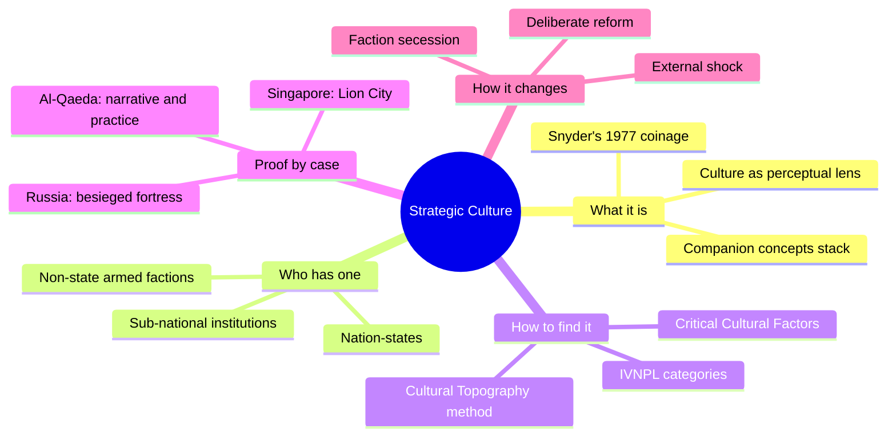
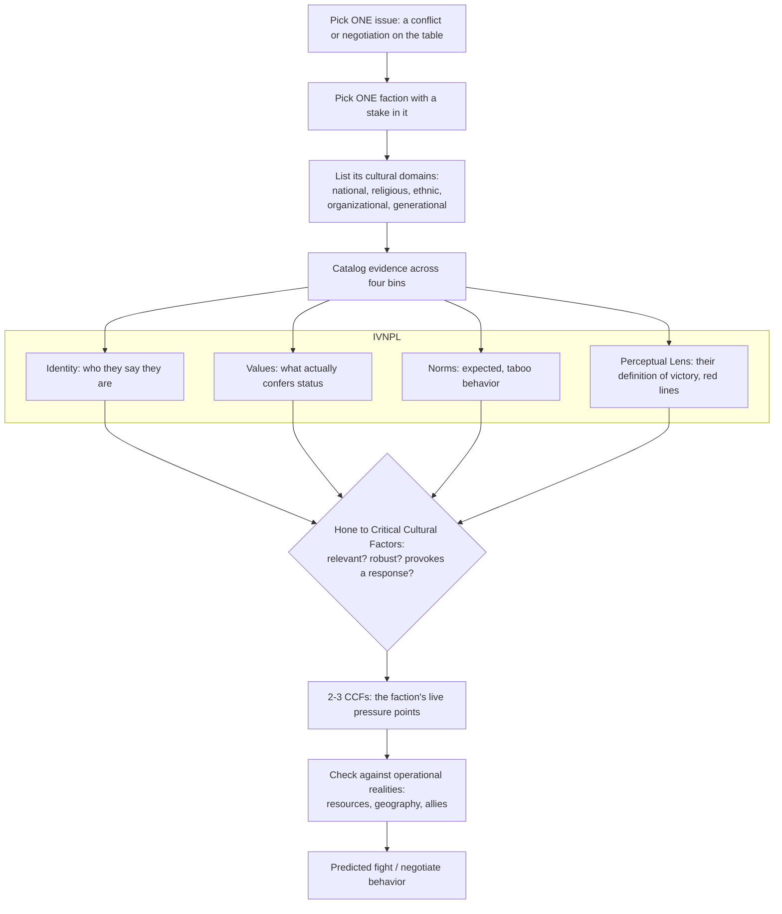
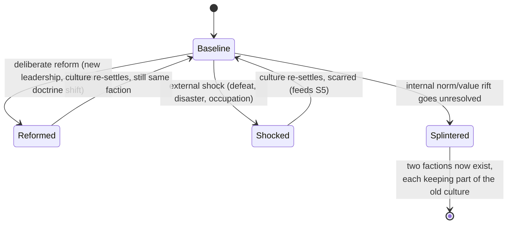
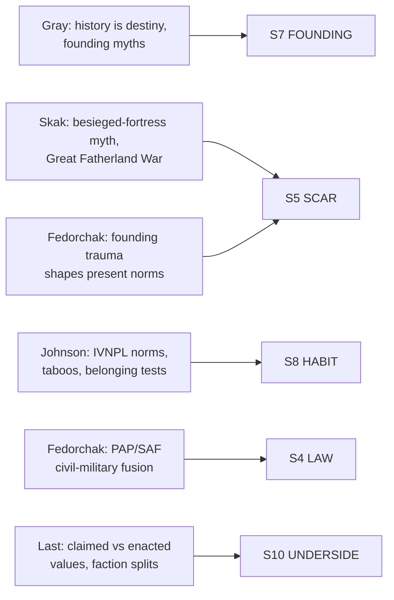

# BVX.1167 — Routledge Handbook of Strategic Culture — eds. Kartchner, Bowen & Johnson (2023)
### Knowledge Entry — Distill

A 35-chapter academic handbook on strategic culture (why polities and armed groups fight and negotiate the way they do, not just what they fight with); read here for its transferable generator, the Cultural Topography method, as a TTRPG-grade tool for building factions that behave consistently under pressure.

## TABLE OF CONTENTS
- [Core Thesis](#1-core-thesis)
- [Mind Models](#2-mind-models)
- [Framework](#3-framework--structure)
- [Key Concepts](#4-key-concepts)
- [Heuristics](#5-heuristics--decision-rules)
- [Invariants](#6-invariants)
- [Pitfalls](#7-pitfalls--myths)
- [Application](#8-application)
- [Cross-References](#9-cross-references)
- [Provenance](#10-provenance--confidence)

---

## 1 · CORE THESIS

A group's history and geography, as it perceives them, harden into a semi-permanent lens that decides what it considers honorable, negotiable, and worth dying for. That lens, not raw capability, explains why two factions with the same weapons fight and bargain differently. Build the lens first; the tactics follow.

---

## 2 · MIND MODELS

*Required. Minimum two diagrams, maximum five.*

**Diagram 1 — the whole argument.**
Caption: *a five-part academic handbook resolves into one usable throughline: a contested concept, made operational by a single method, tested against dozens of real factions.*

**Diagram 2 — the central mechanism (a generator, run once per faction per issue).**
Caption: *this is the machine a GM runs: pick one faction and one live issue, catalog four categories of evidence, then hone the pile down to the two or three factors that actually drive the scene.*

**Diagram 3 — the recurring mechanism: how a faction's culture actually changes.**
Caption: *a faction's culture does not drift on its own; it moves only through one of three named triggers, and the third one is how you generate a splinter faction on purpose.*

**Diagram 4 — mapped onto the Command's SETTING SLICE (S1-S12).**
Caption: *the book is dense on five of twelve slice layers and silent elsewhere; where it is silent is exactly where a faction's material and sensory texture, not its politics, has to be authored from other sources.*

---

## 3 · FRAMEWORK / STRUCTURE

Five parts, each asking a different question about the same concept:

| Part | Chapters (sampled) | Governing question |
|---|---|---|
| I. Evolution of the Paradigm | Kartchner (defining/scoping); Gray (nature and utility) | Is "strategic culture" a real, usable concept, or a scholarly muddle? |
| II. Dimensions and Levels | Last (non-state actor level) | Does a group need statehood, territory, or even nationhood to have a strategic culture? |
| III. National Profiles | Skak (Russia); Fedorchak (Singapore); 16 others | What does a strategic culture actually look like, case by case? |
| IV. Utility for Practitioners | Johnson (Cultural Topography Methodology) | How do you turn the concept into a repeatable research and design method? |
| V. Conclusion | Kartchner, Bowen & Johnson | What has the field settled, and what remains open? |

The book's spine is Part IV wearing Part I's justification and Part III's proof. Johnson's Cultural Topography (CTops) method is the one piece built to be used rather than argued about; everything else in the volume either defends the concept it rests on or supplies raw case material to run it against.

---

## 4 · KEY CONCEPTS

| Concept | What it is | Why it matters |
|---|---|---|
| **Strategic culture** | The persisting, socially transmitted ideas, habits of mind, and preferred methods specific to a security community shaped by its unique history and geography (Snyder 1977; Gray) | The founding definition: a faction's fighting and negotiating style is not chosen fresh each time, it is inherited |
| **Perceptual lens** | The cognitive filter through which a group assigns meaning; new problems are not assessed objectively but seen through this lens (Snyder) | Explains "irrational" faction choices: they are rational inside a lens the writer has not yet built |
| **Companion concepts stack** | Public culture → strategic culture → military culture → way of war → national style → strategic personality (Gray) | A faction's *way of war* is strategic culture in action, at closer range than the culture itself; useful as a zoom control for how much detail a scene needs |
| **Founding myth / patriotic history** | Every society keeps a dominant, self-favoring account of its own history that contains some truth and is never neutral (Gray) | The single cheapest way to make a faction's motives legible: give it the story it tells about itself, not the true history |
| **Cultural domains** | Distinct, learned clusters of cultural code (national, religious, ethnic, organizational, generational) that a member draws on situationally, code-switching between them (Johnson) | A faction is rarely one culture; its members carry several and the *issue at hand* decides which one dominates |
| **IVNPL** | Identity, Values, Norms, Perceptual Lens: the four research bins of the Cultural Mapping Exercise (Johnson) | The actual generator: run any faction through these four questions and a coherent behavior profile falls out |
| **Values vs. rewarded status** | What a group *says* it values and what actually confers status inside it are tracked separately, because they diverge | Prevents writing a faction's slogans as its decision rules; the real driver is what gets a member promoted, married well, or forgiven |
| **Critical Cultural Factors (CCF)** | The 2-3 cultural traits, honed from a wider catalog by relevance, robustness, and likelihood to provoke a response, that actually drive behavior on one issue | The distillation step; without it a faction profile stays an encyclopedia entry instead of a usable pressure point |
| **Strategic culture at the non-state level** | VNSAs (violent non-state actors) need no state, territory, or even nationhood to have a strategic culture; a shared narrative and leadership structure suffice (Long, via Last) | Licenses factions, cults, guilds, and rebel cells as first-class strategic-culture holders, not lesser shadows of nation-states |
| **Faction secession as cultural change** | When an internal norm or value rift goes unresolved, the simplest resolution is secession, not reconciliation (GIA → GSPC → AQIM → ISIS) | A ready-made, historically grounded mechanism for splitting one faction into two without inventing a new villain motive |
| **Dysfunctional strategic culture** | A culture can be self-destructive and persist anyway; culture is not optimized for winning (German WWII operational doctrine; Russia in Ukraine, per Gray and Skak) | Permission to write a faction that keeps losing for consistent, in-character reasons rather than plot convenience |
| **Operational realities** | Resources, geography, technology, and allies constrain what a culturally preferred course of action can actually achieve; culture is not determinative | The final reality check between "what this faction wants to do" and "what this faction can pull off this scene" |

---

## 5 · HEURISTICS & DECISION RULES

| Situation | Do this | Not this |
|---|---|---|
| Building a faction's fighting/negotiating style | Derive it from a named founding event and the group that keeps its memory alive | Assign a fighting style from a stat block or trope with no origin |
| A faction reads flat or generic | Run one Cultural Mapping Exercise: pick one live issue, catalog IVNPL, hone to 2-3 CCFs | Add more lore volume without narrowing to what actually drives behavior |
| Two factions share an ideology but should feel different | Nest distinct sub-cultures under the shared ideology (cell, branch, generation) | Write one monolithic culture and reuse it for every branch and cell |
| A faction needs to splinter into rivals | Seed an unresolved norm or value disagreement, let it force a secession | Give the split no cause but villain ambition or authorial fiat |
| Writing a faction's negotiating stance | Ask what counts as victory and a red line inside *their* perceptual lens | Assume they define victory or acceptable loss the way the protagonists do |
| A faction seems to act against its own interest | Let it: dysfunctional, self-destructive strategic cultures are historically normal | Quietly patch its behavior to be "smarter" so it reads as competent |
| Deciding if a faction's culture can shift mid-story | Trigger the shift with deliberate reform, an external shock, or an internal rift | Have it change its mind once shown a better argument |
| A faction's public creed and internal behavior don't match | Write both, and track the gap as material (a future crisis) | Treat the creed as the actual decision rule |
| Prepping a scene, not a whole faction bible | Run the abbreviated generator: issue, actor, IVNPL, CCFs, done | Draft an encyclopedic national/factional profile before the scene needs it |

---

## 6 · INVARIANTS

1. **No actor is acultural.** Even the most materially minded faction leader is encultured; "pure rational interest" is not an available baseline (Gray).
2. **History is perceived before it is used.** A faction's founding myth need not be accurate to be load-bearing; it only needs to be believed and retold.
3. **Culture is a lens, not a rulebook.** It filters what a faction can imagine doing before any calculation of costs and benefits begins.
4. **Claimed values and rewarded values are separate data.** Track what a faction says it honors and what it actually promotes or punishes as two different facts.
5. **A faction's culture is not chosen and not easily discarded.** It can be reformed, shocked, or split, but not switched off by decree, inside or outside the fiction.
6. **Statehood and territory are not prerequisites.** A shared narrative, an in-group/out-group line, and a leadership structure are sufficient for a faction to carry a strategic culture.
7. **A culture can fail and persist anyway.** Historical performance does not select for functional strategic cultures; dysfunction is not a writing error.

---

## 7 · PITFALLS / MYTHS

- Writing "the Empire's culture" as one uniform doctrine across every branch, cell, and generation of the faction.
- Treating an ideology's stated dogma as its actual decision rule instead of checking what the group visibly rewards.
- Explaining a faction's choices purely by outside logic ("what would be rational"), ignoring its own honor, legitimacy, and victory calculus.
- Assuming a faction could simply choose a different culture once shown a superior argument or technology.
- Giving a splinter faction no reason to exist beyond a villain's ego rather than a genuine values or norms rift.
- Assuming small or non-state factions can't carry a strategic culture that shapes how great powers must treat them.
- Confusing a faction's tactics ("way of war," close to the action) with its strategic culture (the deeper, slower-moving source of those tactics).

---

## 8 · APPLICATION

- **Spine level:** SETTING (non-story-spine source; strategic culture is a property of a faction/polity entity, not an L0-L7 rung)
- **12-layer character stack:** none directly; the IVNPL categories run structurally parallel to L4 WILL (norms as constraint), L8 IMPRINT (belonging and habit), and L10 SHADOW (claimed-vs-enacted value gaps), but this source stays setting-side and should not be force-fit onto a single character's layers
- **plot_systems:** primary candidate once `04_PLOT_SYSTEMS/` opens — the CME (Diagram 2) is a scene-prep generator: before writing any faction's fight or negotiation, run issue → actor → IVNPL → CCF → operational reality, in that order, and the scene's behavior falls out already motivated
- **Setting:** primary — feeds S4 LAW (institutional keepers), S5 SCAR (founding trauma made load-bearing), S7 FOUNDING (perceived-history-as-destiny method), S8 HABIT (IVNPL as the direct generator of patterned behavior), and S10 UNDERSIDE (claimed vs. rewarded values, and the secession mechanism for factional splits)

The book's real gift to a setting-builder is the CME's discipline of scoping to one issue at a time rather than building an encyclopedic national character sheet. A DCUS-scale instance should resist writing "the Administration's strategic culture" as a single monolithic block; instead, run a CME per live conflict (a Star-Rating downgrade, a Sync Cult recruitment drive) and let the Administration's IVNPL profile shift emphasis issue by issue, the way Johnson's method predicts real institutions do. The faction-secession mechanism (Diagram 3) is a ready-made generator for a rename-lattice-style institutional split, distinct from but compatible with S5 SCAR's existing rename history. Where the book goes quiet, sensorium, weather, economy in physical rather than doctrinal terms, other SETTING-shelf sources should carry the weight; this is a politics-and-identity source, not a place-description one.

---

## 9 · CROSS-REFERENCES

| Related entry | Relation |
|---|---|
| [[BVX.0458]] | Kobold Guide to Worldbuilding — sibling SETTING-shelf distill; that book builds S1/S2/S4-S11 physically and socially, this one supplies the doctrinal/behavioral depth for S4, S5, S7, S8, S10 specifically |
| [[BVX.1122]] | GURPS Hot Spots: Renaissance Venice — a worked trade-gazetteer instance; this book is the missing "why do they fight and negotiate this way" layer a gazetteer typically leaves thin |
| [[BVX.0349]] | Against Worldbuilding, and Other Provocations — counter-argument sibling; this book's CCF-honing step (Step 5) is structurally the same discipline: cut to what serves the scene, not what is merely interesting |

---

## 10 · PROVENANCE & CONFIDENCE

Full text, pdftotext extraction, ~520pp, clean text layer with a machine-readable table of contents. Read in full: front matter and table of contents; Chapter 1, "Defining and Scoping Strategic Culture" (Kartchner); Chapter 4, "The Nature and Utility of Strategic Culture Scholarship" (Gray, his ten-proposition essay in full); Chapter 10, "Strategic Culture at the Non-State Actor Level" (Last, in full); Chapter 29, "A User's Guide to the Cultural Topography Methodology" (Johnson, in full, the book's method chapter and this distill's central mechanism). Sampled for case depth: Chapter 12, "Russian Strategic Culture" (Skak, the besieged-fortress and Great Fatherland War material); Chapter 21, "Examining the Strategic Culture of Singapore" (Fedorchak, the identity and values sections). Not read: Chapters 2-3, 5-9, 11, 13-20, 22-28, 30-35 (the remaining national profiles and practitioner-application chapters); their content is inferred only from titles and the recurring companion-concept vocabulary established in the chapters read directly.

The S-layer keying in frontmatter `feeds:` and Diagram 4 is this distill's synthesis against `ssot_03_setting_system.md` (PART A, the twelve-layer SETTING SLICE), extending that SSOT's existing `sources:` list. `zotero_key` is left blank pending the next inventory pass; `bvx_provisional: true` is set per this task's brief since BVX.1167 is a newly assigned id not yet reconciled against the Zotero library.

## META
- Template: BVX-LEARN-v4.0
- Source classification: full-text handbook, deep extraction on 4 of 35 chapters, sampled on 2, front matter and TOC read in full
- Created / Updated: 2026-09-29
