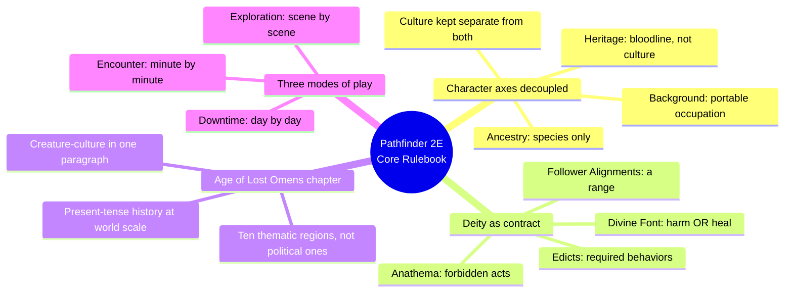
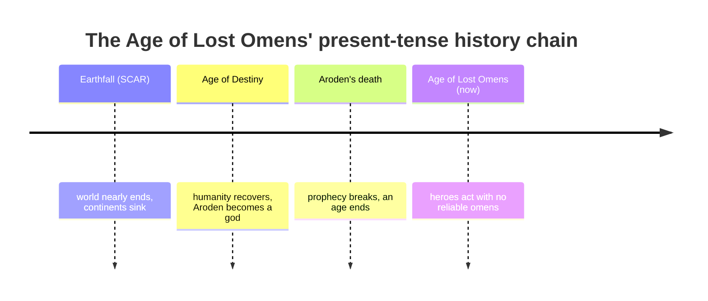
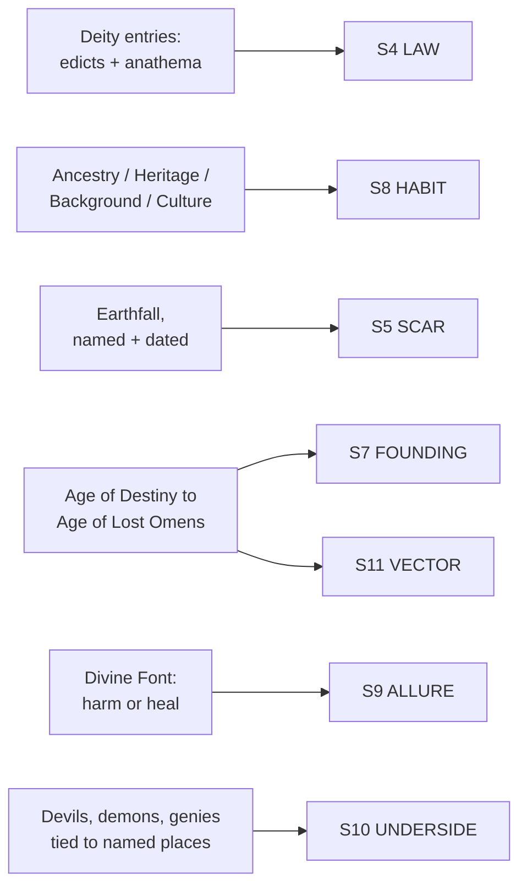

# BVX.1168 — Pathfinder Second Edition Core Rulebook — Logan Bonner, Jason Bulmahn, Stephen Radney-MacFarland, and Mark Seifter (2019)
### Knowledge Entry — Distill

A 638-page rules-first redesign of BVX.0483 (Pathfinder 1E Core Rulebook, 2009): same rules-as-worldbuilding thesis, but the character-build axes are decoupled and the setting chapter runs a present-tense-history chain at the scale of the whole world instead of one dungeon.

## TABLE OF CONTENTS
- [Core Thesis](#1-core-thesis)
- [Mind Models](#2-mind-models)
- [Framework](#3-framework--structure)
- [Key Concepts](#4-key-concepts)
- [Heuristics](#5-heuristics--decision-rules)
- [Invariants](#6-invariants)
- [Pitfalls](#7-pitfalls--myths)
- [Application](#8-application)
- [Cross-References](#9-cross-references)
- [Provenance](#10-provenance--confidence)

---

## 1 · CORE THESIS

Second edition doesn't add lore over first edition's rules chassis; it decouples the axes 1E welded together, splitting race into four independent choices (ancestry, heritage, background, culture) and turning a deity into an enforceable social contract (edicts, anathema, follower-alignment range) instead of a portfolio. The upgrade is architectural, not encyclopedic.

---

## 2 · MIND MODELS

*Required. Minimum two diagrams, maximum five.*

**Diagram 1 — the whole argument.**
Caption: *the changes from 1E cluster in exactly four places — everything else in the 638 pages is the same rules-as-worldbuilding move BVX.0483 already covers.*

**Diagram 2 — the central mechanism (a chain of hinge events, run at setting scale).**
Caption: *this is Baur's present-tense-history rule (BVX.0458) applied to an entire world instead of one dungeon — every link still bites the current age.*

**Diagram 3 — mapped onto the Command's SETTING SLICE (S1–S12), against the 1E sibling.**
Caption: *the same four layers 1E fed at primary strength (S4, S6, S8, S9) get a second, different feed here — the strengthening lands on S5, S7, S11 instead, exactly where 1E was thinnest.*

---

## 3 · FRAMEWORK / STRUCTURE

Fifteen numbered chapters, in the same play-order logic as 1E: character creation first, GM tools last. Two structural changes from BVX.0483 matter for setting work:

| Change from 1E | What it means for a writer |
|---|---|
| Ancestries get their own chapter (2), separate from Classes (3) | Species and profession are no longer bundled at the point of choice — a system can offer the same split |
| "Playing the Game" (9) names three modes of play explicitly: encounter, exploration, downtime | Pacing granularity becomes a named, switchable gear instead of an implicit GM judgment call |

Setting still rides inside dedicated real estate — Chapter 8, The Age of Lost Omens (pages 416–441) — plus the same four load-bearing spots 1E used (races/backgrounds, equipment, gamemastering, environment). The chapter itself runs, in order: cosmology (the Great Beyond, the planes) → the Inner Sea region broken into 10 themed subregions → a timeline of named ages → nonhuman/monstrous peoples in one paragraph each → the pantheon as a table of contracts → the Pathfinder Society and other organizations.

---

## 4 · KEY CONCEPTS

| Concept | What it is | Why it matters |
|---|---|---|
| **The ABC decoupling** | Ancestry (species), heritage (bloodline subtype within an ancestry), background (pre-adventuring occupation), and culture/ethnicity are four separate choices, made independently | Where 1E's race entry fused species and implied culture into one package, 2E states outright: "a heritage is not the same as a culture or ethnicity." A dwarf raised among elves and a dwarf raised in a Sky Citadel share an ancestry, not a culture |
| **Background as portable module** | Two ability boosts, two trained skills (one always a Lore skill), one skill feat — the same six-slot shape, but keyed to a life experience, not a species | Ancestry-agnostic: any ancestry can be an Acolyte, an Artisan, a Barkeep. The occupation layer is now orthogonal to the species layer |
| **Deity as enforceable contract** | Alignment, Edicts (required behaviors), Anathema (forbidden acts), Follower Alignments (a permitted range, not one alignment), Divine Font (harm or heal — pick one), Divine Skill, Favored Weapon, Domains, Cleric Spells | Turns "worship a god" into a legible social contract with real stakes for breaking it, not a portfolio of domains to pick spells from |
| **The present-tense history chain, at world scale** | Earthfall (the scar) → Age of Destiny (recovery) → Aroden's death (the hinge) → Age of Lost Omens (now), each stage named, dated, and still felt | The same craft rule Baur states for one dungeon in BVX.0458 is run here for an entire setting's deep past — proof the rule scales past a single location |
| **Thematic, not political, regions** | The Inner Sea region splits into 10 subregions (Broken Lands, Eye of Dread, Golden Road, High Seas…) defined by a shared mood or active conflict, explicitly not by national borders | A region is a pitch for adventure, not a map legend; borders track story function, not geography |
| **Creature-culture compression** | Nonplayable peoples (demons, devils, genies, giants, gnolls, kobolds, orcs) get one paragraph each: identity, home region, current sociopolitical status | A cheaper tier below the six-field ancestry template — proof a people can be legible in four sentences when it doesn't need to be played |
| **Three modes of play** | Encounter (minute-by-minute), exploration (scene-by-scene), downtime (day-by-day), named explicitly and switched between as the story needs | Pacing granularity is a tool the GM reaches for on purpose, not a default that quietly governs every scene the same way |

---

## 5 · HEURISTICS & DECISION RULES

| Situation | Do this | Not this |
|---|---|---|
| Designing a people or species | Split species traits, bloodline variation, and upbringing/occupation into separate choices | Bundle species and culture into one fixed package the way older fantasy defaults do |
| Writing a faith or ideology a character can join | Write it as edicts (required) plus anathema (forbidden) plus a permitted belief range, not a single locked alignment | Assign one alignment and call the faith described |
| Deciding what deep history to include | Write only the hinge events that still shape the present age, but write them at world scale if the setting needs it | Either omit deep history entirely or dump a full timeline no one asked for |
| Carving up a setting into regions | Draw borders around a shared theme or active conflict | Draw borders strictly along political/national lines |
| Introducing a people the audience won't play | Give them one paragraph: who they are, where, what's happening to them now | Give a background people the same full multi-field treatment as a playable one |
| Pacing a scene | Name which granularity you're in (fast/tactical, medium/scene, slow/day-by-day) and move deliberately between them | Let pacing drift by accident scene to scene |
| Picking a genre dial or tone contract | Borrow one from elsewhere on the shelf (BVX.0458's five-lineage spectrum) | Assume this book states one — it doesn't; the 1E core rulebook did, this one moved it out |

---

## 6 · INVARIANTS

1. **Species, bloodline, occupation, and culture are four separate design axes**, not one bundle — a person's ancestry does not determine their culture.
2. **A faith's power to bind depends on naming both what it requires and what it forbids.** Alignment alone is not a contract.
3. **Deep history only earns a place in the present tense if the present tense still feels it** — true at the scale of one dungeon and at the scale of an entire world alike.
4. **A region's border marks a story function, not a map fact.** Thematic borders and political borders answer different questions.
5. **A background population doesn't need the full-detail template to be legible** — one paragraph of identity, place, and current stakes is enough for a people the audience won't play.
6. **Pacing granularity is a deliberate choice, not a default.** Naming the mode you're in (encounter/exploration/downtime) is itself part of running the setting.

---

## 7 · PITFALLS / MYTHS

- Assuming a species automatically implies a culture — 2E's own text corrects this directly for heritage, and the same correction applies to ancestry.
- Writing a religion as a single alignment tag instead of a behavioral contract with real costs for violation.
- Fully detailing a background people with the same weight as a playable one, burning effort where the audience will never look closely.
- Drawing setting regions along political borders only, losing the thematic pitch that makes a region worth adventuring in.
- Assuming this book hands you a genre-tone taxonomy the way its 1E predecessor did — it doesn't; that advice has to come from elsewhere.
- Letting a setting's deep history balloon because "world-scale" was mistaken for permission to detail everything, rather than permission to keep only what still bites.

---

## 8 · APPLICATION

- **Spine level:** SETTING (non-story-spine source; keys to the entity beside the L0–L7 spine, per ssot_03's binding rule that setting is a Domain embodied, never a level)
- **12-layer character stack:** none directly — a setting-side source; the ABC decoupling (species / bloodline / occupation / culture as independent axes) is structurally the same move as separating an L1 identity field from an L8 background field, but it is not itself a character-layer feed
- **plot_systems:** contextual candidate once `04_PLOT_SYSTEMS/` opens — the present-tense-history chain (Diagram 2) is a ready-made backstory filter: for any piece of deep lore, ask what age it belongs to and whether that age's hinge event still bites, before trusting it playable
- **Setting:** primary — strengthens S4, S5, S7, S8, S11 over the 1E sibling (BVX.0483) at primary strength; S6, S9 supporting; S10 contextual; L7 flagged thin/absent

For a science-fiction setting system, the transferable move isn't Golarion's content, it's the decoupling itself. DCUS can borrow the ABC split wholesale: species (S8) as one axis, a bloodline or augment-lineage variant as a second, pre-Movement occupation as a third — the shape the background template already gives, ancestry-agnostic. The deity-as-contract method (edicts/anathema/follower range) is the sharpest tool here for any DCUS faction that needs teeth: a Movement doesn't need an alignment tag, it needs stated required and forbidden acts plus a range of members it will still claim. The present-tense-history chain, tested against DCUS's own S5 SCAR rename lattice (Red Stick Creek to Red Hills to DCUS), is the same shape one level up — keep only the links that still bite the active Movement. The thematic-region method (10 subregions by mood, not border) is a direct S1/S11 tool for carving DCUS territory into adventure-pitch zones. One gap: this book drops 1E's genre-dial advice entirely, an open hole this shelf should close from BVX.0458's five-lineage spectrum rather than assume answered.

---

## 9 · CROSS-REFERENCES

| Related entry | Relation |
|---|---|
| [[BVX.0483]] | Pathfinder 1E Core Rulebook — direct predecessor; same rules-as-worldbuilding thesis, this entry documents only what the redesign changed |
| [[BVX.0458]] | Kobold Guide to Worldbuilding — the present-tense-history rule this book runs at world scale (Diagram 2) is Baur's essay-form method from this entry, tested here as a worked instance |
| [[BVX.1122]] | GURPS Hot Spots: Renaissance Venice — a worked single-city setting instance; this book's thematic-region method is the generic multi-region version of what that book does for one place |
| [[BVX.0349]] | Against Worldbuilding, and Other Provocations — the creature-culture one-paragraph compression is this book's own answer to the completeness trap that entry argues against |

---

## 10 · PROVENANCE & CONFIDENCE

Full text, pdftotext extraction, 638pp, two-column layout with an image-heavy sidebar rail (same extraction character as BVX.0483). Read in full or near-full: front matter and chapter summary; the Ancestries & Backgrounds framing, the Dwarf ancestry entry complete, and the Backgrounds framing plus several full entries (Acolyte, Artisan, Artist, Barkeep); Chapter 8, The Age of Lost Omens, in full — cosmology, the 10 thematic subregions, the age-by-age history, the Creatures gazetteer, and the full pantheon with edicts/anathema/follower-alignment/devotee-benefit blocks; the Downtime Mode section in full; the opening of Chapter 10 (Game Mastering). Sampled: the remaining ancestry entries (confirmed structurally identical to 1E's template by targeted grep); Chapters 3–7; the rest of Chapter 10; Chapter 11; the appendices. Golarion appears throughout Chapter 8 as the book's own house setting, unlike 1E where it surfaced only in back-of-book ads — evidence 2E treats setting as core content, though the core rulebook still points to the Lost Omens World Guide for the full picture.

The S-layer keying is this distill's synthesis against `ssot_03_setting_system.md`, read differentially against BVX.0483's existing keying for the same book line — primary strength asserted only where 2E visibly strengthens or restructures a 1E feed, with the L7 genre-dial gap flagged rather than inherited. `spine: [SETTING]` and the empty character-stack application follow the v4 template's binding rule.

## META
- Template: BVX-LEARN-v4.0
- Source classification: full-text rules book, deep extraction on the setting-bearing chapter (Age of Lost Omens) plus the changed character-creation chapter (Ancestries & Backgrounds) and Downtime Mode, differential read against BVX.0483, sampled elsewhere
- Created / Updated: 2026-09-29
