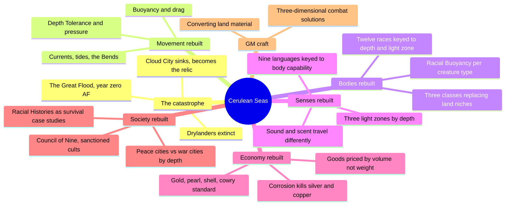
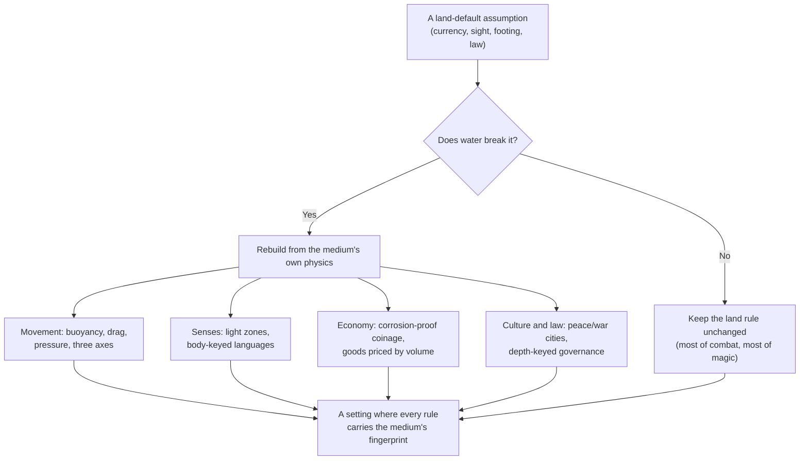
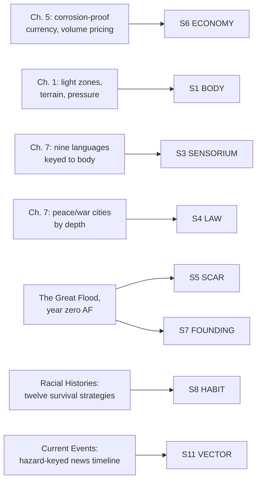

# BVX.1169 — Cerulean Seas: Adventure Under the Waves — Emily Kubisz, J. Matthew Kubisz, Matthew Cicci & Sam G. Hing (2010)
### Knowledge Entry — Distill

A 2010 Pathfinder-compatible campaign setting that drowns 99% of a fantasy world and rebuilds every rule from the waterline up; read here as a worked demonstration of a single-environment generator, not for its bestiary stat blocks.

## TABLE OF CONTENTS
- [Core Thesis](#1-core-thesis)
- [Mind Models](#2-mind-models)
- [Framework](#3-framework--structure)
- [Key Concepts](#4-key-concepts)
- [Heuristics](#5-heuristics--decision-rules)
- [Invariants](#6-invariants)
- [Pitfalls](#7-pitfalls--myths)
- [Application](#8-application)
- [Cross-References](#9-cross-references)
- [Provenance](#10-provenance--confidence)

---

## 1 · CORE THESIS

Water is not a coat of paint on a land setting; it is a generator. Run every default assumption (what currency survives, how far light and sound travel, which axis you move on, who counts as law-abiding) through the medium, and rebuild whatever fails the test. Coherence comes from applying that one filter everywhere, not from inventing detail per system.

---

## 2 · MIND MODELS

*Required. Minimum two diagrams, maximum five.*

**Diagram 1 — the whole argument.**
Caption: *nine chapters sort into one repeated move: take a land-default system, run it through the medium, publish what survives and what had to be rebuilt.*

**Diagram 2 — the central mechanism (the same filter, run once per system).**
Caption: *the book's real unity is not its table of contents, it is this one question asked five times: what does the water force here, and what does it leave alone.*

**Diagram 3 — mapped onto the Command's SETTING SLICE (S1-S12).**
Caption: *the book runs deep on seven of twelve slice layers and is strongest exactly where the medium's physics are most load-bearing: economy, body, and sensorium, the three layers a fantasy writer usually treats as free.*

---

## 3 · FRAMEWORK / STRUCTURE

Nine chapters, each applying the same medium-first filter to one subsystem:

| Chapter | Governing move |
|---|---|
| 1. Undersea Basics | Rebuild physics: light zones, buoyancy, drag, pressure/Depth Tolerance, currents, terrain |
| 2. Undersea Races | Twelve races, each keyed to a depth band, light zone, or survival strategy from the flood |
| 3. Undersea Classes | Replace three land class-niches (druid, ranger, bard) with kahuna, mariner, siren |
| 4. Aquatic Skills & Feats | Adjust the skill list for a medium where climbing, hearing, and hiding work differently |
| 5. Money & Equipment | Rebuild currency and materials around corrosion and buoyancy, not tradition |
| 6. Magic of the Sea | Substitute spells that assume dry air, fire, or gravity |
| 7. The Cerulean Seas | The instanced world: racial histories, religion, cities, a sample news timeline |
| 8. Mastering the Sea | GM craft: converting land material, running three dimensions at the table |
| 9. Bestiary | Monsters built from the same buoyancy/Depth Tolerance chassis as the races |

The book's spine is chapter 1's physics, applied a second time to bodies (2-3), a third time to gear (5), a fourth time to magic (6), and a fifth time to the instanced world (7). Chapters 8 and 9 are craft and content, not new method.

---

## 4 · KEY CONCEPTS

| Concept | What it is | Why it matters |
|---|---|---|
| **Depth Tolerance** | Each race's safe-depth rating; pressure damage begins 100 feet beyond it, worsening in fixed bands | The setting's core resource, the way light radius works in a dungeon crawl |
| **Buoyancy** | A signed number (racial plus equipment) deciding float/sink/neutral; managed by sacrificing swim speed | Recasts "gravity" as a stat every creature and object carries, not a background constant |
| **Drag** | Large flat surfaces resist movement regardless of buoyancy; size and orientation matter more than weight | A second, independent tax on movement that punishes bulk specifically |
| **The Bends** | Ascending too fast after acclimating to pressure causes Constitution damage, distinct from Depth Tolerance damage | Makes vertical retreat costly in a way horizontal retreat is not; a built-in reason 3D combat can't flatten |
| **Light zones** | Sunlit (to ~600 ft.), twilight (to ~3000 ft.), midnight (below): each hosts different life and senses | Depth becomes a sensory axis, not just a movement one |
| **Corrosion-driven currency** | Silver and copper corrode in seawater, so the standard shifts to gold (stamped, not smelted) plus pearl, shell, and cowry at fixed ratios | The clearest proof-of-method in the book: money redesigned from the medium's chemistry, not reskinned |
| **Volume over weight pricing** | Trade goods price by volume because weight is "unreliable under the ocean's waves" | A second-order consequence of buoyancy: the unit of commerce changes too, not just the coins |
| **Peace city / war city** | Weapons checked at the gate under an active guard, or citizens expected to arm themselves because the guard has bigger problems | Civic character reads directly off a city's depth and exposure, not off an abstract ruler |
| **Racial Buoyancy by body plan** | Buoyancy derives from body type (fish-bodied, non-fish vertebrate, hard-shelled invertebrate, soft-bodied invertebrate, plant) and size, with a hybrid formula | Generative, not a fixed list: any new creature is buoyancy-costed from its body plan alone |
| **Body-keyed languages** | Nine languages built from what speaker bodies can do: skin-flush and posture (Cephalite, no vocal cords), scent (Pelagic, sharks), clicks and high pitches (Common) | Communication is derived from anatomy first, not translated from land languages |
| **The Great Flood / AF calendar** | One catastrophe, dated year zero, from which every setting date is measured ("n AF") | Founding history is load-bearing in the clock itself, not just in lore text |
| **Racial Histories as survival case studies** | Each of twelve races gets one paragraph on how it specifically weathered the flood; present culture is the residue | A repeatable generator: ask how a population survived the disaster, derive its culture from the answer |
| **Converting existing material** | Any land creature, item, or adventure has an "aquatic equivalent"; templates and substitution tables are supplied | A stated method for porting content across an environment boundary, not starting from zero each time |

---

## 5 · HEURISTICS & DECISION RULES

| Situation | Do this | Not this |
|---|---|---|
| Introducing a hostile-environment setting to players | Start shallow, add one mechanic at a time (buoyancy, then pressure, then currents) | Front-load every new rule in the first session |
| Deciding whether a land rule needs to change | Ask "does the medium's physics actually break this" before touching it | Rewrite rules that don't change just because the setting is new |
| Designing currency for a hostile medium | Trace what survives the environment chemically (corrosion, weight, buoyancy) before picking materials | Reskin land coins with new names and call it done |
| Building a race's culture | Derive it from how that population specifically survived the setting's founding catastrophe | Assign a culture from a trope with no causal link to the setting's history |
| Setting a city's law and civic tone | Read it off the city's depth and exposure to the environment's dangers | Hand governance down independent of what the place actually has to survive |
| Building a language for a nonhuman body | Start from what that body can physically produce (skin, scent, pitch) before writing grammar | Default every species to spoken, humanlike language |
| Porting a land adventure or item into the setting | Ask what specifically would need to change, be adjusted, or replaced by the medium | Drop it in unmodified and hope nobody notices |
| Generating a setting's forward motion | Interleave environmental-hazard beats with political beats in the news timeline | Write only political events and leave the environment static |
| Running combat in a three-axis space | Pick one elevation-tracking method and commit before the table sits down | Discover mid-combat that "up and down" has no physical representation |

---

## 6 · INVARIANTS

1. **The environment is not scenery, it is a filter.** Every system, currency, law, language, must pass through the medium's physics before it is trusted as setting.
2. **A land default survives only if the medium doesn't break it.** Most of combat and magic runs unchanged; what changes, changes because the water demands it, not for novelty.
3. **Depth is a compound axis.** It simultaneously gates movement (pressure), senses (light zones), and value (rare depths breed rare goods); no single system owns "depth."
4. **A body's physical capability sets its language and its culture's ceiling before any lore is written.** What a creature can perceive or produce sensorially precedes what it can say or build.
5. **A founding catastrophe should be measured, not just narrated.** Dating every event against it (here, "AF") keeps the wound structurally present rather than optional backstory.
6. **Converting content across an environment boundary is a method, not a one-off trick.** The same "what changes, what stays" question applies to a spell, a monster, or an entire adventure.

---

## 7 · PITFALLS / MYTHS

- Treating an underwater (or any hostile-environment) setting as a reskin: same coins, same law, same senses, just wetter.
- Letting land intuitions slip back in mid-campaign (the book's own play-test example: a GM instinctively invents "pigs" on a seafloor farm before catching the error).
- Pricing goods by weight in a medium where weight stops being a reliable measure.
- Writing a race's culture as flavor text disconnected from how that race actually survived the setting's founding disaster.
- Giving every settlement the same civic posture regardless of how exposed or how deep it sits.
- Assuming 3D movement can be handled by describing it verbally without a physical or notational elevation system at the table.
- Treating history as a fixed backstory chapter instead of a live measuring stick (a calendar, a rename, a scar) the present keeps citing.

---

## 8 · APPLICATION

- **Spine level:** SETTING (non-story-spine source; the whole book is a single hostile-environment instance, useful as a worked comparison against a science-fiction environment rather than as plot material)
- **12-layer character stack:** none directly; the body-keyed-language method (Diagram 3, S3) runs structurally parallel to how a character's physical layer should constrain their expressive layer, but this stays a setting-side technique, not a character feed
- **plot_systems:** contextual candidate once `04_PLOT_SYSTEMS/` opens; the Current Events timeline (S11) is a ready-made news-generator pattern, alternate an environmental-hazard beat with a political beat on a fixed calendar
- **Setting:** primary — this is a full-instance demonstration of the hostile-environment-as-generator method against seven of the twelve SETTING SLICE layers (S1, S3, S4, S5, S6, S7, S8 at primary strength, S11 supporting)

The transferable move for a science-fiction setting built on one hostile environment (vacuum, an ice moon, a gas giant's pressure bands) is this book's filter, not its ocean furniture: run every subsystem the setting needs through the specific physics of the chosen medium and keep only what survives unchanged. The strongest transferable technique is the economy method: identify what the environment destroys (corrosion, weight-as-a-measure, whatever the analog is for vacuum or radiation), then rebuild the unit of exchange from that constraint rather than reskinning existing currency. The second is the body-keyed language technique (S3): derive a species' communication from what its body can physically do in the medium before writing vocabulary. Where the book stays thin, UNDERSIDE (S10) is little more than one crime faction, and ALLURE (S9) is implicit rather than engineered; both remain open ground for a science-fiction instance to fill from other sources.

---

## 9 · CROSS-REFERENCES

| Related entry | Relation |
|---|---|
| [[BVX.0458]] | Kobold Guide to Worldbuilding — sibling SETTING-shelf distill; this book's Great Flood is a textbook instance of Grubb's post-apocalyptic-default pattern (Apocalypso), and its nation-first geography order is the same discipline Roberts' mapmaking essay argues for, run against water instead of land |
| [[BVX.1122]] | GURPS Hot Spots: Renaissance Venice — a worked trade-gazetteer instance; that book fills BODY/LAW/ECONOMY/FOUNDING richly from real history, this one fills the same layers from invented physics, a useful contrast in how ECONOMY gets derived when there is no historical record to copy |
| [[BVX.1167]] | Routledge Handbook of Strategic Culture — sibling SETTING-shelf distill; that book derives a faction's HABIT and LAW from perceived history, this book derives the same layers from physical survival of a catastrophe, two different engines landing on the same S7/S8 territory |

---

## 10 · PROVENANCE & CONFIDENCE

Full text, pdftotext extraction, ~292pp, clean text layer with a readable (if column-garbled in places) table of contents. Read in full: front matter and legend ("The Legend of the Drylanders"); Introduction and Using This Book; Common Terms; Environmental Basics (light zones, topography, tides, buoyancy, drag, pressure/Depth Tolerance, currents, movement, all named terrain types); Aquatic Currency and New Aquatic Materials (ch. 5); the campaign-setting chapter's opening, Racial Histories (all twelve PC races plus notable NPCs), Aquatic Languages, the opening of Religion (Council of Nine, sanctioned cults), a representative sample of Cities entries, and the full Current Events timeline; Gamemastering Under the Sea (converting existing material, buoyancy/Depth Tolerance tables, the 3D-combat solutions survey). Sampled or not read in depth: Undersea Classes' mechanical writeups (ch. 3), Aquatic Skills & Feats (ch. 4), the full spell lists (ch. 6), the remainder of Religion and Cities, and the Bestiary (ch. 9, browsed only for its buoyancy/Depth Tolerance chassis pattern).

The S-layer keying in `feeds:` and Diagram 3 is this distill's synthesis against `ssot_03_setting_system.md` (PART A, the twelve-layer SETTING SLICE), read directly for this task. `zotero_key` is left blank per `inventory-live.json`: this title is a PDF-drop item ("Alluria - Cerulean Seas, An Undersea Campaign Setting.pdf" under `Q:/_PDF_DROP`) with no Zotero record, so `bvx_provisional: true` is set to match. `spine: [SETTING]` and the empty character-stack application follow the v4 template's binding rule that setting sits beside the L0-L7 spine, never on it.

## META
- Template: BVX-LEARN-v4.0
- Source classification: full-text TTRPG supplement, deep extraction on chapters 1, 5, 7 (partial), and 8, sampled on chapters 2-4, 6, 9
- Created / Updated: 2026-09-29
