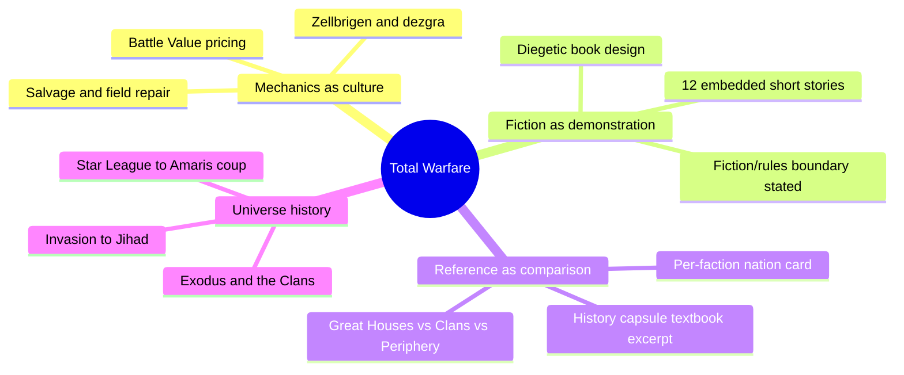
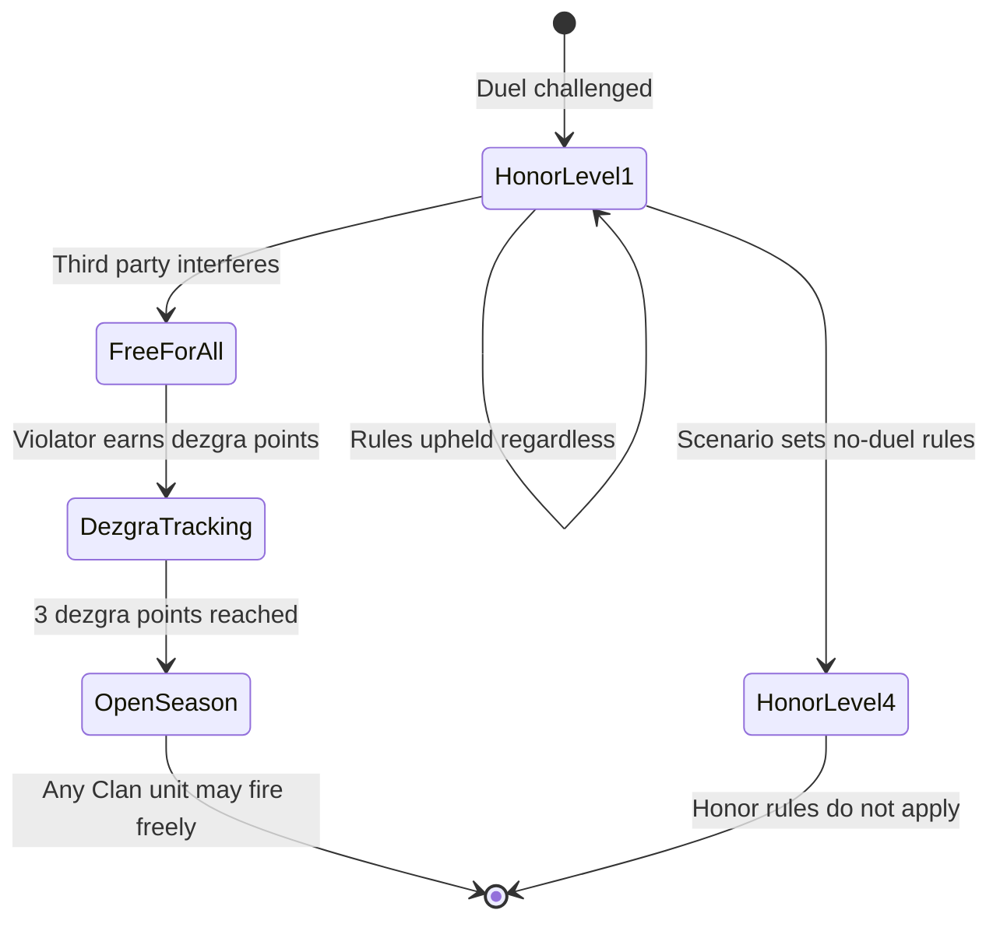
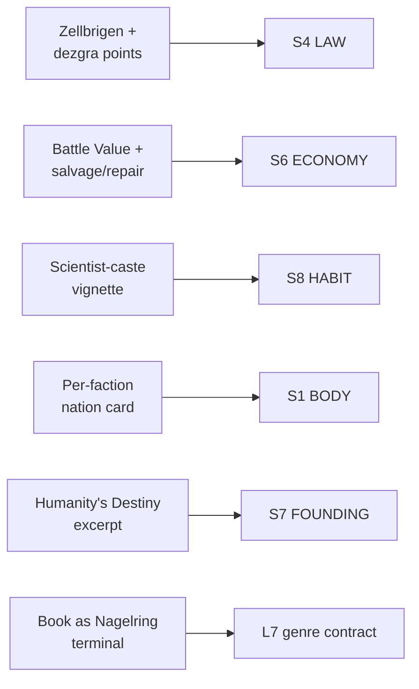

# BVX.1170 — Classic BattleTech Total Warfare — FanPro LLC (2006)
### Knowledge Entry — Distill

The core wargame rulebook for Classic BattleTech (giant robot combat, 31st-century interstellar war): a 384-page tournament-rules manual that turns out to be one of the library's clearest demonstrations that game mechanics, not just prose, are a worldbuilding medium.

## TABLE OF CONTENTS
- [Core Thesis](#1-core-thesis)
- [Mind Models](#2-mind-models)
- [Framework](#3-framework--structure)
- [Key Concepts](#4-key-concepts)
- [Heuristics](#5-heuristics--decision-rules)
- [Invariants](#6-invariants)
- [Pitfalls](#7-pitfalls--myths)
- [Application](#8-application)
- [Cross-References](#9-cross-references)
- [Provenance](#10-provenance--confidence)

---

## 1 · CORE THESIS

A wargame's rules ARE its setting's physics: Total Warfare never states that Clan culture prizes honor over survival, it makes honor cost dezgra points and survival cost a duel. Twelve embedded short stories and per-faction data cards do the rest, teaching a reader the universe by making them play its values.

---

## 2 · MIND MODELS

*Required. Minimum two diagrams, maximum five.*

**Diagram 1 — the whole argument.**
Caption: *a rulebook builds a universe on three tracks at once: mechanics that encode values, fiction that demonstrates them, and reference cards that make factions comparable.*

**Diagram 2 — the central mechanism (zellbrigen turns a value into a scored ritual).**
Caption: *honor isn't a trait on a sheet, it's a state machine: violate the ritual and the fight itself changes shape.*

**Diagram 3 — mapped onto the Command's SETTING SLICE (S1–S12).**
Caption: *this book is thin on cosmology and daily-life sensorium but unusually rich on S4 LAW and S6 ECONOMY, because a wargame's job is to price and rule-bind conflict, not describe a street.*

---

## 3 · FRAMEWORK / STRUCTURE

Total Warfare is organized the way a tournament rulebook has to be: sequential game systems (movement, combat, heat, aerospace, infantry, building rules), each opened by a short fiction vignette dated and located in the universe, each closed by unit-type record sheets. The book explicitly separates its two registers rather than blending them: fiction sections carry a distinct layout and are italicized in the Table of Contents, and a "Fiction vs. Rules" note tells the reader outright that story fiction should never be read as rules text, even when the two sit on facing pages. Framing material (introduction, universe history, faction reference cards) is front-loaded in the first forty pages before the rules begin, so a reader who wants "the setting" rather than "the game" can stop there and already have a working model of the universe.

---

## 4 · KEY CONCEPTS

| Concept | What it is | Why it matters |
|---|---|---|
| **Zellbrigen (ritual dueling)** | A Clan warrior culture's honor code, rendered as a formal challenge-and-response combat subsystem with four escalating "Honor Levels" | Converts an abstract cultural value (honor over overwhelming force) into a procedure a table can actually run and violate |
| **Dezgra points** | A dishonor counter: violating the duel's terms (fleeing range, using area-effect weapons) accrues points; 3 points strips a unit of the ritual's protection for the rest of the game | Makes dishonor a resource with a threshold, not a vibe — a culture's tolerance for cheating is a number |
| **Battle Value (BV)** | A single point-cost that combines a unit's chassis, weapons and armor with its pilot's skill rating | Prices trained crew alongside hardware, so "power" in the setting is explicitly personnel-plus-machine, never machine alone |
| **Per-faction nation card** | A compact reference block per Great House/Clan/Periphery state: Ruler, Government, Capital (city, world), Dominant Language(s), Dominant Religion(s), Founding Year, Currency | A portable, reusable worldbuilding instrument — eight fields make any invented nation comparable to any other at a glance |
| **The history capsule** | A two-page in-universe "first-year geopolitical curriculum" excerpt that compresses roughly a millennium (Star League, the Amaris coup, Kerensky's Exodus, the Clan Invasion, the Jihad) into one continuous cause-and-effect chain | Delivers founding history pre-digested and in-voice, rather than as an out-of-universe timeline appendix |
| **Diegetic book design** | The rulebook's graphic layout is presented as the interface of an in-universe military academy computer terminal (House Steiner's Nagelring) | The physical artifact of the rulebook is itself a piece of worldbuilding, not a neutral container for the rules |
| **Caste as physiological cost** | The scientist-caste/ProtoMech-pilot vignette shows a warrior chemically dependent on the neural-interface drug her own caste system requires | Culture is shown as bodily consequence, not as a chart of who reports to whom |
| **Fiction/rules firewall** | An explicit authorial note: fiction may bend rules aesthetics for story needs and must never be read as a rules source | Protects both registers — the setting can be dramatic without the rules becoming unpredictable, and vice versa |
| **Salvage and field repair** | Captions and rules text (a unit "field-repaired with on-hand Inner Sphere technology") treat damaged matériel as a resource to be scavenged, not simply destroyed | Encodes a wartime economy of scarcity directly into flavor text attached to game pieces |

---

## 5 · HEURISTICS & DECISION RULES

| Situation | Do this | Not this |
|---|---|---|
| A faction's culture values something (honor, secrecy, loyalty) | Build a mechanic that rewards or punishes it directly, with a visible threshold | State the value once in a sourcebook paragraph and never touch it again |
| Introducing a new faction or nation | Fill a compact, repeatable card (ruler, government, capital, language, religion, founding year, currency) | Write a full essay per faction before any are comparable to each other |
| Compressing deep backstory | Write it as an in-universe document (a textbook excerpt, a field manual quote) with its own voice and bias | Append an out-of-universe timeline that nobody in the world would ever read |
| Showing what a social hierarchy costs | Follow one person through what the hierarchy does to their body or choices | Describe the hierarchy's org chart and stop |
| Deciding how "powerful" a unit or character is | Combine the hardware/resource layer with the skill/training layer into one score | Rate raw hardware alone and treat trained operators as interchangeable |
| Mixing fiction and rules in the same book | State the boundary explicitly and give fiction its own visual register | Let dramatic license quietly leak into what a table treats as binding |
| Wanting the book itself to feel like an artifact of the world | Frame the whole document as something a character in the world would actually hold or read | Treat the rulebook as a neutral, out-of-universe container |

---

## 6 · INVARIANTS

1. **A rule is a stronger worldbuilding tool than a description**, because a rule is something a reader must act through, not just read.
2. **A cultural value only becomes real at the table when it has a cost.** Zellbrigen without dezgra points would be a suggestion, not a law.
3. **Power in a setting reads as trained-agent-plus-resource**, never resource alone, whenever a Battle-Value-style combined score is used.
4. **Comparable factions need a shared card**, not individually bespoke treatments, or a reader can never weigh one against another.
5. **History earns its place by being voiced**, not merely dated: an in-universe excerpt does work a bare timeline cannot.
6. **A hierarchy is proven, not asserted, by showing what it costs one member of it.**
7. **Fiction and rules can share a book without merging** if the boundary between them is stated and visually marked.

---

## 7 · PITFALLS / MYTHS

- Treating "the setting" and "the rules" as separate deliverables that happen to ship in the same cover — Total Warfare's own fiction/rules firewall exists precisely because the two are easy to conflate by accident.
- Writing a faction's culture as a paragraph of adjectives instead of a mechanism the table has to run — a stated value with no cost is decoration.
- Rating military or magical power by hardware alone, ignoring the trained operator, which flattens every unit of the same type into an identical, interchangeable token.
- Delivering deep history as an inert reference appendix instead of a document with a voice, a bias, and a reason to exist inside the world.
- Assuming a caste or hierarchy is "shown" once its org chart is drawn, without dramatizing what it costs the people inside it.
- Letting a rulebook's physical presentation stay generic when the setting itself would produce a very specific kind of document (a terminal, a field manual, a liturgy).

---

## 8 · APPLICATION

- **Spine level:** SETTING (non-story-spine source; keys to the entity beside the L0–L7 spine, per the SETTING SLICE's binding rule that setting is a Domain embodied, never a level)
- **12-layer character stack:** none directly — a setting-side source; its Battle-Value method (hardware-plus-skill as one score) is structurally the same move as auditing an L6 DRIVE want against its costs, but it is not itself a character-layer feed
- **plot_systems:** contextual candidate once `04_PLOT_SYSTEMS/` opens — the zellbrigen state machine (Diagram 2) is a ready-made template for any scene where a culture's rule of engagement can be broken on purpose to escalate stakes
- **Setting:** primary — feeds S4 LAW and S6 ECONOMY at full strength (the book's real center of gravity), S8 HABIT and S1 BODY as supporting, S7 FOUNDING supporting, and L7 genre-contract contextually via its own diegetic framing device

The book's steal-worthy move for a writer building a SF setting is not its lore (BVX.0362, Era Report 2750, already carries the deep-history/faction-snapshot half of this universe) but its *method*: a rule with teeth communicates a culture's values faster and more durably than a paragraph of exposition, because the reader has to act through it. The zellbrigen/dezgra pairing is the cleanest instance in the library of turning an abstract value (honor) into a state machine with a threshold, and the per-faction nation card is a directly reusable S1/S7/S8 authoring tool independent of BattleTech's own setting: any Command faction (DCUS included) could be given the same eight-field card to force comparability against its siblings. The scientist-caste vignette is the strongest S8 HABIT instance seen yet in the shelf for showing hierarchy as bodily cost rather than org-chart position, and the diegetic-book conceit (the rulebook as a Nagelring terminal) is a low-cost, high-payoff device: presenting a reference document as an artifact a character would hold, rather than as neutral scaffolding, is portable to any SETTING SLICE deliverable the Command produces (a codex, a field manual, a liturgy).

---

## 9 · CROSS-REFERENCES

| Related entry | Relation |
|---|---|
| [[BVX.0362]] | Era Report 2750 — the deep-history and faction-dissolution half of this same universe; that entry carries S11 VECTOR/S5 SCAR/S7 FOUNDING for BattleTech's lore, this entry carries S4 LAW/S6 ECONOMY for its rules-as-culture method — read together for the full universe |
| [[BVX.0458]] | Kobold Guide to Worldbuilding — the craft-essay counterpart; where that book argues setting design should be "dynamite, not encyclopedia," this book is a worked example of dynamite built as a scoring rule |
| [[BVX.1122]] | GURPS Hot Spots: Renaissance Venice — another SETTING-SLICE worked instance; that one demonstrates an S1/S3 sourcebook, this one demonstrates S4/S6 encoded in mechanics rather than prose |
| [[BVX.0067]] | Collaborative Worldbuilding for Writers and Gamers — undistilled sibling, same SETTING shelf; likely shares this entry's interest in tools a GM runs rather than lore a reader absorbs |

---

## 10 · PROVENANCE & CONFIDENCE

Full text, pdftotext extraction, 384pp. Read in full or near-full: front matter and publication history (pp. 1–13), the universe-history capsule ("Humanity's Destiny," Great Houses, the Clans, Periphery States, Mercenaries, Pirates), the per-faction nation cards (Clan Jade Falcon, Clan Wolf-in-Exile, House Steiner/Lyran Alliance, and others sampled across the faction-card spread), the "Fiction vs. Rules" and "Fiction and Art" sections, and the full Zellbrigen/dezgra rules subsystem (Honor Levels, the Clan Honor Interpretation Table, area-effect-weapon violations). Sampled for texture and confirmation, not deep-extracted: the twelve embedded fiction vignettes scattered through the combat-rules chapters (read in full: the scientist-caste/ProtoMech-pilot vignette and the Khan Pryde/Loremaster Pershaw watch-command scene; sampled: others identified by their in-universe date/location headers, e.g. "Draconis March, Federated Suns," "Taurian Concordat," "Luthien"). Not extracted: the bulk of the movement, combat-resolution, heat, and aerospace rules tables themselves (hundreds of pages of tournament mechanics with no direct setting content beyond Battle Value and salvage, which were read).

Title, publisher and year are taken from the book's own copyright and title pages: "Classic BattleTech Total Warfare," © 2006 WizKids, Inc., published by FanPro LLC, BattleTech Line Developer Randall N. Bills. The task brief's attribution ("Catalyst Game Labs") names the publisher of BattleTech's later reprints; this specific PDF is the 2006 FanPro LLC first printing, so the frontmatter follows the book's own title page per the brief's instruction to take title/author/year from the source itself. The S-layer keying in frontmatter `feeds:` is this distill's synthesis against `ssot_03_setting_system.md` (PART A, the twelve-layer SETTING SLICE); `zotero_key` is left blank pending the next inventory reconciliation pass.

## META
- Template: BVX-LEARN-v4.0
- Source classification: full-text core rulebook, deep extraction on framing/history/faction-card/zellbrigen material, sampled on embedded fiction and rules-mechanics chapters
- Created / Updated: 2026-09-29
