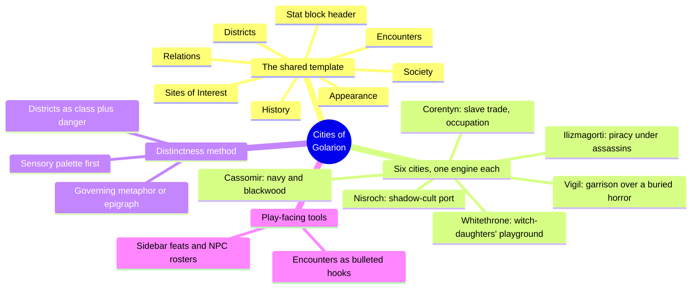
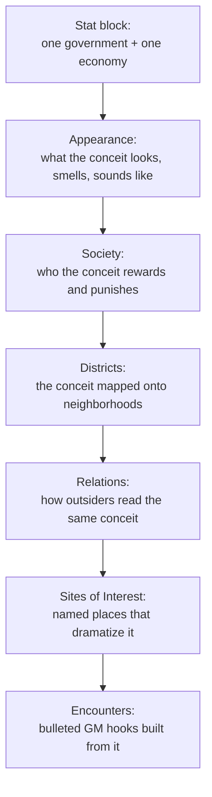
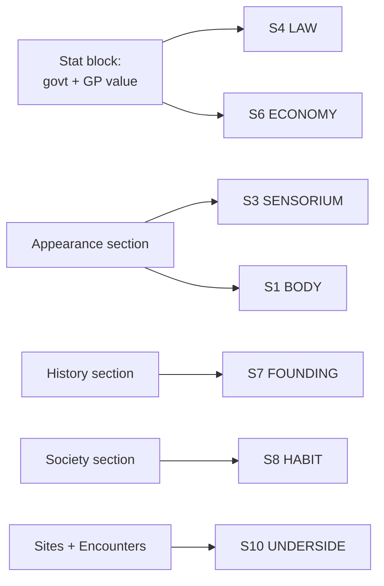

# BVX.1171 — Pathfinder Chronicles: Cities of Golarion — Frost, Hitchcock, Keith, McCreary, Nelson, Quick (2009)
### Knowledge Entry — Distill

A Paizo Pathfinder Chronicles sourcebook: six GM-usable city write-ups (Cassomir, Corentyn, Ilizmagorti, Nisroch, Vigil, Whitethrone), each built to one shared template by a different author, sharing the SETTING shelf as the first worked example of a chapter-length city template rather than city theory.

## TABLE OF CONTENTS
- [Core Thesis](#1-core-thesis)
- [Mind Models](#2-mind-models)
- [Framework](#3-framework--structure)
- [Key Concepts](#4-key-concepts)
- [Heuristics](#5-heuristics--decision-rules)
- [Invariants](#6-invariants)
- [Pitfalls](#7-pitfalls--myths)
- [Application](#8-application)
- [Cross-References](#9-cross-references)
- [Provenance](#10-provenance--confidence)

---

## 1 · CORE THESIS

A city write-up is one governing conceit (stated in a two-line stat block: government plus economy) re-rendered at shrinking scale through appearance, society, districts, relations, and hooks. Distinctness comes from repeating a small sensory palette everywhere, not from inventing more facts.

---

## 2 · MIND MODELS

*Required. Minimum two diagrams, maximum five.*

**Diagram 1 — the whole argument.**
Caption: *six authors, one template — the book is a rig for building GM-usable cities, and the six chapters are six runs of the same rig.*

**Diagram 2 — the central mechanism (one conceit, rendered down through the chapter).**
Caption: *nothing below the stat block is free invention — Appearance shows the conceit, Society tells who it rewards, Districts fractal it, Relations flip it, and the last two sections turn it into table-ready hooks.*

**Diagram 3 — mapped onto the Command's SETTING SLICE (S1-S12).**
Caption: *the stat block alone seeds S4 and S6; Appearance is the book's strongest, most transferable move and lands squarely on the SETTING SLICE's thinnest layer, S3.*

---

## 3 · FRAMEWORK / STRUCTURE

Six chapters, one per city, each written by a different Paizo designer against an identical skeleton (the introduction names it explicitly: "each of these cities is presented in the same format so you can easily find what you're looking for"):

| Slot | Content |
|---|---|
| Chapter-opening art + flag | A full-page illustration (a city guard, or a scene) plus the sovereign nation's flag — visual identity before a word of text |
| Stat-block header | Allegiance (nation), size class (Small/Large City), government type + alignment, Base GP Value, Population — the whole city compressed to five lines |
| Appearance | Sights, sounds, smells; sometimes a district-by-district sensory pass |
| History | Origin and growth, kept short |
| Society | Locals, government, classes, monsters/slaves where relevant |
| Relations | How the city deals with neighbors, foreign interests, monster groups |
| Districts | Named neighborhoods, each with builders, class, and a hazard or secret |
| Sites of Interest | A handful of named locations, each a paragraph with an adventure hook implied or stated |
| Encounters | A short bulleted list of plot hooks a GM can drop in directly |

Sidebars vary by chapter (new feats, famous NPC groups, an in-world epigraph) but the eight-slot skeleton above is constant across all six.

---

## 4 · KEY CONCEPTS

| Concept | What it is | Why it matters |
|---|---|---|
| **The stat-block header** | Five lines: allegiance, size class, government + alignment, Base GP Value, population | The whole city's identity card; every later section answers to these five lines |
| **One governing conceit** | A single load-bearing idea per city (Cassomir = navy fed by a druid timber pact; Nisroch = a totalitarian port devoted to a shadow god) | Everything else in the chapter is that idea re-rendered at a smaller scale, not a new fact |
| **Sensory-first Appearance** | The Appearance section leads with color, material, sound, and smell before politics or history | The fastest way a reader tells two cities apart; Whitethrone's white-and-gingerbread palette and Nisroch's black basalt and iron whistles do more distinguishing work than any stat difference |
| **Present-tense History** | History sections stay short and stop at whatever still explains the city today | Demonstrated at book length, not just argued (matches BVX.0458's rule directly) |
| **Society as class plus ritual** | Who's respected, who's second-class, and one recurring public ritual that performs the city's values | Turns "the people are proud sailors" into a scene (Cassomir's red-paint procession) instead of an adjective |
| **Districts as the conceit fractal** | Each named district repeats the city's governing conceit at neighborhood scale, distinguished by which class and which danger live there | Admiral's Fen (sinking swamp, lower class) and Threegates (wealthiest, driest) are the same city's rise and fall told twice |
| **Relations as an outside mirror** | A separate section states how the world outside sees the city, and it often contradicts the city's self-image | Manufactures built-in friction (Cassomir thinks Taldor owes it a debt; Taldor barely notices) |
| **Sites of Interest** | A handful of named locations, each with just enough detail to attach an adventure hook | Distinct from Districts (which are zones) and from Encounters (which are scenarios) — a location layer in between |
| **Encounters as an explicit tool section** | A short bulleted list, separated typographically from lore, giving a GM immediate plot hooks | The book draws a hard line between "read this to understand the city" and "use this to run a session" |
| **Diegetic framing (epigraph)** | Whitethrone opens with a quoted in-world travel writer instead of a designer's summary | Establishes tone and danger before a single game-mechanical fact appears |
| **City guard illustration + flag** | Every chapter carries one recurring visual per city (a typical guard, the nation's flag) | Identity compressed into a single reusable image, the visual equivalent of the stat block |

---

## 5 · HEURISTICS & DECISION RULES

| Situation | Do this | Not this |
|---|---|---|
| Starting a new city | Write the stat-block line first: government, economy, size | Improvise lore first and back into the economics later |
| Making a city feel distinct fast | Pick one small sensory/material palette that follows from the economy or geography and repeat it in every section | Scatter unrelated flavor details across sections |
| Writing a city's history | Write only the two or three beats that still explain a present tension | Write a full timeline nobody at the table will use |
| Building districts | Give each district a class, a danger, and one sensory sentence | List building types with no social or hazard content |
| Writing a city's outside reputation | Make Relations a second, partly contradicting truth about the city | Restate what Society already said, just from a distance |
| Giving a GM usable hooks | Close the chapter with short bulleted Encounters tied to named NPCs or sites | Leave adventure hooks implicit inside paragraphs of lore |
| Setting tone before mechanics | Open with a sensory vignette or a diegetic quote | Open with population figures and a tax rate |
| Reusing a city as an adversary base | Root every threat in the stat-block's one conceit (a shadow-cult port breeds shadow-cult threats, not random monsters) | Bolt on an unrelated threat because it's a cool monster |

---

## 6 · INVARIANTS

1. **Every city answers to one governing conceit**, stated in the stat block before a single paragraph of prose exists.
2. **Government and economy are declared as facts first, then dramatized as feeling** — the stat block precedes Appearance, never the reverse.
3. **History earns space only in proportion to what it explains about the present**, held constant across all six chapters regardless of author.
4. **A city's self-image and its outside reputation are written as two different, sometimes conflicting texts** (Society vs. Relations), not one restated twice.
5. **Distinctness is built by repeating a small palette everywhere**, not by accumulating unrelated invented facts.
6. **Lore sections and tool sections are kept explicitly separate** (Appearance/History/Society/Relations/Districts vs. Sites of Interest/Encounters) — inspiration and immediate usability are different deliverables, not blended together.
7. **Districts are the city's conceit at a smaller scale**, each one distinguished chiefly by class and danger, never by architecture alone.

---

## 7 · PITFALLS / MYTHS

- Treating the stat block (population, GP value) as the payload rather than a two-line hook for everything that follows.
- Writing History as a complete timeline instead of the handful of beats that still bite today.
- Letting Districts collapse into an undifferentiated list of building types with no class or hazard content.
- Treating Sites of Interest as pure scenery rather than as a location that implies a question a party would want answered.
- Skipping the sensory palette and jumping straight to politics and government — the fastest route to a city that reads as generic.
- Confusing Relations with a second pass at Society; if it doesn't add friction or a contradiction, it isn't doing its job.
- Mixing lore and GM tools in the same paragraph instead of a clean handoff at the Sites/Encounters boundary.

---

## 8 · APPLICATION

- **Spine level:** SETTING (non-story-spine source; keys to the entity beside the L0-L7 spine, per ssot_03's binding rule that setting is a Domain embodied, never a level)
- **12-layer character stack:** none directly — a setting-side source; its named-NPC-plus-ritual method (Admiral Kasaba, the Gozreh procession) is a ready seed if any of these NPCs were promoted into an actual character stack, but the entry itself does not feed a character layer
- **plot_systems:** primary candidate once `04_PLOT_SYSTEMS/` opens — the Sites of Interest / Encounters split is a directly reusable two-tier deliverable: write the location as lore, then write a separate short bulleted hook list from it, exactly as this book does chapter after chapter
- **Setting:** primary — the first SETTING-shelf entry that is a worked template rather than a worldbuilding-theory text; six independently-authored, identically-shaped city chapters make the template's invariance visible in a way a single example couldn't

The book's real transferable tool for a science-fiction setting system is the two-part mechanism in Diagram 2: a two-line governing conceit (what does this place run on, who runs it) stated before any prose, then every later section forced to answer to that conceit rather than free-associate new facts. That discipline is genre-neutral — a Delta Coast Ultra School write-up, or any DCUS-adjacent institution, could take the same eight-slot skeleton (stat-block-equivalent, Appearance, History, Society, Relations, Districts/sub-units, Sites of Interest, Encounters) and get the same fast-distinctness payoff this book gets from six wildly different Golarion cities sharing one rig. The single most importable single move is Appearance-as-sensory-palette-first: this book's strongest and most consistently executed section is exactly the SETTING SLICE's thinnest layer (S3 SENSORIUM, flagged canon-thin for DCUS in BVX.0458's provenance), and every chapter here shows the same cheap trick working six times — pick three or four sensory facts that follow causally from the economy or geography (white and gingerbread for a witch-ruled winter city; black basalt and iron whistle-tones for a shadow-cult port) and repeat them instead of inventing new, unrelated detail.

---

## 9 · CROSS-REFERENCES

| Related entry | Relation |
|---|---|
| [[BVX.0458]] | Kobold Guide to Worldbuilding — theory counterpart; this entry is the worked-template sibling, six chapters demonstrating the present-tense-history rule and terrain-first ordering Kobold states as principle |
| [[BVX.1122]] | GURPS Hot Spots: Renaissance Venice — sibling worked SETTING-SLICE instance; that entry is a single deep city, this one is six shallow-but-complete cities sharing one template, so the two together show both depth and breadth ends of the same method |
| [[BVX.0067]] | Collaborative Worldbuilding for Writers and Gamers — undistilled SETTING-shelf sibling, same craft-not-theory register |

---

## 10 · PROVENANCE & CONFIDENCE

Full text, pdftotext extraction, 64pp, clean text layer with a machine-readable TOC (Introduction, then six chapters: Cassomir, Corentyn, Ilizmagorti, Nisroch, Vigil, Whitethrone). Read in full: the Introduction ("Building Six Cities," which states the shared template explicitly) and the complete Cassomir chapter (Appearance through Encounters, all sidebars). Sampled by section for the remaining five chapters — stat-block header, opening Appearance paragraphs, and History openings for Corentyn, Nisroch, and Whitethrone, confirmed against a full-text grep for the section headers (Sites of Interest appears exactly once per chapter, six total, confirming the eight-slot skeleton holds across all six authors). Ilizmagorti and Vigil were not separately sampled in depth; their governing conceits are stated from the Introduction's own one-paragraph summary of each, which the publisher wrote as a compressed version of exactly the conceit-first method this distill describes.

The S-layer keying in frontmatter `feeds:` and Diagram 3 is this distill's synthesis against `ssot_03_setting_system.md` (PART A, the twelve-layer SETTING SLICE), read directly to confirm the S1-S12 names and the S3 SENSORIUM canon-thin flag already on record for DCUS. The `spine: [SETTING]` and empty character-stack application are asserted per the v4 template's binding rule (setting is an entity beside the spine, never an L0-L7 level).

## META
- Template: BVX-LEARN-v4.0
- Source classification: full-text sourcebook, deep extraction on introduction + 1 of 6 chapters, sampled on 3, summarized on 2
- Created / Updated: 2026-09-29
