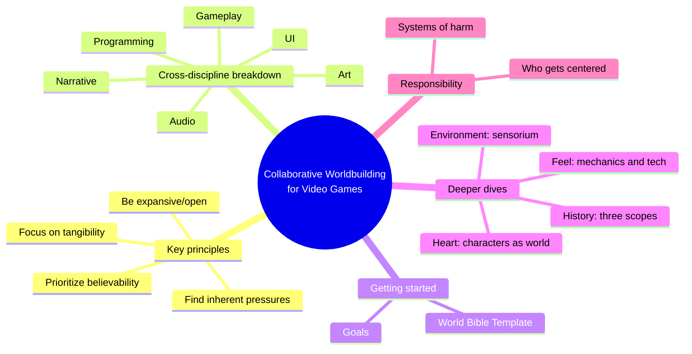
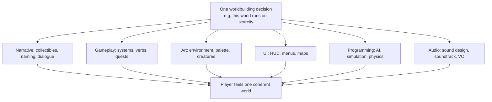
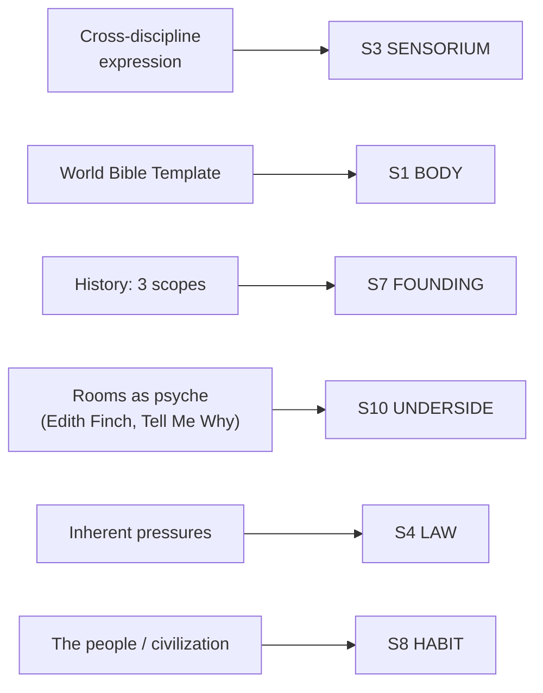

# BVX.1172 — Collaborative Worldbuilding for Video Games — Kaitlin Tremblay (2023)
### Knowledge Entry — Distill

A working narrative designer's field manual for video-game worldbuilding, built around one central claim: the world isn't a document narrative owns, it's a craft every job discipline practices at once — the first SETTING-shelf source keyed to that cross-discipline mechanism specifically.

## TABLE OF CONTENTS
- [Core Thesis](#1-core-thesis)
- [Mind Models](#2-mind-models)
- [Framework](#3-framework--structure)
- [Key Concepts](#4-key-concepts)
- [Heuristics](#5-heuristics--decision-rules)
- [Invariants](#6-invariants)
- [Pitfalls](#7-pitfalls--myths)
- [Application](#8-application)
- [Cross-References](#9-cross-references)
- [Provenance](#10-provenance--confidence)

---

## 1 · CORE THESIS

Worldbuilding for video games is not a narrative department's private document; it is a craft practiced by every job discipline at once. A world becomes real through believability over realism, expansiveness over completeness, tangibility over exposition, and inherent pressures that turn setting into a story engine driving character, conflict, and mechanics alike.

---

## 2 · MIND MODELS

*Required. Minimum two diagrams, maximum five.*

**Diagram 1 — the whole argument.**
Caption: *five moves, front to back — name the craft, show who builds it, give the starter tools, deepen with worked cases, then hold the whole thing accountable.*

**Diagram 2 — the central mechanism (one decision, re-expressed six times).**
Caption: *worldbuilding isn't finished when narrative decides it — it's re-authored by five more disciplines before a player ever feels it, and any one of them skipping the re-authoring is where a world goes incoherent.*

**Diagram 3 — mapped onto the Command's SETTING SLICE (S1–S12).**
Caption: *this book's real strength is S3 SENSORIUM and S10 UNDERSIDE — no other distilled SETTING source treats sensorium as cross-discipline rather than prose, or setting-as-repressed-psychology as a worked method rather than a metaphor.*

---

## 3 · FRAMEWORK / STRUCTURE

Six chapters, front-loaded theory then worked case studies, closing on an ethics chapter that governs everything before it:

| Chapter | Governing content |
|---|---|
| 1 · Overview of Worldbuilding | What worldbuilding is, why it matters, the four key principles, and immersion as an outcome, not a principle |
| 2 · A Cross-Discipline Breakdown | What narrative, gameplay, art, UI, programming, and audio each contribute to worldbuilding, discipline by discipline |
| 3 · How to Get Started Creating a World | Setting goals before writing anything, then the World Bible Template |
| 4 · Collaboration in Worldbuilding: A Series of Deeper Dives | Worked case studies on the heart, the feel, the conflict, the environment, and the history of a world |
| 5 · Identity, World Systems, and Responsibility | Systems of harm, who gets centered as protagonist, queering and decolonizing worldbuilding, climate-aware environments |
| 6 · Conclusion: It's in the Details | Worldbuilding is a skeleton assembled from details across every discipline, never just a document |

---

## 4 · KEY CONCEPTS

| Concept | What it is | Why it matters |
|---|---|---|
| **Conceptual vs. practical worldbuilding** | The world bible (pre-production) vs. the ongoing work of surfacing that world through implementation | Worldbuilding doesn't stop at the document; production decisions keep authoring it |
| **Believability over realism** | The world must be internally coherent, not factually accurate | Lets a world be as strange as it needs to be (Bugsnax) as long as its own rules hold |
| **Expansive/open worldbuilding** | Leave synecdoche and intentional gaps rather than closing every detail | Invites co-authoring — player theory-crafting (Final Fantasy VIII) and headcanon are a feature |
| **Tangibility, not a "show, don't tell" rule** | Ask which tool (art, audio, a mechanic, or plain text) makes a detail land, case by case | Kentucky Route Zero shows that flat telling can be just as tangible as showing |
| **Worldbuilding as story engine / inherent pressures** | A world's systems should exert pressure on characters, generating conflict as a byproduct of structure | The Outer Worlds' Edgewater dilemma is drama the setting manufactures, not plot bolted on |
| **World Bible** | A living, partial-use reference document, never filled out completely | Answers the questions the team is actually asking, not every possible question |
| **World Bible Template** | Name / overview / tone / physical geography / creatures / civilization / technology / magic / the people / infrastructure / religion / history / secrets | A concrete question-bank a writer can steal directly, pick-and-choose per project |
| **Characters are the world (psychological worldbuilding)** | Rooms, fashion, and objects externalize a character's relationship to the world | Edith Finch's bedrooms and Neo Cab's Feelgrid characterize as much as they locate |
| **Three scopes of history** | Personal (a character's private past), contained (a bounded catastrophe frozen at one site), capital-H (sociological/geopolitical deep past) | Different design tools for each; conflating them produces an undifferentiated lore dump |
| **History is never neutral** | Every choice of what a game's past includes or omits is an argument, declared or not | Applies as much to invented history as to real history retold (When Rivers Were Trails) |
| **Collectibles as synecdoche** | A small, specific object (a figurine, a log, a relic) stands in for a whole life or catastrophe | Specificity transmits more world than exhaustive documentation |
| **Naming conventions and neologisms** | Proper nouns and invented words compress worldbuilding into a label | Effective sparingly; stacked without restraint, the world needs a glossary to parse |

---

## 5 · HEURISTICS & DECISION RULES

| Situation | Do this | Not this |
|---|---|---|
| Deciding what detail is canon vs. decoration | Ask whether it exerts pressure on a character or a mechanic | Add it because it's cool or because "completeness" demands it |
| Choosing a realism level | Aim for internal consistency (believability) | Chase real-world accuracy for its own sake |
| Filling out a world bible | Answer only the questions your team is actually asking | Fill every field of the template in excruciating detail |
| Deciding show vs. tell | Ask what's crucial for coherence, then pick the cheapest tool that lands it | Default to "show, don't tell" as an absolute rule |
| Writing a setting's past | Sort it into personal / contained / capital-H before writing a word | Write one undifferentiated "lore" dump |
| Naming things in a world | Use neologisms and proper nouns sparingly, one or two per concept | Invent a new term for everything (Wadeson's parody: "Pilgrim-AGE") |
| Building the space a character lives in | Design the room/setting to argue for who they are, via synecdoche | Treat a character's space as generic backdrop |
| Choosing who a world centers as protagonist | Decide deliberately who the world's pressures make heroic, and why | Default unreflectively to the unexamined "hero" archetype |
| Drawing on real history or culture for flavor | Ask whether "historical accuracy" is being used as an alibi for bias | Treat historical realism as a neutral, unquestionable defense |

---

## 6 · INVARIANTS

1. **Worldbuilding is never finished at the document.** It continues through every stage of production as decisions get implemented and re-surfaced.
2. **No single discipline owns the world.** The same worldbuilding decision must be re-expressed by narrative, gameplay, art, UI, programming, and audio, or the world reads as incoherent.
3. **Believability, not realism, is the bar a setting has to clear.** Internal consistency is what lets a world be strange without losing the audience.
4. **A setting that exerts no pressure on its characters is inert.** The pressure is what converts setting into plot and mission design.
5. **History is a subjective account regardless of scope.** Deciding what a world's past includes is itself an act of worldbuilding, not a neutral record.
6. **Specificity (synecdoche) transmits more world than exhaustive documentation.** A well-chosen detail implies the rest and leaves room for the audience's imagination.
7. **Every worldbuilding choice about power, bodies, and culture replicates or subverts a real-world system.** There is no neutral default.

---

## 7 · PITFALLS / MYTHS

- Treating the world bible as the whole of worldbuilding, rather than the seed a production keeps re-authoring.
- Filling out every field of a template because it exists, producing an unusable, encyclopedic document nobody uses.
- Applying "show, don't tell" as an absolute rule instead of a case-by-case tool choice — sometimes plain telling is the more tangible move.
- Dumping undifferentiated "lore" instead of separating personal, contained, and capital-H history before writing.
- Stacking neologisms and proper nouns until the world needs a glossary to parse (the "Pilgrim-AGE" trap).
- Treating "historical realism" as an excuse for excluding or stereotyping marginalized identities — history-as-written is already a biased, incomplete record.
- Building conflict as generic violence when the more resonant conflict is the pressure a system already exerts on its people (Outer Worlds' Edgewater).

---

## 8 · APPLICATION

- **Spine level:** SETTING (non-story-spine source; keys to the entity beside L0–L7, per the binding rule that setting is a Domain embodied, never a level)
- **12-layer character stack:** contextual only — "Who Are the Heroes?" argues protagonist selection is a function of world systems, adjacent to character-choice work but stated from the setting side, not a character-layer method in its own right
- **plot_systems:** contextual candidate once `04_PLOT_SYSTEMS/` opens — "inherent pressures" (worldbuilding as story engine) is a ready-made mission/scene-hook generator, and the SCENE CARD's `active strata` field can borrow this book's six-discipline checklist (narrative / gameplay / art / UI / programming / audio) to force a scene through every discipline that should be re-authoring it
- **Setting:** primary — feeds S3 SENSORIUM and S7 FOUNDING and S10 UNDERSIDE at primary strength, S1/S4/S5/S8/S11 at supporting, S2 and S6 only contextually; thin or silent on S9 ALLURE and S12 FUNCTION

Tested against the DCUS starter instance (`ssot_03_setting_system.md`): the Feed's clothing glow and the Star-Rating HUD are exactly the "one decision, re-expressed across disciplines" move Diagram 2 names — a surveillance rule stated once in S4 LAW has to be re-authored through UI (the rating display), art (the Feed-linked glow), and mechanics (legibility enforcement) or it reads as inert lore rather than a lived system. The rename lattice (Skeeter Creek → Red Hills → DCUS, S5 SCAR) is closer to this book's "capital-H history is never neutral" claim than to Grubb's precursor-civilization frame in BVX.0458 — DCUS's history is a record written by whoever did the renaming, which is the same move Tremblay makes with Caves of Qud and When Rivers Were Trails. And the campus itself, read as one contiguous "room," is the institutional-scale version of Edith Finch's bedrooms: the S10 UNDERSIDE record (what the rebrand overwrote) is architecture arguing for what the institution is hiding, exactly the psychological-worldbuilding move this book works out at the scale of a single character's room.

---

## 9 · CROSS-REFERENCES

| Related entry | Relation |
|---|---|
| [[BVX.0458]] | Kobold Guide to Worldbuilding — SETTING-shelf sibling and TTRPG-side twin; Tremblay supplies the cross-discipline mechanism (Diagram 2) that Kobold's essay-per-layer structure doesn't have, Kobold supplies the terrain-order and present-tense-history depth Tremblay's chapters don't reach |
| [[BVX.0067]] | Hergenrader, *Collaborative Worldbuilding for Writers and Gamers* — undistilled sibling with a near-identical title (see Provenance: the two were confused at the text-extraction step for this entry) — different author, different book, different discipline (TTRPG/fiction workshop vs. video-game production) |
| [[BVX.1122]] | GURPS Hot Spots: Renaissance Venice — worked SETTING-SLICE instance; Tremblay's World Bible Template is the generator this GURPS sourcebook is one filled-out example of |
| [[BVX.0349]] | *Against Worldbuilding, and Other Provocations* — counter-argument sibling; Tremblay's own "expansive/open, don't over-document" principle is this book's internal check against the kitchen-sink failure *Against Worldbuilding* argues against wholesale |

---

## 10 · PROVENANCE & CONFIDENCE

**Text-source correction, flagged for the record:** the text file initially staged at this task's scratchpad path (`BVX.1172.txt`) was the wrong book — it was Trent Hergenrader's *Collaborative Worldbuilding for Writers and Gamers* (2018/2019, Bloomsbury), a different, similarly-titled book by a different author, confirmed by its running footer ("Hergenrader, Trent... Bloomsbury Publishing") on every page and no occurrence of "Tremblay" or "video game" anywhere in the file. The correct source (Tremblay, *Collaborative Worldbuilding for Video Games*, CRC Press 2023, Zotero key `ZSYMRBWU`, `has_pdf: true` in `inventory-live.json`) was already attached in Zotero at `C:\Users\U01_LEECHSEED\Zotero\storage\YBXXHJEL\`; this distill re-extracted it directly with `pdftotext -layout` rather than distilling the mismatched file. This entry is built entirely from that re-extraction, not from the originally staged text.

Full text, 215pp, clean text layer, machine-readable TOC. Read in full: the Introduction; Chapter 1 (Overview of Worldbuilding — What Is Worldbuilding?, Why Is Worldbuilding Important?, all four Key Principles, What Is Immersion?); Chapter 3 in full (Goals, World Bible, the full World Bible Template table, Reminders); Chapter 4's five deep-dive sections in full (Building the Heart of a World, Determining the Feel of a World, Creating Compelling Conflict in a World, Expressing the Environment of a World, Documenting a World's History); the opening of Chapter 5 (Worldbuilding and the Real World: Being Aware of Systems of Harm, Who Are the Heroes?); the Conclusion. Sampled (subsection openings and worked examples, not deep-extracted line by line): Chapter 2's discipline sections (Narrative, Gameplay, Art, UI, Programming, Audio — read for their opening frames and 2–3 worked examples each, not every case study); the back half of Chapter 5 (Re-Imagining Worlds: Queering Worldbuilding; Creating Environments in the Wake of Climate Change).

The S-layer keying in frontmatter `feeds:` and Diagram 3 is this distill's synthesis against `ssot_03_setting_system.md` (PART A, the twelve-layer SETTING SLICE), following the same binding rule BVX.0458 used: setting is a Domain embodied, never a story-spine rung, so `spine: [SETTING]` and an empty-to-contextual character-stack Application are asserted per the v4 template rather than inferred from this book (a video-game production manual, not a story-structure text).

## META
- Template: BVX-LEARN-v4.0
- Source classification: full-text PDF re-extraction (pdftotext -layout, correcting a mismatched staged text file), deep extraction on 5 of 6 chapters, sampled on 1
- Created / Updated: 2026-09-29
