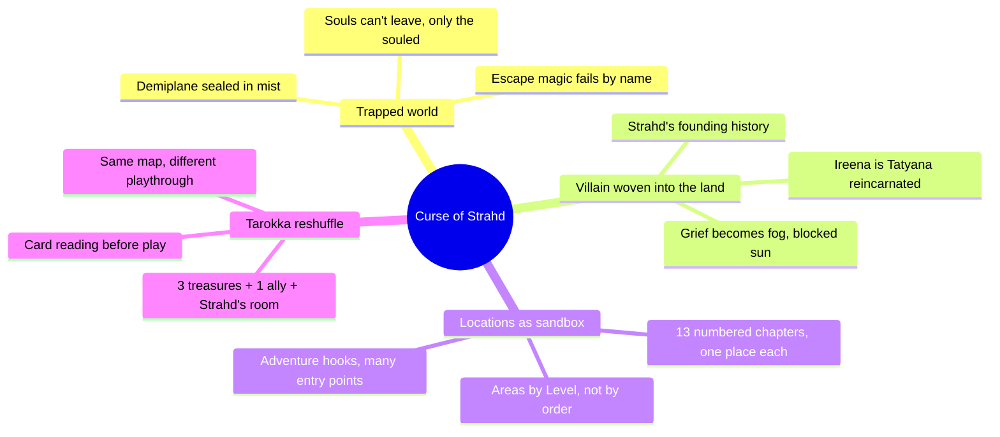
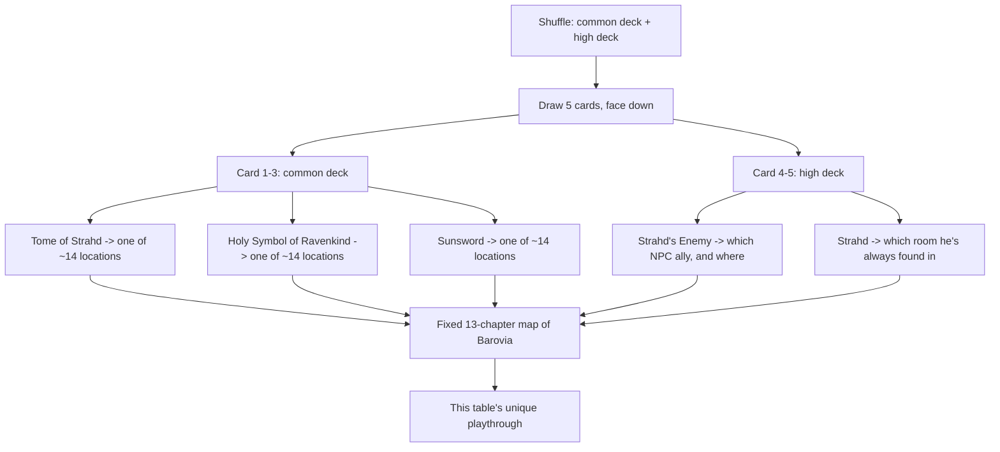
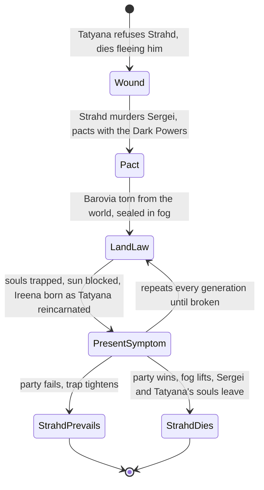
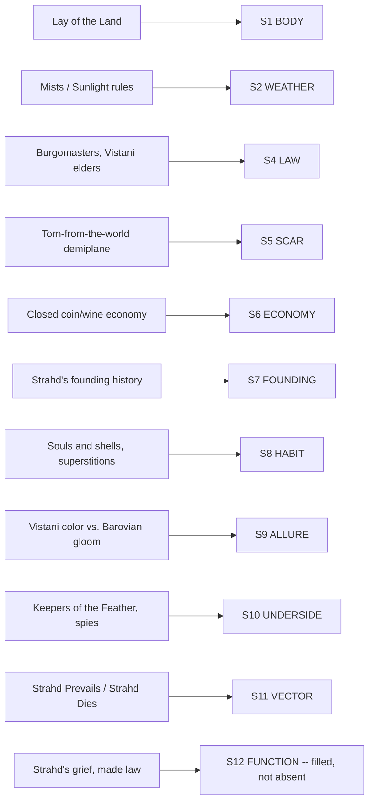

# BVX.1173 — Curse of Strahd — Christopher Perkins, Jeremy Crawford, Mike Mearls (2016)
### Knowledge Entry — Distill

A worked closed-region setting, not a craft book: read here for the engineering of a single dread-soaked demiplane -- Barovia -- built so the villain's grief is the land's law, the thirteen numbered chapters are a sandbox rather than a script, and a tarot-style card draw reshuffles what the fixed sandbox holds on every playthrough.

## TABLE OF CONTENTS
- [Core Thesis](#1-core-thesis)
- [Mind Models](#2-mind-models)
- [Framework](#3-framework--structure)
- [Key Concepts](#4-key-concepts)
- [Heuristics](#5-heuristics--decision-rules)
- [Invariants](#6-invariants)
- [Pitfalls](#7-pitfalls--myths)
- [Application](#8-application)
- [Cross-References](#9-cross-references)
- [Provenance](#10-provenance--confidence)

---

## 1 · CORE THESIS

Curse of Strahd makes the villain's grief the land's physics: Strahd's centuries-old loss seals Barovia in fog, blocks the sun, and traps every soul, so escape is a rules problem before it's a plot problem. A tarokka reading reshuffles three treasures, one ally, and Strahd's location onto a fixed thirteen-chapter sandbox, replaying the map without redrawing it.

---

## 2 · MIND MODELS

*Required. Minimum two diagrams, maximum five.*

**Diagram 1 — the whole argument.**
Caption: *four techniques compound into one closed region -- trap the world in law, weave the villain into that law, chapter the sandbox by place instead of plot, and reshuffle the fixed sandbox with a card draw.*

**Diagram 2 — the central mechanism (a process: the tarokka reshuffle).**
Caption: *five cards seed variance into a map that never moves -- the sandbox is fixed, only what's placed in it changes.*

**Diagram 3 — the villain-woven-into-land loop (a state change: wound becomes law becomes symptom).**
Caption: *the villain isn't placed on the map, he IS the map's rule set -- and the book scripts both ways the loop can end.*

**Diagram 4 — mapped onto the Command's SETTING SLICE (S1-S12).**
Caption: *ten of twelve layers fill, and S12 FUNCTION is the standout: unlike Venice's structurally empty S12 (BVX.1122), here the storyform is filled directly from the villain's own wound.*

---

## 3 · FRAMEWORK / STRUCTURE

The book's skeleton, front to back:

| Part | Governing question | What it hands the rest |
|---|---|---|
| **Foreword / Introduction** | What kind of story is this, and how do I run it? | Tone contract (gothic horror, not slasher horror) and the milestone-leveling guidance |
| **Ch.1 Into the Mists** | Who is Strahd, and where does tonight's playthrough put the pieces? | The villain's history, the tarokka card reading, adventure hooks into the trap |
| **Ch.2 The Lands of Barovia** | What are the setting-wide rules everyone in the sandbox obeys? | Geography, mist/escape rules, Barovians, Vistani, random encounters, common feature defaults, the Areas map |
| **Ch.3-15, one per place** | What is true at this specific location? | A self-contained area, approach text, numbered rooms keyed to a map, special events -- swappable order |
| **Epilogue** | How does the story end, and who narrates the ending? | Two scripted branches, Strahd Prevails and Strahd Dies, not a single fixed finale |
| **Appendices A-F** | What do I need on hand to run any of the above? | Character options, a standalone starter dungeon, treasures, monster/NPC stat blocks, the tarokka deck reference, printable handouts |

One structural device crosses every chapter boundary: the **Areas by Level** table (chapter 1) assigns each of the thirteen place-chapters a recommended average character level, so the GM can steer without collapsing the sandbox into a fixed order -- level-gating a map instead of scripting a route.

---

## 4 · KEY CONCEPTS

| Concept | What it is | Why it matters |
|---|---|---|
| **The mist boundary** | A deadly fog that surrounds Barovia; anyone who tries to leave is turned around and eventually returns to Barovia, taking exhaustion each turn they resist | Escape is defined as a mechanic (a saving throw and a turn-around rule), not a narrated impossibility -- players can test the wall and find it real |
| **Escape magic named and closed** | *Wish*, *teleport*, *plane shift*, *astral projection* and similar spells explicitly fail for the purpose of leaving; the book lists the exceptions (Border Ethereal) rather than leaving it to GM ruling | Closes the specific loopholes a system-literate table will try first, instead of a blanket "magic doesn't work here" |
| **Souls and shells** | Only about one Barovian in ten has a soul; soulless "shells" are physically identical but flatter, more compliant, and cease to exist if they ever leave the valley | A two-tier population lets the GM signal who matters without individually authoring thousands of NPCs; it also makes Strahd's cruelty legible (he can tell at a glance who's worth feeding on) |
| **Present-tense villain history** | Strahd's full origin (conqueror, jealous brother, murderer, pact-maker) is printed in chapter 1, not doled out as discoverable lore, and it resolves in a present-day NPC: Ireena Kolyana carries Tatyana's reincarnated soul | The founding trauma isn't backstory color, it is the plot's present tense -- the same present-tense-history rule named in BVX.0458, run at full intensity |
| **The tarokka reshuffle** | A five-card draw (three from a common deck, two from a high deck) before play fixes where three key treasures are hidden, who a helpful ally is, and which room Strahd is always found in | A combinatorial variance engine: the map, the thirteen chapters, and the NPCs never change, only what's seeded at which fixed point does -- see Diagram 2 |
| **Areas by Level** | A one-page table assigning each place-chapter a recommended party level (village of Barovia at 1st-3rd, Castle Ravenloft at 8th-9th, etc.) | Lets a sandbox stay non-linear while still protecting new characters from wandering into a fight built for level 9 |
| **Common Features sidebar** | One shared table of default door/lock/secret-door/web difficulty classes, referenced by every location chapter instead of restated per chapter | The same connective-tissue trick Venice uses for class (BVX.1122): write a mechanic once, cite it everywhere |
| **Adventure hooks, plural** | Chapter 1 prints multiple distinct ways into Barovia (a Vistani messenger's plea, a Daggerford-based faction hook, a campfire tale, a creeping-fog ambush) rather than one canonical opening | A trapped-world setting still needs several front doors, because the campaign feeding into it will vary table to table |
| **Marks of Horror + counterweight** | Explicit GM tips for sustaining dread (personification of horror, escalating tension) paired with an explicit instruction to script occasional beauty and kind NPCs | Names the failure mode (unbroken bleakness reads as flat, not scary) and prescribes the fix in the same breath |
| **The branching epilogue** | The book scripts two distinct endings in full -- Strahd Prevails (he seals the party away, the trap tightens) and Strahd Dies (Sergei's ghost claims Tatyana's soul, the fog lifts) -- rather than one canonical finish | A sandbox's resolution is itself content to be authored, not left as "the GM improvises the ending" |

---

## 5 · HEURISTICS & DECISION RULES

| Situation | Do this | Not this |
|---|---|---|
| Building a villain for a closed setting | Root one specific historical wound, then write its aftershocks directly into the land's physical laws (a boundary, a missing sun, a trapped population) | Keep the villain's backstory as flavor text separate from how the setting actually behaves |
| Making a trap feel real to a system-literate table | Name the specific spells and effects that fail, and why, so players can test the wall | Say "magic doesn't work here" and hope no one asks *which* magic |
| Giving a founding trauma weight | Embody it in a present-day NPC whose situation is caused by it (Ireena as reincarnated Tatyana) | Leave it as a paragraph of pre-session lore nobody in-fiction reacts to |
| Structuring a large region for actual play | Chapter it by place, each self-contained with its own map and numbered areas, cross-referenced rather than sequenced | Write it as a single linear plot with locations as scene backdrops |
| Wanting a sandbox to feel different every time it's run | Randomize what's placed at a handful of fixed points (treasure, ally, villain's location) via a quick pre-session draw | Redraw the map, rewrite the NPCs, or leave the whole thing static across every table |
| Protecting new characters in an open, non-linear map | Publish a level-recommendation table per location, and let players choose anyway | Gate locations behind hard walls that break the "go anywhere" premise |
| Writing an oppressed population without authoring every NPC | Split the population into two mechanically distinct tiers (here: souled/soulless) so mercy and stakes read at a glance | Characterize every commoner individually, or flatten them all into interchangeable set dressing |
| Sustaining dread across a long campaign | Script explicit relief beats (a flower on a grave, one warm NPC) as deliberately as the horror beats | Let unbroken bleakness run the whole length of play until it goes numb |
| Ending a sandbox campaign | Write out multiple full endings tied to the players' actual outcome, not just "the villain dies, roll credits" | Leave the finale to be improvised cold at the table |

---

## 6 · INVARIANTS

1. **The land's rules are the villain's psychology, not a separate layer laid over him.** The fog boundary, the blocked sun, and the trapped souls are all direct expressions of Strahd's grief and refusal to accept Tatyana's death -- there is no daylight between "the setting" and "the villain" here.
2. **Escape is defined mechanically, spell by spell, not narrated away.** A trap that can't be tested by a rules-literate party isn't a trap, it's a cutscene.
3. **A founding trauma that matters is embodied in someone alive now.** History that stays in the past tense is scenery; history that reappears as an NPC's present situation is structure.
4. **The sandbox's location-chapters are fixed; only what's seeded into them varies.** Replay variance comes from reshuffling contents onto a stable map, not from redesigning the map per playthrough.
5. **Every location chapter repeats the same shape** (approach text, numbered areas on a map, special events), so a GM -- or a writer porting the technique -- can drop into any chapter without relearning format.
6. **A closed, oppressed population needs a legible two-tier split** to keep individual stakes readable without individually authoring every resident.
7. **Sustained dread requires scripted relief, not just scripted horror.** The tone fails without both halves present.

---

## 7 · PITFALLS / MYTHS

- Treating the villain as a boss fight bolted onto a setting, rather than as the reason the setting's laws exist at all -- the book's whole structure argues against this split.
- Leaving "why can't the characters just teleport out" as an unresolved GM ruling instead of naming the failing spells explicitly; players will ask, and an unanswered trap stops feeling like a trap.
- Confusing a sandbox with a linear plot because both happen to be printed front-to-back in a book -- the chapters are cross-referenced areas on a map, not a script order, and the Areas by Level table exists specifically to keep that distinction visible.
- Assuming variance across playthroughs requires rewriting content; the tarokka reshuffle proves a fixed sandbox can feel different every table with nothing more than a five-card draw.
- Letting unbroken horror-pacing numb the table -- the book's own "Marks of Horror" section names this failure mode and prescribes scripted beauty and kindness as the fix, not tonal drift.
- Writing a single canonical ending for an open-ended sandbox campaign, which discards the agency the open structure spent the whole book building.

---

## 8 · APPLICATION

- **Spine level:** SETTING (non-story-structural; a worked closed-region source, not a story-spine source)
- **12-layer character stack:** none directly fed -- this is a setting-side source -- but its S7 FOUNDING / S12 FUNCTION move (the villain's L5 WOUND and L7 ORIGIN written directly into setting law) is a mirror-scale technique worth stealing for any Command villain whose psychology should be legible in the world, not just in scene
- **plot_systems:** the tarokka reshuffle is a directly reusable procedural-generation pattern: fix the sandbox once, then randomize only a short list of what's-placed-where facts (here: 3 rewards, 1 ally, 1 villain-location) to manufacture genuine replay variance without redesigning geography -- a strong candidate technique for BOLO 87's science-fiction setting system wherever a region needs to feel different on separate visits without being rebuilt
- **Setting:** primary -- a third worked-setting reference instance alongside BVX.0458 (the toolkit) and BVX.1122 (Venice, the historical-city instance); this entry is the horror/trap-region instance, and its S12 FUNCTION is filled directly from the source, unlike Venice's structurally empty S12 -- proof that a TTRPG sourcebook *can* supply a storyform when the villain and the setting are designed as one thing from the start

The book earns its place on the SETTING shelf less for the geography (thin next to Venice's chapter-length physical-fabric pass) and more for two moves BOLO 87 should copy directly: writing a villain's wound as the land's enforced law rather than as separate lore, and generating replay variance by reshuffling contents onto a fixed sandbox rather than redrawing the map per session. Both are load-bearing techniques for a closed, dread-soaked region built to be visited more than once.

---

## 9 · CROSS-REFERENCES

| Related entry | Relation |
|---|---|
| [[BVX.0458]] | Kobold Guide to Worldbuilding -- the toolkit this book instances; its present-tense-history rule and post-apocalyptic-default claim are both confirmed at maximum intensity here |
| [[BVX.1122]] | GURPS Hot Spots: Renaissance Venice -- sibling worked-setting instance on the same shelf; contrast case for S12 FUNCTION (empty there, filled here) and for S4 LAW (a dedicated Apparatus of Power chapter there, fear-based governance here) |
| [[BVX.0349]] | *Against Worldbuilding, and Other Provocations* -- counter-argument sibling; this book's thin, ration-everything approach to Barovia's 400-year history (only what touches Ireena, the castle, and the treasures gets dramatized) is a worked example of Kennedy's pressure-not-inventory claim |

---

## 10 · PROVENANCE & CONFIDENCE

Full text, extracted from the published PDF (OCR-quality text with recurring header/footer noise and scattered recognition errors, e.g. "Ravenloft" as "Raven/oft"; content legible throughout). Read in full: front matter, Foreword, Introduction (Running the Adventure, Areas by Level, Marks of Horror); Chapter 1 complete (Strahd's history and goals, the full tarokka reading and treasure tables, all adventure hooks); Chapter 2 complete through Random Encounters (Lay of the Land, Mists, Sunlight, Alterations to Magic, Barovians, Souls and Shells, Vistani, Vistani Curses); Areas of Barovia entries A-H read in full for area-chapter format. Sampled via targeted search rather than full extraction: Chapters 3-15 (confirmed the same chapter shape via TOC and spot-checked areas), Epilogue (both endings read in full), Appendices A-F (confirmed via TOC).

The S-layer keying in `feeds:` and Diagram 4 is this distill's synthesis against `ShroomsQ/_CANON/_SSOT/03_SETTING_SYSTEMS/📐 ssot_03_setting_system.md`, matching BVX.0458 and BVX.1122's table form. `zotero_key` is blank pending the next inventory pass; `bvx_provisional: true` since this id isn't yet reconciled against the library.

## META
- Template: BVX-LEARN-v4.0
- Source classification: full-text campaign sourcebook, deep extraction on chapters 1-2 and area-format sample, table-of-contents-and-spot-check on chapters 3-15 and appendices
- Created / Updated: 2026-09-29
