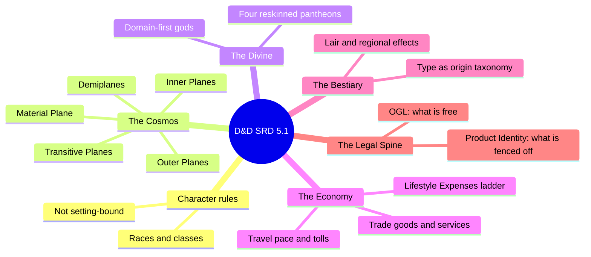
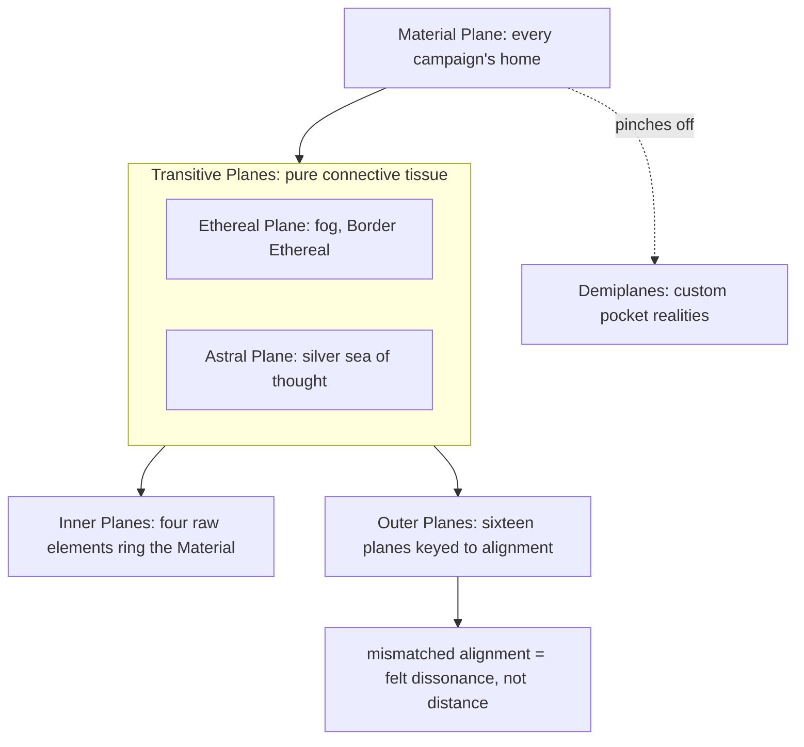
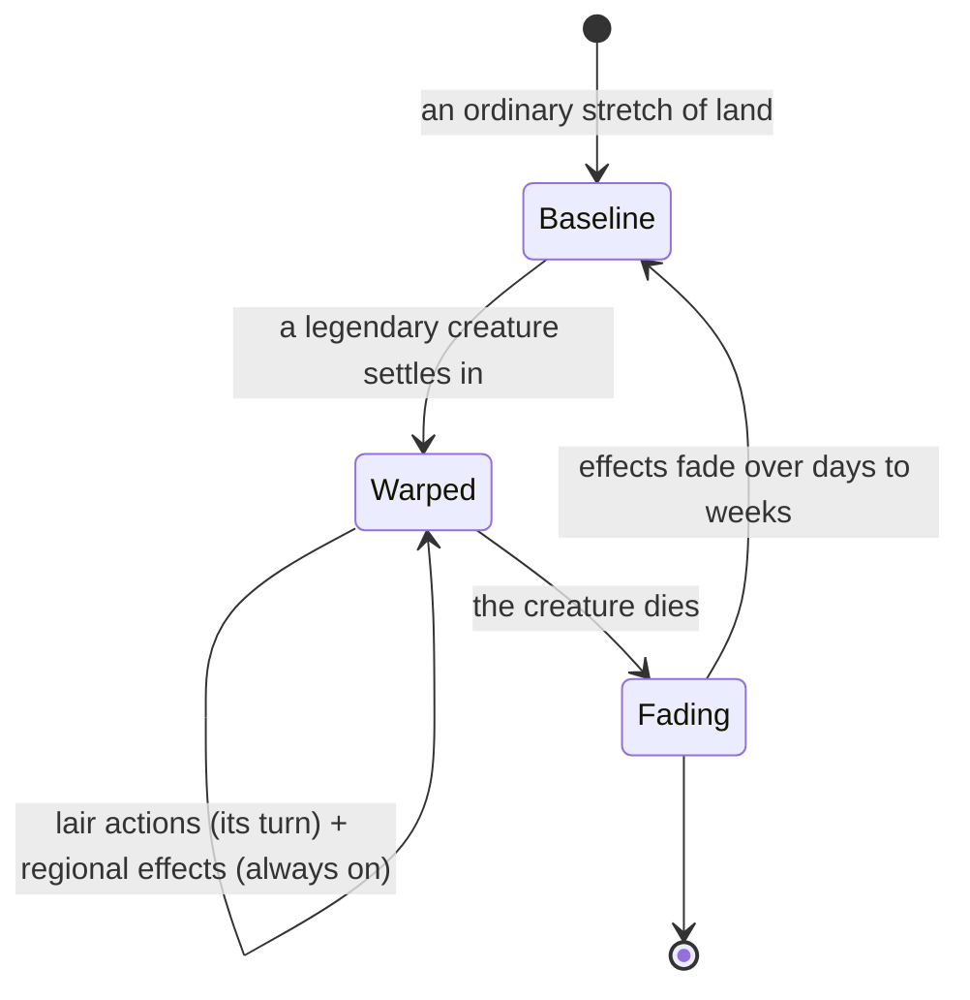
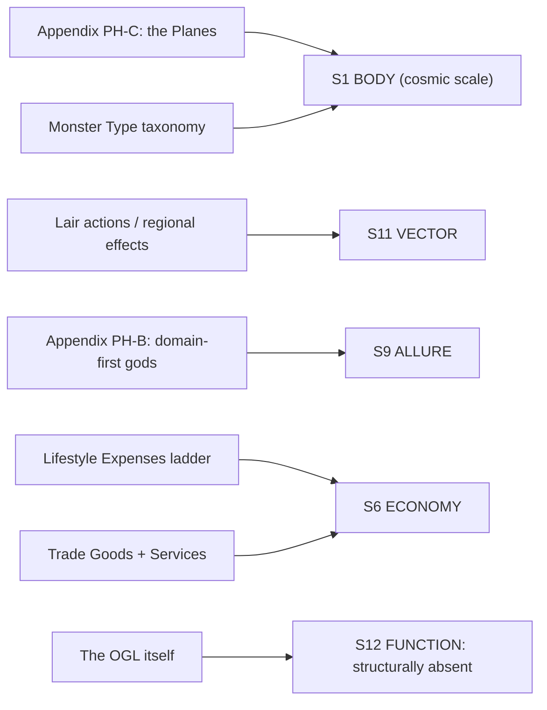

# BVX.1174 — Dungeons & Dragons System Reference Document 5.1 — Wizards of the Coast (2016)
### Knowledge Entry — Distill

Not a worldbuilding book but the open rules chassis every D&D-adjacent worldbuilding book (including BVX.0458 and BVX.0405) already assumes; read here for the setting-neutral machinery it fixes for free, and the proper nouns it deliberately leaves for a table, or a writer, to fill in.

## TABLE OF CONTENTS
- [Core Thesis](#1-core-thesis)
- [Mind Models](#2-mind-models)
- [Framework](#3-framework--structure)
- [Key Concepts](#4-key-concepts)
- [Heuristics](#5-heuristics--decision-rules)
- [Invariants](#6-invariants)
- [Pitfalls](#7-pitfalls--myths)
- [Application](#8-application)
- [Cross-References](#9-cross-references)
- [Provenance](#10-provenance--confidence)

---

## 1 · CORE THESIS

The SRD is a rules skeleton, not a world. It fixes four things that any world needs by default: a planar cosmology, a domain-first divine system, a for-free economy, and a monster taxonomy keyed to origin and ecology. Everything else, every proper noun, is a slot the SRD deliberately leaves blank for the table to fill.

---

## 2 · MIND MODELS

*Required. Minimum two diagrams, maximum five.*

**Diagram 1 — the whole document.**
Caption: *five setting-relevant systems sit inside a much larger rules book; each is built thin and swappable on purpose, and the legal spine at the root is what makes stealing the other four safe.*

**Diagram 2 — the central mechanism (the planar structure).**
Caption: *distance stops meaning anything past the Material Plane; what replaces it is alignment-fit, a wholly reusable trick for any far-future or metaphysical setting layer.*

**Diagram 3 — a legendary creature's lair as living ecology.**
Caption: *a monster is not decoration dropped on a map; while it lives it actively re-authors the weather, creatures, and terrain around it, and the land visibly heals once it's gone.*

**Diagram 4 — mapped onto the Command's SETTING SLICE.**
Caption: *the SRD fills S1 and S6 richly, touches S9 and S11 only as reusable mechanism, and S12 stays structurally empty here exactly as it does in every other TTRPG source on this shelf.*

---

## 3 · FRAMEWORK / STRUCTURE

The SRD has no worldbuilding argument to make; it is organized by rules category, not by craft lesson. Read against the setting brief, the relevant parts and what each hands a setting builder for free:

| Part of the SRD | Governing question | What it hands a setting for free |
|---|---|---|
| Player options (races, classes, backgrounds) | What can a person become? | Reskinnable species/vocation slots, none setting-specific |
| Spells and magic items | What can be done to reality? | A menu of world-altering verbs (teleport, raise the dead, scry) whose mere existence sets a setting's ceiling |
| Appendix PH-B, Fantasy-Historical Pantheons | Where do gods come from, and what do they grant? | A deity template (alignment, domain, symbol) built to be reskinned, plus four worked examples of doing exactly that |
| Appendix PH-C, The Planes of Existence | What lies beyond the world the party stands on? | A four-ring cosmology that scales to "cosmos" for free |
| Equipment, Services, Lifestyle Expenses | What does it cost to live and move? | A complete for-free economy: barter goods, hireling pay, lodging tiers, travel tolls |
| Monsters (stat blocks and Appendix MM-A) | What lives here, and why? | A type taxonomy keying every creature to a plane of origin or niche, plus a living-ecology mechanic for the apex ones |
| The Open Gaming License | What may a third party build and publish? | The legal skeleton itself: mechanics are free, named Product Identity is fenced off |

One thread crosses all of it: everything in the table is written to be *content-agnostic*. The Lifestyle Expenses table never says which kingdom you're in. The planar cosmology never says which god rules the Nine Hells of this particular setting (it names the SRD's own example, then hands you the ring structure to refill). This is a different discipline than a worldbuilding essay collection: it isn't arguing for a method, it's supplying a chassis and staying deliberately silent about what gets bolted to it.

---

## 4 · KEY CONCEPTS

| Concept | What it is | Why it matters |
|---|---|---|
| The four-ring cosmology | Material Plane (baseline) → Transitive Planes (Ethereal/Astral, pure connective tissue) → Inner Planes (four elements) → Outer Planes (sixteen, alignment-keyed) → Demiplanes (custom pockets pinched off anywhere) | A ready-made "layers of reality" scaffold; swap alignment for any other sorting axis (ideology, tech-tier, faction loyalty) and the structure still works unchanged |
| Alignment-as-distance | On the Outer Planes, literal distance stops mattering; what matters is whether a visitor's nature matches the plane's | A reusable device for any setting where "how far" should really mean "how compatible" — FTL or dimensional travel gated by fit, not miles |
| Domain-first gods | A deity's entire rules footprint is alignment plus a short list of cleric Domains plus a symbol; lore is optional flavor bolted onto a mechanical core | Gods get authored backward, from what power they grant, not forward from myth; fast, reskinnable, and stated outright as "divorced from historical context... united to serve the needs of the game" |
| The Lifestyle Expenses ladder | Eight tiers, Wretched to Aristocratic, each a price-per-day plus one paragraph of what that money buys and what it costs you socially | A complete class system built from consequences (who threatens you, who invites you to dinner), not from titles |
| Self-Sufficiency | An explicit alternate economy: skip coin entirely and live at a "comfortable" tier through the Survival skill | Names the frontier-versus-civilization economic fork directly, so a setting can offer both without inventing the exception later |
| Type as origin, not flavor | Every monster's Type (Aberration, Celestial, Construct, Dragon, Elemental, Fey, Fiend, and the rest) is defined by where it comes from or what plane it's tied to, and this has mechanical teeth (an arrow of dragon slaying affects the whole Dragon type) | Ecology is coded into the rules layer, not left as prose; a creature's niche is a fact a writer can query and reuse, not just describe |
| Lair Actions and Regional Effects | A legendary creature gets a free action every round (initiative count 20) drawn from "ambient magic in its lair," and its mere presence can warp weather, plants, and lesser creatures for a wide radius, fading out over time once it dies | Turns a monster from a stat block into a standing ecological force; the condition of the land literally reports the monster's health |
| Product Identity vs. Open Game Content | The OGL fences off names (Forgotten Realms, beholder, mind flayer, Sigil, and so on) while leaving mechanics, structures, and generic terms open | Tells a writer exactly what's free: steal the load-bearing machinery, invent your own names on top of it |

---

## 5 · HEURISTICS & DECISION RULES

| Situation | Do this | Not this |
|---|---|---|
| Building a setting's cosmology | Sort the "beyond" by a compatibility axis (alignment, ideology, tech-tier) so distance stops being purely geographic | Just add more geography farther out and call it cosmic |
| Introducing a god, faction, or order that grants power | Define it by what it hands out first, backstory second | Write a myth first and hope a mechanic falls out of it |
| Pricing daily life | Tie each wealth tier to what it buys and what danger or scrutiny it invites | Give wealth tiers a number with no social consequence attached |
| Explaining how off-grid characters survive | Name the self-sufficiency fork explicitly: skill-based subsistence versus a cash economy | Silently hand-wave how "wild" characters afford anything |
| Placing an ecologically important creature | Give it a footprint that changes the land while it lives and visibly recedes after it dies | Drop a stat block on a map with no trace before or after it |
| Sorting a bestiary or catalog of beings | Key each entry's type to an origin, a plane, or an ecological role, not just a combat category | Group entities purely by threat level or silhouette |
| Deciding what to publish or share from a homebrew system | Separate reusable mechanism from named, ownable content, the way the OGL separates Open Game Content from Product Identity | Treat "the rules" and "the setting's proper nouns" as one inseparable bundle |

---

## 6 · INVARIANTS

1. A setting-neutral rules document must fix mechanism and leave every proper noun open, or it stops being setting-neutral.
2. Beyond a baseline "home" region, distance is replaced by compatibility as the sorting principle, not abandoned outright.
3. A granted-power entity is defined first by what power it hands out, and only second by any story told about it.
4. An economy needs both a price and a social consequence per tier, or the tiers are just numbers.
5. A creature that matters ecologically leaves a measurable trace on its surroundings while alive, and a measurable absence once it's gone.
6. Taxonomy with mechanical teeth survives at the table; taxonomy that is flavor-only gets ignored.
7. What is free to build on and what is fenced off must be stated explicitly, never left to be inferred.

---

## 7 · PITFALLS / MYTHS

- Reading the SRD as a setting bible. It is deliberately not one; it's the chassis Forgotten Realms, Eberron, and every home campaign are built on top of.
- Treating the four included pantheons as required lore rather than as a worked demonstration of building a reskinnable pantheon, repeatable with any culture's names swapped in.
- Assuming the Outer Planes only matter for gods and the afterlife. The reusable idea is sorting a "beyond" space by compatibility instead of distance.
- Mistaking a monster's stat block for its ecology. The type taxonomy and the lair/regional-effects mechanic are where the ecology actually lives.
- Confusing Open Game Content with the whole book. Named places, creatures, and deities (Product Identity) are explicitly not free to reuse verbatim.
- Skipping the Self-Sufficiency note and assuming every character economy runs on coin; the SRD names the off-grid alternative directly, it just doesn't headline it.

---

## 8 · APPLICATION

- **Spine level:** SETTING (non-story-structural; a rules-reference source, not a story-spine source)
- **12-layer character stack:** none directly; touches L9 EROS's mirror only through the domain-first god mechanic (S9 ALLURE)
- **plot_systems:** contextual candidate once `04_PLOT_SYSTEMS/` opens — the lair/regional-effects fade-over-time mechanic is a ready-made "the land remembers what lived here" scene generator
- **Setting:** primary — feeds S1 BODY (planar cosmology at cosmic scale, plus monster-type-as-origin taxonomy at the bestiary grain), S6 ECONOMY (Lifestyle Expenses, Trade Goods, Services, and Self-Sufficiency as a complete for-free economic skeleton), S9 ALLURE (supporting, domain-first gods), and S11 VECTOR (supporting, regional effects as a place's health tied to what lives there)

Set beside BVX.0405 (the DMG, already distilled), the division of labor is clean: the DMG teaches a GM *how* to build a nation, a city, a faction; the SRD is the substrate that makes any of that advice legible as a coherent world in the first place, what plane something is on, what a night's lodging costs, what a god's domain actually grants, what a "dragon" structurally is versus what a "fiend" is. For a science-fiction setting system, the SRD's real gift isn't the fantasy dressing, the Forgotten Realms proper nouns are fenced off by the OGL anyway, it's the underlying moves. Sort a "beyond" region by compatibility rather than distance, and reuse it for FTL travel or dimensional layers gated by a ship's or a faction's nature rather than by miles. Build granted powers backward from what they grant, and reuse it for any faction, implant, or technology that hands out abilities. Give ecologically or politically load-bearing entities a living footprint that reports their health to an observer, and reuse it for keystone species, an AI, or a megastructure whose decline should be visible in the land around it before anyone announces it in dialogue.

---

## 9 · CROSS-REFERENCES

| Related entry | Relation |
|---|---|
| [[BVX.0405]] | Dungeon Master's Guide (5e) — the advice layer built on top of this rules layer; the DMG teaches how to build a nation or city, the SRD supplies the planar, economic, and ecological substrate that advice assumes exists |
| [[BVX.0458]] | Kobold Guide to Worldbuilding — the craft-essay sibling; where Kobold argues for terrain-first mapmaking and present-tense history, the SRD is the mechanical floor those essays were written to sit on |
| [[BVX.1122]] | GURPS Hot Spots: Renaissance Venice — a worked instance built on a different rules-neutral core (GURPS); a useful contrast for how much of "setting" any rules-neutral system can and can't supply on its own |

---

## 10 · PROVENANCE & CONFIDENCE

Full text, pdftotext extraction of the official SRD 5.1 PDF, 403 pages, clean text layer with page-number footers throughout. Not read end to end (over 23,900 lines): read the Open Gaming License header and the opening Races/character-creation material for orientation, then grepped and ranged-read the setting-relevant sections against the brief: Trade Goods, Lifestyle Expenses, and Services (pp.71-74); Time, Movement, and Travel Pace (pp.83-84); Appendix PH-B, Fantasy-Historical Pantheons (pp.359-362); Appendix PH-C, The Planes of Existence (pp.362-365); the Legendary Creatures, Lair Actions, and Regional Effects rules immediately preceding the alphabetical Monsters section (pp.259-260); the Type section defining the monster taxonomy; and the opening of Appendix MM-A, Miscellaneous Creatures (pp.365-366), as a sample of how flavor text carries ecology into individual stat blocks. Spells, class features, and the roughly 200 pages of individual monster stat blocks were not read line by line; they are mechanical content outside this distill's SETTING-shelf brief.

The SETTING SLICE feed mapping in frontmatter and Diagram 4 is this distill's synthesis against `ShroomsQ/_CANON/_SSOT/03_SETTING_SYSTEMS/ssot_03_setting_system.md`'s twelve-layer schema, not asserted by the source, which has no knowledge of the Command's schema. `zotero_key` is intentionally blank and `bvx_provisional: true` is set: this source is held as a loose PDF in the BOLO 87 pool, not yet a cataloged Zotero item.

## META
- Template: BVX-LEARN-v4.0
- Source classification: full-text open rules reference, targeted extraction on the setting-relevant appendices and subsystems, not a cover-to-cover read
- Created / Updated: 2026-09-29
