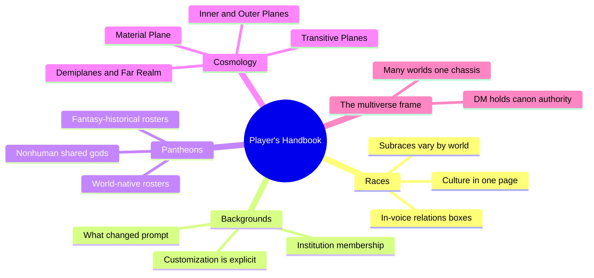
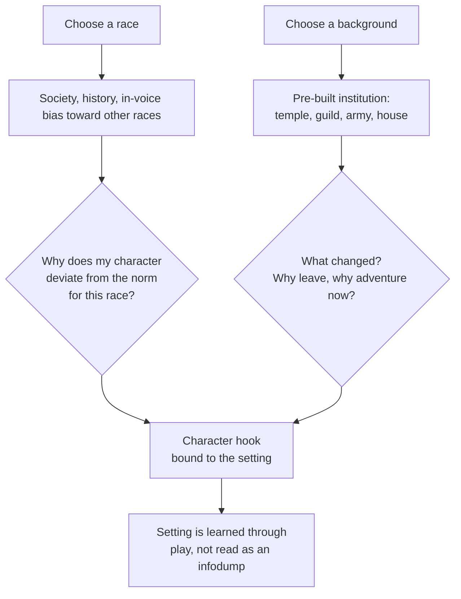
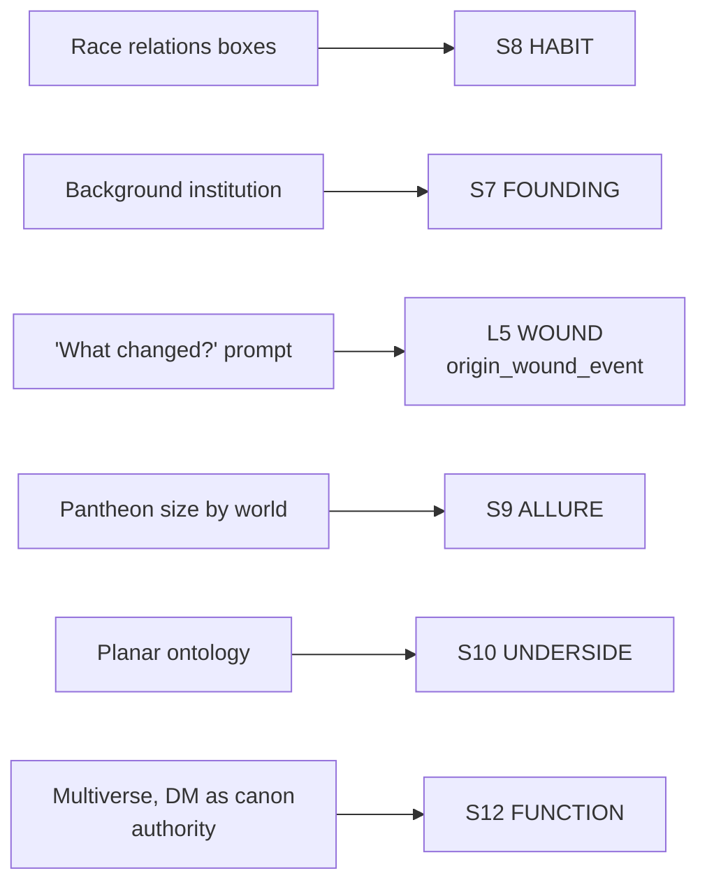

# BVX.1175 — Player's Handbook (5th ed.) — Wizards RPG Team (2014)

### Knowledge Entry — Distill

The core 5th-edition rulebook for building a D&D character; distilled here for its player-facing worldbuilding machinery, not its combat math, feeding the setting shelf (BOLO 87) alongside the DMG (BVX.0405) and the SRD (BVX.1174).

## TABLE OF CONTENTS
- [Core Thesis](#1-core-thesis)
- [Mind Models](#2-mind-models)
- [Framework](#3-framework--structure)
- [Key Concepts](#4-key-concepts)
- [Heuristics](#5-heuristics--decision-rules)
- [Invariants](#6-invariants)
- [Pitfalls](#7-pitfalls--myths)
- [Application](#8-application)
- [Cross-References](#9-cross-references)
- [Provenance](#10-provenance--confidence)

---

## 1 · CORE THESIS

Character creation is the setting's onboarding ritual: a player never reads a world bible, they choose a race, a background, and a god, and each choice is pre-loaded with culture, institution, and history. The multiverse frame then makes that loaded content optional per table, canon devolved to whoever is running the game.

---

## 2 · MIND MODELS

*Required. Minimum two diagrams, maximum five.*

**Diagram 1 — the whole argument.**
Caption: *four player-facing systems, race, background, pantheon, and cosmology, all resolve to the same move: hand the player a piece of the world pre-loaded with conflict, then let them decide what to do about it.*

**Diagram 2 — the central mechanism (character creation as a forced setting-engagement loop).**
Caption: *race and background each ask a question the player must answer in their own words; the answer is the setting, learned by production instead of by exposition.*

**Diagram 3 — mapped onto the Command's SETTING SLICE and L5 WOUND.**
Caption: *the book's player-facing machinery lands mostly on the habit, founding, allure, and underside layers, plus one direct hit on the character stack's WOUND, exactly where a rulebook aimed at players and not GMs should land.*

---

## 3 · FRAMEWORK / STRUCTURE

Three parts, but the setting-teaching load concentrates in Part 1 and the appendices:

| Section | Page | What it teaches about the world |
|---|---|---|
| Introduction, "Worlds of Adventure" | 5 | Names the multiverse and states its permission structure up front, before a single rule |
| Ch. 2, Races | 17 | One culture per page: society, history, an in-voice bias toward the other races, mechanical traits, subraces |
| Ch. 4, Personality and Background | 121 | Institution membership plus the mandatory "what changed" question; explicit rules for remixing a background |
| Appendix B, Gods of the Multiverse | 293 | Per-world pantheon rosters, nonhuman shared deities, four fantasy-historical pantheons as an opt-in register |
| Appendix C, The Planes of Existence | 300 | A cosmology sorted by ontological kind: raw substance, raw meaning, connective tissue, sealed exception, outside-the-system unknown |

Everything else (classes, equipment, spells, combat) is mechanics that assumes, but doesn't teach, a world. The setting-shelf value sits almost entirely in these five sections.

---

## 4 · KEY CONCEPTS

| Concept | What it is | Why it matters |
|---|---|---|
| **The multiverse as permission structure** | The introduction names the frame before any rule: countless worlds (Realms, Dragonlance, Greyhawk, Dark Sun, Eberron, "a world of your own") share one chassis and one cosmology | Canon is non-binding across worlds; a writer borrows a species or a god without inheriting that world's continuity |
| **DM (table) as canon authority** | Stated directly: "the Dungeon Master is the authority on the campaign and its setting, even if the setting is a published world" | Canon collision is designed out up front, the same move a shared-universe property needs when multiple writers touch one IP |
| **Race entry as culture-in-one-page** | Each race gets a short lore essay (society, history, appearance), then mechanical traits and a subrace choice | A repeatable template: history, attitude, one distinguishing trait, then move on |
| **In-voice relations box** | Sidebar quotes from one race's perspective on the others (a dwarf on elves, halflings, humans), bias left intact | Culture taught through stated prejudice reads alive; a neutral wiki-voice entry reads dead |
| **Subrace as world-variable, species as constant** | Hill and mountain dwarves are one clan-set in Dragonlance but two separated kingdoms (shield, gold dwarves) in the Realms | Species/trait-core is portable across a multiverse; culture and politics are set per world |
| **Background as pre-built institution membership** | Acolyte, criminal, soldier, and the rest each slot the character into a real organization with its own equipment, skills, and one signature feature | A background is a standing relationship to a piece of the setting, never just flavor text |
| **The "what changed?" prompt** | The chapter's explicit framing question for every background: why did you stop, why adventure now, where did the money come from | Forces a wound or a want into existence at character creation, stated as the chapter's first question |
| **Customization as stated permission** | A sidebar explicitly authorizes swapping any background feature, any two skills, mixed tool proficiencies | The template is declared a toolkit, not locked canon, the same stance the multiverse takes at world scale |
| **Pantheon register tuned per world** | Realms and Greyhawk run teeming pantheons (thirty-plus deities); Eberron runs one focused pantheon against a dissenting shadow-pantheon | Pantheon size and tone is a craft decision, not a default to copy unexamined |
| **Fantasy-historical pantheons as opt-in register** | Celtic, Greek, Egyptian, Norse pantheons, "divorced from their historical context," each opened by one mood paragraph before the table | Myth-voice prose sets tone, the crunch table makes it usable; neither alone does the job |
| **Nonhuman deities shared across worlds** | Moradin, Corellon Larethian, and other race-linked gods recur across published worlds even as human pantheons reset | A species carries a stable religious through-line across a multiverse while surrounding culture resets |
| **Cosmology sorted by ontological register** | Transitive Planes (connective, nearly featureless); Inner Planes (raw elemental substance); Outer Planes (raw alignment/meaning, homes of gods); demiplanes (sealed pocket exceptions); the Far Realm (outside the multiverse's own laws) | Built by what a place *is made of*, not only by map distance |
| **Sigil and the Outlands as navigable hub** | The Outlands rings the Great Wheel's center with sixteen gate-towns; Sigil, the City of Doors, floats above it as the cosmology's trade and information hub | A cosmology this large still needs one concrete, walkable place where its abstractions become tradeable |
| **A plane's alignment as its essence** | A creature whose alignment mismatches a plane feels dissonance there; good feels at home in Elysium, evil doesn't | Moral or thematic register externalized as terrain a character can stand in or be rejected by |

---

## 5 · HEURISTICS & DECISION RULES

| Situation | Do this | Not this |
|---|---|---|
| Introducing a new species or culture to a player | Give it a short lore essay plus one biased in-voice quote about a neighboring culture | Write a neutral, complete encyclopedia entry with no attitude in it |
| Reusing a species across multiple sub-settings | Keep the trait-core stable; vary its politics, environment, and social structure per world | Force the exact same culture and politics onto the species everywhere it appears |
| Writing a character's origin/background | Tie it to a real institution and force the "what changed, why leave" question | Leave the background as flavor text with no institutional hook and no forced tension |
| Publishing a template for others to fill in | State explicitly what can be swapped (a feature, a skill, a proficiency) | Present the template as fixed and hope people intuit the remix permission |
| Sizing a pantheon for a world or story-universe | Match register to genre: teeming for a kitchen-sink world, focused for a tightly-themed one | Default to a maximal pantheon regardless of what the story actually needs |
| Writing a mythic or cosmological register | Open with one mood-setting paragraph in myth-voice before any mechanical detail | Lead with the stat table and let the tone arrive, if at all, as an afterthought |
| Designing a multi-tier cosmology or afterlife-equivalent | Sort tiers by what they're made of (substance, meaning, connective tissue, exception, unknown) | Sort tiers only by distance or by up/down position on a map |
| Making an abstract cosmology usable at the table | Give it one concrete hub location where its rules become literal and tradeable | Leave the whole cosmology conceptual with no walkable anchor point |
| Running one property across multiple creators or writers | State canon authority explicitly and delegate it (a table, an editor, a bible-holder) | Let every contributor assume their own worldbuilding is binding on everyone else's |

---

## 6 · INVARIANTS

1. **Setting is taught by choices the audience makes for a character, not by paragraphs they're asked to read.** Race and background are the delivery mechanism; the lore is inseparable from the act of choosing.
2. **A culture entry is strongest narrated with bias from inside it, not described neutrally from outside it.** The relations boxes are the load-bearing device, not the objective description above them.
3. **Species is a portable trait-core; culture and politics are a per-world variable layered on top.** The same dwarves can be one clan-set in one world and two warring kingdoms in another without breaking anything.
4. **A background is only doing its job if it forces a "why" the player must answer.** Institution membership without the forced-change question is inert flavor text.
5. **A template is a toolkit until it explicitly says otherwise.** Permission to remix has to be stated, not assumed.
6. **Cosmology scales by ontological register before it scales by distance.** What a tier is made of (substance, meaning, connective tissue, exception, unknown-to-the-system) organizes it more usefully than how far away it is.
7. **A shared multiverse survives contradiction only because canon authority is explicitly delegated.** Someone (a table, an editor) has to be named the tiebreaker, or the shared frame collapses on first conflict.

---

## 7 · PITFALLS / MYTHS

- Writing a race or culture entry as a neutral reference article, stripping the bias that makes it read as a living perspective rather than a wiki stub.
- Treating a background as cosmetic flavor text with no institutional weight and no forced "what changed" tension.
- Forcing identical politics and culture onto a species in every sub-setting, instead of letting culture vary while the trait-core holds.
- Publishing a reusable template without stating what parts are meant to be swapped, leaving remixers guessing.
- Defaulting to one pantheon size and tone for every world, rather than tuning the register to the story's needs.
- Building a cosmology purely as nested geography, with no ontological sort for what each tier is made of.
- Leaving a big abstract cosmology with no concrete, walkable hub where its rules become literal.

---

## 8 · APPLICATION

- **Spine level:** SETTING, plus a direct hit on L5 WOUND at the character-stack level, per this entry's `spine: [SETTING, L5]` keying
- **12-layer character stack:** L5 WOUND — the background chapter's "what changed?" prompt is a forced `origin_wound_event`, mandatory at character creation rather than optional backstory
- **plot_systems:** contextual candidate once `04_PLOT_SYSTEMS/` opens — the deviate/changed loop in Diagram 2 is a ready-made character-hook generator, runnable on any drafted species-and-institution pairing
- **Setting:** primary — feeds S8 HABIT, S7 FOUNDING, S9 ALLURE, S10 UNDERSIDE, and S12 FUNCTION at varying strength, plus S1 BODY contextually via the subrace-as-world-variable pattern

Read against a science-fiction story universe, the steal is the machinery, not the specific races or gods: hand the reader a pre-loaded piece of the world and force a question about it, rather than explaining the world in a block. A species primer with an in-voice bias quote does more setting work per word than a neutral dossier. A character's origin should be an institution plus a forced "why did you leave," not free-floating backstory. A story-universe's own cosmology, whatever it's built from, benefits from the same sort: what a tier is made of (raw substance, raw meaning, connective tissue, sealed exception, or genuinely outside the system's own logic) before worrying how far away it sits on a map. The delegated-canon-authority move is portable too: if the setting will ever host more than one writer or sub-continuity, name the tiebreaker before the first contradiction, not after.

---

## 9 · CROSS-REFERENCES

| Related entry | Relation |
|---|---|
| [[BVX.0405]] | Dungeon Master's Guide, 5th ed. — the GM-facing sibling; that entry covers map-drafting scale and settlement atmosphere, this one covers the player-facing onboarding half the DMG doesn't touch |
| [[BVX.1174]] | The SRD — the rules-core sibling; overlaps in mechanics but the SRD strips the in-voice culture writing and the appendix pantheons this entry is built around |
| [[BVX.0458]] | Kobold Guide to Worldbuilding — the theory/toolkit counterpart; Baur's "dynamite not encyclopedia" thesis is the same argument this entry's race-and-background machinery makes in practice, at the character-creation scale instead of the campaign-design scale |

---

## 10 · PROVENANCE & CONFIDENCE

Full text, extracted to plain text (some OCR noise in running text and tables; content legible throughout). Read in full: the Preface and "How to Play"; "Worlds of Adventure" (Introduction, p.5); "Using This Book" (p.6); the whole of Chapter 2, Races, including "Choosing a Race," the racial-traits glossary, and the Dwarf entry in full (society, history, clans, relations box, names) as a worked template for the chapter's method; the "Character Details" opening of Chapter 4; the Backgrounds section opener, the Customizing a Background sidebar, and the Acolyte background in full as a worked template; the Alignment and "Alignment in the Multiverse" sections; Appendix B, Gods of the Multiverse, in full, including the D&D Pantheons framing, the Forgotten Realms, Greyhawk, and Eberron rosters, Nonhuman Deities, and the Fantasy-Historical Pantheons framing plus the Celtic, Greek, and Egyptian tables; Appendix C, The Planes of Existence, in full, including Planar Travel, the Transitive Planes, Inner Planes, Outer Planes, Positive/Negative Planes, Sigil and the Outlands, Demiplanes, and the Far Realm. Not read: the class chapters (3), equipment (5), customization options (6), ability-score and combat rules (7-9), spellcasting and spell lists (10-11), and Appendices A and D — mechanical content outside this distill's setting-shelf scope per the brief.

`zotero_key` could not be confirmed against the live library this pass and is marked unresolved rather than guessed; title and year (Player's Handbook, first printing August 2014) come directly from the book's own credits and copyright pages. The author line follows the sibling DMG entry's convention (lead designers named, full writing team in credits) since the book itself credits no single author.

## META
- Template: BVX-LEARN-v4.0
- Source classification: full-text extraction, deep read on the setting-shelf sections named in the brief, mechanical chapters intentionally unread
- Created / Updated: 2026-09-29
