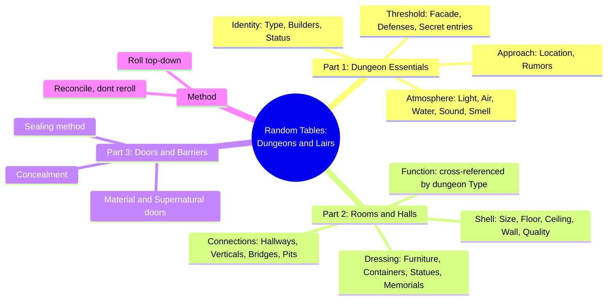
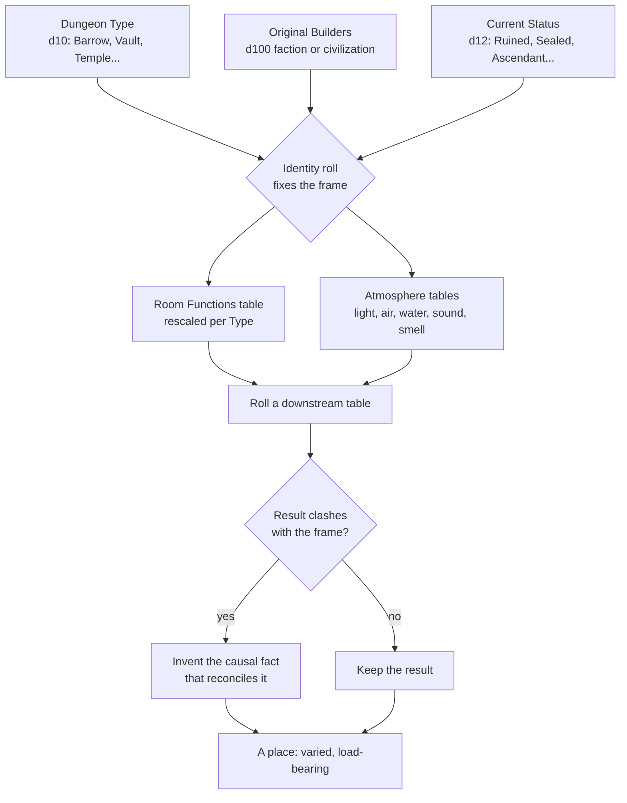
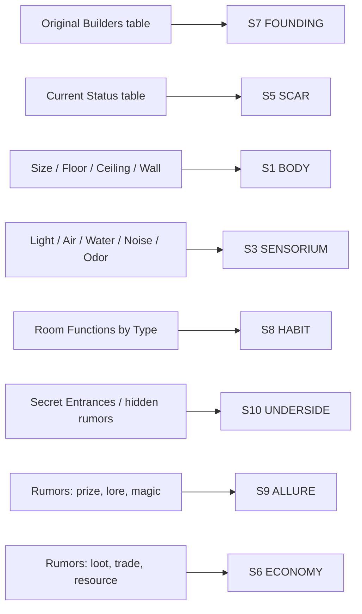

# BVX.1176 — Random Tables: Dungeons and Lairs — Dr. Timm Woods (2022)
### Knowledge Entry — Distill

A GM's random-table toolkit for building one dungeon at a time, table by table, from identity down to the door hinges; the first SETTING-shelf distill built from a generation *engine* rather than a design essay.

## TABLE OF CONTENTS
- [Core Thesis](#1-core-thesis)
- [Mind Models](#2-mind-models)
- [Framework](#3-framework--structure)
- [Key Concepts](#4-key-concepts)
- [Heuristics](#5-heuristics--decision-rules)
- [Invariants](#6-invariants)
- [Pitfalls](#7-pitfalls--myths)
- [Application](#8-application)
- [Cross-References](#9-cross-references)
- [Provenance](#10-provenance--confidence)

---

## 1 · CORE THESIS

A dungeon is a stack of independently rollable tables, but coherence comes from sequencing: identity (builder, type, status) rolled first constrains and rescales every table rolled after it. A GM never rerolls a clash; they invent the causal fact that reconciles it. Randomness generates variety; interpretation generates consistency.

---

## 2 · MIND MODELS

*Required. Minimum two diagrams, maximum five.*

**Diagram 1 — the whole argument.**
Caption: *eighteen-plus tables sort into a top-down cascade — identity fixes the frame, texture and structure fill it, thresholds seal it last.*

**Diagram 2 — the central mechanism (a gated cascade, run once per dungeon).**
Caption: *the same three identity rolls gate everything downstream, including which numbers even show up on the Room Functions table — a clash is raw material for a story fact, never a reason to reroll.*

**Diagram 3 — mapped onto the Command's SETTING SLICE (S1–S12).**
Caption: *eight tables land cleanly on eight of twelve SETTING SLICE layers; the book never touches S12 FUNCTION, S4 LAW, S2 WEATHER, or S11 VECTOR as anything but flavor text folded inside Status.*

---

## 3 · FRAMEWORK / STRUCTURE

Three parts, read in the order the Introduction hands the GM the build sequence, not the order a table of contents would list them alphabetically:

1. **Dungeon Essentials** — identity, approach, atmosphere, threshold. Roll Type, Status, Rumors, Original Builders, and Location first; these "anchor all of the rest of the dungeon," in the book's own words. Then layer atmosphere (Lighting, Magical Lighting, Temperature, Air Quality, Water Sources, Food Sources, Noises, Odors) across the whole site. Close the part with the outer threshold: Dungeon Facade, Entrance Defenses, Secret Entrances.
2. **Rooms & Halls** — shell, function, dressing, connections. Roll the room's physical shell (Size, Floor, Ceiling, Wall, Quality), then its Function — cross-referenced against the dungeon Type chosen in part 1 — then contents (Room Features, Furniture, Containers, Paintings, Statues/Statuettes, Memorials, Dungeon Prison Quirks), then the topology that links rooms (Connections, Hallways, Vertical Connections, Bridge Width, Magical Bridge Properties, Bottom of Pit).
3. **Doors & Barriers** — the last layer. Door Material, Supernatural Doors, Door Concealments, Unique Sealing Method: rolled once the space behind them already exists, because a door is a rule about who gets in, not a feature of the room itself.

The Introduction states the sequencing explicitly and gives explicit permission to jump around once the essentials are locked: "Feel free to choose some details and roll others," and "let one roll inform the next in an unfolding story." It also states the reconciliation rule directly, with its own worked example: a flying race's lair with a surprising quantity of pits reads not as noise but as evidence "they felt threatened by nearby land-dwellers." That one sentence is the book's real craft lesson, buried in the front matter rather than flagged as a rule.

---

## 4 · KEY CONCEPTS

| Concept | What it is | Why it matters |
|---|---|---|
| **Identity-first cascade** | Type, Builders, Status, and Location are rolled before any other table | Everything atmospheric or structural is read against these four answers, not generated blind |
| **Room Functions cross-reference** | One d100 table with separate result columns per dungeon Type (Vault, Temple, Barrow, Tomb, Maze, etc.) | The same physical roll yields a different room list depending on what kind of place it is — coherence enforced by table design, not GM discipline alone |
| **Reconcile, don't reroll** | The book's explicit instruction: treat a contradictory result as a prompt to invent a causal fact, only reroll when a result is truly incompatible (an ice door in a lava room) | This is the single load-bearing craft rule; it converts randomness into worldbuilding instead of noise |
| **Rumors as hook menu** | A d100 table (armed presence, cult rituals, great prize, torn by conflict, portal presence, unearthed evil...) attached to a place before the party ever sees it | Rumors do double duty as adventure hooks and as a place's reputation — what the world already believes about it |
| **Original Builders as precursor table** | A single d100 roll (ancient dragons, dwarven miners, elemental cultists, a fallen ruler, a wizard school...) assigns a whole culture or species as the place's maker | Operationalizes the "ruins imply a builder" claim from BVX.0458 as one mechanical step, not an essay-level design choice |
| **Current Status as damage-state** | Ascendant, Destroyed, Fortified, Long Lost, Natural Space, Occupied by Original Builders, Partly Conquered, Partly Explored, Rebuilt, Ruined, Sealed, Supposedly Abandoned | Stores the place's history as a present-tense condition rather than a narrated timeline — no backstory paragraph required |
| **Layered atmosphere** | Eight separate sensory tables (Lighting, Magical Lighting, Temperature, Air Quality, Water Sources, Food Sources, Noises, Odors), applied dungeon-wide or per room | Sensory texture is generated after the shell, as its own pass, not folded into room description by hand |
| **Shell before contents** | Room Sizes, Floors, Ceilings, Walls, and Room Quality are rolled before Room Features, Furniture, Containers, Paintings, Statues, and Memorials | Separates "what the space is" from "what's in it," so damage (Room Quality) and dressing don't get conflated |
| **Connections as their own axis** | Hallways, Vertical Connections, Bridge Width, Magical Bridge Properties, Bottom of Pit | Movement and topology between rooms is generated separately from room content — a dungeon is a graph, not just a room list |
| **Threshold sequence** | Facade → Entrance Defenses → Secret Entrances (part 1) mirrored by Door Material → Supernatural Doors → Door Concealments → Unique Sealing Method (part 3) | The outside of a place is designed before its inside, and its final seal is designed last of all — thresholds bookend the whole build |

---

## 5 · HEURISTICS & DECISION RULES

| Situation | Do this | Not this |
|---|---|---|
| Starting a new location cold | Roll identity first (type, builders, status, location) and read every later table against it | Roll a pile of flavor tables and hope they cohere |
| Two rolled results contradict | Invent the causal fact that makes both true | Reroll until the contradiction disappears |
| Building a "used" place, not a museum | Roll Current Status and Room Quality before dressing any room | Dress every room to a pristine default and skip the damage layer |
| Wanting varied but recognizable places across one setting | Reuse the same tables with different die results | Invent a bespoke, ad hoc feature list for every new location |
| A place needs a reason people want in | Pull from the Rumors table's prize, lore, and magic entries | Describe the place only by its dangers |
| A place's inhabitants should feel load-bearing | Roll Original Builders before Room Functions and let the builder bias the room list | Populate rooms with generic content unconnected to who built the place |
| Deciding how much history to write | Let Current Status stand for the history — Ruined already implies a fall | Write a paragraph of backstory to justify every status result |

---

## 6 · INVARIANTS

1. **Identity precedes texture.** The tables answering "what and who" are rolled before the tables answering "how does it feel."
2. **Function is never independent of identity.** The same roll range on the Room Functions table means different things depending on the Type already fixed.
3. **History is stored as a present-tense state, not a timeline.** Current Status carries the past without narrating it.
4. **Every threshold is its own roll**, separate from what it protects — facade, defenses, secret entrance, door, and seal are five different tables, not one.
5. **A rolled contradiction is raw material, not an error state.**
6. **Structure is dressed in passes: shell, then function, then contents, then connections** — never all at once.

---

## 7 · PITFALLS / MYTHS

- Treating the tables as independent slot machines instead of a sequence where earlier rolls gate later ones.
- Rerolling every clash instead of authoring the fact that explains it — the book's own example: a flying builder's lair full of pits is a defense against land-dwellers, not a mistake.
- Skipping the identity layer and jumping straight to room dressing, producing a fully furnished space with no builder, no status, and no reason to exist.
- Letting Current Status and Room Quality default to pristine, erasing the damage-and-history layer entirely.
- Using the Rumors table only for danger and ignoring its allure entries (Great Prize, Great Lore, Great Magic, Great Library), which are what give players a reason to want in.
- Folding thresholds into room description instead of treating facade, defenses, entrance, door, and seal as their own axis.

---

## 8 · APPLICATION

- **Spine level:** SETTING (non-story-spine source; keys to the entity beside the L0–L7 spine, per ssot_03's binding rule that setting is a Domain embodied, never a level)
- **12-layer character stack:** none directly — this is a setting-side generation engine, not a character source
- **plot_systems:** contextual — the Rumors table is a ready-made scene-hook generator per place, and the reconcile-don't-reroll rule is a portable improvisation discipline for any collision the SCENE CARD flags as unseeded
- **Setting:** primary — a generation-*method* distill feeding eight of the twelve SETTING SLICE layers (S1, S3, S5, S6, S7, S8, S9, S10)

Where BVX.0458 (Kobold Guide) states the design claim "ruins imply a builder," this book operationalizes it: a single d100 roll on Original Builders forces the answer before any other detail exists. That is the book's steal for a writer building a SETTING system — not the specific d100 lists (Yetis, Duergar Dwarves, Draconic Disciples), which are pure D&D flavor, but the *cascade structure* underneath them: roll identity, let identity rescale the odds on every downstream table, then fill texture and structure in shell-then-contents passes, and seal with thresholds last.

The mechanism transfers cleanly to a science-fiction setting with a reskin, not a redesign. Dungeon Type becomes site type (derelict, outpost, black-site vault, research facility, temple-equivalent); Original Builders becomes precursor civilization, corporation, or species; Current Status becomes the site's damage-state (abandoned, contested, sealed, salvaged, ascendant); the atmosphere tables (light, air, water, sound, smell) become environmental-hazard generation almost unchanged. The single most transferable piece of machinery is the Room Functions cross-reference: build one master list of possible location-functions, then rescale the odds per site-type, so a military outpost and a research vault draw from the same table but land on different results — family resemblance across many generated sites without hand-authoring each one. Current Status's vocabulary (Long Lost, Sealed, Rebuilt, Ruined) also drops straight onto any place already carrying an S5 SCAR — DCUS's own Skeeter Creek → Red Hills → DCUS rename lattice reads as a rolled "Rebuilt" over a buried "Long Lost," which is the table doing in one line what the canon node currently states in a paragraph.

---

## 9 · CROSS-REFERENCES

| Related entry | Relation |
|---|---|
| [[BVX.0458]] | Kobold Guide to Worldbuilding — theory counterpart; this book operationalizes Kobold's "ruins imply a builder" claim as a literal generation step rather than a design principle |
| [[BVX.1122]] | GURPS Hot Spots: Renaissance Venice — a worked historical instance at settlement scale; this book is the generative-engine counterpart at site/dungeon scale, method rather than example |
| [[BVX.0349]] | Against Worldbuilding, and Other Provocations — the kitchen-sink counter-argument; the identity-first cascade here is itself a discipline against kitchen-sink drift, since identity gates what even appears on later tables |

---

## 10 · PROVENANCE & CONFIDENCE

Full text, pdftotext extraction (~184pp by form-feed count), clean text layer, no machine-readable table of contents page — the Introduction narrates the build order in prose instead. Read in full: dedication, Introduction / "How to Use This Book," and every table header and full table body across all of Part 1 "Dungeon Essentials" (Dungeon Types, Current Status, Rumors, Original Builders, Location, Lighting, Magical Lighting, Temperature, Air Quality, Water Sources, Food Sources, Noises, Odors, Dungeon Facade, Entrance Defenses, Secret Entrances). Part 2 "Rooms & Halls" and Part 3 "Doors & Barriers" were read by table header plus representative full tables (Room Sizes, Floors, Ceilings, Walls, Room Quality, the Room Functions cross-reference by Type, Room Features, Furniture, Containers, Paintings, Statues/Statuettes, Memorials, Dungeon Prison Quirks, Connections, Hallways, Vertical Connections, Bridge Width, Magical Bridge Properties, Bottom of Pit, Door Material, Supernatural Doors, Door Concealments, Unique Sealing Method) rather than transcribed entry by entry — the mechanism (cross-reference by Type, identity-first sequencing) was confirmed directly from the Room Functions table's column structure, not inferred. Closing Acknowledgments, About the Author, and colophon (title, ISBN, Ulysses Press) also read in full; the exact title in frontmatter is taken from the colophon-adjacent Zotero attachment filename, since the extracted text itself begins at the dedication and does not carry a title page.

The S-layer keying in frontmatter `feeds:` and Diagram 3 is this distill's synthesis against `ssot_03_setting_system.md` (PART A, the twelve-layer SETTING SLICE), following the same mapping discipline BVX.0458 established. `spine: [SETTING]` and the empty character-stack application are asserted per the v4 template's binding rule that setting is an entity beside the spine, never an L0–L7 level.

## META
- Template: BVX-LEARN-v4.0
- Source classification: full-text random-table sourcebook, deep extraction on all of Part 1, representative-table extraction on Parts 2–3 (structural pattern confirmed, exhaustive table entries not transcribed)
- Created / Updated: 2026-09-29
