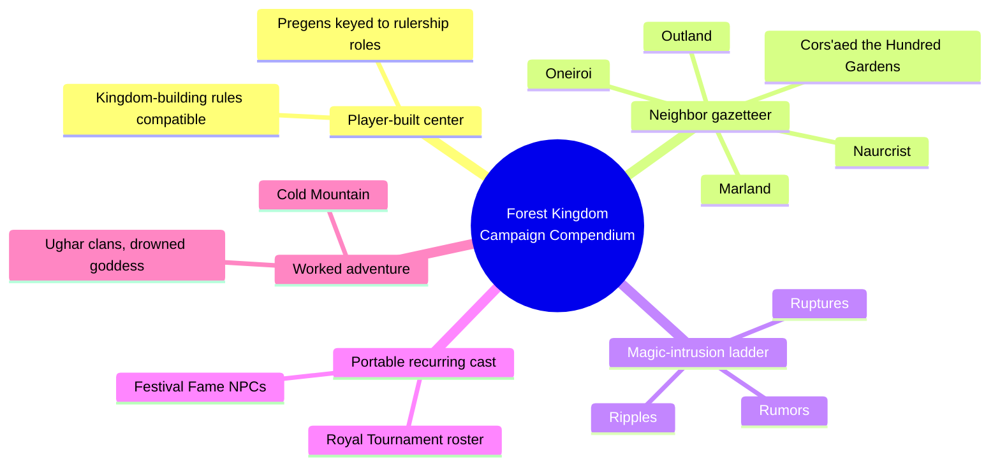
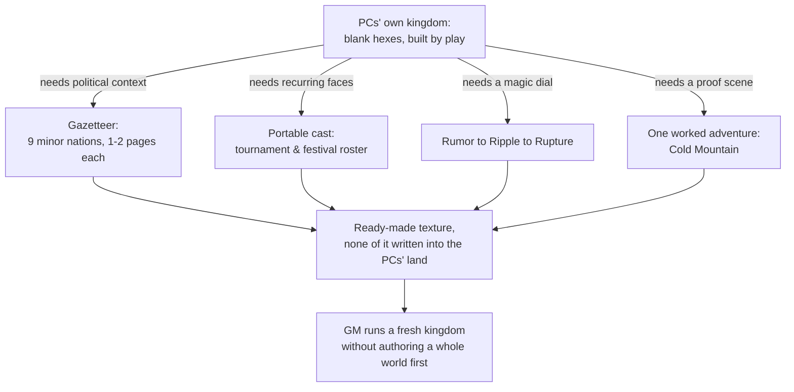
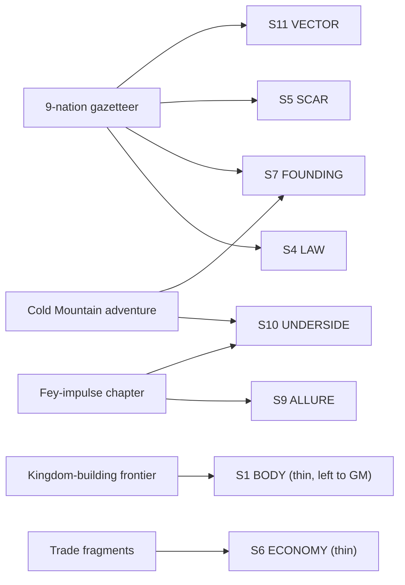

# BVX.1177 — Forest Kingdom Campaign Compendium — Legendary Games (2017)

### Knowledge Entry — Distill

A Pathfinder Adventure Path plug-in for the "River Kings"-style kingdom-building campaign: not a fully-built world, but a tool for a GM whose PCs are about to carve one kingdom of their own out of the wilderness, surrounded by nine pre-authored neighbor nations that supply politics and history without ever being visited.

## TABLE OF CONTENTS
- [Core Thesis](#1-core-thesis)
- [Mind Models](#2-mind-models)
- [Framework](#3-framework--structure)
- [Key Concepts](#4-key-concepts)
- [Heuristics](#5-heuristics--decision-rules)
- [Invariants](#6-invariants)
- [Pitfalls](#7-pitfalls--myths)
- [Application](#8-application)
- [Cross-References](#9-cross-references)
- [Provenance](#10-provenance--confidence)

---

## 1 · CORE THESIS

Don't pre-build the PCs' own kingdom; build its border instead. A ring of thinly-sketched neighbor nations, a portable recurring cast, a graduated magic-intrusion dial, and one fully worked adventure give a GM instant political and historical texture around a kingdom the players build through play.

---

## 2 · MIND MODELS

*Required. Minimum two diagrams, maximum five.*

**Diagram 1 — the whole argument.**
Caption: *five toolkit pieces surround an empty center — the PCs' own kingdom is the one thing this book deliberately does not pre-write.*

**Diagram 2 — the central mechanism (a process: how the toolkit surrounds the unwritten center).**
Caption: *every other chapter exists to give the blank kingdom texture without ever filling it in — the frontier stays the GM's, not the book's, to build.*

**Diagram 3 — mapped onto the Command's SETTING SLICE (S1–S12).**
Caption: *the book is strong on law, founding, scar, and allure — repeated nine times over in miniature — and thin on body and economy, exactly where it hands the pen to the GM.*

---

## 3 · FRAMEWORK / STRUCTURE

Ten chapters, unevenly weighted toward player-facing crunch (classes, spells, magic items, monsters occupy roughly half the book) with a compact setting-and-toolkit spine running through the rest:

| Chapter | Governing move |
|---|---|
| 4 · Faerie Forests | How much of the fey world is allowed to touch the mortal one, on a graduated scale |
| 5 · Royal Tournaments | A repeatable social set-piece plus a portable NPC roster to populate it |
| 6 · Countries and Characters | Nine minor nations, each a 1–2 page gazetteer entry in a repeatable format |
| 7 · Conquering Heroes | Eight pregenerated founder-PCs, each wired to a specific kingdom-building rulership role |
| 9 · Cold Mountain | A fully worked adventure proving the gazetteer's method (native culture + present-tense history + underside reveal) in play |
| 10 · Horns of the Hunted | A second worked adventure (sampled only, not deep-read here) |

The book states its own organizing move on the back cover: chapters on "building your own border kingdom in the wilderness... and even sample kingdoms" — the neighbors are explicitly *samples*, not the campaign's own land.

---

## 4 · KEY CONCEPTS

| Concept | What it is | Why it matters |
|---|---|---|
| **The unwritten center** | The PCs' own kingdom is never detailed — geography, government, and history are left for hex-crawl play using external kingdom-building rules | Everything else in the book exists to make that emptiness feel populated, not to fill it in for the GM |
| **The nation-card template** | Each of the nine gazetteer nations gets the same implicit fields: founding stroke, binding principle/ruler, current conflict, one secret | A repeatable unit lets a GM drop in a tenth nation of their own devising and it will read as native to the set |
| **Present-tense-history compression** | Each nation's history is told in two or three sentences, only as much as explains today's conflict (Marland: a liege dared a tower, never returned, civil war, giants reclaimed the land) | Nine live demonstrations of the rule BVX.0458 states once in theory |
| **Binding-principle variety** | Nine different answers to "why do these people obey this ruler": combat prowess (Naurcrist), election (Cors'aed), inherited loyalty turned mercenary (Marland), personal fey charisma (Oneiroi) | Governance is generated from who the people are, not assigned from a menu of crown-shapes |
| **The magic-intrusion ladder** | Fey impulses come in three tiers: Rumors (illusory, no real effect), Ripples (mind-affecting, semi-real), Ruptures (physically real, can breach permanently) | A graduated dial for "how much of the Other is allowed to hurt you," usable for any otherworld-adjacent to reality, not just fey |
| **The portable cast** | The Festival Fame roster (a dozen-plus named NPCs — merchants, knights, rogues, a disguised dragon) is written with no fixed home, meant to recur at any tournament or festival anywhere in the setting | One cast serves every location that hosts a social set-piece, instead of writing a fresh cast per place |
| **Rulership-keyed founder PCs** | The eight pregenerated heroes in Conquering Heroes each carry notes on which kingdom-building rulership role (ruler, diplomat, marshal, etc.) they suit best | Character creation is wired directly into the kingdom-founding minigame instead of sitting beside it |
| **Replacement-phrase compatibility** | The book swaps proper nouns ("River Kings" for a named published setting, "Forest Kingdom" for its actual place-name) to stay usable in any homebrew frontier campaign while staying legally compatible with the AP it's built to plug into | A method for writing setting content that ports cleanly, not one more essay on IP — the swap is load-bearing on the whole design |

---

## 5 · HEURISTICS & DECISION RULES

| Situation | Do this | Not this |
|---|---|---|
| The setting's center will be built by the players (a founded kingdom, a colonized frontier) | Leave its interior blank and build its political border instead | Pre-author the center's geography and government before play starts |
| Writing a neighbor nation the party may never visit | Give it a founding sentence, a binding principle, a current conflict, one secret — stop | Write a full history and gazetteer entry as if it were the main setting |
| You need a "how much does the Other intrude" dial | Build a graduated ladder (illusory, semi-real, real) | Make it a binary: magic is present or absent |
| You need recurring NPCs across many locations that share an event type | Build one portable cast keyed to the event (a festival, a market, a court) | Write a duplicate cast for every location that hosts the same kind of gathering |
| Proving a gazetteer method works at the table | Write one fully worked adventure that runs the method end to end | Add more summary entries instead of a worked example |
| Wiring character creation into a kingdom-founding campaign | Tag each pregenerated PC with the rulership role their build and backstory suit | Treat character options and the kingdom-building minigame as unrelated systems |
| Adapting this gazetteer to your own frontier | Keep the nation-card template and binding-principle taxonomy, swap the proper nouns | Copy the specific nations wholesale |

---

## 6 · INVARIANTS

1. **A frontier "empty" of a pre-built kingdom is never empty of neighbors.** Every space near it is already claimed by someone with a founding story and a live grievance.
2. **History earns page space only as far as it explains a present conflict**, at gazetteer scale as much as at essay scale (BVX.0458's rule, run nine times).
3. **Governance is keyed to the binding principle of the people it governs**, not handed down independent of who they are.
4. **A recurring cast beats a location-bound cast** whenever the setting expects the party to travel between similar social set-pieces.
5. **A magic-intrusion system needs at least three rungs** (illusory, semi-real, fully real) to do double duty as flavor and as threat escalation.
6. **One fully worked adventure proves a method more convincingly than any number of additional summary entries.**
7. **Character options that feed the campaign's central minigame (here, kingdom rulership) should be tagged for it explicitly**, not left as a coincidence the GM has to notice.

---

## 7 · PITFALLS / MYTHS

- Treating the wilderness the PCs are "claiming" as actually unclaimed — Cold Mountain's Ughar clans, and half the gazetteer's fallen kingdoms, exist to puncture exactly that assumption.
- Writing full histories for background nations the party may never visit; the book caps each at one to two pages on purpose.
- Making festival or tournament NPCs location-specific when their entire design value is that they can show up anywhere.
- Treating an otherworld's intrusion as binary (magic works or it doesn't) instead of a graduated ladder that can escalate mid-campaign.
- Building a kingdom-founding campaign's character options and its political texture as two unrelated products instead of wiring them together (rulership-role tags, neighbor-nation hooks that reference the party's own charter).

---

## 8 · APPLICATION

- **Spine level:** SETTING (non-story-spine source; keys to the entity beside the L0–L7 spine, per the setting-is-a-Domain-embodied binding rule)
- **12-layer character stack:** none directly — this is a setting-side source
- **plot_systems:** contextual — the nation-card template (founding sentence, binding principle, current conflict, one secret) is a ready-made stub generator for any place the party will only glance at, not live in
- **Setting:** primary for a player-built or frontier-growth setting specifically. For a science-fiction story universe built around a single evolving polity or colony, the load-bearing transfer isn't the fey-forest flavor — it's the structural move: build the border in detail and leave the center for the story (or the players) to fill, use a repeatable "place-card" template for every polity glimpsed but not lived in, give any otherworld or alien-intrusion element a graduated three-rung dial instead of an on/off switch, and keep one portable recurring cast for any social set-piece that repeats across locations. Cold Mountain is the concrete proof: a native culture's grievance, compressed to present-tense history and an underside reveal, is what turns a gazetteer stub into an actual played scene — the same move any SF colony-frontier can run with a displaced or overlooked population instead of a barbarian clan.

---

## 9 · CROSS-REFERENCES

| Related entry | Relation |
|---|---|
| [[BVX.0458]] | Kobold Guide to Worldbuilding — this book is a worked, repeated instance of its present-tense-history rule and its tribe/city-state/nation binding-principle taxonomy, run nine times in miniature rather than argued once |
| [[BVX.1122]] | GURPS Hot Spots: Renaissance Venice — the opposite worked instance: one setting built deep (S1/S4/S6/S7/S8 all primary) versus this book's nine settings built shallow on purpose, both valid depths for different table needs |
| [[BVX.1168]] | Pathfinder Second Edition Core Rulebook — shares the present-tense-history and post-Earthfall-scar methods at civilization scale; this book runs the same moves at minor-nation scale |

---

## 10 · PROVENANCE & CONFIDENCE

Full text, extracted from the PDF drop, 410pp with a machine-readable table of contents. Read in full: front matter and credits, "What You Will Find Inside" back-cover framing, complete Table of Contents; Chapter 4 "Faerie Forests" introduction and the Fey Impulses / Rumors / Ripples / Ruptures mechanic section (pp. 81–85); Chapter 6 "Countries and Characters" gazetteer entries for Cors'aed, Marland, Naurcrist, Oneiroi, and Outland (pp. 173–178, full text); Chapter 6's "Festival Fame" NPC roster sample (pp. 184–187); Chapter 7 "Conquering Heroes" introduction and one full pregenerated character (pp. 191–193); Chapter 9 "Cold Mountain" adventure background (pp. 353–356). Sampled via Table of Contents only, not deep-extracted: Chapters 1–3 (class options, spells, magic items), the remainder of Chapter 6's gazetteer (Quontriell, The Shrouded Vale, The State of Autumn Leaves, Stony Vale), Chapter 5 (Royal Tournaments mechanics), Chapter 8 (monster stat blocks), and Chapter 10 (Horns of the Hunted, the second worked adventure).

The S-layer keying in frontmatter `feeds:` and Diagram 3 is this distill's synthesis against `ssot_03_setting_system.md` (PART A, the twelve-layer SETTING SLICE), following the same method BVX.0458 and BVX.1122 use for source-to-slice mapping. `spine: [SETTING]` and the empty character-stack application follow the v4 template's binding rule that setting is a Domain embodied beside the spine, never an L0–L7 rung.

## META
- Template: BVX-LEARN-v4.0
- Source classification: full-text sourcebook, deep extraction on the setting-relevant chapters (4, 6 partial, 7 partial, 9 partial), TOC-sampled on the rules-crunch chapters
- Created / Updated: 2026-09-29
