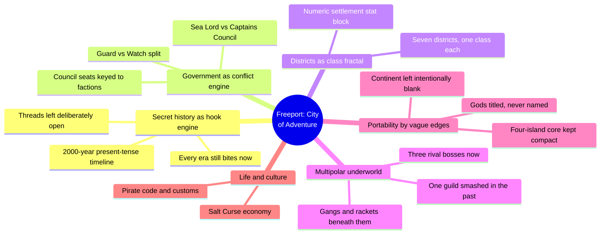
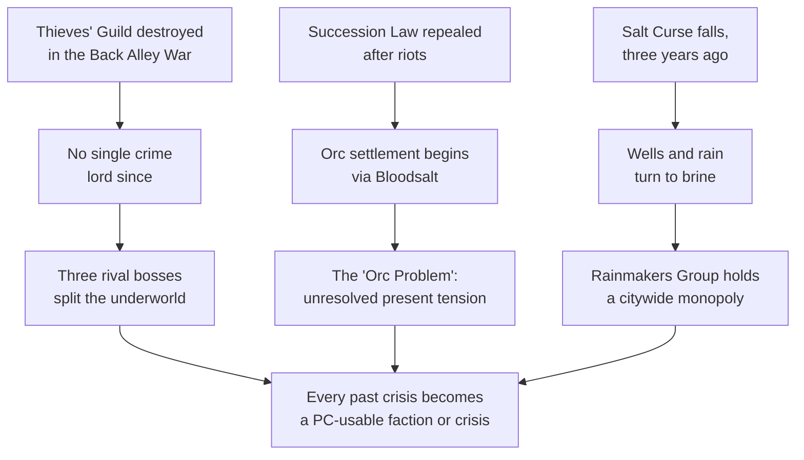
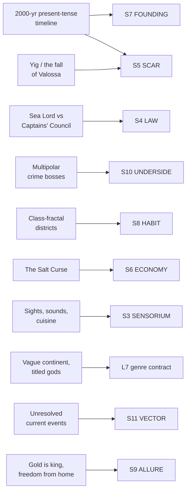

# BVX.1179 — Freeport: The City of Adventure — Chris Pramas et al. (2014)
### Knowledge Entry — Distill

Green Ronin's 543-page Pathfinder-edition core book for Freeport, the "City of Adventure": a single compact city, not a region or nation, engineered from its history down to its crime table to run a whole campaign on its own.

## TABLE OF CONTENTS
- [Core Thesis](#1-core-thesis)
- [Mind Models](#2-mind-models)
- [Framework](#3-framework--structure)
- [Key Concepts](#4-key-concepts)
- [Heuristics](#5-heuristics--decision-rules)
- [Invariants](#6-invariants)
- [Pitfalls](#7-pitfalls--myths)
- [Application](#8-application)
- [Cross-References](#9-cross-references)
- [Provenance](#10-provenance--confidence)

---

## 1 · CORE THESIS

Freeport is a single compact city engineered to carry an entire campaign: a two-thousand-year secret history where every era still bites, a government built to manufacture its own political conflict, and a city whose edges are deliberately vague so it drops into any world unmodified. Depth lives at the center; the frontier is left blank on purpose.

---

## 2 · MIND MODELS

*Required. Minimum two diagrams, maximum five.*

**Diagram 1 — the whole argument.**
Caption: *six design moves, all aimed at the same target -- a city dense enough to run alone, loose enough at the edges to travel anywhere.*

**Diagram 2 — the central mechanism (history converts into live hooks, not settled lore).**
Caption: *every past crisis resolves into a currently active faction or an unresolved tension -- the timeline is a hook generator, not a history lesson.*

**Diagram 3 — mapped onto the Command's SETTING SLICE (S1-S12).**
Caption: *eleven design moves land on eight of twelve SETTING SLICE layers, and the heaviest weight falls on S11 VECTOR -- trajectory kept visibly open rather than resolved.*

---

## 3 · FRAMEWORK / STRUCTURE

The book moves from SETTING craft outward to game crunch: a history chapter that doubles as a hook-and-timeline document; one dense city-overview chapter (districts, life, government, law, religion, underworld); ten gazetteer chapters, one per district, stacked with named locations and NPC stat blocks; then a widening lens -- the Serpent's Teeth island chain, an optional and explicitly skippable cosmology/continent chapter, a Denizens roster, races, and finally the Pathfinder-specific rules back half (classes, gear, spells, a dozen ready-to-run one-shots).

| Slot | Content | SETTING weight |
|---|---|---|
| Introduction | States the book's own design goal: portable, system-agnostic at the edges, Pathfinder-specific in the crunch | Design philosophy |
| Ch. I — History | 2,000-year present-tense timeline, ending in unresolved current events | Heaviest: S5, S7, S11 |
| Ch. II — City of Adventure | Districts, life/culture, government, law and order, religion, criminal underworld | Heaviest: S3, S4, S6, S8, S9, S10 |
| Ch. III–XII — District gazetteers | Named locations, NPC stat blocks, businesses, per district | Instances of the Ch. II framework |
| Ch. XIII — Serpent's Teeth | The wider island chain: geography, weather, the sea itself | S1, S2 |
| Ch. XIV — Beyond Freeport | Optional cosmology and continent, explicitly marked skippable | S5, L7 |
| Ch. XV–XVII, XIX–XX | Denizens, races, classes, gear, spells | Game-mechanical, not SETTING |
| Adventures (back matter) | A dozen ready-to-run one-shots keyed to named Freeport sites | Application layer |

---

## 4 · KEY CONCEPTS

| Concept | What it is | Why it matters |
|---|---|---|
| **Present-tense timeline as current-events document** | A single "years before present" table where founding-era events and last-year's events share one format | History and Current Events are not two documents -- the timeline itself is the hook list |
| **Government as conflict engine** | Sea Lord (absolute, life tenure, unimpeachable) checked by a twelve-seat Captains' Council she needs eight votes from | Political tension is wired into the org chart, not improvised per scene |
| **Guard/Watch split** | Two competing law-enforcement bodies: the militarized, human-only Sea Lord's Guard, and the corrupt, all-races Freeport Watch | "The law" is internally divided by design, so PCs can play one against the other |
| **District as class-plus-danger fractal** | Seven districts, each a numeric settlement stat block (Corruption/Crime/Economy/Law/Lore/Society/Danger) built around one class and one hazard | The same city-scale method Cities of Golarion (BVX.1171) runs across six cities, here run once at neighborhood scale |
| **Multipolar underworld** | No single crime boss since the Thieves' Guild fell in the Back Alley War; three rival bosses (Finn, Mister Wednesday, the Helkernas) plus independent gangs now split the city | A deliberately unresolved power vacuum gives PCs factions to play against each other instead of one villain to topple |
| **The Salt Curse** | A three-year-old curse turning all fresh water to brine, solved only by the Rainmakers Group's unexplained immunity | One environmental crisis threaded through economy, daily life, and a single NPC faction's monopoly |
| **Portability by vague edges** | Gods referred to by title, not name; the wider Continent kept deliberately underspecified; the city itself kept to four compact islands | The book's own stated method for dropping one dense city into any GM's existing world without contradiction |
| **The settlement stat block** | A five-to-seven-line numeric identity card (government, size, GP value, population, Corruption/Crime/Economy/Law/Lore/Society, Danger) preceding every district | Compresses a place's whole flavor to a scannable card before a word of prose, echoing Golarion's city header at neighborhood scale |
| **Deliberately unresolved current events** | An empty council seat awaiting a vote, the still-open "Orc Problem" in Bloodsalt, a mystery ship sinking vessels south of the city one year ago | The book refuses to close its own most recent threads -- vector is handed to the GM unfinished on purpose |
| **The pirate's code as legal substrate** | "Do whatever you want on the high seas, but don't go against your fellows in port" -- the informal rule the formal legal system grew out of | Explains why Freeport's law reads as improvised and personal rather than bureaucratic, even where it is codified |
| **Buried history at two scales** | Serpent-people ruins beneath the literal city (Underside chapter) sit under the political capital beneath the Old City -- physical and social undersides stacked | Two kinds of "underside" running in parallel, not one flattened into the other |

---

## 5 · HEURISTICS & DECISION RULES

| Situation | Do this | Not this |
|---|---|---|
| Writing a setting's history | Write a present-tense timeline where the most recent entries are still open questions | Write history that stops cleanly with "and so it has been ever since" |
| Designing a ruling body | Split power between a figurehead and a council that needs a real vote count to act | Give one ruler unchecked authority with no in-fiction friction |
| Building law enforcement | Split it into two competing bodies with different loyalties, recruiting rules, and reputations | Write a single unified police force with one culture |
| Building a criminal underworld | Break the last dominant syndicate in the backstory and leave several rivals splitting the wreckage | Install one crime boss who owns the whole underworld uncontested |
| Making a setting travel to other campaigns | Keep names generic at the edges (titled gods, a vague wider world) and dense at the center (the one city) | Fully name and fix every god, nation, and neighbor before anyone needs them |
| Giving a district identity fast | Assign one social class and one hazard, then give it a numeric stat-block header | List buildings and population without a class or danger throughline |
| Threading an economic crisis | Run one environmental or resource crisis through daily life, factions, and a single beneficiary faction | Treat economy as a flat price list disconnected from any character or conflict |
| Ending a history/current-events section | Stop on an unresolved vote, an open investigation, or an unexplained recent event | Stop on a tidy resolution that leaves nothing for the GM to finish |

---

## 6 · INVARIANTS

1. **A setting's history is also its hook list.** If an event from the past doesn't explain something active today, it doesn't belong in the present-tense timeline.
2. **A ruling structure without an internal check is inert.** The Sea Lord/Council split, and the Guard/Watch split beneath it, exist because unopposed authority generates no story.
3. **A criminal underworld needs more than one boss to be playable.** A single all-powerful crime lord forecloses faction play; several rivals splitting a recent power vacuum invites it.
4. **Depth at the center requires vagueness at the edge.** The city can be dense only because the wider world around it is deliberately left thin enough to bend to any GM's existing setting.
5. **A district (or any sub-unit) is a class and a danger level first, an architecture second.** The numeric stat-block header states both before a word of description follows.
6. **The most recent history should be the least resolved.** Ending on an open thread, not a closed one, is what makes "current events" different from "backstory."
7. **One crisis can carry economy, daily life, and a faction's power all at once.** The Salt Curse does the work three separate sections would otherwise need.

---

## 7 · PITFALLS / MYTHS

- Writing history that reads as complete and closed, leaving the GM nothing live to hook a session onto.
- Letting one crime boss, cult, or faction quietly own an entire underworld or opposition layer, which kills faction-vs-faction play before it starts.
- Naming and fixing every neighboring nation, deity, and border before any of them is dramatically necessary, closing off the portability the design otherwise buys.
- Treating a settlement stat block as flavor text rather than as the two-line conceit every later section has to answer to.
- Splitting law enforcement into two bodies but forgetting to give them different loyalties, cultures, and blind spots -- the split does no work if both sides behave identically.
- Resolving an environmental or economic crisis fully in the text instead of leaving its beneficiaries and losers as material for play.
- Assuming "systemless" and "portable" mean thin; Freeport is both maximally portable at its edges and maximally dense at its center, not vague throughout.

---

## 8 · APPLICATION

- **Spine level:** SETTING (non-story-spine source; keys to the entity beside the L0-L7 spine, per ssot_03's binding rule that setting is a Domain embodied, never a level)
- **12-layer character stack:** none directly -- a setting-side source; its faction-keyed council seats and named crime bosses are ready seeds if any were promoted into an actual character stack, but the entry itself does not feed a character layer
- **plot_systems:** primary candidate once `04_PLOT_SYSTEMS/` opens -- Diagram 2's history-to-hook chain (event → present consequence → live hook) is a directly reusable generator: take any past crisis in a drafted setting and force it through the same three-step chain before trusting it playable
- **Setting:** primary -- the founding SETTING-shelf entry built around a *single* city as an entire campaign's engine rather than a template run across several (BVX.1171) or a worldbuilding theory (BVX.0458)

The book's most importable move for a science-fiction setting system is the present-tense-timeline-as-current-events-document technique in Diagram 2: write a setting's backstory as a chronological table, but hold every entry to the same test -- does it explain something active right now -- and let the most recent entries stay visibly unresolved rather than wrapping up. A DCUS write-up (or any DCUS-adjacent institution) could run its own founding-through-rebrand history through exactly this test: the rename lattice (Red Stick Creek → Red Hills → DCUS) already reads as this book's Back Alley War equivalent -- a past crisis that explains a present absence (no legacy name survives cleanly) -- but the technique asks for one further step this SSOT hasn't yet taken: an explicitly *unresolved* thread at the most recent end of the timeline, the way Freeport ends on an empty council seat and an unexplained ship sinking vessels a year ago, rather than closing the history at the current Movement's state. The second importable move is the portability method itself (Diagram 3, L7): titled-not-named gods and a deliberately underspecified wider world are what let a single dense city relocate into any campaign, a genre-neutral technique for keeping a setting's core load-bearing while its context stays swappable.

---

## 9 · CROSS-REFERENCES

| Related entry | Relation |
|---|---|
| [[BVX.0458]] | Kobold Guide to Worldbuilding -- theory counterpart; Freeport is the present-tense-history rule taken to book length and given an explicit portability method (titled gods, vague continent) the theory text only gestures at |
| [[BVX.1171]] | Cities of Golarion -- template sibling; both use a numeric settlement stat block and a class-plus-danger district method, but Golarion runs one template across six shallow cities while Freeport runs the same depth into a single city built to be an entire campaign |
| [[BVX.1122]] | GURPS Hot Spots: Renaissance Venice -- single-deep-city sibling; Venice is the historical-grounding end of the single-city method, Freeport the invented-portable-pirate-city end, both worked examples at the same depth |
| [[BVX.0067]] | Collaborative Worldbuilding for Writers and Gamers -- undistilled SETTING-shelf sibling, same craft-not-theory register |

---

## 10 · PROVENANCE & CONFIDENCE

Full text, pdftotext extraction, 543pp, clean text layer with a machine-readable table of contents. Read in full: the Introduction; the complete History chapter (Chapter I, including the "A Freeport Timeline" table); the complete City of Adventure overview (Chapter II: Lay of the Land/Districts, Getting Around, Life in Freeport, Government, Sea Lord's Guard, the Admiralty, Law and Order/Freeport Watch, Crime and Punishment, Religion, Criminal Underworld); and the cosmology-and-portability-statement passages opening Chapter XIV (Beyond Freeport: "In the Beginning," "The World of Freeport," the stated design rationale for keeping the Continent deliberately vague). Sampled via targeted grep and ranged reads: the opening of the Docks gazetteer chapter (Chapter III, confirming the per-district settlement stat block format repeats). Not separately read: the remaining nine district gazetteer chapters (IV-XII, largely named-location and NPC stat-block listings), the Denizens/Races chapters (XV-XVI), the Pathfinder-specific game-mechanical chapters (Classes, Skills, Feats, Spells, Magic Items, Chapter XVII-XX), and the ready-to-run adventure back matter -- all outside this distill's SETTING-shelf scope (craft method, not game statistics or individual NPC write-ups).

The S-layer keying in frontmatter `feeds:` and Diagram 3 is this distill's synthesis against `ssot_03_setting_system.md` (PART A, the twelve-layer SETTING SLICE), read directly to confirm the S1-S12 names and the S2 WEATHER canon-thin flag already on record for DCUS. The `spine: [SETTING]` and empty character-stack application are asserted per the v4 template's binding rule (setting is an entity beside the spine, never an L0-L7 level).

## META
- Template: BVX-LEARN-v4.0
- Source classification: full-text sourcebook, deep extraction on introduction + history + city-overview chapter + cosmology opening, sampled on 1 district chapter, summarized (not extracted) on game-mechanical back matter
- Created / Updated: 2026-09-29
