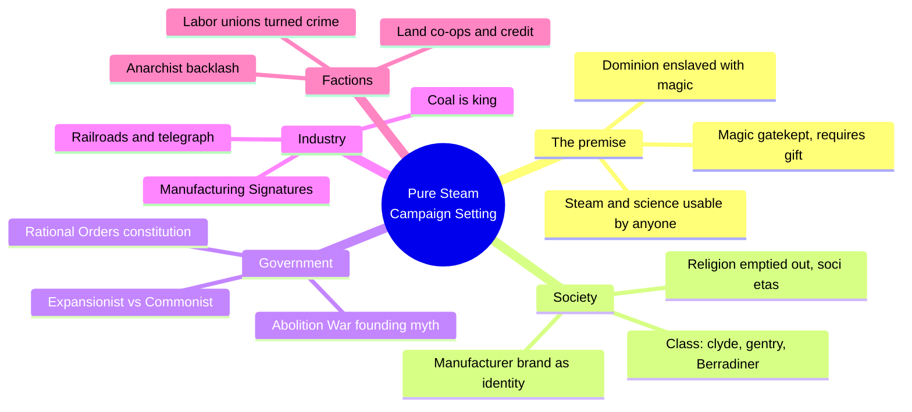
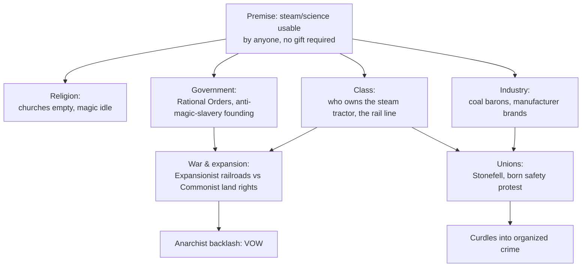
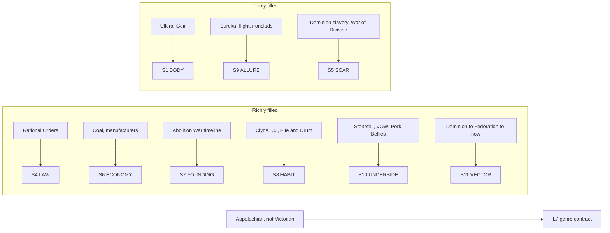

# BVX.1180 — Pure Steam Campaign Setting — Adam Crockett et al., ICOSA Entertainment (2012)

### Knowledge Entry — Distill

A Pathfinder-compatible steampunk sourcebook, read here not for its crunch but as a worked setting: one tech premise (steam and science any commoner can use, replacing magic only a gifted few can) run all the way through religion, class, government, industry, and war.

## TABLE OF CONTENTS
- [Core Thesis](#1-core-thesis)
- [Mind Models](#2-mind-models)
- [Framework](#3-framework--structure)
- [Key Concepts](#4-key-concepts)
- [Heuristics](#5-heuristics--decision-rules)
- [Invariants](#6-invariants)
- [Pitfalls](#7-pitfalls--myths)
- [Application](#8-application)
- [Cross-References](#9-cross-references)
- [Provenance](#10-provenance--confidence)

---

## 1 · CORE THESIS

Pure Steam's founding premise, science any commoner can wield outcompetes magic only the gifted can, doesn't stay a gadget rule: it reshapes religion (empty churches), politics (a technocratic Federation born from an anti-slavery, anti-magic revolt), class (who owns the steam tractor), and war (railroads as land-grab machinery). One tech premise, run through every layer, is the whole design lesson.

---

## 2 · MIND MODELS

*Required. Minimum two diagrams, maximum five.*

**Diagram 1 — the whole argument.**
Caption: *one premise (democratized steam beats gatekept magic) and everything else in the book, races, classes, law, industry, factions, is that premise working itself out at a different scale.*

**Diagram 2 — the central mechanism (a premise, run through every layer of society).**
Caption: *the same displacement, common tech beating gatekept power, produces a different downstream effect at each layer; none of those effects were separately designed, they all fall out of the one premise.*

**Diagram 3 — mapped onto the Command's SETTING SLICE (S1-S12).**
Caption: *the book fills law, economy, founding, habit, and underside richly because those are exactly where a tech-versus-class premise has to land; body and weather stay thin because geography was never the point.*

---

## 3 · FRAMEWORK / STRUCTURE

The book is organized as a rules-first Pathfinder supplement, but its worldbuilding lives in a handful of load-bearing passages that the crunch hangs off of:

| Section | What it establishes | What it hands downstream |
|---|---|---|
| **Intro** ("What in Tarnation?!") | Genre commitment: Appalachian, not Victorian; coal is king; re-derived history | The tone every later chapter matches |
| **Eureka!** (frame narrative) | Pure steam itself is a lost, hunted energy source, the setting's MacGuffin | S9 allure, the reason anyone wants this tech |
| **Races** | Each subrace's origin is already a tech-and-history story (Brey as empire marines, Borndrin enslaved then scattered) | Peoples pre-loaded with the book's class and conflict lines |
| **Science / Fields of Science** | The explicit case for science displacing magic: usable by the common man, fuel not gift | The premise stated as doctrine, not just tone |
| **Ullera** (geography + Timeline) | 10,000+ years compressed to one timeline; the Abolition War as founding trauma | S7 founding, S11 vector, dates every faction cites |
| **The Rational Orders** | A nine-article constitution in Latin-titled clauses | S4 law as direct legal residue of the founding revolt |
| **Regional chapters** (Bastion, Sunderland, Keystone) | Local instances: Expansionist railroads vs. Commonist land rights, mine-safety politics | Proof the premise is re-run region by region, not stated once |
| **Factions** | Unions, communes, crime rings, fraternities, anarchist cells, each keyed to alignment, membership, activities | S8 habit and S10 underside as a roster, not a paragraph |

The book never states "technology drives class conflict" as a thesis. It states the premise once (Science, p.85), then lets every region and faction demonstrate it independently. The reader assembles the thesis from the pattern.

---

## 4 · KEY CONCEPTS

| Concept | What it is | Why it matters |
|---|---|---|
| **The displacement premise** | Scientific technology is usable by anyone with fuel, no spell knowledge; magic needs an inborn gift and years of apprenticeship | Downstream of one sentence: "technology made the lives of the common folk so comfortable that they simply ceased crying out for higher powers" |
| **Founding-through-oppression** | The Federation exists because the Dominion used magic to enslave; the Rational Orders are a direct legal reaction to that history | Law reads as arbitrary until you know what it was written to prevent |
| **Soci etas** | Chaplains practice a "magic" that is really sociology, personality effects from mass interaction, not supernatural power | Even the exception to "magic is gone" is written to prove the premise, not to break it |
| **Manufacturing Signatures** | Named companies (Davro Designs, Mayrbronne, Savig, UMBO) sell the same item with different branded bonuses and drawbacks | Industry as purchasable identity: your gear names your company, and by extension your class fraction |
| **Expansionist / Commonist split** | Railroad-driven land-grab settlers vs. working-class immigrants and native peoples defending shared land, fought to a real civil war | A tech-enabled land rush produces a political fracture, not a footnote, a war |
| **Labor turned racket** | The Stonefell Union of Mineworkers begins as a genuine mine-safety protest, is then captured by organized crime | Institutions born from a real grievance can be captured; the setting tracks that second move instead of freezing the origin |
| **Credit-and-capital co-op (C3)** | The Commonist Crop Commune pools steam-tractor ownership so poor immigrant farmers can afford mechanization, then leverages it into political power | Technology *access*, not the technology, is the actual class lever |
| **Class as vocabulary** | "Clyde" (itinerant laborer, no fixed home), "Berradiner" (stubborn local subculture), "Pork Bellies" (corrupt police) | Class stratification lives in slang, no "class system" chapter needed |
| **Genre-contract statement** | The intro rejects "Victorian" for "Appalachian," and re-derives history from the dawn of time rather than reskinning the real 1800s | A worked instance of Baur's "pick a lineage before writing" heuristic (BVX.0458) |

---

## 5 · HEURISTICS & DECISION RULES

| Situation | Do this | Not this |
|---|---|---|
| Deciding what a new technology displaces | Trace what it makes obsolete (here: magic, and by extension religion and the old aristocracy that controlled it) before detailing what it enables | Add the technology as a new option alongside everything that already existed, unchanged |
| Writing a setting's founding myth | Tie the government's actual laws to the specific oppression the founding revolt was against | Write a constitution as generic scene-dressing disconnected from the history chapter |
| Populating factions | Give each faction a plausible origin (a grievance, a business need, a subculture) that the tech-and-class premise explains | Invent factions as a grab-bag of adventure-hook providers with no shared cause |
| Showing class without a lecture | Encode it in slang, brand names, and faction membership lists (who joins, who's excluded) | State "there is a class system" and describe it abstractly |
| Letting an institution evolve | Let a union, church, or company drift from its founding purpose under pressure (safety protest to racket) | Freeze every institution at its most flattering origin story forever |
| Building regional variety | Re-run the same premise locally with different specifics (the Bastion's railroads, Keystone's mine safety) instead of inventing an unrelated conflict per region | Give each region a bespoke, thematically disconnected problem just for variety |
| Handling the "why hasn't magic disappeared" hole | Keep magic present but marginalized and explain the marginalization mechanically (fewer apprentices, museum pieces, disused churches) | Simply remove the old system without narrating why it lost |

---

## 6 · INVARIANTS

1. **A tech premise that changes who can wield power changes every layer it touches, not just the layer it was introduced for.** Steam's real effect in this setting isn't better guns, it's a new founding myth, a new legal code, and a new class fault line.
2. **Founding violence explains present law.** A constitution, a border policy, or a standing-army rule reads as arbitrary unless tied back to what the founders were reacting against.
3. **Institutions drift from their origin under pressure.** A protest movement, a religious order, or a trade guild is not obligated to stay what it started as; tracking the drift (Stonefell) is more honest than freezing it.
4. **Access to the technology, not the technology itself, is the class lever.** Steam tractors, rail lines, and helium refineries matter because who controls them decides who has leverage, not because of their raw capability.
5. **A displaced old order (magic, the old church, the old aristocracy) leaves visible residue.** Empty churches, unread spellbooks, and museum-cased magic items are the wreckage a premise leaves behind; they cost nothing to write and do real world-texture work.
6. **Regional instances should reuse the central premise, not invent parallel ones.** Every region chapter that works here re-runs the tech-versus-class-versus-politics engine locally; the ones that would feel bolted-on are the ones that wouldn't.

---

## 7 · PITFALLS / MYTHS

- Treating a "cool tech premise" as a worldbuilding decoration instead of tracing its consequences through law, class, and religion the way this book does with steam versus magic.
- Writing a founding-war backstory that never touches present-day law, politics, or slang, the opposite of the Rational Orders' direct lineage from the Abolition War.
- Giving every faction a flattering, static origin story instead of letting some of them curdle (Stonefell) or split along the premise's own fault lines (Expansionist vs. Commonist).
- Assuming class has to be an explicit "class system" chapter; it can live entirely in brand names, slang terms, and faction membership rosters, as it does here.
- Removing an old power structure (magic) without narrating the mechanism of its loss, apprentices stopped enrolling, common tech outcompeted it on convenience, not simply declaring it gone.
- Building regional chapters as unrelated adventure locales instead of local re-runs of the same central premise.

---

## 8 · APPLICATION

- **Spine level:** SETTING (non-story-spine source; keys to the entity beside the L0–L7 spine, per ssot_03's binding rule that setting is a Domain embodied, never a level)
- **12-layer character stack:** none directly, this is a setting-side source; its "one premise ripples through every layer" method is structurally the same move as tracing an L6 DRIVE want through its costs across a whole cast, but it is not itself a character-layer feed
- **plot_systems:** contextual candidate once `04_PLOT_SYSTEMS/` opens; the Expansionist/Commonist War of Division and the Stonefell union-to-racket arc are ready-made worked examples of a setting-level conflict generating scene-level hooks region by region
- **Setting:** primary, a second worked-setting data point beside GURPS Hot Spots: Renaissance Venice (BVX.1122), this time proving the "one tech premise ripples through every layer" method the SETTING SLICE schema is meant to capture, at the region-and-faction scale rather than the single-city scale

Tested against the SETTING SLICE: this source fills S4 LAW, S6 ECONOMY, S7 FOUNDING, S8 HABIT, S10 UNDERSIDE, and S11 VECTOR richly, exactly the social and political layers a class-and-technology premise has to land on, while S1 BODY and S2 WEATHER stay thin, confirming the worldbuilding energy went into society, not terrain. Where BVX.1122 (Venice) builds one settlement body-first, this book builds a whole region premise-first: the steam-versus-magic displacement is stated once, then re-instanced across every region, faction, and law it contains. The transferable move for a science-fiction setting built on one tech premise is Diagram 2 above: pick the one displacement your technology causes, and check it against religion, law, class, and war in turn. A faction, region, or institution that carries no trace of that displacement is a candidate for cutting or rewriting until it does.

---

## 9 · CROSS-REFERENCES

| Related entry | Relation |
|---|---|
| [[BVX.1122]] | GURPS Hot Spots: Renaissance Venice, the other worked-setting SETTING SLICE instance; that one builds one city body-first, this one builds a whole region premise-first, complementary methods for the same schema |
| [[BVX.0458]] | Kobold Guide to Worldbuilding, the craft-book theory counterpart; this book is a live instance of Baur's "pick a genre lineage" and "conflict-first" heuristics, done as an actual product rather than advice |
| [[BVX.0349]] | Kennedy, *Against Worldbuilding*, the counter-argument that worldbuilding should serve pressure, not inventory; this book's pattern (one premise, run everywhere, rather than an encyclopedia of unrelated detail) is a working example of taking that warning seriously |

---

## 10 · PROVENANCE & CONFIDENCE

Full text, pdftotext extraction, 227pp, mostly clean text layer with a few corrupted/garbled decorative-font passages (the "Eureka!" journal page and a mock-newspaper sidebar on the Abolition War render as scrambled character soup in extraction and were skipped as unreadable, not load-bearing to the setting argument). Read closely: the introduction ("What in Tarnation?!", "Eureka!"); the Dwarf/Brey/Drague race entries for their embedded origin-and-conflict history; the Fields of Science passage that states the tech-displaces-magic premise directly; the full Timeline of Ulleran History and the Rational Orders constitution; the Manufacturing Signatures section; the Bastion regional chapter (Expansionist/Commonist history and the War of Division); and the Factions chapter in full (Atlas Transports, Calico Raiders, Commonist Crop Commune, Crowley & Sons, Exogenesis Orchards, Fife & Drum Fraternity, Five Points Symphonic Labs, Harvest Gypsies, Stonefell Union of Mineworkers, and the VOW entry). Sampled at heading level only: the extensive class, feat, equipment, and monster-statistics chapters (Chaplain, Gearhead, Alchemist archetypes, Technology, Vehicles, Monsters), which are Pathfinder crunch with no additional setting content beyond what the race and science sections already establish.

The S-layer keying in frontmatter `feeds:` and Diagram 3 is this distill's synthesis against `ssot_03_setting_system.md` (PART A, the twelve-layer SETTING SLICE), matching the variable-naming convention BVX.1122 already established for worked-setting sourcebooks. `zotero_key` was not resolvable from available tooling in this session and is left `"none"` per the convention set by BVX.1168; a future pass against the live Zotero database should backfill it. `spine: [SETTING]` and the empty character-stack application follow the v4 template's binding rule that setting sits beside the L0–L7 spine, never on it.

## META
- Template: BVX-LEARN-v4.0
- Source classification: full-text sourcebook, deep extraction on intro/races/science/Ullera history/Rational Orders/Bastion/Factions, sampled on crunch-only chapters
- Created / Updated: 2026-09-29
